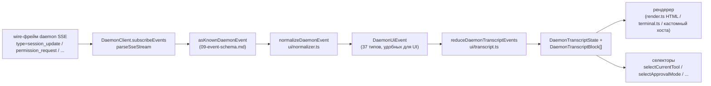

# Общий слой транскрипта UI

> **Текущий статус**: `packages/cli/src/ui/daemon/daemon-tui-adapter.ts` все еще присутствует в `main` как устаревший экспериментальный адаптер на стороне CLI. В этом документе описывается более новый общий слой транскрипта UI на стороне SDK: переиспользуемые примитивы нормализации событий демона и транскрипта, которые может использовать любой UI-хост, включая веб, TUI, IDE и IM-каналы. Миграции CLI TUI, каналов и VS Code IDE будут выполнены в рамках последующих задач.

## Обзор

`packages/sdk-typescript/src/daemon/ui/` добавляет подпакет `ui/*` в SDK. Он превращает поток SSE-событий демона в блоки транскрипта, пригодные для рендеринга в UI, с помощью переиспользуемых примитивов:

- **Нормализация** (`normalizer.ts`): сопоставляет 47 известных типов событий wire-схемы демона (см. [`09-event-schema.md`](./09-event-schema.md)) с 37 семантическими событиями `DaemonUiEventType`, удобными для UI, такими как `assistant.text.delta`, `tool.update` и `session.metadata.changed`.
- **Конечный автомат** (`transcript.ts`, `store.ts`): чистый редьюсер и стор с поддержкой подписки, которые проецируют события UI в упорядоченный массив `DaemonTranscriptBlock[]`.
- **Рендереры** (`render.ts`, `terminal.ts`, `toolPreview.ts`): преобразуют блоки транскрипта в HTML, текст терминала и строки предпросмотра инструментов. Хосты могут использовать их или заменить своими.
- **Соответствие** (`conformance.ts`): кросс-хостовые тесты на согласованность, используемые при миграции каналов, TUI и IDE на эти примитивы.

Первым production-потребителем является **`packages/webui/src/daemon/`** ([#4328](https://github.com/QwenLM/qwen-code/pull/4328)). Его React-`DaemonSessionProvider` и адаптер транскрипта позволяют веб-UI подключаться напрямую к HTTP+SSE демона вместо того, чтобы просто рендерить трафик `postMessage` хоста. CLI TUI, база каналов и VS Code IDE смогут переиспользовать этот же слой позже; [`../daemon-ui/MIGRATION.md`](../daemon-ui/MIGRATION.md) документирует руководство по инкрементальной миграции v2.

## Зоны ответственности

- Нормализует 47 wire-событий демона в стабильный UI-словарь (`DaemonUiEventType`), чтобы рендерерам не приходилось проверять `rawEvent.data`.
- Сохраняет монотонный SSE `eventId` демона в качестве **первичного ключа сортировки**, чтобы разные клиенты рендерили транскрипты в одном и том же порядке.
- Использует чистый редьюсер для создания блоков транскрипта с селекторами для ожидающих разрешений, текущего инструмента, режима одобрения, прогресса инструмента и дочерних подагентов.
- Предоставляет базовые HTML- и терминальные рендереры, допуская при этом специфичный для хоста рендеринг.
- Предоставляет публичные константы, такие как `DAEMON_PLAN_TOOL_CALL_ID` для панелей плана.
- Сохраняет аддитивную wire-совместимость: неизвестные типы событий нормализуются в `debug` вместо того, чтобы отбрасываться.

## Архитектура

### Структура пакета

| Файл                                             | Экспорты                                                                                                                                                           | Назначение                     |
| ------------------------------------------------ | ----------------------------------------------------------------------------------------------------------------------------------------------------------------- | --------------------------- |
| `packages/sdk-typescript/src/daemon/ui/index.ts` | Barrel подпакета                                                                                                                                                 | Публичная точка входа          |
| `ui/types.ts`                                    | `DaemonUiEventType`, интерфейсы `DaemonUiEvent*` для каждого типа, `DaemonTranscriptBlock`, `DaemonTranscriptState`, `DaemonUiToolProvenance`, `DAEMON_PLAN_TOOL_CALL_ID` | Типы                       |
| `ui/normalizer.ts`                               | `normalizeDaemonEvent(evt) -> DaemonUiEvent`, `getSessionUpdatePayload(evt)`                                                                                      | Маппинг wire-событий в UI          |
| `ui/transcript.ts`                               | `createDaemonTranscriptState()`, `appendLocalUserTranscriptMessage()`, `reduceDaemonTranscriptEvents()`, `rebuildDaemonTranscriptBlockIndex()`, селекторы         | Конечный автомат и селекторы |
| `ui/store.ts`                                    | `createDaemonTranscriptStore(initial?)`                                                                                                                           | Стор редьюсера с поддержкой подписки  |
| `ui/toolPreview.ts`                              | `createDaemonToolPreview(toolEvent)`                                                                                                                              | Сводный текст вызова инструмента      |
| `ui/render.ts`                                   | `DaemonHtmlRenderOptions`, `DaemonRenderOptions`, функции рендеринга                                                                                                | HTML и общий рендеринг  |
| `ui/terminal.ts`                                 | Специфичный для терминала рендеринг                                                                                                                                       | Подготовка TUI             |
| `ui/conformance.ts`                              | Кросс-хостовый набор тестов на соответствие                                                                                                                                      | Тесты на паритет миграции      |
| `ui/utils.ts`                                    | Хелперы, такие как `DaemonUiContentPart`                                                                                                                             | Внутренние переиспользуемые утилиты   |

### Словарь DaemonUiEventType

`ui/types.ts` определяет 37 типов событий UI, сгруппированных по доменам.

**Поток чата (Этап 1)**

- `user.text.delta`, `user.image.delta`, `user.shell.command`, `assistant.text.delta`, `assistant.done`, `thought.text.delta`
- `tool.update`, `shell.output`, `user.shell.output`
- `permission.request`, `permission.resolved`
- `model.changed`, `status`, `error`, `debug`

**Метаданные сессии**

- `session.metadata.changed`, `session.approval_mode.changed`
- `session.available_commands`, `session.state_resync_required`, `session.replay_complete`

**Жизненный цикл промпта (кросс-клиентский)**

- `prompt.cancelled`, `followup.suggestion`

**Рабочее пространство (Волны 3-4)**

- `workspace.memory.changed`, `workspace.agent.changed`
- `workspace.tool.toggled`, `workspace.settings.changed`, `workspace.initialized`
- `workspace.mcp.budget_warning`, `workspace.mcp.child_refused`
- `workspace.mcp.server_restarted`, `workspace.mcp.server_restart_refused`

**Поток аутентификации (Волна 4 OAuth)**

- `auth.device_flow.started`, `auth.device_flow.throttled`, `auth.device_flow.authorized`
- `auth.device_flow.failed`, `auth.device_flow.cancelled`

`normalizeDaemonEvent` сопоставляет 47 известных wire-событий демона с этим словарем. Неизвестные, не смоделированные или некорректные типы событий нормализуются в `debug` и сохраняют `rawEvent` для диагностики хоста.

### Редьюсер и селекторы

```ts
// Создание начального состояния.
const state = createDaemonTranscriptState();

// Применение последовательности SSE-событий.
const next = reduceDaemonTranscriptEvents(state, daemonUiEvents);

// Селекторы.
selectTranscriptBlocks(state); // все блоки
selectTranscriptBlocksOrderedByEventId(state); // отсортировано по eventId; предпочтительный ключ
selectPendingPermissionBlocks(state);
selectCurrentTool(state);
selectApprovalMode(state);
selectToolProgress(state, toolCallId);
selectSubagentChildBlocks(state, parentBlockId);
isSubagentChildBlock(block);
formatBlockTimestamp(block);
formatMissedRange(state); // текст "you missed X" после state_resync_required
```

### Store

`createDaemonTranscriptStore()` предоставляет подписку и диспатч:

```ts
const store = createDaemonTranscriptStore();
store.subscribe(() => render(store.getState()));
store.dispatch(uiEvents); // внутри запускает редьюсер
```

`DaemonSessionProvider` веб-UI строит свой React-контекст поверх этого стора.

## Поток данных

### Сквозной путь одного SSE-события



Хосты могут остановиться на `(E)` и реализовать собственный редьюсер, или потреблять `(G)` и предоставленные селекторы. Веб-UI использует полный путь `(B) -> (H)`. Мигрированный TUI может потреблять `(G)` и рендерить с помощью специфичных для Ink компонентов.

### `state_resync_required`

`session.state_resync_required` сопоставляется с маркером "пропущенного диапазона" в транскрипте. UI-код может вызвать `formatMissedRange(state)` для рендеринга текста вроде "пропущены события X-Y". Редьюсер **продолжает применять последующие события**, но помечает затронутые блоки флагом `resyncRecovery: true`, чтобы рендереры могли добавить визуальный контекст. См. [`10-event-bus.md`](./10-event-bus.md) для получения информации о семантике ring-eviction и `state_resync_required`.

## Потребители

### `packages/webui/src/daemon/`

Это было добавлено в [#4328](https://github.com/QwenLM/qwen-code/pull/4328).

| Файл                        | Экспорты                                                                                                                                                                                                                                                                                                                        |
| --------------------------- | ------------------------------------------------------------------------------------------------------------------------------------------------------------------------------------------------------------------------------------------------------------------------------------------------------------------------------ |
| `DaemonSessionProvider.tsx` | React `<DaemonSessionProvider />`; хуки `useDaemonSession()`, `useDaemonTranscriptStore()`, `useDaemonTranscriptState()`, `useDaemonTranscriptBlocks()`, `useDaemonPendingPermissions()`, `useDaemonActions()`, `useDaemonConnection()`; типы `DaemonConnectionStatus`, `DaemonConnectionState`, `DaemonSessionContextValue` |
| `transcriptAdapter.ts`      | Адаптирует `DaemonTranscriptBlock` из SDK в `UnifiedMessage` веб-UI, включая слияние чанков потокового markdown и сводки вызовов инструментов                                                                                                                                                                                        |
| `index.ts`                  | Barrel подпакета                                                                                                                                                                                                                                                                                                              |

Теперь веб-UI может подключаться напрямую к HTTP+SSE демона и рендерить транскрипт. Старый путь хоста `postMessage` через `ACPAdapter` остается доступным.

### Последующие миграции

[`../daemon-ui/MIGRATION.md`](../daemon-ui/MIGRATION.md) предоставляет инкрементальное руководство v2 для адаптеров веб-чата и веб-терминала. В нем явно указано, что **CLI TUI, база каналов и VS Code IDE не мигрируются в этом PR**; каждый из них будет перенесен в последующих PR и будет использовать набор тестов на соответствие для сохранения паритета рендеринга.

## Отличие от устаревшего daemon-tui-adapter.ts

| Аспект         | Устаревший CLI `DaemonTuiAdapter`                                   | Новый общий слой транскрипта                                    |
| ----------------- | --------------------------------------------------------------- | -------------------------------------------------------------- |
| Пакет           | `packages/cli/src/ui/daemon/`                                   | `packages/sdk-typescript/src/daemon/ui/`                       |
| Публичный интерфейс    | `DaemonTuiAdapter`, `DaemonTuiUpdate`, `DaemonTuiSessionClient` | `DaemonUiEventType`, `reduceDaemonTranscriptEvents`, селекторы |
| Область применения             | Только CLI Ink TUI                                                | Веб, TUI, IDE или IM UI                                        |
| Форма состояния       | Локальный для TUI union обновлений                                          | Чистый список блоков транскрипта плюс поля состояния                   |
| Сортировка          | `createdAt`                                                     | `eventId` (монотонный для демона, согласованный между клиентами)        |
| Неизвестный тип wire-события | Отбрасывается в `reduceDaemonEventToTuiUpdates`                      | Нормализуется в `debug` и сохраняется                            |
| Тесты             | Модульные тесты в рамках одного пакета                                       | Глобальный набор тестов на соответствие для кросс-хостового паритета                 |

## Зависимости

- Wire-типы из вышестоящего кода: `packages/sdk-typescript/src/daemon/events.ts` (см. [`09-event-schema.md`](./09-event-schema.md)).
- Реальный нижестоящий потребитель: `packages/webui/src/daemon/`.
- Цели для последующей миграции: `packages/cli/src/ui/`, `packages/channels/base/` и `packages/vscode-ide-companion/src/services/daemonIdeConnection.ts`.
- Параллельные ссылки: [`../daemon-ui/README.md`](../daemon-ui/README.md), [`../daemon-ui/MIGRATION.md`](../daemon-ui/MIGRATION.md) и [`../daemon-client-adapters/web-ui.md`](../daemon-client-adapters/web-ui.md).

## Конфигурация

- Отсутствует runtime-конфигурация. Редьюсеры и селекторы являются чистыми функциями.
- Хосты выбирают свой рендерер: HTML (`render.ts`), терминал (`terminal.ts`) или кастомный рендеринг.
- Для отладки `render.ts` поддерживает `includeRawEvent: true` для включения сырого wire-фрейма в отрендеренный вывод.

## Ограничения и известные нюансы

- **`daemon-tui-adapter.ts` все еще существует**. Это устаревший экспериментальный адаптер пакета CLI. В новом коде следует предпочитать SDK `ui/*`: `normalizeDaemonEvent`, `reduceDaemonTranscriptEvents` и `DaemonTranscriptBlock`.
- **CLI TUI, база каналов и VS Code IDE еще не мигрированы**. Они по-прежнему используют собственную логику рендеринга. В директории `docs/developers/daemon-client-adapters/` все еще находятся `ide.md`, `channel-web.md` и исторический черновик `tui.md`; более новый `web-ui.md` описывает дизайн адаптера веб-UI.
- **`eventId` является первичным ключом сортировки**. `createdAt` остается как устаревший алиас (`clientReceivedAt`). В новом коде следует использовать `selectTranscriptBlocksOrderedByEventId(state)`. В `MIGRATION.md` показан diff кода для переключения с сортировки по `createdAt` на сортировку по `eventId`.
- **Неизвестные типы wire-событий нормализуются в `debug`**. Они больше не отбрасываются, как в старом адаптере. Рендереры не отображают `debug` по умолчанию; хосты должны явно включить его отображение.
- **Размер бандла**: подпакет `ui/*` экспортируется как ESM-подпуть через `@qwen-code/sdk/daemon` и не подтягивает зависимости React или DOM. Интеграция с React загружается только тогда, когда потребитель веб-UI использует `DaemonSessionProvider`.

## Ссылки

- `packages/sdk-typescript/src/daemon/ui/types.ts` (словарь `DaemonUiEventType`)
- `packages/sdk-typescript/src/daemon/ui/transcript.ts` (редьюсер и селекторы)
- `packages/sdk-typescript/src/daemon/ui/normalizer.ts` (маппинг wire-событий в UI)
- `packages/sdk-typescript/src/daemon/ui/store.ts`, `render.ts`, `terminal.ts`, `toolPreview.ts`, `conformance.ts`
- `packages/sdk-typescript/src/daemon/index.ts` (блок реэкспорта `ui/*`)
- `packages/webui/src/daemon/DaemonSessionProvider.tsx`, `transcriptAdapter.ts`
- Вышестоящая документация: [`../daemon-ui/README.md`](../daemon-ui/README.md), [`../daemon-ui/MIGRATION.md`](../daemon-ui/MIGRATION.md), [`../daemon-client-adapters/web-ui.md`](../daemon-client-adapters/web-ui.md)
- Контекстные PR: [#4328](https://github.com/QwenLM/qwen-code/pull/4328) (слой транскрипта v1 и провайдер веб-UI), [#4353](https://github.com/QwenLM/qwen-code/pull/4353) (последующее унифицированное дополнение v2)