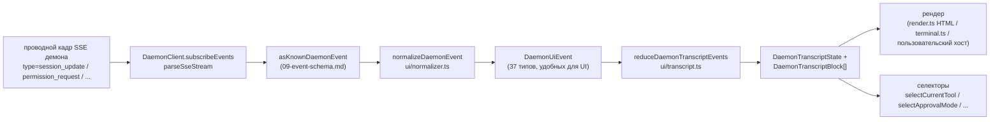

# Общий слой UI-транскриптов

> **Текущий статус**: `packages/cli/src/ui/daemon/daemon-tui-adapter.ts` всё ещё присутствует на `main` как устаревший экспериментальный адаптер CLI. Этот документ описывает новый, расположенный в SDK общий слой UI-транскриптов: переиспользуемую нормализацию событий демона и примитивы транскриптов, которые может использовать любой UI-хост, включая Web, TUI, IDE и IM-каналы. Миграция CLI TUI, канала и VS Code IDE — последующая работа.

## Обзор

`packages/sdk-typescript/src/daemon/ui/` добавляет подпакет `ui/*` в SDK. Он превращает SSE-поток событий демона в отображаемые блоки транскрипта с помощью переиспользуемых примитивов:

- **Нормализация** (`normalizer.ts`): сопоставляет 43 известных типа событий схемы проводов демона (см. [`09-event-schema.md`](./09-event-schema.md)) в 37 семантических событий `DaemonUiEventType`, удобных для UI, таких как `assistant.text.delta`, `tool.update` и `session.metadata.changed`.
- **Конечный автомат** (`transcript.ts`, `store.ts`): чистый редьюсер плюс подписываемое хранилище, которые проецируют UI-события в упорядоченный массив `DaemonTranscriptBlock[]`.
- **Рендеры** (`render.ts`, `terminal.ts`, `toolPreview.ts`): блоки транскрипта в HTML, текст терминала и строки предпросмотра инструментов. Хосты могут использовать или заменять их.
- **Конформность** (`conformance.ts`): кросс-хостовые тесты на согласованность, используемые при миграции поверхностей канала, TUI и IDE на эти примитивы.

Первый производственный потребитель — **`packages/webui/src/daemon/`** ([#4328](https://github.com/QwenLM/qwen-code/pull/4328)). Его React-компонент `DaemonSessionProvider` и адаптер транскрипта позволяют веб-интерфейсу напрямую подключаться к HTTP+SSE демона вместо отображения только трафика `postMessage` хоста. CLI TUI, база канала и VS Code IDE могут позже использовать тот же слой; [`../daemon-ui/MIGRATION.md`](../daemon-ui/MIGRATION.md) документирует пошаговое руководство по миграции v2.

## Обязанности

- Нормализовать 43 события проводов демона в стабильный UI-словарь (`DaemonUiEventType`), чтобы рендеры не инспектировали `rawEvent.data`.
- Использовать монотонно возрастающий SSE `eventId` демона в качестве **основного ключа упорядочивания**, чтобы разные клиенты отображали транскрипты в одном порядке.
- Использовать чистый редьюсер для создания блоков транскрипта с селекторами для ожидающих разрешений, текущего инструмента, режима одобрения, прогресса инструмента и дочерних элементов субагента.
- Предоставлять базовые HTML- и терминальные рендеры с возможностью замены на специфичные для хоста.
- Экспортировать публичные константы, такие как `DAEMON_PLAN_TOOL_CALL_ID`, для панелей планов.
- Обеспечивать аддитивную совместимость проводов: неизвестные типы событий нормализуются в `debug`, а не отбрасываются.

## Архитектура

### Структура пакета

| Файл                                          | Экспорты                                                                                                                                                           | Назначение                   |
| --------------------------------------------- | ----------------------------------------------------------------------------------------------------------------------------------------------------------------- | ---------------------------- |
| `packages/sdk-typescript/src/daemon/ui/index.ts` | Баррель подпакета                                                                                                                                                 | Публичная точка входа         |
| `ui/types.ts`                                 | `DaemonUiEventType`, потипные интерфейсы `DaemonUiEvent*`, `DaemonTranscriptBlock`, `DaemonTranscriptState`, `DaemonUiToolProvenance`, `DAEMON_PLAN_TOOL_CALL_ID` | Типы                         |
| `ui/normalizer.ts`                            | `normalizeDaemonEvent(evt) -> DaemonUiEvent`, `getSessionUpdatePayload(evt)`                                                                                      | Отображение провод-UI         |
| `ui/transcript.ts`                            | `createDaemonTranscriptState()`, `appendLocalUserTranscriptMessage()`, `reduceDaemonTranscriptEvents()`, `rebuildDaemonTranscriptBlockIndex()`, селекторы         | Конечный автомат и селекторы  |
| `ui/store.ts`                                 | `createDaemonTranscriptStore(initial?)`                                                                                                                           | Подписываемое хранилище редьюсера |
| `ui/toolPreview.ts`                           | `createDaemonToolPreview(toolEvent)`                                                                                                                              | Сводный текст вызова инструмента |
| `ui/render.ts`                                | `DaemonHtmlRenderOptions`, `DaemonRenderOptions`, функции рендеринга                                                                                             | HTML и общий рендеринг        |
| `ui/terminal.ts`                              | Терминальный рендеринг                                                                                                                                            | Подготовка TUI                |
| `ui/conformance.ts`                           | Кросс-хостовая конформная проверка                                                                                                                                 | Тесты на паритет миграции     |
| `ui/utils.ts`                                 | Вспомогательные функции, такие как `DaemonUiContentPart`                                                                                                          | Внутренние общие утилиты      |

### Словарь `DaemonUiEventType`

`ui/types.ts` определяет 37 типов UI-событий, сгруппированных по областям.

**Поток чата (этап 1)**

- `user.text.delta`, `user.image.delta`, `user.shell.command`, `assistant.text.delta`, `assistant.done`, `thought.text.delta`
- `tool.update`, `shell.output`, `user.shell.output`
- `permission.request`, `permission.resolved`
- `model.changed`, `status`, `error`, `debug`

**Метаданные сессии**

- `session.metadata.changed`, `session.approval_mode.changed`
- `session.available_commands`, `session.state_resync_required`, `session.replay_complete`

**Жизненный цикл запроса (кросс-клиентный)**

- `prompt.cancelled`, `followup.suggestion`

**Рабочее пространство (волна 3-4)**

- `workspace.memory.changed`, `workspace.agent.changed`
- `workspace.tool.toggled`, `workspace.settings.changed`, `workspace.initialized`
- `workspace.mcp.budget_warning`, `workspace.mcp.child_refused`
- `workspace.mcp.server_restarted`, `workspace.mcp.server_restart_refused`

**Поток аутентификации (волна 4 OAuth)**

- `auth.device_flow.started`, `auth.device_flow.throttled`, `auth.device_flow.authorized`
- `auth.device_flow.failed`, `auth.device_flow.cancelled`

`normalizeDaemonEvent` сопоставляет 43 известных проводных события демона с этим словарём. Неизвестные, немоделируемые или некорректные типы событий нормализуются в `debug` и сохраняют `rawEvent` для диагностики хостом.

### Редьюсер и селекторы

```ts
// Создание начального состояния.
const state = createDaemonTranscriptState();

// Применение последовательности SSE-событий.
const next = reduceDaemonTranscriptEvents(state, daemonUiEvents);

// Селекторы.
selectTranscriptBlocks(state);                      // все блоки
selectTranscriptBlocksOrderedByEventId(state);      // упорядочено по eventId; предпочтительный ключ
selectPendingPermissionBlocks(state);
selectCurrentTool(state);
selectApprovalMode(state);
selectToolProgress(state, toolCallId);
selectSubagentChildBlocks(state, parentBlockId);
isSubagentChildBlock(block);
formatBlockTimestamp(block);
formatMissedRange(state);                           // текст "вы пропустили X" после state_resync_required
```

### Хранилище

`createDaemonTranscriptStore()` предоставляет подписку и отправку:

```ts
const store = createDaemonTranscriptStore();
store.subscribe(() => render(store.getState()));
store.dispatch(uiEvents); // внутренне запускает редьюсер
```

Веб-интерфейс `DaemonSessionProvider` строит свой React-контекст поверх этого хранилища.

## Поток

### Одно SSE-событие от начала до конца



Хосты могут остановиться на `(E)` и реализовать свой собственный редьюсер, или потреблять `(G)` и предоставленные селекторы. Веб-интерфейс использует полный путь `(B) -> (H)`. Мигрированная TUI может потреблять `(G)` и рендерить с помощью компонентов Ink.

### `state_resync_required`

`session.state_resync_required` отображается в маркер «пропущенного диапазона» транскрипта. UI-код может вызвать `formatMissedRange(state)` для рендеринга текста, такого как «пропущены события X-Y». Редьюсер **продолжает применять более поздние события**, но помечает затронутые блоки как `resyncRecovery: true`, чтобы рендеры могли добавить визуальный контекст. См. [`10-event-bus.md`](./10-event-bus.md) о кольцевом вытеснении и семантике `state_resync_required`.

## Потребители

### `packages/webui/src/daemon/`

Это было внедрено в [#4328](https://github.com/QwenLM/qwen-code/pull/4328).

| Файл                         | Экспорты                                                                                                                                                                                                                                                                                                                        |
| ---------------------------- | ------------------------------------------------------------------------------------------------------------------------------------------------------------------------------------------------------------------------------------------------------------------------------------------------------------------------------- |
| `DaemonSessionProvider.tsx`  | React `<DaemonSessionProvider />`; хуки `useDaemonSession()`, `useDaemonTranscriptStore()`, `useDaemonTranscriptState()`, `useDaemonTranscriptBlocks()`, `useDaemonPendingPermissions()`, `useDaemonActions()`, `useDaemonConnection()`; типы `DaemonConnectionStatus`, `DaemonConnectionState`, `DaemonSessionContextValue` |
| `transcriptAdapter.ts`       | Адаптирует SDK `DaemonTranscriptBlock` в `UnifiedMessage` веб-интерфейса, включая слияние чанков стриминга Markdown и сводки вызовов инструментов                                                                                                                                                                                |
| `index.ts`                   | Баррель подпакета                                                                                                                                                                                                                                                                                                              |

Веб-интерфейс теперь может напрямую подключаться к HTTP+SSE демона и отображать транскрипт. Старый путь `ACPAdapter` с `postMessage` хоста остаётся доступным.

### Будущие миграции

[`../daemon-ui/MIGRATION.md`](../daemon-ui/MIGRATION.md) предоставляет пошаговое руководство v2 для адаптеров веб-чата и веб-терминала. В нём явно указано, что **CLI TUI, база канала и VS Code IDE не мигрируются этим PR**; каждый будет перемещён в последующих PR с использованием конформной проверки для сохранения паритета рендеринга.

## Отношение к устаревшему `daemon-tui-adapter.ts`

| Измерение          | Устаревший CLI `DaemonTuiAdapter`                             | Новый общий слой транскриптов                                  |
| ------------------ | ------------------------------------------------------------- | -------------------------------------------------------------- |
| Пакет              | `packages/cli/src/ui/daemon/`                                 | `packages/sdk-typescript/src/daemon/ui/`                       |
| Публичная поверхность | `DaemonTuiAdapter`, `DaemonTuiUpdate`, `DaemonTuiSessionClient` | `DaemonUiEventType`, `reduceDaemonTranscriptEvents`, селекторы |
| Область            | Только CLI Ink TUI                                            | Web, TUI, IDE или IM UI                                        |
| Форма состояния    | TUI-локальное объединение обновлений                          | Чистый список блоков транскрипта плюс поля состояния           |
| Упорядочивание     | `createdAt`                                                   | `eventId` (монотонно от демона, одинаковый для всех клиентов)  |
| Неизвестный тип провода | Отбрасывается в `reduceDaemonEventToTuiUpdates`               | Нормализуется в `debug` и сохраняется                           |
| Тесты              | Модульные тесты одного пакета                                  | Глобальная конформная проверка для кросс-хостового паритета    |

## Зависимости

- Восходящие проводные типы: `packages/sdk-typescript/src/daemon/events.ts` (см. [`09-event-schema.md`](./09-event-schema.md)).
- Реальный нисходящий потребитель: `packages/webui/src/daemon/`.
- Будущие цели миграции: `packages/cli/src/ui/`, `packages/channels/base/` и `packages/vscode-ide-companion/src/services/daemonIdeConnection.ts`.
- Параллельные ссылки: [`../daemon-ui/README.md`](../daemon-ui/README.md), [`../daemon-ui/MIGRATION.md`](../daemon-ui/MIGRATION.md) и [`../daemon-client-adapters/web-ui.md`](../daemon-client-adapters/web-ui.md).

## Конфигурация

- Нет конфигурации времени выполнения. Редьюсеры и селекторы — чистые функции.
- Хосты выбирают свой рендер: HTML (`render.ts`), терминал (`terminal.ts`) или пользовательский.
- Для отладки `render.ts` поддерживает `includeRawEvent: true`, чтобы включать исходный проводной кадр в отрисованный вывод.

## Оговорки и известные ограничения

- **`daemon-tui-adapter.ts` всё ещё существует**. Это устаревший экспериментальный адаптер CLI-пакета. Новый код должен предпочитать SDK `ui/*`: `normalizeDaemonEvent`, `reduceDaemonTranscriptEvents` и `DaemonTranscriptBlock`.
- **CLI TUI, база канала и VS Code IDE ещё не мигрированы**. Они по-прежнему поддерживают собственную логику рендеринга. Директория `docs/developers/daemon-client-adapters/` всё ещё содержит `ide.md`, `channel-web.md` и исторический черновик `tui.md`; более новый `web-ui.md` описывает дизайн адаптера веб-интерфейса.
- **`eventId` — основной ключ упорядочивания**. `createdAt` остаётся как устаревший псевдоним (`clientReceivedAt`). Новый код должен использовать `selectTranscriptBlocksOrderedByEventId(state)`. `MIGRATION.md` показывает разницу кода для переключения с упорядочивания по `createdAt` на упорядочивание по `eventId`.
- **Неизвестные проводные типы нормализуются в `debug`**. Они больше не отбрасываются, как в старом адаптере. Рендеры не показывают `debug` по умолчанию; хосты должны явно согласиться на его отображение.
- **Размер бандла**: подпакет `ui/*` экспортируется как подпуть ESM через `@qwen-code/sdk/daemon` и не тянет за собой React или DOM-зависимости. Интеграция с React загружается только тогда, когда потребитель веб-интерфейса использует `DaemonSessionProvider`.

## Ссылки

- `packages/sdk-typescript/src/daemon/ui/types.ts` (словарь `DaemonUiEventType`)
- `packages/sdk-typescript/src/daemon/ui/transcript.ts` (редьюсер и селекторы)
- `packages/sdk-typescript/src/daemon/ui/normalizer.ts` (отображение провод-UI)
- `packages/sdk-typescript/src/daemon/ui/store.ts`, `render.ts`, `terminal.ts`, `toolPreview.ts`, `conformance.ts`
- `packages/sdk-typescript/src/daemon/index.ts` (блок реэкспорта `ui/*`)
- `packages/webui/src/daemon/DaemonSessionProvider.tsx`, `transcriptAdapter.ts`
- Восходящие документы: [`../daemon-ui/README.md`](../daemon-ui/README.md), [`../daemon-ui/MIGRATION.md`](../daemon-ui/MIGRATION.md), [`../daemon-client-adapters/web-ui.md`](../daemon-client-adapters/web-ui.md)
- Контекстные PR: [#4328](https://github.com/QwenLM/qwen-code/pull/4328) (слой транскрипта v1 и провайдер веб-интерфейса), [#4353](https://github.com/QwenLM/qwen-code/pull/4353) (последующее улучшение v2 для единой полноты)