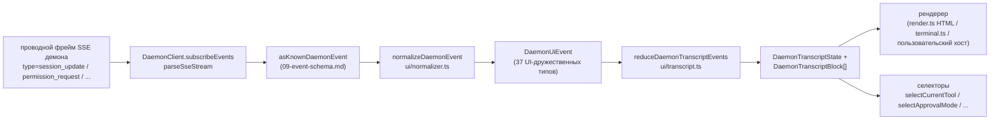

# Shared UI Transcript Layer

> **Текущий статус**: `packages/cli/src/ui/daemon/daemon-tui-adapter.ts` всё ещё присутствует в `main` как устаревший экспериментальный адаптер со стороны CLI. Этот документ описывает более новый слой общего UI-транскрипта со стороны SDK: повторно используемые примитивы нормализации событий демона и транскрипта, которые может использовать любой UI-хост, включая Web, TUI, IDE и каналы IM. Миграция CLI TUI, каналов и VS Code IDE — последующая работа.

## Обзор

`packages/sdk-typescript/src/daemon/ui/` добавляет подпакет `ui/*` в SDK. Он преобразует поток SSE-событий демона в блоки транскрипта, пригодные для отображения в UI, с помощью повторно используемых примитивов:

- **Нормализация** (`normalizer.ts`): отображает 43 известных типа событий проводной схемы демона (см. [`09-event-schema.md`](./09-event-schema.md)) в 37 семантических событий UI-типа `DaemonUiEventType`, таких как `assistant.text.delta`, `tool.update` и `session.metadata.changed`.
- **Автомат состояний** (`transcript.ts`, `store.ts`): чистый редьюсер с подписываемым хранилищем, который проецирует UI-события в упорядоченный массив `DaemonTranscriptBlock[]`.
- **Рендереры** (`render.ts`, `terminal.ts`, `toolPreview.ts`): преобразование блоков транскрипта в HTML, терминальный текст и строки предпросмотра инструментов. Хосты могут использовать их или заменять.
- **Конформность** (`conformance.ts`): кросс-хостовые тесты согласованности, используемые при миграции поверхностей каналов, TUI и IDE на эти примитивы.

Первый потребитель в производстве — **`packages/webui/src/daemon/`** ([#4328](https://github.com/QwenLM/qwen-code/pull/4328)). Его React-компонент `DaemonSessionProvider` и адаптер транскрипта позволяют веб-UI подключаться напрямую к демону через HTTP+SSE, а не только обрабатывать трафик `postMessage` хоста. Позднее CLI TUI, база каналов и VS Code IDE могут переиспользовать тот же слой; [`../daemon-ui/MIGRATION.md`](../daemon-ui/MIGRATION.md) содержит руководство по поэтапной миграции v2.

## Обязанности

- Нормализовать 43 события проводов демона в стабильный UI-словарь (`DaemonUiEventType`), чтобы рендереры не обращались к `rawEvent.data`.
- Использовать монотонный `eventId` демона в качестве **основного ключа упорядочивания**, чтобы разные клиенты отображали транскрипты в одном порядке.
- Использовать чистый редьюсер для формирования блоков транскрипта с селекторами для ожидающих разрешений, текущего инструмента, режима подтверждения, прогресса инструментов и дочерних элементов subagent.
- Предоставлять базовые рендереры HTML и терминала, допуская специфичный для хоста рендеринг.
- Экспортировать публичные константы, такие как `DAEMON_PLAN_TOOL_CALL_ID`, для панелей планов.
- Сохранять аддитивную совместимость проводов: неизвестные типы событий нормализуются в `debug` вместо отбрасывания.

## Архитектура

### Структура пакета

| Файл                                                | Экспорты                                                                                                                                                           | Назначение                   |
| --------------------------------------------------- | ------------------------------------------------------------------------------------------------------------------------------------------------------------------ | ---------------------------- |
| `packages/sdk-typescript/src/daemon/ui/index.ts`    | Бочка подпакета                                                                                                                                                    | Публичная точка входа        |
| `ui/types.ts`                                       | `DaemonUiEventType`, потиповые интерфейсы `DaemonUiEvent*`, `DaemonTranscriptBlock`, `DaemonTranscriptState`, `DaemonUiToolProvenance`, `DAEMON_PLAN_TOOL_CALL_ID` | Типы                        |
| `ui/normalizer.ts`                                  | `normalizeDaemonEvent(evt) -> DaemonUiEvent`, `getSessionUpdatePayload(evt)`                                                                                       | Отображение «провода→UI»     |
| `ui/transcript.ts`                                  | `createDaemonTranscriptState()`, `appendLocalUserTranscriptMessage()`, `reduceDaemonTranscriptEvents()`, `rebuildDaemonTranscriptBlockIndex()`, селекторы          | Автомат состояний и селекторы |
| `ui/store.ts`                                       | `createDaemonTranscriptStore(initial?)`                                                                                                                            | Подписываемое редьюсерное хранилище |
| `ui/toolPreview.ts`                                 | `createDaemonToolPreview(toolEvent)`                                                                                                                               | Текст сводки вызова инструмента |
| `ui/render.ts`                                      | `DaemonHtmlRenderOptions`, `DaemonRenderOptions`, функции рендеринга                                                                                               | HTML и общий рендеринг       |
| `ui/terminal.ts`                                    | Терминально-специфичный рендеринг                                                                                                                                  | Подготовка для TUI           |
| `ui/conformance.ts`                                 | Кросс-хостовая проверка согласованности                                                                                                                            | Тесты миграционного паритета |
| `ui/utils.ts`                                       | Вспомогательные функции, такие как `DaemonUiContentPart`                                                                                                           | Внутренние общие утилиты     |
### Словарь `DaemonUiEventType`

`ui/types.ts` определяет 37 типов UI-событий, сгруппированных по доменам.

**Поток чата (Этап 1)**

- `user.text.delta`, `user.image.delta`, `user.shell.command`, `assistant.text.delta`, `assistant.done`, `thought.text.delta`
- `tool.update`, `shell.output`, `user.shell.output`
- `permission.request`, `permission.resolved`
- `model.changed`, `status`, `error`, `debug`

**Метаданные сессии**

- `session.metadata.changed`, `session.approval_mode.changed`
- `session.available_commands`, `session.state_resync_required`, `session.replay_complete`

**Жизненный цикл подсказок (кросс-клиент)**

- `prompt.cancelled`, `followup.suggestion`

**Рабочее пространство (Волны 3-4)**

- `workspace.memory.changed`, `workspace.agent.changed`
- `workspace.tool.toggled`, `workspace.settings.changed`, `workspace.initialized`
- `workspace.mcp.budget_warning`, `workspace.mcp.child_refused`
- `workspace.mcp.server_restarted`, `workspace.mcp.server_restart_refused`

**Поток аутентификации (Волна 4 OAuth)**

- `auth.device_flow.started`, `auth.device_flow.throttled`, `auth.device_flow.authorized`
- `auth.device_flow.failed`, `auth.device_flow.cancelled`

`normalizeDaemonEvent` сопоставляет 43 известных проводных события демона с этим словарём. Неизвестные, не смоделированные или некорректные типы событий нормализуются в `debug` и сохраняют `rawEvent` для диагностики на стороне хоста.

### Редьюсер и селекторы

```ts
// Создание начального состояния.
const state = createDaemonTranscriptState();

// Применение последовательности SSE-событий.
const next = reduceDaemonTranscriptEvents(state, daemonUiEvents);

// Селекторы.
selectTranscriptBlocks(state); // все блоки
selectTranscriptBlocksOrderedByEventId(state); // упорядоченные по eventId; предпочтительный ключ
selectPendingPermissionBlocks(state);
selectCurrentTool(state);
selectApprovalMode(state);
selectToolProgress(state, toolCallId);
selectSubagentChildBlocks(state, parentBlockId);
isSubagentChildBlock(block);
formatBlockTimestamp(block);
formatMissedRange(state); // текст "вы пропустили X" после state_resync_required
```

### Хранилище

`createDaemonTranscriptStore()` предоставляет подписку и отправку:

```ts
const store = createDaemonTranscriptStore();
store.subscribe(() => render(store.getState()));
store.dispatch(uiEvents); // внутри запускает редьюсер
```

Веб-UI `DaemonSessionProvider` строит свой React-контекст поверх этого хранилища.

## Поток выполнения

### Одно SSE-событие от начала до конца



Хосты могут остановиться на `(E)` и реализовать свой собственный редьюсер, или использовать `(G)` и предоставленные селекторы. Веб-UI использует полный путь `(B) -> (H)`. Мигрированный TUI может использовать `(G)` и рендерить с помощью компонентов Ink.

### `state_resync_required`

`session.state_resync_required` преобразуется в маркер «пропущенный диапазон» в транскрипте. Код UI может вызвать `formatMissedRange(state)`, чтобы отобразить текст, например «пропущены события X-Y». Редьюсер **продолжает применять последующие события**, но помечает затронутые блоки флагом `resyncRecovery: true`, чтобы рендереры могли добавить визуальный контекст. См. [`10-event-bus.md`](./10-event-bus.md) для описания вытеснения из кольцевого буфера и семантики `state_resync_required`.

## Потребители

### `packages/webui/src/daemon/`

Этот код появился в [#4328](https://github.com/QwenLM/qwen-code/pull/4328).

| Файл                          | Экспорты                                                                                                                                                                                                                                                                                                                    |
| ----------------------------- | --------------------------------------------------------------------------------------------------------------------------------------------------------------------------------------------------------------------------------------------------------------------------------------------------------------------------- |
| `DaemonSessionProvider.tsx`   | React-компонент `<DaemonSessionProvider />`; хуки `useDaemonSession()`, `useDaemonTranscriptStore()`, `useDaemonTranscriptState()`, `useDaemonTranscriptBlocks()`, `useDaemonPendingPermissions()`, `useDaemonActions()`, `useDaemonConnection()`; типы `DaemonConnectionStatus`, `DaemonConnectionState`, `DaemonSessionContextValue` |
| `transcriptAdapter.ts`        | Адаптирует `DaemonTranscriptBlock` из SDK в формат `UnifiedMessage` веб-UI, включая слияние чанков потокового Markdown и сводки вызовов инструментов                                                                                       |
| `index.ts`                    | Баррель подпакета                                                                                                                                                                                                                             |
Веб-интерфейс теперь может подключаться напрямую к демону через HTTP+SSE и отображать протокол (transcript). Старый путь `ACPAdapter` с хост-методом `postMessage` остаётся доступным.

### Последующие миграции

[`../daemon-ui/MIGRATION.md`](../daemon-ui/MIGRATION.md) содержит пошаговое руководство v2 для адаптеров веб-чата и веб-терминала. В нём явно указано, что **CLI TUI, канальная база (channel base) и VS Code IDE не переносятся в рамках этого PR**; каждый из них будет перемещён в следующих PR и будет использовать набор проверок (conformance suite) для сохранения точности рендеринга.

## Отношение к устаревшему `daemon-tui-adapter.ts`

| Измерение           | Устаревший CLI `DaemonTuiAdapter`                               | Новый общий уровень протокола (transcript)                     |
| ------------------- | --------------------------------------------------------------- | -------------------------------------------------------------- |
| Пакет               | `packages/cli/src/ui/daemon/`                                   | `packages/sdk-typescript/src/daemon/ui/`                       |
| Публичный интерфейс | `DaemonTuiAdapter`, `DaemonTuiUpdate`, `DaemonTuiSessionClient` | `DaemonUiEventType`, `reduceDaemonTranscriptEvents`, селекторы |
| Область             | Только CLI Ink TUI                                              | Веб, TUI, IDE или IM UI                                        |
| Состояние           | Локальное для TUI — объединение обновлений                      | Чистый список блоков протокола плюс поля состояния             |
| Упорядочивание      | `createdAt`                                                     | `eventId` (монотонно от демона, согласован между клиентами)    |
| Неизвестный тип     | Отбрасывается в `reduceDaemonEventToTuiUpdates`                 | Нормализуется в `debug` и сохраняется                          |
| Тесты               | Модульные тесты для одного пакета                               | Глобальный набор проверок для точности между хостами           |

## Зависимости

- Вышестоящие типы проводных сообщений: `packages/sdk-typescript/src/daemon/events.ts` (см. [`09-event-schema.md`](./09-event-schema.md)).
- Реальный потребитель: `packages/webui/src/daemon/`.
- Цели будущих миграций: `packages/cli/src/ui/`, `packages/channels/base/` и `packages/vscode-ide-companion/src/services/daemonIdeConnection.ts`.
- Параллельные ссылки: [`../daemon-ui/README.md`](../daemon-ui/README.md), [`../daemon-ui/MIGRATION.md`](../daemon-ui/MIGRATION.md) и [`../daemon-client-adapters/web-ui.md`](../daemon-client-adapters/web-ui.md).

## Конфигурация

- Нет runtime-конфигурации. Редукторы и селекторы являются чистыми функциями.
- Хосты выбирают свой рендерер: HTML (`render.ts`), терминал (`terminal.ts`) или произвольный.
- Для отладки `render.ts` поддерживает `includeRawEvent: true`, чтобы включить сырой проводной фрейм в визуализированный вывод.

## Предостережения и известные ограничения

- **`daemon-tui-adapter.ts` всё ещё существует**. Это устаревший экспериментальный адаптер пакета CLI. Новый код должен предпочитать SDK `ui/*`: `normalizeDaemonEvent`, `reduceDaemonTranscriptEvents` и `DaemonTranscriptBlock`.
- **CLI TUI, канальная база и VS Code IDE пока не перенесены**. Они всё ещё используют собственную логику рендеринга. В каталоге `docs/developers/daemon-client-adapters/` по-прежнему находятся `ide.md`, `channel-web.md` и исторический черновик `tui.md`; более новый `web-ui.md` описывает дизайн адаптера веб-интерфейса.
- **`eventId` — первичный ключ упорядочивания**. `createdAt` остаётся как устаревший псевдоним (`clientReceivedAt`). Новый код должен использовать `selectTranscriptBlocksOrderedByEventId(state)`. В `MIGRATION.md` показана разница кода для переключения с упорядочивания по `createdAt` на упорядочивание по `eventId`.
- **Неизвестные типы проводных сообщений нормализуются в `debug`**. Они больше не отбрасываются, как в старом адаптере. Рендереры по умолчанию не показывают `debug`; хосты должны явно подключить их отображение.
- **Размер бандла**: подпакет `ui/*` экспортируется через ESM-подпуть внутри `@qwen-code/sdk/daemon` и не тянет зависимости React или DOM. Интеграция React загружается только когда потребитель веб-интерфейса использует `DaemonSessionProvider`.

## Ссылки

- `packages/sdk-typescript/src/daemon/ui/types.ts` (словарь `DaemonUiEventType`)
- `packages/sdk-typescript/src/daemon/ui/transcript.ts` (редуктор и селекторы)
- `packages/sdk-typescript/src/daemon/ui/normalizer.ts` (отображение проводных сообщений в UI)
- `packages/sdk-typescript/src/daemon/ui/store.ts`, `render.ts`, `terminal.ts`, `toolPreview.ts`, `conformance.ts`
- `packages/sdk-typescript/src/daemon/index.ts` (блок реэкспорта `ui/*`)
- `packages/webui/src/daemon/DaemonSessionProvider.tsx`, `transcriptAdapter.ts`
- Вышестоящие документы: [`../daemon-ui/README.md`](../daemon-ui/README.md), [`../daemon-ui/MIGRATION.md`](../daemon-ui/MIGRATION.md), [`../daemon-client-adapters/web-ui.md`](../daemon-client-adapters/web-ui.md)
- Связанные PR: [#4328](https://github.com/QwenLM/qwen-code/pull/4328) (уровень протокола v1 и провайдер веб-интерфейса), [#4353](https://github.com/QwenLM/qwen-code/pull/4353) (следующий шаг к унифицированной полноте v2)
