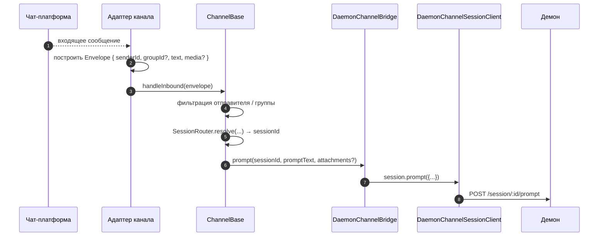
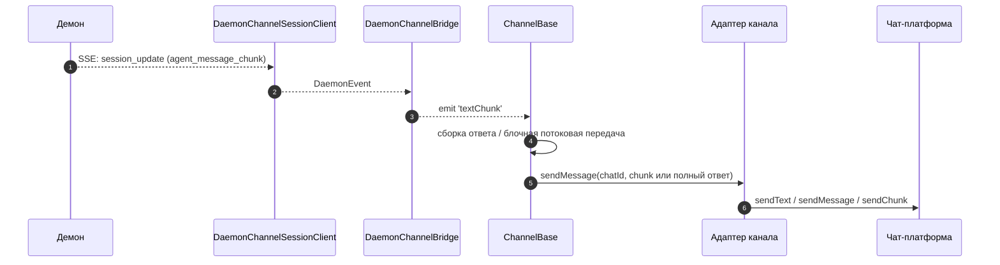
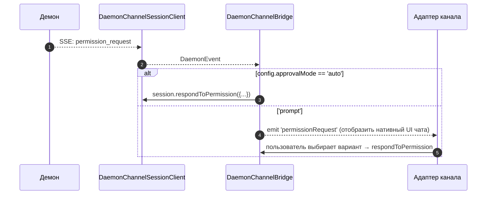

# Адаптеры каналов

## Обзор

`packages/channels/` содержит **адаптеры IM-каналов**, которые преобразуют входящие сообщения из чат-платформы в промпт для демона, а исходящие события демона — в сообщения чат-платформы. В настоящее время поставляются четыре конкретных канала: DingTalk, WeChat (Weixin), Telegram и Feishu. Они используют общий базовый слой (`packages/channels/base/`) и `DaemonChannelBridge`, который отвечает за мультиплексирование сессий и потребление SSE.

Каждый канал сопоставляет входящий чат-трафик с сессиями демона в рамках настраиваемой `SessionScope` (`user`, `thread` или `single`). Адаптер делегирует работу `DaemonChannelBridge`, который, в свою очередь, делегирует её SDK-клиенту `DaemonSessionClient` (см. [`13-sdk-daemon-client.md`](./13-sdk-daemon-client.md)).

## Обязанности

- Получать входящие сообщения из нативного транспорта канала (WebSocket-поток DingTalk, HTTP long-poll WeChat, Bot API long-poll Telegram, WebSocket Feishu или HTTP-вебхук).
- Преобразовывать `(senderId, groupId?)` в сессию демона через `DaemonChannelSessionFactory`.
- Передавать сообщение пользователя как промпт демона и передавать ответ обратно в виде исходящих сообщений чата, возможно, разбитых на части.
- Отображать запросы разрешений как нативные подсказки чата в интерактивном режиме; в противном случае — автоматически подтверждать в соответствии с `ChannelConfig.approvalMode`.
- Применять фильтрацию отправителей (белые/чёрные списки), фильтрацию групп и нормализацию контента (markdown / HTML для каждого канала).

## Архитектура

### `DaemonChannelBridge` (общая база, `packages/channels/base/src/DaemonChannelBridge.ts`)

```ts
class DaemonChannelBridge extends EventEmitter {
  constructor(opts: {
    cwd: string;
    sessionFactory: DaemonChannelSessionFactory;
    modelServiceId?: string;
    sessionScope?: SessionScope;
  });
  newSession(cwd: string): Promise<string>;
  loadSession(sessionId: string, cwd: string): Promise<string>;
  prompt(sessionId: string, text: string, options?): Promise<string>;
  cancelSession(sessionId: string): Promise<void>;
  stop(): void;
}
```

Содержит клиенты сессий демона, ключи которых — `sessionId` демона; `ChannelBase` и `SessionRouter` определяют, какая входящая цель чата сопоставляется с этой сессией. Каждая подключённая сессия имеет:

- `DaemonChannelSessionClient` (по форме `DaemonSessionClient`, но без методов, нерелевантных для канала).
- Активный насос потребителя SSE.
- Debounced-сборщик промптов (для адаптеров, которые разбивают ввод пользователя на несколько входящих сообщений).
- Политику авто-подтверждения для каждого запроса.

События, которые генерируются: `textChunk`, `toolCall`, `sessionUpdate`, `permissionRequest`, `permissionResolved`, `modelSwitched`, `modelSwitchFailed`, `sessionDied`, `promptComplete`, и `error`. Адаптеры каналов интегрируют их в нативные API платформ.

### `ChannelBase` (`packages/channels/base/src/ChannelBase.ts`)

Абстрактный базовый класс, от которого наследуют все адаптеры:

```ts
abstract class ChannelBase {
  abstract connect(): Promise<void>;
  abstract sendMessage(chatId: string, text: string): Promise<void>;
  abstract disconnect(): void;
  handleInbound(envelope: Envelope): Promise<void>; // → SessionRouter.resolve + bridge.prompt
}
```

Обрабатывает общие сквозные задачи: фильтрацию отправителей (белый/чёрный список), фильтрацию групп, потоковую передачу блоков сообщений (размер чанка, троттлинг), debounce входящих сообщений.

### Адаптеры для каждого канала

| Адаптер         | Файл                                                | Транспорт                                              | Примечания                                                                                                  |
| --------------- | --------------------------------------------------- | ------------------------------------------------------ | ----------------------------------------------------------------------------------------------------------- |
| DingTalk        | `packages/channels/dingtalk/src/DingtalkAdapter.ts` | WebSocket DingTalk Stream SDK                           | Отправка через `sessionWebhook` POST; медиа-изображения загружаются через API DingTalk, base64 в envelope.    |
| WeChat (Weixin) | `packages/channels/weixin/src/WeixinAdapter.ts`     | HTTP long-poll iLink Bot                                | Отправка через проприетарное API `sendText` / `sendImage`; индикаторы набора текста.                         |
| Telegram        | `packages/channels/telegram/src/TelegramAdapter.ts` | Bot API long-poll (grammy)                              | Отправка HTML-чанков через `sendMessage`.                                                                    |
| Feishu          | `packages/channels/feishu/src/FeishuAdapter.ts`     | WebSocket Feishu/Lark Stream (по умолчанию) или HTTP webhook | Отправка через Lark SDK в виде интерактивных карточек; режим webhook требует `encryptKey` для проверки HMAC-подписи. |

Каждый адаптер реализует:

1. Входящий транспорт (подписка / опрос на сообщения).
2. Построение Envelope (`{ senderId, groupId?, text, media?, raw }`).
3. Фильтрацию отправителя / группы (делегируется `ChannelBase`).
4. Сериализацию исходящих (markdown → HTML / WeChat-native / DingTalk-native).
5. Жизненный цикл (запуск / остановка).

### Матрица адаптеров

| Адаптер      | Транспорт                       | Идентификация                                                 | Пользовательский интерфейс разрешений               | Конфигурация авто-подтверждения                       |
| ------------ | ------------------------------- | ------------------------------------------------------------- | --------------------------------------------------- | ----------------------------------------------------- |
| **DingTalk** | WebSocket-поток                 | `senderStaffId` (+ опционально `conversationId` для групп)     | Инлайн-кнопки через markdown DingTalk               | `ChannelConfig.approvalMode = 'auto' \| 'prompt'`     |
| **WeChat**   | HTTP long-poll                  | `senderWxid` (+ опционально `groupWxid`)                      | Текстовые подсказки с токенами ответа               | То же                                                 |
| **Telegram** | Bot API long-poll               | `from.id` (+ опционально `chat.id` для групп)                 | Инлайн-кнопки клавиатуры                             | То же                                                 |
| **Feishu**   | WebSocket-поток / HTTP webhook  | `sender.open_id` (+ опционально `chat_id` для групп)           | Интерактивные карточки-кнопки                        | То же                                                 |

> **Примечание:** Столбец "Пользовательский интерфейс разрешений" описывает нативные возможности каждой платформы, но ни одна из них ещё не подключена — `AcpBridge.requestPermission` в настоящее время автоматически подтверждает каждый запрос (`packages/channels/base/src/AcpBridge.ts`), а `ChannelConfig.approvalMode` объявлен, но ещё не считывается. Интерактивное подтверждение запланировано (Фаза 5).

## Рабочий процесс

### Входящий промпт



### Исходящий поток через SSE



### Авто-подтверждение разрешений



## Состояние и жизненный цикл

- `DaemonChannelBridge` живёт столько же, сколько адаптер канала; сессии внутри него живут в соответствии с настроенной `SessionScope`.
- Каждая активная сессия автоматически переподключается при обрыве SSE — `DaemonSessionClient.events()` отслеживает `lastSeenEventId`, чтобы корректно воспроизвести события.
- `shutdown()` закрывает каждую активную сессию и базовый транспорт (WebSocket / long-poll канала).
- WebSocket-поток DingTalk поддерживает push от сервера; long-poll WeChat требует стратегии backoff при пустых ответах; long-poll Telegram имеет встроенный параметр `timeout`.

## Зависимости

- `packages/channels/base/` — `ChannelBase`, `DaemonChannelBridge`, `types.ts` (`ChannelConfig`, `Envelope`, `SessionScope`, `ChannelPlugin`).
- `packages/sdk-typescript/src/daemon/` — `DaemonSessionClient` и связанные с ним.
- SDK для каждого канала: `@dingtalk/stream` (DingTalk), проприетарный iLink Bot HTTP (Weixin), `grammy` (Telegram).

## Конфигурация

`ChannelConfig` (из `packages/channels/base/src/types.ts`):

| Параметр                                 | Эффект                                                                                                                |
| ---------------------------------------- | --------------------------------------------------------------------------------------------------------------------- |
| `sessionScope`                           | `'user'` (отправитель + чат), `'thread'` (идентификатор треда или чат) или `'single'` (одна общая сессия на канал).   |
| `approvalMode`                           | `'auto'` (авто-ответ) / `'prompt'` (отображение UI).                                                                  |
| `allowlist?: string[]`                   | Идентификаторы отправителей, разрешённые; если отсутствует — открыты.                                                  |
| `denylist?: string[]`                    | Идентификаторы отправителей, запрещённые.                                                                             |
| `chunkSize`, `chunkIntervalMs`           | Настройки потоковой передачи блоков исходящих сообщений.                                                               |
| `daemon: { baseUrl, token?, clientId? }` | Передаются в `DaemonChannelSessionFactory`.                                                                           |

Специфичные для канала ключи накладываются сверху (DingTalk: `streamCredentials`; WeChat: `ilinkUrl`, `botId`; Telegram: `botToken`; Feishu: `clientId` (appId), `clientSecret` (appSecret), `verificationToken`, `encryptKey` (режим webhook)).

## Ограничения и известные проблемы

- **Каналы не импортируют напрямую `@qwen-code/sdk`.** Они проходят через `ChannelBase` → `DaemonChannelBridge` → `DaemonChannelSessionClient` (который мост создаёт из SDK). Такая прослойка позволяет мосту менять реализации, например, тестовый заглушка, без изменения кода канала.
- **Пользовательский интерфейс разрешений зависит от канала.** DingTalk использует markdown-кнопки; WeChat — только текст; Telegram — инлайн-клавиатуры; Feishu — интерактивные кнопки-карточки. (Всё в настоящее время автоматически подтверждается через `AcpBridge`; интерактивное подтверждение запланировано.) Единой абстракции "интерактивного виджета разрешений" пока нет.
- **Авто-подтверждение — это решение на стороне развёртывания**, а не демона. Политика `permission_mediation` демона всё ещё применяется; auto-approve означает только то, что канал отвечает без запроса человеку. Не сочетайте `auto` с рабочими процессами уровня `enforce`.
- **Ограничения скорости и размера сообщений на канал — это задача адаптера.** `DaemonChannelBridge` занимается только разбиением; превышение лимита на сообщение WeChat или flood-лимита Telegram — на адаптере.
- **Обратные вызовы DingTalk / WeChat / Telegram / Feishu не реализованы** — каналы однонаправленные (чат → демон → чат). Нативный push-путь платформы IM, например, callback карточки DingTalk, пока не подключён к мосту.

## Ссылки

- `packages/channels/base/src/DaemonChannelBridge.ts`
- `packages/channels/base/src/ChannelBase.ts`
- `packages/channels/base/src/types.ts`
- `packages/channels/dingtalk/src/DingtalkAdapter.ts`
- `packages/channels/weixin/src/WeixinAdapter.ts`
- `packages/channels/telegram/src/TelegramAdapter.ts`
- `packages/channels/plugin-example/` (пример каркаса плагина)
- Руководство по плагинам каналов: [`../channel-plugins.md`](../channel-plugins.md).
- Справочник SDK: [`13-sdk-daemon-client.md`](./13-sdk-daemon-client.md).