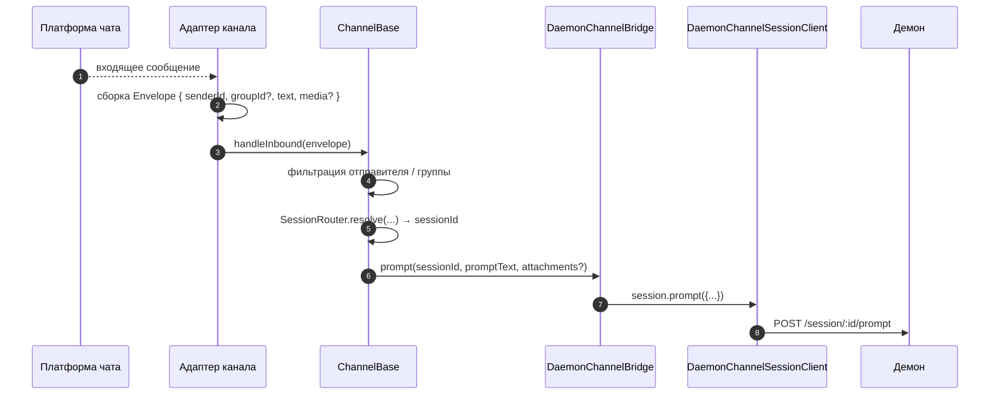
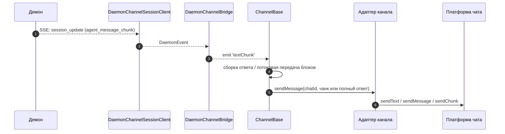
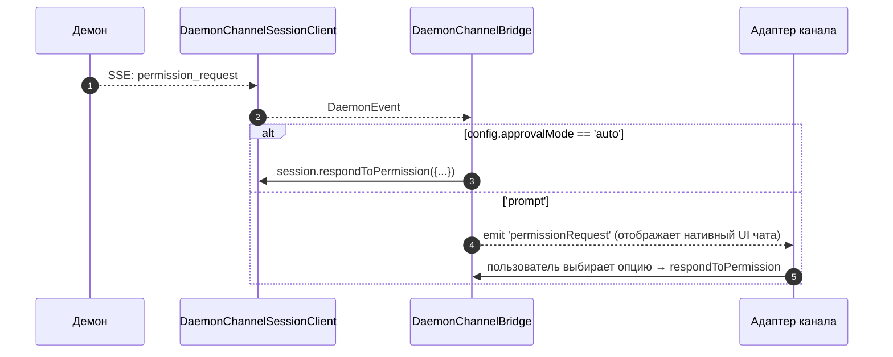

# Адаптеры каналов

## Обзор

`packages/channels/` содержит **адаптеры IM-каналов**, которые преобразуют входящие сообщения чат-платформы в промпт для агента и отправляют ответ агента обратно в чат-платформу. На данный момент доступны четыре конкретных канала: DingTalk, WeChat (Weixin), Telegram и Feishu. Они используют общий базовый слой (`packages/channels/base/`) и контракт `ChannelAgentBridge` для адаптеров.

Существует два текущих режима запуска:

- `qwen channel start [name]` — это автономный сервис каналов на базе ACP. Он передает адаптерам реализацию `AcpBridge` интерфейса `ChannelAgentBridge`.
- `qwen serve --channel <name>` и `qwen serve --channel all` — это экспериментальные режимы с управлением через демон. `qwen serve` запускает один внепроцессный воркер канала, воркер подключается к демону через SDK, а адаптеры получают фасад `ChannelAgentBridge` на базе `DaemonChannelBridge`.

В режиме управления демоном каждый канал сопоставляет входящий чат-трафик с сессиями демона в рамках настраиваемой области `SessionScope` (`user`, `thread` или `single`). Адаптер делегирует задачи `DaemonChannelBridge`, который, в свою очередь, делегирует их `DaemonSessionClient` из SDK (см. [`13-sdk-daemon-client.md`](./13-sdk-daemon-client.md)). Один демон привязан к одному рабочему пространству, поэтому `cwd` каждого выбранного канала должен разрешаться в рабочее пространство демона.

## Обязанности

- Получение входящих сообщений из нативного транспорта канала (DingTalk WebSocket stream, WeChat HTTP long-poll, Telegram Bot long-poll, Feishu WebSocket или HTTP webhook).
- Разрешение `(senderId, groupId?)` в сессию демона через `DaemonChannelSessionFactory`.
- Пересылка сообщения пользователя как промпта демона и потоковая передача ответа обратно в виде исходящих сообщений чата, возможно, разбитыми на чанки.
- Отображение запросов разрешений в виде нативных для чата промптов в интерактивном режиме; в противном случае автоматическое одобрение согласно `ChannelConfig.approvalMode`.
- Применение фильтрации отправителей (allowlists / denylists), фильтрации групп и нормализации контента (markdown / HTML в зависимости от канала).

## Архитектура

### `DaemonChannelBridge` (общая база, `packages/channels/base/src/DaemonChannelBridge.ts`)

```ts
class DaemonChannelBridge extends EventEmitter {
  constructor(opts: {
    cwd: string;
    sessionFactory: DaemonChannelSessionFactory;
    modelServiceId?: string;
    sessionScope?: SessionScope;
  });
  newSession(cwd: string): Promise<string>;
  loadSession(sessionId: string, cwd: string): Promise<string>;
  prompt(sessionId: string, text: string, options?): Promise<string>;
  cancelSession(sessionId: string): Promise<void>;
  stop(): void;
}
```

Хранит клиенты сессий демона, ключом которых является `sessionId` демона; `ChannelBase` и `SessionRouter` определяют, какая входящая цель чата сопоставляется с этой сессией. Каждая подключенная сессия имеет:

- `DaemonChannelSessionClient` (форма `DaemonSessionClient` без методов, не относящихся к каналу).
- Активный SSE consumer pump.
- Сборщик промптов с debouncing (для адаптеров, которые разбивают ввод пользователя на несколько входящих сообщений).
- Политику автоматического одобрения для каждого запроса.

Генерируемые события: `textChunk`, `toolCall`, `sessionUpdate`, `permissionRequest`, `permissionResolved`, `modelSwitched`, `modelSwitchFailed`, `sessionDied`, `promptComplete` и `error`. Адаптеры каналов связывают эти события с нативными API платформы.

### `ChannelBase` (`packages/channels/base/src/ChannelBase.ts`)

Абстрактный базовый класс, который расширяет каждый адаптер:

```ts
abstract class ChannelBase {
  abstract connect(): Promise<void>;
  abstract sendMessage(chatId: string, text: string): Promise<void>;
  abstract disconnect(): void;
  handleInbound(envelope: Envelope): Promise<void>; // → SessionRouter.resolve + bridge.prompt
}
```

Обрабатывает общие сквозные задачи: фильтрация отправителей (allowlist / denylist), фильтрация групп, потоковая передача блоков сообщений (размер чанка, троттлинг), debouncing входящих сообщений.

### Адаптеры конкретных каналов

| Адаптер         | Файм                                                | Транспорт                                              | Примечания                                                                                                 |
| --------------- | --------------------------------------------------- | ------------------------------------------------------ | ---------------------------------------------------------------------------------------------------------- |
| DingTalk        | `packages/channels/dingtalk/src/DingtalkAdapter.ts` | DingTalk Stream SDK WebSocket                          | Отправляет через `sessionWebhook` POST; медиа-изображения загружаются через DT API, base64 в envelope.     |
| WeChat (Weixin) | `packages/channels/weixin/src/WeixinAdapter.ts`     | iLink Bot HTTP long-poll                               | Отправляет через проприетарное API `sendText` / `sendImage`; индикаторы набора текста.                     |
| Telegram        | `packages/channels/telegram/src/TelegramAdapter.ts` | Telegram Bot API long-poll (grammy)                    | Отправляет HTML-чанки через `sendMessage`.                                                                 |
| Feishu          | `packages/channels/feishu/src/FeishuAdapter.ts`     | Feishu/Lark Stream WebSocket (по умолчанию) или HTTP webhook | Отправляет через Lark SDK в виде интерактивных карточек; режим webhook требует `encryptKey` для проверки HMAC-подписи. |

Каждый адаптер реализует:

1. Входящий транспорт (подписка / опрос сообщений).
2. Формирование envelope (`{ senderId, groupId?, text, media?, raw }`).
3. Фильтрация отправителей / групп (делегирование `ChannelBase`).
4. Исходящая сериализация (markdown → HTML / нативный WeChat / нативный DingTalk).
5. Жизненный цикл (start / shutdown).

### Матрица адаптеров

| Адаптер      | Транспорт                       | Идентификация                                            | UX разрешений                       | Конфигурация авто-одобрения                     |
| ------------ | ------------------------------- | -------------------------------------------------------- | ----------------------------------- | ----------------------------------------------- |
| **DingTalk** | WebSocket stream                | `senderStaffId` (+ опционально `conversationId` для групп) | Inline-кнопки через DT markdown     | `ChannelConfig.approvalMode = 'auto' \| 'prompt'` |
| **WeChat**   | HTTP long-poll                  | `senderWxid` (+ опционально `groupWxid`)                 | Только текстовые промпты с токенами ответа | То же                                           |
| **Telegram** | Bot API long-poll               | `from.id` (+ опционально `chat.id` для групп)            | Кнопки inline-клавиатуры            | То же                                           |
| **Feishu**   | WebSocket stream / HTTP webhook | `sender.open_id` (+ опционально `chat_id` для групп)     | Кнопки интерактивных карточек       | То же                                           |

> **Примечание:** Столбец "UX разрешений" описывает нативные возможности каждой платформы, но пока ни одна из них не подключена — `AcpBridge.requestPermission` в настоящее время автоматически одобряет каждый запрос (`packages/channels/base/src/AcpBridge.ts`), а `ChannelConfig.approvalMode` объявлен, но еще не читается. Интерактивное одобрение запланировано (Phase 5).

## Рабочий процесс

### Входящий промпт



### Исходящий трафик на базе SSE



### Автоматическое одобрение разрешений



## Состояние и жизненный цикл

- `DaemonChannelBridge` живет в течение всего времени жизни адаптера канала; сессии внутри него живут в соответствии с настроенной `SessionScope`.
- Каждая активная сессия автоматически переподключается при обрыве SSE — `DaemonSessionClient.events()` отслеживает `lastSeenEventId`, чтобы повторное воспроизведение (replay) было корректным.
- `shutdown()` закрывает каждую активную сессию и базовый транспорт (WebSocket / long-poll канала).
- WebSocket stream DingTalk поддерживает server-push; long-poll WeChat требует стратегии backoff при пустых ответах; long-poll Telegram имеет встроенный параметр `timeout`.

## Зависимости

- `packages/channels/base/` — `ChannelBase`, `DaemonChannelBridge`, `types.ts` (`ChannelConfig`, `Envelope`, `SessionScope`, `ChannelPlugin`).
- `packages/sdk-typescript/src/daemon/` — `DaemonSessionClient` и связанные с ним компоненты.
- SDK для каждого канала: `@dingtalk/stream` (DingTalk), проприетарный iLink Bot HTTP (Weixin), `grammy` (Telegram).

## Конфигурация

`ChannelConfig` (из `packages/channels/base/src/types.ts`):

| Параметр                                 | Описание                                                                                                  |
| ---------------------------------------- | --------------------------------------------------------------------------------------------------------- |
| `sessionScope`                           | `'user'` (отправитель + чат), `'thread'` (id треда или чат) или `'single'` (одна общая сессия на канал).  |
| `approvalMode`                           | `'auto'` (авто-ответ) / `'prompt'` (отображение UI).                                                      |
| `allowlist?: string[]`                   | Разрешенные id отправителей; если отсутствует = открытый доступ.                                          |
| `denylist?: string[]`                    | Запрещенные id отправителей.                                                                              |
| `chunkSize`, `chunkIntervalMs`           | Настройки потоковой передачи исходящих блоков.                                                            |
| `daemon: { baseUrl, token?, clientId? }` | Передается в `DaemonChannelSessionFactory`.                                                               |

Специфичные для канала ключи добавляются поверх (DingTalk: `streamCredentials`; WeChat: `ilinkUrl`, `botId`; Telegram: `botToken`; Feishu: `clientId` (appId), `clientSecret` (appSecret), `verificationToken`, `encryptKey` (для режима webhook)).

## Ограничения и известные особенности

- **Каналы не импортируют `@qwen-code/sdk` напрямую.** Они идут через `ChannelBase` → `DaemonChannelBridge` → `DaemonChannelSessionClient` (который мост создает из SDK). Эта косвенность позволяет мосту подменять реализации, например, тестовые заглушки, без необходимости изменения каналов.
- **UX разрешений зависит от канала.** DingTalk использует markdown-кнопки; WeChat только текст; Telegram использует inline-клавиатуры; Feishu использует кнопки интерактивных карточек. (Все они сейчас автоматически одобряются через `AcpBridge`; интерактивное одобрение запланировано.) Пока нет общего абстрактного виджета "интерактивного запроса разрешений".
- **Автоматическое одобрение — это решение на стороне развертывания**, а не на стороне демона. Политика `permission_mediation` демона все равно применяется; авто-одобрение означает лишь то, что канал отвечает без запроса человека. Не комбинируйте `auto` с рабочими процессами уровня `enforce`.
- **Лимиты частоты запросов / размера сообщений для каждого канала — это задача адаптера.** `DaemonChannelBridge` обрабатывает только разбиение на чанки; превышение размера сообщения WeChat или лимитов флуда Telegram лежит на адаптере.
- **Нет обратных вызовов DingTalk / WeChat / Telegram / Feishu** — каналы однонаправленные (чат → демон → чат). Нативный путь push-уведомлений IM-платформы, такой как callback карточки DingTalk, пока не подключен к мосту.

## Ссылки

- `packages/channels/base/src/DaemonChannelBridge.ts`
- `packages/channels/base/src/ChannelBase.ts`
- `packages/channels/base/src/types.ts`
- `packages/channels/dingtalk/src/DingtalkAdapter.ts`
- `packages/channels/weixin/src/WeixinAdapter.ts`
- `packages/channels/telegram/src/TelegramAdapter.ts`
- `packages/channels/plugin-example/` (reference plugin scaffold)
- Руководство по плагинам каналов: [`../channel-plugins.md`](../channel-plugins.md).
- Справочник SDK: [`13-sdk-daemon-client.md`](./13-sdk-daemon-client.md).