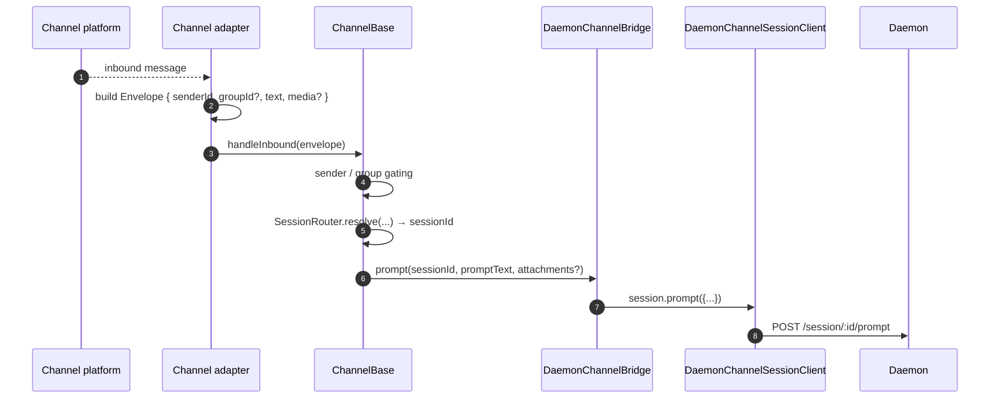
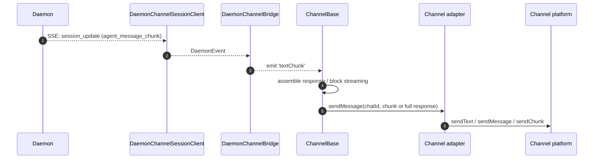
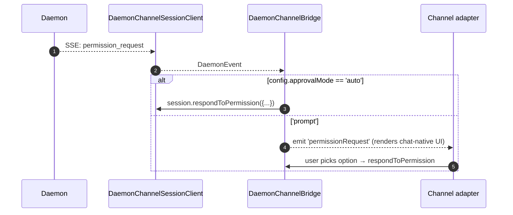

# Адаптеры каналов

## Обзор

Каталог `packages/channels/` содержит **адаптеры каналов IM**, которые преобразуют входящее сообщение платформы чата в подсказку (prompt) для демона, а исходящие события демона — в сообщения платформы чата. На сегодняшний день поставляются четыре конкретных канала: DingTalk, WeChat (Weixin), Telegram и Feishu. Они используют общий базовый слой (`packages/channels/base/`) и `DaemonChannelBridge`, который отвечает за мультиплексирование сессий и обработку SSE.

Каждый канал сопоставляет входящий чат-трафик сессиям демона в рамках настраиваемой `SessionScope` (`user`, `thread` или `single`). Адаптер делегирует работу `DaemonChannelBridge`, который, в свою очередь, делегирует её SDK-клиенту `DaemonSessionClient` (см. [`13-sdk-daemon-client.md`](./13-sdk-daemon-client.md)).

## Ответственность

- Приём входящих сообщений от нативного транспорта канала (DingTalk — поток WebSocket, WeChat — HTTP long-poll, Telegram — long-poll Bot API, Feishu — WebSocket или HTTP-вебхук).
- Разрешение `(senderId, groupId?)` в сессию демона через `DaemonChannelSessionFactory`.
- Пересылка сообщения пользователя как подсказки демону и потоковая передача ответа обратно в виде исходящих сообщений чата, возможно, разбитых на части.
- Отрисовка запросов разрешений как нативных подсказок чата при интерактивном режиме; в противном случае автоматическое одобрение в соответствии с `ChannelConfig.approvalMode`.
- Применение фильтрации отправителей (белые/чёрные списки), фильтрации групп и нормализации контента (markdown / HTML в зависимости от канала).

## Архитектура

### `DaemonChannelBridge` (общая база, `packages/channels/base/src/DaemonChannelBridge.ts`)

```ts
class DaemonChannelBridge extends EventEmitter {
  constructor(opts: {
    cwd: string;
    sessionFactory: DaemonChannelSessionFactory;
    modelServiceId?: string;
    sessionScope?: SessionScope;
  });
  newSession(cwd: string): Promise<string>;
  loadSession(sessionId: string, cwd: string): Promise<string>;
  prompt(sessionId: string, text: string, options?): Promise<string>;
  cancelSession(sessionId: string): Promise<void>;
  stop(): void;
}
```

Содержит клиенты сессий демона, ключом которых является `sessionId` демона; `ChannelBase` и `SessionRouter` определяют, какой входящий чат-адресат сопоставляется этой сессии. Каждая подключённая сессия имеет:

- `DaemonChannelSessionClient` (форма `DaemonSessionClient` без нерелевантных для канала методов).
- Активный потребитель SSE.
- Ассемблер подсказок с задержкой (для адаптеров, фрагментирующих вводные данные пользователя по нескольким входящим сообщениям).
- Политика автоматического одобрения для каждого запроса.

Генерируемые события: `textChunk`, `toolCall`, `sessionUpdate`, `permissionRequest`, `permissionResolved`, `modelSwitched`, `modelSwitchFailed`, `sessionDied`, `promptComplete` и `error`. Адаптеры каналов привязывают их к нативным API платформы.

### `ChannelBase` (`packages/channels/base/src/ChannelBase.ts`)

Абстрактный базовый класс, который расширяет каждый адаптер:

```ts
abstract class ChannelBase {
  abstract connect(): Promise<void>;
  abstract sendMessage(chatId: string, text: string): Promise<void>;
  abstract disconnect(): void;
  handleInbound(envelope: Envelope): Promise<void>; // → SessionRouter.resolve + bridge.prompt
}
```

Обрабатывает общие сквозные задачи: фильтрацию отправителей (белый/чёрный список), групповую фильтрацию, потоковую передачу блоков сообщений (размер чанка, регулировка), задержку входящих сообщений.

### Адаптеры по каналам

| Адаптер         | Файл                                                | Транспорт                                              | Примечания                                                                                                        |
| --------------- | --------------------------------------------------- | ------------------------------------------------------ | ---------------------------------------------------------------------------------------------------------------- |
| DingTalk        | `packages/channels/dingtalk/src/DingtalkAdapter.ts` | DingTalk Stream SDK WebSocket                          | Отправка через POST `sessionWebhook`; медиа-изображения загружаются через DT API, base64 в конверте.               |
| WeChat (Weixin) | `packages/channels/weixin/src/WeixinAdapter.ts`     | iLink Bot HTTP long-poll                               | Отправка через собственный API `sendText`/`sendImage`; индикаторы набора текста.                                   |
| Telegram        | `packages/channels/telegram/src/TelegramAdapter.ts` | Telegram Bot API long-poll (grammy)                    | Отправка HTML-чанков через `sendMessage`.                                                                         |
| Feishu          | `packages/channels/feishu/src/FeishuAdapter.ts`     | Feishu/Lark Stream WebSocket (по умолчанию) или HTTP-вебхук | Отправка через Lark SDK в виде интерактивных карточек; режим вебхука требует `encryptKey` для проверки подписи HMAC. |

Каждый адаптер реализует:

1. Входящий транспорт (подписка/опрос на сообщения).
2. Построение конверта (`{ senderId, groupId?, text, media?, raw }`).
3. Фильтрация отправителя/группы (делегируется `ChannelBase`).
4. Сериализация исходящих сообщений (markdown → HTML / WeChat-native / DingTalk-native).
5. Жизненный цикл (запуск/остановка).

### Матрица адаптеров
| Адаптер        | Транспорт                       | Идентификатор                                           | UX разрешений                     | Конфигурация авто-одобрения                       |
| -------------- | ------------------------------- | ------------------------------------------------------- | --------------------------------- | ------------------------------------------------- |
| **DingTalk**   | WebSocket stream                | `senderStaffId` (+ опционально `conversationId` для групп) | Инлайн-кнопки через DT markdown   | `ChannelConfig.approvalMode = 'auto' \| 'prompt'` |
| **WeChat**     | HTTP long-poll                  | `senderWxid` (+ опционально `groupWxid`)                 | Текстовые запросы с reply-токенами | То же                                             |
| **Telegram**   | Bot API long-poll               | `from.id` (+ опционально `chat.id` для групп)            | Инлайн-клавиатуры                  | То же                                             |
| **Feishu**     | WebSocket stream / HTTP webhook | `sender.open_id` (+ опционально `chat_id` для групп)     | Интерактивные карточки-кнопки      | То же                                             |

> **Примечание:** В столбце «UX разрешений» описаны нативные возможности каждой платформы, но ни одна из них пока не подключена — `AcpBridge.requestPermission` в настоящее время автоматически одобряет каждый запрос (`packages/channels/base/src/AcpBridge.ts`), а `ChannelConfig.approvalMode` объявлен, но ещё не используется. Интерактивное одобрение запланировано (фаза 5).

## Рабочий процесс

### Входящее сообщение



### Исходящий поток через SSE



### Автоматическое одобрение разрешений



## Состояние и жизненный цикл

- `DaemonChannelBridge` существует всё время жизни адаптера канала; сессии внутри него живут согласно настроенному `SessionScope`.
- Каждая активная сессия автоматически переподключается при обрыве SSE — `DaemonSessionClient.events()` отслеживает `lastSeenEventId`, что обеспечивает корректное воспроизведение.
- `shutdown()` закрывает каждую активную сессию и базовый транспорт (WebSocket/долгий опрос канала).
- WebSocket-поток DingTalk поддерживает push-уведомления с сервера; длинный опрос WeChat требует стратегии повторных попыток при пустых ответах; длинный опрос Telegram имеет встроенный параметр `timeout`.

## Зависимости

- `packages/channels/base/` — `ChannelBase`, `DaemonChannelBridge`, `types.ts` (`ChannelConfig`, `Envelope`, `SessionScope`, `ChannelPlugin`).
- `packages/sdk-typescript/src/daemon/` — `DaemonSessionClient` и сопутствующие классы.
- SDK для каждого канала: `@dingtalk/stream` (DingTalk), проприетарный HTTP iLink Bot (Weixin), `grammy` (Telegram).

## Конфигурация

`ChannelConfig` (из `packages/channels/base/src/types.ts`):

| Настройка                                | Эффект                                                                                       |
| ---------------------------------------- | -------------------------------------------------------------------------------------------- |
| `sessionScope`                           | `'user'` (отправитель + чат), `'thread'` (идентификатор треда или чат) или `'single'` (одна общая сессия на канал). |
| `approvalMode`                           | `'auto'` (автоматический ответ) / `'prompt'` (показать UI).                                  |
| `allowlist?: string[]`                   | Разрешённые идентификаторы отправителей; если отсутствует — открыто для всех.                 |
| `denylist?: string[]`                    | Запрещённые идентификаторы отправителей.                                                     |
| `chunkSize`, `chunkIntervalMs`           | Настройки потоковой передачи блоков исходящих сообщений.                                     |
| `daemon: { baseUrl, token?, clientId? }` | Передаётся в `DaemonChannelSessionFactory`.                                                  |
Специфичные для канала ключи накладываются сверху (DingTalk: `streamCredentials`; WeChat: `ilinkUrl`, `botId`; Telegram: `botToken`; Feishu: `clientId` (appId), `clientSecret` (appSecret), `verificationToken`, `encryptKey` (webhook mode)).

## Предостережения и известные ограничения

- **Каналы не импортируют напрямую `@qwen-code/sdk`.** Они работают через `ChannelBase` → `DaemonChannelBridge` → `DaemonChannelSessionClient` (который мост создаёт из SDK). Прослойка позволяет мосту подменять реализации, например тестовый заглушку, без необходимости изменять канал.
- **UX разрешений зависит от канала.** DingTalk использует кнопки в формате markdown; WeChat — только текст; Telegram — встроенные клавиатуры; Feishu — интерактивные кнопки в карточках. (Сейчас всё автоматически одобряется через `AcpBridge`; интерактивное одобрение запланировано.) Единой абстракции «интерактивный виджет разрешений» пока нет.
- **Автоодобрение — это решение на стороне развёртывания**, а не на стороне демона. Политика `permission_mediation` демона всё ещё действует; автоодобрение означает лишь, что канал отвечает без запроса к человеку. Не комбинируйте `auto` с процессами уровня `enforce`.
- **Ограничения частоты запросов и размера сообщений для каждого канала — задача адаптера.** `DaemonChannelBridge` занимается только делением на чанки; выход за лимит размера сообщения WeChat или flood-лимит Telegram ложится на адаптер.
- **Обратный вызов для DingTalk / WeChat / Telegram / Feishu отсутствует** — каналы однонаправленные (чат → демон → чат). Встроенный push-путь платформы IM (например, колбэк карточки в DingTalk) пока не подключён к мосту.

## Ссылки

- `packages/channels/base/src/DaemonChannelBridge.ts`
- `packages/channels/base/src/ChannelBase.ts`
- `packages/channels/base/src/types.ts`
- `packages/channels/dingtalk/src/DingtalkAdapter.ts`
- `packages/channels/weixin/src/WeixinAdapter.ts`
- `packages/channels/telegram/src/TelegramAdapter.ts`
- `packages/channels/plugin-example/` (каркас примера плагина)
- Руководство по плагинам каналов: [`../channel-plugins.md`](../channel-plugins.md).
- Справочник SDK: [`13-sdk-daemon-client.md`](./13-sdk-daemon-client.md).
