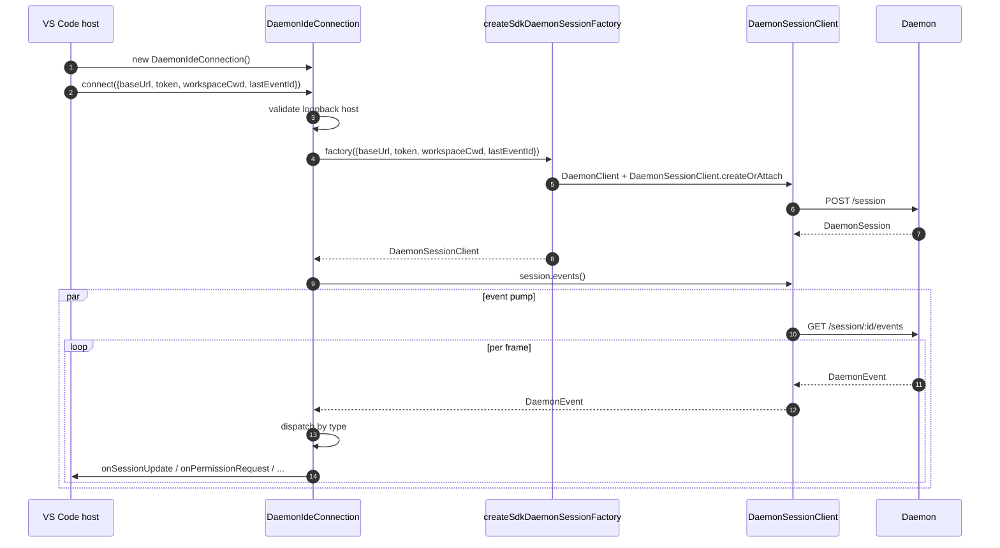
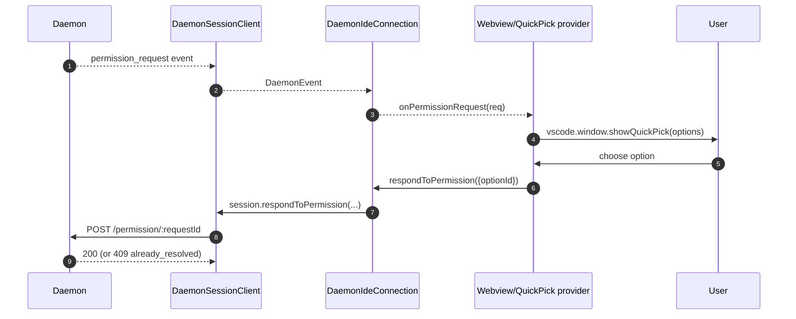
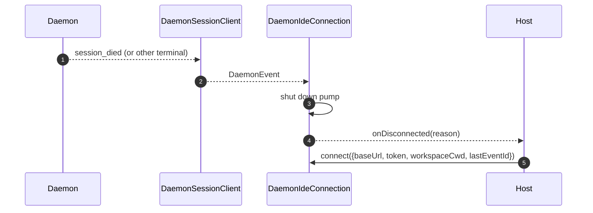

# Адаптер демона для IDE VS Code

## Обзор

`packages/vscode-ide-companion/src/services/daemonIdeConnection.ts` — это **адаптер демона для расширения VS Code**. Он позволяет компаньону IDE подключаться к работающему демону `qwen serve` через HTTP + SSE вместо запуска дочернего процесса `qwen --acp` stdio (устаревший путь `AcpConnectionState`). Это эквивалент транспорта-компаньона для хостов VS Code относительно [`14-cli-tui-adapter.md`](./14-cli-tui-adapter.md).

Чат webview IDE потребляет события демона через этот адаптер; запросы разрешений отображаются как нативные диалоги быстрого выбора VS Code.

## Обязанности

- Создание `DaemonClient` + `DaemonSessionClient` из проверенного на loopback `baseUrl`, переданного в `connect(options)`.
- Прокачка SSE-событий из сессионного клиента в диспетчеризацию по колбэкам (`onSessionUpdate`, `onPermissionRequest`, `onAskUserQuestion`, `onEndTurn`, `onDisconnected`).
- Применение инварианта **только loopback** в `connect(options)` (IDE должна подключаться только к демону на том же хосте).
- Мост между событиями демона и `postMessage` webview, чтобы панель чата оставалась синхронизированной.
- Отображение запросов разрешений через нативный UI быстрого выбора VS Code.
- Сериализация вызовов в очередь, чтобы двойной `connect()` от хоста не вызывал гонку.

## Архитектура

### Публичный интерфейс

```ts
class DaemonIdeConnection {
  connect(options: DaemonIdeConnectionOptions): Promise<void>;
  disconnect(): Promise<void>;
  sendPrompt(prompt: string | ContentBlock[]): Promise<DaemonIdePromptResult>;
  cancelSession(): Promise<void>;
  setModel(modelId: string): Promise<DaemonIdeSetModelResult>;

  onSessionUpdate: (data: SessionNotification) => void;
  onPermissionRequest: (
    data: RequestPermissionRequest,
  ) => Promise<{ optionId?: string }>;
  onAskUserQuestion: (data: AskUserQuestionRequest) => Promise<{
    optionId: string;
    answers?: Record<string, string>;
  }>;
  onEndTurn: (reason?: string) => void;
  onDisconnected: (code: number | null, signal: string | null) => void;
}

interface DaemonIdeConnectionOptions {
  baseUrl: string; // ДОЛЖЕН быть loopback (127.0.0.1 / localhost / [::1])
  token?: string;
  workspaceCwd?: string;
  modelServiceId?: string;
  lastEventId?: number;
  sessionFactory?: DaemonIdeSessionFactory;
}
```

### Проверка loopback

В `connectInternal()`:

```ts
const baseUrl = validateDaemonBaseUrl(options.baseUrl);
```

Это **клиентское жёсткое ограничение**, отличное от собственного `hostAllowlist` демона (см. [`12-auth-security.md`](./12-auth-security.md)). Компаньон IDE никогда не будет подключаться к удалённому демону — даже если оператор его настроил. Обоснование: модель угроз VS Code предполагает, что рабочая область и демон находятся на одном хосте, включая доверие к файловой системе и связанные с этим допущения.

### `createSdkDaemonSessionFactory()`

`createSdkDaemonSessionFactory()` создаёт `DaemonClient` и вызывает
`DaemonSessionClient.createOrAttach()` из `@qwen-code/sdk`. Класс
соединения хранит фабрику, а не создаёт экземпляр напрямую, чтобы тесты могли
подставить заглушку.

### Диспетчеризация событий

Соединение запускает один потребитель SSE (`for await` по `session.events()`) и направляет каждое событие по типу:

| Событие/источник демона                                                                                 | Колбэк/действие IDE                                                    |
| ------------------------------------------------------------------------------------------------------- | ---------------------------------------------------------------------- |
| `session_update`                                                                                        | `onSessionUpdate`                                                        |
| Обычный `permission_request`                                                                             | `onPermissionRequest`, затем `respondToPermission()`                      |
| `permission_request`, где `toolCall.kind === 'ask_user_question'` и `rawInput.questions` является массивом | `onAskUserQuestion`, затем пересылка `answers` демону                |
| `session_died` с полезной нагрузкой `sessionId`, совпадающей с текущей сессией                                  | `onDisconnected(null, reason)`                                           |
| Естественное завершение SSE / сбой потока / ручная `disconnect()`                                                | `onDisconnected(null, 'stream_ended' / 'daemon_error' / 'disconnected')` |
| Другие события демона                                                                                     | Логирование уровня debug; сегодня нет колбэка IDE.                                  |

`onEndTurn` не создаётся диспетчеризацией SSE. `sendPrompt()` ожидает
ответа от HTTP-запроса демона и вызывает его с `response.stopReason`; пути
исключений, не связанные с прерыванием, вызывают `onEndTurn('error')`.

### Мост с webview

Класс соединения является **транспортно-ориентированным**. Фактическая интеграция с VS Code находится в `packages/vscode-ide-companion/src/webview/providers/ChatWebviewViewProvider.ts` (и других). Провайдер подписывается на колбэки соединения и преобразует их в вызовы `postMessage` webview. Само webview использует общую библиотеку компонентов `packages/webui/` для отрисовки — см. Матрицу адаптеров в [`01-architecture.md`](./01-architecture.md).
### Сериализация connect()

`connect()` использует внутреннюю очередь, поэтому быстрый двойной вызов от хоста (например, пользователь открывает панель дважды во время выполняющегося рукопожатия) не вызывает состояния гонки. Второй вызов ожидает завершения первого; соединение оказывается в единственном детерминированном состоянии.

## Рабочий процесс

### Первоначальное подключение



### Разрешение через quick-pick



### Отключение / восстановление



## Состояние и жизненный цикл

- Конструктор синхронный; **никакого сетевого ввода-вывода** до вызова `connect(options)`.
- `connect()` идемпотентен благодаря внутренней очереди; повторный вызов сериализуется.
- `disconnect()` отменяет итератор SSE (`AbortController` на насосе) и очищает регистрации обратных вызовов.
- `lastEventId` захватывается из `DaemonSessionClient` SDK при отключении и может быть передан при следующем `connect()` для возобновления.

## Зависимости

- `packages/sdk-typescript/src/daemon/` — `DaemonClient`, `DaemonSessionClient` (фактический транспорт).
- API расширения VS Code (`vscode.*`) — API хоста, quick-pick, webview.
- `packages/webui/src/adapters/ACPAdapter.ts` — рендеринг в webview сообщений в формате ACP, передаваемых через `postMessage`.

## Конфигурация

| Параметр                                            | Где                                | Эффект                                                           |
| --------------------------------------------------- | ---------------------------------- | ---------------------------------------------------------------- |
| `baseUrl`                                           | `connect(options)`                 | URL демона; должен быть loopback.                                |
| `token`                                             | `connect(options)`                 | Токен Bearer (устанавливается через SDK).                        |
| `workspaceCwd`                                      | `connect(options)`                 | Используется в `POST /session`; должен соответствовать привязанной рабочей области демона. |
| `modelServiceId`                                    | `connect(options)` / `setModel()`  | Начальная модель.                                                |
| `lastEventId`                                       | `connect(options)`                 | Курсор возобновления (обычно восстанавливается из состояния хоста). |
| Настройка VS Code `qwen.ide.daemonUrl` (или эквивалентная) | Настройки рабочей области        | URL демона, настроенный оператором.                              |

## Предостережения и известные ограничения

- **Только loopback — жёсткий отказ в `connect(options)`.** Операторы, желающие направить IDE на удалённый демон, должны использовать SSH-проброс портов / локальный прокси; адаптер не будет подключаться к URL, не являющемуся loopback.
- **Путь устаревшего `AcpConnectionState` всё ещё является основным** в компаньоне IDE (дочерний процесс stdio). Этот адаптер является параллельным транспортом для миграции на Режим B; смотрите [`../daemon-client-adapters/ide.md`](../daemon-client-adapters/ide.md) для получения информации о блокираторах миграции и планируемой работе по паритету с `BridgeFileSystem`.
- **Обратный RPC или поверхность редакторских возможностей через HTTP пока отсутствуют.** Функции, требующие обратного вызова от агента в IDE (например, доступ к буферу только для чтения, интеграция предварительного просмотра diff), в настоящее время существуют только на пути stdio.
- **Связь webview ↔ соединение принадлежит хосту**, а не этому адаптеру. Не вносите логику, специфичную для webview, в `DaemonIdeConnection`.
- **Несоответствие `workspaceCwd`** привязанной рабочей области демона возвращает `400 workspace_mismatch` — отображайте это как чёткую ошибку настройки, а не выполняйте повторные попытки.
## Ссылки

- `packages/vscode-ide-companion/src/services/daemonIdeConnection.ts`
- `packages/vscode-ide-companion/src/services/daemonIdeConnection.ts` (`createSdkDaemonSessionFactory`)
- `packages/vscode-ide-companion/src/types/connectionTypes.ts` (устаревший `AcpConnectionState`)
- `packages/vscode-ide-companion/src/webview/providers/ChatWebviewViewProvider.ts` (мост webview)
- `packages/webui/src/adapters/ACPAdapter.ts` (адаптер ACP-сообщений webview)
- Черновик дизайна: [`../daemon-client-adapters/ide.md`](../daemon-client-adapters/ide.md)
- Справочник SDK: [`13-sdk-daemon-client.md`](./13-sdk-daemon-client.md)
