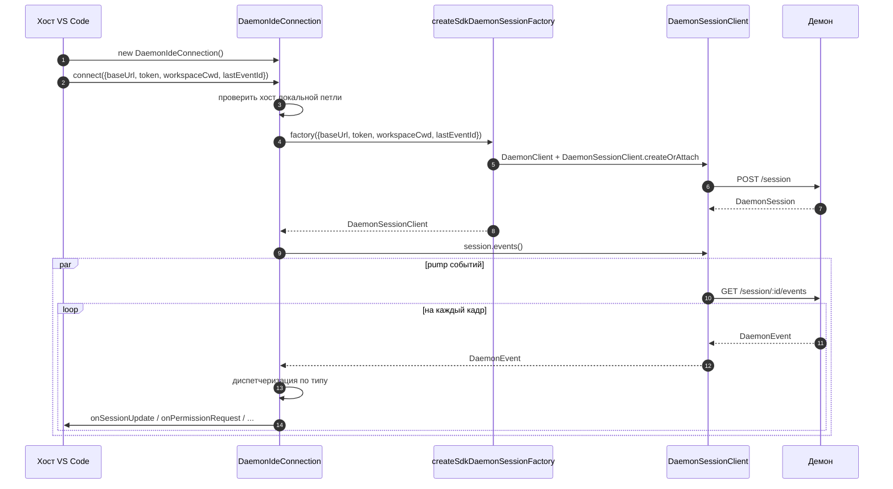
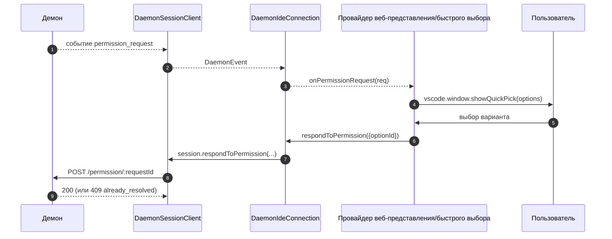
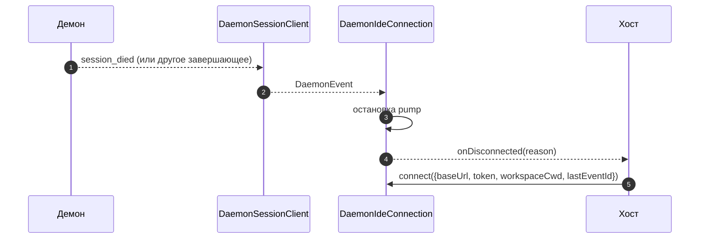

# Адаптер демона для IDE в VS Code

## Обзор

`packages/vscode-ide-companion/src/services/daemonIdeConnection.ts` — это **адаптер демона для расширения VS Code**. Он позволяет компаньону IDE подключаться к работающему демону `qwen serve` по HTTP + SSE вместо запуска дочернего процесса stdio через `qwen --acp` (устаревший путь `AcpConnectionState`). Это аналог транспорта для VS Code от [`14-cli-tui-adapter.md`](./14-cli-tui-adapter.md).

Веб-представление чата IDE потребляет события демона через этот адаптер; запросы разрешений отображаются как нативные диалоги быстрого выбора VS Code.

## Обязанности

- Создавать `DaemonClient` + `DaemonSessionClient` из проверенного на локальную петлю `baseUrl`, переданного в `connect(options)`.
- Перекачивать SSE-события от клиента сессии в диспетчеризацию по колбэкам (`onSessionUpdate`, `onPermissionRequest`, `onAskUserQuestion`, `onEndTurn`, `onDisconnected`).
- Обеспечивать инвариант **только локальная петля** в `connect(options)` (IDE должна подключаться только к демону на том же хосте).
- Связывать события демона с `postMessage` веб-представления, чтобы панель чата оставалась синхронизированной.
- Отображать запросы разрешений через нативный UI быстрого выбора VS Code.
- Сериализовать вызовы в очередь, чтобы двойной быстрый `connect()` от хоста не вызывал гонку.

## Архитектура

### Публичный интерфейс

```ts
class DaemonIdeConnection {
  connect(options: DaemonIdeConnectionOptions): Promise<void>;
  disconnect(): Promise<void>;
  sendPrompt(prompt: string | ContentBlock[]): Promise<DaemonIdePromptResult>;
  cancelSession(): Promise<void>;
  setModel(modelId: string): Promise<DaemonIdeSetModelResult>;

  onSessionUpdate: (data: SessionNotification) => void;
  onPermissionRequest: (
    data: RequestPermissionRequest,
  ) => Promise<{ optionId?: string }>;
  onAskUserQuestion: (data: AskUserQuestionRequest) => Promise<{
    optionId: string;
    answers?: Record<string, string>;
  }>;
  onEndTurn: (reason?: string) => void;
  onDisconnected: (code: number | null, signal: string | null) => void;
}

interface DaemonIdeConnectionOptions {
  baseUrl: string; // ОБЯЗАТЕЛЬНО локальная петля (127.0.0.1 / localhost / [::1])
  token?: string;
  workspaceCwd?: string;
  modelServiceId?: string;
  lastEventId?: number;
  sessionFactory?: DaemonIdeSessionFactory;
}
```

### Проверка локальной петли

В `connectInternal()`:

```ts
const baseUrl = validateDaemonBaseUrl(options.baseUrl);
```

Это **жёсткое ограничение на стороне клиента**, отличное от собственного `hostAllowlist` демона (см. [`12-auth-security.md`](./12-auth-security.md)). Компаньон IDE никогда не подключится к удалённому демону — даже если оператор его настроил. Обоснование: модель угроз VS Code предполагает, что рабочее пространство и демон находятся на одном хосте, включая доверие к файловой системе и связанные допущения.

### `createSdkDaemonSessionFactory()`

`createSdkDaemonSessionFactory()` создаёт `DaemonClient` и вызывает
`DaemonSessionClient.createOrAttach()` из `@qwen-code/sdk`. Класс
соединения хранит фабрику, а не создаёт напрямую, чтобы тесты могли подставить
заглушку.

### Диспетчеризация событий

Соединение запускает одного потребителя SSE (`for await` по `session.events()`) и направляет каждое событие по типу:

| Событие демона / источник                                                                                | Колбэк/действие IDE                                                        |
| -------------------------------------------------------------------------------------------------------- | -------------------------------------------------------------------------- |
| `session_update`                                                                                         | `onSessionUpdate`                                                          |
| Обычный `permission_request`                                                                             | `onPermissionRequest`, затем `respondToPermission()`                       |
| `permission_request`, где `toolCall.kind === 'ask_user_question'` и `rawInput.questions` — массив         | `onAskUserQuestion`, затем отправка `answers` демону                       |
| `session_died` с `sessionId`, совпадающим с текущей сессией                                               | `onDisconnected(null, reason)`                                             |
| Естественное завершение SSE / ошибка потока / ручной `disconnect()`                                       | `onDisconnected(null, 'stream_ended' / 'daemon_error' / 'disconnected')`   |
| Другие события демона                                                                                    | Логирование на уровне отладки; колбэк IDE пока не предусмотрен.            |

`onEndTurn` не генерируется диспетчеризацией SSE. `sendPrompt()` ждёт
HTTP-ответ демона на запрос и вызывает его с `response.stopReason`;
пути исключений без прерывания вызывают `onEndTurn('error')`.

### Связь с веб-представлением

Класс соединения отвечает **только за транспорт**. Фактическая интеграция с VS Code находится в `packages/vscode-ide-companion/src/webview/providers/ChatWebviewViewProvider.ts` (и связанных файлах). Провайдер подписывается на колбэки соединения и преобразует их в вызовы `postMessage` веб-представления. Само веб-представление использует общую библиотеку компонентов из `packages/webui/` для рендеринга — см. Матрицу адаптеров в [`01-architecture.md`](./01-architecture.md).

### Сериализация соединения

`connect()` использует внутреннюю очередь, чтобы двойной быстрый вызов от хоста (например, пользователь дважды открывает панель во время установки соединения) не приводил к гонке. Второй вызов ожидает завершения первого; соединение оказывается в единственном детерминированном состоянии.

## Рабочий процесс

### Первоначальное подключение



### Разрешение через быстрый выбор



### Отключение / восстановление



## Состояние и жизненный цикл

- Создание синхронно; **сетевого ввода-вывода нет** до вызова `connect(options)`.
- `connect()` идемпотентен благодаря внутренней очереди; двойной вызов сериализуется.
- `disconnect()` прерывает итератор SSE (`AbortController` на pump) и очищает регистрации колбэков.
- `lastEventId` захватывается из `DaemonSessionClient` SDK при отключении и может быть повторно передан при следующем `connect()` для возобновления.

## Зависимости

- `packages/sdk-typescript/src/daemon/` — `DaemonClient`, `DaemonSessionClient` (собственно транспорт).
- API расширений VS Code (`vscode.*`) — API хоста, быстрый выбор, веб-представление.
- `packages/webui/src/adapters/ACPAdapter.ts` — рендеринг сообщений в формате ACP, передаваемых через `postMessage`, в веб-представлении.

## Конфигурация

| Параметр                                              | Где                              | Эффект                                                               |
| ----------------------------------------------------- | -------------------------------- | -------------------------------------------------------------------- |
| `baseUrl`                                             | `connect(options)`               | URL демона; должен быть локальной петлёй.                            |
| `token`                                               | `connect(options)`               | Bearer-токен (устанавливается через SDK).                            |
| `workspaceCwd`                                        | `connect(options)`               | Используется в `POST /session`; должен совпадать с привязанным рабочим каталогом демона. |
| `modelServiceId`                                      | `connect(options)` / `setModel()`| Начальная модель.                                                    |
| `lastEventId`                                         | `connect(options)`               | Курсор возобновления (обычно восстанавливается из состояния хоста).  |
| Настройка VS Code `qwen.ide.daemonUrl` (или аналог)   | Настройки рабочего пространства  | URL демона, заданный оператором.                                     |

## Оговорки и известные ограничения

- **Только локальная петля — жёсткий отказ в `connect(options)`.** Операторы, желающие направить IDE на удалённый демон, должны использовать SSH-проброс портов или локальный прокси; адаптер не подключится к URL, не являющемуся локальной петлёй.
- **Устаревший путь `AcpConnectionState` всё ещё является основным** в компаньоне IDE (дочерний процесс stdio). Этот адаптер — родственный транспорт для миграции на Режим B; см. [`../daemon-client-adapters/ide.md`](../daemon-client-adapters/ide.md) о блокираторах миграции и запланированных работах по паритету `BridgeFileSystem`.
- **Обратный RPC или поверхность редакторских возможностей по HTTP пока отсутствуют.** Функции, требующие вызова агента обратно в IDE (например, доступ к буферу только для чтения, интеграция предварительного просмотра diff), пока доступны только через stdio.
- **Связь веб-представления и соединения принадлежит хосту**, а не этому адаптеру. Не помещайте логику, специфичную для веб-представления, в `DaemonIdeConnection`.
- **Несовпадение `workspaceCwd`** с привязанным рабочим каталогом демона возвращает `400 workspace_mismatch` — показывайте это как понятную ошибку настройки, а не повторяйте попытки.

## Ссылки

- `packages/vscode-ide-companion/src/services/daemonIdeConnection.ts`
- `packages/vscode-ide-companion/src/services/daemonIdeConnection.ts` (`createSdkDaemonSessionFactory`)
- `packages/vscode-ide-companion/src/types/connectionTypes.ts` (устаревший `AcpConnectionState`)
- `packages/vscode-ide-companion/src/webview/providers/ChatWebviewViewProvider.ts` (мост веб-представления)
- `packages/webui/src/adapters/ACPAdapter.ts` (адаптер ACP-сообщений для веб-представления)
- Черновик дизайна: [`../daemon-client-adapters/ide.md`](../daemon-client-adapters/ide.md)
- Справочник по SDK: [`13-sdk-daemon-client.md`](./13-sdk-daemon-client.md)