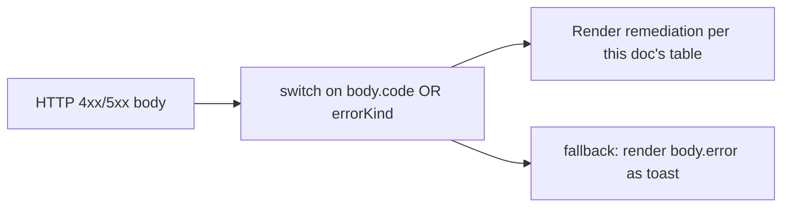
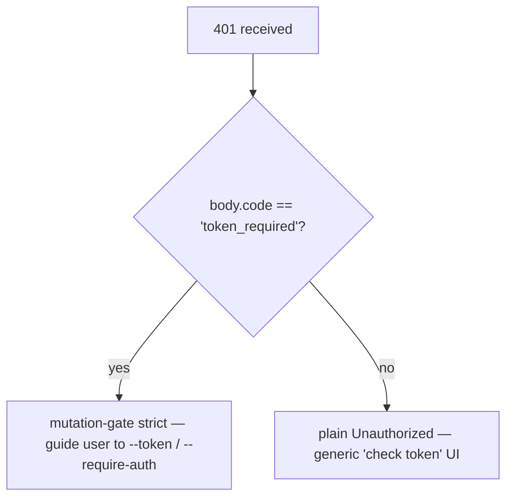

# Таксономия ошибок и устранение

## Обзор

Режимы сбоев демона намеренно представлены в виде замкнутых объединений, чтобы потребители SDK могли выполнять исчерпывающую проверку, а обработчики маршрутов формировать согласованные HTTP-ответы. В этом документе перечислены все типизированные классы/виды ошибок на трех уровнях:

1. **`packages/cli/src/serve/`** — граничные ошибки на HTTP-границе (аутентификация, файловая система рабочей области, предварительная проверка демона).
2. **`packages/acp-bridge/`** — ошибки моста/посредника на границе между демоном и дочерним процессом ACP.
3. **`packages/sdk-typescript/src/daemon/`** — обёртка со стороны SDK и структурированные поля ошибок.

Форматы ошибок на уровне проводного протокола задокументированы в [`../qwen-serve-protocol.md`](../qwen-serve-protocol.md); в этом документе добавлены сведения о причинах и способах устранения.

## Граница файловой системы (`packages/cli/src/serve/fs/errors.ts`)

`FsError` содержит `{ kind, message, status, cause? }`. Объединение `FsErrorKind` (14 видов, HTTP-статус по умолчанию):

| Вид | HTTP | Причина | Устранение |
| --- | --- | --- | --- |
| `path_outside_workspace` | 400 | Разрешенный путь выходит за пределы связанной рабочей области. | Используйте путь внутри `workspaceCwd` демона; проверьте `/capabilities`. |
| `symlink_escape` | 400 | Цель является символьной ссылкой. | Обращайтесь к разрешенному пути напрямую; символьные ссылки отклоняются по дизайну. |
| `path_not_found` | 404 | `ENOENT`. | Подтвердите существование файла; проверьте пути с учетом регистра на Linux. |
| `binary_file` | 422 | Бинарное содержимое обнаружено на текстовом маршруте. | Используйте `GET /file/bytes` для необработанных байтов; текстовый маршрут отказывается от бинарных файлов. |
| `file_too_large` | 413 | Превышение `MAX_READ_BYTES` (256 КиБ) или `MAX_WRITE_BYTES` (5 МиБ). | Используйте чтение по байтовому диапазону; разделите запись. |
| `hash_mismatch` | 409 | Сбой оптимистической блокировки `expectedSha256`. | Перечитайте файл и повторите попытку с новым хэшем. |
| `file_already_exists` | 409 | `mode: 'create'` при существующем файле. | Используйте `mode: 'overwrite'` или выберите новый путь. |
| `text_not_found` | 422 | Строка поиска `POST /file/edit` не найдена в файле. | Проверьте строку поиска; обычно причиной является несоответствие пробелов/кодировки. |
| `ambiguous_text_match` | 422 | Несколько совпадений, когда требовалось одно. | Добавьте больше окружающего контекста в строку поиска, чтобы сделать ее уникальной. |
| `untrusted_workspace` | 403 | Попытка записи в ненадежной рабочей области. | Пометьте рабочую область как доверенную (`Config.isTrustedFolder()`) или используйте `runQwenServe` вместо прямого встраивания `createServeApp`. |
| `permission_denied` | 403 | Ошибки ОС `EACCES` / `EPERM`. | Настройте ACL файловой системы; это **не** предупреждение безопасности. |
| `io_error` | 503 | `ENOSPC` / `EIO` / `EBUSY` / `ETXTBSY` / `ENAMETOOLONG` / `EMFILE` / `ENFILE`. | Оперативное исправление на уровне хоста (диск полон, исчерпание fd); проблема эксплуатации, а не безопасности. |
| `internal_error` | 500 | Ошибка, не связанная с errno, достигает границы. | Сообщите об ошибке демона. |
| `parse_error` | 400 / 422 | Ошибка разбора тела запроса (400) или нарушение инварианта на уровне сервиса (422). | Проверьте тело запроса; проверьте версию SDK. |

Различие между `io_error` и `permission_denied` сделано намеренно, чтобы конвейеры мониторинга могли маршрутизировать по `errorKind`; включение ENOSPC в `permission_denied` приводило бы к вызову группы безопасности для проблемы `df -h`.
## Ошибки моста (`packages/acp-bridge/src/bridgeErrors.ts`)

Типизированные классы, выбрасываемые мостом / медиатором. Большинство содержат HTTP-статус через переключатель обработчика маршрута.

| Класс                                 | HTTP | Причина                                                                                 | Исправление                                                                                                                                                                    |
| ------------------------------------- | ---- | --------------------------------------------------------------------------------------- | ------------------------------------------------------------------------------------------------------------------------------------------------------------------------------ |
| `SessionNotFoundError`                | 404  | sessionId отсутствует в `byId`.                                                         | Пересоздайте или присоединитесь; возможно, сессия была завершена.                                                                                                              |
| `WorkspaceMismatchError`              | 400  | `POST /session` `cwd` ≠ `boundWorkspace` демона.                                        | Опустите `cwd` (используется привязанный) или направьте запрос к демону, привязанному к вашему `cwd`.                                                                         |
| `SessionLimitExceededError`           | 503  | `byId.size >= maxSessions`.                                                             | Закройте устаревшие сессии; увеличьте `--max-sessions`.                                                                                                                        |
| `InvalidClientIdError`                | 400  | `X-Qwen-Client-Id` вне `[A-Za-z0-9._:-]{1,128}`.                                       | Проверьте идентификатор клиента.                                                                                                                                               |
| `InvalidSessionMetadataError`         | 400  | `displayName` > 256 символов или содержит управляющие символы.                          | Обрежьте / проверьте.                                                                                                                                                          |
| `InvalidSessionScopeError`            | 400  | Неизвестное значение `sessionScope`.                                                    | Используйте `'single'` или `'thread'`.                                                                                                                                         |
| `RestoreInProgressError`              | 409  | Конкурирующие `loadSession` / `resumeSession`.                                          | Подождите и повторите.                                                                                                                                                         |
| `WorkspaceInitConflictError`          | 409  | `POST /workspace/init` для существующего файла без `force`.                             | Передайте `force: true` или выберите другой путь.                                                                                                                              |
| `WorkspaceInitPathEscapeError`        | 400  | Путь инициализации выходит за пределы рабочей области.                                  | Используйте путь внутри `workspaceCwd`.                                                                                                                                         |
| `WorkspaceInitSymlinkError`           | 400  | Путь инициализации является символической ссылкой.                                      | Обратитесь к разрешённому пути.                                                                                                                                                |
| `WorkspaceInitRaceError`              | 409  | Состояние гонки TOCTOU при инициализации.                                               | Повторите попытку.                                                                                                                                                             |
| `McpServerNotFoundError`              | 404  | Перезапуск для неизвестного сервера.                                                    | Проверьте имя сервера в `/workspace/mcp`.                                                                                                                                      |
| `McpServerRestartFailedError`         | 502  | Перезапуск не удался внутри дочернего процесса ACP.                                     | Проверьте логи дочернего процесса ACP; возможно, сервер MCP неисправен.                                                                                                        |
| `InvalidPermissionOptionError`        | 400  | Wire vote попытался внедрить `CANCEL_VOTE_SENTINEL` через `optionId`.                   | Голосуйте с `{outcome: 'cancelled'}` вместо `optionId`.                                                                                                                        |
| `PermissionForbiddenError`            | 403  | Политика отклонила голосующего (`designated_mismatch` / `remote_not_allowed`).          | Используйте идентификатор клиента инициатора (назначенный), предварительно зарегистрируйте голосующего (консенсус) или голосуйте с loopback (только локальный). См. [`04-permission-mediation.md`](./04-permission-mediation.md). |
| `CancelSentinelCollisionError`        | 500  | Агент опубликовал `'__cancelled__'` как легитимную метку варианта.                      | Ошибка агента — измените метку варианта на любую, кроме sentinel.                                                                                                              |
| `PermissionPolicyNotImplementedError` | 500  | Запрошенная политика не встроена в данного демона.                                      | Обновите демона или измените `policy.permissionStrategy`.                                                                                                                      |
| `BridgeChannelClosedError`            | 503  | Канал дочернего процесса ACP закрыт во время вызова.                                    | Переподключитесь / повторите; проверьте `session_died` для выяснения причины.                                                                                                  |
| `BridgeTimeoutError`                  | 504  | Превышено время ожидания на уровне моста.                                               | Повторите; изучите причины замедления.                                                                                                                                         |
| `MissingCliEntryError`                | 500  | Отсутствует файл точки входа CLI `qwen` (определён в `status.ts`, а не в `bridgeErrors.ts`). | Убедитесь, что установка CLI завершена; проверьте существование `packages/cli/index.ts`.                                                                                      |
## Ошибки конфигурации во время запуска (`packages/cli/src/serve/run-qwen-serve.ts`)

| Класс                        | Сценарий                                                                                                                                                                                                                                   | Устранение                                                                                                                                                                                       |
| ---------------------------- | ------------------------------------------------------------------------------------------------------------------------------------------------------------------------------------------------------------------------------------------ | ------------------------------------------------------------------------------------------------------------------------------------------------------------------------------------------------ |
| `InvalidPolicyConfigError`   | `validatePolicyConfig()` отклоняет объединённые настройки: неизвестный `policy.permissionStrategy` (валидируется по `SERVE_CAPABILITY_REGISTRY.permission_mediation.modes`) или неположительное целое `policy.consensusQuorum`. Загрузка явно завершается ошибкой. | Исправьте проблемное поле в `settings.json`. Класс поддерживает `instanceof`; `runQwenServe` использует его, чтобы отличить несоответствие политики от ошибок ввода-вывода при чтении настроек, которые откатываются к значениям по умолчанию. |

## Аутентификация Device Flow (`packages/cli/src/serve/auth/device-flow.ts`)

| Класс                          | Сценарий                                                         | Примечания                                                                                                                                                                                                                                                                                                                                                                                                                                    |
| ------------------------------ | ---------------------------------------------------------------- | -------------------------------------------------------------------------------------------------------------------------------------------------------------------------------------------------------------------------------------------------------------------------------------------------------------------------------------------------------------------------------------------------------------------------------------------- |
| `UpstreamDeviceFlowError`      | Вышестоящий IdP возвращает структурированную ошибку во время опроса. | `oauthError` очищается с помощью `sanitizeForStderr` перед интерполяцией в stderr или аудит-подсказки (защита от CVE-2021-42574 / Trojan Source; см. [`12-auth-security.md`](./12-auth-security.md)).                                                                                                                                                                                                                                         |
| `DeviceFlowPollTimeoutError`   | Таймер гонки реестра срабатывает до того, как провайдер вернёт результат. | Код провайдера не должен выбрасывать этот тип. Он экспортируется для тестов, но реестр проверяет `pollTimedOut` по рантайм-маркеру `_isRegistryTimeout: boolean`, а не через `instanceof`. Провайдер, который импортирует и выбрасывает `new DeviceFlowPollTimeoutError(ms)`, всё равно следует общему пути аудита выбрасывания провайдера, так как `_isRegistryTimeout` по умолчанию `false`; только внутренняя фабрика `makeRegistryPollTimeoutError(ms)` устанавливает маркер. |

## Типы ошибок daemon-host (`packages/acp-bridge/src/status.ts`)

`SERVE_ERROR_KINDS` — это закрытое перечисление, используемое диагностическими ячейками и структурированными ошибками демона:

| Вид                          | Значение                                                                |
| ---------------------------- | ----------------------------------------------------------------------- |
| `missing_binary`             | Не удалось разрешить необходимый локальный исполняемый файл или точку входа CLI. |
| `blocked_egress`             | Не удался исходящий сетевой зонд.                                          |
| `auth_env_error`             | Недопустимая конфигурация переменной окружения, провайдера или шлюза доверия, связанных с аутентификацией. |
| `init_timeout`               | Сторона демона превысила время ожидания при инициализации.                 |
| `protocol_error`             | Несоответствие протокола ACP/HTTP.                                         |
| `missing_file`               | Отсутствует необходимый локальный файл.                                    |
| `parse_error`                | Ошибка разбора локального файла или запроса.                                |
| `stat_failed`                | Не удалась операция stat для локальной файловой системы.                    |
| `budget_exhausted`           | Принудительное отбрасывание обнаружения или записи сервера из-за исчерпания бюджета MCP. |
| `mcp_budget_would_exceed`    | Перезапуск или мутация MCP превысили бы настроенный бюджет.                |
| `mcp_server_spawn_failed`    | Не удался запуск или перезапуск сервера MCP.                                |
| `invalid_config`             | Недопустимая конфигурация MCP или демона.                                   |
| `prompt_deadline_exceeded`   | Истёк срок выполнения промпта по wallclock.                                 |
| `writer_idle_timeout`        | SSE-писатель не выполнил успешных записей до истечения времени простоя.     |
Они передаются через `errorKind` префлайт-ячейки, чтобы клиентские UI отображали структурированное исправление (а не сырые стектрейсы).

## Формы ошибок аутентификации

| Статус | Тело                                         | Когда                                                                                                                                         |
| ------ | -------------------------------------------- | --------------------------------------------------------------------------------------------------------------------------------------------- |
| `401`  | `{ error: 'Unauthorized' }`                  | Отсутствует / неверный / токен без схемы. Однотипно для `missing header` / `wrong scheme` / `wrong token`, чтобы зондирование не могло различить. |
| `401`  | `{ error: '...', code: 'token_required' }`   | Строгий маршрут шлюза мутаций на демоне без токена (loopback). SDK отображают подсказку "configure --token / --require-auth".                  |
| `403`  | `{ error: 'Request denied by CORS policy' }` | `denyBrowserOriginCors` отклонил запрос с заголовком `Origin`.                                                                                |
| `403`  | `{ error: 'Invalid Host header' }`           | `hostAllowlist` отклонил заголовок `Host` (защита от DNS-ребендинга).                                                                         |

См. [`12-auth-security.md`](./12-auth-security.md) для полной модели аутентификации.

## Результаты разрешений (проводная форма против перегрузки аудита)

`PermissionResolution` имеет два терминальных вида:

- `{kind: 'option', optionId}` — голос победил.
- `{kind: 'cancelled', reason: 'timeout' \| 'session_closed' \| 'agent_cancelled'}` — запрос отменён. Проводная форма — одиночная (`{outcome: 'cancelled'}`); журнал аудита различает timeout / session_closed / voter-cancelled / agent-cancelled в `decisionReason.type`. Эта перегрузка сохранена намеренно, чтобы не нарушать замороженный контракт `permission.ts`.

## Обёртывание ошибок на стороне SDK

`DaemonClient` возвращает HTTP‑ошибки как отклонённые Promise с разобранным телом в качестве значения отклонения. Методы, получающие `404` для неизвестных сессий, отклоняют с `{error, sessionId}`; SDK в настоящее время не обёртывает их в типизированный класс. Вызывающие не должны полагаться на `instanceof Error` плюс `.message.includes(...)`; переключайтесь на `err.code` или `err.kind` из тела.

`parseSseStream` прерывает итератор при переполнении буфера 16 МиБ (защитный лимит).

## Рабочий процесс

### Отображение ошибки пользователю

### Различение режимов сбоя аутентификации

## Зависимости

- Все классы ошибок экспортируются из своих пакетов; потребители SDK могут использовать `instanceof` для типов `bridgeErrors.ts` при работе в том же процессе Node. По сети — переключайтесь на `body.code` / `body.kind` / `body.errorKind`.

## Оговорки и известные ограничения

- **`io_error` vs `permission_denied`** различаются намеренно. Не смешивайте.
- **Причины `PermissionForbiddenError` (`designated_mismatch` / `remote_not_allowed`) перегружены** между политиками `designated` и `consensus`; журнал аудита различает их точно, но проводная форма — нет.
- **`CancelSentinelCollisionError` указывает на ошибку на стороне агента**, а не на событие безопасности — мост отклоняет запрос, а не позволяет сторожевому сентинелю совпасть с реальным вариантом.
- **Типизированные ошибки на стороне SDK ещё развиваются.** Вызывающие должны переключаться на поля тела, а не полагаться на идентичность JS‑класса через сеть.
- **`internal_error` всегда следует расследовать.** Он сигнализирует, что конструктор `FsError` был вызван с видом, зарезервированным для путей без errno (ошибка программиста); поле `cause` ответа может содержать исходное исключение.

## Ссылки

- `packages/cli/src/serve/fs/errors.ts` (`FsErrorKind`, `FsErrorStatus`)
- `packages/acp-bridge/src/bridgeErrors.ts` (every typed class)
- `packages/acp-bridge/src/status.ts` (`SERVE_ERROR_KINDS`, `ServeErrorKind`)
- `packages/cli/src/serve/auth.ts` (auth bodies)
- Справочник по проводному протоколу: [`../qwen-serve-protocol.md`](../qwen-serve-protocol.md).
