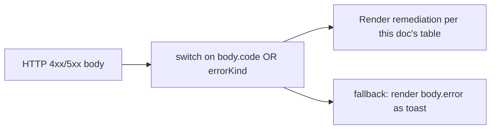
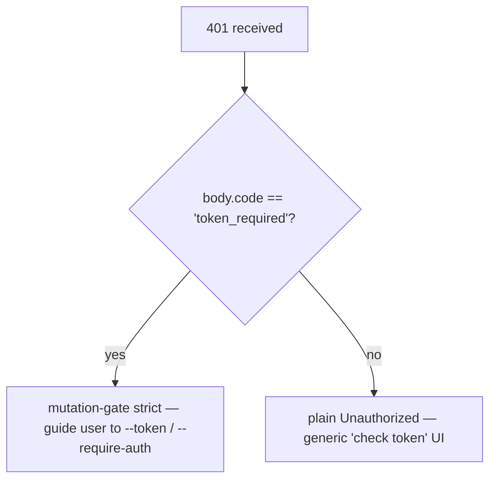

# Таксономия ошибок и устранение неполадок

## Обзор

Режимы сбоев демона намеренно реализованы как закрытые объединения (closed unions), чтобы потребители SDK могли выполнять исчерпывающую обработку (exhaustive switch), а обработчики маршрутов могли формировать согласованные HTTP-ответы. Этот документ каталогизирует все типизированные классы/виды ошибок по трем уровням:

1. **`packages/cli/src/serve/`** — граничные ошибки на уровне HTTP (аутентификация, файловая система рабочей области, предварительная проверка демона).
2. **`packages/acp-bridge/`** — ошибки моста/посредника на границе демон–ACP-дочерний процесс.
3. **`packages/sdk-typescript/src/daemon/`** — обёртка ошибок и структурированные поля на стороне SDK.

Форматы ошибок на уровне протокола описаны в [`../qwen-serve-protocol.md`](../qwen-serve-protocol.md); данный документ дополняет их причиной и рекомендациями по устранению.

## Граница файловой системы (`packages/cli/src/serve/fs/errors.ts`)

`FsError` содержит `{ kind, message, status, cause? }`. Объединение `FsErrorKind` (14 видов, HTTP-статус по умолчанию):

| Вид                        | HTTP      | Причина                                                                         | Устранение                                                                                                             |
| -------------------------- | --------- | ------------------------------------------------------------------------------- | ---------------------------------------------------------------------------------------------------------------------- |
| `path_outside_workspace`   | 400       | Разрешенный путь выходит за пределы привязанной рабочей области.                 | Используйте путь внутри `workspaceCwd` демона; проверьте `/capabilities`.                                               |
| `symlink_escape`           | 400       | Цель является символической ссылкой.                                            | Обращайтесь напрямую к разрешенному пути; символические ссылки отклонены намеренно.                                      |
| `path_not_found`           | 404       | `ENOENT`.                                                                       | Убедитесь, что файл существует; проверьте регистрозависимость путей на Linux.                                            |
| `binary_file`              | 422       | Контент определён как бинарный на текстовом маршруте.                           | Используйте `GET /file/bytes` для получения сырых байтов; текстовый маршрут отказывается от бинарных файлов.             |
| `file_too_large`           | 413       | Превышает `MAX_READ_BYTES` (256 КБ) или `MAX_WRITE_BYTES` (5 МБ).               | Используйте чтение по диапазону байтов; разделите запись.                                                                |
| `hash_mismatch`            | 409       | Ошибка оптимистичной блокировки `expectedSha256`.                               | Перечитайте файл и повторите попытку с новым хешем.                                                                      |
| `file_already_exists`      | 409       | `mode: 'create''` при существующем файле.                                       | Используйте `mode: 'overwrite'` или выберите другой путь.                                                                |
| `text_not_found`           | 422       | Искомая строка в `POST /file/edit` не найдена в файле.                          | Перепроверьте строку поиска; обычно причина в несовпадении пробелов/кодировки.                                          |
| `ambiguous_text_match`     | 422       | Несколько совпадений, когда требовалось одно.                                   | Добавьте больше контекста вокруг строки поиска, чтобы сделать её уникальной.                                             |
| `untrusted_workspace`      | 403       | Попытка записи в ненадёжной рабочей области.                                    | Пометьте рабочую область как надёжную (`Config.isTrustedFolder()`) или используйте `runQwenServe` вместо прямого встраивания `createServeApp`. |
| `permission_denied`        | 403       | Ошибка ОС `EACCES` / `EPERM`.                                                   | Настройте ACL файловой системы; это **не** сигнал безопасности.                                                          |
| `io_error`                 | 503       | `ENOSPC` / `EIO` / `EBUSY` / `ETXTBSY` / `ENAMETOOLONG` / `EMFILE` / `ENFILE`. | Операционное исправление на уровне хоста (диск заполнен, исчерпаны файловые дескрипторы); обращаться к Ops, не к безопасности. |
| `internal_error`           | 500       | Не-errno ошибка достигает границы.                                              | Сообщите об ошибке демона.                                                                                              |
| `parse_error`              | 400 / 422 | Ошибка парсинга тела запроса (400) или нарушение инварианта уровня сервиса (422). | Проверьте тело запроса; проверьте версию SDK.                                                                           |

Различие между `io_error` и `permission_denied` сделано намеренно, чтобы мониторинговые пайплайны могли маршрутизироваться по `errorKind`; отнесение ENOSPC к `permission_denied` приводило бы к вызову службы безопасности для проблемы `df -h`.

## Ошибки моста (`packages/acp-bridge/src/bridgeErrors.ts`)

Типизированные классы, выбрасываемые мостом/посредником. Большинство несут HTTP-статус через switch обработчика маршрута.

| Класс                               | HTTP | Причина                                                                           | Устранение                                                                                                                                                                          |
| ----------------------------------- | ---- | --------------------------------------------------------------------------------- | ----------------------------------------------------------------------------------------------------------------------------------------------------------------------------------- |
| `SessionNotFoundError`              | 404  | `sessionId` отсутствует в `byId`.                                                 | Создайте или подключите сессию заново; возможно, она была удалена.                                                                                                                  |
| `WorkspaceMismatchError`            | 400  | `POST /session` `cwd` ≠ `boundWorkspace` демона.                                 | Опустите `cwd` (используется привязанная) или направьте запрос к демону, привязанному к вашему `cwd`.                                                                               |
| `SessionLimitExceededError`         | 503  | `byId.size >= maxSessions`.                                                      | Закройте устаревшие сессии; увеличьте `--max-sessions`.                                                                                                                             |
| `InvalidClientIdError`              | 400  | `X-Qwen-Client-Id` не соответствует `[A-Za-z0-9._:-]{1,128}`.                    | Очистите идентификатор клиента.                                                                                                                                                     |
| `InvalidSessionMetadataError`       | 400  | `displayName` > 256 символов или содержит управляющие символы.                    | Обрежьте/очистите.                                                                                                                                                                  |
| `InvalidSessionScopeError`          | 400  | Неизвестное значение `sessionScope`.                                              | Используйте `'single'` или `'thread'`.                                                                                                                                              |
| `RestoreInProgressError`            | 409  | Конкурентный вызов `loadSession` / `resumeSession`.                               | Подождите и повторите.                                                                                                                                                              |
| `WorkspaceInitConflictError`        | 409  | `POST /workspace/init` для существующего файла без `force`.                       | Передайте `force: true` или выберите другой путь.                                                                                                                                    |
| `WorkspaceInitPathEscapeError`      | 400  | Путь инициализации выходит за пределы рабочей области.                             | Используйте путь внутри `workspaceCwd`.                                                                                                                                             |
| `WorkspaceInitSymlinkError`         | 400  | Путь инициализации является символической ссылкой.                                | Обращайтесь к разрешенному пути.                                                                                                                                                    |
| `WorkspaceInitRaceError`            | 409  | Состояние гонки TOCTOU при инициализации.                                         | Повторите попытку.                                                                                                                                                                  |
| `McpServerNotFoundError`            | 404  | Перезапуск для неизвестного сервера.                                              | Проверьте имя сервера в `/workspace/mcp`.                                                                                                                                           |
| `McpServerRestartFailedError`       | 502  | Сбой перезапуска внутри дочернего процесса ACP.                                   | Проверьте логи дочернего процесса ACP; возможно, неисправный MCP-сервер.                                                                                                            |
| `InvalidPermissionOptionError`      | 400  | Попытка внедрить `CANCEL_VOTE_SENTINEL` через `optionId`.                        | Голосуйте через `{outcome: 'cancelled'}`, а не через `optionId`.                                                                                                                    |
| `PermissionForbiddenError`          | 403  | Политика отклонила голосующего (`designated_mismatch` / `remote_not_allowed`).    | Используйте идентификатор клиента-инициатора (designated), предварительно зарегистрируйте голосующего (consensus) или голосуйте с loopback (local-only). См. [`04-permission-mediation.md`](./04-permission-mediation.md). |
| `CancelSentinelCollisionError`      | 500  | Агент опубликовал `'__cancelled__'` как легитимную метку опции.                  | Ошибка агента — измените метку опции на любую другую, кроме sentinel.                                                                                                               |
| `PermissionPolicyNotImplementedError` | 500  | Запрошенная политика не встроена в данного демона.                                | Обновите демона или измените `policy.permissionStrategy`.                                                                                                                           |
| `BridgeChannelClosedError`          | 503  | Канал дочернего процесса ACP закрылся во время вызова.                            | Переподключитесь/повторите; проверьте `session_died` для выяснения причины.                                                                                                          |
| `BridgeTimeoutError`                | 504  | Превышено время ожидания на уровне моста.                                         | Повторите; исследуйте замедление нижележащих компонентов.                                                                                                                           |
| `MissingCliEntryError`              | 500  | Отсутствует файл точки входа CLI `qwen` (определён в `status.ts`, не в `bridgeErrors.ts`). | Убедитесь, что установка CLI завершена; проверьте существование `packages/cli/index.ts`.                                                                                             |

## Ошибки конфигурации при запуске (`packages/cli/src/serve/run-qwen-serve.ts`)

| Класс                       | Когда                                                                                                                                                                                                                                      | Устранение                                                                                                                                                                                        |
| --------------------------- | ------------------------------------------------------------------------------------------------------------------------------------------------------------------------------------------------------------------------------------------- | ------------------------------------------------------------------------------------------------------------------------------------------------------------------------------------------------- |
| `InvalidPolicyConfigError`  | `validatePolicyConfig()` отвергает объединённые настройки: неизвестное `policy.permissionStrategy` (валидируется по `SERVE_CAPABILITY_REGISTRY.permission_mediation.modes`) или неположительное целое `policy.consensusQuorum`. Запуск явно завершается неудачей. | Исправьте проблемное поле в `settings.json`. Класс поддерживает `instanceof`; `runQwenServe` использует это для отличия несоответствия политики от ошибок ввода-вывода при чтении настроек (в последнем случае применяются значения по умолчанию). |

## Аутентификация через Device Flow (`packages/cli/src/serve/auth/device-flow.ts`)

| Класс                            | Когда                                                     | Примечания                                                                                                                                                                                                                                                                                                                                          |
| -------------------------------- | --------------------------------------------------------- | --------------------------------------------------------------------------------------------------------------------------------------------------------------------------------------------------------------------------------------------------------------------------------------------------------------------------------------------------- |
| `UpstreamDeviceFlowError`        | Вышестоящий IdP возвращает структурированную ошибку при опросе. | `oauthError` очищается с помощью `sanitizeForStderr` перед интерполяцией в stderr или подсказки аудита (защита от CVE-2021-42574 / Trojan Source; см. [`12-auth-security.md`](./12-auth-security.md)).                                                                                                                       |
| `DeviceFlowPollTimeoutError`     | Таймер состояния гонки реестра срабатывает до ответа провайдера. | Код провайдера не должен выбрасывать этот тип. Он экспортируется для тестов, но реестр проверяет `pollTimedOut` на основе runtime-марки `_isRegistryTimeout: boolean`, а не `instanceof`. Провайдер, импортирующий и выбрасывающий `new DeviceFlowPollTimeoutError(ms)`, всё равно проходит по общему пути аудита для провайдерских исключений, так как `_isRegistryTimeout` по умолчанию равно `false`; только внутренняя фабрика `makeRegistryPollTimeoutError(ms)` устанавливает марку. |

## Виды ошибок демона-хоста (`packages/acp-bridge/src/status.ts`)

`SERVE_ERROR_KINDS` — это закрытое перечисление, используемое диагностическими ячейками и структурированными ошибками демона:

| Вид                          | Значение                                                            |
| ---------------------------- | ------------------------------------------------------------------- |
| `missing_binary`             | Не удалось найти требуемый локальный исполняемый файл или точку входа CLI. |
| `blocked_egress`             | Проверка исходящего сетевого соединения не удалась.                  |
| `auth_env_error`             | Некорректная конфигурация переменной окружения, провайдера или шлюза доверия, связанная с аутентификацией. |
| `init_timeout`               | Шаг инициализации на стороне демона превысил отведённое время.       |
| `protocol_error`             | Несоответствие протокола ACP / HTTP.                                |
| `missing_file`               | Отсутствует требуемый локальный файл.                               |
| `parse_error`                | Ошибка парсинга локального файла или запроса.                       |
| `stat_failed`                | Сбой `stat` для локальной файловой системы.                         |
| `budget_exhausted`           | Принудительное соблюдение бюджета MCP отклонило обнаружение или запись сервера. |
| `mcp_budget_would_exceed`    | Перезапуск или изменение MCP превысило бы настроенный бюджет.       |
| `mcp_server_spawn_failed`    | Сбой запуска или перезапуска MCP-сервера.                           |
| `invalid_config`             | Некорректная конфигурация MCP или демона.                           |
| `prompt_deadline_exceeded`   | Истёк срок ожидания промпта.                                        |
| `writer_idle_timeout`        | SSE-писатель не выполнил ни одной успешной записи до истечения тайм-аута бездействия. |

Эти виды отображаются через `errorKind` ячейки предварительной проверки, чтобы клиентские UI могли формировать структурированные рекомендации по устранению (а не сырые стектрейсы).

## Формы ошибок аутентификации

| Статус | Тело                                          | Когда                                                                                                                                                  |
| ------ | --------------------------------------------- | ------------------------------------------------------------------------------------------------------------------------------------------------------ |
| `401`  | `{ error: 'Unauthorized' }`                   | Отсутствует/неверный/без схемы bearer-токен. Единообразно для `отсутствует заголовок` / `неверная схема` / `неверный токен`, чтобы зондирование не могло различить. |
| `401`  | `{ error: '...', code: 'token_required' }`    | Mutation-gate строгий маршрут на демоне без токена с loopback. SDK отображают подсказку "настройте --token / --require-auth".                            |
| `403`  | `{ error: 'Request denied by CORS policy' }`  | `denyBrowserOriginCors` отклонил запрос с заголовком `Origin`.                                                                                         |
| `403`  | `{ error: 'Invalid Host header' }`            | `hostAllowlist` отклонил заголовок `Host` (защита от DNS rebinding).                                                                                    |

Полная модель аутентификации описана в [`12-auth-security.md`](./12-auth-security.md).

## Результаты разрешения разрешений (перегрузка wire vs аудит)

`PermissionResolution` имеет два терминальных вида:

- `{kind: 'option', optionId}` — голос победил.
- `{kind: 'cancelled', reason: 'timeout' | 'session_closed' | 'agent_cancelled'}` — запрос отменён. Форма на проводе — одиночная (`{outcome: 'cancelled'}`); лог аудита различает timeout / session_closed / voter-cancelled / agent-cancelled в `decisionReason.type`. Эта перегрузка сохранена намеренно, чтобы не нарушать замороженный контракт `permission.ts`.

## Обёртка ошибок на стороне SDK

`DaemonClient` возвращает HTTP-ошибки как отклонённые Promise с распарсенным телом в качестве значения отклонения. Методы, которые получают `404` для неизвестных сессий, отклоняются с `{error, sessionId}`; SDK не оборачивает их в типизированный класс на данный момент. Вызывающие не должны полагаться на `instanceof Error` плюс `.message.includes(...)`, а вместо этого использовать `err.code` или `err.kind` из тела ответа.
`parseSseStream` прерывает итератор при переполнении буфера на 16 МБ (защитная граница).

## Рабочий процесс

### Отображение ошибки пользователю

### Различие режимов ошибок аутентификации

## Зависимости

- Все классы ошибок экспортируются из соответствующих пакетов; потребители SDK могут использовать `instanceof` с типами из `bridgeErrors.ts` при работе в том же процессе Node. При передаче по сети маршрутизация выполняется по `body.code` / `body.kind` / `body.errorKind`.

## Ограничения и известные проблемы

- **`io_error` vs `permission_denied`** различаются намеренно. Не смешивайте их.
- **Причины `PermissionForbiddenError` (`designated_mismatch` / `remote_not_allowed`) перегружены** в политиках `designated` и `consensus`; журнал аудита различает их точно, но сетевая форма — нет.
- **`CancelSentinelCollisionError` указывает на ошибку на стороне агента**, а не на событие безопасности — мост отклоняет запрос, а не позволяет сторожевому токену совпасть с реальным вариантом.
- **Типизированные ошибки на стороне SDK всё ещё развиваются.** Вызывающему коду следует маршрутизировать по полям тела, а не полагаться на идентичность класса JS через сеть.
- **`internal_error` всегда требует расследования.** Он означает, что конструктор `FsError` был вызван с видом, зарезервированным для путей, не связанных с errno (ошибка программиста); поле `cause` в теле ответа может содержать исходное исключение.

## Ссылки

- `packages/cli/src/serve/fs/errors.ts` (`FsErrorKind`, `FsErrorStatus`)
- `packages/acp-bridge/src/bridgeErrors.ts` (every typed class)
- `packages/acp-bridge/src/status.ts` (`SERVE_ERROR_KINDS`, `ServeErrorKind`)
- `packages/cli/src/serve/auth.ts` (auth bodies)
- Wire reference: [`../qwen-serve-protocol.md`](../qwen-serve-protocol.md).