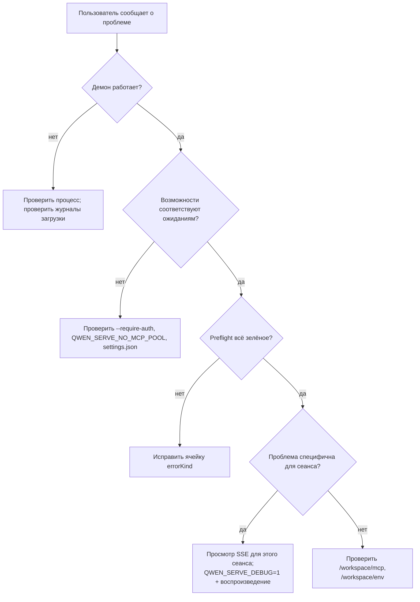

# Observability & Отладка

## Обзор

`qwen serve` в настоящее время поставляется с **инструментарием пролетов OpenTelemetry**, **структурированными файловыми журналами** (`DaemonLogger`), **журналами доступа для каждого запроса**, отладочными журналами stderr, структурированными предварительными ячейками и кольцом аудита разрешений в памяти. Эта страница представляет собой практическое руководство по текущей поверхности наблюдаемости и пробелам, которые следует помнить при разборе проблем.

## Что существует сегодня

| Поверхность                                  | Местоположение                                | Назначение                                                                                                                                                                                                                                                                                 |
| -------------------------------------------- | ---------------------------------------------- | ------------------------------------------------------------------------------------------------------------------------------------------------------------------------------------------------------------------------------------------------------------------------------------------ |
| `QWEN_SERVE_DEBUG` stderr журналы            | `bridge.ts` и места вызовов                    | Значения env `1` / `true` / `on` / `yes` (без учета регистра) выводят строки `qwen serve debug: ...` в stderr.                                                                                                                                                                             |
| Инструментарий пролетов OpenTelemetry        | `server.ts` `daemonTelemetryMiddleware`        | Каждый HTTP-запрос оборачивается в `withDaemonRequestSpan`; атрибуты включают route, sessionId, clientId и код состояния. Маршруты разрешений имеют выделенные пролеты. Жизненный цикл промпта отслеживается от начала до конца. Конфигурация находится в `settings.json` `telemetry`.      |
| Структурированные файловые журналы `DaemonLogger` | `serve/daemon-logger.ts`                       | Структурированные JSON-подобные строки журналов записываются в файл. При запуске выводится `daemon log -> <path>`. Поддерживает уровни `info` / `warn` / `error` со структурированными полями, такими как `route`, `sessionId`, `clientId`, `childPid` и `channelId`.                        |
| Промежуточное ПО журнала доступа для каждого запроса | `server.ts`, зарегистрировано перед `bearerAuth` | Журналирует `method`, `path`, `status`, `durationMs`, `sessionId` и `clientId` после каждого запроса. Пропускает `GET /health` и heartbeat. Для 4xx+ использует `warn`; для успехов – `info`.                                                                                               |
| `/health`                                   | `server.ts` route                              | Проверка жизнеспособности; `?deep=1` возвращает расширенные сведения.                                                                                                                                                                                                                     |
| `/capabilities`                             | `server.ts` route                              | Обнаружение возможностей перед полетом. См. [`11-capabilities-versioning.md`](./11-capabilities-versioning.md).                                                                                                                                                                            |
| `/workspace/preflight`                      | Маршрут -> `DaemonStatusProvider`              | Структурированные ячейки готовности: версия Node, точка входа CLI, ripgrep, git, npm, а также ячейки уровня ACP, когда дочерний процесс активен.                                                                                                                                           |
| `/workspace/env`                            | Маршрут -> `DaemonStatusProvider`              | Снимок env процессов демона. Секретные переменные env сообщают только о наличии; учетные данные URL прокси удаляются.                                                                                                                                                                      |
| `/workspace/mcp`                            | Маршрут -> bridge extMethod                    | Снимок пула, бюджета и отказов.                                                                                                                                                                                                                                                            |
| `/workspace/skills`, `/workspace/providers` | Маршруты                                       | "Живые" снимки со стороны ACP; возвращают пустые данные бездействия, когда сессия не существует.                                                                                                                                                                                          |
| SSE для каждой сессии                       | `GET /session/:id/events`                      | Поток событий в реальном времени.                                                                                                                                                                                                                                                          |
| Отладочная консоль `/demo`                  | `GET /demo` (`packages/cli/src/serve/demo.ts`) | Доступная через браузер одностраничная консоль: чат, журнал событий, инспектор рабочей области и пользовательский интерфейс разрешений. На петлевом интерфейсе `http://127.0.0.1:4170/demo` — самый быстрый путь сквозной валидации без написания SDK-кода. Правила регистрации описаны в [`02-serve-runtime.md`](./02-serve-runtime.md). |
| `PermissionAuditRing`                       | `permission-audit.ts`                          | FIFO в памяти на 512 решений о разрешениях.                                                                                                                                                                                                                                                |
| Аудит `decisionReason` медиатора            | `permissionMediator.ts`                        | Внутренняя структурированная запись, объясняющая, почему запрос разрешения был решен именно так.                                                                                                                                                                                           |
## Чего нет сегодня

- **Нет Prometheus / метрик.** Нет `process_cpu_seconds_total`, `http_requests_total` или `event_bus_queue_depth`.
- **Нет внешнего аудита для `PermissionAuditRing`.** Кольцо существует, но механизмы разветвления (fan-out) в SIEM или внешнее хранилище не подключены.

## Рецепты отладки

### 1. Работает ли демон?

```bash
curl -s http://127.0.0.1:4170/health
# {"status":"ok"}

curl -s 'http://127.0.0.1:4170/health?deep=1' | jq
# {"status":"ok","workspaceCwd":"/path","sessions":N,...}
```

Код 401 на loopback означает, что скорее всего включён `--require-auth`. Используйте `QWEN_SERVE_DEBUG=1` при запуске, чтобы увидеть журнал загрузки.

### 2. Какие возможности рекламируются?

```bash
curl -s http://127.0.0.1:4170/capabilities | jq
```

Проверьте `mcp_workspace_pool` (включён ли пул F2?), `require_auth` (усиленная безопасность?), `permission_mediation.modes` (поддерживаемые политики) и `policy.permission` (активная политика).

### 3. Готов ли демон-хост к работе (readiness)?

```bash
curl -s http://127.0.0.1:4170/workspace/preflight | jq
```

Ячейки со статусом `'not_started'` относятся к уровню ACP и заполняются только после подключения первого сеанса. Ячейки со статусом `'fail'` содержат закрытый `errorKind`; структурированное исправление описано в [`18-error-taxonomy.md`](./18-error-taxonomy.md).

### 4. Просмотр SSE-потока сеанса

```bash
curl -N -H 'Accept: text/event-stream' \
     -H 'Authorization: Bearer XYZ' \
     -H 'X-Qwen-Client-Id: debug-tail' \
     -H 'Last-Event-ID: 0' \
     'http://127.0.0.1:4170/session/<sid>/events'
```

`-N` отключает буферизацию вывода curl. `Last-Event-ID: 0` запрашивает повтор событий кольца с `id > 0`.

### 5. Почему запрос разрешения был обработан именно так?

`PermissionAuditRing` находится в памяти и на данный момент не имеет HTTP-интерфейса. Включите `QWEN_SERVE_DEBUG=1` и воспроизведите ситуацию; медиатор выводит структурированные строки для каждого голоса и решения, включая `decisionReason.type`. Позже в отдельном PR можно будет выставить кольцо через HTTP.

### 6. Какой потребитель медленный?

`slow_client_warning` срабатывает один раз за эпизод переполнения, когда очередь достигает 75%. Подпишитесь на SSE-поток сеанса и ищите синтетический фрейм; полезная нагрузка включает `queueSize`, `maxQueued` и `lastEventId`. Повторные предупреждения указывают на зависшего потребителя, обычно это заблокированный цикл `for await` в SDK.

### 7. Почему MCP-сервер был отклонён?

Сопоставьте `/workspace/mcp` поячеечный `disabledReason: 'budget'`, список `refusedServerNames` и SSE-события `mcp_child_refused_batch`. Сравните их с `/capabilities` `mcp_guardrails.modes` (активен ли `enforce`?) и состоянием `--mcp-client-budget` в реальном времени через `getReservedSlots()`.

### 8. Демон не останавливается

Первый сигнал запускает корректное завершение (см. [`02-serve-runtime.md`](./02-serve-runtime.md)). Если он зависает дольше 10 секунд, проверьте:

- Дочерний процесс ACP не ответил на корректное закрытие.
- Длинные SSE-соединения удерживают `server.close()` открытым дольше `SHUTDOWN_FORCE_CLOSE_MS` (5 с).

**Второй** SIGTERM/SIGINT намеренно вызывает `bridge.killAllSync()` + `process.exit(1)`.

## Процесс

### Типичный порядок диагностики



## Состояние и жизненный цикл

- `QWEN_SERVE_DEBUG` проверяется при каждом вызове через `isServeDebugMode()` из `debug-mode.ts`; переключение не требует перезапуска. Журналы загрузки недоступны, если переменная не была установлена при запуске.
- `PermissionAuditRing` ограничен 512 записями по принципу FIFO; старые записи молча отбрасываются.
- `DaemonStatusProvider` пересобирает ячейки при каждом запросе и не кэширует; избегайте ненужного опроса с высокой частотой.

## Зависимости

- `process.stderr.write` для вывода отладочной информации в stderr.
- `DaemonLogger` для структурированных файловых журналов.
- OpenTelemetry SDK через `initializeTelemetry` и `createDaemonBridgeTelemetry`.
- `node:process` для проверки переменных окружения и сигналов.

## Конфигурация

| Параметр                         | Эффект                                                                                       |
| -------------------------------- | -------------------------------------------------------------------------------------------- |
| `QWEN_SERVE_DEBUG`               | Включает подробные журналы в stderr. См. [`17-configuration.md`](./17-configuration.md).     |
| `settings.json` `telemetry`      | Управляет поведением OTel: `enabled`, `otlpEndpoint`, `otlpProtocol` и конечные точки сигналов. |
| Путь к журналу `DaemonLogger`    | Генерируется при запуске и выводится в stderr как `daemon log -> <path>`.                    |
| Размер `PermissionAuditRing`     | На сегодня жёстко задан как 512.                                                             |
| Порог `slow_client_warning`      | `0.75` / `0.375`, жёстко задан в `eventBus.ts`.                                              |
## Предостережения и известные ограничения

- **Логи файлов DaemonLogger структурированы** и могут быть отфильтрованы по `route`, `sessionId` и `clientId`. Логи stderr `QWEN_SERVE_DEBUG` остаются неструктурированным текстом.
- **Спаны OpenTelemetry включают корреляцию по запросу.** Каждый спад HTTP-запроса содержит атрибуты route, sessionId и clientId, которые можно объединить в бэкенде трассировки.
- **Ячейки ACP-уровня `/workspace/preflight` требуют активной сессии.** В неактивном демоне auth / MCP / skills / providers могут показывать `status: 'not_started'`; это ожидаемо.
- **`/workspace/env` сообщает только о наличии секрета, не значения.** Не раскрывайте ответ, где само наличие секрета является чувствительным.
- **Кольцо аудита является локальным для процесса**, и история теряется при перезапуске демона.
- **Рецепт нагрузочного тестирования здесь не описан.** Базовый уровень производительности находится в ветке `test/perf-daemon-baseline`.

## Ссылки

- `packages/cli/src/serve/daemon-status-provider.ts`
- `packages/cli/src/serve/daemon-logger.ts` (`DaemonLogger`, `buildDaemonLogLine`)
- `packages/cli/src/serve/debug-mode.ts` (`isServeDebugMode`)
- `packages/acp-bridge/src/permissionMediator.ts` (`PermissionDecisionReason`)
- `packages/cli/src/serve/server.ts` (`daemonTelemetryMiddleware`, промежуточное ПО лога доступа)
- Конфигурация: [`17-configuration.md`](./17-configuration.md)
- Таксономия ошибок: [`18-error-taxonomy.md`](./18-error-taxonomy.md)
- Руководство по операциям пользователя: [`../../users/qwen-serve.md`](../../users/qwen-serve.md)
