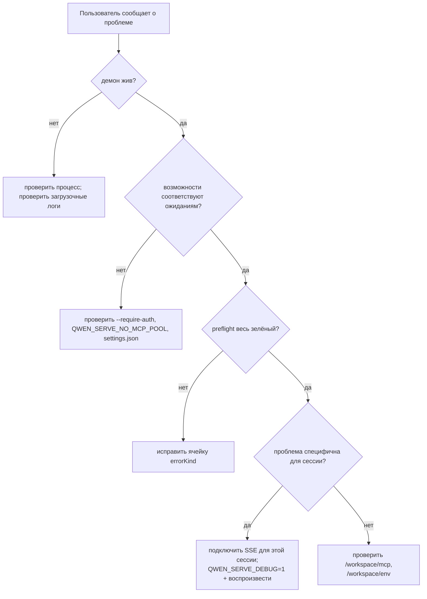

# Наблюдаемость и отладка

## Обзор

`qwen serve` в настоящее время включает **инструментарий span'ов OpenTelemetry**, **структурированные файловые логи** (`DaemonLogger`), **логи доступа к каждому запросу**, отладочные логи stderr, структурированные preflight-ячейки и кольцевой аудит разрешений в памяти. Это страница — практическое руководство по текущему интерфейсу наблюдаемости и пробелам, которые нужно помнить при расследовании.

## Что есть сегодня

| Поверхность                                   | Расположение                                    | Назначение                                                                                                                                                                                                                                                                                  |
| --------------------------------------------- | ----------------------------------------------- | ------------------------------------------------------------------------------------------------------------------------------------------------------------------------------------------------------------------------------------------------------------------------------------------- |
| `QWEN_SERVE_DEBUG` stderr логи                | `bridge.ts` и места вызовов                     | Значения env `1` / `true` / `on` / `yes` (регистронезависимо) выводят строки `qwen serve debug: ...` в stderr.                                                                                                                                                                               |
| Инструментарий span'ов OpenTelemetry          | `server.ts` `daemonTelemetryMiddleware`         | Каждый HTTP-запрос обёрнут в `withDaemonRequestSpan`; атрибуты включают route, sessionId, clientId и код статуса. Маршруты разрешений имеют выделенные spans. Жизненный цикл Prompt отслеживается от начала до конца. Конфигурация находится в `settings.json` `telemetry`.                    |
| `DaemonLogger` структурированные файловые логи | `serve/daemon-logger.ts`                        | Структурированные строки, похожие на JSON, записываются в файл. При запуске выводится `daemon log -> <path>`. Поддерживаются уровни `info` / `warn` / `error` со структурированными полями, такими как `route`, `sessionId`, `clientId`, `childPid` и `channelId`.                           |
| Промежуточное ПО логов доступа к запросам     | `server.ts`, зарегистрировано перед `bearerAuth` | Логирует `method`, `path`, `status`, `durationMs`, `sessionId` и `clientId` после каждого запроса. Пропускает `GET /health` и heartbeat. Для 4xx+ используется `warn`; для успеха — `info`.                                                                                                  |
| `/health`                                     | Маршрут `server.ts`                             | Проверка живучести; `?deep=1` возвращает расширенные данные.                                                                                                                                                                                                                                |
| `/capabilities`                               | Маршрут `server.ts`                             | Предварительное обнаружение возможностей. См. [`11-capabilities-versioning.md`](./11-capabilities-versioning.md).                                                                                                                                                                            |
| `/workspace/preflight`                        | Маршрут -> `DaemonStatusProvider`               | Структурированные ячейки готовности: версия Node, точка входа CLI, ripgrep, git, npm, а также ячейки ACP-уровня, когда дочерний процесс активен.                                                                                                                                            |
| `/workspace/env`                              | Маршрут -> `DaemonStatusProvider`               | Снимок переменных окружения процесса демона. Секретные переменные окружения сообщают только о присутствии; учётные данные прокси удаляются.                                                                                                                                                 |
| `/workspace/mcp`                              | Маршрут -> bridge extMethod                     | Снимок пула, бюджета и отказов.                                                                                                                                                                                                                                                             |
| `/workspace/skills`, `/workspace/providers`   | Маршруты                                        | Привязанные к ACP снимки в реальном времени; возвращают пустые данные в режиме простоя, если нет сессии.                                                                                                                                                                                     |
| SSE для каждой сессии                         | `GET /session/:id/events`                       | Поток событий в реальном времени.                                                                                                                                                                                                                                                           |
| Отладочная консоль `/demo`                    | `GET /demo` (`packages/cli/src/serve/demo.ts`)  | Одностраничная консоль, доступная через браузер: чат, лог событий, инспектор рабочего пространства и UX разрешений. На loopback `http://127.0.0.1:4170/demo` — самый быстрый путь сквозной валидации без написания SDK-кода. Правила регистрации описаны в [`02-serve-runtime.md`](./02-serve-runtime.md). |
| `PermissionAuditRing`                         | `permission-audit.ts`                           | FIFO-кольцо в памяти на 512 решений о разрешениях.                                                                                                                                                                                                                                          |
| Аудит `decisionReason` медиатора              | `permissionMediator.ts`                         | Внутренняя структурированная запись, объясняющая, почему запрос разрешения был разрешён именно так.                                                                                                                                                                                         |

## Чего нет на сегодняшний день

- **Нет Prometheus / метрического эндпоинта.** Нет `process_cpu_seconds_total`, `http_requests_total` или `event_bus_queue_depth`.
- **Нет внешнего стока аудита для `PermissionAuditRing`.** Кольцо существует, но механизмы рассылки в SIEM или внешнее хранилище не подключены.

## Рецепты отладки

### 1. Жив ли демон?

```bash
curl -s http://127.0.0.1:4170/health
# {"status":"ok"}

curl -s 'http://127.0.0.1:4170/health?deep=1' | jq
# {"status":"ok","workspaceCwd":"/path","sessions":N,...}
```

401 на loopback означает, что скорее всего включён `--require-auth`. Используйте `QWEN_SERVE_DEBUG=1` при запуске, чтобы увидеть загрузочные логи.

### 2. Какие возможности рекламируются?

```bash
curl -s http://127.0.0.1:4170/capabilities | jq
```

Проверьте `mcp_workspace_pool` (включён ли пул F2?), `require_auth` (усилен ли?), `permission_mediation.modes` (поддерживаемые политики) и `policy.permission` (активная политика).

### 3. Здорова ли готовность на стороне демона?

```bash
curl -s http://127.0.0.1:4170/workspace/preflight | jq
```

Ячейки со `status: 'not_started'` относятся к ACP-уровню и заполняются только после подключения первой сессии. Ячейки со `status: 'fail'` содержат закрытый `errorKind`; предоставляют структурированное устранение из [`18-error-taxonomy.md`](./18-error-taxonomy.md).

### 4. Подключите SSE-поток сессии

```bash
curl -N -H 'Accept: text/event-stream' \
     -H 'Authorization: Bearer XYZ' \
     -H 'X-Qwen-Client-Id: debug-tail' \
     -H 'Last-Event-ID: 0' \
     'http://127.0.0.1:4170/session/<sid>/events'
```

`-N` отключает буферизацию вывода curl. `Last-Event-ID: 0` запрашивает воспроизведение для событий кольца с `id > 0`.

### 5. Почему запрос разрешения был разрешён именно так?

`PermissionAuditRing` находится в памяти и на данный момент не имеет HTTP-поверхности. Включите `QWEN_SERVE_DEBUG=1` и воспроизведите; медиатор выводит структурированные строки для каждого голоса и решения, включая `decisionReason.type`. В будущем PR можно будет предоставить доступ к кольцу через HTTP.

### 6. Какой потребитель медленный?

`slow_client_warning` срабатывает один раз за эпизод переполнения, когда очередь достигает 75%. Подпишитесь на SSE-поток сессии и ищите синтетический фрейм; нагрузка включает `queueSize`, `maxQueued` и `lastEventId`. Повторяющиеся предупреждения указывают на зависший потребитель, обычно заблокированный цикл SDK `for await`.

### 7. Почему был отклонён MCP-сервер?

Объедините `/workspace/mcp` поячеечное `disabledReason: 'budget'`, список `refusedServerNames` и SSE-события `mcp_child_refused_batch`. Сравните их с `/capabilities` `mcp_guardrails.modes` (активно ли `enforce`?) и текущим состоянием `--mcp-client-budget`, видимым через `getReservedSlots()`.

### 8. Демон не завершает работу

Первый сигнал запускает корректное завершение (см. [`02-serve-runtime.md`](./02-serve-runtime.md)). Если он зависает более чем на 10 с, проверьте:

- Дочерний процесс ACP не ответил на корректное закрытие.
- Длинные SSE-соединения удерживают `server.close()` HTTP открытым дольше `SHUTDOWN_FORCE_CLOSE_MS` (5 с).

**Второй** SIGTERM/SIGINT намеренно запускает `bridge.killAllSync()` + `process.exit(1)`.

## Поток

### Типичный поток расследования



## Состояние и жизненный цикл

- `QWEN_SERVE_DEBUG` считывается при каждой проверке через `isServeDebugMode()` из `debug-mode.ts`; его переключение не требует перезапуска. Загрузочные логи недоступны, если env не был установлен при запуске.
- `PermissionAuditRing` ограничен 512 FIFO-записями; старые записи бесшумно отбрасываются.
- `DaemonStatusProvider` перестраивает ячейки при каждом запросе и не кеширует; избегайте ненужного высокочастотного опроса.

## Зависимости

- `process.stderr.write` для отладочного stderr.
- `DaemonLogger` для структурированных файловых логов.
- OpenTelemetry SDK через `initializeTelemetry` и `createDaemonBridgeTelemetry`.
- `node:process` для проверки окружения и сигналов.

## Конфигурация

| Параметр                        | Эффект                                                                                                    |
| ------------------------------- | --------------------------------------------------------------------------------------------------------- |
| `QWEN_SERVE_DEBUG`              | Включает подробные stderr-логи. См. [`17-configuration.md`](./17-configuration.md).                        |
| `settings.json` `telemetry`     | Управляет поведением OTel: `enabled`, `otlpEndpoint`, `otlpProtocol` и эндпоинты для каждого сигнала.      |
| Путь лога `DaemonLogger`        | Генерируется при запуске и выводится в stderr как `daemon log -> <path>`.                                  |
| Размер `PermissionAuditRing`    | Жёстко задан 512 на данный момент.                                                                         |
| Порог `slow_client_warning`     | `0.75` / `0.375`, жёстко задан в `eventBus.ts`.                                                            |

## Предостережения и известные ограничения

- **Логи `DaemonLogger` структурированы** и могут быть отфильтрованы по `route`, `sessionId` и `clientId`. `QWEN_SERVE_DEBUG` stderr-логи остаются неструктурированным текстом.
- **Spans OpenTelemetry включают корреляцию каждого запроса.** Каждый span HTTP-запроса содержит атрибуты route, sessionId и clientId, которые можно объединять в бэкенде трассировки.
- **Ячейки `/workspace/preflight` ACP-уровня требуют активной сессии.** В простое демона auth / MCP / skills / providers могут показывать `status: 'not_started'`; это нормально.
- **`/workspace/env` сообщает только о присутствии секретов, а не их значениях.** Не раскрывайте ответ, где сам факт наличия секрета является чувствительным.
- **Кольцо аудита привязано к процессу** и теряется при перезапуске демона.
- **Рецепт нагрузочного тестирования здесь не описан.** Производительность описана в ветке `test/perf-daemon-baseline`.

## Ссылки

- `packages/cli/src/serve/daemon-status-provider.ts`
- `packages/cli/src/serve/daemon-logger.ts` (`DaemonLogger`, `buildDaemonLogLine`)
- `packages/cli/src/serve/debug-mode.ts` (`isServeDebugMode`)
- `packages/acp-bridge/src/permissionMediator.ts` (`PermissionDecisionReason`)
- `packages/cli/src/serve/server.ts` (`daemonTelemetryMiddleware`, промежуточное ПО логов доступа)
- Конфигурация: [`17-configuration.md`](./17-configuration.md)
- Таксономия ошибок: [`18-error-taxonomy.md`](./18-error-taxonomy.md)
- Руководство пользователя: [`../../users/qwen-serve.md`](../../users/qwen-serve.md)