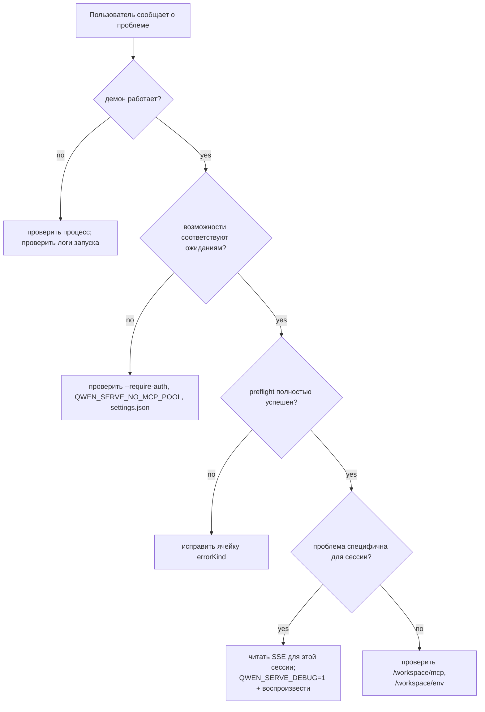

# Наблюдаемость и отладка

## Обзор

`qwen serve` в настоящее время поставляется с **инструментацией спанов OpenTelemetry**, **структурированными файловыми логами** (`DaemonLogger`), **access-логами для каждого запроса**, отладочными логами в stderr, структурированными ячейками preflight и кольцом аудита разрешений в памяти. Эта страница представляет собой практическое руководство по текущим возможностям наблюдаемости и пробелам, которые следует учитывать при диагностике.

## Что доступно сейчас

| Компонент                                   | Расположение                                   | Назначение                                                                                                                                                                                                                                                                                   |
| ------------------------------------------- | ---------------------------------------------- | -------------------------------------------------------------------------------------------------------------------------------------------------------------------------------------------------------------------------------------------------------------------------------------------- |
| stderr-логи `QWEN_SERVE_DEBUG`              | `bridge.ts` и места вызова                     | Значения переменной окружения `1` / `true` / `on` / `yes` (без учета регистра) выводят строки `qwen serve debug: ...` в stderr.                                                                                                                                                                                  |
| Инструментация спанов OpenTelemetry         | `server.ts` `daemonTelemetryMiddleware`        | Классифицированные запросы API демона, достигающие middleware телеметрии, оборачиваются в `withDaemonRequestSpan`; атрибуты включают канонический маршрут, хэш рабочего пространства (когда определён), sessionId, clientId и код статуса. Для маршрутов разрешений выделены отдельные спаны. Жизненный цикл промпта трассируется от начала до конца. Конфигурация находится в `telemetry` файла `settings.json`.                               |
| Метрики производительности демона OpenTelemetry | `telemetry/*event-loop-lag*`, `daemon-metrics` | Гейджи задержки event loop для демона и дочерних процессов ACP, а также гистограммы байтов сообщений в пайпе между демоном и дочерними процессами.                                                                                                                                                                                 |
| Структурированные файловые логи `DaemonLogger` | `serve/daemon-logger.ts`                       | Добавляет записи в стабильный, ротируемый по размеру `daemon.log`. Файловые записи включают `runId` и PID. При запуске выводится выбранный стабильный/фолбэк путь; полный статус показывает здоровье, проблемы и счётчики потерь файловых копий.                                                                                              |
| Промежуточный слой (middleware) access-логов для каждого запроса | `server/access-log.ts`                         | Логирует method/path, status, duration, session и первый сырой client ID после каждого запроса. Бакет burst 60 токенов / 2 в секунду агрегирует избыточный трафик в пять фиксированных счётчиков статуса. Исключения для health, heartbeat и успешных SSE сохраняются.                      |
| `/health`                                   | маршрут `server.ts`                            | Проба живости (liveness probe); `?deep=1` возвращает расширенную информацию.                                                                                                                                                                                                                                       |
| `/capabilities`                             | маршрут `server.ts`                            | Обнаружение возможностей на этапе preflight. См. [`11-capabilities-versioning.md`](./11-capabilities-versioning.md).                                                                                                                                                                                      |
| `/workspace/preflight`                      | Маршрут -> `DaemonStatusProvider`              | Структурированные ячейки готовности: версия Node, CLI entry, ripgrep, git, npm, а также ячейки уровня ACP после того, как дочерний процесс запущен.                                                                                                                                                                       |
| `/workspace/env`                            | Маршрут -> `DaemonStatusProvider`              | Снимок переменных окружения процесса демона. Для секретных переменных окружения сообщается только их наличие; учетные данные URL прокси удаляются.                                                                                                                                                                                    |
| `/workspace/mcp`                            | Маршрут -> bridge extMethod                    | Снимок пула, бюджета и отказов.                                                                                                                                                                                                                                                       |
| `/workspace/skills`, `/workspace/providers` | Маршруты                                       | Актуальные снимки на стороне ACP; возвращают пустые данные в режиме ожидания, если сессия не существует.                                                                                                                                                                                                                   |
| SSE для каждой сессии                       | `GET /session/:id/events`                      | Поток событий в реальном времени.                                                                                                                                                                                                                                                                   |
| Отладочная консоль `/demo`                  | `GET /demo` (`packages/cli/src/serve/demo.ts`) | Доступная из браузера одностраничная консоль: чат, лог событий, инспектор рабочего пространства и UX разрешений. На loopback-интерфейсе `http://127.0.0.1:4170/demo` — это самый быстрый способ сквозной проверки без написания кода SDK. Правила регистрации описаны в [`02-serve-runtime.md`](./02-serve-runtime.md). |
| `PermissionAuditRing`                       | `permission-audit.ts`                          | Кольцо в памяти (FIFO) на 512 решений о разрешениях.                                                                                                                                                                                                                                               |
| Аудит `decisionReason` медиатора            | `permissionMediator.ts`                        | Внутренняя структурированная запись, объясняющая, почему запрос на разрешение был обработан именно так.                                                                                                                                                                                                   |

## Что пока не реализовано

- **Нет эндпоинта Prometheus / метрик.** Метрики OTel можно экспортировать, но демон не предоставляет эндпоинт для сбора данных Prometheus.
- **Нет внешнего приемника аудита для `PermissionAuditRing`.** Кольцо существует, но хуки для распределения данных в SIEM или внешнее хранилище не подключены.

## Рецепты отладки

### 1. Работает ли демон?

```bash
curl -s http://127.0.0.1:4170/health
# {"status":"ok"}

curl -s 'http://127.0.0.1:4170/health?deep=1' | jq
# {"status":"ok","workspaceCount":N,"sessions":N,...}
```

Deep health суммирует все управляемые runtime рабочих пространств, включая runtime в процессе дренирования. Это информационный снимок счётчиков, а не показатель готовности каждого рабочего пространства; используйте `/daemon/status`, когда важна диагностика отдельных рабочих пространств или транспортов.

Ошибка 401 на loopback означает, что, скорее всего, включен `--require-auth`. Используйте `QWEN_SERVE_DEBUG=1` при запуске, чтобы увидеть логи инициализации.

### 2. Какие возможности анонсируются?

```bash
curl -s http://127.0.0.1:4170/capabilities | jq
```

Проверьте `mcp_workspace_pool` (включен ли пул F2?), `require_auth` (усилен ли?), `permission_mediation.modes` (поддерживаемые политики) и `policy.permission` (активная политика).

### 3. В порядке ли готовность хоста демона?

```bash
curl -s http://127.0.0.1:4170/workspace/preflight | jq
```

Ячейки со `status: 'not_started'` относятся к уровню ACP и заполняются только после подключения первой сессии. Ячейки со `status: 'fail'` включают закрытый `errorKind`; для структурированного исправления обратитесь к [`18-error-taxonomy.md`](./18-error-taxonomy.md).

### 4. Отслеживание потока SSE сессии

```bash
curl -N -H 'Accept: text/event-stream' \
     -H 'Authorization: Bearer XYZ' \
     -H 'X-Qwen-Client-Id: debug-tail' \
     -H 'Last-Event-ID: 0' \
     'http://127.0.0.1:4170/session/<sid>/events'
```

`-N` отключает буферизацию вывода curl. `Last-Event-ID: 0` запрашивает повторную отправку событий кольца с `id > 0`.

### 5. Почему запрос на разрешение был обработан именно так?

`PermissionAuditRing` находится в памяти и сегодня не имеет HTTP-интерфейса. Включите `QWEN_SERVE_DEBUG=1` и воспроизведите ситуацию; медиатор выводит структурированные строки для каждого голоса и решения, включая `decisionReason.type`. В будущем PR можно предоставить доступ к кольцу через HTTP.

### 6. Какой потребитель работает медленно?

`slow_client_warning` срабатывает один раз за эпизод переполнения, когда очередь достигает 75%. Подпишитесь на поток SSE сессии и найдите синтетический фрейм; полезные данные включают `queueSize`, `maxQueued` и `lastEventId`. Повторяющиеся предупреждения указывают на зависшего потребителя, обычно это заблокированный цикл SDK `for await`.

### 7. Почему MCP-серверу было отказано?

Объедините по-ячеечный `disabledReason: 'budget'` из `/workspace/mcp`, список `refusedServerNames` и SSE-события `mcp_child_refused_batch`. Сравните их с `mcp_guardrails.modes` из `/capabilities` (активен ли `enforce`?) и актуальным состоянием `--mcp-client-budget`, доступным через `getReservedSlots()`.

### 8. Демон не завершает работу

Первый сигнал запускает корректное завершение работы (см. [`02-serve-runtime.md`](./02-serve-runtime.md)). Если процесс зависает более чем на 10 секунд, проверьте:

- Дочерний процесс ACP не ответил на корректное закрытие.
- Долгие SSE-соединения удерживали HTTP `server.close()` открытым дольше `SHUTDOWN_FORCE_CLOSE_MS` (5 с).

**Второй** SIGTERM/SIGINT намеренно вызывает `bridge.killAllSync()` + `process.exit(1)`.

### 9. Перегружен ли event loop демона, очередь промптов или ACP-пайп?

`GET /daemon/status` может включать `runtime.perf`, когда runtime рабочего демона внедряет провайдер снимков производительности:

```json
{
  "runtime": {
    "perf": {
      "eventLoop": { "meanMs": 1.2, "p50Ms": 1.0, "p99Ms": 9.5, "maxMs": 25 },
      "promptQueueWait": {
        "count": 3,
        "meanMs": 12.5,
        "maxMs": 35,
        "lastMs": 4
      },
      "pipe": {
        "inbound": { "count": 42, "totalBytes": 100000, "maxBytes": 12000 },
        "outbound": { "count": 41, "totalBytes": 90000, "maxBytes": 11000 }
      }
    }
  }
}
```

Полезная нагрузка статуса предназначена только для демона. `promptQueueWait` суммирует выборки времени ожидания в FIFO-очереди промптов, наблюдаемые в процессе демона. Задержка event loop дочернего процесса ACP намеренно не агрегируется в `/daemon/status`; она видна через OTel-гейдж `qwen-code.acp.event_loop.lag` и через строки зависаний в stderr, перенаправляемые в логи демона.

Новые имена метрик OTel:

- `qwen-code.daemon.event_loop.lag`, гейдж в миллисекундах с `stat=mean|p50|p99|max`.
- `qwen-code.acp.event_loop.lag`, гейдж в миллисекундах с `stat=mean|p50|p99|max`.
- `qwen-code.daemon.prompt.queue_wait`, гистограмма в миллисекундах.
- `qwen-code.daemon.pipe.message_bytes`, гистограмма в байтах с `direction=inbound|outbound`.

### 10. Деградировала ли файловая запись логов или были потеряны записи?

Используйте полный статус демона:

```bash
curl -s 'http://127.0.0.1:4170/daemon/status?detail=full' | \
  jq '{status, issues, daemon: {runId: .daemon.runId, logMode: .daemon.logMode, logHealth: .daemon.logHealth, logPath: .daemon.logPath, logIssues: .daemon.logIssues, droppedRecords: .daemon.logDroppedRecords, droppedBytes: .daemon.logDroppedBytes}}'
```

`stable` — нормальный владелец, `fallback` означает, что другой демон владеет стабильным семейством, а `stderr-only` означает, что файловая запись логов отключена или недоступна. `fallback/ok` ожидается при намеренной параллельной работе. Предупреждение `daemon_log_degraded` не содержит пути; запросите полные детали для получения фактического пути и кодов проблем логгера. Используйте `runId` для разделения перезапусков внутри стабильного файла.

### 11. Демон испытывает давление памяти?

```bash
curl -s 'http://127.0.0.1:4170/daemon/status' | \
  jq '.runtime.memory.pressure'
```

`level` принимает значения `normal` / `soft` / `hard` / `critical`, классифицируется по `ratio` — худшему из `rssRatio` (RSS относительно обнаруженной памяти cgroup/хоста, за чем следит OOM killer) и `heapRatio` (используемая куча V8 относительно `heap_size_limit` этого процесса — всей кучи, а не только старого пространства, которое называет `--max-old-space-size`). `source` указывает, какой из них произвёл значение. Проверяйте `source` перед действием: `unknown` означает, что демон не смог измерить ни одну из сторон, поэтому `normal` здесь — это отсутствие показания, а не свидетельство здоровья. Сторона сообщается только когда и её числитель, и знаменатель были пригодны, поэтому `source` также отличает нулевой `rssBytes` / `heapUsedBytes` от реального.

**`rssRatio` настолько хорош, насколько хорош его знаменатель, а `limits.memory.availableMemorySource` — это то, что его оценивает.** Под cgroup (`constrained`) это точно тот лимит, который применяет OOM killer, поэтому соотношение означает то, что говорит. На bare metal (`host`) это размер всей машины, тогда как демон фактически погибает, когда _машина_ исчерпывает ресурсы — что зависит от каждого другого процесса на машине. Демон, занимающий 20% из 64 ГБ хоста рядом с соседом в 55 ГБ, сообщает `level: normal, source: rss` вплоть до момента уничтожения. При `source: 'host'` читайте `rssRatio` как **нижнюю границу** реального давления. Это отдельно от того, что пороги не откалиброваны: никакой выбор порогов не исправляет знаменатель, который измеряет не то.

Две дополнительные вещи, которые это **не** покрывает. Это только **корневой** процесс демона, поэтому демон, у которого растут дочерние процессы `qwen --acp`, может сообщать `normal` на всём протяжении — читайте `runtime.memory.children` рядом, который суммирует собственный RSS живых дочерних процессов (и сообщает через `sampled`, сколько реально ответило). И ничего не remediate: выход за `normal` вызывает предупреждение `daemon_memory_pressure` и не изменяет поведение.

При `--memory-pressure-mode off` все приведённые выше значения по-прежнему сообщаются, и проблема не поднимается, поэтому верхнеуровневый `status` остаётся тем, каким бы он был. Используйте `off` при калибровке порогов на реальной нагрузке, или если вы оповещаете по `status` и не хотите, чтобы неоткалиброванный сигнал его перемещал.

## Процесс

### Типичный процесс диагностики


```mermaid
flowchart TD
    A[Пользователь сообщает о проблеме] --> B{демон работает?}
    B -->|no| BD[проверить процесс; проверить логи запуска]
    B -->|yes| C{возможности соответствуют ожиданиям?}
    C -->|no| CD["проверить --require-auth, QWEN_SERVE_NO_MCP_POOL, settings.json"]
    C -->|yes| D{preflight полностью успешен?}
    D -->|no| DD["исправить ячейку errorKind"]
    D -->|yes| E{проблема специфична для сессии?}
    E -->|yes| ES["читать SSE для этой сессии;<br/>QWEN_SERVE_DEBUG=1 + воспроизвести"]
    E -->|no| EW["проверить /workspace/mcp,<br/>/workspace/env"]
```

## Состояние и жизненный цикл

- `QWEN_SERVE_DEBUG` считывается при каждой проверке через `isServeDebugMode()` из `debug-mode.ts`; его переключение не требует перезапуска. Логи запуска недоступны, если переменная окружения не была установлена при старте.
- `PermissionAuditRing` ограничен 512 записями FIFO; более старые записи тихо отбрасываются.
- `DaemonStatusProvider` перестраивает ячейки для каждого запроса и не использует кэширование; избегайте ненужного высокочастотного опроса.
## Зависимости

- `process.stderr.write` для отладочного вывода в stderr.
- `DaemonLogger` для структурированных файловых логов.
- OpenTelemetry SDK через `initializeTelemetry` и `createDaemonBridgeTelemetry`.
- `node:perf_hooks.monitorEventLoopDelay` для индикаторов задержки цикла событий демона и ACP.
- `node:process` для проверки переменных окружения и сигналов.

## Конфигурация

| Параметр                          | Эффект                                                                                                  |
| --------------------------------- | ------------------------------------------------------------------------------------------------------- |
| `QWEN_SERVE_DEBUG`                | Включает подробные логи в stderr. См. [`17-configuration.md`](./17-configuration.md).                   |
| `settings.json` `telemetry`       | Управляет поведением OTel: `enabled`, `otlpEndpoint`, `otlpProtocol` и эндпоинты для каждого сигнала.   |
| Путь к логам `DaemonLogger`       | Стабильный `debug/daemon/daemon.log` или фолбэк для конкретного запуска, выбранный при старте.          |
| Размер `PermissionAuditRing`      | На данный момент жестко задан как 512.                                                                  |
| Порог `slow_client_warning`       | `0.75` / `0.375`, жестко задан в `eventBus.ts`.                                                         |

## Ограничения и известные особенности

- **Файловые логи DaemonLogger структурированы** и могут быть отфильтрованы по `route`, `sessionId` и `clientId`. Логи `QWEN_SERVE_DEBUG` в stderr остаются неструктурированным текстом.
- **Ретенция DaemonLogger основана на размере, а не на возрасте.** Активный файл и четыре архива ограничены в рамках каждого семейства; живые фолбэк-владельцы никогда не удаляются.
- **Сводки доступа — это учёт намеренных потерь.** WARN `access logs suppressed` представляет отдельные записи доступа, пропущенные как в stderr, так и в файле; это не указывает на отброшенные HTTP-запросы.
- **Внешний logrotate не должен изменять активное семейство.** Используйте shipper, который читает/копирует и переоткрывает стабильное имя пути после замены.
- **Спаны OpenTelemetry включают корреляцию по запросам.** Классифицированные HTTP-запросы демона, прошедшие bearer-аутентификацию, rate limiting и разбор тела, несут атрибуты канонического маршрута, sessionId, clientId и (при однозначном определении) `qwen-code.workspace.hash`. Запросы, отклонённые более ранним гейтом middleware, не имеют этих спанов запроса.
- **HTTP-метрики являются глобальными для демона.** HTTP-метрики OpenTelemetry и кольцо статусов Web Shell не включают измерение рабочего пространства. Успешное SSE-соединение сессии имеет спан запроса, но исключено из обычных метрик количества/длительности запросов, потому что его время жизни не является задержкой запроса; неудачные рукопожатия SSE учитываются нормально.
- **`runtime.perf` работает только для демона.** Задержка цикла событий дочерних процессов в нем не регистрируется по задумке; для отслеживания зависаний дочерних процессов ACP используйте OTel или перенаправленные предупреждения о зависаниях в stderr.
- **Ячейки `/workspace/preflight` на уровне ACP требуют активной сессии.** В неактивном демоне auth / MCP / skills / providers могут показывать `status: 'not_started'`; это ожидаемое поведение.
- **`/workspace/env` сообщает только о наличии секретов, но не их значения.** Не передавайте ответ в места, где сам факт наличия секрета является конфиденциальной информацией.
- **Кольцо аудита локально для процесса**, и история теряется при перезапуске демона.
- **Сценарий нагрузочного тестирования здесь не описан.** Базовые показатели производительности находятся в ветке `test/perf-daemon-baseline`.

## Ссылки

- `packages/cli/src/serve/daemon-status-provider.ts`
- `packages/cli/src/serve/daemon-logger.ts` (`DaemonLogger`, `buildDaemonLogLine`)
- `packages/cli/src/serve/debug-mode.ts` (`isServeDebugMode`)
- `packages/acp-bridge/src/permissionMediator.ts` (`PermissionDecisionReason`)
- `packages/cli/src/serve/server.ts` (`daemonTelemetryMiddleware`, access-log middleware)
- Конфигурация: [`17-configuration.md`](./17-configuration.md)
- Таксономия ошибок: [`18-error-taxonomy.md`](./18-error-taxonomy.md)
- Руководство по операциям для пользователей: [`../../users/qwen-serve.md`](../../users/qwen-serve.md)