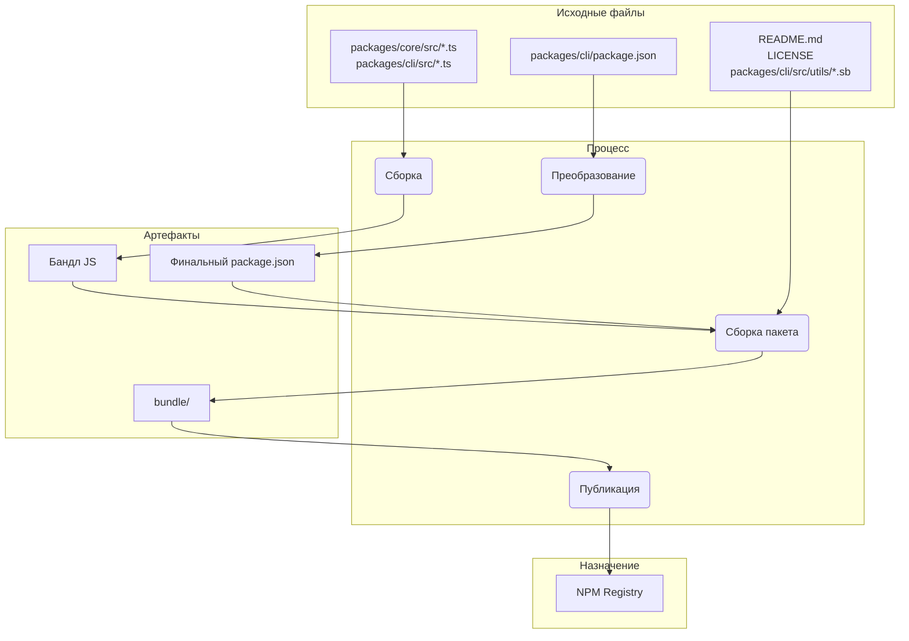

# Обзор пакета

Этот монорепозиторий содержит два основных пакета: `@qwen-code/qwen-code` и `@qwen-code/qwen-code-core`.

## `@qwen-code/qwen-code`

Это основной пакет для Qwen Code. Он отвечает за пользовательский интерфейс, парсинг команд и весь другой функционал, с которым взаимодействует пользователь.

При публикации этот пакет собирается в один исполняемый файл. В этот бандл включены все зависимости пакета, включая `@qwen-code/qwen-code-core`. Это означает, что независимо от того, устанавливает ли пользователь пакет через `npm install -g @qwen-code/qwen-code` или запускает его напрямую через `npx @qwen-code/qwen-code`, он использует этот единственный, самодостаточный исполняемый файл.

## `@qwen-code/qwen-code-core`

Этот пакет содержит основную логику для CLI. Он отвечает за выполнение API-запросов к настроенным провайдерам, обработку аутентификации и управление локальным кэшем.

Этот пакет не является bundled. При публикации он выпускается как стандартный Node.js пакет со своими собственными зависимостями. Это позволяет использовать его как отдельный пакет в других проектах, если это необходимо. Весь транспилированный js-код в папке `dist` включается в пакет.

# Процесс релиза

Этот проект следует структурированному процессу релиза, чтобы гарантировать правильную версионность и публикацию всех пакетов. Процесс максимально автоматизирован.

## Как выполнить релиз

Релизы управляются через GitHub Actions workflow [release.yml](https://github.com/QwenLM/qwen-code/actions/workflows/release.yml). Чтобы выполнить ручной релиз патча или хотфикса:

1. Перейдите на вкладку **Actions** репозитория.
2. Выберите workflow **Release** из списка.
3. Нажмите кнопку выпадающего списка **Run workflow**.
4. Заполните необходимые поля:
   - **Version**: точная версия для релиза (например, `v0.2.1`).
   - **Ref**: ветка или SHA коммита, из которого будет выполнен релиз (по умолчанию — `main`).
   - **Dry Run**: оставьте значение `true`, чтобы протестировать workflow без публикации, или установите `false`, чтобы выполнить настоящий релиз.
5. Нажмите **Run workflow**.

## Ночные релизы

В дополнение к ручным релизам, в проекте реализован автоматический процесс ночных релизов, предоставляющий последнюю " bleeding edge" версию для тестирования и разработки.

### Процесс

Каждую ночь в полночь по UTC автоматически запускается [Release workflow](https://github.com/QwenLM/qwen-code/actions/workflows/release.yml) по расписанию. Он выполняет следующие шаги:

1. Выполняет checkout последнего кода из ветки `main`.
2. Устанавливает все зависимости.
3. Запускает полный набор проверок `preflight` и интеграционных тестов.
4. Если все тесты прошли успешно, вычисляет номер следующей nightly-версии (например, `v0.2.1-nightly.20230101`).
5. Затем собирает и публикует пакеты в npm с dist-tag `nightly`.
6. Наконец, создает GitHub Release для nightly-версии.

### Обработка ошибок

Если какой-либо шаг в nightly workflow завершится с ошибкой, автоматически будет создан новый issue в репозитории с метками `bug` и `nightly-failure`. В issue будет содержаться ссылка на неудавшийся запуск workflow для удобства отладки.

### Как использовать Nightly Build

Чтобы установить последнюю ночную сборку, используйте тег `@nightly`:

```bash
npm install -g @qwen-code/qwen-code@nightly
```

Мы также запускаем Google Cloud Build под названием [release-docker.yml](../.gcp/release-docker.yml), который публикует sandbox Docker образ в соответствии с вашим релизом. После настройки разрешений для service account этот процесс будет перенесён в GitHub и объединён с основным файлом релиза.

### После релиза

После успешного завершения workflow вы можете отслеживать его выполнение во вкладке [GitHub Actions](https://github.com/QwenLM/qwen-code/actions/workflows/release.yml). После завершения необходимо:

1. Перейти на страницу [pull requests](https://github.com/QwenLM/qwen-code/pulls) репозитория.
2. Создать новый pull request из ветки `release/vX.Y.Z` в ветку `main`.
3. Проверить pull request (он должен содержать только обновления версий в файлах `package.json`) и выполнить слияние (merge). Это позволит поддерживать актуальную версию в ветке `main`.

## Валидация релиза

После пуша нового релиза необходимо провести smoke-тестирование, чтобы убедиться, что пакеты работают корректно. Это можно сделать, установив пакеты локально и запустив набор тестов для проверки их функциональности.

- `npx -y @qwen-code/qwen-code@latest --version` — проверка, что пуш прошёл успешно (если вы не использовали теги rc или dev)  
- `npx -y @qwen-code/qwen-code@<release tag> --version` — проверка, что тег был запушен корректно  
- _Это действие разрушительно для локальной среды_:  
  ```bash
  npm uninstall @qwen-code/qwen-code && npm uninstall -g @qwen-code/qwen-code && npm cache clean --force && npm install @qwen-code/qwen-code@<version>
  ```
- Рекомендуется выполнить базовое smoke-тестирование, включающее несколько команд LLM и инструментов, чтобы убедиться, что пакеты работают как ожидается. В будущем мы формализуем этот процесс.

## Когда сливать изменения версии, а когда нет?

Описанный выше подход к созданию патч-релизов или hotfix-релизов из текущих или старых коммитов оставляет репозиторий в следующем состоянии:

1.  Тег (`vX.Y.Z-patch.1`): Этот тег корректно указывает на оригинальный коммит в ветке main,  
    который содержит стабильный код, предназначенный для релиза. Это важно. Любой, кто сделает  
    checkout этого тега, получит в точности тот код, который был опубликован.
2.  Ветка (`release-vX.Y.Z-patch.1`): Эта ветка содержит один новый коммит поверх  
    коммита, на который указывает тег. Этот новый коммит включает только изменение номера версии в package.json  
    (и других связанных файлах, таких как package-lock.json).

Такое разделение — это хорошо. Оно позволяет сохранить историю основной ветки main «чистой» от изменений версий,  
характерных для конкретных релизов, до тех пор, пока вы явно не решите их слить.

Это ключевое решение, и оно полностью зависит от характера самого релиза.

### Merge Back для стабильных патчей и хотфиксов

Почти всегда необходимо мержить ветку `release-<tag>` обратно в `main` для любого
стабильного патча или релиза с хотфиксом.

- Зачем? Основная причина — обновление версии в package.json ветки main. Если вы делаете релиз,
  например v1.2.1, с более старого коммита, но не мержите изменение версии обратно,
  то package.json в вашей ветке main всё ещё будет содержать "version": "1.2.0". Следующий разработчик,
  который начнёт работу над следующим фичерелизом (например, v1.3.0), будет работать с кодовой базой,
  содержащей некорректную, устаревшую версию. Это вызывает путаницу и требует ручного обновления
  версии позже.
- Процесс: После создания ветки release-v1.2.1 и успешной публикации пакета,
  вы должны открыть pull request для мержа release-v1.2.1 в main. Этот PR
  будет содержать всего один коммит: "chore: bump version to v1.2.1". Это чистая и простая
  интеграция, которая поддерживает вашу ветку main в актуальном состоянии с последней выпущенной версией.

### НЕ выполняйте Merge Back для предварительных релизов (RC, Beta, Dev)

Обычно вы не выполняете слияние веток релизов для предварительных релизов обратно в `main`.

- Почему? Предварительные версии (например, v1.3.0-rc.1, v1.3.0-rc.2) по определению не являются стабильными и временными. Вы не хотите засорять историю своей основной ветки серией изменений номеров версий для кандидатов в релизы. Файл package.json в main должен отражать последнюю стабильную версию релиза, а не RC.
- Процесс: Создается ветка release-v1.3.0-rc.1, происходит публикация через npm publish --tag rc, и затем... ветка выполнила свою задачу. Вы можете просто удалить ее. Код для RC уже находится в main (или в feature-ветке), поэтому функциональный код не теряется. Ветка релиза была лишь временным средством для номера версии.

## Локальное тестирование и валидация: Изменения в процессе упаковки и публикации

Если вам нужно протестировать процесс релиза без фактической публикации в NPM или создания публичного релиза на GitHub, вы можете запустить workflow вручную через GitHub UI.

1. Перейдите на вкладку [Actions](https://github.com/QwenLM/qwen-code/actions/workflows/release.yml) репозитория.
2. Нажмите на выпадающий список "Run workflow".
3. Оставьте опцию `dry_run` включенной (`true`).
4. Нажмите кнопку "Run workflow".

Это запустит весь процесс релиза, но пропустит шаги `npm publish` и `gh release create`. Вы можете изучить логи workflow, чтобы убедиться, что всё работает как ожидается.

Крайне важно тестировать любые изменения в процессе упаковки и публикации локально перед коммитом. Это гарантирует, что пакеты будут опубликованы корректно и будут работать так, как ожидается, при установке пользователем.

Чтобы проверить ваши изменения, можно выполнить пробный запуск процесса публикации. При этом процесс будет симулироваться, но пакеты не будут отправлены в реестр npm.

```bash
npm_package_version=9.9.9 SANDBOX_IMAGE_REGISTRY="registry" SANDBOX_IMAGE_NAME="thename" npm run publish:npm --dry-run
```

Эта команда выполнит следующие действия:

1. Соберёт все пакеты.
2. Запустит все скрипты prepublish.
3. Создаст tar-архивы пакетов, которые должны быть опубликованы в npm.
4. Выведет сводку по пакетам, которые должны быть опубликованы.

После этого вы можете проверить сгенерированные tar-архивы, чтобы убедиться, что они содержат правильные файлы, а `package.json` обновлён корректно. Архивы создаются в корневой директории каждого пакета (например, `packages/cli/qwen-code-0.1.6.tgz`).

Выполнив пробный запуск, вы можете быть уверены, что изменения в процессе упаковки корректны и пакеты будут успешно опубликованы.

## Подробное описание процесса релиза

Основная цель процесса релиза — взять исходный код из директории `packages/`, собрать его и создать чистый, самодостаточный пакет во временной директории `bundle` в корне проекта. Именно содержимое этой директории `bundle` публикуется в NPM.

Вот ключевые этапы:

### Этап 1: Предварительные проверки и версионирование

- **Что происходит**: Перед тем как перемещать какие-либо файлы, процесс убеждается, что проект находится в рабочем состоянии. Это включает запуск тестов, линтинга и проверки типов (`npm run preflight`). Номер версии в корневом `package.json` и в `packages/cli/package.json` обновляется до новой версии релиза.
- **Зачем**: Это гарантирует, что в релиз попадает только качественный и рабочий код. Версионирование — первый шаг к обозначению нового релиза.

### Этап 2: Сборка исходного кода

- **Что происходит**: Исходный код на TypeScript из `packages/core/src` и `packages/cli/src` компилируется в JavaScript.
- **Перемещение файлов**:
  - `packages/core/src/**/*.ts` → компилируется в → `packages/core/dist/`
  - `packages/cli/src/**/*.ts` → компилируется в → `packages/cli/dist/`
- **Зачем**: Код на TypeScript, написанный во время разработки, должен быть преобразован в обычный JavaScript, который может выполнить Node.js. Сначала собирается пакет `core`, потому что `cli` зависит от него.

### Этап 3: Формирование финального пакета для публикации

Это самый критичный этап, на котором файлы перемещаются и преобразуются в финальный вид для публикации. Во временной директории `bundle` в корне проекта формируется содержимое финального пакета.

#### 1. Преобразование `package.json`:

- **Что происходит**: `package.json` из `packages/cli/` считывается, модифицируется и записывается в директорию `bundle/`.
- **Перемещение файла**: `packages/cli/package.json` → (преобразование в памяти) → `bundle/package.json`
- **Зачем**: Финальный `package.json` должен отличаться от того, что используется в разработке. Основные изменения:
  - Удаление `devDependencies`.
  - Удаление зависимостей вида `"@qwen-code/core": "workspace:*"` и включение кода `core` напрямую в финальный JS-файл.
  - Поля `bin`, `main` и `files` должны указывать на правильные пути внутри финальной структуры пакета.

#### 2. Создание бандла JavaScript:

- **Что происходит**: Собранный JavaScript из `packages/core/dist` и `packages/cli/dist` объединяется в один исполняемый JS-файл.
- **Перемещение файла**: `packages/cli/dist/index.js` + `packages/core/dist/index.js` → (бандлится через esbuild) → `bundle/gemini.js` (или аналогичное имя).
- **Зачем**: Это создаёт один оптимизированный файл со всем необходимым кодом приложения. Это упрощает пакет, так как код `core` теперь встроен напрямую, и не нужно публиковать его как отдельную зависимость.

#### 3. Копирование статических и вспомогательных файлов:

- **Что происходит**: Необходимые файлы, не являющиеся частью исходного кода, но важные для работы пакета или его описания, копируются в директорию `bundle`.
- **Перемещение файлов**:
  - `README.md` → `bundle/README.md`
  - `LICENSE` → `bundle/LICENSE`
  - `packages/cli/src/utils/*.sb` (профили песочницы) → `bundle/`
- **Зачем**:
  - `README.md` и `LICENSE` — стандартные файлы, которые должны присутствовать в любом NPM-пакете.
  - Профили песочницы (`.sb` файлы) — критически важные рантайм-ресурсы для работы функции sandboxing в CLI. Они должны находиться рядом с финальным исполняемым файлом.

### Этап 4: Публикация в NPM

- **Что происходит**: Команда `npm publish` запускается из директории `bundle`.
- **Зачем**: Запуская `npm publish` из директории `bundle`, мы публикуем только те файлы, которые были тщательно собраны на этапе 3. Это предотвращает случайную публикацию исходного кода, тестов или конфигураций разработки, обеспечивая чистый и минималистичный пакет для пользователей.

### Сводка потока файлов



Этот процесс гарантирует, что финальный опубликованный артефакт — это специально подготовленный, чистый и эффективный пакет, а не прямая копия рабочей среды разработки.

## NPM Workspaces

Этот проект использует [NPM Workspaces](https://docs.npmjs.com/cli/v10/using-npm/workspaces) для управления пакетами в этом монорепозитории. Это упрощает разработку, позволяя нам управлять зависимостями и запускать скрипты во всех пакетах из корня проекта.

### Как это работает

Корневой файл `package.json` определяет рабочие области (workspaces) для этого проекта:

```json
{
  "workspaces": ["packages/*"]
}
```

Это указывает NPM, что каждая папка внутри директории `packages` является отдельным пакетом, который должен управляться как часть workspace.

### Преимущества Workspaces

- **Упрощенное управление зависимостями**: Запуск `npm install` из корня проекта установит все зависимости для всех пакетов в workspace и свяжет их между собой. Это означает, что вам не нужно запускать `npm install` в каждой директории пакета.
- **Автоматическая линковка**: Пакеты внутри workspace могут зависеть друг от друга. При запуске `npm install` NPM автоматически создаст symlinks между пакетами. Это значит, что при внесении изменений в один пакет, они сразу становятся доступны другим пакетам, которые от него зависят.
- **Упрощенный запуск скриптов**: Вы можете запускать скрипты из любого пакета, находясь в корне проекта, используя флаг `--workspace`. Например, чтобы выполнить скрипт `build` из пакета `cli`, можно использовать команду `npm run build --workspace @qwen-code/qwen-code`.