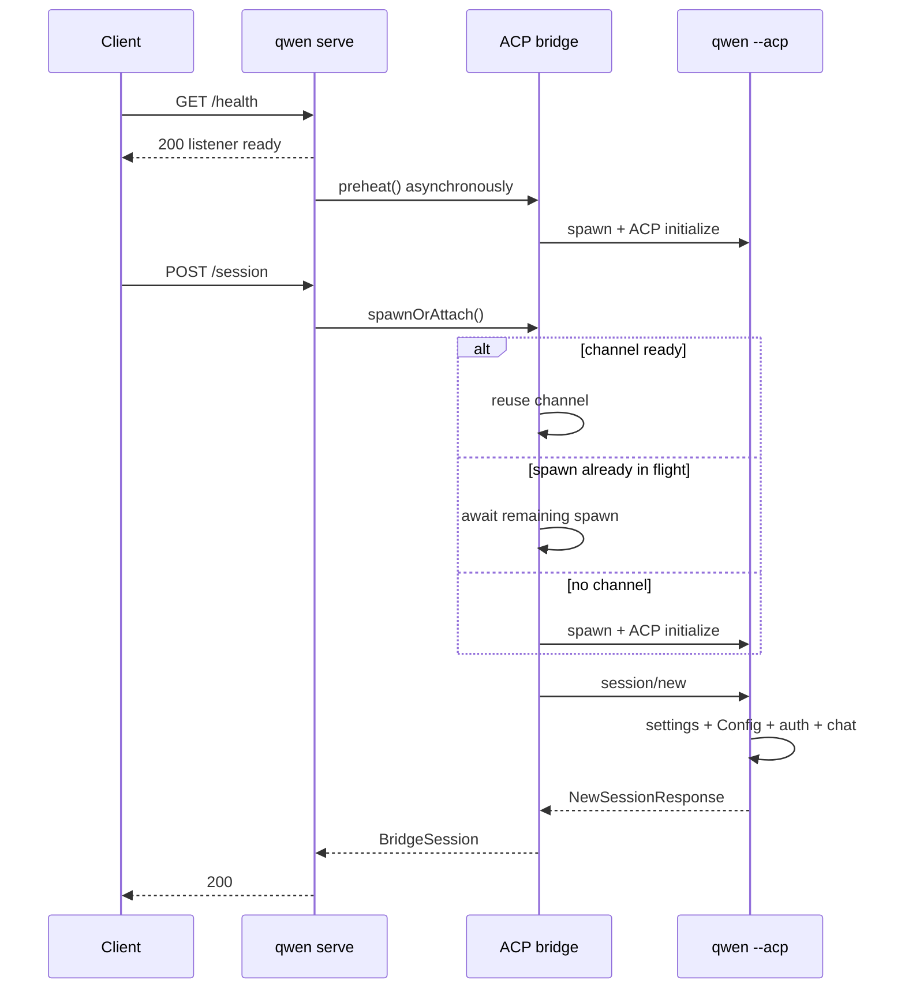

# 冷启动首个会话的剖析设计

## 决策

#4748 的下一个实现切片是可观测性，而不是又一个启动缓存或新的会话协议。它必须能够在跨越 daemon、共享 ACP channel 和 ACP 子进程的情况下解释一次冷请求，同时保持当前的快速 `/health` 行为。

该实现复用现有的 daemon OpenTelemetry 请求/bridge span 以及 ACP `_meta` 扩展点。它添加了：

- bootstrap 请求计时，使延迟运行时的等待计入之后的 HTTP span，而不是被误认为是代理/网络耗时；
- 每请求的 channel 等待 span，说明 Session 是复用了就绪的 channel、加入了一个正在进行的 spawn，还是按需 spawn；
- 每个 ACP channel 上的一个不透明 ID，使自动预热 trace 能够与之后的 Session trace 关联，而无需伪造父子关系；
- 在 ACP `session/new` 上进行 trace 上下文注入；
- 一个 ACP 子进程的 `session/new` span，其中包含 settings、Config 初始化、认证、文件系统准备、Session 注册和响应构建的有界阶段耗时；
- 在现有 opt-in 的 `QWEN_CODE_PROFILE_SESSION_START` JSONL 记录中加入 ACP Session ID，使其详细的 `startChat` 阶段能够与 trace 关联。

该切片不添加响应头、公共 JSON 字段、能力标志或第二种 profiler 格式。ACP 就绪仍然是一个独立的 P1 客户端/API 变更，在 P0 分解可用之后再进行。

## 证据

下游 `0.19.3-preview.2` 的样本显示，从 health 成功到 Session 成功的 P50 为 2,534ms，`POST /session` 的 P50 为 1,713ms。health 到请求的延迟与 POST 耗时之间的负相关，与首个请求等待自动预热剩余部分的判断一致，但浏览器计时无法分离代理、daemon、channel 和子进程的工作。

使用全局安装的 `qwen 0.19.10` 进行的一次本地 dry-run 确认了同样的形态：

| 场景                                            |                    观察结果 |
| --------------------------------------------------- | -----------------------------: |
| 进程启动 → listener                            |                          203ms |
| Health 之后紧跟冷 `POST /session` | 1,033ms 浏览器 / 962ms daemon |
| 在另一次运行中已预热的 `POST /session` |   222ms 浏览器 / 221ms daemon |

这些是示意性的单次运行，不是验收基准。它们表明当前粗粒度的路由耗时隐藏了大约 700–800ms，可能是 channel 等待、ACP 子进程 bootstrap，或两者兼有。

## 当前架构

现有的可观测性已经提供：

- 在运行时应用接收请求之后，为 `POST /session` 提供的 HTTP 请求 span；
- 为 `channel.spawn`、`channel.initialize` 和 `session.new` 提供的 bridge span；
- 通过预留的 ACP `_meta` 键进行的 W3C trace 上下文注入与提取，目前用于 prompt 分发；
- 用于详细 `GeminiClient.startChat()` 阶段的 opt-in JSONL profiler。

缺失的部分是：该请求 span 之前的任何 bootstrap 层延迟运行时等待、当前请求的 channel 等待、与独立启动的预热 trace 的关联、在 `session/new` 上的传播，以及子进程内 `startChat` 之前的计时。

## 设计

### 父 daemon 与 bridge

当一个非 bootstrap 请求在延迟运行时挂载之前到达时，委托的 bootstrap 应用会记录其墙钟到达时间、剩余的运行时等待，以及该请求是启动了运行时加载，还是加入了 health/fallback 调度已经开始的工作。运行时遥测中间件在挂载之后接收同一个请求对象，并将 HTTP span 回溯到该到达时间。路由耗时指标使用相同的边界。这使得即便在冷的延迟运行时路径上，浏览器耗时减去 daemon 请求耗时也成为有意义的代理/网络残差。

在 `doSpawn()` 等待 `ensureChannel()` 之前，它对同步的 channel 状态进行分类：

- `reused`：一个非垂死的 channel 已经可用；
- `joined`：`inFlightChannelSpawn` 已经存在；
- `spawned_on_request`：既没有存活的 channel，也没有正在进行的 spawn。

然后它将等待包裹在一个 `channel.wait` bridge span 中。生产遥测实现会同步调用其回调，因此分类被读取且 `ensureChannel()` 被调用时不会让出 JavaScript 事件循环。

每个新的 `ChannelInfo` 在调用 `channelFactory()` 之前获得一个随机 UUID。相同的 ID 只附加到以下 span：

- `channel.spawn`；
- `channel.initialize`；
- 一旦 channel 已知后的 `session.new`。

该 ID 是诊断性 trace 数据，不是指标标签或公共标识符。自动预热和首个 Session 可以属于不同的 trace；channel ID 将它们关联起来，而不声称之后的 HTTP 请求导致了更早的工作。

`preheat()` 获得自己的 `channel.preheat` bridge span。加入它的 Session 有一个只测量剩余等待的 `channel.wait` span。在这种情况下 `channel.initialize` 和 `channel.wait` 会重叠，因此不得相加。

在现有的 `session.new` span 内部，bridge 将活跃的 trace 上下文注入 `NewSessionRequest._meta`。现有的注入 helper 在添加 daemon 拥有的值之前已经会剥离客户端提供的预留键。在子进程响应之后，一个 span 事件会记录 ACP Session ID 以便与 JSONL profiler 关联。

### ACP 子进程

`QwenAgent.newSession()` 从请求中提取 daemon 上下文，并在父 bridge `session.new` span 之下启动一个子进程 `qwen-code.daemon.session_start` span。如果上下文缺失或无效，则适用正常的 OTel 根 span 行为。

子进程使用 `performance.now()` 记录固定的、不重叠的耗时：

| 阶段               | 边界                                                                                                                                                                           |
| ------------------- | ---------------------------------------------------------------------------------------------------------------------------------------------------------------------------------- |
| `settings_load`     | `loadSettingsCached(cwd)`                                                                                                                                                          |
| `config_setup`      | `newSessionConfig()`，包括 `loadCliConfig()`、`config.initialize()` 以及正常的首次 `startChat()`                                                                       |
| `auth`              | `ensureAuthenticated()`                                                                                                                                                            |
| `file_system_setup` | `setupFileSystem()`                                                                                                                                                                |
| `session_register`  | `createAndStoreSession()`，通常构建并注册 ACP `Session`；其防御性的 Gemini 初始化只有在 Config 尚未初始化时才会在此计时 |
| `response_build`    | models、modes、config options 以及响应对象的构建                                                                                                                    |

实现 E2E 显示 `config_setup` 约为 200ms，其中约 140ms 由现有的嵌套 `startChat` profiler 记录。这确认了正常的 `startChat()` 发生在 `config.initialize()` 期间，而不是之后的 Session 注册期间。JSONL Session ID 使该嵌套开销可以被关联，而无需猜测文件时间戳。如果代表性的下游 trace 显示剩余未归因的 Config 开销很重要，之后的优化可以把 Config 构建与 `config.initialize()` 拆分；在本切片中这样做需要把一个 profiler 穿进 new/load/resume/transcript 路径共享的方法。

### 属性契约

只发出固定的属性名和有界的值：

- `qwen-code.daemon.channel.path` = `reused | joined | spawned_on_request`；
- `qwen-code.daemon.runtime.path` = `started_on_request | joined`，当请求跨越了延迟运行时门控时；
- `qwen-code.daemon.runtime.wait_ms` = 有限的非负剩余运行时等待；
- HTTP 请求耗时直方图的 `runtime_path` = `started_on_request | joined`（对跨越延迟运行时门控的请求），否则为 `none`；
- `qwen-code.daemon.acp_channel.id` = daemon 生成的 UUID；
- `qwen-code.daemon.session_start.<stage>_ms` = 有限的非负耗时；
- `qwen-code.daemon.session_start.failed_stage` = 一个固定的阶段名；
- `session.id` = ACP 生成的 Session ID。

不添加任何工作空间路径、prompt、settings 值、凭据、模型响应或文件内容。

## 失败、并发与兼容性

- OTel 禁用：现有行为不变；bridge 仍然通过其 no-op 遥测接缝运行，子进程 profiler 除非启用了现有的环境变量标志，否则不进行文件输出。
- 延迟运行时失败：bootstrap 应用仍然返回现有的启动错误；计时元数据是进程本地的，绝不在响应中暴露。
- 无效或缺失的 trace 元数据：子进程创建一个无父 span 或不创建 span，Session 创建继续进行。
- 遥测属性失败：阶段属性尽力记录，不能改变 Session 结果。
- 预热失败：`channel.wait` 反映请求的重试路径；现有的子进程清理和惰性重试语义保持不变。
- 并发的首个 Session：每个请求获得自己的 `channel.wait` 和子进程 Session span，同时都可以引用相同的 channel ID。
- 旧的或非 daemon 的 ACP 客户端：`_meta` 是可选的，因此子进程继续接受普通的 `NewSessionRequest` 消息。
- 现有的 JSONL 消费者：`sessionId` 是增量且可选的；现有字段和文件布局不变。
- Channel 拆除：诊断 UUID 只存在于 `ChannelInfo` 上，随 channel 消失；它不改变复用、空闲超时或 kill 逻辑。

## 本切片拒绝的替代方案

### 自定义 profile ID 和 ACP 响应封装

在 `NewSessionResponse._meta` 中返回第二种计时 schema 会重复 OTel，需要校验/版本化，并造成两个事实来源。W3C 上下文已经携带因果关系，而 channel UUID 处理了那条有意分离的预热 trace。

### `Server-Timing` 和 `X-Qwen-Profile-Id`

这些会有助于仅靠浏览器的诊断，但它们需要本仓库之外的代理头透传和 CORS 暴露决策。daemon 请求 span 和现有路由耗时已经提供了服务端耗时。如果下游 tracing 仍不可用，可以再进行 header 工作。

### 让 `/health` 等待 ACP

这会把延迟移进就绪检查，并有造成 health 探测回归的风险。`/health` 保持 listener/liveness 就绪；ACP 就绪是一个独立的、未来由能力门控的契约。

### 共享 Config 或预创建 Session

两者都会在剖析识别出主导阶段之前改变隔离和生命周期语义。它们被明确排除在范围之外。

## 验证

聚焦的单元测试必须证明：

- `session/new` 接收到 daemon 拥有的 trace 元数据；
- 跨越延迟运行时门控的 Session 请求，其 HTTP span 从 bootstrap 到达时开始，并记录它是启动了还是加入了运行时加载；
- `channel.wait` 报告 spawned、joined 和 reused 路径；
- 一个 channel UUID 关联 spawn、initialize 和 Session span；
- 子进程提取父上下文并记录所有固定阶段；
- 失败的阶段被记录且原始错误被保留；
- session-start JSONL 在提供时包含 Session ID，在缺失时保持向后兼容；
- 遥测禁用或元数据格式错误不会改变 Session 行为。

E2E dry-run 比较两种情况，使用相同的工作空间和认证：

1. health 之后紧跟 `POST /session`；
2. health 之后显式预热，然后 `POST /session`。

两者都验证 Session 成功并检查 trace 树。冷情况必须包含请求的 `channel.wait` 路径和子进程阶段属性；预热情况必须报告 `reused`。性能结论需要在代表性的下游环境中进行至少 30 次串行冷启动，不能从本地单次运行的计时推断。

## 实现边界与评审门控

生产变更限于 `run-qwen-serve` 中的延迟运行时请求交接和遥测中间件、`packages/acp-bridge` 中现有的遥测接缝、ACP `newSession`，以及现有的核心 session-start profiler。没有 Session/config/auth 行为变更。

本设计评审的跨包下游消费者有：

- `run-qwen-serve.ts` 中的 daemon bridge 构建以及测试/嵌入 bridge 遥测实现；
- 延迟运行时路由准入和请求遥测/指标消费者；
- 所有 `AcpSessionBridge.spawnOrAttach()` 调用方，它们接收相同形态的 `BridgeSession`；
- daemon 之外的 ACP 客户端，它们可以省略 `_meta`；
- session-start profiler 测试和 JSONL 读取器，对它们来说 `sessionId` 是可选的。

由于这跨越了 core/bridge/CLI 边界，即使生产逻辑变更有意很小，也需要维护者评审。
