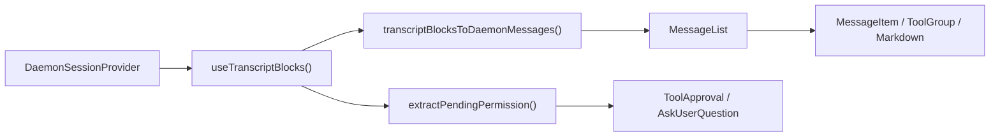
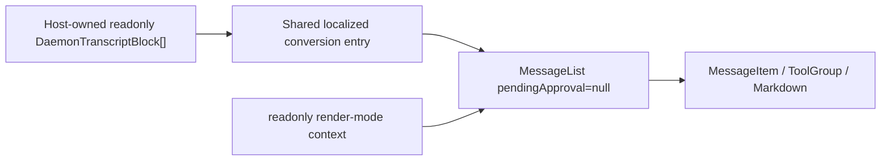

# WebShell 中只读 Daemon Transcript 渲染设计

## 文档状态

- 状态：已实现
- 日期：2026-07-14
- 范围：`packages/web-shell`
- 输入：`readonly DaemonTranscriptBlock[]`
- 输出：继承 WebShell `MessageList` 展示能力的只读 transcript 视图

## 1. 背景

WebShell 已经拥有完整的 daemon transcript 渲染路径，但目前只能通过分屏视图中的 `App` 或 `ChatPane` 间接使用。该组件先从 `DaemonSessionProvider` 读取 transcript 块，把这些块转换为 WebShell 的内部消息，最后传给 `MessageList` 渲染。

新的使用场景已经直接持有一个 `DaemonTranscriptBlock[]`，只需要 WebShell 的消息样式和渲染能力来显示历史内容。它不需要建立 daemon 会话连接，也不得执行会话变更。明确排除在目标之外的交互包括工具审批、`AskUserQuestion`、重试、分支、prompt 提交，以及打开会修改会话状态的面板。

如果宿主直接消费 `transcriptBlocksToDaemonMessages` 的结果并拼装内部组件，就会暴露 WebShell 私有的 `DaemonMessage` 模型、context 和 CSS 约束。当 `MessageList` 增加功能时，它也会与受支持的渲染产生漂移。因此 `@qwen-code/web-shell` 需要提供一个稳定的公共入口。

## 2. 目标

1. 添加一个公共 React 组件，直接接受并渲染 `readonly DaemonTranscriptBlock[]`。
2. 复用现有的 `transcriptBlocksToDaemonMessages()` 和同一个 `MessageList`，使用户、助手、思考、工具、子代理、plan、状态、Markdown、时间线和长会话虚拟滚动能力随 `MessageList` 自动演进。
3. 允许组件在没有 `DaemonWorkspaceProvider`、`DaemonSessionProvider` 或网络连接的情况下独立渲染。
4. 在只读边界内不调用任何 daemon/会话变更，也不为待处理权限或 `AskUserQuestion` 显示响应 UI。
5. 主要添加导出，不改变现有 `WebShell`、`WebShellWithProviders`、`App` 或 `ChatPane` 的运行时路径、默认值或 DOM 行为。
6. 添加完整的组件单元测试，并通过现有的 WebShell 测试套件、build、lint 和 typecheck。

## 3. 非目标

- 添加 transcript 检索、分页、缓存或 SSE 订阅；宿主提供块。
- 在现有 `WebShellProps` 中插入只读模式，或在 `App` 中添加有条件的 `readOnly`/`blocks` 双数据源。
- 导出内部的 `MessageList`、`Message` 或 `DaemonMessage` 类型。
- 显示或处理未解决的工具审批或 `AskUserQuestion`。
- 提供 App 外壳的 composer、排队 prompt、流式状态、侧边栏、分屏视图、对话框、artifact 右栏或类似能力。`MessageList` 内置的会话时间线保留。
- 从块中推断或加载单独的会话 artifact。App 级别的针对文件变更、artifact 和定时任务的轮次输出卡片不在范围内。
- 阻止仅修改本地展示状态的交互，例如复制、折叠/展开工具、展开已完成轮次、表格过滤或时间线导航。

## 4. 术语与只读边界

在本设计中，“只读”意味着**不读取也不修改 daemon/会话运行时状态**。它不意味着对整个 DOM 设置 `pointer-events: none`。

| 类别                     | 行为                                                                 | 是否保留                            |
| ---------------------------- | ------------------------------------------------------------------------ | ----------------------------------- |
| 被动展示         | 文本、Markdown、图像、diff、shell 输出、工具/子代理状态        | 是                                 |
| 本地查看                | 复制、折叠、展开、虚拟滚动、时间线、表格排序/过滤      | 是                                 |
| 宿主自定义展示 | Markdown/代码块渲染器、消息内容渲染器                   | 是；宿主拥有任何副作用 |
| 普通外部链接      | 浏览器安全 URL 转换后的新窗口导航              | 是                                 |
| WebShell 语义导航 | `qwen-session://` 分发全局 `qwen:open-session` 事件        | 否；渲染为非交互文本  |
| 会话变更             | 发送 prompt、取消、重试、分支、回退、切换模型/模式            | 否                                  |
| 权限变更          | 批准/拒绝工具、提交/忽略 `AskUserQuestion`                     | 否                                  |
| 外部数据加载        | 组件发起的会话附加或 transcript/artifact/任务/MCP 获取 | 否                                  |

这个边界保留了 `MessageList` 的阅读体验，同时确保组件本身没有写入 daemon 的能力。

## 5. 现状与调用方映射

| 模块                                                       | 当前职责                                                                       | 与本设计的关系                                         |
| ------------------------------------------------------------ | -------------------------------------------------------------------------------------------- | ------------------------------------------------------------------- |
| `packages/sdk-typescript/src/daemon/ui/types.ts`             | 定义 `DaemonTranscriptBlock` 联合类型                                                    | 新组件的公共输入模型                            |
| `packages/web-shell/client/adapters/transcriptToMessages.ts` | 把块组合为 WebShell `DaemonMessage[]`                                              | 直接复用；不创建新的转换器                       |
| `packages/web-shell/client/hooks/useMessages.ts`             | 从会话 hook 读取块并提供本地化转换选项                   | 提取一个接受外部块的共享纯转换入口 |
| `packages/web-shell/client/components/MessageList.tsx`       | 轮次折叠、工具/子代理分组、时间线、虚拟滚动和逐消息渲染 | 新旧路径共享的唯一列表实现   |
| `packages/web-shell/client/components/MessageItem.tsx`       | 按消息角色分发具体渲染器                                                | 无需修改                                                   |
| `packages/web-shell/client/App.tsx`                          | 完整的单会话 WebShell、审批、composer、侧面板                               | 现有路径保持不变                                     |
| `packages/web-shell/client/components/ChatPane.tsx`          | 分屏视图中的完整交互式会话                                                       | 现有路径保持不变                                     |
| `packages/web-shell/client/index.tsx` / `index.ts`           | 包运行时/源码导出                                                               | 导出新组件和类型                                   |

当前的主路径是：



新的只读路径绕过会话 provider 和权限分支：



在 WebShell 主编辑器中，`/tasks` 和 `/mcp` 在 `App` 内部被拦截。它们只更新对话框 React 状态，不调用 `sendPrompt()`，也不写入会话 JSONL。因此持久化的 transcript 不包含这两个本地面板的哨兵，新入口也不添加相应的识别或过滤分支。

## 6. 公共 API

添加一个名为 `WebShellTranscript` 的组件，从 `@qwen-code/web-shell` 包根导出。

```ts
export interface WebShellTranscriptProps {
  /** Ordered transcript blocks from one logical session. */
  blocks: readonly DaemonTranscriptBlock[];

  theme?: WebShellTheme;
  language?: 'en' | 'zh-CN' | 'zh' | 'zh-cn';
  className?: string;
  style?: React.CSSProperties;
  chatMaxWidth?: number;
  workspaceCwd?: string;

  compactThinking?: boolean;
  collapseCompletedTurns?: boolean;
  markdownTableMode?: MarkdownTableMode;
  virtualScrollThreshold?: number;
  markdown?: WebShellMarkdownCustomization;

  composerTagIcons?: WebShellComposerTagIconMap;
  renderToolHeaderExtra?: ToolHeaderExtraRenderer;
  parseUserMessageContent?: UserMessageContentParser;
  renderUserMessageContent?: UserMessageContentRenderer;
  renderComposerTag?: ComposerTagRenderer;
  renderComposerTagTooltip?: ComposerTagRenderer;
  renderAssistantTurnFooter?: AssistantTurnFooterRenderer;
}

export function WebShellTranscript(
  props: WebShellTranscriptProps,
): React.ReactElement;
```

说明：

- `blocks` 是必需的，既不会被复制也不会被修改。调用方应保持数组内块的会话和顺序一致。
- 视觉属性复用 `WebShellProps` 的名称和类型，避免对相同能力引入第二套配置语义。
- 不暴露 `onComposerTagClick`、`onRetryClick`、`onBranchSession`、`onTurnOutputOpen`、权限回调或 composer 回调。
- `theme` 默认为 `dark`。省略 `language` 时，使用 WebShell 的 URL/浏览器语言解析规则。`chatMaxWidth` 默认为 1000px。
- `compactThinking` 默认为 `false`，`collapseCompletedTurns` 默认为 `true`，与现有 `WebShell` 一致。
- 组件把 transcript 视为静态/已重放的，并向 `MessageList` 传递 `isResponding={false}`。实时流式传输不在当前 API 范围内。

示例：

```tsx
import { WebShellTranscript } from '@qwen-code/web-shell';
import type { DaemonTranscriptBlock } from '@qwen-code/sdk/daemon';

export function HistoryView({
  blocks,
}: {
  blocks: readonly DaemonTranscriptBlock[];
}) {
  return (
    <WebShellTranscript
      blocks={blocks}
      theme="dark"
      language="zh-CN"
      workspaceCwd="/workspace/project"
      style={{ height: 640 }}
    />
  );
}
```

宿主必须给组件一个可用的高度。组件本身保留 WebShell 的 `height: 100%`、内部滚动和内容宽度行为。

## 7. 详细设计

### 7.1 共享的本地化转换

保持 `transcriptBlocksToDaemonMessages()` 作为唯一的块到消息适配器。在 `useMessages.ts` 中提取一个内部纯函数，例如：

```ts
export function transcriptBlocksToLocalizedMessages(
  blocks: readonly DaemonTranscriptBlock[],
  t: Translator,
): Message[];
```

该函数只从其内部包模块导出，供新组件复用；不从包根暴露。

该函数只组装 `useMessages()` 当前使用的本地化标签，然后调用现有适配器。现有的 `useMessages()` 和新组件都调用它，防止 prompt 取消、分支、轮次中插入和中断流的文案漂移。

这是现有渲染路径中唯一需要的内部重构。函数的输入、输出和现有转换结果保持不变，适配器的块组合规则也不修改。

### 7.2 `WebShellTranscript` 组件结构

添加 `packages/web-shell/client/components/WebShellTranscript.tsx`，其内部顺序如下：

1. 解析主题和语言并创建翻译器。
2. 用 `useMemo` 把 `blocks` 转换为 `Message[]`。
3. 创建与现有 App 相同的消息层自定义值。
4. 挂载 WebShell 的主题、i18n、自定义、紧凑模式、只读渲染模式和 portal context。
5. 用 `data-web-shell-root` 和 `data-web-shell-shadcn` 创建独立的根，复用 App 的主题类、基础变量、字体、背景和 CSS 隔离规则。
6. 渲染同一个 `MessageList`。

重要的固定 `MessageList` 输入是：

```tsx
<MessageList
  messages={messages}
  pendingApproval={null}
  isResponding={false}
  workspaceCwd={workspaceCwd ?? ''}
  virtualScrollThreshold={virtualScrollThreshold}
/>
```

绝不传递这些动作属性：

- `onShowContextDetail`
- `onRetryClick`
- `onBranchSession`
- `onReviewChanges`
- `onOpenArtifact`
- `onOpenScheduledTask`
- `onTurnOutputOpen`

不传递 loading、catch-up、tail 或轮次输出数据，避免对 App 的连接状态和外部资源模型产生任何依赖。

### 7.3 交互渲染器的隔离

只向 `MessageList` 传递 `pendingApproval=null` 并不能完全保证只读行为。goal 状态、Markdown 和工具结果中的会话链接不使用 `MessageList` 回调；它们向 `window` 分发全局语义事件，可能改变同一页面上另一个 WebShell 的页脚或活跃会话。

在 `client/transcriptRenderMode.ts` 中添加包内部的 transcript 渲染模式 context，默认值为 `interactive`。现有的 `App` 和 `ChatPane` 不需要新的 provider，因此它们的行为保持不变。`WebShellTranscript` 把值设为 `readonly`。只读模式只施加这些限制：

- 保留 `qwen-session://` 链接的文本和样式，但不分发 `qwen:open-session`。
- `GoalStatusMessage` 不分发 `GOAL_STATUS_ACTIVE_EVENT`。
- 不拦截普通 HTTPS 链接或复制、折叠、排序等本地查看交互。

该 context 只改变 `Markdown`、`ToolGroup` 和 `GoalStatusMessage` 中的语义事件出口，其默认值锁定为 `interactive`。这避免了添加一个必须从 `MessageList` 穿透每个渲染器的 `readOnly` 属性。新的单元测试必须证明默认交互行为不变，且只读行为被抑制。

### 7.4 主题、CSS 和 Portal

WebShell 库构建会把组件 CSS 注入并限定在 `[data-web-shell-root]` 或 `[data-web-shell-portal-root]` 之下。新组件必须创建自己的 WebShell 根；否则 `MessageList` 可能产生 CSS 模块规则无法匹配的 DOM。

时间线提示和高级 Markdown 表格使用 portal。为了完整继承这些能力，新组件使用与 App 等效的 portal 宿主生命周期：

- 挂载时，向 `document.body` 追加一个带 `data-web-shell-portal-root` 和 `data-web-shell-shadcn` 的节点。
- 同步根的主题类和 CSS 变量。
- 通过 `WebShellPortalRootContext` 提供该节点。
- 卸载时，移除该节点及其 observer/listener。

把这个生命周期保留在新组件内部，而不是重构 App 现有的 portal 代码，将现有行为的回归面限制在新入口。SSR 期间不访问 `document`；只在客户端挂载后启用 portal。

### 7.5 错误隔离

新入口有一个外层公共边界和一个内层内容组件。块转换、provider/portal 初始化以及 `MessageList` 都发生在边界的子组件中，确保这些阶段中任何一步的失败都到达与公共 WebShell 入口相同的 `RootErrorFallback`。每条消息仍然由 `MessageItem` 自己的边界隔离，因此单个 Markdown、KaTeX、Mermaid 或工具渲染器的失败不会让整个 transcript 变空白。

### 7.6 块渲染策略

所有策略继续使用现有适配器；不在新组件中添加第二个 switch。

| `DaemonTranscriptBlock.kind` | 只读结果                                                                        |
| ---------------------------- | --------------------------------------------------------------------------------------- |
| `user`                       | 用户消息、图像和输入注解                                            |
| `assistant`                  | 助手 Markdown；连续块合并；子代理内容按父级分配     |
| `thought`                    | 思考消息；连续块合并                                            |
| `tool`                       | 工具组、diff/read/shell/fetch/todo/子代理的现有卡片                    |
| `shell`                      | 关联到最近的执行工具；不可用时使用现有的原始 shell 回退 |
| `user_shell`                 | 用户 shell 命令/输出                                                               |
| `status` / `debug`           | Plan 或系统/状态消息                                                           |
| `error`                      | 无重试动作的错误系统消息                                               |
| `prompt_cancelled`           | 本地化的取消状态                                                           |
| 未解决的 `permission`      | 不转换、不显示、不提供动作入口                                     |
| 已解决的 `permission`        | 适配器中现有的历史工具占位符/结果规则                      |
| `AskUserQuestion` 权限 | 不显示表单；仅当之后存在真实工具块时显示历史结果  |

### 7.7 更新与性能

- 仅当 `blocks` 身份或语言变化时才重新运行 O(n) 转换。
- `MessageList` 保留其现有的 memoization、轮次分组和虚拟滚动阈值。
- 不深拷贝块，也不为每个块创建新的 React provider。
- 频繁提供内容相同但身份为新数组的调用方会再次触发转换。这是可接受的，与当前 `useTranscriptBlocks()` 的更新模型一致。
- 本版不添加增量适配器。只有当测量表明大型外部 transcript 的更新是瓶颈时，才单独设计增量转换。

## 8. 兼容性与回归控制

### 8.1 现有路径保持不变

- `WebShellProps` 不增加必需字段，也不改变任何默认值。
- `WebShell` 和 `WebShellWithProviders` 继续渲染 `App`。
- `App` 和 `ChatPane` 继续从各自的 provider/hook 读取会话状态。
- 审批覆盖层、composer、侧边栏、分屏视图和 artifact 面板不经过新组件。
- `MessageList` 不增加 `readOnly` 属性分支。新的调用方通过传递 `pendingApproval=null`、省略动作回调，并使用一个默认仍为 interactive 的内部渲染模式 context 来隔离少数全局语义事件，从而建立只读行为。

### 8.2 包导出

同时更新 `client/index.tsx` 和 `client/index.ts` 以导出：

```ts
export { WebShellTranscript } from './components/WebShellTranscript';
export type { WebShellTranscriptProps } from './components/WebShellTranscript';
```

两个 barrel 都必须修改，以避免当前双运行时入口和声明/源码入口路径产生“运行时已导出但类型声明中缺失”。不添加包子路径导出。

### 8.3 安全

- 新入口不导入 `useActions()`、`useTranscriptStore()`、`useConnection()` 或 `fetch`。
- 待处理权限内容不进入交互渲染器。
- 不检查或改写状态消息内容。`/tasks` 和 `/mcp` 的对话框状态本来就不存在于持久化的 transcript 中。
- 只读渲染模式不分发可能影响同一页面上另一个 WebShell 的会话/goal 全局事件。
- Markdown URL 和 HTML 处理继续使用现有的 WebShell 净化器/转换器；不添加 `dangerouslySetInnerHTML` 或其他绕过。
- 自定义渲染器是宿主代码。宿主渲染器执行的副作用在组件保证的只读边界之外，README 必须明确说明这一点。

## 9. 测试设计

### 9.1 新组件契约单元测试

添加 `WebShellTranscript.test.tsx`，mock `MessageList` 以验证边界和接线：

1. 共享的本地化适配器以正确的顺序和内容把块转换为消息。
2. `pendingApproval` 始终为 `null`。
3. 会话变更、权限、重试、分支和轮次输出回调全部省略。
4. `isResponding` 默认为 `false`，workspace 和虚拟滚动配置正确转发。
5. 主题、语言、紧凑/折叠行为和消息自定义进入正确的 context。
6. 块或语言变化时重新生成消息，不重复旧内容。
7. 空块渲染空列表且不抛异常。

### 9.2 新 DOM 集成单元测试

添加 `WebShellTranscript.dom.test.tsx`，使用真实的 `MessageList`：

1. 在没有 daemon provider 的 React 树中成功渲染。
2. 代表性的 user、assistant Markdown、thought、tool、sub-agent、plan、status、error 和 prompt-cancelled 块进入对应的 WebShell DOM。
3. 本地折叠/展开、复制或时间线导航仍然可用，证明 `MessageList` 能力被复用。
4. 未解决的普通权限不产生审批面板。
5. 未解决的 `AskUserQuestion` 不产生选项、输入、提交或忽略 UI。
6. 已解决的历史工具/AskUser 结果遵循适配器现有的展示规则。
7. 只读会话链接和 goal 状态不分发全局语义事件；对应的现有组件测试继续证明默认交互行为不变。
8. 深色/浅色类、语言、本地化文案、聊天最大宽度和 CSS 根标记正确。
9. Portal 根正确挂载和卸载，portal 内容位于限定范围的根之下。
10. 当单个自定义渲染器抛异常时，使用内置渲染器回退，消息的其余部分保留。

### 9.3 共享转换与导出测试

- 扩展 `useMessages`/适配器测试，证明现有 hook 和外部块使用完全相同的本地化选项。
- 扩展 `index.test.tsx` 或构建产物测试，验证运行时具名导出存在。
- 构建后验证 `dist/types/index.d.ts` 包含 `WebShellTranscript` 及其 props 的导出，防止两个入口声明漂移。

### 9.4 现有回归套件

实现后必需的最低验证序列是：

```bash
cd packages/web-shell
npm run build
npx vitest run --config vitest.config.ts \
  client/components/WebShellTranscript.test.tsx \
  client/components/WebShellTranscript.dom.test.tsx \
  client/hooks/useMessages.test.ts \
  client/adapters/transcriptToMessages.test.ts \
  client/components/MessageList.test.ts \
  client/components/MessageList.dom.test.tsx \
  client/components/messages/Markdown.test.ts \
  client/components/messages/ToolGroup.test.tsx \
  client/components/messages/SystemMessage.test.tsx \
  client/index.test.tsx
npm test
npm run format:check
npm run lint
npm run typecheck

cd ../..
npm run build
npm run typecheck
```

`npm test` 是现有的完整 WebShell 套件，此变更必须通过它。该变更不添加独立页面，也不改变现有 Playwright 冒烟测试的 App/daemon 协议，因此不添加浏览器 E2E 测试。`WebShellTranscript.dom.test.tsx` 覆盖真实 DOM 行为。

## 10. 实现步骤

1. 在 `useMessages.ts` 中提取共享的本地化块转换，保留当前 hook 输出。
2. 添加内部 transcript 渲染模式 context，并在会话链接/goal 事件出口处消费它；保留 `interactive` 作为默认值。
3. 添加 `WebShellTranscript` 及其 props，实现根/provider/portal/`MessageList` 接线。
4. 向两个公共 barrel 添加运行时和类型导出。
5. 在 `packages/web-shell/README.md` 中更新只读集成示例、宿主高度要求和只读边界。
6. 添加契约、DOM、交互隔离和导出/类型声明测试。
7. 运行定向测试、完整 WebShell 测试套件、build、lint 和 typecheck。
8. 按仓库指引评审完整 diff；任何修复后重新运行第 7 步。

## 11. 替代方案

### 11.1 在现有 `WebShell` 上添加 `blocks` 和 `readOnly`

拒绝。`App` 目前无条件消费多个 daemon hook，并管理审批、composer、会话、侧边栏和面板。双数据源会在整个 `App` 中添加条件分支，既需要 provider 又要防范变更。其回归面远大于这个需求。

### 11.2 公共导出 `MessageList`

拒绝。调用方仍然会依赖私有的 `Message[]`、多个 context、CSS 根约定和 portal 约定，内部模型会因此变成长期公共 API。

### 11.3 为只读用途复制渲染器

拒绝。复制会立即分叉 Markdown、工具/子代理、轮次折叠、时间线和虚拟滚动行为，无法满足继承 `MessageList` 渲染能力的要求。

### 11.4 在新组件中显示禁用的权限/AskUserQuestion

拒绝。禁用的表单仍会创建交互语义和额外的状态分支，并误导用户以为他们可以在历史视图中作答。本版隐藏待处理权限；后续的工具块承载历史结果。

## 12. 风险与缓解

| 风险                                                       | 缓解                                                                                                |
| ---------------------------------------------------------- | --------------------------------------------------------------------------------------------------------- |
| 新入口与 App 之间的本地化转换漂移  | 两者调用同一个本地化转换 helper                                                            |
| Portal 错过 CSS 作用域                                | 创建单独的 `data-web-shell-portal-root`，同步变量，并用 DOM 测试覆盖           |
| 意外的 daemon 变更                                 | 新组件不导入动作 hook，也不暴露变更回调；契约测试锁定这一点     |
| App 本地对话框状态被误认为 transcript 数据     | 明确记录 `/tasks` 和 `/mcp` 不写入 JSONL；新入口不复制 App 对话框状态 |
| 全局语义事件影响页面上的另一个 WebShell | 只读渲染模式抑制会话/goal 事件；回归测试覆盖默认行为             |
| 新的块类型没有展示                       | 继续通过共享适配器支持；不在组件中重复 switch             |
| 包运行时与类型导出分歧                   | 更新两个 barrel 并检查构建后的声明                                                    |
| 大型 transcript 的重计算成本                        | `useMemo` 加上现有虚拟滚动；在有测量支撑之前推迟增量转换   |
| 自定义渲染器引入副作用                    | 记录宿主责任；默认渲染器保持只读                                          |

## 13. 验收标准

- 宿主可以在没有 daemon provider 的环境中，仅提供块就渲染 WebShell transcript。
- 代表性块的渲染与现有 WebShell `MessageList` 中相同数据的渲染一致。
- 待处理的工具权限和 `AskUserQuestion` 不产生交互 UI 或提交路径。
- 只读视图不分发全局会话/goal 语义事件。
- 新组件保留 `MessageList` 的本地阅读交互和长列表能力。
- 现有 `WebShell`/`WebShellWithProviders` 的 API、默认值、测试和运行时行为保持不变。
- `@qwen-code/web-shell` 的运行时和 `.d.ts` 都导出新组件和 props。
- 新的单元测试、现有的完整 WebShell 套件和根 build/typecheck 全部通过。
