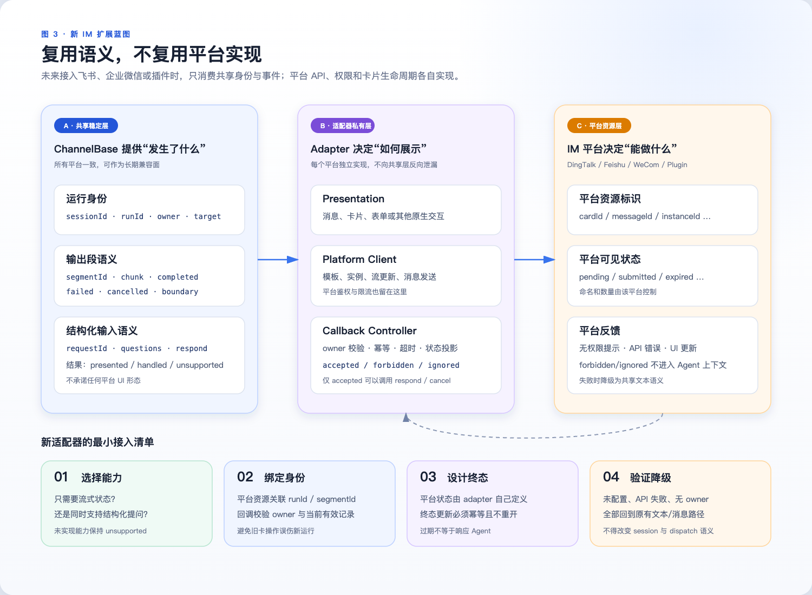

# 钉钉交互卡片

## 状态

[#6443](https://github.com/QwenLM/qwen-code/issues/6443) 的最终实现契约。本文档固定了随附运行时实现所遵循的实现边界、负载契约、状态归属、降级行为和验收标准。

## 动机

钉钉 channel 已经能够投递 Markdown、接收任务生命周期事件、转发权限请求以及取消活跃的 prompt。它没有提供原地运行状态卡片、精确运行（exact-run）的 Stop 动作，或者能够把结构化的 `ask_user_question` 回答返回给原始请求的表单卡片。

本设计添加这些钉钉交互，而不让模型、工具、ACP schema 或其他 channel 适配器了解钉钉模板和回调负载。

## 第 1 章：目标架构




架构有四个归属层：

1. Core 和 ACP 继续拥有语义问题和权限裁决。
2. `ChannelBase` 拥有待处理请求注册、settling（结算）和精确运行取消。
3. 钉钉适配器拥有卡片展示、回调路由、注册表、幂等性和降级。
4. 钉钉 Card OpenAPI 拥有投递、流式更新、实例更新和回调传输。

有两种卡片类型，而不是一个通用卡片生命周期：

| 卡片                  | 业务对象                         | 钉钉协议                                        | 本地生命周期                                                              |
| --------------------- | --------------------------------------- | -------------------------------------------------------- | ---------------------------------------------------------------------------- |
| 流式状态卡片 | 一个可见的输出段              | `createAndDeliver`、`/card/streaming`、`/card/instances` | `running`、`completed`、`failed`、`stopped`、`cancelled`                     |
| 表单回调卡片    | 一个 Channel 拥有的用户提问请求 | `createAndDeliver`、卡片回调、`/card/instances`     | `pending`、`submitted`、`cancelled`、`expired`、`resolved_outside_presenter` |

它们共享认证和回调入口，但保持独立的注册表和状态机。

## 复用的现有能力——不变

- `ask_user_question` 已经定义了问题、选项和多选行为。
- ACP 权限元数据标识用户提问交互并保留问题。
- 待处理权限已经有请求 ID 和一次性响应路径。
- `ChannelBase` 已经支持同一聊天的多个待处理权限请求。
- 任务生命周期事件已经暴露 `started`、文本块、工具调用、`completed`、`failed` 和 `cancelled`。
- 活跃 prompt 取消已经驱动 `/cancel`。
- 钉钉已经有 Stream 连接和通用的下游回调入口。
- CLI/TUI、Web 和 IDE 表面已经原生渲染用户提问。

## 已验证的来源约束

以下行为约束在实现期间针对 `origin/main` 重新检查过：

- `packages/channels/base/src/ChannelBase.ts` 在格式化或发送现有 Markdown prompt 之前注册每个待处理权限，包括其请求和聊天索引。同一注册表支持一个聊天中的多个请求，并驱动 `/approve`、`/approve-always` 和 `/deny` 查找。
- `packages/channels/base/src/ChannelAgentBridge.ts` 在 `PermissionResolvedEvent` 上包含权限结果。`packages/channels/base/src/AcpBridge.ts` 在成功的响应者返回之前同步发出该事件，而 `packages/channels/base/src/DaemonChannelBridge.ts` 保留一个已响应请求映射，可以稍后发出该事件。
- `packages/core/src/tools/askUserQuestion.ts` 允许一到四个问题。实时的 `permission_request` 携带有序的问题，但不保证每个问题都有可渲染的 `answerKey`。`packages/acp-bridge/src/bridgeClient.ts` 只在其待处理交互状态快照中添加基于索引的答案键。因此 Channel 接缝在规范化实时请求时必须派生相同的 `String(index)` 键。
- ACP 会话除了权限结果之外还消费顶层的 `answers: Record<string, string>`。多选答案为了与现有 TUI 和 Web 客户端兼容，仍然是逗号和空格连接的字符串。
- 通用权限命令提交的是选项或取消结果，而不是结构化答案。因此通过当前 Channel 路径批准 `ask_user_question` 会以空答案映射恢复它，并产生 `No valid answers were provided.`。卡片展示路径不得复用 `/approve`。
- 当有多个请求待处理时，现有的歧义响应已经列出请求 ID 和标题，因此本设计不为命令消歧添加另一个卡片字段。

## 变更影响与实现边界

本文档中的标签是规范性的：

- **需要变更——共享 Channel 层**表示实现修改 `ChannelBase` 或 Channel 拥有的公共类型。
- **仅钉钉变更**表示没有其他适配器读取该配置或参与该状态机。
- **不变**表示现有契约和运行时行为保持权威。

| 层或表面                                                                                | 影响                               | 所需工作                                                                                                                                                                            |
| ----------------------------------------------------------------------------------------------- | ------------------------------------ | ---------------------------------------------------------------------------------------------------------------------------------------------------------------------------------------- |
| `packages/channels/base/src/ChannelBase.ts`                                                     | 需要变更——共享 Channel     | 添加运行身份、精确运行取消、语义问题规范化、展示结算和结构化问题命令处理。                                            |
| `packages/channels/base/src/types.ts` 及其导出                                               | 需要变更——共享 Channel     | 添加语义输入类型以及可选的公共生命周期 `runId` 和 `owner`；由 `ChannelBase` 发出的 attended 事件始终填充两者。                                              |
| `packages/channels/dingtalk`                                                                    | 仅钉钉变更                 | 添加卡片配置、Card OpenAPI 访问、回调解析、所有者检查、两个注册表、有界的合并投射、降级和测试。                                      |
| 本设计文档                                                                            | 需要变更——仅文档 | 记录最终的负载、归属、变更影响、生命周期、降级和验收契约。                                                                                    |
| 架构资产                                                                             | 仅文档                   | 展示运行时链、兼容性与降级矩阵，以及未来适配器扩展边界，而不向共享契约引入平台字段。                        |
| `packages/core`、`ask_user_question` 和 `ToolConfirmationPayload`                             | 不变                            | 继续产生语义问题并消费 `answers`。                                                                                                                           |
| ACP agent 会话、ACP schema、`acp-bridge`、权限中介器、daemon 路由和 daemon SDK | 不变                            | 继续携带 `toolCall`、权限选项、结果和顶层 `answers`。                                                                                                     |
| `ChannelAgentBridge`、`AcpBridge`、`DaemonChannelBridge`、daemon worker 和 `SessionRouter`    | 不变                            | 继续转发完整的权限请求、按拥有的 `sessionId` 路由并返回权限响应。不引入单独的 `userQuestionRequest` bridge 事件。         |
| CLI/TUI、Web/Desktop、IDE、SDK 客户端                                                          | 不变                            | 继续使用其现有的原生提问 UI 和权限传输。                                                                                                             |
| Feishu、WeCom、QQ、Telegram、Weixin 和插件适配器                                        | 无直接变更                     | 继承默认的 `unsupported` 展示结果，并保留现有的权限 Markdown 和命令。它们无法返回结构化 Channel 答案的已知限制保持显式。 |

可选的公共生命周期 `runId` 和 `owner` 避免强迫合成生命周期事件的第三方适配器或测试 fixture 立即变更。`runId` 在 `ChannelBase` 内部不是可选的：每个 Channel 拥有的 prompt 都有一个，并且为该 prompt 发出的每个生命周期事件都包含它。Attended 入站 prompt 还在每个事件上携带规范化的 Channel owner；loop 和 webhook prompt 有意省略它。如果缺少所需身份，钉钉不会创建交互卡片。

## Channel 中立的用户输入接缝——共享 Channel 变更

`ChannelBase` 获得一个带三个显式结果的语义展示 hook：

```ts
type UserInputPresentationResult =
  | { kind: 'presented' }
  | { kind: 'handled' }
  | { kind: 'unsupported' };

type UserInputSettlementReason =
  | 'resolved_outside_presenter'
  | 'cancelled'
  | 'run_cancelled';

type ChannelUserInputResponse = RequestPermissionResponse & {
  answers?: Record<string, string>;
};

interface ChannelUserQuestion {
  answerKey: string;
  header: string;
  question: string;
  options: Array<{
    label: string;
    description: string;
  }>;
  multiSelect: boolean;
}

interface ChannelPromptOwner {
  kind: 'channel_user';
  id: string;
}

interface ChannelUserInputRequestContext {
  requestId: string;
  sessionId: string;
  runId: string;
  owner: ChannelPromptOwner;
  target: SessionTarget;
  questions: ChannelUserQuestion[];
  submitOptionId: string;
  onSettled(listener: (reason: UserInputSettlementReason) => void): () => void;
  respond(response: ChannelUserInputResponse): Promise<boolean>;
}

protected presentUserInputRequest(
  context: ChannelUserInputRequestContext,
): Promise<UserInputPresentationResult>;
```

`onSettled` 是一个带类型的一次性订阅，而不是公共 `reason` 为 `any` 的 `AbortSignal`。`ChannelBase` 是唯一的结算写入者；它以 `UserInputSettlementReason` 调用每个监听器，返回的函数只注销该监听器。共享的 `ChannelPromptOwner` 有意保持适配器中立：它标识启动该运行的人类 Channel 用户，而不暴露钉钉回调负载或身份字段名。该上下文不包含模板 ID、动作 ID、`outTrackId` 或可变的 bridge 对象。`submitOptionId` 是宣告为 `allow_once` 的原始权限选项；为了与当前生产者兼容，ID 为 `proceed_once` 且缺少 `kind` 的选项被同样对待。适配器绝不虚构选项 ID。

### 语义请求识别

`ChannelBase` 拥有一个规范化器，使适配器不会各自重新解释 ACP 负载：

1. 规范的判别式是 `toolCall._meta.qwenInteractionKind === 'user_question'`。
2. 规范问题来自 `toolCall._meta.qwenQuestions`。
3. 对于较旧的生产者，只有当规范工具名或工具类型也标识为 `AskUserQuestion` 时才接受 `toolCall.rawInput.questions`。恰好接受 `questions` 参数的其他工具不是语义用户输入。
4. 规范化器验证一到四个有序问题，把省略的 `multiSelect` 规范化为 `false`，并分配 `answerKey: String(index)`。
5. 格式错误的规范请求不会被部分渲染。它走现有的不支持权限路径，并记录结构化诊断而不记录问题答案。

该 hook 插入在待处理权限及其结算控制器存储之后，但在现有权限格式化器和发送器之前：

```text
store PendingPermission + settlement controller
active = current attended Channel-owned ActivePrompt for event.sessionId
normalize semantic question + compatible allow_once option
if valid question and active has runId + submitOptionId:
  construct context from active and normalized questions
  result = presentUserInputRequest(context)
  presented   -> mark structured input as presented, keep pending, and return
  handled     -> only valid if the adapter synchronously invoked context.respond
  unsupported -> continue
format and send the existing permission message
```

`respond` 闭包是唯一对适配器可见的结算操作。它绑定请求 ID，通过现有 bridge 转发完整响应，并在 `true`、`false` 和抛异常路径上执行相同的待处理清理。`ChannelBase` 记录它是否在展示 hook 解决之前被调用。没有该调用的 `handled` 是契约违反，会落入现有的权限消息；它不是让请求保持待处理的第二种方式。

每个移除待处理权限的路径都恰好结算控制器一次。这包括权限命令、上下文响应者、daemon `permissionResolved`、会话清理、任务取消和 bridge 替换。本地已知的运行取消会在之后折叠的 bridge 结果可能覆盖它之前以 `run_cancelled` 结算。一个带取消结果或带原始拒绝选项的独立 `permissionResolved` 变成中立的 `cancelled`；另一个或缺失的结果变成 `resolved_outside_presenter`。bridge 没有保留足够的因果信息来推断超时、拒绝还是清理，因此这个分类绝不把未知取消标记为 `expired`，也绝不猜测是哪个客户端响应的。钉钉本地的问题计时器在调用响应者之前拥有独立的 `expired` 投射。

该 hook 只对当前 attended 的 Channel 拥有的 `ActivePrompt` 有资格。`loopPrompt === true` 不合格；这排除了定时 loop 任务和 webhook 生产者，它们的消息 ID 和发送者是合成的而非人类钉钉输入。当不存在合格的活跃 prompt、`runId` 和 owner 时，`ChannelBase` 不构造上下文也不调用 hook；它把展示视为 `unsupported` 并继续现有权限路径。适配器独立地为该运行要求相同的真实钉钉入站消息归属记录。因此由 CLI、Web、IDE、SDK、其他客户端、loop 或 webhook 启动的运行不会创建绑定卡片的交互。初始设计不添加跨客户端身份联合。

默认 hook 返回 `unsupported`。因此其他 IM 适配器保留其当前的权限格式化和命令。

## 精确运行身份与取消——共享 Channel 变更

每次 prompt 调用都会创建一个不透明的唯一 `runId` 并存储在对应的 `ActivePrompt` 上。它不是 daemon 生命周期代数，后者在会话生命周期操作时改变，而不是每次 prompt。

`ChannelTaskLifecycleBase` 为源码兼容暴露 `runId?: string` 和 `owner?: ChannelPromptOwner`。`ChannelBase` 在其发出的每个 `started`、`text_chunk`、`tool_call` 和终态事件上包含具体的运行 ID。Attended prompt 在每个事件上包含相同的 owner；loop 和 webhook prompt 省略它。收到缺少所需身份的事件的消费者可以继续其现有行为，但不能创建卡片动作。

状态卡片的 Stop 回调把该 `runId` 带进一个新的受保护的 `ChannelBase` 精确运行取消入口。该方法只读取一次当前活跃 prompt，并在进入现有取消路径之前原子地检查期望的 ID。缺少活跃 prompt，或者 ID 缺失、过期或不匹配，都会返回 `false`；绑定卡片的路径绝不回退到仅会话取消。现有的 `/cancel` 行为保持会话作用域且不变。

接受的 Stop 序列是：

1. 验证回调所有者和卡片身份。
2. 在第一个异步操作之前同步认领当前存活回调。
3. 请求 `ChannelBase` 取消精确期望的运行。
4. 如果取消返回 `true`，阻止新的状态卡片块、关闭流式传输，并提交 Stopped 展示。
5. 如果取消返回 `false` 且同一记录仍是当前且非终态的，释放认领、保持卡片活跃并允许重试。

该认领是适配器本地的进行中锁，不是生命周期状态。异步结果只能更新或释放同一仍是当前、非终态的记录；在等待期间胜出的超时、结算或终态生命周期事件不能被覆盖。这防止旧卡片取消较新的 prompt，防止重复回调竞争，并避免在取消成功之前宣称成功，而无需添加公共 `processing` 状态。

## 仅所有者的卡片动作——仅钉钉变更

卡片动作授权比共享会话消息授权更严格。无论 `sessionScope` 如何，Stop、提交和取消始终仅限所有者。

在入站消息时，钉钉已经优先使用 `senderStaffId`，并回退到 `senderId` 作为信封发送者。在把真实入站轮次交给 `ChannelBase` 之前，适配器记录 `messageId -> DingTalkOwnerKey`。该映射遵循现有的 1,000 条入站消息上限。匹配的 `started` 生命周期事件消费并移除该映射，创建钉钉本地的运行/状态记录，并把相同的 Channel 生成的 `runId` 绑定到带类型的 owner。Loop 和 webhook 消息 ID 绝不进入该映射。终态运行清理在完结其问题后移除运行/状态记录。回调路由器把回调的 `userId`、`senderStaffId` 或 `senderId` 规范化为相同的带类型域，并要求精确匹配。如果没有可比较的身份可用，该动作 fail closed（失败即拒绝）。

外来用户的回调会被确认，但不能变更运行、权限请求或卡片。当存活卡片属于群聊时，控制器返回带 `forbidden` 结果的原始群目标，适配器在回调 ACK 之后向该群发送一条通用的“只有任务所有者可以操作此卡片”通知。该通知直接使用出站群消息路径：它不会转换为入站消息，也绝不进入 Agent 上下文。失败的通知会被记录，不会回退到权限结算、卡片变更或 Agent 投递。单聊卡片的禁止反馈保留现有的单聊消息路径。

`ignored` 保持与 `forbidden` 不同。重复、过期、格式错误和无法识别的回调会被确认并安全丢弃，不产生群反馈，防止重复或伪造的回调淹没群聊。该区分是适配器内部的回调处置，不是可见的钉钉卡片状态。

## 钉钉本地实现——仅钉钉变更

只有钉钉适配器读取 `interactiveCards` 并注册卡片回调主题。它拥有：

- 一个共享的已认证 Card OpenAPI 客户端，对两种卡片类型都应用固定的 10 秒请求超时。
- 一个有界的真实入站所有者映射。
- 一个按 `runId` 键控的运行/状态注册表，带可选的状态卡片 `outTrackId`。
- 一个按 `requestId` 和 `outTrackId` 键控的问题卡片注册表。
- 一个验证所有者的回调路由器。
- 每卡片的合并写入器、瞬时的进行中认领，以及有界的终态墓碑。
- 钉钉本地回退和结构化错误报告。

问题展示的作用域是 `sessionId + owner.id`。不同用户和会话可以独立拥有存活卡片。如果同一运行在该作用域中已经有待处理的原生问题，另一个请求返回 `unsupported`：`ChannelBase` 保持第一张卡片可回答，并通过现有的文本权限回退发送第二个请求。它不会让第一张卡片过期，也不合成权限响应。运行终止仍会使该运行拥有的每张卡片过期或取消。

## 流式状态卡片生命周期——仅钉钉变更

状态卡片表示 Channel 拥有的运行内的一个可见输出段。由 CLI、Web、IDE、SDK 或其他客户端发起的运行仍可能影响共享会话状态，但不会创建钉钉状态卡片。

创建和流式传输遵循钉钉的流式卡片协议：

1. 用唯一的 `outTrackId` 和初始 `flowStatus=2` 调用 `createAndDeliver`。
2. 用 `isFull=true`、`isFinalize=false` 和 `isError=false` 的空全量更新打开流式传输。
3. 在本地累积模型输出，并通过 `/card/streaming` 发送合并的全量快照。
4. 用 `updateCardDataByKey=true` 通过 `/card/instances` 发送低频模板变量，例如状态文本。

原始块绝不各自成为一个网络请求。每个状态记录最多允许一个进行中的 Card OpenAPI 写入和一个可替换的待处理全量快照。固定的 500 ms 最小 flush 间隔把较新的块合并进该待处理快照。可见内容上限为 20,000 字符；溢出时丢弃最旧内容并插入截断标记，而不是增长内存。每个 Card OpenAPI 调用都有 10 秒超时。中间的超时或失败会记录结构化错误、停止该卡片进一步的流式写入，并为等待的最终投递路径保留最新的有界文本。

状态卡片是惰性的且按段作用域。直接提问不创建状态卡片。问题之前的文本在问题卡片展示之前关闭其段，之后的续接文本打开一个新段：

```text
first visible text -> running
running -> completed
running -> failed
running -> stopped | cancelled
question settlement + later text -> a new running segment
```

核心生命周期保持 `cancelled`；不引入 `stopped` 事件。原因为 `cancel_command` 的取消在钉钉中可能展示为“Stopped”，而其他取消原因可能展示为“Cancelled”。

对于 `blockStreaming !== 'on'`，钉钉覆盖现有的等待 `onResponseComplete()` 接缝。该方法消费最新累积的文本、取消待处理的 flush 计时器、在其超时内等待唯一的进行中写入、执行 completed 最终实例更新，并在卡片创建或完结未成功时回退到现有的 Markdown 发送器。因此 `ChannelBase` 只在一条等待的投递路径完成后才发出 `completed`。不添加新的共享终态投递 hook。

当 `blockStreaming === 'on'` 时，钉钉不创建状态卡片，也不为卡片投递消费原始生命周期块；现有的 `BlockStreamer` 仍是唯一的响应投递路径。问题卡片仍独立有资格。`onTaskLifecycle` 记录终态原因并可能尽力做 failed/cancelled 投射，但它不被视为等待的投递保证。

终态状态卡片更新遵循一个有界的顺序：

1. 停止接受新的流式块，取消 flush 计时器，并把唯一的待处理快照折叠进最终有界内容，而不是重放每个原始块。
2. 如果流式传输已打开，用 `isFinalize=true` 关闭它。
3. 净化未解决的本地图片标记，使终态取消不能暴露文件系统路径。
4. 用一次 `/card/instances` 更新提交最终内容、可复制内容、状态文本和 `flowStatus=3`。

Completed、failed 和 cancelled 都投射为钉钉 `flowStatus=3`；最终内容和状态文本区分它们。一旦终态，每个 `outTrackId` 的写入器拒绝迟到的流式更新。

## 表单回调卡片生命周期——仅钉钉变更

问题卡片表示一个包含完整规范化问题数组的权限请求。工具 schema 允许一到四个问题，`ChannelBase` 派生与 daemon 待处理交互快照所使用的相同的基于索引的 `answerKey` 约定。因此一张卡片渲染并提交完整集合；没有逐问题的注册表或卡片生命周期。它以 `card_status=pending` 创建，且不调用 `/card/streaming`。所有展示变更都使用带 `updateCardDataByKey=true` 的 `/card/instances`。

每个待处理记录包含：

- `requestId`、`outTrackId` 和 `runId`。
- 完整的有序问题集合及其答案键。
- 原始宣告的 `submitOptionId`。
- 带类型的所有者身份。
- 原始的一次性响应者。
- 超时和结算订阅。
- 本地 `reserved`、`pending` 或 `claimed` 状态；终态化把记录替换为紧凑的墓碑。

生命周期遵循最新的 OpenClaw 投递竞争纪律，但不复制其持久化或合成消息续接：

```text
reserved   inserted and subscribed before createAndDeliver
pending    activated only after successful delivery while still reserved
claimed    atomically claimed by one valid callback
terminal   first settlement wins; live payload is compacted
```

如果结算或运行取消在 `createAndDeliver` 进行中时使 `reserved` 记录终态，之后成功的投递不能重新激活它。适配器尽力禁用那张已投递的卡片并返回，不再调用响应者。

回调顺序是权威的：

1. 按 `outTrackId` 定位记录并关联请求和运行。
2. 解析提交或取消负载，不修改记录。
3. 验证动作所有者。
4. 对于提交，拒绝每个不存在于存储的规范化问题集合中的表单答案键。
5. 在第一个异步操作之前，原子地把当前 `pending` 记录认领为 `claimed`。
6. 立即确认回调。无效、重复、过期和外来所有者的回调在其同步检查之后也恰好被确认一次。
7. 调用原始响应者。
8. 如果同一记录仍是当前且非终态的，从响应者结果完结并投射卡片。

提交使用现有的跨客户端契约编码表单：

```json
{
  "outcome": {
    "outcome": "selected",
    "optionId": "<advertised allow_once option>"
  },
  "answers": {
    "0": "Beijing staging",
    "1": "Logs, Metrics"
  }
}
```

单选值和自定义输入是字符串。多选值用 `", "` 连接，以匹配当前 TUI 和 Web 行为。取消只发送取消或宣告的拒绝结果，不发送答案。适配器绝不发送合成 prompt 或入站消息。

在响应者接受答案之前，卡片绝不显示提交成功：

| 事件                              | 本地状态                  | 卡片投射                                                       |
| ---------------------------------- | ---------------------------- | --------------------------------------------------------------------- |
| 提交响应者返回 `true`    | `submitted`                  | 已提交并禁用                                                |
| 取消响应者返回 `true`    | `cancelled`                  | 已取消并禁用                                                |
| `respond(...) === false`           | `expired`                    | 非交互 `card_status=expired`，“问题不再可用” |
| `respond(...)` 抛异常              | `expired`                    | 非交互失败投射、禁用且不可重试       |
| 独立的非取消结算  | `resolved_outside_presenter` | 非交互 `card_status=expired`，“已在卡片外解决”   |
| 独立的折叠取消 | `cancelled`                  | 非交互 `card_status=cancelled`，中立“已取消”          |
| 超时                            | `expired`                    | 过期并禁用                                                  |
| 请求或运行被销毁           | `cancelled`                  | 已取消或 Stopped 并禁用                                     |
| 重复或迟到回调         | 现有终态      | 确认并忽略                                                |
| 对终态记录的结算    | 现有终态      | 通过终态墓碑忽略                                 |

`resolved_outside_presenter` 本地状态只从独立的非取消结算事件进入，不从 `false` 响应者结果推断。`false` 只表示权限响应未被接受：请求映射可能不存在、其会话可能已消失，或另一个表面可能已经胜出。因此两种情况都使用非交互 `expired` 投射，而不声称用户取消。

现有的 daemon bridge 在 `respondToPermission()` 抛异常时消费请求到会话的映射，`ChannelBase` 在同一路径上移除待处理请求。之后的 daemon `permissionResolved` 不再是可靠的清理信号，因为 bridge 可能以未知请求拒绝它。因此钉钉记录失败、移除其待处理记录、保留终态墓碑，并立即尽力做非成功投射。它不释放认领，也不承诺回调重试。

`AcpBridge` 在成功的 `respondToPermission()` 返回之前同步发出 `permissionResolved`。因此在钉钉响应者认领进行中时，适配器把匹配的结算投射推迟到响应者结果和回调动作已知之后。被接受的提交变成 `submitted`；被接受的取消变成 `cancelled`；`false` 和抛异常使用上面的终态行。没有本地响应者认领时收到的结算遵循上面感知结果的行。daemon bridge 在保留了已响应请求映射之后稍后发出其成功结算；如果卡片已经终态，墓碑忽略该事件。钉钉本地计时器先把存活卡片完结为 `expired`，然后调用响应者，因此 bridge 的折叠取消不能重新标记它。本地已知的运行取消同样在 bridge 清理之前完结为 `run_cancelled`。未知的折叠取消保持中立的 `cancelled`。这个仲裁复用瞬时认领，不添加公共处理状态、重试队列或错误分类。

实例更新是 UI 投射，不是权限事务。如果响应者成功但随后的卡片更新失败，权限保持已解决，本地记录保持终态，重复回调保持被拒绝，适配器记录失败的 UI 投射。

与 OpenClaw 参考实现不同，Qwen Code 不注入合成入站消息。它直接响应原始权限请求。同一存活运行中的第二个请求使用文本回退，并保持第一张原生卡片可回答。

## 配置与内置模板——仅钉钉变更

能力配置是钉钉本地的。它由钉钉适配器解析，不向 `ChannelConfig` 添加跨 channel 的卡片概念：

```json
{
  "interactiveCards": {
    "enabled": true,
    "statusCard": {
      "enabled": true
    },
    "questionCard": {
      "enabled": true,
      "timeoutMs": 270000
    }
  }
}
```

有效的问题生存期是配置的超时和宿主权限生存期中较小的一个。

模板 ID 是钉钉 Channel 的内置资产，不是用户配置。参考插件使用这些 ID 和安装 bot 自己的钉钉凭据；它们不被视为参考仓库 AppKey 拥有的资源：

- 状态卡片：`675cde2f-f526-40cb-b828-f5b2b57b8b77.schema`
- 问题卡片：`c2a6355b-9724-4f7e-9653-d33fcb3311bb.schema`

本设计不添加用户提供的模板配置或启动健康检查。首次使用的 OpenAPI 拒绝是一个响亮的结构化错误，包含模板 ID 和钉钉错误码，然后进入文档化的降级路径。

内置资产契约和回调流程的证据：

- [soimy/openclaw-channel-dingtalk#583](https://github.com/soimy/openclaw-channel-dingtalk/pull/583) 已合并，记录了真机卡片投递、提交回调、取消回调和任务续接验证。
- [soimy/openclaw-channel-dingtalk#585](https://github.com/soimy/openclaw-channel-dingtalk/pull/585) 已合并，发布了最终的问题卡片模板资产，并获得了维护者批准。
- [OpenClaw main at `a8fb6f80e7`](https://github.com/soimy/openclaw-channel-dingtalk/commit/a8fb6f80e7360ce0ffee2d4a8007951bd85b23a4) 提供了当前 reserve/activate/claim/terminal 投递竞争参考。

这些来源提供了 Card OpenAPI、模板和并发性证据。Qwen Code 不复制它们独立的工具、`AsyncLocalStorage`、持久生命周期存储、合成消息重新注入、问题取代、fail-open 所有者检查或等待后 ACK 回调时序。

## 降级行为——仅钉钉变更

初始设计不添加后台重试队列，也不保留持久的 `presentation_failed` 状态。

| 情况                                           | 行为                                                                                                                                                                                          |
| --------------------------------------------------- | ------------------------------------------------------------------------------------------------------------------------------------------------------------------------------------------------- |
| 状态卡片被禁用或创建/最终更新失败 | 使用现有的等待 Markdown 响应投递，并记录结构化卡片错误。中间更新失败停止进一步的流式写入，并为最终投递保留有界文本。 |
| 状态卡片已投递但打开流式传输失败      | 尽力禁用空白卡片、停止该运行的卡片写入，并使用现有的等待 Markdown 响应投递。                                                                        |
| `blockStreaming === 'on'`                           | 跳过状态卡片；保留现有的 `BlockStreamer` 投递路径。问题卡片仍独立有资格。                                                                            |
| 问题卡片已创建                               | 返回 `presented`；保持原始权限待处理。                                                                                                                                         |
| 同一运行已有待处理的原生问题      | 对较新的请求返回 `unsupported`；保持第一张卡片活跃，并对较新的请求使用现有的文本权限回退。                                                       |
| 问题卡片被禁用或创建失败            | 发送可读的语义 Markdown，说明问题已取消且可以重试，取消原始请求，返回 `handled`，并记录感知模板的失败。                     |
| 没有当前 Channel 拥有的活跃运行                 | 把展示视为 `unsupported`；跳过两种钉钉卡片并保留现有权限路径。                                                                                          |
| 精确运行取消返回 `false`              | 仅当同一记录保持当前且非终态时释放瞬时认领；保持状态卡片活跃，以便可以重试 Stop。                                                         |
| 问题响应者返回 `false`                  | 以现有的取消投射和中立的“权限不再待处理”消息结束。                                                                                               |
| 问题响应者抛异常                           | 移除待处理记录，把已认领记录完结为取消，保留墓碑，立即投射非成功，且不宣告回调重试。                                      |
| 另一个路径先解决                         | 当没有本地响应者认领在进行中时，把折叠取消分类为中立的 `cancelled`；仅对非取消结果使用 `resolved_outside_presenter`。                             |
| 请求/运行被销毁                            | 以请求/运行取消结算；把卡片投射为已取消或 Stopped。                                                                                                                     |
| 另一个 IM 适配器拥有该会话                 | 返回 `unsupported` 并保留其现有的权限消息和命令。                                                                                                                   |
| 普通权限                                 | 保持 `/approve`、`/approve-always` 和 `/deny` 不变。                                                                                                                                        |

对于卡片展示的问题，`/approve` 和 `/approve-always` 仍被识别但不调用响应者；它们指示用户通过卡片提交，因为批准无法提供所需的 `answers` 对象。`/deny [requestId]` 保持为逃生通道，因为拒绝在无答案的情况下已经完成。`ChannelBase` 要求命令发送者与原始 prompt 发送者匹配，然后通过同一个一次性上下文响应者路由拒绝，使卡片结算、注册表清理和首响应者胜出语义保持完整。歧义请求保留现有的显式请求 ID 提示。其他权限和适配器保持其当前命令行为。初始设计不承诺自动回调重试。

## 客户端影响——现有客户端保持不变

| 客户端或表面                                          | 影响               | 本提案之后的行为                                                          |
| ---------------------------------------------------------- | -------------------- | ------------------------------------------------------------------------------------- |
| 钉钉 Channel 拥有的运行                                 | 仅钉钉变更 | 创建并更新流式状态卡片。                                          |
| 钉钉 Channel 拥有的问题请求                    | 仅钉钉变更 | 展示表单回调卡片或钉钉本地语义回退。                   |
| 没有 Channel 拥有活跃运行的钉钉路由请求 | 无行为变更   | 没有钉钉卡片；保留现有权限路径。                              |
| CLI/TUI                                                    | 不变            | 继续使用原生提问对话框。                                            |
| Web/Desktop                                                | 不变            | 继续使用原生提问组件和现有动作传输。           |
| IDE/ACP                                                    | 不变            | 继续使用原生 ACP 提问 UI；无 schema 变更。                          |
| SDK 和自定义 ACP 客户端                                 | 不变            | 继续使用现有的权限请求和响应协议。                 |
| 其他 IM 适配器                                          | 无直接变更     | 继承 `unsupported`；保留其当前权限行为和已知限制。 |
| 普通权限                                       | 不变            | 在每个客户端上保持现有的批准 UI 和命令。                           |

权限裁决保持首响应者胜出。瞬时的钉钉认领只为一张卡片串行化回调，并仲裁在其响应者调用期间到达的匹配结算；它不替代共享结算。如果在没有本地认领时到达独立结算，钉钉对其结果分类而不声称是哪个客户端响应的。如果卡片响应者返回 `true`，回调动作选择 `submitted` 或 `cancelled`，匹配的 `permissionResolved` 是清理而不是另一个表面胜出的证据。

## 实现验收标准

只有当以下行为被覆盖时实现才算完成。这些测试演练变更的层；未变更的 Core、ACP、daemon、Web、IDE 和其他适配器套件不是本提案的功能工作。

### 共享 Channel 测试——需要变更

- 每个 Channel 拥有的 prompt 获得唯一的 `runId`；该 prompt 的所有生命周期事件携带相同的 ID，同一会话中较后的 prompt 获得不同的 ID。
- 精确运行取消只对当前 ID 成功。缺失、过期和不匹配的 ID 返回 `false`，绝不回退到仅会话取消。
- 语义规范化器接受规范的 `_meta.qwenInteractionKind` 加 `_meta.qwenQuestions`，分配有序的字符串答案键，并把缺失的 `multiSelect` 规范化为 `false`。
- 兼容路径只对已识别的 AskUserQuestion 工具接受 `rawInput.questions`，不会把带 `questions` 参数的其他工具误分类。
- 提交选项规范化接受 `kind: allow_once` 和当前没有 `kind` 的遗留 `proceed_once` 选项，绝不虚构选项 ID。
- `presented`、`handled` 和 `unsupported` 各自遵循其声明的待处理归属行为。
- Loop 和 webhook prompt 没有语义卡片展示资格，即使它们发出普通生命周期事件。
- 卡片展示的问题不能被 `/approve` 或 `/approve-always` 批准；仅所有者的 `/deny [requestId]` 使用同一个一次性响应者，而普通权限保留所有命令。
- 结算监听器只收到带类型的 `UserInputSettlementReason` 值；本地已知的运行取消胜过之后折叠的 bridge 取消。
- 直接响应、外部 `permissionResolved`、超时、取消、会话死亡、bridge 替换和发送失败恰好结算并移除待处理记录一次。

### 钉钉适配器测试——仅钉钉变更

- 一个真实人类的钉钉 `started` 事件从其入站消息和所有者绑定一个合格运行；合成、未知、loop 和 webhook 消息 ID 不创建合格运行或卡片。
- 在块流式关闭时，一张状态卡片以最多一个进行中的写入和一个有界待处理快照合并块；completed 投递等待完结并回退到 Markdown。在块流式开启时，不创建状态卡片，现有块投递保持权威。
- Stop 验证所有者和卡片身份，认领一次，只取消匹配的 `runId`，拒绝重复，并且只有在非终态 `false` 结果之后才可重试。
- 一个权限请求创建一张包含所有问题及其有序答案键的问题卡片；同一运行中的第二个请求回退到文本，而第一张卡片保持可交互，不同用户和会话保持独立。
- 问题在投递之前保留，只有在投递后仍然存活时才激活，在进行中结算或运行取消之后绝不复活。
- 提交选择原始宣告的 `allow_once` 选项，把单选、多选和自定义答案编码为 `Record<string, string>`，并直接解决原始请求。
- 包含任何存储的规范化问题集合之外答案键的提交在调用响应者之前被拒绝。
- 回调传输在同步解析、关联、授权和认领之后、任何响应者或 Card OpenAPI 等待之前恰好被确认一次。
- 提交、取消、超时、运行取消、请求销毁、外部解决、重复回调、响应者 `false`、响应者抛异常和卡片投射失败都使用 `finalizeQuestion`、清除运行级待处理集合，绝不重新打开终态记录。
- 外来或无法识别的回调用户 fail closed（失败即拒绝），不能变更任一注册表。
- 流式内容、Card OpenAPI 时长和终态墓碑遵守其固定的大小/时间边界；终态记录不包含响应者、答案、问题、计时器、订阅或排队内容。
- 禁用卡片或拒绝模板遵循文档化的状态或问题降级路径，不暴露原始请求 JSON。

### 端到端评审者验证——变更的钉钉行为

- 在真实钉钉客户端上，验证状态卡片创建、有序流式、完成、失败和取消投射。
- 验证 Stop 动作取消其精确的活跃运行，并且旧卡片不能取消同一会话中较新的运行。
- 验证单问题和多问题卡片、单选、多选、自定义输入、取消、超时以及带提交答案的任务续接。
- 把 Web 或 IDE 附加到同一 daemon 会话，先在那里解决问题，并验证钉钉卡片变为非交互，而不声称钉钉提交了它。
- 独立禁用每种卡片类型，并验证文档化的 Markdown 行为以及持续的任务执行或问题取消。
- 在 `blockStreaming=on` 时，验证现有块响应保持权威，同时问题卡片仍可成功提交。

## 第 2 章：对其他 IM 适配器的当前影响——无直接变更

共享 hook 是一个 opt-in 接缝，不是钉钉行为的推广。Feishu、QQ、Telegram、WeCom、Weixin 和插件适配器不读取钉钉配置、模板 ID、回调动作或卡片状态。它们现有的权限格式化和命令保持不变。

现有限制保持显式：`/approve` 无法携带 `ask_user_question` 答案。本提案不在其他 IM 适配器上静默取消问题或暴露原始请求 JSON。

## 第 3 章：未来扩展蓝图——本提案不变更

未来的 IM 适配器可以为绑定到其自己当前 `ActivePrompt` 的请求显式覆盖语义 hook。返回 `presented` 的适配器必须拥有其平台展示、回调或结构化回复解析器、待处理注册表、所有者和运行检查、超时、感知原因的结算、幂等性，以及对原始请求的直接响应。它不得仅仅为了恢复运行而注入合成用户消息。

每个适配器应通过单独的变更选择加入，以便其平台特定的能力和状态归属可以被独立评审。

## 风险与范围边界

第一个实现有意是 daemon 本地的。存活的待处理卡片注册表与进程生命周期绑定；重启安全的恢复和非粘性多实例回调路由需要单独的持久化设计。终态记录被压缩为仅回调关联、终态状态和过期元数据，为回调重投递保留 10 分钟，并存储在每种卡片类型上限 1,000 条、按插入顺序的映射中。过期和最旧条目逐出会回收它；响应者、问题负载、答案负载、计时器、订阅或排队内容都不在终态化后幸存。

本实现不添加跨客户端运行归属或身份映射、跨 channel 文本答案协议、自由格式回复解析、合成消息注入、通用跨 channel 卡片框架、回调重试系统，或新的处理/错误状态机。
