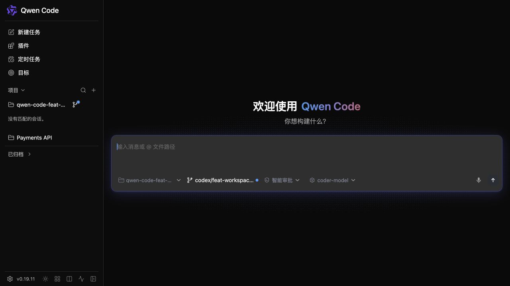

# Daemon 工作空间显示名称

## 目标

让 daemon 和 TypeScript SDK 客户端能够为已注册的工作空间附加一个可选的人类可读显示名称，而不改变工作空间身份或路由。让 Web Shell 用户在添加工作空间时设置该名称，并在工作空间列表中看到它。让 API 客户端更新或清除活跃工作空间的呈现元数据。

## 契约

- `workspaces[]` 条目新增可选的 `displayName` 元数据。
- `POST /workspaces` 在注册或持久化提升次级工作空间时接受可选的 `displayName`。
- `PATCH /workspaces/:workspace` 是工作空间更新端点。其当前请求形态为 `{ displayName: string | null }`；`null` 清除名称。
- `POST /workspaces`、`PATCH /workspaces/:workspace` 以及持久化注册列表在存在显示名称时返回生效的显示名称。
- `workspace_display_name` 宣告该契约。TypeScript SDK 暴露注册选项和 `updateWorkspace()`。
- 当该能力被宣告时，Web Shell 的添加工作空间对话框接受可选的显示名称，并将其用于工作空间标签。

`id` 和 `cwd` 仍然是仅有的工作空间选择器。显示名称从不用于查找，也不需要唯一。

## 运行时与持久化

运行时拥有生效的显示名称。更新任何活跃工作空间都会修改该运行时元数据。当运行时具有匹配的持久化注册身份时，同一更新会原子地写入所有这些记录；否则该更新保持进程本地。进程本地的工作空间在 daemon 停止时会同时失去运行时及其名称，且显示名称更新从不依赖注册存储。

现有的 schema-v1 注册文件保持其 `workspaces: string[]` 形态，并新增一个可选的 `displayNames` 对象，以现有的稳定注册 id 为键。更新复用存储现有的锁、锁内重读和原子写入。较旧的 daemon 会忽略该增量字段，较新的 daemon 继续读取不包含该字段的文件。删除注册时也会删除其显示名称条目。

## 校验与失败

工作空间显示名称在去除首尾空白后限制为 256 个字符。内部的 C0 和 DEL 控制字符会被拒绝；空结果视为无名称。非法输入在文件系统或运行时工作开始之前返回 `400 invalid_display_name`。允许重复的显示名称。

当一个进程本地的工作空间首次被持久化时，注册存储的写入会在持久化的显示名称暴露到运行时之前完成。同样，PATCH 会在暴露新的运行时值之前更新匹配的持久化记录，因此一次普通的存储失败会使运行时保持未变。

## 兼容性

所有协议变更对 v1 协议都是增量的。较旧的 SDK 会忽略 `displayName`；较新的 SDK 将其类型标为可选，并继续与同时省略该字段和能力标签的旧 daemon 协同工作。当能力标签缺失时，Web Shell 隐藏显示名称控件。

## 验证

- 注册存储测试覆盖旧版文件、初始名称、校验、原子别名更新、重启恢复以及删除时的清理。
- 工作空间管理测试覆盖进程本地与持久化创建、更新/清除、持久化错误和幂等提升。
- 能力/状态与 SDK 测试覆盖增量字段、请求形态、`updateWorkspace()` 和 `workspace_display_name` 宣告。
- Web Shell 测试覆盖可选输入、SDK 选项转发和标签回退。浏览器截图验证真实的添加工作空间表单及其产生的侧边栏标签。
- 手工端到端验证覆盖进程本地注册和持久化重启恢复。

填写好的添加工作空间表单：

以显示名称展示的已创建工作空间：

