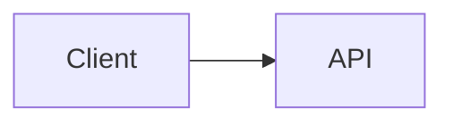

# Markdown 语法扩展设计

## 背景

本文档保存了集成 Markdown 语法扩展 PR 的实现参考资料。该设计基于
`origin/docs/tui-optimization-design` 分支的 TUI 优化研究，尤其参考了以下文档：

- `docs/design/tui-optimization/00-overview.md`
- `docs/design/tui-optimization/03-rendering-extensibility.md`
- `docs/design/tui-optimization/04-gemini-cli-research.md`
- `docs/design/tui-optimization/05-claude-code-research.md`
- `docs/design/tui-optimization/06-implementation-rollout-checklist.md`
- `docs/design/tui-optimization/08-execution-plan-and-test-matrix.md`

上述研究推荐了一套以 AST 解析器、块/token 缓存、稳定前缀流式输出、有界详情面板
以及终端能力检测为核心的长期 Markdown 架构。首个实现版本保持了较小的运行时开销，
并使新行为能够立即生效。

## 集成 PR 范围

本 PR 将 Markdown 语法扩展作为一项整体渲染改进来处理，
而非拆分为独立的 feature PR。

首个实现版本包含以下内容：

- Mermaid 代码块在 TUI 中以可视化方式渲染。
- 在显式启用图像渲染、`mmdc` 可用且终端支持图像路径的情况下，
  Mermaid 图表通过 PNG 终端图像渲染。
- `flowchart` / `graph` 类 Mermaid 图表降级为方框和箭头预览。
- `sequenceDiagram` 类 Mermaid 图表降级为参与者箭头预览。
- 基础的 `classDiagram`、`stateDiagram`、`erDiagram`、`gantt`、`pie`、
  `journey`、`mindmap`、`gitGraph` 和 `requirementDiagram` 块降级为有界文本预览。
- 没有文本预览的 Mermaid 类型降级为原始围栏代码源，方便用户阅读和复制图表定义。
- 任务列表项渲染勾选/未勾选标记。
- 块引用渲染带可见引用栏。
- 内联 `$...$` 数学公式和块级 `$$...$$` 数学公式通过常见 Unicode 替换进行渲染。
- 现有 Markdown 表格继续使用 `TableRenderer`。
- 现有非 Mermaid 围栏代码块继续使用 `CodeColorizer`。
- 已渲染的可视化块通过 `/copy mermaid N`、`/copy latex N`、
  `/copy latex inline N` 和原始模式保持源代码可访问。
- `ui.renderMode` 控制会话启动时是以渲染模式还是原始/源代码模式呈现，
  `Alt/Option+M` 切换当前会话视图。

## Mermaid 渲染策略

### 第一版：能力门控图像渲染 + 文本降级

该实现将 Mermaid 自身的布局作为首选路径。当本地环境支持时，TUI 通过以下管道渲染 Mermaid 块：

```text
Mermaid source
  -> mmdc / Mermaid CLI
  -> PNG
  -> Kitty or iTerm2 terminal image protocol
```

如果终端不支持内联图像但安装了 `chafa`，则使用同一 PNG 渲染为 ANSI 块状图形。
若图像协议和 `chafa` 均不可用，渲染器将降级为下文所述的同步终端文本预览。

在响应仍在流式输出期间不尝试图像渲染。流式输出过程中，Mermaid 块显示有界的
待处理预览。响应完成后，仅在显式启用的情况下才尝试图像路径。
这将缓慢的 `mmdc` 启动（尤其是可选启用的 `npx` 路径）排除在默认的
交互式渲染路径之外。

PNG 生成独立于终端放置进行缓存。对相同 Mermaid 源的重复渲染
（包括终端调整大小更新）会复用已生成的 PNG，仅重新计算
Kitty/iTerm2 的放置尺寸。

图像路径有意设计为可选启用且能力门控，而非始终捆绑或从 CLI 热路径调用
Puppeteer/Chromium。用户可通过 `QWEN_CODE_MERMAID_IMAGE_RENDERING=1` 启用图像路径，
然后通过在 `PATH` 上安装 `mmdc` 或将 `QWEN_CODE_MERMAID_MMD_CLI` 设置为二进制路径
来提供 `@mermaid-js/mermaid-cli`。对于临时本地验证，
`QWEN_CODE_MERMAID_ALLOW_NPX=1` 允许渲染器调用
`npx -y @mermaid-js/mermaid-cli@11.12.0`；此选项有意设为可选启用，
因为首次运行可能会安装 Puppeteer/Chromium 并阻塞渲染。
除非设置了 `QWEN_CODE_MERMAID_ALLOW_LOCAL_RENDERERS=1`，
否则不会自动发现仓库本地的 `node_modules/.bin` 渲染器。
可通过 `QWEN_CODE_MERMAID_IMAGE_PROTOCOL=kitty|iterm2|off` 强制指定终端协议。

对于 Ghostty 等兼容 Kitty 的终端，渲染器使用 Kitty Unicode 占位符，
而非将图像负载作为 Ink 文本写入。PNG 通过原始 stdout 以静默模式（`q=2`）
和虚拟放置（`U=1`）传输，React 树渲染正常的占位符字符网格（`U+10EEEE`），
并为每个单元格附加显式的行列变音符号。
这使 Ink 负责布局和调整大小，同时防止 APC 负载字节被包装为可见的 base64 文本。

### 降级方案：可调整大小的线框预览

降级方案避免异步工作，因为 Ink 的 `<Static>` 路径仅支持追加：
已完成的消息无法可靠地等待后台渲染任务后再原地更新，除非强制全量静态刷新。
因此降级方案必须在正常的 React 渲染过程中生成终端输出。

对于 `flowchart` / `graph` 图表，降级方案构建轻量级图模型，
而非逐条边输出：

- 节点按 Mermaid id、标签和基本形状进行规范化。
- 节点标签支持 Mermaid 风格的 `\n` / `<br>` 换行符。
- 自顶向下的图表按水平层级排列。
- 自左向右的图表在适合时按垂直列排列。
- 同一节点的多条出边绘制为带方括号边标签（如 `[Yes]`、`[No]`、`[是]`、`[否]`）的分叉。
- 回边和环路在 `Cycles:` 部分以显式的 `↩ to <node>` 标记汇总。
  这避免了终端字体中不稳定的长跨图路由，同时保持循环语义可见。
- 图形从 `contentWidth` 重新计算，因此调整大小会改变节点宽度、间距和连接路径。
- 大型预览在图形布局前进行有界处理，确保超大 Mermaid 块在渲染时不会分配无界的终端画布。

示例：



在终端中以可视化预览方式渲染，而非显示 Mermaid 源代码。

其他常见 Mermaid 图表族使用有界文本摘要，而非完整的布局引擎：
类关系/成员、状态转换、ER 实体/关系、Gantt 任务、饼图切片、
journey 步骤、思维导图树、git 图条目和需求树。
如果图表类型未知或不可预览，渲染器将显示原始围栏 Mermaid 源代码而非占位符，
确保内容在终端中保持可读和可选择/复制。
渲染后的 Mermaid 标题还会显示 Mermaid 专用的复制命令（例如 `/copy mermaid 2`），
方便用户在不切换到原始模式的情况下恢复原始图表源代码。

降级方案并非完整的 Mermaid 引擎，而是一个快速、轻依赖的预览层，
用于在高保真渲染不可用时处理常见的 LLM 生成图表。

### 未来提供者

提供者边界有意对其他原生图像提供者保持开放：

- `mmdc` / `@mermaid-js/mermaid-cli` 用于 SVG/PNG 输出。
- `terminal-image` 用于 Kitty/iTerm2 加 ANSI 降级。
- 存在时使用 `chafa` 处理 Sixel/Kitty/iTerm2/Unicode 马赛克。

该路径应保持可选、缓存和能力门控，缓存键基于源哈希、终端宽度、
渲染器提供者和终端协议。默认情况下不应阻塞启动，也不应向 TUI 热路径
添加捆绑的 Mermaid/Puppeteer 工作。

## AST 渲染器兼容性

首个版本扩展了现有解析器以最小化影响范围。功能边界仍与未来的 `marked` token 管道兼容：

- `code(lang=mermaid)` -> `MermaidDiagram`
- `code(lang=*)` -> 现有 `CodeColorizer`
- `table` -> 现有 `TableRenderer`
- `blockquote` -> 块引用渲染器
- `list(task=true)` -> 任务列表渲染器
- `paragraph/text` -> 支持数学/链接/样式的内联渲染器

该实现不缓存 React 节点。未来的 AST 渲染器应缓存 token/块，
然后根据当前的宽度/主题/设置 props 进行渲染。

## 安全与性能

- Mermaid 源代码被视为不可信输入。
- 首个渲染器不执行 Mermaid JavaScript。
- 原生图像渲染必须可选启用或能力门控。
- 未来基于浏览器的渲染必须使用超时和大小限制。
- 渲染应降级为终端文本，而非抛出异常。
- 大型块应遵守可用的高度和宽度限制。

## 验证

针对性单元验证：

```bash
cd packages/cli
npx vitest run \
  src/config/settingsSchema.test.ts \
  src/ui/AppContainer.test.tsx \
  src/ui/utils/MarkdownDisplay.test.tsx \
  src/ui/utils/mermaidImageRenderer.test.ts \
  src/ui/commands/copyCommand.test.ts \
  src/ui/components/BaseTextInput.test.tsx \
  src/ui/keyMatchers.test.ts \
  src/ui/contexts/KeypressContext.test.tsx
```

PR 提交前的全面验证：

```bash
npm run build --workspace=packages/cli
npm run typecheck --workspace=packages/cli
npm run lint --workspace=packages/cli
git diff --check
```

终端捕获集成场景：

```bash
npm run build && npm run bundle
cd integration-tests/terminal-capture
npm run capture:markdown-rendering
```

该场景捕获一个 Markdown 密集型模型响应，使用 `Alt/Option+M` 切换原始/源代码模式，
并通过 `/copy mermaid 1` 和 `/copy latex 1` 验证可见的源代码复制流程。

手动场景：

- 助手响应包含 Mermaid `flowchart LR` 块。
- 助手响应包含 Mermaid `sequenceDiagram` 块。
- 同一答案中包含 Markdown 表格和 Mermaid。
- 围栏 JavaScript 代码块仍显示代码格式。
- 终端宽度较窄。
- 受限的工具/详情面板。
- `ui.renderMode: "raw"` 以源代码导向模式启动会话。
- `Alt/Option+M` 在渲染模式和原始/源代码模式之间切换同一响应。
- Mermaid 和 LaTeX 可视化块显示的复制提示映射到实际的
  `/copy mermaid N` 和 `/copy latex N` 源代码顺序。
