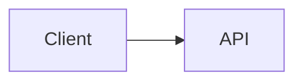

# Markdown 语法扩展设计

## 背景

本文档记录了集成式 Markdown 语法扩展 PR 的实现参考。它基于 `origin/docs/tui-optimization-design` 中的 TUI 优化研究，尤其是：

- `docs/design/tui-optimization/00-overview.md`
- `docs/design/tui-optimization/03-rendering-extensibility.md`
- `docs/design/tui-optimization/04-gemini-cli-research.md`
- `docs/design/tui-optimization/05-claude-code-research.md`
- `docs/design/tui-optimization/06-implementation-rollout-checklist.md`
- `docs/design/tui-optimization/08-execution-plan-and-test-matrix.md`

相关研究推荐了一个长期 Markdown 架构，该架构基于 AST 解析器、块/令牌缓存、稳定前缀流、有界详细面板以及终端能力检测。本次首次实现保持了较小的运行时占用，并使新行为立即可见。

## 集成 PR 范围

此 PR 将 Markdown 语法扩展视为一个连贯的渲染器改进，而不是单独的功能 PR。

首次实现包括：

- Mermaid 代码块在 TUI 中可视渲染。
- 当显式启用图片渲染、`mmdc` 可用且终端支持图片路径时，Mermaid 图通过 PNG 终端图片渲染。
- `flowchart` / `graph` 类型的 Mermaid 图回退到方框-箭头预览。
- `sequenceDiagram` 类型的 Mermaid 图回退到参与者-箭头预览。
- 基本的 `classDiagram`、`stateDiagram`、`erDiagram`、`gantt`、`pie`、`journey`、`mindmap`、`gitGraph` 和 `requirementDiagram` 块回退到有界文本预览。
- 没有文本预览的 Mermaid 类型回退到原始的带围栏源码，以便用户仍然可以阅读和复制图定义。
- 任务列表项渲染选中/未选中标记。
- 块引用渲染为可见的引用条。
- 行内 `$...$` 数学和块级 `$$...$$` 数学使用常见 Unicode 替换渲染。
- 现有的 Markdown 表格继续使用 `TableRenderer`。
- 现有的非 Mermaid 围栏代码块继续使用 `CodeColorizer`。
- 渲染后的可视化块可以通过 `/copy mermaid N`、`/copy latex N`、`/copy latex inline N` 以及原始模式保持源码可访问。
- `ui.renderMode` 控制会话是以渲染模式还是原始/源码模式启动，而 `Alt/Option+M` 用于切换当前会话视图。

## Mermaid 渲染策略

### 第一版：能力受限的图片渲染加文本回退

该实现现在将 Mermaid 自身的布局视为首选路径。当本地环境支持时，TUI 通过以下流水线渲染 Mermaid 块：

```text
Mermaid 源码
  -> mmdc / Mermaid CLI
  -> PNG
  -> Kitty 或 iTerm2 终端图片协议
```

如果终端不支持内联图片但已安装 `chafa`，相同的 PNG 将渲染为 ANSI 块图形。如果图片协议和 `chafa` 都不可用，渲染器将回退到下面描述的同步终端文本预览。

图片渲染不会在响应仍在流式传输时尝试。在流式传输期间，Mermaid 块显示一个有界等待预览。一旦响应完成，仅在显式启用时才会尝试图片路径。这使缓慢的 `mmdc` 启动（尤其是可选的 `npx` 路径）远离默认的交互式渲染路径。

PNG 生成独立于终端放置进行缓存。重复渲染相同的 Mermaid 源码（包括终端大小调整更新）会重用生成的 PNG，仅重新计算 Kitty/iTerm2 的放置尺寸。

图片路径是有意设计为可选且受能力限制的，而不是总是从热 CLI 路径中打包或调用 Puppeteer/Chromium。用户可以通过设置 `QWEN_CODE_MERMAID_IMAGE_RENDERING=1` 启用图片路径，然后通过安装 `mmdc` 到 `PATH` 或设置 `QWEN_CODE_MERMAID_MMD_CLI` 为二进制路径来提供 `@mermaid-js/mermaid-cli`。对于临时的本地验证，`QWEN_CODE_MERMAID_ALLOW_NPX=1` 允许渲染器调用 `npx -y @mermaid-js/mermaid-cli@11.12.0`；这是有意设计为可选的，因为首次运行可能会安装 Puppeteer/Chromium 并阻塞渲染。仓库本地的 `node_modules/.bin` 渲染器不会被自动发现，除非设置了 `QWEN_CODE_MERMAID_ALLOW_LOCAL_RENDERERS=1`。可以通过 `QWEN_CODE_MERMAID_IMAGE_PROTOCOL=kitty|iterm2|off` 强制选择终端协议。

对于兼容 Kitty 的终端（如 Ghostty），渲染器使用 Kitty Unicode 占位符，而不是将图片载荷写入为 Ink 文本。PNG 通过原始 stdout 在静默模式（`q=2`）下传输，并使用虚拟放置（`U=1`），React 树渲染带有每个单元格显式行和列变音符号的正常占位符字符网格（`U+10EEEE`）。这使 Ink 负责布局和尺寸调整，同时防止 APC 载荷字节被包裹成可见的 base64 文本。

### 回退：可调整大小的线框预览

回退避免了异步工作，因为 Ink 的 `<Static>` 路径是仅追加的：最终确定的消息无法可靠地等待后台渲染作业并原地更新，而不强制进行完整的静态刷新。因此，回退必须在正常的 React 渲染过程中生成终端输出。

对于 `flowchart` / `graph` 图，回退构建一个轻量级图模型，而不是逐条边打印：

- 节点根据 Mermaid 的 id、标签和基本形状进行归一化。
- 节点标签支持 Mermaid 风格的 `\n` / `<br>` 换行。
- 自上而下的图被排列成水平层。
- 从左到右的图在适合时被排列成垂直列。
- 同一节点的多条出边绘制为一个分支，并带有括号边标签，例如 `[Yes]`、`[No]`、`[是]` 和 `[否]`。
- 回边和循环总结在 `Cycles:` 部分，带有显式的 `↩ to <node>` 标记。这避免了终端字体中不稳定的长跨图路由，同时保持循环语义可见。
- 图根据 `contentWidth` 重新计算，因此尺寸调整会改变节点宽度、间距和连接器路径。
- 大预览在图布局之前就被绑定，因此非常大的 Mermaid 块不会在渲染期间分配无限的终端画布。

示例：



渲染为终端视觉预览，而不是 Mermaid 源码。

其他常见的 Mermaid 图系列使用有界文本摘要，而不是完整的布局引擎：类关系/成员、状态转换、ER 实体/关系、Gantt 任务、饼图切片、旅程步骤、思维导图树、git 图条目和需求树。如果图类型未知或无法预览，渲染器将显示原始的带围栏 Mermaid 源码，而不是占位符，以便内容在终端中保持可读和可选中/可复制。渲染后的 Mermaid 标题还显示 Mermaid 特定的复制命令，例如 `/copy mermaid 2`，以便用户无需将整个视图切换到原始模式即可恢复原始图源码。

回退仍然不是完整的 Mermaid 引擎。它是一个快速、依赖轻量的预览层，适用于常见 LLM 生成的图，当高保真渲染不可用时。

### 未来的提供者

提供者边界有意保持开放，以支持额外的原生图片提供者：

- `mmdc` / `@mermaid-js/mermaid-cli` 用于 SVG/PNG 输出。
- `terminal-image` 用于 Kitty/iTerm2 加 ANSI 回退。
- `chafa`（当存在时）用于 Sixel/Kitty/iTerm2/Unicode 马赛克。

此路径应保持可选、缓存和受能力限制，缓存键基于源码哈希、终端宽度、渲染器提供者和终端协议。它不应阻塞启动，也不应默认将打包的 Mermaid/Puppeteer 工作添加到热 TUI 路径中。

## AST 渲染器兼容性

第一版扩展了现有解析器以最小化影响范围。功能边界仍然与未来的 `marked` 令牌流水线兼容：

- `code(lang=mermaid)` -> `MermaidDiagram`
- `code(lang=*)` -> 现有的 `CodeColorizer`
- `table` -> 现有的 `TableRenderer`
- `blockquote` -> 引用块渲染器
- `list(task=true)` -> 任务列表渲染器
- `paragraph/text` -> 带有数学/链接/样式支持的行内渲染器

该实现不会缓存 React 节点。未来的 AST 渲染器应缓存令牌/块，然后根据当前的宽度/主题/设置属性进行渲染。

## 安全与性能

- Mermaid 源码被视为不可信输入。
- 第一版渲染器不会执行 Mermaid JavaScript。
- 原生图片渲染必须是可选或受能力限制的。
- 未来基于浏览器的渲染必须使用超时和大小限制。
- 渲染应降级为终端文本，而不是抛出异常。
- 大块应尊重可用的高度和宽度。

## 验证

针对性的单元验证：

```bash
cd packages/cli
npx vitest run \
  src/config/settingsSchema.test.ts \
  src/ui/AppContainer.test.tsx \
  src/ui/utils/MarkdownDisplay.test.tsx \
  src/ui/utils/mermaidImageRenderer.test.ts \
  src/ui/commands/copyCommand.test.ts \
  src/ui/components/BaseTextInput.test.tsx \
  src/ui/keyMatchers.test.ts \
  src/ui/contexts/KeypressContext.test.tsx
```

PR 提交前的更广泛验证：

```bash
npm run build --workspace=packages/cli
npm run typecheck --workspace=packages/cli
npm run lint --workspace=packages/cli
git diff --check
```

终端捕获集成场景：

```bash
npm run build && npm run bundle
cd integration-tests/terminal-capture
npm run capture:markdown-rendering
```

此场景捕获一个 Markdown 密集的模型响应，使用 `Alt/Option+M` 切换原始/源码模式，并通过 `/copy mermaid 1` 和 `/copy latex 1` 验证可见的源码复制流程。

手动场景：

- 助手响应中包含一个 Mermaid `flowchart LR` 块。
- 助手响应中包含一个 Mermaid `sequenceDiagram` 块。
- 同一条回答中包含 Markdown 表格和 Mermaid。
- 围栏 JavaScript 代码块仍显示代码格式化。
- 狭窄的终端宽度。
- 受限的工具/详情区域。
- `ui.renderMode: "raw"` 以源码导向模式启动会话。
- `Alt/Option+M` 在同一响应中切换渲染和原始/源码模式。
- Mermaid 和 LaTeX 可视化块显示复制提示，映射到实际的 `/copy mermaid N` 和 `/copy latex N` 源码顺序。