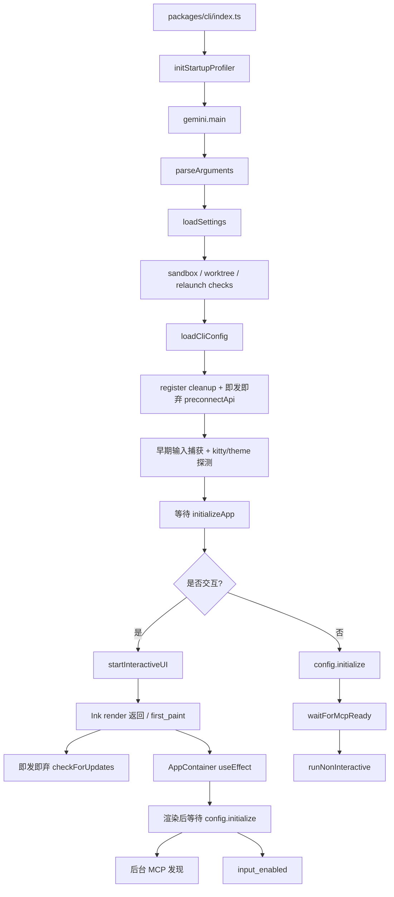
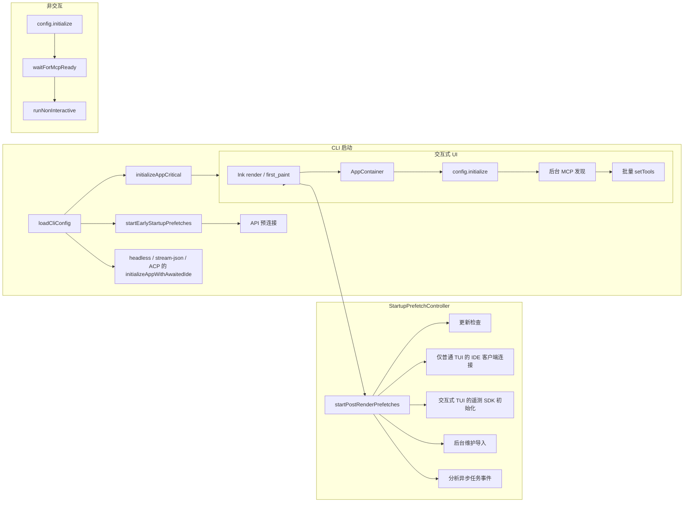
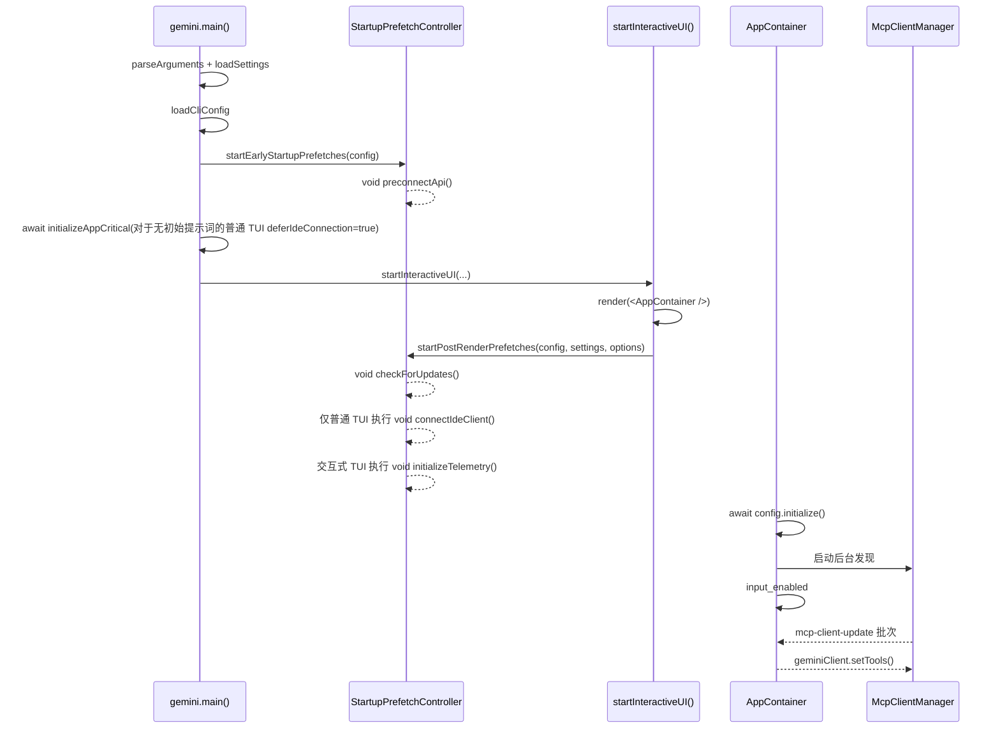

# 启动预取即发即弃优化设计

## 背景与目标

父 issue #3011 将 qwen-code 的启动优化拆分为多个子任务。当前仓库已经落地了多项基础能力：

- #3219：集成了启动性能分析器，支持通过 `QWEN_CODE_PROFILE_STARTUP=1` 输出启动阶段的 JSON。
- #3221：工具注册已转换为延迟工厂（lazy factory）；`Config.initialize()` 不再静态实例化所有工具。
- #3223：API 预连接（preconnect）已存在，目前在 `loadCliConfig()` 之后以即发即弃的方式触发。
- 早期输入捕获、渐进式 MCP 发现以及 AppContainer 渲染后的 `config.initialize()` 也已部分实现。

#3222 的目标不是重做这些能力，而是将仍然分散在启动路径中的非关键启动操作整合到一个统一的即发即弃预取层中：在首次渲染（first paint）前，仅等待真正影响正确性的操作；在首次渲染后，启动不影响首次交互正确性的后台任务，同时为非交互模式保留兼容的语义。

## 当前启动流程

当前交互式启动路径的关键流程如下：



当前状态评估：

- `initializeApp()` 在首次渲染前仍然串行执行 i18n、鉴权（auth）、主题验证和 IDE 客户端连接。
- 鉴权和 i18n 必须保留在首次渲染前；对于没有初始提示词的普通 TUI，IDE 连接不是首次渲染的硬性依赖，可以在普通 TUI 路径上延迟。然而，对于 `qwen -i "prompt"`、`qwen -p`、stream-json 和 ACP/Zed 等路径——它们没有安全的渲染后窗口，或者首次请求需要 IDE 上下文/状态——IDE 连接必须继续在首次请求前等待。
- `checkForUpdates()` 在 `startInteractiveUI()` 中已经是渲染后的即发即弃操作，但逻辑分散在 UI 启动函数中。
- `preconnectApi()` 已经是即发即弃的，应保持尽早触发，但需纳入统一调度。
- 遥测 SDK 初始化以前在 `Config` 构造期间同步发生；对于普通交互式 TUI，可以延迟到渲染后，而非交互路径保留首次请求前的初始化语义。
- 在交互路径上，`config.initialize()` 已经在 React 挂载后执行；MCP 发现已经在 core 内部后台运行，AppContainer 批量刷新工具列表。
- 非交互路径仍然需要等待 `config.waitForMcpReady()`，否则首次提示词可能看不到 MCP 工具，导致脚本行为回退。

## 目标架构

引入一个轻量级的启动预取调度层，统一管理“启动但不等待”的任务，按触发时机分为两类：早期（early）和渲染后（post-render）。



新设计下的交互式启动时序：



## 设计变更

### 1. 新的统一启动预取调度器

新增 `packages/cli/src/startup/startup-prefetch.ts`，提供两个入口：

```ts
startEarlyStartupPrefetches(config: Config): void;
startPostRenderPrefetches(
  config: Config,
  settings: LoadedSettings,
  options?: { connectIde?: boolean; initializeTelemetry?: boolean },
): void;
```

该调度器仅做三件事：

- 按名称启动预取任务。
- 使用 `void task().catch(...)` 显式不等待且不抛出异常。
- 记录调试日志和分析器异步事件，以验证任务是在渲染前还是渲染后启动的。

调度器必须保证每个阶段的幂等性，防止 React StrictMode、重复的测试调用或异常的重入导致同一任务被多次启动。

### 2. 早期预取：最大化提前量

`startEarlyStartupPrefetches(config)` 在 `loadCliConfig()` 成功后立即调用。

第一阶段仅包含 API 预连接：

- 从 `config.getModelsConfig()` 读取当前鉴权类型和解析后的 base URL。
- 从 `config.getProxy()` 读取代理。
- 调用现有的 `preconnectApi(authType, { resolvedBaseUrl, proxy })`。
- 保留现有的环境门控：`QWEN_CODE_DISABLE_PRECONNECT`、沙箱、自定义 CA、非 Node 运行时、无代理等。

这不会增加新的配置选项。预连接失败仅写入调试日志，不影响启动。

### 3. 渲染后预取：首次渲染后启动

在 Ink `render()` 返回并记录 `first_paint` 后，在 `startInteractiveUI()` 中调用 `startPostRenderPrefetches(config, settings)`。

第一批包括：

- 更新检查：迁移现有的 `checkForUpdates().then(handleAutoUpdate)` 逻辑，保留 `settings.merged.general?.enableAutoUpdate !== false` 门控。
- IDE 客户端连接：仅在没有初始提示词的普通交互式 TUI 路径上移至渲染后预取。调用方必须显式传递 `connectIde: true`，调度器内部仍会检查 `config.getIdeMode()`。`qwen -i "prompt"`、非交互、stream-json 和 ACP/Zed 不通过此入口延迟 IDE 连接。
- 遥测 SDK 初始化：仅在交互式 TUI 路径上移至渲染后预取。`Config` 仍保留遥测设置，但通过 `deferTelemetryInitialization` 跳过构造时的 SDK 副作用；渲染后预取通过 `initializeTelemetry(config)` 启动 SDK。非交互、stream-json 和 ACP/Zed 不延迟。
- 后台维护：可以从 `gemini.tsx` 迁移到渲染后预取，为所有后台启动任务提供统一入口；仍限于交互模式，仍使用动态导入和错误吞没（error swallowing）。

这些任务均不得影响 `startInteractiveUI()` 的返回值，也不得将用户可见的错误写入 TUI stderr。失败仅记录到调试日志。

### 4. 拆分 `initializeApp()` 关键路径，保留非 TUI 的等待 IDE 连接

添加一个共享辅助函数，以避免在 TUI 延迟路径和非 TUI 等待路径之间重复 IDE 连接逻辑：

```ts
export async function connectIdeForStartup(config: Config): Promise<void> {
  if (!config.getIdeMode()) return;

  const ideClient = await IdeClient.getInstance();
  await ideClient.connect();
  logIdeConnection(config, new IdeConnectionEvent(IdeConnectionType.START));
}
```

`initializeApp()` 仍作为首次渲染前的关键初始化，但增加了一个显式选项：

```ts
interface InitializeAppOptions {
  deferIdeConnection?: boolean;
}
```

默认值必须保持向后兼容：`deferIdeConnection` 默认为 `false`。也就是说，当不传递选项时，IDE 连接仍在 `initializeApp()` 中等待。

`initializeApp()` 中等待的内容变为：

- `initializeI18n(...)`
- `performInitialAuth(...)`
- `validateTheme(settings)`
- 当 `deferIdeConnection !== true` 时，`await connectIdeForStartup(config)`
- 计算 `shouldOpenAuthDialog`
- 读取 `config.getGeminiMdFileCount()`

`gemini.tsx` 中的调用点负责根据运行模式进行选择：

```ts
const deferIdeConnections =
  config.isInteractive() && !config.getExperimentalZedIntegration() && !input;

const initializationResult = await initializeApp(config, settings, {
  deferIdeConnection,
});
```

随后，仅当 `deferIdeConnection === true` 时，`startInteractiveUI()` 通过 `startPostRenderPrefetches(..., { connectIde: true })` 即发即弃地执行 IDE 连接；自动提交首个问题的提示词交互模式（prompt-interactive）继续在渲染前等待 IDE，并传递 `connectIde: false` 以避免渲染后重复连接。

这种拆分解决了 review 中指出的兼容性风险：

- 普通交互式 TUI：IDE socket/IPC 连接不再阻塞首次渲染。
- `qwen -i "prompt"`：继续在首次自动提交的请求前等待 IDE 连接，渲染后不重新连接。
- `qwen -p` / 管道 stdin：继续在首次模型请求前等待 IDE 连接。
- stream-json：继续在处理会话/控制请求前完成 IDE 连接。
- ACP/Zed：继续保留等待 IDE 启动，避免首次请求时丢失 IDE 上下文/状态。

### 5. MCP 与非交互语义保持不变

此设计不改变核心 MCP 状态机。

交互模式：

- 继续在 `AppContainer` 的挂载 effect 中调用 `config.initialize()`。
- `Config.initialize()` 继续启动后台 MCP 发现。
- AppContainer 继续监听 `mcp-client-update` 并以约 16ms 的间隔批量调用 `geminiClient.setTools()`。
- 首次渲染和输入可用性不等待 MCP 完全就绪。

非交互 / stream-json / ACP：

- 继续在首次模型请求前等待 IDE 连接。
- 继续在首次模型请求前等待 `config.waitForMcpReady()`。
- 保留旧同步路径的工具可见性语义。
- 保留 MCP 失败时 stderr 警告的现有行为。

## 预估性能收益

收益分为两类。

第一类是缩短了首次渲染前的关键路径：

- 普通交互式 TUI 的 IDE 客户端连接不再阻塞首次渲染；收益取决于 IDE socket/IPC 连接时间，预计为数十到数百毫秒。
- 普通交互式 TUI 的遥测 SDK 初始化不再阻塞首次渲染；收益取决于 OTel SDK/exporter 的构建成本，通常为小到中等的同步启动开销。
- 更新检查、后台维护、预连接及类似任务拥有了统一的即发即弃入口，防止未来的维护工作中意外将它们重新放回等待路径。
其次是首次 API 请求的收益：

- 继续保留 #3223 的 API 预连接设计。
- 当代理/共享分发器可复用时，首次 API 请求可避免 TCP+TLS 握手开销，预计节省 100-200ms。

注意：#3219 的历史基线显示，模块加载曾占总启动时间的 ~94%；#3221 的延迟工具注册（lazy tool registration）已解决了最大的瓶颈。#3222 的核心收益更多在于改善感知 TTI（Time to Interactive）和首屏渲染响应速度，而非消除所有模块加载开销。

## 风险与影响范围

### 风险

- 纯 TUI 下的 IDE 能力可能会从“首屏渲染前连接”转变为“首屏渲染后极短时间内连接”。缓解措施：仅在纯交互式 TUI 路径上延迟；非交互式、stream-json 以及 ACP/Zed 仍保持在首次请求前等待连接完成。
- 当 SDK 尚未初始化时，预渲染的遥测事件可能会被作为 no-op 丢弃。缓解措施：仅对交互式 TUI 进行延迟；非交互式的首次请求前遥测保留原有语义，不新增缓冲队列。
- 延迟任务的失败可能不明显。缓解措施：统一包装器记录 debug 日志和 profiler 异步事件。
- 迁移 update/preconnect 时可能会无意中改变现有的门控条件。缓解措施：原样保留现有的 settings/env 条件。
- 过度延迟可能导致在首次用户输入依赖这些能力时，它们尚未就绪。缓解措施：auth、config 构建、permissions、hooks、memory、tool registry 以及非交互式的 MCP ready 均保持等待完成。

### 影响范围

预计仅涉及 CLI 启动层：

- `packages/cli/src/startup/startup-prefetch.ts`
- `packages/cli/src/core/initializer.ts`
- `packages/cli/src/gemini.tsx`
- `packages/cli/src/ui/startInteractiveUI.tsx`
- 对应的单元测试

不涉及以下内容的更改：

- CLI 参数和配置 schema
- 核心 tool registry 协议
- MCP 发现状态机
- 模型请求协议
- 用户可见的命令行为

## 单元测试计划

### `packages/cli/src/startup/startup-prefetch.test.ts`

覆盖范围：

- `startEarlyStartupPrefetches()` 使用 auth type、解析后的 base URL 和 proxy 调用 `preconnectApi()`。
- 早期预取不等待任务完成。
- 重复调用是幂等的，不会再次启动相同的早期任务。
- 当 `enableAutoUpdate !== false` 时，`startPostRenderPrefetches()` 启动更新检查。
- 当 `enableAutoUpdate === false` 时，不启动更新检查。
- 当 `options.connectIde === true` 且 `config.getIdeMode() === true` 时，启动 IDE 连接并调用 `logIdeConnection()`。
- 当 `options.connectIde !== true` 时，不触发 IDE 连接。
- 即使 `options.connectIde === true`，当 `config.getIdeMode() === false` 时也不触发 IDE 连接。
- 当 `options.initializeTelemetry === true` 时，启动 telemetry SDK 初始化。
- 当 `options.initializeTelemetry !== true` 时，不触发 telemetry SDK 初始化。
- 延迟任务的 rejection 不会导致公开 API 抛出异常，仅写入 debug 日志。

### `packages/cli/src/core/initializer.test.ts`

调整与新增：

- `initializeApp()` 默认等待 `connectIdeForStartup()`，保留非 TUI 路径的兼容性。
- `initializeApp(..., { deferIdeConnection: true })` 不调用 `IdeClient.getInstance()` 或 `connect()`。
- 当 `config.getIdeMode() === true` 时，`initializeApp(..., { deferIdeConnection: false })` 调用并等待 IDE 连接。
- 仍然等待 `initializeI18n()`。
- 仍然等待 `performInitialAuth()`。
- 认证失败时，保留 `authError` 且 `shouldOpenAuthDialog === true`。
- 主题验证失败时，保留 `themeError`。
- 当显式提供 auth type 且认证成功时，`shouldOpenAuthDialog === false`。

### `packages/cli/src/ui/startInteractiveUI.test.tsx`

覆盖范围：

- 在 Ink `render()` 返回并记录 `first_paint` 后，调用 `startPostRenderPrefetches(config, settings)`。
- 纯 TUI 路径传递 `{ connectIde: true, initializeTelemetry: true }`。
- 当 prompt-interactive 在渲染前已等待 IDE 时，传递 `{ connectIde: false, initializeTelemetry: true }` 以避免重复的 IDE 连接。
- 非 TUI 路径不通过 `startInteractiveUI()` 触发 IDE/telemetry 的渲染后预取。
- 渲染后预取的 rejection 不会导致 `startInteractiveUI()` reject。
- 将更新检查移出 `startInteractiveUI()` 的内联逻辑后，不再直接调用它。

### `packages/cli/src/gemini.test.tsx`

调整与新增：

- 纯交互式 TUI 调用 `initializeApp(config, settings, { deferIdeConnection: true })`，并在渲染后预取中连接 IDE。
- Prompt-interactive 调用 `initializeApp(config, settings, { deferIdeConnection: false })`，且渲染后预取不重新连接 IDE。
- `qwen -p` / piped stdin / stream-json 调用 `initializeApp(config, settings, { deferIdeConnection: false })` 或使用默认值，确保在首次请求前 IDE 已连接。
- ACP/Zed 路径不启用 IDE 延迟预取，继续通过等待 IDE 启动。

### `packages/core/src/config/config.test.ts`

覆盖范围：

- 当启用 telemetry 且未传递 `deferTelemetryInitialization` 时，`Config` 构造仍调用 `initializeTelemetry(config)`。
- 当启用 telemetry 且 `deferTelemetryInitialization === true` 时，`Config` 构造不调用 `initializeTelemetry(config)`，但 `config.getTelemetryEnabled()` 仍返回 true。

### 回归测试

建议执行以下命令：

```bash
cd packages/cli && npx vitest run src/core/initializer.test.ts src/startup/startup-prefetch.test.ts
cd packages/cli && npx vitest run src/gemini.test.tsx
cd packages/core && npx vitest run src/config/config.test.ts -t "telemetry"
```

## 验收标准

- 交互式 REPL 首屏渲染不等待 IDE 连接、telemetry 初始化、更新检查或日常维护（housekeeping）。
- 非交互式、stream-json 以及 ACP/Zed 仍在首次请求前等待 IDE 连接。
- 非交互式、stream-json 以及 ACP/Zed 不延迟 telemetry SDK 初始化。
- API 预连接仍在 `loadCliConfig()` 之后尽早以 fire-and-forget 方式触发。
- Auth、config、permissions、hooks、memory 及其他对正确性至关重要的初始化在需要的地方仍保持等待。
- 非交互式首次 prompt 仍等待 MCP ready。
- 所有延迟任务的失败均不影响 REPL 渲染。
- Profiler 显示延迟任务在 `first_paint` 附近按预期启动。
- 单元测试覆盖关键路径、幂等性、错误吞没以及非交互式兼容性约束。

## 默认假设

- #3221 实际上是 GitHub 上的一个 issue，而非 PR；当前仓库已包含延迟工具注册（lazy tool registry）的实现。
- 本设计不新增配置选项，避免将启动优化变为用户可配置的复杂性。
- “REPL 在延迟操作完成前渲染”是指 Ink 首屏渲染返回且输入可用，不要求所有后台能力在用户看到 UI 前全部完成。
- 非交互模式优先考虑兼容性，不像交互模式那样激进地追求首屏渲染优化。