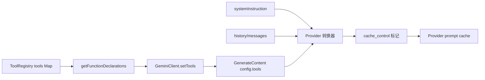
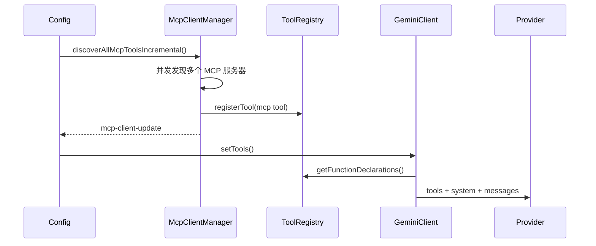

# 全局 Tool Schema 稳定排序设计

## 背景

Qwen Code 已在 Anthropic 和 DashScope 的请求转换层支持 `cache_control`。当 provider 支持 prompt caching 时，稳定的请求前缀可以被缓存和复用，从而降低重复的 input-token 成本并减少首字延迟 (TTFT)。

目前的主前缀包含三个部分：

1. Tools schema：由 `ToolRegistry.getFunctionDeclarations()` 生成的 tool 声明。
2. System instruction：主会话的 system prompt。
3. Messages/history：启动前导信息、用户消息、tool 结果及相关上下文。

Tools schema 通常很大，并且出现在 provider 缓存前缀的靠前位置。如果 tools 数组的序列化字节发生变化，后续的 system 和 messages 前缀也会失去复用机会。

目前 `GeminiClient.setTools()` 直接使用 `ToolRegistry.getFunctionDeclarations()` 的返回值，而 `getFunctionDeclarations()` 按照 `Map` 的插入顺序遍历 tools。内置 tool 的注册顺序通常是稳定的，但渐进式 MCP 发现、ToolSearch 揭示、MCP 重连以及外部 tool 注册都可能导致相同的 tool 集合以不同的顺序被序列化。这会导致不必要的 prompt cache miss。

## 目标

为 tool schemas 实现全局稳定排序：发送到模型请求的 `functionDeclarations` 对于相同的 tool 集合必须具有稳定的顺序，与注册完成顺序无关。

本设计仅解决 tool 集合相同但顺序不同导致的 cache miss。添加 tool、移除 tool 或更改 schema 内容仍会改变前缀；这些属于合理的 cache miss。

本设计不包括：

- System prompt 分块化。
- 会话级别的 tool schema 快照/缓存。
- 完整的 prompt cache 中断检测实现。
- Provider `cache_control` 策略更改。

## 当前流程



渐进式 MCP 发现是顺序变动最常见的来源：



如果两个 MCP 服务器最终都可用，但稳定下来的顺序不同，当前的 tools 块可能会有所不同：

```text
Run 1:
[
  read_file,
  shell,
  mcp__filesystem__read_tree,
  mcp__github__search_issues
]

Run 2:
[
  read_file,
  shell,
  mcp__github__search_issues,
  mcp__filesystem__read_tree
]
```

从模型能力的角度来看，两次运行暴露了相同的 tool 集合。从 prompt cache 的角度来看，它们是不同的 tools 前缀。

排序后，相同的集合会稳定为：

```text
[
  mcp__filesystem__read_tree,
  mcp__github__search_issues,
  read_file,
  shell
]
```

## Prompt Cache 的作用与命中/未命中差异

Prompt cache 允许 provider 为稳定的前缀复用 KV/cache 计算。对于较长的 tool 列表、较长的 system prompts 和较长的 history 前缀，cache hit 通常有两个好处：

- 降低 input-token 成本：缓存的前缀进入 cache-read 计费路径。
- 降低 TTFT：provider 无需重新处理完整的前缀。

命中前：

```text
request bytes changed
-> tools/system/messages prefix cannot be reused
-> cache_read_input_tokens is low or 0
-> the full prefix is counted again as input/cache creation
-> TTFT is higher
```

命中后：

```text
stable prefix bytes unchanged
-> tools/system/messages prefix is reused from provider cache
-> cache_read_input_tokens increases
-> only the new tail content is counted as input/cache creation
-> TTFT is lower
```

本设计通过稳定 tools 数组顺序来提高命中率，特别是针对渐进式 MCP 发现和 ToolSearch 揭示引起的注册顺序变动。

## 设计

排序应放在 `ToolRegistry.getFunctionDeclarations()` 中，因为它是当前 API tool 声明的唯一生成点。不要在 provider 转换器中排序，因为其他声明读取者仍会看到不稳定的顺序。不要仅在 `GeminiClient.setTools()` 中排序，因为 diagnostics、context 估算和测试仍可能观察到未排序的声明。

排序规则：

1. 首先应用现有的过滤逻辑：
   - 默认情况下，排除满足 `shouldDefer && !alwaysLoad && !revealedDeferred` 的 tools。
   - `{ includeDeferred: true }` 包含 deferred tools。
   - `alwaysLoad` tools 始终可见。
2. 对过滤后的 tool 实例进行排序。
3. 使用 `tool.schema.name ?? tool.name` 作为主排序键。
4. 使用 `tool.displayName` 作为次要排序键。
5. 返回排序后的 `tool.schema` 值。

伪代码：

```ts
getFunctionDeclarations(options?: { includeDeferred?: boolean }) {
  const includeDeferred = options?.includeDeferred === true;
  return Array.from(this.tools.values())
    .filter((tool) => {
      if (
        !includeDeferred &&
        tool.shouldDefer &&
        !tool.alwaysLoad &&
        !this.revealedDeferred.has(tool.name)
      ) {
        return false;
      }
      return true;
    })
    .sort(compareToolsByDeclarationName)
    .map((tool) => tool.schema);
}
```

保持比较函数局部且简单。不要添加配置：

```ts
function compareToolsByDeclarationName(
  a: AnyDeclarativeTool,
  b: AnyDeclarativeTool,
) {
  const aName = a.schema.name ?? a.name;
  const bName = b.schema.name ?? b.name;
  const byName = aName.localeCompare(bName);
  if (byName !== 0) return byName;
  return a.displayName.localeCompare(b.displayName);
}
```

不要将注册顺序保留为隐式排名。Tool 顺序不应表达模型偏好；模型应基于名称、描述、schema 和上下文来选择 tools。

## 测试计划

在 `packages/core/src/tools/tool-registry.test.ts` 中添加或更新测试。

### 1. 按规范名称对常规 tools 排序

注册顺序：

```text
zeta, alpha, middle
```

断言：

```text
getFunctionDeclarations().map(name) === [alpha, middle, zeta]
```

### 2. 在排序前过滤 deferred tools

注册：

```text
visible-z
hidden-a (shouldDefer)
visible-a
```

默认断言：

```text
[visible-a, visible-z]
```

### 3. includeDeferred 包含所有 tools 并对其进行排序

使用与上面相同的 tools 并调用：

```ts
getFunctionDeclarations({ includeDeferred: true });
```

断言：

```text
[hidden-a, visible-a, visible-z]
```

### 4. 已揭示的 deferred tools 出现在其排序位置

注册：

```text
visible-m
hidden-a (shouldDefer)
visible-z
```

执行：

```ts
toolRegistry.revealDeferredTool('hidden-a');
```

断言：

```text
[hidden-a, visible-m, visible-z]
```

### 5. alwaysLoad deferred tools 保持可见并排序

注册：

```text
z (shouldDefer, alwaysLoad)
a
```

默认断言：

```text
[a, z]
```

### 6. MCP tool 注册顺序不同但输出匹配

创建两个 `ToolRegistry` 实例：

```text
registryA registration order:
  mcp__github__search_issues
  mcp__filesystem__read_tree

registryB registration order:
  mcp__filesystem__read_tree
  mcp__github__search_issues
```

断言：

```text
registryA.getFunctionDeclarations().map(name)
  === registryB.getFunctionDeclarations().map(name)
```

### 7. 更新旧断言

依赖于注册顺序的现有测试应更新为依赖于排序后的顺序。例如，仅断言 `['visible']` 的 deferred 过滤测试可以保持不变；如果将来它注册了多个可见的 tools，则应断言排序后的数组。

推荐的验证命令：

```bash
cd packages/core && npx vitest run src/tools/tool-registry.test.ts
cd packages/core && npx vitest run src/tools/tool-search.test.ts
cd packages/core && npx vitest run src/core/client.test.ts
npm run build && npm run typecheck
```

## 风险与约束

- 更改 tool 顺序可能会影响模型的隐式选择偏好。这种风险是可以接受的，因为 tool 顺序不应是产品语义；稳定的缓存前缀具有更高的优先级。
- 本设计不能防止由新增 tools 引起的 cache miss。新的 MCP 服务器 tools、tool schema 内容更改以及 ToolSearch 揭示新 tools 仍会合理地更改 tools 块。
- 如果未来 provider 需要保留 tool 注册语义，则应在 provider 层进行处理。当前代码没有此类要求。

## 下一步：Prompt Cache 中断检测

全局排序落地后，下一步应该是轻量级的 prompt cache 中断检测，以验证排序的收益并定位剩余的 cache miss。

分两个阶段实现：

1. 在每次请求前记录快照：
   - model。
   - system instruction 哈希。
   - functionDeclaration 名称和 schema 哈希。
   - cache control 启用/作用域。
2. 在每次响应后读取使用情况：
   - `cache_read_input_tokens`。
   - `cache_creation_input_tokens`。
   - 来自 OpenAI/DashScope/Gemini 的兼容 cached-token 元数据。

当 cache read 相比上一轮显著下降时，发出 debug 日志或 telemetry 事件：

```text
prompt_cache_break:
  reason: tools_order_changed | tools_schema_changed | system_changed |
          cache_control_changed | model_changed | likely_provider_ttl_or_eviction
  previousCacheReadTokens
  currentCacheReadTokens
  changedToolNames
```

第一个版本应仅进行观察，绝不能更改请求行为。其目标是回答两个问题：

1. 全局 tool 排序是否减少了 tools 顺序导致的 cache miss？
2. 剩余的 cache miss 是否主要来自 system text、tool schema 内容、`cache_control` 或 provider TTL/eviction？