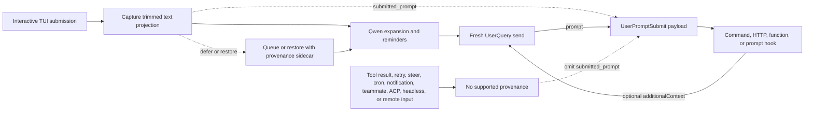

# `UserPromptSubmit` 的已提交 Prompt Provenance

## 摘要

`UserPromptSubmit.prompt` 是当前模型调用的 prompt。它可能包含 Qwen 生成的
提醒、展开的文件和资源、斜杠命令输出、扩展输出，或较早的 hook 添加的上下
文。因此它无法可靠地回答另一个问题：什么文本投影跨越了受支持的交互式输
入边界？

本改动添加一个可选的 `submitted_prompt` 字段：

```ts
interface UserPromptSubmitInput {
  prompt: string;
  submitted_prompt?: string;
}
```

仅当 Qwen 能把 provenance 从受支持的交互式 TUI 提交携带到一个全新的
`UserQuery` 时，才会填充该字段。需要用户提交文本的消费者必须把字段缺失
视为不可用，并且不得回退到 `prompt`。

本改动不改变 `UserPromptSubmit` 的触发时机、现有的 `prompt` 值、hook 顺
序或阻塞行为，以及 `additionalContext` 行为。

## 目标与非目标

目标：

- 在 Qwen 展开之前保留通过受支持的交互式 TUI 提交的文本。
- 让该文本穿越延迟提交和恢复提交，而不与错误的模型请求关联。
- 在不破坏接受前向兼容 JSON 的消费者的前提下添加该字段。
- 明确所有数据接收方和信任边界。

非目标：

- 改变 `UserPromptSubmit` 的触发语义。
- 从发往模型的内容推断原始 prompt。
- 在本改动中支持 ACP、headless、远程、SDK 或其他输入生产者。
- 提供认证、租户身份、DLP 或不可变的安全标签。
- 实现外部上下文召回。

## 数据流



队列在渲染上保持面向文本。provenance 通过内部 sidecar 关联，并且只在排
队的文本变成全新轮次时才被消费。任何模糊的变换、部分批次或被编辑的恢复
都会通过省略 `submitted_prompt` 来 fail closed（失败即拒绝）。

大粘贴占位符在 `submitted_prompt` 中保持紧凑；其完整内容只会展开到发往
模型的 `prompt` 中。这保留了 TUI 投影，并避免在每个 hook 载荷中复制数
兆字节的粘贴内容。

当并发的 `/btw` 旁路问题运行时，取消恢复保留对主轮次的所有权。由于该旁
路问题可能把更新的用户条目写入磁盘历史，只有当主轮次仍然独占最新记录的
条目时，取消才会移除它。这种耦合使恢复的 provenance sidecar 与持久历史
保持一致，而不是恢复一个轮次的同时删除另一个。

## 资格

| 路径                                                                               | `prompt`                   | `submitted_prompt`                               | 规则                                            |
| ---------------------------------------------------------------------------------- | -------------------------- | ------------------------------------------------ | ----------------------------------------------- |
| 作为 `UserQuery` 发送的全新交互式 TUI 提交                                         | 现有的模型绑定值           | 存在                                             | 在展开之前捕获修剪后的投影                      |
| 稍后变成全新轮次的延迟 TUI 提交                                                    | 现有的模型绑定值           | 仅在 provenance 完整时存在                       | 排队期间保留 sidecar                            |
| 精确取消或队列恢复后重新提交                                                       | 现有的模型绑定值           | 仅在恢复的文本未变时存在                         | 仅对精确恢复复用 sidecar                        |
| 被编辑或部分已知的恢复输入                                                         | 现有的模型绑定值           | 缺失                                             | 不猜测 provenance                               |
| prompt、命令或 shell 历史导航，或选中的搜索匹配                                    | 现有的模型绑定值           | 缺失                                             | 历史可能包含生成的展开内容                      |
| 从跨重启暂存处恢复的 prompt                                                        | 现有的模型绑定值           | 缺失                                             | 暂存处存储的文本没有 provenance                 |
| 由会话 rewind 恢复的 prompt                                                        | 现有的模型绑定值           | 缺失                                             | rewind 历史只存储模型绑定文本                   |
| 同轮次的 steer 输入                                                                | 现有行为                   | 缺失                                             | steer 不是全新的受支持提交                      |
| 工具结果或 hook 续接                                                               | 现有行为                   | 缺失                                             | 保留传统续接行为                                |
| 重试、cron、通知或 teammate 流量                                                   | 现有行为                   | 缺失                                             | 保留现有触发行为                                |
| 配置的 `--prompt-interactive` 初始 prompt                                          | 现有的模型绑定值           | 缺失                                             | 它没有跨越交互式输入边界                        |
| Vim 模式启用时存在的非空输入（包括 Vim 被禁用之后）                                | 现有的模型绑定值           | 缺失                                             | Vim 寄存器不携带 provenance                     |
| ACP、headless、`serve`、SDK、远程输入或被接受的 speculation 输入                   | 现有行为                   | 缺失                                             | 本改动不添加任何生产者                          |

当被恢复的或 provenance 不可用的模型绑定输入被清除或提交时，TUI 会在之后
的输入可能获得资格之前丢弃其文本缓冲区的撤销和重做历史。这可以防止撤销
在其 provenance 标记或 sidecar 已被消费之后恢复模型绑定文本。

Vim 启用期间存在的任何非空输入，在 Vim 被禁用之后仍然不具备资格，直到组
件被清除。这条保守的规则也覆盖在启用 Vim 之前输入的草稿。Vim 寄存器可以
在缓冲区清除之后保留模型绑定文本，因此切换模式无法为已有内容恢复
provenance。

该表只定义 provenance。现有的事件触发保持不变，包括不触发
`UserPromptSubmit` 的路径。

## 不变量

1. Core 只为携带来自受支持生产者的非空字符串的全新 `UserQuery` 序列化
   `submitted_prompt`。
2. 该值按 Core 收到的原样保留；Core 不会修剪、重构它，也不会从 `prompt`
   推导它。
3. 顺序的 `additionalContext` 更新可以扩展 `prompt`，但不会改写
   `submitted_prompt`。
4. 递归和机器驱动的发送会清除 provenance。
5. 只有当批次中包含的每一项都有兼容的 provenance 时，排队批次才会被归因。
   否则批次省略该字段。
6. 恢复的 sidecar 是一次性的，只适用于精确的重新提交。
7. provenance 缺失是正常状态，不是错误。

## 兼容性与迁移

hook 的 JSON 契约是前向可扩展的。解码器应忽略未知字段。有意拒绝未知字
段的消费者，例如带 `additionalProperties: false` 的 JSON Schema，必须在
升级之前显式允许可选的 `submitted_prompt` 属性。对于安全敏感的 hook，严
格解码器的失败可能改变一次调用是 fail-open 还是 fail closed，因此管理员
必须在推广之前用已部署的 hook 测试升级后的载荷。

只读取 `prompt` 的现有消费者保留其当前行为。对来源敏感的消费者应读取
`submitted_prompt`，并在其缺失时跳过、询问用户，或应用有文档记录的兜底
策略。静默地把 `prompt` 当作用户原始文本不是安全的兜底。

## 信任与数据边界

`submitted_prompt` 是调用方提供的 provenance。它不是经过认证的身份、授
权决策、仓库绑定或 DLP 结果。它从本地 Qwen 进程和受支持的 TUI 生产者继
承信任；它不建立新的信任边界。特别是，function hook 接收一个进程内对象，
必须被视为受信任的代码；本设计不声称对这样的 hook 具有运行时不可变性。

所有已配置的 hook 执行器都会收到事件载荷：

| hook 类型 | 接收方                                                  |
| --------- | ------------------------------------------------------- |
| Command   | 通过标准输入的子进程                                    |
| HTTP      | 通过 POST 正文的配置端点                                |
| Function  | 受信任的进程内回调                                      |
| Prompt    | `$ARGUMENTS` 替换之后配置的模型提供商                   |

操作员必须把 `prompt` 和 `submitted_prompt` 都视为潜在敏感数据。prompt
hook 会把载荷发送给模型提供商。基于文件的 debug 日志会记录完整展开的
prompt-hook 请求，因此其保留期和访问控制必须与提交的数据相匹配。hook 也
可能把其输入复制到自己的输出、错误、日志或下游系统中；这些目的地不在本
字段的保证范围内。

当两个字段都存在时，prompt-hook 载荷包含重叠的文本，可能消耗额外的模型
输入 token。本契约不提供按 hook 的字段抑制。

hook 调用遥测目前导出 hook 元数据而不是完整输入，但该实现细节不是隐私
边界，消费者不应依赖它。

## 为什么这与 Claude Code 不同

Claude Code 在其用户提交边界处运行 `UserPromptSubmit`，即控制进入模型
查询循环之前。工具结果递归不会跨越该边界，因此其现有的 `prompt` 天然代
表已提交的输入。

Qwen Code 在更靠近其共享的模型发送管线的地方运行该 hook，并在更多发送
路径上保留传统行为。移动该事件将是一个更大范围的、破坏性的语义变更。
一个增量式的 provenance 字段为受支持的 TUI 调用者提供了缺失的边界信号，
同时保留现有集成。

## 验证

单元测试覆盖 Core 序列化门控、hook 链接、TUI 捕获、大粘贴投影、延迟队
列、精确和被编辑的恢复、provenance 清除，以及不完整的批次。交互式 E2E
覆盖捕获真实的命令 hook 载荷，并确认展开可以改变 `prompt` 而不改变
`submitted_prompt`，以及工具结果续接会省略该字段。
