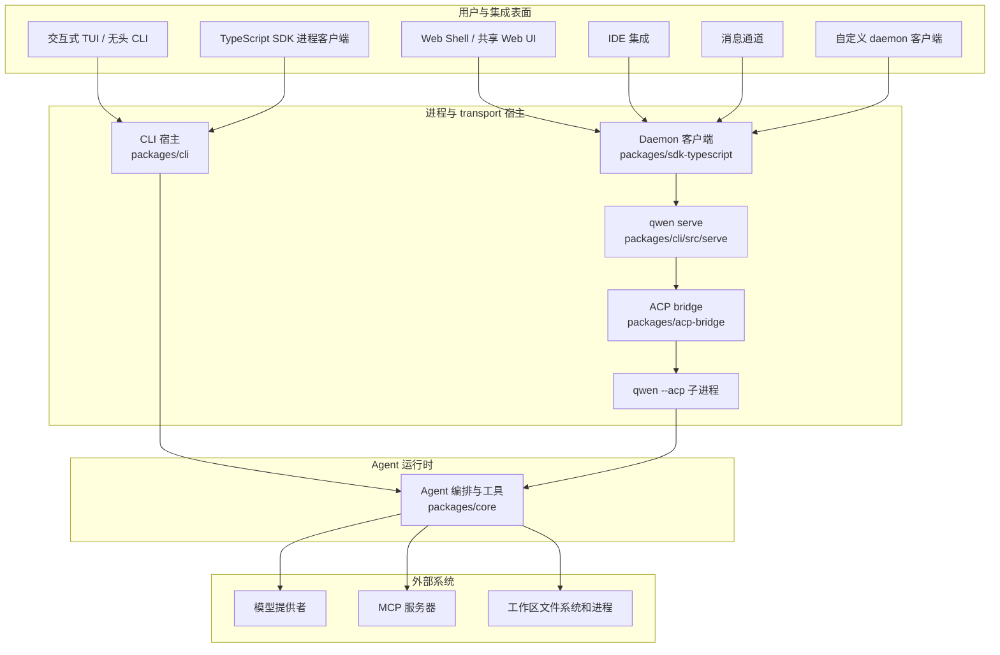

# Qwen Code 架构概览

Qwen Code 是一个 monorepo，支持交互式终端、无头模式和编程式执行、Agent Client Protocol (ACP)、长期运行的 HTTP daemon、Web 和 IDE 客户端，以及消息通道适配器。本文档将这些表面映射到实现它们的包，并解释主要的运行时边界。

有关 daemon 内部机制的详细信息，请从 [daemon 文档](./daemon/00-index.md) 开始。有关 HTTP 请求和事件结构，请参见 [`qwen serve` 协议参考](./qwen-serve-protocol.md)。

## 系统概览

Qwen Code 有两种 agent 执行模型：

- **直接执行：** 交互式 TUI 和无头 CLI 直接构建并运行 agent 运行时。
- **ACP 执行：** `qwen --acp` 将 agent 托管在 ACP transport 之后。它可以直接由 ACP 客户端驱动，也可以由 `qwen serve` 通过共享的 ACP bridge 驱动。

`qwen serve` 在 ACP 执行之上添加了 HTTP + Server-Sent Events (SSE) 控制平面，使多个客户端能够使用长期存在的、工作区作用域的运行时。

该图展示了主要的生产路径。部分适配器也有独立模式：例如，`qwen channel start` 使用 ACP bridge 而无需 HTTP daemon。有关这些变体，请参见 [channel 插件指南](./channel-plugins.md#运行时模式)。

## 仓库布局

| 路径                                                                                                       | 职责                                                                                                                                                                                   |
| ---------------------------------------------------------------------------------------------------------- | ------------------------------------------------------------------------------------------------------------------------------------------------------------------------------------------------ |
| `packages/cli`                                                                                             | `qwen` 可执行文件、参数解析、配置组装、Ink TUI、无头输出、ACP 入口点、`qwen serve` 以及命令特定的适配器。                                         |
| `packages/core`                                                                                            | 与 UI 无关的 agent 编排、模型提供者集成、提示词和上下文构建、工具注册和执行、权限、会话、内存、遥测以及共享服务。 |
| `packages/acp-bridge`                                                                                      | ACP channel 生命周期、会话多路复用、事件传递、权限仲裁、进程生成，以及 daemon 和适配器宿主共享的文件系统接缝。                                 |
| `packages/sdk-typescript`                                                                                  | 通过 `query()` 进行编程式进程执行，以及面向 `qwen serve` 的 HTTP/SSE 客户端和 transcript 投影。                                                                               |
| `packages/webui`                                                                                           | 共享 React 组件以及基于 TypeScript SDK 构建的 daemon React 适配器。                                                                                                                |
| `packages/web-shell`                                                                                       | 基于 `packages/webui` 和 daemon SDK 构建的终端风格浏览器 UI。                                                                                                                      |
| `packages/web-templates`                                                                                   | 打包为可嵌入 JavaScript 和 CSS 字符串的 Web 模板。                                                                                                                                 |
| `packages/audio-capture`                                                                                   | 用于语音输入的本地麦克风捕获。                                                                                                                                                       |
| `packages/channels`                                                                                        | 消息服务的共享 channel 运行时和平台适配器。                                                                                                                         |
| `packages/desktop`、`packages/vscode-ide-companion`、`packages/chrome-extension`、`packages/zed-extension` | 将 Qwen Code 适配到其宿主环境的产品和编辑器表面。                                                                                                                     |
| `packages/sdk-java`、`packages/sdk-python`                                                                 | 语言特定的编程式客户端。                                                                                                                                                          |
| `packages/cua-driver`、`packages/mobile-mcp`                                                               | 通过 MCP 兼容边界暴露的计算机使用和移动设备集成。                                                                                                           |
| `integration-tests`                                                                                        | 覆盖 CLI、交互式、SDK、沙箱、hook 和终端行为的端到端测试。                                                                                                             |
| `docs` 和 `docs-site`                                                                                     | 用户、开发者、协议和设计文档，以及文档站点。                                                                                                                 |
| `scripts`                                                                                                  | 构建、打包、发布、验证和仓库维护自动化。                                                                                                                    |

大部分代码位于 `packages/` 下的 npm workspaces 中。一个包应通过其声明的公共导出依赖另一个包，而不是通过相对路径进入该包的源代码树。

## 包边界

### CLI 与展示表面

`packages/cli` 拥有可执行文件，并根据命令行参数选择运行时模式。它加载用户和工作区设置，构建核心配置，在必要时进入请求的沙箱，然后启动交互式、无头、ACP、daemon、channel 或维护流程之一。

展示层保持在核心运行时之外：

- Ink TUI 渲染本地交互式会话；
- `packages/webui` 将 daemon 状态适配为 React providers 和 hooks；
- `packages/web-shell` 提供浏览器终端体验；
- IDE 和 channel 包将宿主特定的事件转换为共享的客户端或 bridge 契约。

### 核心运行时

`packages/core` 拥有 agent 循环。它构建模型请求、维护对话上下文、分发工具调用、应用权限策略，并将结构化事件和结果返回给活动宿主。内置工具涵盖文件操作、Shell 执行、搜索、规划、Web 访问、内存、skills 和子代理。MCP 扩展工具和资源表面，而不将运行时耦合到特定的集成。

核心包不决定结果的显示方式，也不决定远程客户端如何传输它们。这些决策属于 CLI、bridge、SDK 和 UI 层。

### ACP bridge

`packages/acp-bridge` 将宿主进程连接到 ACP agent 运行时。其主要职责包括：

- 生成或附加到 ACP channel；
- 多路复用会话和客户端；
- 转发提示词、取消和 ACP 通知；
- 仲裁权限请求；
- 发布有界的会话事件流；
- 向宿主提供工作区文件系统接口。

bridge 可以在生产中使用真实的 `qwen --acp` 子进程，或在测试中使用内存 channel。请参见 [`@qwen-code/acp-bridge` README](../../packages/acp-bridge/README.md) 了解其公共入口点。

### SDK 与 UI 适配器

TypeScript SDK 暴露两种客户端风格：

- `query()` 启动并控制一个 Qwen Code 进程，用于编程式本地使用；
- daemon 客户端通过 HTTP 和 SSE 与 `qwen serve` 通信。

`packages/webui` 在 daemon 客户端之上构建 React 状态层，`packages/web-shell` 在该状态层之上构建浏览器 UI。其他客户端（包括 IDE 集成和 daemon 管理的 channels）复用相同的 SDK 和事件契约，而不是导入服务器实现代码。

## 运行时流程

### 直接 CLI 流程

1. CLI 解析参数并解析用户、工作区、环境和命令行配置。
2. 它准备沙箱并构建核心运行时配置。
3. 核心运行时构建模型请求并进入 agent/工具循环。
4. 工具调用根据权限策略进行检查，并在活动工作区环境中执行。
5. CLI 在 TUI 中渲染增量事件，或将其序列化用于无头输出。

### Daemon 流程

1. 客户端使用 TypeScript SDK 或文档化的 HTTP API 连接到 `qwen serve`。
2. daemon 验证请求并解析拥有请求操作的工作区。
3. 工作区运行时通过其 ACP bridge 将 agent 操作转发给 `qwen --acp` 子进程。
4. 子进程运行与直接执行相同的核心 agent 和工具逻辑。
5. 响应和通知通过 bridge 返回；会话事件通过 SSE 传递给客户端。

启用多工作区会话后，每个活动的工作区运行时拥有自己的 bridge 和 ACP 子进程。文件系统访问、环境覆盖、MCP transport、会话和故障处理仍然限定在该已解析的运行时范围内。[daemon 架构](./daemon/01-architecture.md)详细记录了进程拓扑、信任边界、事件重放和生命周期。

## 扩展点

Qwen Code 可以在多个层次进行扩展：

- **MCP 服务器** 向核心运行时添加工具、提示词和资源。
- **Extensions 和 skills** 打包可复用的命令、配置和 agent 行为。
- **Channel 插件** 将消息平台适配到共享的 channel 运行时。
- **SDK 客户端** 构建自定义的本地或 daemon 支持的应用程序。
- **UI 适配器** 将共享的 daemon 事件投影到宿主特定的状态和展示中。

将平台特定的关注点保留在适配器中。共享的 agent 行为属于核心运行时，而 transport 和线路行为属于 ACP bridge、SDK 或 daemon 宿主。

## 配置与状态

CLI 在构建运行时之前，从命令行参数、环境变量、用户设置、工作区设置和默认值组装有效配置。核心接收已解析的配置，而不是读取特定于展示层的输入。请参见 [Settings](../users/configuration/settings.md) 了解支持的设置及其作用域。

直接会话通过共享的核心服务持久化其历史和元数据。在 daemon 模式下，daemon 解析拥有工作区，并向客户端暴露工作区和会话作用域的操作；ACP 子进程仍然是活动 agent 执行的所有者。

## 下一步

- [Daemon 开发者文档](./daemon/00-index.md)
- [`qwen serve` HTTP 协议](./qwen-serve-protocol.md)
- [TypeScript SDK](../../packages/sdk-typescript/README.md)
- [ACP bridge](../../packages/acp-bridge/README.md)
- [Channel 插件开发者指南](./channel-plugins.md)
- [工具开发](./tools/introduction.md)
- [集成测试](./development/integration-tests.md)
