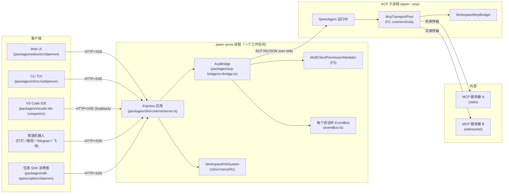
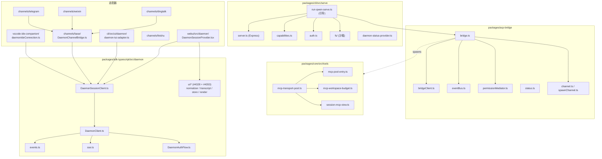
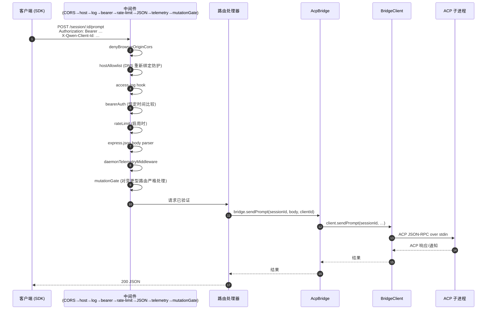
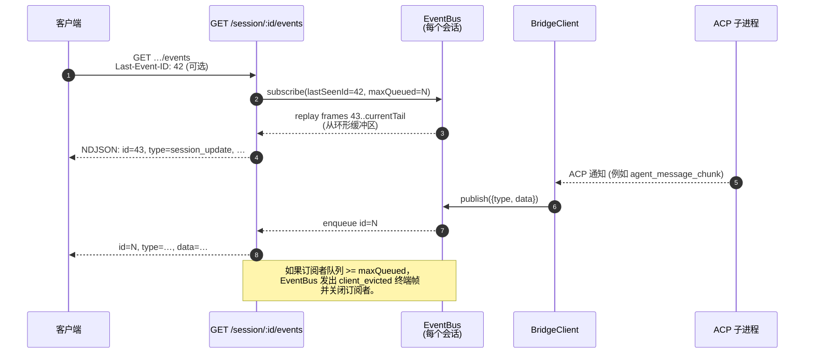
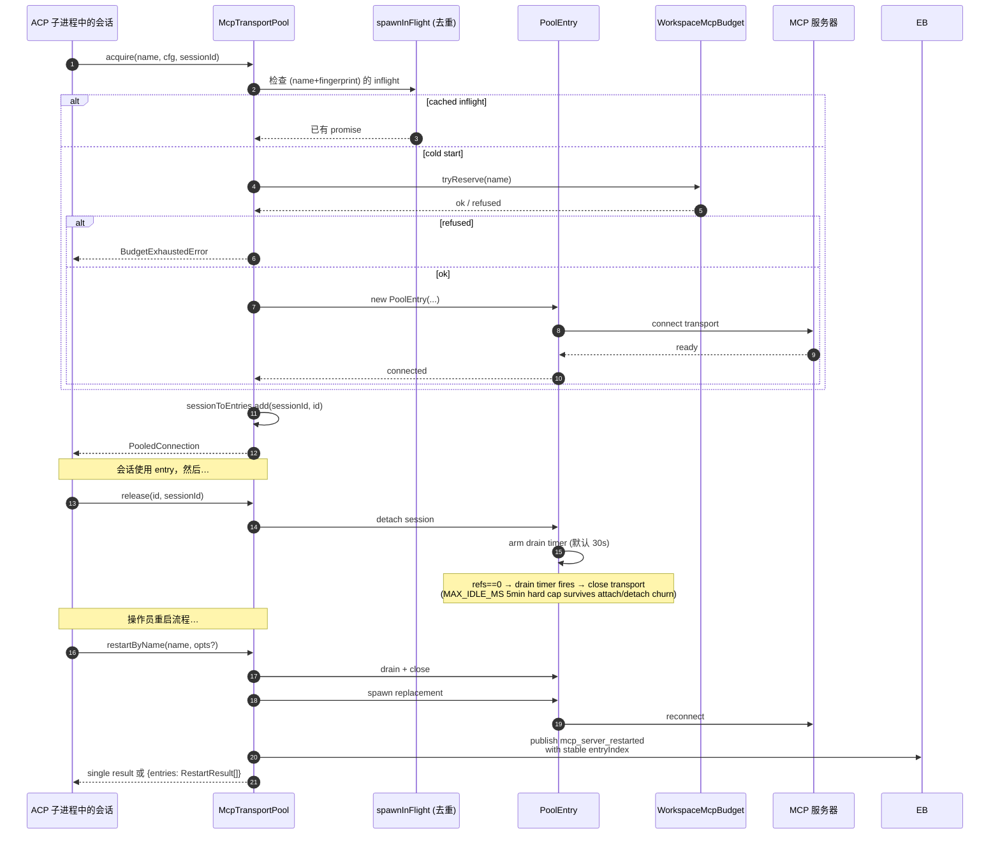
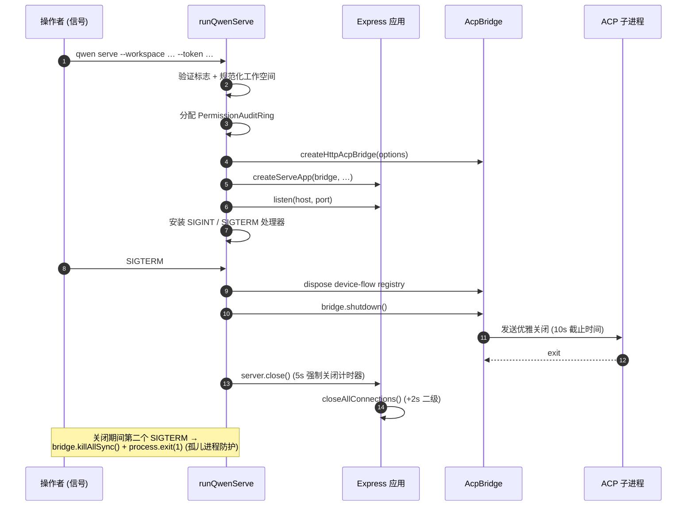

# 守护进程架构

## 概述

一个 `qwen serve` 进程 **= 一个守护进程 = 一个工作空间**。它托管一个 Express HTTP 服务器，拥有一个 `@qwen-code/acp-bridge` 实例，并派生一个运行实际代理运行时的 ACP 子进程 (`qwen --acp`)。多个客户端（CLI TUI、IDE 伴侣、IM 频道机器人、Web BFF、自定义脚本）通过 HTTP + SSE 连接，并且要么共享同一个 ACP 会话（`sessionScope: 'single'`，默认），要么按对话线程拆分会话（`sessionScope: 'thread'`）。

在 ACP 子进程中，MCP 服务器通过 `McpTransportPool` (F2) 在工作空间范围内共享：一个（服务器名称 + 配置指纹）元组映射到一个 MCP 传输，无论有多少会话发现它。桥接器的 `MultiClientPermissionMediator` (F3) 在四种策略之一下协调所有已连接客户端的权限投票。

本文档提供了**系统级概览**，其余文档在此基础上展开。每个关键流程均以 Mermaid 时序图展示；各组件实现细节请参见其他 18 篇文档。

## 进程拓扑

守护进程与 ACP 子进程通过 `AcpChannel` 连接（默认使用真实的子进程 stdio 管道对；测试时使用 `inMemoryChannel`）。守护进程的所有行为都受此分离影响：HTTP 和 SSE 流量在守护进程中终结，代理决策和工具调用在子进程中发生，而桥接器则连接两者。

## 包结构图

三个信任边界值得关注：HTTP 边缘（`serve/auth.ts` 中间件链）、桥接器到 ACP 子进程边界（NDJSON over stdio，无认证；子进程完全信任桥接器）、以及代理到 MCP 服务器边界（代理可以调用触及主机的工具）。

## 工作流 1：HTTP 请求生命周期

非流式路由（prompt、cancel、model switch、metadata、workspace CRUD）以单个 JSON 回复终止。流式输出通过 SSE 通道带外传送，**并非**此连接的分块 HTTP 响应体。参见工作流 2。

## 工作流 2：SSE 事件传递与重播

环形缓冲区有界 (`eventRingSize`, 默认 8000)。重新连接的客户端如果 `Last-Event-ID` 早于环形缓冲区头部，将收到合成的 catch-up 信号，并必须调用 `loadSession` / `resumeSession` 来重建更深的状态。慢速客户端在队列填充 75% 时触发 `slow_client_warning`，在达到上限时触发 `client_evicted`。

## 工作流 3：多客户端权限协调

跨策略逃生舱口：任何客户端可以投票 `CANCEL_VOTE_SENTINEL` 来短路请求，使其变为 `cancelled / agent_cancelled`。桥接器阻止网络调用者通过普通 `optionId` 字段夹带哨兵（`InvalidPermissionOptionError`）。

## 工作流 4：MCP 传输池获取 / 释放 / 重启

`releaseSession(sessionId)` 使用反向索引 `sessionToEntries` 以 O(refs) 的时间复杂度释放该会话持有的所有 entry。守护进程关闭时，`drainAll()` 设置 `draining` 标志（拒绝新的 acquire），并在可配置超时内等待每个 entry 关闭。

## 工作流 5：生命周期——启动与优雅关闭

两阶段关闭之所以重要，是因为进行中的 HTTP 请求、进行中的 SSE 订阅者和 ACP 子进程中进行中的工具调用都需要有界的关闭窗口。如果任何操作在这些截止时间后仍被阻塞，强制关闭路径将接管，以确保挂起的子进程不会阻止守护进程退出。

## 关键文件

| 关注点               | 文件                                                            |
| -------------------- | --------------------------------------------------------------- |
| 引导                  | `packages/cli/src/serve/run-qwen-serve.ts`                      |
| Express 应用          | `packages/cli/src/serve/server.ts`                              |
| 能力注册表             | `packages/cli/src/serve/capabilities.ts`                       |
| 认证中间件             | `packages/cli/src/serve/auth.ts`                                |
| 桥接器                | `packages/acp-bridge/src/bridge.ts`                             |
| BridgeClient          | `packages/acp-bridge/src/bridgeClient.ts`                       |
| 权限协调器             | `packages/acp-bridge/src/permissionMediator.ts`                 |
| EventBus              | `packages/acp-bridge/src/eventBus.ts`                           |
| MCP 传输池            | `packages/core/src/tools/mcp-transport-pool.ts`                 |
| 工作空间 MCP 预算      | `packages/core/src/tools/mcp-workspace-budget.ts`               |
| 工作空间文件系统        | `packages/cli/src/serve/fs/`                                    |
| SDK DaemonClient      | `packages/sdk-typescript/src/daemon/DaemonClient.ts`            |
| SDK SessionClient     | `packages/sdk-typescript/src/daemon/DaemonSessionClient.ts`     |
| 事件模式               | `packages/sdk-typescript/src/daemon/events.ts`                 |

## 参考资料

- 设计问题: [#3803](https://github.com/QwenLM/qwen-code/issues/3803) (守护进程设计), [#4175](https://github.com/QwenLM/qwen-code/issues/4175) (F 系列里程碑).
- 用户指南: [`../../users/qwen-serve.md`](../../users/qwen-serve.md).
- 有线协议参考: [`../qwen-serve-protocol.md`](../qwen-serve-protocol.md).
- F2 设计文档: [`../../design/f2-mcp-transport-pool.md`](../../design/f2-mcp-transport-pool.md).
- F2 设计说明: issue [#4175](https://github.com/QwenLM/qwen-code/issues/4175) 提交 4-6.