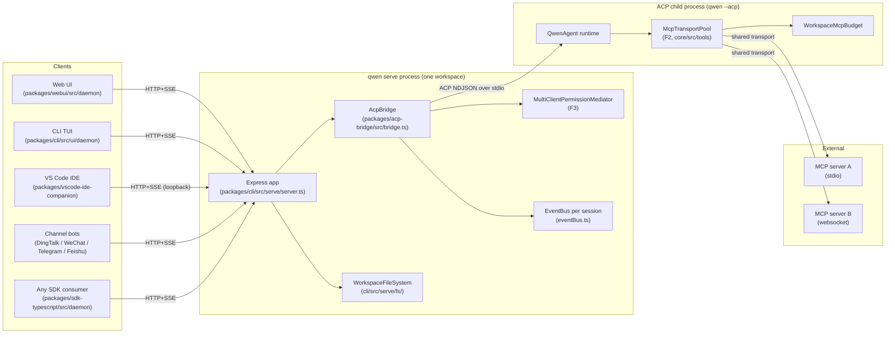
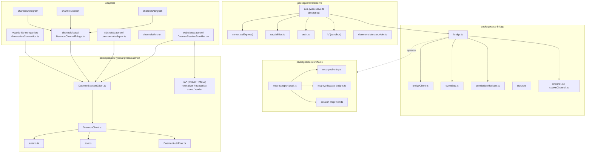
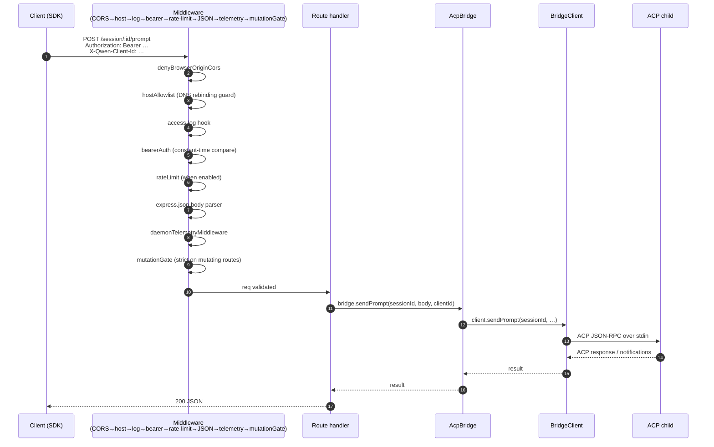
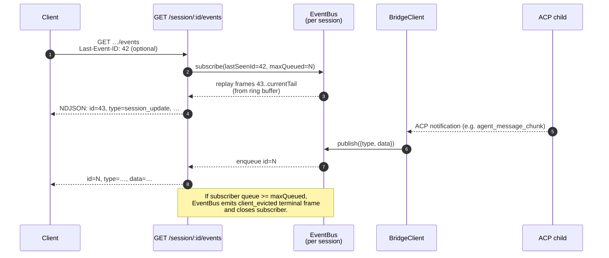
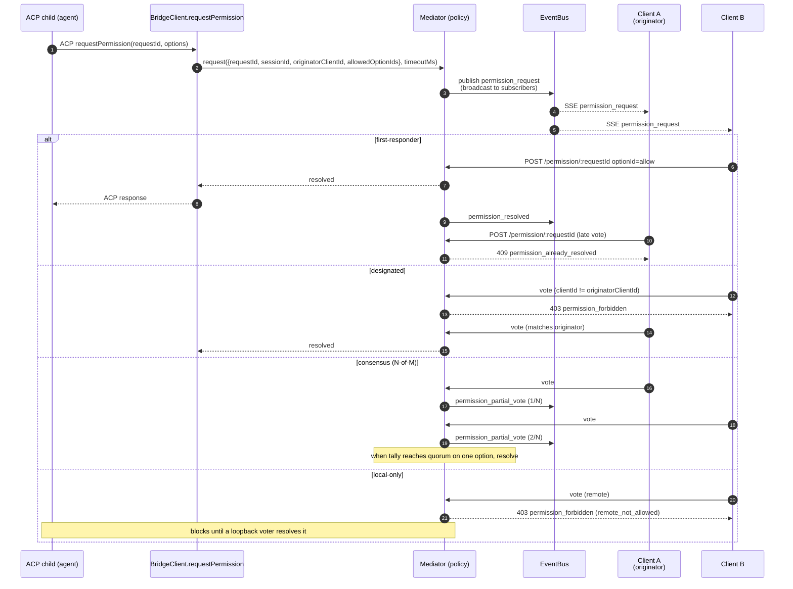
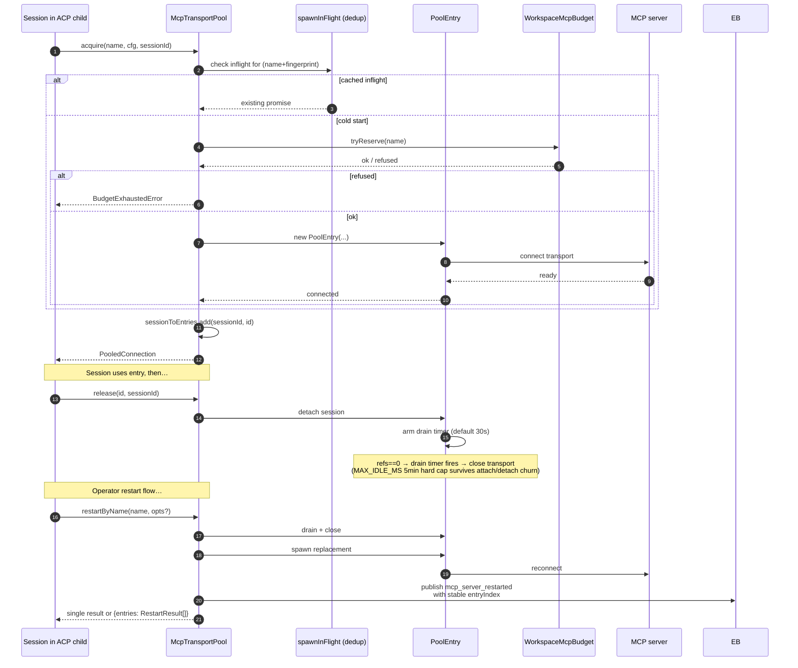
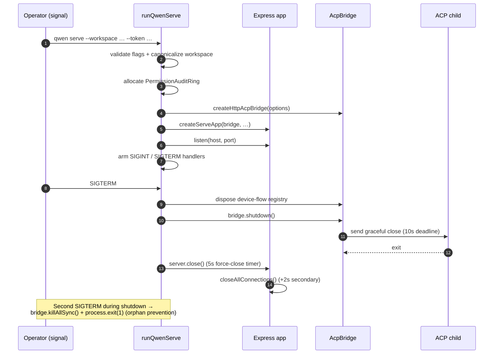

# Daemon 架构

## 概述

一个 `qwen serve` 进程对应**一个 daemon = 一个工作区**。它托管一个 Express HTTP 服务器，持有一个 `@qwen-code/acp-bridge` 实例，并 spawn 一个运行实际 agent runtime 的 ACP 子进程（`qwen --acp`）。多个客户端（CLI TUI、IDE 插件、IM 频道机器人、Web BFF、自定义脚本）通过 HTTP + SSE 连接，可以共享同一个 ACP 会话（`sessionScope: 'single'`，默认值），也可以按会话线程各自独立（`sessionScope: 'thread'`）。

在 ACP 子进程内部，MCP 服务器通过 `McpTransportPool`（F2）在整个工作区范围内共享：一个（server-name + config-fingerprint）元组唯一对应一个 MCP transport，无论有多少个会话发现了它。Bridge 的 `MultiClientPermissionMediator`（F3）基于四种策略之一，协调所有已连接客户端的权限投票。

本文提供**系统级全景图**，本文档集的其余部分将在此基础上展开。每个关键流程均以 Mermaid 序列图呈现；各组件的实现细节请参阅其余 18 篇文档。

## 进程拓扑

daemon 进程与 ACP 子进程通过 `AcpChannel` 相连（默认为真实子进程的 stdio 管道对；测试时使用 `inMemoryChannel`）。daemon 的所有行为都由这一分层架构决定：HTTP 和 SSE 流量在 daemon 侧终止，agent 决策和工具调用在子进程中执行，bridge 负责连接两者。

## 包结构映射

有三个信任边界需要关注：HTTP 边缘（`serve/auth.ts` 中间件链）、bridge 到 ACP 子进程的边界（NDJSON over stdio，无认证；子进程隐式信任 bridge），以及 agent 到 MCP 服务器的边界（agent 可能调用触及宿主机的工具）。

## 工作流 1：HTTP 请求生命周期

非流式路由（prompt、cancel、model switch、metadata、workspace CRUD）以单条 JSON 响应结束。流式输出通过 SSE 通道带外传递，**不**以 chunked HTTP body 的形式从本连接返回。参见工作流 2。

## 工作流 2：SSE 事件投递与重放

环形缓冲区有大小限制（`eventRingSize`，默认 8000）。重连客户端的 `Last-Event-ID` 若早于环形缓冲区头部，将收到一个合成的追赶信号，需调用 `loadSession` / `resumeSession` 来重建更深层的状态。慢速客户端在队列填满 75% 时触发 `slow_client_warning`，到达上限时触发 `client_evicted`。

## 工作流 3：多客户端权限协调

跨策略逃生通道：任何客户端均可投票 `CANCEL_VOTE_SENTINEL`，将请求短路为 `cancelled / agent_cancelled`。bridge 会阻止 wire 调用方通过普通 `optionId` 字段偷带 sentinel（`InvalidPermissionOptionError`）。

## 工作流 4：MCP transport pool 获取 / 释放 / 重启

`releaseSession(sessionId)` 利用反向 `sessionToEntries` 索引，以 O(refs) 的复杂度释放该会话持有的所有 entry。daemon 关闭时，`drainAll()` 设置 `draining` 标志（拒绝新的 acquire），并在可配置的超时时间内等待所有 entry 关闭。

## 工作流 5：生命周期——启动与优雅关闭

两阶段关闭之所以重要，是因为进行中的 HTTP 请求、进行中的 SSE 订阅者，以及 ACP 子进程中进行中的工具调用，都需要在有限时间窗口内完成清理。若有任何阻塞超出这些截止时间，强制关闭路径将接管，防止卡死的子进程持续占用 daemon 进程。

## 关键文件

| 关注点               | 文件                                                        |
| -------------------- | ----------------------------------------------------------- |
| 启动引导             | `packages/cli/src/serve/run-qwen-serve.ts`                    |
| Express 应用         | `packages/cli/src/serve/server.ts`                          |
| 能力注册表           | `packages/cli/src/serve/capabilities.ts`                    |
| 认证中间件           | `packages/cli/src/serve/auth.ts`                            |
| Bridge               | `packages/acp-bridge/src/bridge.ts`                         |
| BridgeClient         | `packages/acp-bridge/src/bridgeClient.ts`                   |
| 权限协调器           | `packages/acp-bridge/src/permissionMediator.ts`             |
| EventBus             | `packages/acp-bridge/src/eventBus.ts`                       |
| MCP transport pool   | `packages/core/src/tools/mcp-transport-pool.ts`             |
| 工作区 MCP 配额      | `packages/core/src/tools/mcp-workspace-budget.ts`           |
| 工作区文件系统       | `packages/cli/src/serve/fs/`                                |
| SDK DaemonClient     | `packages/sdk-typescript/src/daemon/DaemonClient.ts`        |
| SDK SessionClient    | `packages/sdk-typescript/src/daemon/DaemonSessionClient.ts` |
| 事件 schema          | `packages/sdk-typescript/src/daemon/events.ts`              |

## 参考资料

- 设计议题：[#3803](https://github.com/QwenLM/qwen-code/issues/3803)（daemon 设计），[#4175](https://github.com/QwenLM/qwen-code/issues/4175)（F 系列里程碑）。
- 用户指南：[`../../users/qwen-serve.md`](../../users/qwen-serve.md)。
- Wire 协议参考：[`../qwen-serve-protocol.md`](../qwen-serve-protocol.md)。
- F2 设计文档：[`../../design/f2-mcp-transport-pool.md`](../../design/f2-mcp-transport-pool.md)。
- F2 设计说明：议题 [#4175](https://github.com/QwenLM/qwen-code/issues/4175) 提交 4-6。
