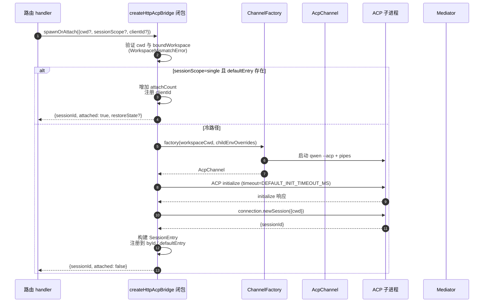
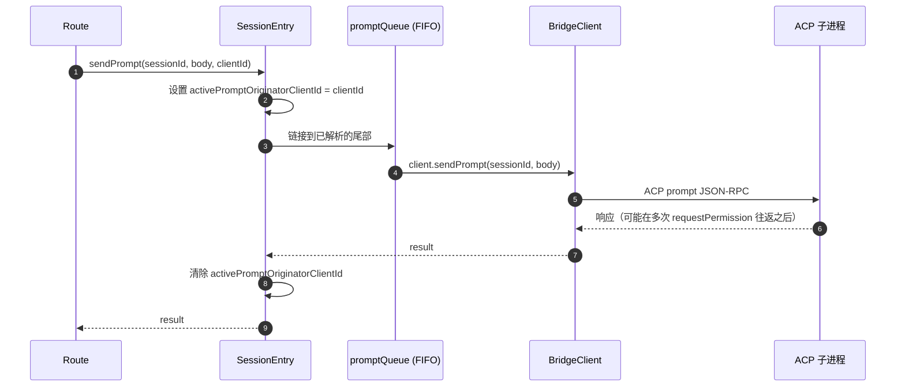
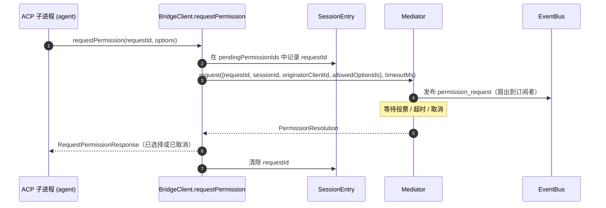
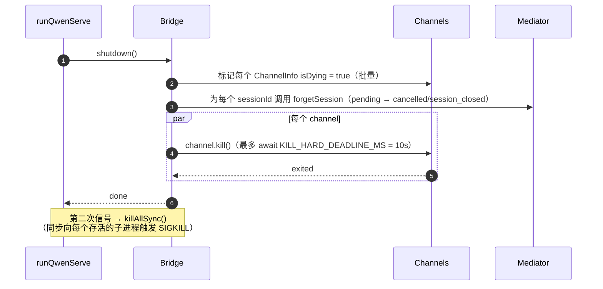

# ACP Bridge

## 概述

`packages/acp-bridge/` 负责守护进程 HTTP 层与 ACP 子进程之间的边界。它被 `packages/cli/src/serve/`（即 `qwen serve` 守护进程）消费，并在 #4175 F1 第 3 步中被提取出来，以便未来的消费者（如 `channels/base/AcpBridge.ts`、VS Code IDE 伴侣插件）能够使用相同的 bridge 核心，而无需深入 CLI 包。

该 bridge 提供一个 `HttpAcpBridge` 实例、一个通往 ACP 子进程的 `AcpChannel`、基于该 channel 的多路复用 session、每个 session 的 `EventBus`、一个 `MultiClientPermissionMediator`、一个 `BridgeFileSystem` 适配器，以及面向 ACP 的辅助函数（`spawnOrAttach`、`loadSession`、`resumeSession`、`sendPrompt`、`cancelSession`、`respondToPermission`，以及用于 workspace 状态和 MCP 重启的 extMethod RPC）。

## 职责

- 通过可插拔的 `ChannelFactory` 启动或附加到 ACP 子进程。默认 factory：`defaultSpawnChannelFactory`（子进程 `qwen --acp`）。测试中注入 `inMemoryChannel`。
- 维护 `aliveChannels`（channel 注册表）和 `byId`（session 注册表）。
- 通过 `connection.newSession()` 将 N 个 HTTP 侧 session 多路复用到一个 ACP 子进程上。
- 通过 `promptQueue` 序列化每个 session 的 prompt（ACP 强制每个 session 只能有一个活跃的 prompt）。
- 为 `setSessionModel` 调用提供每个 session 的 FIFO 队列，防止使用不同模型的并发附加操作与 agent 产生竞争。
- 每个 session 的 `EventBus` 驱动 `GET /session/:id/events`（参见 [`10-event-bus.md`](./10-event-bus.md)）。
- 权限流程：`BridgeClient.requestPermission` → `MultiClientPermissionMediator.request` → 扇出（fan-out） → 投票收集 → ACP 响应（参见 [`04-permission-mediation.md`](./04-permission-mediation.md)）。
- 文件 I/O：`BridgeFileSystem` 适配器用于处理 ACP 的 `readTextFile` / `writeTextFile` 调用（参见 [`07-workspace-filesystem.md`](./07-workspace-filesystem.md)）。
- 用于 workspace 级别状态（`/workspace/mcp`、`/workspace/skills`、`/workspace/providers`）和 MCP 重启的 extMethod RPC。
- 生命周期：优雅的 `shutdown()`，每个 channel 的超时时间为 `KILL_HARD_DEADLINE_MS`（10 秒）；同步的 `killAllSync()` 用于二次信号强制退出。

## 架构

**公共入口**：`packages/acp-bridge/src/bridge.ts` 中的 `createHttpAcpBridge(opts: BridgeOptions): HttpAcpBridge`。

**核心类型**：

| 类型                            | 文件                    | 角色                                                                                                                                                                                                                  |
| ------------------------------- | ----------------------- | --------------------------------------------------------------------------------------------------------------------------------------------------------------------------------------------------------------------- |
| `HttpAcpBridge`                 | `bridgeTypes.ts`        | 公共接口：`spawnOrAttach`、`loadSession`、`resumeSession`、`sendPrompt`、`cancelSession`、`subscribeEvents`、`respondToPermission`、`getWorkspaceMcpStatus`、`restartMcpServer`、`shutdown`、`killAllSync` 等。 |
| `BridgeSession`                 | `bridgeTypes.ts`        | 返回给 HTTP handler 的 `{ sessionId, workspaceCwd, attached, clientId?, createdAt? }`。                                                                                                                             |
| `BridgeOptions`                 | `bridgeOptions.ts`      | 构造时配置（参见[配置](#配置)）。                                                                                                                                                       |
| `AcpChannel`                    | `channel.ts`            | `{ stream, kill(), killSync(), exited }` — 单个 ACP NDJSON channel。                                                                                                                                                    |
| `ChannelFactory`                | `channel.ts`            | `(workspaceCwd, childEnvOverrides?) => Promise<AcpChannel>`。                                                                                                                                                          |
| `BridgeClient`                  | `bridgeClient.ts`       | 封装单个 ACP `ClientSideConnection`；实现 ACP `Client`（`requestPermission`、`readTextFile`、`writeTextFile`、`sessionUpdate`、`extNotification`）。                                                             |
| `EventBus`                      | `eventBus.ts`           | 每个 session 的内存中发布/订阅。参见 [`10-event-bus.md`](./10-event-bus.md)。                                                                                                                                            |
| `MultiClientPermissionMediator` | `permissionMediator.ts` | 四策略 mediator。参见 [`04-permission-mediation.md`](./04-permission-mediation.md)。                                                                                                                               |

**内部状态（由 `createHttpAcpBridge` 闭包捕获）**：

| 状态           | 类型                           | 用途                                                                                                                                                                                                                                                                                                                                                                                                  |
| --------------- | ------------------------------- | -------------------------------------------------------------------------------------------------------------------------------------------------------------------------------------------------------------------------------------------------------------------------------------------------------------------------------------------------------------------------------------------------------- |
| `aliveChannels` | `Map<string, ChannelInfo>`      | 以 channel id 为键的 channel 注册表。每个 `ChannelInfo` 包含 `channel`、`connection`、`client`（每个 channel 一个 `BridgeClient`）、`sessionIds: Set<string>`、`pendingRestoreIds`、`statusClosedReject?`、`isDying: boolean`。                                                                                                                                                                            |
| `byId`          | `Map<string, SessionEntry>`     | 以 sessionId 为键的 session 注册表。每个 `SessionEntry` 包含 `channel`、`connection`、`events: EventBus`、`promptQueue: Promise<void>`、`modelChangeQueue: Promise<void>`、`pendingPermissionIds: Set<string>`、`clientIds: Map<string, count>`、`activePromptOriginatorClientId?`、`attachCount`、`spawnOwnerWantedKill`、`restoreState?`、`sessionLastSeenAt?`、`clientLastSeenAt: Map<string, ms>`。 |
| `defaultEntry`  | `SessionEntry \| null`          | 当 `sessionScope: 'single'` 时使用的“单一” session。                                                                                                                                                                                                                                                                                                                                                 |
| `defaultPolicy` | `PermissionPolicy`              | 通过 `BridgeOptions.permissionPolicy` 配置。                                                                                                                                                                                                                                                                                                                                                         |
| `mediator`      | `MultiClientPermissionMediator` | 每个 bridge 实例一个。                                                                                                                                                                                                                                                                                                                                                                                 |
| Constants       | —                               | `DEFAULT_INIT_TIMEOUT_MS = 10_000`、`MCP_RESTART_TIMEOUT_MS = 300_000`、`DEFAULT_MAX_SESSIONS = 20`、`MAX_EVENT_RING_SIZE = 1_000_000`、`DEFAULT_PERMISSION_TIMEOUT_MS = 5min`、`DEFAULT_MAX_PENDING_PER_SESSION = 64`。                                                                                                                                                                                  |

**`isDying` 不变量**：任何 teardown 路径都必须在 await `channel.kill()` **之前**同步设置 `ChannelInfo.isDying = true`。`ensureChannel` 将 dying channel 视为不存在并生成一个新的。如果没有这个标志，在 SIGTERM 宽限期（最长 10 秒）内到达的并发 `spawnOrAttach` 将会附加到一个即将关闭的 transport 上，并且调用者的 sessionId 在后续每次操作中都会返回 404。**设置点**（必须保持同步）：`ensureChannel`（初始化失败 + 延迟 shutdown 重新检查）、`doSpawn`（空 channel 上的 newSession 失败）、`killSession`（最后一个 session 离开）、`shutdown`（批量）。

**`channelInfo` 保留不变量**：在设置 `isDying = true` 时**不要**清除 `channelInfo`。`killAllSync` 在 SIGTERM 宽限期内仍必须能找到该 channel，以便在 `process.exit(1)` 时触发 SIGKILL。`aliveChannels` 会保留 dying 条目，直到 `channel.exited` 触发。

**BridgeClient 有界缓冲**：到达 `BridgeClient` 的 ACP `extNotification` 帧，如果其 sessionId 尚未在 `byId` 中（因为 `connection.newSession` 的响应尚未返回，但 `newSession` 内部的 MCP 发现已经触发了预算事件），将被缓冲到一个早期事件队列中。该队列受 `MAX_EARLY_EVENT_SESSIONS = 64` × `MAX_EARLY_EVENTS_PER_SESSION = 32` × `EARLY_EVENT_TTL_MS = 60_000` 限制。最坏情况下大约占用 400 KB 堆内存。如果没有缓冲，新 session 的第一个 SSE 重放环槽位将会丢失在其创建期间触发的事件。

## 工作流

### `spawnOrAttach`（主入口）

关键点：

- 当 `sessionScope='single'` 且存在 `defaultEntry` 时，仅增加 `attachCount`，注册 `clientId`，并返回 `attached: true`。
- 冷路径运行 ChannelFactory，执行 ACP `initialize`（`DEFAULT_INIT_TIMEOUT_MS=10s`），调用 `connection.newSession({cwd})`，然后注册新的 `SessionEntry`。
- 当 `byId.size >= maxSessions` 时抛出 `SessionLimitExceededError`。
- 如果 `X-Qwen-Client-Id` 不在 `[A-Za-z0-9._:-]{1,128}` 范围内，则抛出 `InvalidClientIdError`。
- `server.ts` 中的断连清理器通过 `attachCount`/`spawnOwnerWantedKill` 跟踪 spawn 所有者，以避免在 spawn 所有者断连但其他客户端已附加时 teardown session（参见 #3889 BQ9tV）。

### Prompt 序列化

队列尾部的失败会被**吞没（swallowed）**，这样前一个 prompt 的拒绝不会污染后续的 prompt；原始调用者仍会在其返回的 promise 中收到拒绝。缓存在 session 上的 `transportClosedReject` 会让 prompt promise 与 `channel.exited` 竞争，因此崩溃的子进程会立即暴露，而不是挂起。

### 权限流程（高层）

在 mediator 之前，如果 wire 投票试图通过普通的 `optionId` 字段注入 `CANCEL_VOTE_SENTINEL`，则会抛出 `InvalidPermissionOptionError` — 该 sentinel 是 bridge 唯一的逃生舱，用于将请求短路为 `cancelled / agent_cancelled`，绝不能意外地从 wire 访问。参见 [`04-permission-mediation.md`](./04-permission-mediation.md)。

### Shutdown

## Channel factory

`AcpChannel`（`channel.ts`）是 bridge 的 transport 抽象。生产环境使用 `spawnChannel.ts` 中的 `defaultSpawnChannelFactory`，它将 `qwen --acp` 作为子进程运行，并带有一对 stdio pipe。测试注入 `inMemoryChannel` 以在进程内运行 agent。bridge 对底层机制一无所知 — 它只需要 `{ stream, kill, killSync, exited }`。

`ChannelFactory` 接受 `childEnvOverrides`，因此每个守护进程句柄都可以传递自己的 MCP 预算环境变量（`QWEN_SERVE_MCP_CLIENT_BUDGET`、`QWEN_SERVE_MCP_BUDGET_MODE`），而无需修改 `process.env`（当两个嵌入式守护进程在同一个 Node 进程中运行时，修改 `process.env` 会产生竞争）。

## 状态与生命周期

- Bridge 构造是同步的；第一次 `spawnOrAttach` 会冷启动 ACP 子进程。
- 在 `sessionScope: 'single'` 下，`defaultEntry` 的生命周期与 bridge 相同；当 `sessionIds.size === 0`（在 `killSession` 之后）且 `isDying` 变为 true 时，channel 会被清理。
- `MAX_EVENT_RING_SIZE = 1_000_000` 是 `BridgeOptions.eventRingSize` 的软上限，用于在导致每个 session 约 500 MB 的 OOM 之前捕获操作员的拼写错误。
- `DEFAULT_PERMISSION_TIMEOUT_MS = 5 * 60 * 1000` 防止卡住的权限请求永久阻塞每个 session 的 `promptQueue`。
- `DEFAULT_MAX_PENDING_PER_SESSION = 64` 镜像了 `DEFAULT_MAX_SUBSCRIBERS`；超出的 `requestPermission` 调用会被解析为 cancelled，并附带 stderr 警告。

## 依赖

| 上游                                                                                     | 下游                                     |
| -------------------------------------------------------------------------------------------- | ---------------------------------------------- |
| `@agentclientprotocol/sdk` — `ClientSideConnection`、`PROTOCOL_VERSION`、ACP 类型           | `packages/cli/src/serve/`（守护进程）         |
| `@qwen-code/qwen-code-core` — `ApprovalMode`、`TrustGateError`、`getCurrentGeminiMdFilename` | `packages/channels/base/`（计划中，F4）        |
| `node:crypto`、`node:fs`、`node:path`                                                        | `packages/vscode-ide-companion/`（计划中，F4） |

## 配置

`BridgeOptions`（`bridgeOptions.ts`）：

| 键                                           | 默认值                                            | 用途                                                                                                               |
| --------------------------------------------- | -------------------------------------------------- | --------------------------------------------------------------------------------------------------------------------- |
| `boundWorkspace`                              | （必填）                                         | bridge 强制执行的规范 workspace 路径。                                                                         |
| `sessionScope`                                | `'single'`                                         | `'single'` 在所有客户端之间共享一个 session；`'thread'` 为每个对话线程创建独立的 session。 |
| `channelFactory`                              | `defaultSpawnChannelFactory`                       | 可插拔的 ACP 子进程 factory。                                                                                          |
| `initializeTimeoutMs`                         | `DEFAULT_INIT_TIMEOUT_MS = 10_000`                 | ACP `initialize` 握手超时时间。                                                                                   |
| `maxSessions`                                 | `DEFAULT_MAX_SESSIONS = 20`                        | `byId.size` 的上限。`0` / `Infinity` = 无限制；NaN/负数会抛出异常。                                                |
| `eventRingSize`                               | `DEFAULT_RING_SIZE`（来自 `eventBus.ts`）           | 每个 session 的事件环；软上限为 `MAX_EVENT_RING_SIZE`。                                                         |
| `permissionResponseTimeoutMs`                 | `DEFAULT_PERMISSION_TIMEOUT_MS = 5 min`            | mediator 的每个请求挂钟时间。                                                                               |
| `maxPendingPermissionsPerSession`             | `DEFAULT_MAX_PENDING_PER_SESSION = 64`             | 针对高并发 agent 的背压控制。                                                                                   |
| `childEnvOverrides`                           | `{}`                                               | 每个句柄为 ACP 子进程添加/清理的环境变量。                                                                  |
| `persistApprovalMode`、`persistDisabledTools` | —                                                  | Wave 4 mutation 路由的设置写入钩子。                                                                  |
| `contextFilename`                             | 来自 `settings.json` 的 `context.fileName`          | 覆盖 `getCurrentGeminiMdFilename`。                                                                               |
| `statusProvider`                              | （无）                                             | 守护进程宿主预检单元（`DaemonStatusProvider`）。                                                                 |
| `fileSystem`                                  | （无）                                             | 用于 ACP `readTextFile` / `writeTextFile` 的 `BridgeFileSystem` 适配器。                                                  |
| `permissionPolicy`                            | 来自 `settings.json` 的 `policy.permissionStrategy` | `first-responder` / `designated` / `consensus` / `local-only` 之一。                                                 |
| `permissionConsensusQuorum`                   | 来自 `settings.json`                               | consensus 策略的 N 值。                                                                                               |
| `permissionAudit`                             | `createNoOpPermissionAuditPublisher()`             | 连接到 `PermissionAuditRing` 以获取审计跟踪。                                                                    |
| `channelIdleTimeoutMs`                        | `0`                                                | 在最后一个 session 关闭后，保持 ACP 子进程存活的毫秒数。                                    |
## 额外的 bridge 方法

除了核心的 `spawnOrAttach`、`sendPrompt`、`cancelSession`、`respondToPermission`、`loadSession` 和 `resumeSession` 调用外，`HttpAcpBridge` 接口现在还包括以下面向 daemon 的辅助方法：

| 方法                                                         | 用途                                          |
| ------------------------------------------------------------ | --------------------------------------------- |
| `generateSessionRecap(sessionId, context?)`                  | 生成单行会话摘要。                            |
| `generateSessionBtw(sessionId, question, signal?, context?)` | 回答旁支问题 / btw 提示。                     |
| `executeShellCommand(sessionId, command, signal?, context?)` | 在 daemon 主机上运行 shell 命令。             |
| `getSessionContextUsageStatus(sessionId, opts?)`             | 返回上下文窗口使用情况。                      |
| `getSessionSupportedCommandsStatus(sessionId)`               | 返回可用的斜杠命令。                          |
| `getSessionTasksStatus(sessionId)`                           | 返回后台任务快照。                            |
| `getSessionStatsStatus(sessionId)`                           | 返回会话使用统计信息。                        |
| `setSessionApprovalMode(sessionId, mode, opts, context?)`    | 更新会话的审批模式。                          |
| `detachClient(sessionId, clientId?)`                         | 显式分离客户端。                              |
| `addRuntimeMcpServer(name, config, originatorClientId)`      | 在运行时添加 MCP 服务器。                     |
| `removeRuntimeMcpServer(name, originatorClientId)`           | 在运行时移除 MCP 服务器。                     |
| `manageMcpServer(serverName, action, originatorClientId)`    | 启用 / 禁用 / 认证 / 清除认证。               |
| `generateWorkspaceAgent(description, originatorClientId)`    | 使用 AI 生成子 agent 定义。                   |
| `preheat()`                                                  | 在第一个会话之前预热 ACP 子进程。             |
| `getSessionLastEventId(sessionId)`                           | 读取会话的单调递增事件 ID。                   |
| `getWorkspaceToolsStatus()`                                  | 返回内置工具注册表快照。                      |
| `getWorkspaceMcpToolsStatus(serverName)`                     | 返回特定 MCP 服务器的工具。                   |

`BridgeSpawnRequest.sessionScope` 已从 `'per-client'` 重命名为 `'thread'`。`BridgeRestoredSession` 现在包含 `compactedReplay`、`liveJournal` 和 `lastEventId`。`BridgeClientRequestContext` 是贯穿 bridge 调用的请求上下文；它包含 `clientId`、`fromLoopback: boolean` 和 `promptId`。

## 注意事项与已知限制

- `MCP_RESTART_TIMEOUT_MS = 300_000`（5 分钟）—— `/workspace/mcp/:server/restart` 的 bridge 超时时间故意设置得较长，因为对于 stdio 服务器，`McpClientManager.MAX_DISCOVERY_TIMEOUT_MS` 最长可达 5 分钟。较短的截止时间会导致误报超时，而此时 ACP 子进程仍在后台持续重连。
- `BridgeOptions.eventRingSize > 1_000_000` 会在构造时抛出异常。
- `connection.unstable_resumeSession` 通过稳定的 `session_resume` daemon 能力暴露；`unstable_session_resume` 仍作为已弃用的兼容别名提供给旧版 SDK。客户端应进行特性检测以使用 `session_resume`。
- bridge 包为 `@qwen-code/acp-bridge`。当前代码直接从包的子路径导入 event-bus 和 status 基础组件；`serve/acp-session-bridge.ts` 仍作为 CLI 本地的兼容门面，用于支持更广泛的 bridge 接口。

## 参考资料

- `packages/acp-bridge/src/bridge.ts`（特别是第 350 行及之后的 `createHttpAcpBridge`）
- `packages/acp-bridge/src/bridgeClient.ts`
- `packages/acp-bridge/src/bridgeTypes.ts`
- `packages/acp-bridge/src/bridgeOptions.ts`
- `packages/acp-bridge/src/channel.ts`
- `packages/acp-bridge/src/spawnChannel.ts`
- `packages/acp-bridge/src/bridgeErrors.ts`
- 相关 Issue：[#3803](https://github.com/QwenLM/qwen-code/issues/3803)、[#4175](https://github.com/QwenLM/qwen-code/issues/4175)。