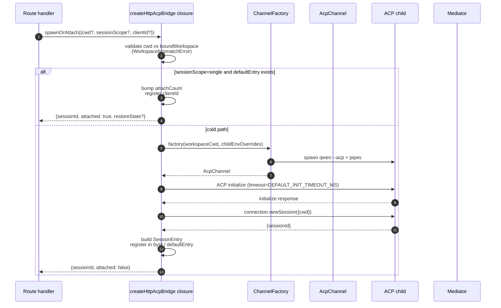
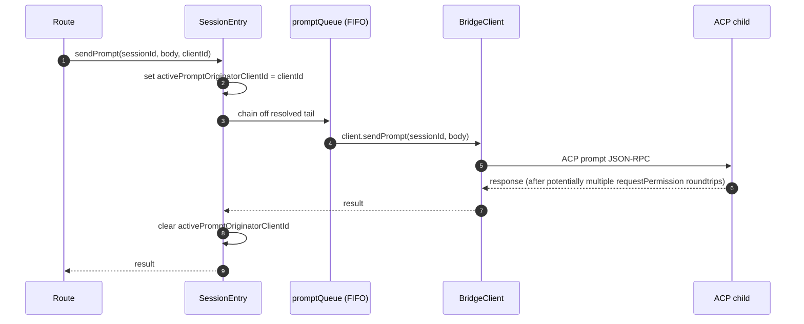
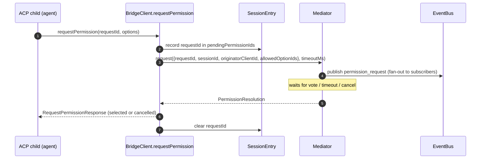
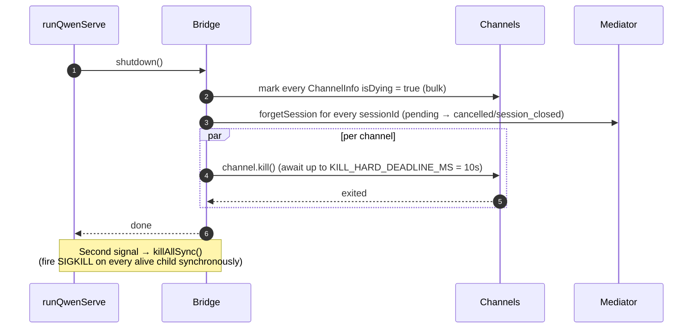

# ACP Bridge

## 概述

`packages/acp-bridge/` 负责管理 daemon HTTP 层与 ACP 子进程之间的边界。它由 `packages/cli/src/serve/`（即 `qwen serve` daemon）消费，并在 #4175 F1 第 3 步中被提取出来，以便未来的消费者（`channels/base/AcpBridge.ts`、VS Code IDE companion）可以直接使用同一个 bridge 核心，而无需访问 CLI 包的内部实现。

bridge 提供一个 `HttpAcpBridge` 实例、一个连接到 ACP 子进程的 `AcpChannel`、在该 channel 上多路复用的 session、每个 session 的 `EventBus`、一个 `MultiClientPermissionMediator`、一个 `BridgeFileSystem` 适配器，以及面向 ACP 的辅助方法（`spawnOrAttach`、`loadSession`、`resumeSession`、`sendPrompt`、`cancelSession`、`respondToPermission`，以及用于 workspace 状态和 MCP 重启的 extMethod RPC）。

## 职责

- 通过可插拔的 `ChannelFactory` 启动或附加到 ACP 子进程。默认 factory：`defaultSpawnChannelFactory`（子进程 `qwen --acp`）。测试中注入 `inMemoryChannel`。
- 维护 `aliveChannels`（channel 注册表）和 `byId`（session 注册表）。
- 通过 `connection.newSession()` 将 N 个 HTTP 侧 session 多路复用到一个 ACP 子进程。
- 通过 `promptQueue` 将每个 session 的 prompt 序列化（ACP 强制每个 session 同一时刻只能有一个活跃 prompt）。
- 每个 session 的 `setSessionModel` 调用使用 FIFO 队列，避免并发附加时不同模型之间产生竞争。
- 每个 session 的 `EventBus` 驱动 `GET /session/:id/events`（参见 [`10-event-bus.md`](./10-event-bus.md)）。
- 权限流程：`BridgeClient.requestPermission` → `MultiClientPermissionMediator.request` → 扇出 → 投票收集 → ACP 响应（参见 [`04-permission-mediation.md`](./04-permission-mediation.md)）。
- 文件 I/O：`BridgeFileSystem` 适配器，处理 ACP 的 `readTextFile` / `writeTextFile` 调用（参见 [`07-workspace-filesystem.md`](./07-workspace-filesystem.md)）。
- extMethod RPC，用于 workspace 级状态（`/workspace/mcp`、`/workspace/skills`、`/workspace/providers`）和 MCP 重启。
- 生命周期：优雅的 `shutdown()`，每个 channel 的 `KILL_HARD_DEADLINE_MS`（10s）；同步的 `killAllSync()`，用于二次信号强制退出。

## 架构

**公共入口**：`packages/acp-bridge/src/bridge.ts` 中的 `createHttpAcpBridge(opts: BridgeOptions): HttpAcpBridge`。

**关键类型**：

| 类型                            | 文件                    | 作用                                                                                                                                                                                                                  |
| ------------------------------- | ----------------------- | --------------------------------------------------------------------------------------------------------------------------------------------------------------------------------------------------------------------- |
| `HttpAcpBridge`                 | `bridgeTypes.ts`        | 公共接口：`spawnOrAttach`、`loadSession`、`resumeSession`、`sendPrompt`、`cancelSession`、`subscribeEvents`、`respondToPermission`、`getWorkspaceMcpStatus`、`restartMcpServer`、`shutdown`、`killAllSync` 等。 |
| `BridgeSession`                 | `bridgeTypes.ts`        | `{ sessionId, workspaceCwd, attached, clientId?, createdAt? }`，返回给 HTTP 处理器。                                                                                                                                  |
| `BridgeOptions`                 | `bridgeOptions.ts`      | 构建时配置（参见[配置](#配置)）。                                                                                                                                                                                      |
| `AcpChannel`                    | `channel.ts`            | `{ stream, kill(), killSync(), exited }` — 一个 ACP NDJSON channel。                                                                                                                                                  |
| `ChannelFactory`                | `channel.ts`            | `(workspaceCwd, childEnvOverrides?) => Promise<AcpChannel>`。                                                                                                                                                         |
| `BridgeClient`                  | `bridgeClient.ts`       | 封装一个 ACP `ClientSideConnection`；实现 ACP `Client`（`requestPermission`、`readTextFile`、`writeTextFile`、`sessionUpdate`、`extNotification`）。                                                                   |
| `EventBus`                      | `eventBus.ts`           | 每个 session 的内存 pub/sub。参见 [`10-event-bus.md`](./10-event-bus.md)。                                                                                                                                            |
| `MultiClientPermissionMediator` | `permissionMediator.ts` | 四策略调解器。参见 [`04-permission-mediation.md`](./04-permission-mediation.md)。                                                                                                                                     |

**内部状态（由 `createHttpAcpBridge` 闭包维护）**：

| 状态            | 类型                            | 用途                                                                                                                                                                                                                                                                                                                                                                                                     |
| --------------- | ------------------------------- | -------------------------------------------------------------------------------------------------------------------------------------------------------------------------------------------------------------------------------------------------------------------------------------------------------------------------------------------------------------------------------------------------------- |
| `aliveChannels` | `Map<string, ChannelInfo>`      | 以 channel id 为键的 channel 注册表。每个 `ChannelInfo` 持有 `channel`、`connection`、`client`（每个 channel 一个 `BridgeClient`）、`sessionIds: Set<string>`、`pendingRestoreIds`、`statusClosedReject?`、`isDying: boolean`。                                                                                                                                                                           |
| `byId`          | `Map<string, SessionEntry>`     | 以 sessionId 为键的 session 注册表。每个 `SessionEntry` 持有 `channel`、`connection`、`events: EventBus`、`promptQueue: Promise<void>`、`modelChangeQueue: Promise<void>`、`pendingPermissionIds: Set<string>`、`clientIds: Map<string, count>`、`activePromptOriginatorClientId?`、`attachCount`、`spawnOwnerWantedKill`、`restoreState?`、`sessionLastSeenAt?`、`clientLastSeenAt: Map<string, ms>`。 |
| `defaultEntry`  | `SessionEntry \| null`          | `sessionScope: 'single'` 时使用的"单一" session。                                                                                                                                                                                                                                                                                                                                                        |
| `defaultPolicy` | `PermissionPolicy`              | 通过 `BridgeOptions.permissionPolicy` 配置。                                                                                                                                                                                                                                                                                                                                                             |
| `mediator`      | `MultiClientPermissionMediator` | 每个 bridge 实例一个。                                                                                                                                                                                                                                                                                                                                                                                   |
| 常量            | —                               | `DEFAULT_INIT_TIMEOUT_MS = 10_000`、`MCP_RESTART_TIMEOUT_MS = 300_000`、`DEFAULT_MAX_SESSIONS = 20`、`MAX_EVENT_RING_SIZE = 1_000_000`、`DEFAULT_PERMISSION_TIMEOUT_MS = 5min`、`DEFAULT_MAX_PENDING_PER_SESSION = 64`。                                                                                                                                                                                |

**`isDying` 不变量**：任何拆卸路径必须在 `await channel.kill()` **之前**同步将 `ChannelInfo.isDying = true`。`ensureChannel` 将正在销毁的 channel 视为不存在并重新生成一个新 channel。若没有此标志，在 SIGTERM 宽限窗口（最长 10s）期间并发到达的 `spawnOrAttach` 会附加到即将关闭的 transport，导致调用者的 sessionId 在每次后续请求时返回 404。**设置位置**（必须保持同步）：`ensureChannel`（初始化失败 + 延迟关闭重检）、`doSpawn`（空 channel 上的 newSession 失败）、`killSession`（最后一个 session 离开时）、`shutdown`（批量）。

**`channelInfo` 保留不变量**：设置 `isDying = true` 时**不要**清除 `channelInfo`。`killAllSync` 必须在 SIGTERM 宽限窗口期间仍能找到该 channel，以便在 `process.exit(1)` 时触发 SIGKILL。`aliveChannels` 持有正在销毁的条目，直到 `channel.exited` 触发。

**BridgeClient 有界缓冲**：到达 `BridgeClient` 的 ACP `extNotification` 帧，若其 sessionId 尚未在 `byId` 中（因为 `connection.newSession` 的响应尚未返回，但 `newSession` 内部的 MCP 发现已经触发了 budget 事件），会被缓冲到一个早期事件队列中，该队列受限于 `MAX_EARLY_EVENT_SESSIONS = 64` × `MAX_EARLY_EVENTS_PER_SESSION = 32` × `EARLY_EVENT_TTL_MS = 60_000`。最坏情况下约占用 400 KB 堆内存。若不进行缓冲，新 session 的首个 SSE replay-ring 槽位将会丢失在创建过程中触发的事件。

## 工作流程

### `spawnOrAttach`（主要入口）

关键点：

- `sessionScope='single'` 且存在 `defaultEntry` 时，仅增加 `attachCount`、注册 `clientId`，并返回 `attached: true`。
- 冷路径运行 ChannelFactory，执行 ACP `initialize`（`DEFAULT_INIT_TIMEOUT_MS=10s`），调用 `connection.newSession({cwd})`，然后注册新的 `SessionEntry`。
- 当 `byId.size >= maxSessions` 时抛出 `SessionLimitExceededError`。
- 若 `X-Qwen-Client-Id` 不符合 `[A-Za-z0-9._:-]{1,128}` 则抛出 `InvalidClientIdError`。
- `server.ts` 中的断连收割器通过 `attachCount`/`spawnOwnerWantedKill` 追踪 spawn 所有者，避免在 spawn 所有者断连但其他 client 已附加时拆除 session（参见 #3889 BQ9tV）。

### Prompt 序列化

队列尾部的失败会被**吞掉**，避免前一个 prompt 的拒绝污染后续 prompt；原始调用者仍然通过其自身返回的 promise 收到拒绝。session 上缓存的 `transportClosedReject` 将 prompt promise 与 `channel.exited` 竞争，确保子进程崩溃时立即暴露错误而非挂起。

### 权限流程（高层概述）

当 wire 投票尝试通过普通 `optionId` 字段注入 `CANCEL_VOTE_SENTINEL` 时，会在进入 mediator 前抛出 `InvalidPermissionOptionError`——该哨兵是 bridge 唯一的逃生口，用于将请求短路为 `cancelled / agent_cancelled`，不得从 wire 意外访问。参见 [`04-permission-mediation.md`](./04-permission-mediation.md)。

### 关闭流程

## Channel Factory

`AcpChannel`（`channel.ts`）是 bridge 的 transport 抽象。生产环境使用 `spawnChannel.ts` 中的 `defaultSpawnChannelFactory`，通过 stdio 管道对将 `qwen --acp` 作为子进程运行。测试中注入 `inMemoryChannel` 以在进程内运行 agent。bridge 对底层机制一无所知——它只需要 `{ stream, kill, killSync, exited }`。

`ChannelFactory` 接受 `childEnvOverrides`，每个 daemon 句柄可以传入自己的 MCP budget 环境变量（`QWEN_SERVE_MCP_CLIENT_BUDGET`、`QWEN_SERVE_MCP_BUDGET_MODE`），而无需修改 `process.env`（两个嵌入式 daemon 在同一 Node 进程中运行时修改会产生竞争）。

## 状态与生命周期

- bridge 的构造是同步的；第一次 `spawnOrAttach` 冷启动 ACP 子进程。
- 在 `sessionScope: 'single'` 下，`defaultEntry` 在 bridge 的整个生命周期内存在；当 `sessionIds.size === 0`（执行 `killSession` 后）且 `isDying` 翻转为 true 时，channel 被回收。
- `MAX_EVENT_RING_SIZE = 1_000_000` 是 `BridgeOptions.eventRingSize` 的软上限，用于在每个 session 产生约 500 MB OOM 之前捕获操作员的配置错误。
- `DEFAULT_PERMISSION_TIMEOUT_MS = 5 * 60 * 1000` 防止卡住的权限请求永久阻塞每个 session 的 `promptQueue`。
- `DEFAULT_MAX_PENDING_PER_SESSION = 64` 与 `DEFAULT_MAX_SUBSCRIBERS` 保持一致；超出限制的 `requestPermission` 调用以 cancelled 状态解决，并输出 stderr 警告。

## 依赖关系

| 上游                                                                                         | 下游                                           |
| -------------------------------------------------------------------------------------------- | ---------------------------------------------- |
| `@agentclientprotocol/sdk` — `ClientSideConnection`、`PROTOCOL_VERSION`、ACP 类型           | `packages/cli/src/serve/`（daemon）            |
| `@qwen-code/qwen-code-core` — `ApprovalMode`、`TrustGateError`、`getCurrentGeminiMdFilename` | `packages/channels/base/`（计划中，F4）        |
| `node:crypto`、`node:fs`、`node:path`                                                        | `packages/vscode-ide-companion/`（计划中，F4） |

## 配置

`BridgeOptions`（`bridgeOptions.ts`）：

| 键                                            | 默认值                                             | 用途                                                                                                               |
| --------------------------------------------- | -------------------------------------------------- | ------------------------------------------------------------------------------------------------------------------ |
| `boundWorkspace`                              | （必填）                                           | bridge 强制执行的规范 workspace 路径。                                                                             |
| `sessionScope`                                | `'single'`                                         | `'single'` 在所有 client 间共享一个 session；`'thread'` 为每个会话线程创建独立 session。                           |
| `channelFactory`                              | `defaultSpawnChannelFactory`                       | 可插拔的 ACP 子进程 factory。                                                                                      |
| `initializeTimeoutMs`                         | `DEFAULT_INIT_TIMEOUT_MS = 10_000`                 | ACP `initialize` 握手超时。                                                                                        |
| `maxSessions`                                 | `DEFAULT_MAX_SESSIONS = 20`                        | `byId.size` 上限。`0` / `Infinity` = 无限；NaN/负数抛出异常。                                                     |
| `eventRingSize`                               | `DEFAULT_RING_SIZE`（来自 `eventBus.ts`）          | 每个 session 的事件环；软上限为 `MAX_EVENT_RING_SIZE`。                                                            |
| `permissionResponseTimeoutMs`                 | `DEFAULT_PERMISSION_TIMEOUT_MS = 5 min`            | mediator 的每请求挂钟超时。                                                                                        |
| `maxPendingPermissionsPerSession`             | `DEFAULT_MAX_PENDING_PER_SESSION = 64`             | 高并发 agent 的背压控制。                                                                                          |
| `childEnvOverrides`                           | `{}`                                               | ACP 子进程的每句柄环境变量添加/清除。                                                                              |
| `persistApprovalMode`、`persistDisabledTools` | —                                                  | Wave 4 mutation 路由的设置写入钩子。                                                                               |
| `contextFilename`                             | 来自 `settings.json` 的 `context.fileName`         | 覆盖 `getCurrentGeminiMdFilename`。                                                                                |
| `statusProvider`                              | （无）                                             | Daemon host 的预检单元（`DaemonStatusProvider`）。                                                                 |
| `fileSystem`                                  | （无）                                             | ACP `readTextFile` / `writeTextFile` 的 `BridgeFileSystem` 适配器。                                               |
| `permissionPolicy`                            | 来自 `settings.json` 的 `policy.permissionStrategy` | `first-responder` / `designated` / `consensus` / `local-only` 之一。                                              |
| `permissionConsensusQuorum`                   | 来自 `settings.json`                               | consensus 策略的 N 值。                                                                                            |
| `permissionAudit`                             | `createNoOpPermissionAuditPublisher()`             | 连接到 `PermissionAuditRing` 以获取审计跟踪。                                                                      |
| `channelIdleTimeoutMs`                        | `0`                                                | 最后一个 session 关闭后，ACP 子进程保持存活的毫秒数。                                                              |

## 其他 bridge 方法

除核心的 `spawnOrAttach`、`sendPrompt`、`cancelSession`、`respondToPermission`、`loadSession` 和 `resumeSession` 调用外，`HttpAcpBridge` 接口还包含以下面向 daemon 的辅助方法：

| 方法                                                         | 用途                                      |
| ------------------------------------------------------------ | ----------------------------------------- |
| `generateSessionRecap(sessionId, context?)`                  | 生成单行 session 摘要。                   |
| `generateSessionBtw(sessionId, question, signal?, context?)` | 回答旁路问题 / btw prompt。               |
| `executeShellCommand(sessionId, command, signal?, context?)` | 在 daemon 宿主上运行 shell 命令。         |
| `getSessionContextUsageStatus(sessionId, opts?)`             | 返回上下文窗口使用情况。                  |
| `getSessionSupportedCommandsStatus(sessionId)`               | 返回可用的 slash 命令。                   |
| `getSessionTasksStatus(sessionId)`                           | 返回后台任务快照。                        |
| `getSessionStatsStatus(sessionId)`                           | 返回 session 使用统计。                   |
| `setSessionApprovalMode(sessionId, mode, opts, context?)`    | 更新 session 的 approval mode。           |
| `detachClient(sessionId, clientId?)`                         | 显式分离 client。                         |
| `addRuntimeMcpServer(name, config, originatorClientId)`      | 在运行时添加 MCP server。                 |
| `removeRuntimeMcpServer(name, originatorClientId)`           | 在运行时移除 MCP server。                 |
| `manageMcpServer(serverName, action, originatorClientId)`    | 启用 / 禁用 / 认证 / 清除认证。           |
| `generateWorkspaceAgent(description, originatorClientId)`    | 通过 AI 生成子 agent 定义。               |
| `preheat()`                                                  | 在第一个 session 之前预热 ACP 子进程。    |
| `getSessionLastEventId(sessionId)`                           | 读取 session 的单调递增事件 id。          |
| `getWorkspaceToolsStatus()`                                  | 返回内置工具注册表快照。                  |
| `getWorkspaceMcpToolsStatus(serverName)`                     | 返回特定 MCP server 的工具列表。          |

`BridgeSpawnRequest.sessionScope` 已从 `'per-client'` 重命名为 `'thread'`。`BridgeRestoredSession` 现在携带 `compactedReplay`、`liveJournal` 和 `lastEventId`。`BridgeClientRequestContext` 是贯穿 bridge 调用的请求上下文，携带 `clientId`、`fromLoopback: boolean` 和 `promptId`。

## 注意事项与已知限制

- `MCP_RESTART_TIMEOUT_MS = 300_000`（5 分钟）—— `/workspace/mcp/:server/restart` 的 bridge 超时设计为有意较大，因为 `McpClientManager.MAX_DISCOVERY_TIMEOUT_MS` 对 stdio server 最长可达 5 分钟。较短的截止时间会在 ACP 子进程仍在后台重连时产生误报超时。
- `BridgeOptions.eventRingSize > 1_000_000` 会在构造时抛出异常。
- `connection.unstable_resumeSession` 通过稳定的 `session_resume` daemon 能力暴露；`unstable_session_resume` 仍作为已弃用的兼容别名保留，供旧版 SDK 使用。client 应通过特性检测使用 `session_resume`。
- bridge 包名为 `@qwen-code/acp-bridge`，通过 `serve/event-bus.ts`、`serve/status.ts`、`serve/httpAcpBridge.ts` 中的重导出 shim 消费，以保持与 F1 之前导入路径的向后兼容性。新代码应直接导入。

## 参考资料

- `packages/acp-bridge/src/bridge.ts`（尤其是第 350 行起的 `createHttpAcpBridge`）
- `packages/acp-bridge/src/bridgeClient.ts`
- `packages/acp-bridge/src/bridgeTypes.ts`
- `packages/acp-bridge/src/bridgeOptions.ts`
- `packages/acp-bridge/src/channel.ts`
- `packages/acp-bridge/src/spawnChannel.ts`
- `packages/acp-bridge/src/bridgeErrors.ts`
- Issues: [#3803](https://github.com/QwenLM/qwen-code/issues/3803)、[#4175](https://github.com/QwenLM/qwen-code/issues/4175)。
