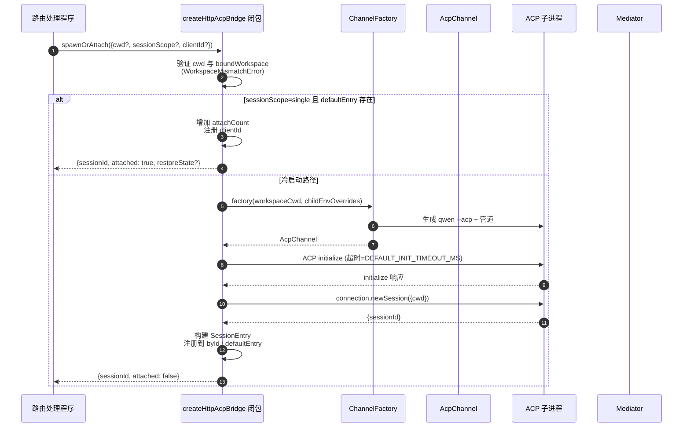
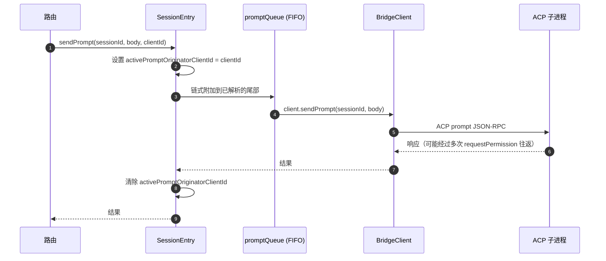
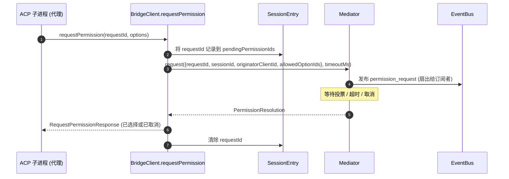
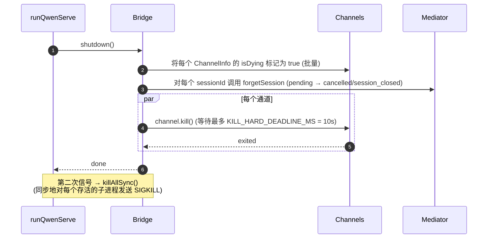

# ACP Bridge

## 概述

`packages/acp-bridge/` 负责守护进程 HTTP 层与 ACP 子进程之间的边界。它由 `packages/cli/src/serve/`（即 `qwen serve` 守护进程）使用，并在 #4175 F1 步骤 3 中提取出来，以便未来的消费者（`channels/base/AcpBridge.ts`，VS Code IDE 扩展）无需触及 CLI 包即可使用相同的桥接核心。

该桥接提供了一个 `HttpAcpBridge` 实例、一个与 ACP 子进程通信的 `AcpChannel`、在该通道上多路复用的会话、每个会话的 `EventBus`、一个 `MultiClientPermissionMediator`、一个 `BridgeFileSystem` 适配器，以及面向 ACP 的辅助方法（`spawnOrAttach`、`loadSession`、`resumeSession`、`sendPrompt`、`cancelSession`、`respondToPermission`，再加上用于工作区状态和 MCP 重启的 extMethod RPC）。

## 职责

- 通过可插拔的 `ChannelFactory` 生成或附加到 ACP 子进程。默认工厂：`defaultSpawnChannelFactory`（子进程 `qwen --acp`）。测试中注入 `inMemoryChannel`。
- 维护 `aliveChannels`（通道注册表）和 `byId`（会话注册表）。
- 通过 `connection.newSession()` 将 N 个 HTTP 端会话多路复用到单个 ACP 子进程上。
- 通过 `promptQueue` 序列化每个会话的提示（ACP 强制每个会话只能有一个活跃的提示）。
- 对 `setSessionModel` 调用实现每个会话的 FIFO 队列，以确保使用不同模型的并发附加不会与代理发生竞争。
- 每个会话的 `EventBus`，用于驱动 `GET /session/:id/events`（参见 [`10-event-bus.md`](./10-event-bus.md)）。
- 权限流程：`BridgeClient.requestPermission` → `MultiClientPermissionMediator.request` → 扇出 → 投票收集 → ACP 响应（参见 [`04-permission-mediation.md`](./04-permission-mediation.md)）。
- 文件 I/O：用于 ACP `readTextFile` / `writeTextFile` 调用的 `BridgeFileSystem` 适配器（参见 [`07-workspace-filesystem.md`](./07-workspace-filesystem.md)）。
- 用于工作区级别状态（`/workspace/mcp`、`/workspace/skills`、`/workspace/providers`）和 MCP 重启的 extMethod RPC。
- 生命周期：每个通道优雅的 `shutdown()` 并带有 `KILL_HARD_DEADLINE_MS`（10s）；在第二次信号强制退出时使用同步的 `killAllSync()`。

## 架构

**公共入口**：`packages/acp-bridge/src/bridge.ts` 中的 `createHttpAcpBridge(opts: BridgeOptions): HttpAcpBridge`。

**关键类型**：

| 类型                              | 文件                      | 角色                                                                                                                                                                                                                     |
| ------------------------------- | ------------------------- | -------------------------------------------------------------------------------------------------------------------------------------------------------------------------------------------------------------------------- |
| `HttpAcpBridge`                 | `bridgeTypes.ts`          | 公共接口：`spawnOrAttach`、`loadSession`、`resumeSession`、`sendPrompt`、`cancelSession`、`subscribeEvents`、`respondToPermission`、`getWorkspaceMcpStatus`、`restartMcpServer`、`shutdown`、`killAllSync`，…… |
| `BridgeSession`                 | `bridgeTypes.ts`          | 返回给 HTTP 处理程序的 `{ sessionId, workspaceCwd, attached, clientId?, createdAt? }`                                                                                                                                  |
| `BridgeOptions`                 | `bridgeOptions.ts`        | 构造时配置（参见[配置](#configuration)）                                                                                                                                                                           |
| `AcpChannel`                    | `channel.ts`              | `{ stream, kill(), killSync(), exited }` — 一个 ACP NDJSON 通道                                                                                                                                                      |
| `ChannelFactory`                | `channel.ts`              | `(workspaceCwd, childEnvOverrides?) => Promise<AcpChannel>`                                                                                                                                                           |
| `BridgeClient`                  | `bridgeClient.ts`         | 包装一个 ACP `ClientSideConnection`；实现 ACP `Client`（`requestPermission`、`readTextFile`、`writeTextFile`、`sessionUpdate`、`extNotification`）                                                              |
| `EventBus`                      | `eventBus.ts`             | 每个会话的内存中发布/订阅系统。参见 [`10-event-bus.md`](./10-event-bus.md)                                                                                                                                     |
| `MultiClientPermissionMediator` | `permissionMediator.ts`   | 四种策略的调解器。参见 [`04-permission-mediation.md`](./04-permission-mediation.md)                                                                                                                                     |

**内部状态（闭包在 `createHttpAcpBridge` 内）**：

| 状态              | 形状                             | 用途                                                                                                                                                                                                                                                                                                                                              |
| ----------------- | -------------------------------- | ------------------------------------------------------------------------------------------------------------------------------------------------------------------------------------------------------------------------------------------------------------------------------------------------------------------------------------------------- |
| `aliveChannels`   | `Map<string, ChannelInfo>`       | 通道注册表，以通道 ID 为键。每个 `ChannelInfo` 包含 `channel`、`connection`、`client`（每个通道一个 `BridgeClient`）、`sessionIds: Set<string>`、`pendingRestoreIds`、`statusClosedReject?`、`isDying: boolean`                                                                                                                            |
| `byId`            | `Map<string, SessionEntry>`      | 会话注册表，以 sessionId 为键。每个 `SessionEntry` 包含 `channel`、`connection`、`events: EventBus`、`promptQueue: Promise<void>`、`modelChangeQueue: Promise<void>`、`pendingPermissionIds: Set<string>`、`clientIds: Map<string, count>`、`activePromptOriginatorClientId?`、`attachCount`、`spawnOwnerWantedKill`、`restoreState?`、`sessionLastSeenAt?`、`clientLastSeenAt: Map<string, ms>` |
| `defaultEntry`    | `SessionEntry \| null`           | 当 `sessionScope: 'single'` 时使用的“单个”会话                                                                                                                                                                                                                                 |
| `defaultPolicy`   | `PermissionPolicy`               | 通过 `BridgeOptions.permissionPolicy` 配置                                                                                                                                                                                                                                         |
| `mediator`        | `MultiClientPermissionMediator`  | 每个桥接实例一个                                                                                                                                                                                                                                                                    |
| 常量              | —                                | `DEFAULT_INIT_TIMEOUT_MS = 10_000`、`MCP_RESTART_TIMEOUT_MS = 300_000`、`DEFAULT_MAX_SESSIONS = 20`、`MAX_EVENT_RING_SIZE = 1_000_000`、`DEFAULT_PERMISSION_TIMEOUT_MS = 5min`、`DEFAULT_MAX_PENDING_PER_SESSION = 64`                                                                                          |

**`isDying` 不变量**：任何关闭路径必须在 `await channel.kill()` **之前**同步设置 `ChannelInfo.isDying = true`。`ensureChannel` 将正在关闭的通道视为不存在并生成一个新的。如果没有这个标志，在 SIGTERM 宽限窗口（长达 10 秒）内到达的并发 `spawnOrAttach` 将附加到一个即将关闭的传输上，调用者的 sessionId 将在后续所有请求中返回 404。**设置点**（必须保持同步）：`ensureChannel`（初始化失败 + 延迟关闭重新检查）、`doSpawn`（空通道上 newSession 失败）、`killSession`（最后一个会话离开）、`shutdown`（批量）。

**`channelInfo` 保留不变量**：在设置 `isDying = true` 时 **不要** 清除 `channelInfo`。`killAllSync` 仍必须在 SIGTERM 宽限窗口内找到该通道，以便在 `process.exit(1)` 时发送 SIGKILL。`aliveChannels` 会保留该正在关闭的条目，直到 `channel.exited` 触发。

**BridgeClient 有界缓冲**：在 `BridgeClient` 上到达的 ACP `extNotification` 帧，如果其 sessionId 尚未存在于 `byId` 中（因为 `connection.newSession` 的响应尚未返回，但 `newSession` 内部的 MCP 发现已经触发了预算事件），将被缓冲到一个提前事件队列中，该队列上限为 `MAX_EARLY_EVENT_SESSIONS = 64` × `MAX_EARLY_EVENTS_PER_SESSION = 32` × `EARLY_EVENT_TTL_MS = 60_000`。最坏情况下大约占用 400 KB 堆内存。如果没有缓冲，新会话的第一个 SSE 重放环槽位将丢失在其创建期间触发的事件。

## 工作流

### `spawnOrAttach`（主要入口点）

关键点：

- 当 `sessionScope='single'` 且存在 `defaultEntry` 时，仅增加 `attachCount`、注册 `clientId`，并返回 `attached: true`。
- 冷启动路径会运行 ChannelFactory，执行 ACP `initialize`（`DEFAULT_INIT_TIMEOUT_MS=10s`），调用 `connection.newSession({cwd})`，然后注册新的 `SessionEntry`。
- 当 `byId.size >= maxSessions` 时抛出 `SessionLimitExceededError`。
- 如果 `X-Qwen-Client-Id` 不在 `[A-Za-z0-9._:-]{1,128}` 范围内，则抛出 `InvalidClientIdError`。
- `server.ts` 中的断线回收器通过 `attachCount`/`spawnOwnerWantedKill` 追踪 spawn 所有者，以避免在 spawn 所有者已断开但其他客户端已附加时拆除会话（参见 review #3889 BQ9tV）。

### 提示序列化

队列尾部失败会被 **吞掉**，这样前一个 prompt 的拒绝不会毒化后续 prompt；原始调用者仍然会从自己返回的 promise 中收到拒绝。缓存在会话上的 `transportClosedReject` 会使 prompt promise 与 `channel.exited` 竞争，从而在子进程崩溃时立即显示，而不是挂起。

### 权限流程（高级）

当线上投票试图通过常规 `optionId` 字段注入 `CANCEL_VOTE_SENTINEL` 时，会在调解器之前抛出 `InvalidPermissionOptionError`——该 sentinel 是桥接唯一用于短路请求为 `cancelled / agent_cancelled` 的逃生舱，并且不得意外地通过线上到达。参见 [`04-permission-mediation.md`](./04-permission-mediation.md)。

### 关闭

## 通道工厂

`AcpChannel`（`channel.ts`）是桥接的传输抽象。生产环境使用 `spawnChannel.ts` 中的 `defaultSpawnChannelFactory`，它将 `qwen --acp` 作为子进程运行，并配有 stdio 管道对。测试中注入 `inMemoryChannel` 以在进程中运行代理。桥接对底层机制一无所知——它只需要 `{ stream, kill, killSync, exited }`。

`ChannelFactory` 接受 `childEnvOverrides`，以便每个守护进程句柄可以传递自己的 MCP 预算环境变量（`QWEN_SERVE_MCP_CLIENT_BUDGET`、`QWEN_SERVE_MCP_BUDGET_MODE`），而无需修改 `process.env`（如果两个嵌入式守护进程在同一 Node 进程中运行，修改会导致竞争）。

## 状态与生命周期

- 桥接构造是同步的；第一次 `spawnOrAttach` 冷启动 ACP 子进程。
- 在 `sessionScope: 'single'` 下，`defaultEntry` 存在于桥接的整个生命周期；当 `sessionIds.size === 0`（在 `killSession` 之后）且 `isDying` 变为 true 时，通道被回收。
- `MAX_EVENT_RING_SIZE = 1_000_000` 是 `BridgeOptions.eventRingSize` 的软上限，用于在每次会话约 500 MB 的 OOM 之前捕获操作员输入错误。
- `DEFAULT_PERMISSION_TIMEOUT_MS = 5 * 60 * 1000` 防止卡住的权限请求无限期阻塞每个会话的 `promptQueue`。
- `DEFAULT_MAX_PENDING_PER_SESSION = 64` 与 `DEFAULT_MAX_SUBSCRIBERS` 对应；过多的 `requestPermission` 调用将以 cancelled 状态解决并在 stderr 上发出警告。

## 依赖关系

| 上游                                                                                         | 下游                                             |
| -------------------------------------------------------------------------------------------- | ------------------------------------------------ |
| `@agentclientprotocol/sdk` — `ClientSideConnection`、`PROTOCOL_VERSION`、ACP 类型             | `packages/cli/src/serve/`（守护进程）            |
| `@qwen-code/qwen-code-core` — `ApprovalMode`、`TrustGateError`、`getCurrentGeminiMdFilename` | `packages/channels/base/`（计划中，F4）          |
| `node:crypto`、`node:fs`、`node:path`                                                        | `packages/vscode-ide-companion/`（计划中，F4）    |

## 配置

`BridgeOptions`（`bridgeOptions.ts`）：

| 键                                           | 默认值                                              | 用途                                                                                                                   |
| -------------------------------------------- | --------------------------------------------------- | ------------------------------------------------------------------------------------------------------------------------ |
| `boundWorkspace`                              | （必需）                                            | 桥接强制使用的规范工作区路径                                                                                             |
| `sessionScope`                                | `'single'`                                          | `'single'` 在所有客户端之间共享一个会话；`'thread'` 为每个对话线程创建一个单独的会话                                       |
| `channelFactory`                              | `defaultSpawnChannelFactory`                        | 可插拔的 ACP 子进程工厂                                                                                                 |
| `initializeTimeoutMs`                         | `DEFAULT_INIT_TIMEOUT_MS = 10_000`                  | ACP `initialize` 握手超时                                                                                               |
| `maxSessions`                                 | `DEFAULT_MAX_SESSIONS = 20`                         | `byId.size` 上限。`0` / `Infinity` = 无限制；NaN/负数则抛出                                                             |
| `eventRingSize`                               | `DEFAULT_RING_SIZE`（来自 `eventBus.ts`）           | 每个会话的事件环；软上限为 `MAX_EVENT_RING_SIZE`                                                                         |
| `permissionResponseTimeoutMs`                 | `DEFAULT_PERMISSION_TIMEOUT_MS = 5 分钟`            | 每个请求的调解器挂钟超时                                                                                                 |
| `maxPendingPermissionsPerSession`             | `DEFAULT_MAX_PENDING_PER_SESSION = 64`              | 针对高吞吐量代理的反压                                                                                                   |
| `childEnvOverrides`                           | `{}`                                                | 每个句柄的 ACP 子进程环境变量添加/擦除                                                                                   |
| `persistApprovalMode`、`persistDisabledTools` | —                                                   | 用于 Wave 4 变更路由的设置写入钩子                                                                                       |
| `contextFilename`                             | 来自 `settings.json` 的 `context.fileName`          | 覆盖 `getCurrentGeminiMdFilename`                                                                                        |
| `statusProvider`                              | （无）                                              | 守护进程托管的预检单元格（`DaemonStatusProvider`）                                                                       |
| `fileSystem`                                  | （无）                                              | 用于 ACP `readTextFile` / `writeTextFile` 的 `BridgeFileSystem` 适配器                                                  |
| `permissionPolicy`                            | 来自 `settings.json` 的 `policy.permissionStrategy` | 可选值：`first-responder` / `designated` / `consensus` / `local-only`                                                 |
| `permissionConsensusQuorum`                   | 来自 `settings.json`                                | 共识策略的 N 值                                                                                                         |
| `permissionAudit`                             | `createNoOpPermissionAuditPublisher()`              | 连接到 `PermissionAuditRing` 以获取审计跟踪                                                                          |
| `channelIdleTimeoutMs`                        | `0`                                                 | 在最后一个会话关闭后，保持 ACP 子进程存活的毫秒数                                                                       |
## 额外的 bridge 方法

除了核心的 `spawnOrAttach`、`sendPrompt`、`cancelSession`、
`respondToPermission`、`loadSession` 和 `resumeSession` 调用之外，
`HttpAcpBridge` 接口现在包含以下面向守护进程的辅助方法：

| 方法                                                         | 用途                                      |
| ------------------------------------------------------------ | ----------------------------------------- |
| `generateSessionRecap(sessionId, context?)`                  | 生成一行会话摘要。                        |
| `generateSessionBtw(sessionId, question, signal?, context?)` | 回答一个附带问题（btw prompt）。          |
| `executeShellCommand(sessionId, command, signal?, context?)` | 在守护进程主机上运行 shell 命令。         |
| `getSessionContextUsageStatus(sessionId, opts?)`             | 返回上下文窗口使用情况。                  |
| `getSessionSupportedCommandsStatus(sessionId)`               | 返回可用的斜杠命令。                      |
| `getSessionTasksStatus(sessionId)`                           | 返回后台任务快照。                        |
| `getSessionStatsStatus(sessionId)`                           | 返回会话使用统计信息。                    |
| `setSessionApprovalMode(sessionId, mode, opts, context?)`    | 更新会话的审批模式。                      |
| `detachClient(sessionId, clientId?)`                         | 显式分离客户端。                          |
| `addRuntimeMcpServer(name, config, originatorClientId)`      | 在运行时添加 MCP 服务器。                 |
| `removeRuntimeMcpServer(name, originatorClientId)`           | 在运行时移除 MCP 服务器。                 |
| `manageMcpServer(serverName, action, originatorClientId)`    | 启用/禁用/认证/清除认证。                |
| `generateWorkspaceAgent(description, originatorClientId)`    | 使用 AI 生成子代理定义。                  |
| `preheat()`                                                  | 在第一个会话之前预热 ACP 子进程。         |
| `getSessionLastEventId(sessionId)`                           | 读取会话的单调递增事件 ID。               |
| `getWorkspaceToolsStatus()`                                  | 返回内置工具注册表快照。                  |
| `getWorkspaceMcpToolsStatus(serverName)`                     | 返回特定 MCP 服务器的工具。              |

`BridgeSpawnRequest.sessionScope` 已从 `'per-client'` 重命名为
`'thread'`。`BridgeRestoredSession` 现在包含 `compactedReplay`、
`liveJournal` 和 `lastEventId`。`BridgeClientRequestContext` 是通过 bridge 调用传递的请求
上下文；它包含 `clientId`、
`fromLoopback: boolean` 和 `promptId`。

## 注意事项与已知限制

- `MCP_RESTART_TIMEOUT_MS = 300_000`（5 分钟）—— `/workspace/mcp/:server/restart` 的 bridge 超时时间故意设置得很大，因为 stdio 服务器的 `McpClientManager.MAX_DISCOVERY_TIMEOUT_MS` 可能长达 5 分钟。如果期限过短，在 ACP 子进程后台持续重连时会产生错误的超时。
- `BridgeOptions.eventRingSize > 1_000_000` 在构造时会抛出异常。
- `connection.unstable_resumeSession` 通过稳定的 `session_resume` 守护进程能力暴露；`unstable_session_resume` 仍然作为针对旧 SDK 的已弃用兼容性别名进行通告。客户端应通过功能检测来使用 `session_resume`。
- bridge 包名为 `@qwen-code/acp-bridge`，并通过 `serve/event-bus.ts`、`serve/status.ts`、`serve/httpAcpBridge.ts` 中的重导出 shim 进行消费，以保持与 F1 之前导入路径的向后兼容。新代码应直接导入。

## 参考

- `packages/acp-bridge/src/bridge.ts`（特别是第 350 行之后的 `createHttpAcpBridge`）
- `packages/acp-bridge/src/bridgeClient.ts`
- `packages/acp-bridge/src/bridgeTypes.ts`
- `packages/acp-bridge/src/bridgeOptions.ts`
- `packages/acp-bridge/src/channel.ts`
- `packages/acp-bridge/src/spawnChannel.ts`
- `packages/acp-bridge/src/bridgeErrors.ts`
- Issues: [#3803](https://github.com/QwenLM/qwen-code/issues/3803), [#4175](https://github.com/QwenLM/qwen-code/issues/4175).