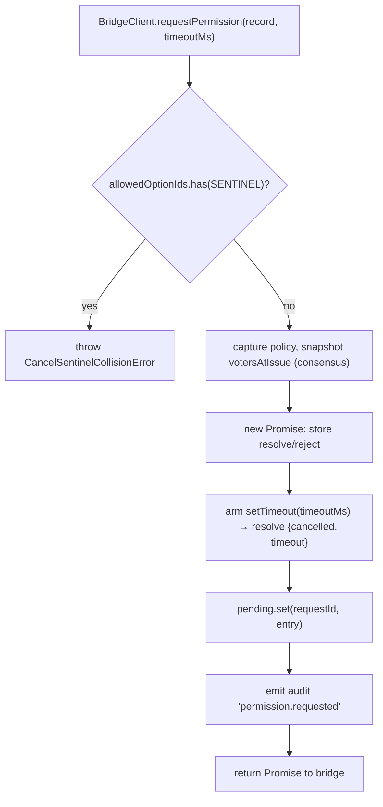
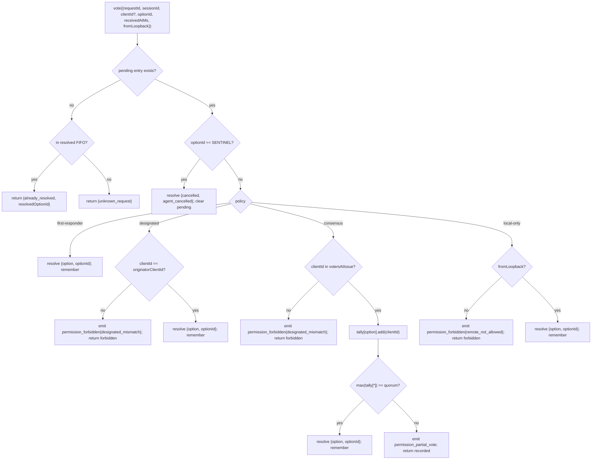

# 多客户端权限仲裁

## 概述

当 ACP 子进程的 agent 调用 `requestPermission` 时，daemon 不会简单地将请求转发给某一个客户端。在 `sessionScope: 'single'` 模式下，所有已连接的客户端都能看到该请求，任意一个客户端均可响应。若缺乏仲裁机制，延迟投票将无处路由，两个客户端可能对同一请求产生竞争，且单个恶意客户端可以覆盖发起方的决策。

`MultiClientPermissionMediator`（`packages/acp-bridge/src/permissionMediator.ts`）实现了 `PermissionMediator` 契约（`packages/acp-bridge/src/permission.ts`），并负责管理 bridge 中所有待处理和已解决的权限状态。它通过 `PermissionPolicy` 中声明的四种策略之一来分发投票：

| 策略              | 解决规则                                                                                                                | 使用场景                                             |
| ----------------- | ----------------------------------------------------------------------------------------------------------------------- | ---------------------------------------------------- |
| `first-responder` | 第一个有效投票获胜；后续投票者收到 `permission_already_resolved`。                                                      | 跨客户端实时协作 UI（默认）。                        |
| `designated`      | 只有 prompt 的 `originatorClientId` 可以解决；其他人看到 `permission_forbidden{designated_mismatch}`。                  | 每个租户的 SaaS 场景，UI 层必须拥有自己的审批权。    |
| `consensus`       | 在 v1 客户端 id 快照中达到 N-of-M 法定人数；中间的 `permission_partial_vote` 事件让 UI 可以渲染进度。                  | 企业变更审核场景，需要两位操作员同意。               |
| `local-only`      | 拒绝任何非 loopback 的投票者；阻塞直到 loopback 客户端解决。                                                           | 工作站场景，远程控制绝不能授予权限提升。             |

> **v1 安全限制**：`X-Qwen-Client-Id` 由客户端自行上报。`designated` 和
> `consensus` 尚未实现持有证明（proof-of-possession）。能够观察到
> `originatorClientId` 的客户端可以重复使用该 id。`{outcome:'cancelled'}` 也会
> 在策略分发之前经过取消哨兵路由，因此即使是 `local-only` 也无法将取消视为
> 受策略保护的解决操作。如需强隔离，请将 daemon 绑定到 loopback，或将其置于
> 经过身份验证的反向代理之后。参见
> [安全说明：v1 客户端身份为自行上报](#security-note-v1-client-identity-is-self-reported)。

## 职责

- 跟踪所有待处理请求（`request → vote → resolved` 生命周期）。
- 为每个请求启动和停止挂钟超时（**N1 不变量**：超时必须在 `request()` 内部同步启动，这样立即取消的 session 不会泄漏永久挂起的 closure）。
- 通过 `request()` 时捕获的策略分发投票（在飞行中的请求期间更改 daemon 策略不会影响正在进行的请求）。
- 维护有界 FIFO（`MAX_RESOLVED_PERMISSION_RECORDS = 512`）记录最近解决的请求，使重复投票得到结构化的 `already_resolved` 响应而非 `unknown_request`。
- 在每个 session 的 EventBus 上发出 `permission_partial_vote`（consensus）和 `permission_forbidden`（designated / consensus / local-only）。
- 在 session 销毁时通过 `forgetSession(sessionId)` 将待处理请求解决为 `{kind: 'cancelled', reason: 'session_closed'}`。
- 拒绝通过 wire 注入 `CANCEL_VOTE_SENTINEL` 的恶意或意外行为（`InvalidPermissionOptionError`），以及 agent 发布的选项标签中包含该哨兵的情况（`CancelSentinelCollisionError`）。

## 架构

### 公开接口

```ts
interface PermissionMediator {
  readonly policy: PermissionPolicy;
  request(
    record: PermissionRequestRecord,
    timeoutMs: number,
  ): Promise<PermissionResolution>;
  vote(vote: PermissionVote): PermissionVoteOutcome;
  forgetSession(sessionId: string): void;
}
```

`MultiClientPermissionMediator` 额外提供：`peekSessionFor(requestId)`、`pendingCount(sessionId)`、内部审计发布器等。`BridgeClient` 仅依赖 `request()` 部分（结构子类型——参见 `bridgeClient.ts`）。

### `PermissionPolicy` 和 `PermissionVoteOutcome`

```ts
type PermissionPolicy =
  | 'first-responder'
  | 'designated'
  | 'consensus'
  | 'local-only';

type PermissionVoteOutcome =
  | { kind: 'resolved'; resolvedOptionId: string }
  | { kind: 'recorded'; votesNeeded: number } // consensus partial
  | { kind: 'already_resolved'; resolvedOptionId: string }
  | { kind: 'forbidden'; reason: 'designated_mismatch' | 'remote_not_allowed' }
  | { kind: 'unknown_request' };

type PermissionResolution =
  | { kind: 'option'; optionId: string }
  | {
      kind: 'cancelled';
      reason: 'timeout' | 'session_closed' | 'agent_cancelled';
    };
```

### 取消哨兵

`CANCEL_VOTE_SENTINEL = '__cancelled__'`。bridge 在调用 `mediator.vote` **之前**将投票者的 `{outcome:'cancelled'}` 映射到该哨兵。mediator 在策略分发**之前**路由该哨兵——投票者取消操作在所有策略下均有效，不受 `clientId` / loopback / 成员资格限制。两道防护：

1. **`bridge.ts`** 拒绝 wire 上 `optionId === CANCEL_VOTE_SENTINEL` 的投票，抛出 `InvalidPermissionOptionError`（恶意 wire 客户端不得通过伪造 `optionId` 来注入取消操作）。
2. **`mediator.request`** 拒绝 `allowedOptionIds` 中包含该哨兵的记录，抛出 `CancelSentinelCollisionError`（agent 合法发布 `'__cancelled__'` 作为选项标签时不得伪装成取消操作）。

这一有意为之的跨策略逃生路径已在 `permissionMediator.ts` 中注释说明，以防未来维护者意外移除该旁路逻辑。

### 待处理状态

每个待处理请求以 `requestId` 为键，包含以下内容：

- `policy` — 在 `request()` 时捕获。
- `record: PermissionRequestRecord`（requestId、sessionId、originatorClientId、allowedOptionIds、issuedAtMs）。
- `resolve` / `reject` closure。
- `votesAtIssue`（仅 consensus）— 请求发起时该 session 已注册 `clientId` 的快照；晚于此时到达的投票若不在该集合中则被拒绝。
- `tally`（仅 consensus）— `Map<optionId, Set<clientId>>`，统计每个选项的票数。
- `timeoutHandle` — 在 `request()` 内部启动的 Node timeout（N1 不变量）。
- `auditTrail[]` — 每次投票的审计记录。

### 已解决 FIFO

`MAX_RESOLVED_PERMISSION_RECORDS = 512`。通过 `resolvedOrder.shift()` 按 FIFO 顺序淘汰（DeepSeek review #4335 / 3271627446 — 与 `PermissionAuditRing` 一致）。仅存储 `{requestId, sessionId, outcome}`，因此 512 条记录在正常 UI 重连/竞争窗口期内保持在 100 KB 以内。

## 工作流

### `request()`（N1 不变量）



计时器在条目对外可见之前就已启动。若不这样做，在 `pending.set` 和 `setTimeout` 之间到达的 `forgetSession` 会使该条目以无超时状态永久挂起——bridge 的每个 session 的 `promptQueue` 将永远阻塞。

### `vote()` 分发



### `forgetSession()`

在 session 关闭、驱逐和 bridge 关闭时调用。对于每个 `record.sessionId === sessionId` 的待处理条目：

1. 取消超时。
2. 将待处理的 Promise 解决为 `{kind: 'cancelled', reason: 'session_closed'}`。
3. 追加审计记录。
4. 从 `pending` 中移除。

bridge 的 session 销毁路径始终在 channel 关闭窗口**之前**调用 `forgetSession`，以确保待处理权限不会超出其 session 的生命周期。

## 状态与生命周期

- `policy` 按请求捕获。更改 daemon 级别的策略（未来接口）不会影响进行中的请求。
- `votesAtIssue`（consensus）在 `request()` 时捕获；请求发起后连接的客户端可以投票，但若其 `clientId` 在发起时未注册到 session，则其投票将被拒绝，原因为 `designated_mismatch`。这有意复用了 `designated` 策略的 mismatch 原因以保持契约封闭；若 SDK 使用者需要区分两者，未来版本可能会拆分该联合类型。
- 已解决条目在 FIFO 中最多保留 `MAX_RESOLVED_PERMISSION_RECORDS`（512）条。淘汰后，对同一 `requestId` 的重复投票将返回 `{unknown_request}`。
- `permission_partial_vote` 仅在 `consensus` 策略下触发。不要在其他策略下依赖它。
- `permission_forbidden` 在 `designated`、`consensus` 和 `local-only` 下触发——`first-responder` 不触发。

## 依赖关系

- [`03-acp-bridge.md`](./03-acp-bridge.md) — bridge 如何将 `BridgeClient.requestPermission` 连接到 `mediator.request`。
- [`10-event-bus.md`](./10-event-bus.md) — 部分投票和禁止帧如何到达客户端。
- [`09-event-schema.md`](./09-event-schema.md) — `permission_*` 事件的 payload 契约。
- [`08-session-lifecycle.md`](./08-session-lifecycle.md) — 每次 session 终止时调用 `forgetSession()`。
- [`02-serve-runtime.md`](./02-serve-runtime.md) — `PermissionAuditRing`（512 条审计记录的 FIFO）。

## 配置

| 来源                | 参数                                                                                                   | 效果                                  |
| ------------------- | ------------------------------------------------------------------------------------------------------ | ------------------------------------- |
| `settings.json`     | `policy.permissionStrategy`                                                                            | 激活的仲裁策略。                      |
| `settings.json`     | `policy.consensusQuorum`                                                                               | consensus 的 N 值。                   |
| `BridgeOptions`     | `permissionPolicy`, `permissionConsensusQuorum`, `permissionAudit`                                     | 编程式覆盖。                          |
| Capability tag      | `permission_mediation`（始终存在；`modes: ['first-responder', 'designated', 'consensus', 'local-only']`）| 构建支持的策略集。                    |
| Capability envelope | `policy.permission`                                                                                    | 该 daemon 当前运行的激活策略。        |

若未显式配置 `policy.permissionStrategy`，daemon 使用
`first-responder`。`designated`、`consensus` 和 `local-only` 仅在
`settings.json` 中设置后才会生效。

## Consensus 法定人数：默认公式与 M=2 边界情况

当 `consensus` 策略激活且未设置 `policy.consensusQuorum` 时，
mediator 通过 `permissionMediator.ts` 中的 `consensusQuorumFor` 计算
**N = floor(M/2) + 1**：

```ts
Math.max(1, Math.floor(m / 2) + 1);
```

| M（`votersAtIssue.size`） | 默认 N | 行为                          |
| ------------------------- | ------ | ----------------------------- |
| 1                         | 1      | 一位投票者立即解决。          |
| 2                         | 2      | 需要全票同意。                |
| 3                         | 2      | 多数同意。                    |
| 4                         | 3      | 超过半数。                    |
| 5                         | 3      | 多数同意。                    |
| 6                         | 4      | 超过半数。                    |

对于 **M = 2**，票数分裂（A 选 X，B 选 Y）只能通过每个权限的超时来解决：
没有任何选项达到全票，因此请求将等待至 `permissionResponseTimeoutMs`（默认 5 分钟）并解决为
`{cancelled, timeout}`。投票推进路径会将"全票意味着分裂投票超时"的行为记录到 stderr，以供操作员参考。

希望在 M = 2 时使用"第一票获胜"行为的操作员可以显式设置
`policy.consensusQuorum: 1`。更严格的配置（例如要求 M = 4 时全票同意）使用相同字段。

## 启动时策略验证

`runQwenServe.validatePolicyConfig(policyConfig)`
（`packages/cli/src/serve/run-qwen-serve.ts`）在启动时验证合并后的 `settings.json`
`policy.*`，并对操作员错误抛出 `InvalidPolicyConfigError`：

- `policy.permissionStrategy` 已设置但不在四种支持的模式中。
  有效集合在运行时从
  `SERVE_CAPABILITY_REGISTRY.permission_mediation.modes` 派生，这是 capability 声明的唯一来源。
- `policy.consensusQuorum` 已设置但不是正整数。

当 `consensusQuorum` 已设置而 `permissionStrategy !== 'consensus'` 时，还会有一条软性 stderr 警告；否则该覆盖在非 consensus 策略下会被静默忽略。

`InvalidPolicyConfigError` 已导出用于 `instanceof` 测试。`runQwenServe`
使用它来区分操作员配置错误（重新抛出为显式启动失败）和 settings 读取 I/O 失败（回退到默认值）。

## 安全说明：v1 客户端身份为自行上报

`X-Qwen-Client-Id` 由 HTTP 客户端提供。在 v1 中，daemon 验证
格式（`[A-Za-z0-9._:-]{1,128}`）并在 `clientIds` 中跟踪已连接的客户端 id，
但不执行持有证明。任何能够在 SSE 中观察到 `originatorClientId` 的客户端都可以用相同的 id 注册，并在后续请求中冒充该发起方。

策略影响：

- **`first-responder`** 不受影响，因为它不依赖身份。
- **`designated`** 可能被重用 `originatorClientId` 的远程客户端欺骗。
- **`consensus`** 依赖发起时的 `votersAtIssue` 快照；若伪造的 id 在请求发起时已连接，则它可以投票。
- **`local-only`** 对 id 欺骗免疫，因为 `fromLoopback: boolean` 由 daemon 根据连接远端地址标记，而非由客户端提供。

未来的配对 token 机制将从 `POST /session` 签发每个 session 的密钥，并在 `designated` / `consensus` 投票中要求携带。该机制在 v1 中尚不存在。

## 注意事项与已知限制

- **取消哨兵在策略分发之前路由**——这是有意为之，`local-only` daemon 和 `consensus` daemon 都可以被任何发布 `{outcome: 'cancelled'}` 的投票者取消。这已在 `permissionMediator.ts` 中注释说明，是 agent 侧的中止路径。
- **`designated` 和 `consensus` 在 `PermissionVoteOutcome` 中共用 `designated_mismatch`**。mediator 发出独立的审计记录，但 wire 格式是单一的。未来的协议版本可能会拆分该联合类型。
- **匿名投票者（无 `X-Qwen-Client-Id`）** 仅在 `first-responder` 和 `local-only`（loopback）下被接受；`designated` 和 `consensus` 会拒绝它们。
- **跨策略逃生路径**意味着取消不能受策略约束。若某个部署需要受策略约束的取消，这将是未来的契约变更——不要通过路由级别的检查来掩盖问题。
- **`votesAtIssue` 快照语义**意味着，在客户端频繁变动的 consensus 部署中，合法客户端可能因在请求发起后才连接而被拒绝。操作员应在发起变更审核 prompt 之前预先注册协作者的客户端 id。

## 参考资料

- `packages/acp-bridge/src/permission.ts`（冻结的契约）
- `packages/acp-bridge/src/permissionMediator.ts`（F3 mediator 实现）
- `packages/acp-bridge/src/bridgeClient.ts`（使用 `PermissionMediator` 的结构子类型）
- `packages/acp-bridge/src/bridgeErrors.ts`（`CancelSentinelCollisionError`、`InvalidPermissionOptionError`、`PermissionForbiddenError`）
- `packages/cli/src/serve/permission-audit.ts`（审计环 + 发布器）
- Issue: [#4175](https://github.com/QwenLM/qwen-code/issues/4175) F3 系列。
