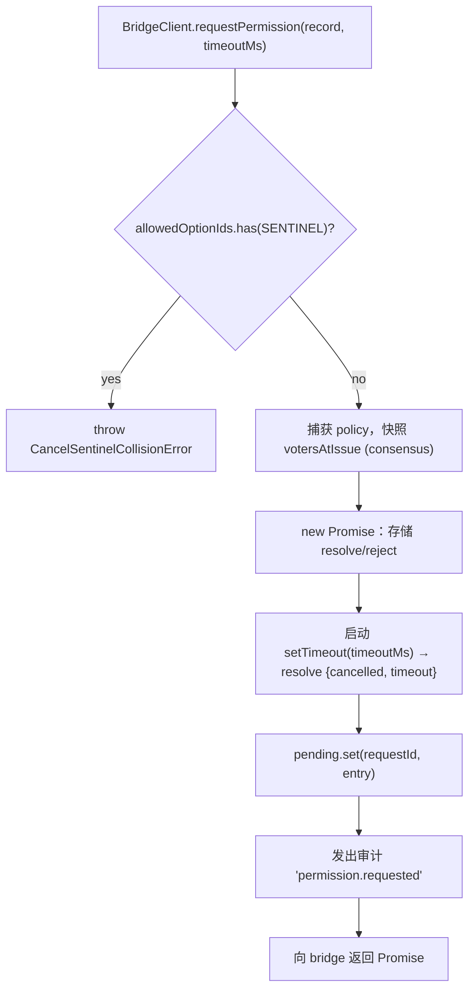
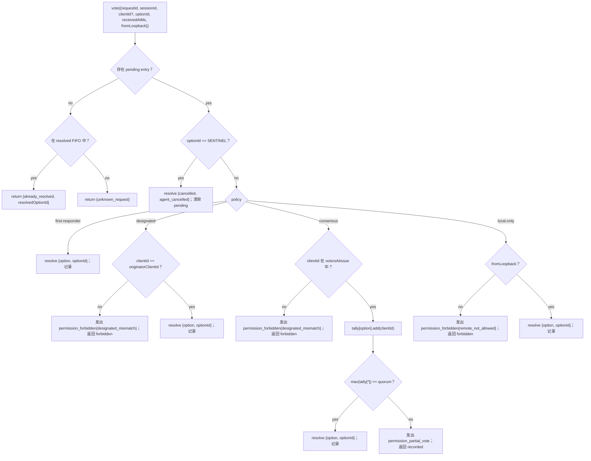

# 多客户端权限仲裁

## 概述

当 ACP 子进程的 agent 调用 `requestPermission` 时，daemon 不会简单地将其转发给单个客户端。在 `sessionScope: 'single'` 下，每个已连接的客户端都会看到该请求，且其中任何一个都可以进行响应。如果没有仲裁机制，迟到的投票将无处可去，两个客户端可能会竞争同一个请求，并且单个恶意客户端可以覆盖发起者的操作。

`MultiClientPermissionMediator`（`packages/acp-bridge/src/permissionMediator.ts`）实现了 `PermissionMediator` 契约（`packages/acp-bridge/src/permission.ts`），并管理 bridge 的所有待处理和已解决的权限状态。它通过 `PermissionPolicy` 中声明的四种策略之一来分发投票：

| 策略              | 解决规则                                                                                                                 | 使用场景                                                                 |
| ----------------- | ------------------------------------------------------------------------------------------------------------------------ | ------------------------------------------------------------------------ |
| `first-responder` | 首个有效投票获胜；后续投票者收到 `permission_already_resolved`。                                                         | 实时跨客户端协作 UX（默认）。                                            |
| `designated`      | 仅提示的 `originatorClientId` 可以解决；其他客户端看到 `permission_forbidden{designated_mismatch}`。                     | 多租户 SaaS，其中 UI 界面必须拥有自己的审批权。                          |
| `consensus`       | 基于 v1 client-id 快照的 M 选 N 法定人数；中间的 `permission_partial_vote` 事件允许 UI 渲染进度。                        | 需要两名操作员同意的企业变更审查。                                       |
| `local-only`      | 拒绝任何非环回（non-loopback）投票者；阻塞直到环回客户端解决。                                                           | 远程控制绝不能授予权限提升的工作站。                                     |

> **v1 安全限制**：`X-Qwen-Client-Id` 是自我报告的。`designated` 和
> `consensus` 目前还没有所有权证明（proof-of-possession）。观察到
> `originatorClientId` 的客户端可以重用该 id。`{outcome:'cancelled'}` 也会在
> 策略分发前通过取消哨兵（cancel sentinel）路由，因此即使是 `local-only`
> 也不能将取消视为受策略保护的解决。为了实现强隔离，请将 daemon 绑定到
> 环回地址或将其放在经过身份验证的反向代理之后。请参阅
> [安全说明：v1 客户端身份是自我报告的](#security-note-v1-client-identity-is-self-reported)。

## 职责

- 跟踪每个待处理的请求（`request → vote → resolved` 生命周期）。
- 启动和取消每个请求的挂钟超时（**N1 不变量**：超时必须在 `request()` 内部同步启动，这样立即取消的 session 就不会泄漏永久待处理的闭包）。
- 通过 `request()` 时捕获的策略分发投票（在飞行中更改 daemon 策略不会影响正在处理中的请求）。
- 维护一个有界的 FIFO（`MAX_RESOLVED_PERMISSION_RECORDS = 512`）用于最近解决的请求，以便重复投票获得结构化的 `already_resolved` 而不是 `unknown_request`。
- 在每个 session 的 EventBus 上发出 `permission_partial_vote`（consensus）和 `permission_forbidden`（designated / consensus / local-only）。
- 在 session 拆除时，通过 `forgetSession(sessionId)` 将待处理请求解析为 `{kind: 'cancelled', reason: 'session_closed'}`。
- 拒绝通过 wire（`InvalidPermissionOptionError`）和 agent 发布的选项标签（`CancelSentinelCollisionError`）恶意或意外注入 `CANCEL_VOTE_SENTINEL`。

## 架构

### 公共接口

```ts
interface PermissionMediator {
  readonly policy: PermissionPolicy;
  request(
    record: PermissionRequestRecord,
    timeoutMs: number,
  ): Promise<PermissionResolution>;
  vote(vote: PermissionVote): PermissionVoteOutcome;
  forgetSession(sessionId: string): void;
}
```

`MultiClientPermissionMediator` 增加了：`peekSessionFor(requestId)`、`pendingCount(sessionId)`、内部审计发布器等。`BridgeClient` 仅依赖 `request()` 这一半（结构化子类型 — 参见 `bridgeClient.ts`）。

### `PermissionPolicy` 和 `PermissionVoteOutcome`

```ts
type PermissionPolicy =
  | 'first-responder'
  | 'designated'
  | 'consensus'
  | 'local-only';

type PermissionVoteOutcome =
  | { kind: 'resolved'; resolvedOptionId: string }
  | { kind: 'recorded'; votesNeeded: number } // consensus partial
  | { kind: 'already_resolved'; resolvedOptionId: string }
  | { kind: 'forbidden'; reason: 'designated_mismatch' | 'remote_not_allowed' }
  | { kind: 'unknown_request' };

type PermissionResolution =
  | { kind: 'option'; optionId: string }
  | {
      kind: 'cancelled';
      reason: 'timeout' | 'session_closed' | 'agent_cancelled';
    };
```

### Cancel sentinel

`CANCEL_VOTE_SENTINEL = '__cancelled__'`。Bridge 在调用 `mediator.vote` **之前**，将投票者的 `{outcome:'cancelled'}` 映射到此哨兵。Mediator 在策略分发**之前**路由该哨兵 — 投票者取消在每种策略下都有效，无论 `clientId` / 环回 / 成员资格如何。两个防护：

1. **`bridge.ts`** 拒绝 `optionId === CANCEL_VOTE_SENTINEL` 的 wire 投票，并抛出 `InvalidPermissionOptionError`（恶意 wire 客户端不能通过谎报 `optionId` 来注入取消）。
2. **`mediator.request`** 拒绝 `allowedOptionIds` 包含该哨兵的记录，并抛出 `CancelSentinelCollisionError`（合法发布 `'__cancelled__'` 作为选项标签的 agent 不能进行伪装）。

这种故意的跨策略逃逸记录在 `permissionMediator.ts` 中，以免未来的维护者意外移除该旁路。

### Pending state

每个待处理请求以 `requestId` 为键，并包含：

- `policy` — 在 `request()` 时捕获。
- `record: PermissionRequestRecord`（requestId, sessionId, originatorClientId, allowedOptionIds, issuedAtMs）。
- `resolve` / `reject` 闭包。
- `votesAtIssue`（仅限 consensus）— 在发出时 session 已注册的 `clientIds` 快照；如果后续投票不在此集合中，则会被拒绝。
- `tally`（仅限 consensus）— `Map<optionId, Set<clientId>>`，统计每个选项的投票数。
- `timeoutHandle` — 在 `request()` 内部启动的 Node 超时（N1 不变量）。
- `auditTrail[]` — 每次投票的审计记录。

### Resolved FIFO

`MAX_RESOLVED_PERMISSION_RECORDS = 512`。通过 `resolvedOrder.shift()` 进行 FIFO 驱逐（DeepSeek review #4335 / 3271627446 — 镜像 `PermissionAuditRing`）。仅存储 `{requestId, sessionId, outcome}`，因此 512 条记录在正常的 UI 重连/竞争窗口中保持在 100 KB 以下。

## 工作流

### `request()`（N1 不变量）



计时器在 entry 甚至对其他地方可见**之前**就已启动。如果没有这一步，在 `pending.set` 和 `setTimeout` 之间到达的 `forgetSession` 会使 entry 处于没有超时的待处理状态 — bridge 的每个 session 的 `promptQueue` 将永远挂起。

### `vote()` 分发



### `forgetSession()`

在 session 关闭、驱逐和 bridge 关闭时调用。对于 `record.sessionId === sessionId` 的每个待处理 entry：

1. 取消超时。
2. 使用 `{kind: 'cancelled', reason: 'session_closed'}` 解决待处理的 Promise。
3. 追加审计记录。
4. 从 `pending` 中移除。

Bridge 的 session 拆除路径始终在 channel-kill 窗口**之前**调用 `forgetSession`，以确保待处理的权限不会比其 session 存活得更久。

## 状态与生命周期

- `policy` 是按请求捕获的。更改 daemon 全局策略（未来接口）不会影响正在处理中的请求。
- `votesAtIssue`（consensus）在 `request()` 时捕获；在请求之后到达的客户端可以投票，但如果他们的 `clientId` 在发出时未注册到 session，他们的投票将作为 `designated_mismatch` 被拒绝。这故意重用了 `designated` 策略的不匹配原因以保持契约封闭；如果 SDK 消费者需要区分，未来版本可能会拆分该联合类型。
- 已解决的 entry 在 FIFO 中最多存活 `MAX_RESOLVED_PERMISSION_RECORDS`（512）条。驱逐后，对同一 `requestId` 的重复投票将返回 `{unknown_request}`。
- `permission_partial_vote` 仅在 `consensus` 下触发。不要在任何其他策略下依赖它。
- `permission_forbidden` 在 `designated`、`consensus` 和 `local-only` 下触发 — 不在 `first-responder` 下触发。

## 依赖项

- [`03-acp-bridge.md`](./03-acp-bridge.md) — bridge 如何将 `BridgeClient.requestPermission` 连接到 `mediator.request`。
- [`10-event-bus.md`](./10-event-bus.md) — partial-vote 和 forbidden 帧如何到达客户端。
- [`09-event-schema.md`](./09-event-schema.md) — `permission_*` 事件的 payload 契约。
- [`08-session-lifecycle.md`](./08-session-lifecycle.md) — 每次 session 终止时都会调用 `forgetSession()`。
- [`02-serve-runtime.md`](./02-serve-runtime.md) — `PermissionAuditRing`（512 条审计记录的 FIFO）。

## 配置

| 来源              | 配置项                                                                                               | 效果                                |
| ----------------- | ---------------------------------------------------------------------------------------------------- | ----------------------------------- |
| `settings.json`   | `policy.permissionStrategy`                                                                          | 活动的 mediator 策略。              |
| `settings.json`   | `policy.consensusQuorum`                                                                             | consensus 的 N。                    |
| `BridgeOptions`   | `permissionPolicy`, `permissionConsensusQuorum`, `permissionAudit`                                   | 编程式覆盖。                        |
| Capability tag    | `permission_mediation` (always; `modes: ['first-responder', 'designated', 'consensus', 'local-only']`) | 构建支持的集合。                    |
| Capability envelope | `policy.permission`                                                                                | 此 daemon 正在运行的活动策略。      |

如果未显式配置 `policy.permissionStrategy`，daemon 将使用
`first-responder`。`designated`、`consensus` 和 `local-only` 仅在
`settings.json` 中设置时生效。

## Consensus 法定人数：默认公式与 M=2 边界情况

当 `consensus` 策略处于活动状态且未设置 `policy.consensusQuorum` 时，
mediator 通过 `permissionMediator.ts` 中的 `consensusQuorumFor` 计算
**N = floor(M/2) + 1**：

```ts
Math.max(1, Math.floor(m / 2) + 1);
```

| M (`votersAtIssue.size`) | 默认 N | 行为                        |
| ------------------------ | ------ | --------------------------- |
| 1                        | 1      | 一个投票者立即解决。        |
| 2                        | 2      | 需要一致同意。              |
| 3                        | 2      | 多数。                      |
| 4                        | 3      | 超过半数。                  |
| 5                        | 3      | 多数。                      |
| 6                        | 4      | 超过半数。                  |

对于 **M = 2**，分裂的投票（A 选择 X，B 选择 Y）只能通过每个权限的超时来解决：没有选项达到一致，因此请求将等待直到 `permissionResponseTimeoutMs`（默认 5 分钟）并解决为
`{cancelled, timeout}`。投票推进路径会将这种“一致意味着分裂投票超时”的行为记录到 stderr 供操作员查看。

希望 M = 2 时具有“首个投票获胜”行为的操作员可以显式设置
`policy.consensusQuorum: 1`。更严格的配置（例如要求 M = 4 时一致同意）使用相同的字段。

## 启动时策略验证

`runQwenServe.validatePolicyConfig(policyConfig)`
（`packages/cli/src/serve/run-qwen-serve.ts`）在启动时验证合并后的 `settings.json`
`policy.*`，并在操作员出错时抛出 `InvalidPolicyConfigError`：

- 设置了 `policy.permissionStrategy`，但不在四种支持的模式中。
  有效集在运行时从
  `SERVE_CAPABILITY_REGISTRY.permission_mediation.modes`（能力声明的唯一真实来源）派生。
- 设置了 `policy.consensusQuorum`，但它不是正整数。

当设置了 `consensusQuorum` 而 `permissionStrategy !== 'consensus'` 时，还有一个软 stderr 警告；否则该覆盖将在非 consensus 策略下被静默忽略。

`InvalidPolicyConfigError` 被导出用于 `instanceof` 测试。`runQwenServe`
使用它来区分操作员配置错误（作为显式启动失败重新抛出）和设置读取 I/O 故障（回退到默认值）。

## 安全说明：v1 客户端身份是自我报告的

`X-Qwen-Client-Id` 由 HTTP 客户端提供。在 v1 中，daemon 验证
格式（`[A-Za-z0-9._:-]{1,128}`）并在 `clientIds` 中跟踪附加的客户端 id，但它不执行所有权证明。任何可以在 SSE 中观察到 `originatorClientId` 的客户端都可以使用相同的 id 注册并在后续请求中冒充该发起者。

策略影响：

- **`first-responder`** 不受影响，因为它不依赖身份。
- **`designated`** 可能被重用 `originatorClientId` 的远程客户端欺骗。
- **`consensus`** 基于发出时的 `votersAtIssue` 快照进行门控；如果在发出请求时已附加欺骗 id，则它可以投票。
- **`local-only`** 不受 id 欺骗的影响，因为 `fromLoopback: boolean` 是由 daemon 从连接远程地址打上的时间戳，而不是由客户端提供的。

未来的 pair-token 机制将从 `POST /session` 发出每个 session 的 secret，并在 `designated` / `consensus` 投票中要求提供它。该机制在 v1 中不存在。

## 跨连接投票路由

### 投票传递路径

权限投票可以通过两个独立的传输路径到达 bridge mediator：

1. **ACP 传输（同连接响应）**：`permission_request` bridge 事件作为 `session/request_permission` JSON-RPC 请求传递到所属连接的 session 作用域 SSE/WS 流。客户端在同一连接上使用 JSON-RPC 响应进行回答。调度器的 `resolveClientResponse` 将连接本地的 JSON-RPC id 映射回 bridge 的 `requestId` 并调用 `bridge.respondToSessionPermission`。

2. **REST API（跨连接）**：任何 HTTP 客户端 — 包括不同 ACP 连接上的客户端或根本没有 ACP 连接的客户端 — 都可以通过 `POST /session/:id/permission/:requestId` 进行投票。遗留的 `POST /permission/:requestId` 路由（URL 中没有 session）使用 `peekSessionFor(requestId)` 在委托给相同的 `respondToSessionPermission` 路径之前解析 session。

### 连接本地的权限请求 ID

ACP 传输使用两级 ID 方案在 wire 和 bridge 之间进行映射：

| 层级              | ID 格式                                            | 作用域         | 目的                                                                                          |
| ----------------- | -------------------------------------------------- | -------------- | --------------------------------------------------------------------------------------------- |
| JSON-RPC message id | `_qwen_perm_N` (string, monotonic per connection)    | 连接本地       | 关联 session 流上的 JSON-RPC 请求→响应对。                                                    |
| Bridge request id   | Opaque string (UUID generated by the agent/mediator) | Daemon 全局    | 在所有路由和 mediator 的 pending/resolved 映射中识别权限请求。                                |

bridge 请求 id 通过 `_meta` 供应商扩展传递，以便客户端在通过 REST 路径投票时可以包含它：

```json
{
  "method": "session/request_permission",
  "id": "_qwen_perm_3",
  "params": {
    "sessionId": "<session-id>",
    "toolCall": { "name": "shell" },
    "options": [{ "optionId": "allow", "name": "Allow" }],
    "_meta": { "qwen": { "requestId": "<bridge-request-id>" } }
  }
}
```

连接将映射存储在 `conn.pending: Map<jsonRpcId, PendingClientRequest>` 中，其中 `PendingClientRequest.bridgeRequestId` 是 bridge 级别的 id。

### 投票授权规则

`respondToSessionPermission(sessionId, requestId, response, context)` **按顺序**应用以下检查：

1. **Session 存在性** — `sessionId` 寻址的 session 必须是活动的（`byId.has(sessionId)`）。否则抛出 `SessionNotFoundError`。

2. **跨 session 拒绝** — `peekSessionFor(requestId)` 解析请求实际所属的 session。如果它属于_不同_的 session，则投票被拒绝（返回 `false` / 404），且不暴露 session 成员信息。

3. **未知请求防护** — 当 `peekSessionFor` 返回 `undefined`（请求超时、被 LRU 驱逐或从未存在）时，在任何 `clientId` 验证**之前**拒绝投票（返回 `false` / 404）。这可以防止预言机攻击：如果没有它，使用伪造 `clientId` 的探测可以区分“session 拥有此客户端”（通过验证 → 404）和“客户端未知”（`InvalidClientIdError` → 400）。

4. **客户端身份验证** — `resolveTrustedClientId(entry, context?.clientId)` 验证提供的 `X-Qwen-Client-Id`（REST）或 bridge 打上的 `clientId`（ACP）是否注册在 session 的 `clientIds` 映射中。匿名投票（`clientId === undefined`）直接通过 — 策略分发会处理它们。未注册的 id 抛出 `InvalidClientIdError`（由路由处理器映射为 400）。

5. **取消哨兵执行** — `{ outcome: "selected", optionId: "__cancelled__" }` 的 wire 投票会被 `InvalidPermissionOptionError` 拒绝，以防止哨兵注入。

6. **Mediator `vote()` 分发** — 验证后的投票被转发到 `permissionMediator.vote(...)`，由其应用活动策略（参见 [工作流 → `vote()` 分发](#vote-dispatch)）。
### Loopback 评估

`fromLoopback` 标志是**按请求**评估的，而不是按连接评估的：

- **ACP 传输层**：在 HTTP 层，`reqLoopback` 从 POST 请求的内核级 `req.socket.remoteAddress` 获取并传递给 `dispatcher.handle(conn, msg, sessionHeader, isLoopbackReq(req))`。这意味着，如果权限投票 POST 请求来自与 `initialize` 请求不同的对等节点，它将获得自己独立的 loopback 评估。
- **REST API**：`detectFromLoopback(req)` 评估相同的 socket 级远程地址。

这两条路径都不会从可伪造的 header（如 `X-Forwarded-For`、`Forwarded` 等）中派生 loopback 状态。

### ACP 传输层投票响应格式

客户端使用标准的 JSON-RPC 响应来回复 `session/request_permission`：

**接受（选择一个选项）**：

```json
{
  "jsonrpc": "2.0",
  "id": "_qwen_perm_3",
  "result": {
    "outcome": { "outcome": "selected", "optionId": "allow" }
  }
}
```

**取消**：

```json
{
  "jsonrpc": "2.0",
  "id": "_qwen_perm_3",
  "result": {
    "outcome": { "outcome": "cancelled" }
  }
}
```

**错误响应**（由 dispatcher 映射为取消）：

```json
{
  "jsonrpc": "2.0",
  "id": "_qwen_perm_3",
  "error": { "code": -32000, "message": "user declined" }
}
```

### `resolveClientResponse` 中的故障恢复

当 `bridge.respondToSessionPermission` 抛出异常时（例如投票 body 格式错误），dispatcher 会回退到显式取消（`cancelAbandonedPermission`），从而确保 mediator 永远不会被永久卡住。如果投票和取消都抛出异常（双重故障），`pending` 条目将被**保留**，以便连接最终拆除（`abandonPendingForSession`）时可以进行重试。

## 注意事项与已知限制

- **取消哨兵路由在策略分发之前执行**（设计如此）——任何发布 `{outcome: 'cancelled'}` 的投票者都可以取消 `local-only` daemon 和 `consensus` daemon。这在 `permissionMediator.ts` 中有记录，是 agent 端的终止路径。
- **`designated` 和 `consensus` 在 `PermissionVoteOutcome` 中重载了 `designated_mismatch`**。mediator 会发出单独的审计记录，但网络传输格式（wire shape）是单一的。未来的协议版本可能会拆分该联合类型。
- **匿名投票者（无 `X-Qwen-Client-Id`）** 仅在 `first-responder` 和 `local-only`（loopback）策略下被接受；`designated` 和 `consensus` 会拒绝它们。
- **跨策略逃生通道（Cross-policy escape hatch）** 意味着取消操作不能受策略门控。如果部署需要受策略门控的取消操作，那将是一个未来的契约变更——不要通过路由级检查来掩盖这个问题。
- **`votesAtIssue` 快照语义**意味着，在客户端集合频繁变动的 consensus 部署中，合法客户端可能会因为在请求发出后才连接而被拒绝。运维人员应在发出变更审查提示之前，预先注册协作者的 client id。

## 参考资料

- `packages/acp-bridge/src/permission.ts`（冻结的契约）
- `packages/acp-bridge/src/permissionMediator.ts`（F3 mediator 实现）
- `packages/acp-bridge/src/bridgeClient.ts`（对 `PermissionMediator` 使用结构化子类型）
- `packages/acp-bridge/src/bridge.ts`（`respondToSessionPermission` —— 投票路由与授权）
- `packages/acp-bridge/src/bridgeErrors.ts`（`CancelSentinelCollisionError`、`InvalidPermissionOptionError`、`PermissionForbiddenError`、`InvalidClientIdError`）
- `packages/cli/src/serve/acp-http/dispatch.ts`（`resolveClientResponse` —— ACP 传输层投票路径）
- `packages/cli/src/serve/acp-http/connection-registry.ts`（`AcpConnection.pending` —— 连接本地请求映射）
- `packages/cli/src/serve/routes/permission.ts`（REST 投票路由）
- `packages/cli/src/serve/permission-audit.ts`（审计环 + 发布器）
- Issue：[#4175](https://github.com/QwenLM/qwen-code/issues/4175) F3 系列。