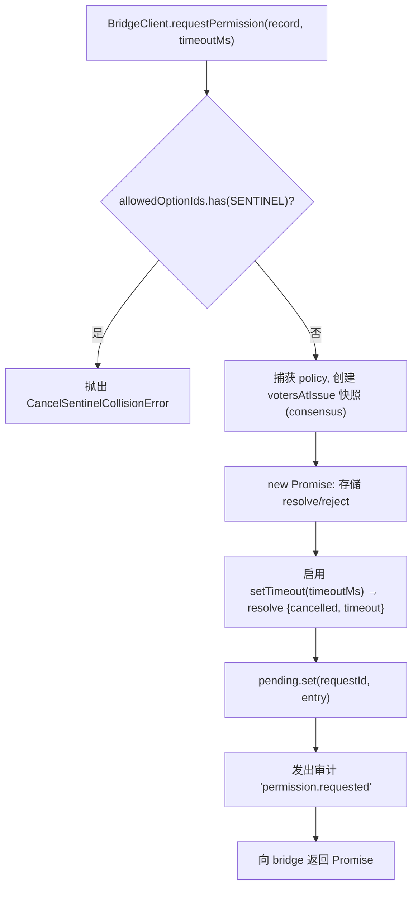
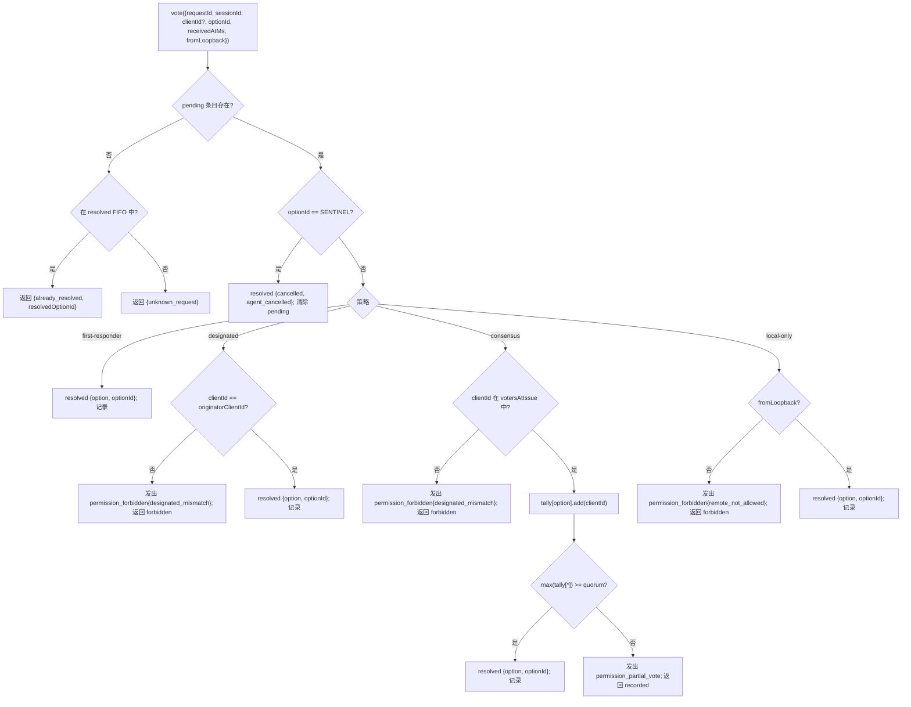

# 多客户端权限协调

## 概述

当 ACP 子代理调用 `requestPermission` 时，守护进程不会简单地将请求转发给某个客户端。在 `sessionScope: 'single'` 模式下，每个已连接的客户端都会看到该请求，并且它们中的任何一个都可以响应。如果没有协调机制，后发出的投票将无处可去，两个客户端可能同时竞争同一个请求，并且单个恶意客户端可以覆盖原始发起方。

`MultiClientPermissionMediator`（位于 `packages/acp-bridge/src/permissionMediator.ts`）实现了 `PermissionMediator` 接口（位于 `packages/acp-bridge/src/permission.ts`），并拥有桥接器中所有待处理和已解析的权限状态。它通过 `PermissionPolicy` 中声明的四种策略之一来分发投票：

| 策略                | 决议规则                                                                                                         | 用例                                                                 |
| ------------------- | ---------------------------------------------------------------------------------------------------------------- | -------------------------------------------------------------------- |
| `first-responder`   | 第一个有效投票获胜；后来的投票者收到 `permission_already_resolved`。                                              | 实时跨客户端协作 UX（默认策略）。                                    |
| `designated`        | 只有提示的 `originatorClientId` 可以决议；其他投票者看到 `permission_forbidden{designated_mismatch}`。          | 多租户 SaaS，其中 UI 层必须拥有自己的审批权。                        |
| `consensus`         | 基于 v1 客户端 ID 快照的 N-of-M 法定人数；中间状态 `permission_partial_vote` 事件让 UI 渲染进度。               | 需要两名操作员同意的企业变更审核。                                   |
| `local-only`        | 拒绝任何非环回投票者；阻塞直到环回客户端决议。                                                                     | 工作站场景，远程控制绝不能授予权限提升。                             |

> **v1 安全限制**：`X-Qwen-Client-Id` 是自报的。`designated` 和
> `consensus` 尚未实现持有证明。观察到
> `originatorClientId` 的客户端可以重用该 ID。`{outcome:'cancelled'}` 也会在策略分发之前通过取消哨兵路由，因此即使是
> `local-only` 也不能将取消视为策略保护的决议。为了实现强隔离，请将守护进程绑定到环回接口或将其置于经过身份验证的反向代理之后。请参阅
> [安全说明：v1 客户端身份是自报的](#安全说明v1-客户端身份是自报的)。

## 职责

- 跟踪每个待处理请求（`请求 → 投票 → 已决议` 生命周期）。
- 启用和解除每个请求的挂钟超时（**N1 不变量**：超时必须在 `request()` 内部同步启用，以便立即取消的会话不会泄漏永久挂起的闭包）。
- 通过 `request()` 时捕获的策略分发投票（运行时更改守护进程策略不会影响进行中的请求）。
- 维护一个最近已决议请求的有界 FIFO（`MAX_RESOLVED_PERMISSION_RECORDS = 512`），以便重复投票返回结构化的 `already_resolved` 而不是 `unknown_request`。
- 在按会话的 EventBus 上发出 `permission_partial_vote`（共识）和 `permission_forbidden`（指定/共识/仅本地）。
- 在会话拆除时通过 `forgetSession(sessionId)` 将以 `{kind: 'cancelled', reason: 'session_closed'}` 的待处理请求解析。
- 拒绝通过线路（`InvalidPermissionOptionError`）以及代理发布的选项标签（`CancelSentinelCollisionError`）恶意或意外注入的 `CANCEL_VOTE_SENTINEL`。

## 架构

### 公共接口

```ts
interface PermissionMediator {
  readonly policy: PermissionPolicy;
  request(
    record: PermissionRequestRecord,
    timeoutMs: number,
  ): Promise<PermissionResolution>;
  vote(vote: PermissionVote): PermissionVoteOutcome;
  forgetSession(sessionId: string): void;
}
```

`MultiClientPermissionMediator` 额外提供：`peekSessionFor(requestId)`、`pendingCount(sessionId)`、内部审计发布器等。`BridgeClient` 仅依赖于 `request()` 部分（结构子类型——参见 `bridgeClient.ts`）。

### `PermissionPolicy` 和 `PermissionVoteOutcome`

```ts
type PermissionPolicy =
  | 'first-responder'
  | 'designated'
  | 'consensus'
  | 'local-only';

type PermissionVoteOutcome =
  | { kind: 'resolved'; resolvedOptionId: string }
  | { kind: 'recorded'; votesNeeded: number } // 共识部分
  | { kind: 'already_resolved'; resolvedOptionId: string }
  | { kind: 'forbidden'; reason: 'designated_mismatch' | 'remote_not_allowed' }
  | { kind: 'unknown_request' };

type PermissionResolution =
  | { kind: 'option'; optionId: string }
  | {
      kind: 'cancelled';
      reason: 'timeout' | 'session_closed' | 'agent_cancelled';
    };
```

### 取消哨兵

`CANCEL_VOTE_SENTINEL = '__cancelled__'`。桥接器在 **调用** `mediator.vote` **之前** 将投票者的 `{outcome:'cancelled'}` 映射到此哨兵。调解器在 **策略分发之前** 路由该哨兵——投票者取消在任何策略下都有效，无论 `clientId` / 环回 / 成员身份如何。两个保护措施：

1. **`bridge.ts`** 拒绝线路投票中 `optionId === CANCEL_VOTE_SENTINEL` 的投票，并抛出 `InvalidPermissionOptionError`（恶意的线路客户端不能通过谎报 `optionId` 来注入取消）。
2. **`mediator.request`** 拒绝 `allowedOptionIds` 包含哨兵的记录，并抛出 `CancelSentinelCollisionError`（合法发布 `'__cancelled__'` 作为选项标签的代理不能伪装）。

这种有意的跨策略逃逸在 `permissionMediator.ts` 中有文档说明，以免未来的维护者意外移除该旁路。

### 待处理状态

每个待处理请求以 `requestId` 为键，并携带：

- `policy` — 在 `request()` 时捕获。
- `record: PermissionRequestRecord`（requestId、sessionId、originatorClientId、allowedOptionIds、issuedAtMs）。
- `resolve` / `reject` 闭包。
- `votesAtIssue`（仅共识）— 在发出请求时会话已注册 `clientIds` 的快照；后续投票如果不在该集合中则被拒绝。
- `tally`（仅共识）— `Map<optionId, Set<clientId>>` 统计每个选项的投票数。
- `timeoutHandle` — 在 `request()` 内部启用的 Node 超时（N1 不变量）。
- `auditTrail[]` — 每次投票的审计记录。

### 已解析 FIFO

`MAX_RESOLVED_PERMISSION_RECORDS = 512`。通过 `resolvedOrder.shift()` 进行 FIFO 逐出（DeepSeek 审查 #4335 / 3271627446 — 镜像 `PermissionAuditRing`）。仅存储 `{requestId, sessionId, outcome}`，因此 512 条记录在正常的 UI 重新连接/竞争窗口内保持在 100 KB 以下。

## 工作流

### `request()`（N1 不变量）



计时器在条目甚至在其他地方可见 **之前** 就已启用。如果没有这个，在 `pending.set` 和 `setTimeout` 之间到达的 `forgetSession` 将使条目保持待处理状态且没有超时——桥接器的每个会话 `promptQueue` 将永远挂起。

### `vote()` 分发



### `forgetSession()`

在会话关闭、逐出和桥接器关闭时调用。对于 `record.sessionId === sessionId` 的每个待处理条目：

1. 取消超时。
2. 用 `{kind: 'cancelled', reason: 'session_closed'}` 解析待处理的 Promise。
3. 追加审计记录。
4. 从 `pending` 中移除。

桥接器的会话拆除路径总是在通道关闭窗口 **之前** 调用 `forgetSession`，因此待处理的权限不会比它们的会话存活得更久。

## 状态与生命周期

- `policy` 是按请求捕获的。更改守护进程范围的策略（未来接口）不会影响进行中的请求。
- `votesAtIssue`（共识）在 `request()` 时捕获；在请求之后到达的客户端可以投票，但如果它们的 `clientId` 在发出请求时尚未与会话一起注册，则它们的投票会被拒绝，并返回 `designated_mismatch`。这有意重用了 `designated` 策略的不匹配原因，以保持契约封闭；如果 SDK 消费者需要区分，未来版本可能会拆分联合类型。
- 已解析的条目在 FIFO 中最多存活 `MAX_RESOLVED_PERMISSION_RECORDS`（512）次。逐出后，对同一 `requestId` 的重复投票将返回 `{unknown_request}`。
- `permission_partial_vote` 仅针对 `consensus` 触发。不要在其他策略下依赖它。
- `permission_forbidden` 针对 `designated`、`consensus` 和 `local-only` 触发——而不是 `first-responder`。

## 依赖项

- [`03-acp-bridge.md`](./03-acp-bridge.md) — 桥接器如何将 `BridgeClient.requestPermission` 连接到 `mediator.request`。
- [`10-event-bus.md`](./10-event-bus.md) — 部分投票和被禁止帧如何到达客户端。
- [`09-event-schema.md`](./09-event-schema.md) — `permission_*` 事件的有效负载契约。
- [`08-session-lifecycle.md`](./08-session-lifecycle.md) — `forgetSession()` 在每次会话终止时被调用。
- [`02-serve-runtime.md`](./02-serve-runtime.md) — `PermissionAuditRing`（512 条审计记录的 FIFO）。

## 配置

| 来源                | 旋钮                                                                                                 | 效果                                   |
| ------------------- | ----------------------------------------------------------------------------------------------------- | -------------------------------------- |
| `settings.json`     | `policy.permissionStrategy`                                                                           | 活动的调解器策略。                     |
| `settings.json`     | `policy.consensusQuorum`                                                                              | 共识的 N 值。                          |
| `BridgeOptions`     | `permissionPolicy`、`permissionConsensusQuorum`、`permissionAudit`                                    | 编程式覆盖。                           |
| 能力标签            | `permission_mediation`（始终；`modes: ['first-responder', 'designated', 'consensus', 'local-only']`） | 构建支持集。                           |
| 能力信封            | `policy.permission`                                                                                   | 此守护进程正在运行的活动策略。         |

如果 `policy.permissionStrategy` 没有显式配置，守护进程使用 `first-responder`。`designated`、`consensus` 和 `local-only` 仅在 `settings.json` 中设置时才生效。

## 共识法定人数：默认公式和 M=2 的边界情况

当 `consensus` 策略激活且未设置 `policy.consensusQuorum` 时，调解器通过 `permissionMediator.ts` 中的 `consensusQuorumFor` 计算 **N = floor(M/2) + 1**：

```ts
Math.max(1, Math.floor(m / 2) + 1);
```

| M (`votersAtIssue.size`) | 默认 N | 行为                           |
| ------------------------ | ------ | ------------------------------ |
| 1                        | 1      | 一个投票者立即决议。           |
| 2                        | 2      | 需要一致同意。                 |
| 3                        | 2      | 多数。                         |
| 4                        | 3      | 超过半数。                     |
| 5                        | 3      | 多数。                         |
| 6                        | 4      | 超过半数。                     |

对于 **M = 2**，分裂投票（A 选择 X，B 选择 Y）只能通过每次权限超时来解决：没有选项能达到一致同意，因此请求会一直等待直到 `permissionResponseTimeoutMs`（默认 5 分钟）并解析为 `{cancelled, timeout}`。投票推进路径会将此“一致意味着分裂投票超时”的行为记录到 stderr 以供操作员参考。

希望在 M = 2 时使用“先投票获胜”行为的操作员可以显式设置 `policy.consensusQuorum: 1`。更严格的配置，例如 M = 4 时要求一致同意，也使用相同的字段。

## 启动时策略验证

`runQwenServe.validatePolicyConfig(policyConfig)`（位于 `packages/cli/src/serve/run-qwen-serve.ts`）在启动时验证合并后的 `settings.json` `policy.*`，并在操作员出错时抛出 `InvalidPolicyConfigError`：

- `policy.permissionStrategy` 已设置但不在四种支持的模式的列表中。有效集合在运行时从 `SERVE_CAPABILITY_REGISTRY.permission_mediation.modes` 派生，这是能力通告的单一真实来源。
- `policy.consensusQuorum` 已设置但不是正整数。

当设置了 `consensusQuorum` 但 `permissionStrategy !== 'consensus'` 时，还会在 stderr 上发出一个软警告；否则覆盖会在非共识策略下被静默忽略。

`InvalidPolicyConfigError` 已导出，可用于 `instanceof` 测试。`runQwenServe` 用它来区分操作员配置错误（会重新抛出为显式启动失败）与设置读取 I/O 故障（会回退到默认值）。

## 安全说明：v1 客户端身份是自报的

`X-Qwen-Client-Id` 由 HTTP 客户端提供。在 v1 中，守护进程验证格式（`[A-Za-z0-9._:-]{1,128}`）并在 `clientIds` 中跟踪附加的客户端 ID，但不执行持有证明。任何能够观察到 SSE 中 `originatorClientId` 的客户端都可以使用相同的 ID 注册，并在后续请求中冒充该发起方。

策略影响：

- **`first-responder`** 不受影响，因为它不依赖身份。
- **`designated`** 可以被重复使用 `originatorClientId` 的远程客户端欺骗。
- **`consensus`** 依赖于请求时的 `votersAtIssue` 快照；如果在发出请求时欺骗的 ID 已经附加，它可以投票。
- **`local-only`** 不受身份欺骗影响，因为 `fromLoopback: boolean` 是由守护进程根据连接远程地址标记的，而不是由客户端提供。

未来的配对令牌机制将发出一个 per-session 的密钥，来自 `POST /session`，并在 `designated` / `consensus` 投票时需要它。该机制在 v1 中不存在。

## 注意事项与已知限制

- **取消哨兵在设计上在策略分发之前路由**——`local-only` 守护进程和 `consensus` 守护进程都可以被任何发布 `{outcome: 'cancelled'}` 的投票者取消。这在 `permissionMediator.ts` 中有文档说明，是代理端的的中止路径。
- **`designated` 和 `consensus` 在 `PermissionVoteOutcome` 中重载了 `designated_mismatch`**。调解器会发出单独的审计记录，但线路格式是单一的。未来的协议版本可能会拆分联合类型。
- **匿名投票者（无 `X-Qwen-Client-Id`）** 仅在 `first-responder` 和 `local-only`（环回）下被接受；`designated` 和 `consensus` 拒绝它们。
- **跨策略逃生口**意味着取消不能通过策略进行门控。如果部署需要策略门控的取消，那将是未来的契约更改——不要使用路由级别检查来掩盖。
- **`votesAtIssue` 快照语义**意味着具有波动客户端集的共识部署可能会拒绝合法的客户端，因为它们是在请求发出后才连接的。操作员应在发出更改审核提示之前预先注册协作者客户端 ID。

## 参考资料

- `packages/acp-bridge/src/permission.ts`（冻结的契约）
- `packages/acp-bridge/src/permissionMediator.ts`（F3 调解器实现）
- `packages/acp-bridge/src/bridgeClient.ts`（对 `PermissionMediator` 使用结构子类型）
- `packages/acp-bridge/src/bridgeErrors.ts`（`CancelSentinelCollisionError`、`InvalidPermissionOptionError`、`PermissionForbiddenError`）
- `packages/cli/src/serve/permission-audit.ts`（审计环 + 发布者）
- 问题：[#4175](https://github.com/QwenLM/qwen-code/issues/4175) F3 系列。