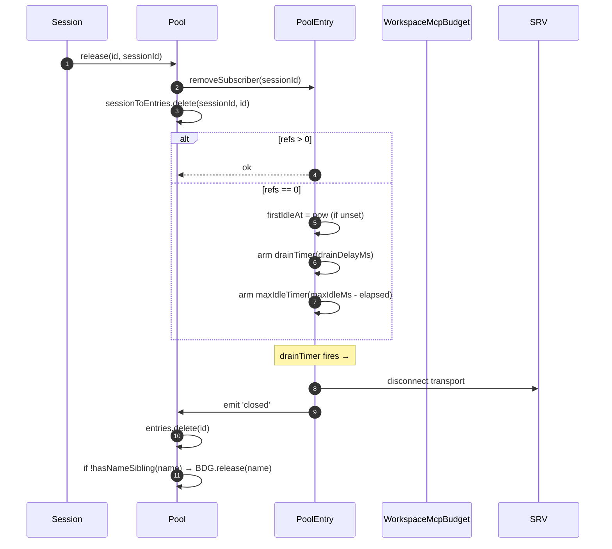
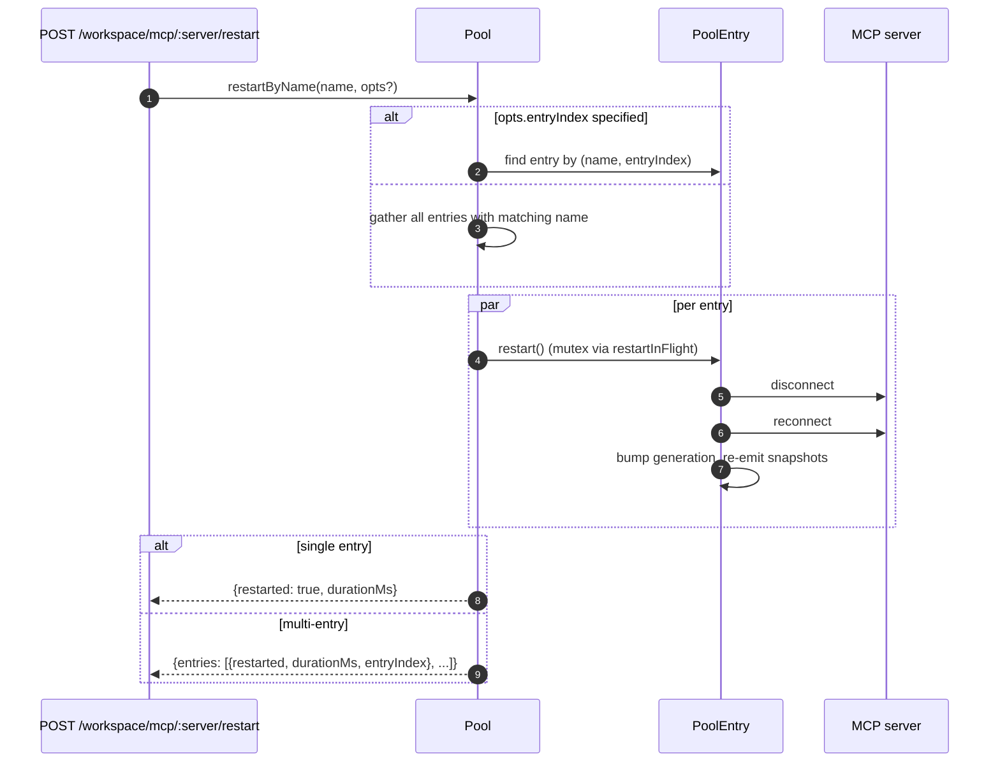
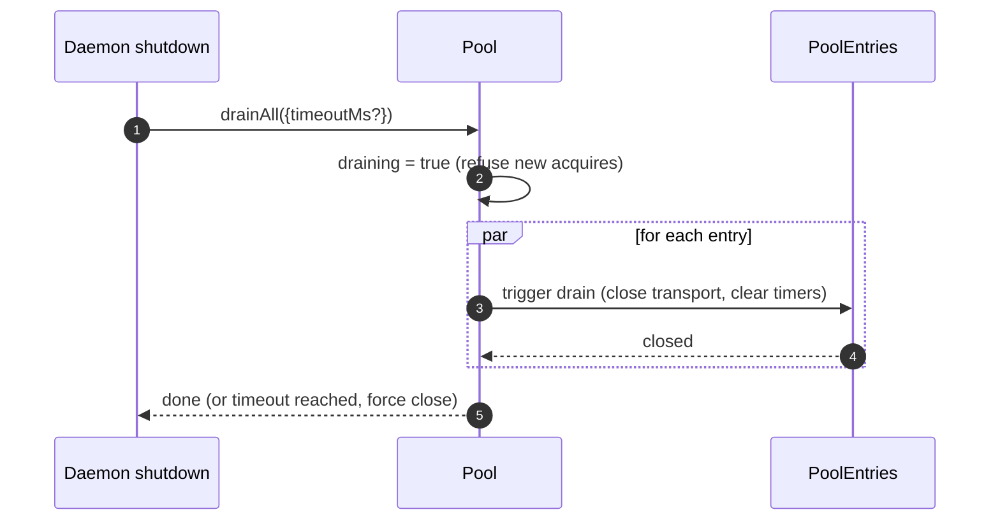

# Workspace MCP 传输池

## 概述

`McpTransportPool`（`packages/core/src/tools/mcp-transport-pool.ts`）是 F2（#4175 commit 5）工作区范围的池：同一守护进程上的多个 ACP 会话共享一个唯一的 `(serverName + configFingerprint)` 元组对应的传输通道，而不是每个会话都创建自己的 MCP 子进程。该池**位于 ACP 子进程内部**（`QwenAgent.mcpPool`），在代理启动时使用守护进程的引导 `Config` 构造一次，并在会话生命周期内持续存在。`PoolEntry` 会对会话的附加进行引用计数，当引用计数降为零后，经过可配置的宽限期间隔，该条目会被关闭。

它是防止多会话守护进程为每个会话都 fork 一份 MCP 服务器的主要机制。

## 职责

- 为每个 `(name + fingerprint)` 获取或创建一个 MCP 传输通道，并通过 `spawnInFlight` 对并发获取进行去重。
- 释放每个会话的引用；当最后一个引用分离时，启动条目的 drain 计时器。
- 通过硬性的 `MAX_IDLE_MS` 上限来应对引用计数波动，防止频繁操作的客户端使空闲传输通道永远存活。
- 在反向索引（`sessionToEntries`）中记录会话的引用计数，使得 `releaseSession(sessionId)` 的复杂度为 O(refs) 而非 O(entries)。
- 按需重启条目（`restartByName`）——单条目返回 `{restarted, durationMs}`，多条目返回 `{entries: RestartResult[]}`（F2 多条目合约）。
- 在守护进程关闭时清空整个池，并带有可配置的超时；清空期间拒绝新的获取请求。
- 在 `acquire` 时参考 `WorkspaceMcpBudget`（参见 [`06-mcp-budget-guardrails.md`](./06-mcp-budget-guardrails.md)），以强制执行按名称的预留上限；当没有兄弟条目持有相同名称时，在条目关闭时释放预留槽位。
- 通过 `SessionMcpView` 生成按会话过滤的工具/提示快照，避免一个会话中的发现将工具注册到其他会话中。

## 架构

### 公开接口

```ts
class McpTransportPool {
  constructor(cliConfig: Config, options: McpTransportPoolOptions);
  acquire(
    serverName,
    cfg,
    sessionId,
    sessionToolRegistry,
    sessionPromptRegistry,
  ): Promise<PooledConnection>;
  release(id, sessionId): void;
  releaseSession(sessionId): void;
  restartByName(
    name,
    opts?,
  ): Promise<RestartResult | { entries: RestartResult[] }>;
  drainAll(opts?): Promise<void>;
  getBudget(): WorkspaceMcpBudget | undefined;
  getSnapshot(): McpPoolSnapshot;
}
```

`McpTransportPoolOptions`:

- `workspaceContext: WorkspaceContext`（必需）。
- `debugMode: boolean`。
- `sendSdkMcpMessage?` —— 每个会话的回调（池绕过 SDK MCP）。
- `pooledTransports?: ReadonlySet<McpTransportKind>` —— 默认 `{stdio, websocket}`。HTTP/SSE 传输默认不池化，因为其头部可能携带会话特定的 OAuth 状态，但操作员可以通过 `QWEN_SERVE_MCP_POOL_TRANSPORTS` 显式将其纳入池化。
- `drainDelayMs?` —— 默认 `30_000`。
- `entryOptions?: (transport) => PoolEntryOptions`。
- `budget?: WorkspaceMcpBudget`。

### 内部状态

| 状态                | 类型                                      | 用途                                                                                                   |
| ------------------- | ----------------------------------------- | ------------------------------------------------------------------------------------------------------ |
| `entries`           | `Map<ConnectionId, PoolEntry>`            | 以 `connectionIdOf(name, fingerprint)` 为键的活跃池条目。                                              |
| `unpooledIds`       | `Set<ConnectionId>`                       | 位于配置的 `pooledTransports` 白名单之外的传输条目。                                                   |
| `spawnInFlight`     | `Map<ConnectionId, Promise<PoolEntry>>`   | 对相同键的并发冷启动获取进行去重。                                                                     |
| `sessionToEntries`  | `Map<string, Set<ConnectionId>>`          | V21-2 反向索引，用于 O(refs) 的 `releaseSession`。                                                    |
| `draining`          | `boolean`                                 | 清空互斥锁 —— 一旦设置，所有 `acquire` 调用都会被拒绝。                                                |
| `nextIndexByName`   | `Map<string, number>`                     | V21-7 每个服务器名称的单调递增 `entryIndex`（仪表盘不会因新条目出现而重新排序）。                      |

### `PoolEntry`（每个条目的结构，`mcp-pool-entry.ts`）

状态机：`spawning → active ⇄ (active ↔ reconnect) → (active → draining on last detach, draining → active on attach OR draining → closed on timer)`。

| 字段                                                    | 用途                                                                                           |
| ------------------------------------------------------- | ---------------------------------------------------------------------------------------------- |
| `localStatus: MCPServerStatus`                          | 由 `MCPServerStatus` 生命周期驱动。                                                             |
| `state: PoolEntryState`                                 | `spawning`/`active`/`draining`/`closed`/`failed`。                                             |
| `generation: number`                                    | 每次重启时递增；订阅者对比该值以检测重连周期。                                                   |
| `refs: Set<string>`                                     | 当前附加的会话 ID。                                                                             |
| `subscribers: Map<string, SessionMcpView>`              | 每个会话的过滤视图。                                                                           |
| `subscriberHandles: Map<string, PooledConnectionImpl>`  | 从 `acquire` 返回的句柄。                                                                       |
| `toolsSnapshot[], promptsSnapshot[]`                    | 规范的池级别快照；在 `toolsChanged` / `promptsChanged` 时重新发出。                             |
| `drainTimer?`                                           | 当 `refs.size === 0` 时启动；默认 30 秒。重新附加时重置。                                      |
| `maxIdleTimer?`                                         | 在首次空闲时启动；acquire/release 波动不会重置它。默认 5 分钟。                                 |
| `firstIdleAt?`                                          | 最大空闲硬上限的水位线。                                                                       |
| `restartInFlight?`                                      | `restart()` 的互斥锁。                                                                         |

### `PoolEntryOptions`

```ts
interface PoolEntryOptions {
  drainDelayMs: number; // 默认 30_000
  maxIdleMs: number; // 默认 5 * 60_000
  maxReconnectAttempts: number; // 默认 3（stdio/ws）或 5（http/sse）
  reconnectStrategy:
    | { kind: 'fixed'; delayMs: number }
    | { kind: 'exponential'; baseMs: number; capMs: number };
}
```

`defaultPoolEntryOptions(transport)`（`mcp-pool-entry.ts`）返回 stdio/ws 的默认值 `{fixed 5s, 3 attempts}`，以及 http/sse 的默认值 `{exponential 1s → 16s, 5 attempts}`。远程传输获得更长的重试预算，因为其故障通常更可能是瞬时的。

## 工作流

### `acquire`

```mermaid
sequenceDiagram
    autonumber
    participant S as Session
    participant P as Pool
    participant SIF as spawnInFlight
    participant E as PoolEntry
    participant BDG as WorkspaceMcpBudget
    participant SRV as MCP server

    S->>P: acquire(name, cfg, sessionId, sessionToolRegistry, sessionPromptRegistry)
    P->>P: refuse if draining
    P->>P: connectionId = connectionIdOf(name, fingerprint)
    P->>P: if !isPoolable(cfg) → mark unpooled
    alt entry in entries (warm)
        E-->>P: existing PoolEntry
    else inflight cold spawn
        SIF-->>P: existing Promise<PoolEntry>
    else cold start
        P->>BDG: tryReserve(name) (if budget set + poolable)
        BDG-->>P: 'reserved' | 'already_held' | 'refused'
        alt refused
            P->>BDG: recordRefusal(name, transport)
            P-->>S: BudgetExhaustedError
        else ok
            P->>E: spawnEntry(name, cfg)
            E->>SRV: connect transport
            SRV-->>E: ready
            P->>P: entries.set(id, E); nextIndexByName++
            E-->>P: connected
        end
    end
    P->>E: addSubscriber(sessionId, sessionToolRegistry, sessionPromptRegistry)
    P->>P: sessionToEntries.add(sessionId, id)
    P->>P: cancel drain timer (refs>0)
    P-->>S: PooledConnection { id, serverName, entryIndex, client, toolsSnapshot, promptsSnapshot, on, off, release }
```

### `release` + drain



`hasNameSibling(name)`（`mcp-transport-pool.ts`）遍历 `entries.values()` 和 `spawnInFlight.keys()`，并使用 `parseConnectionId` 解析后者（服务器名称可以合法地包含 `::`，因此 `startsWith` 会在以 `${name}::` 开头的兄弟名称上产生误报）。

`releaseSession(sessionId)` 从 `sessionToEntries` 中读取，在 O(refs) 时间内释放所有引用的条目，然后清除索引条目。由 bridge 的会话关闭路径使用，这样它就不需要遍历整个条目映射。

### `restartByName`



守护进程 HTTP 层的预检预算检查返回 `{restarted:false, skipped:true, reason:'budget_would_exceed'}`（Wave 4 变异控制），当目标槽位尚未被预留且重启会使活跃计数超过 `enforce` 预算时。

### `drainAll`



## 状态与生命周期

- 池的构造是同步的；第一次 `acquire` 会冷启动一个传输通道。
- `drainDelayMs`（默认 30 秒）在重新附加时会被取消并重置。
- `maxIdleMs`（默认 5 分钟）**不会**因附加/分离而重置——它从第一次空闲开始计时，只有在条目实际关闭或在截止时间前附加时才会停止。这是为了防止频繁操作的客户端。
- `nextIndexByName` 是单调递增的。旧条目会保留其分配的索引，即使新条目出现，仪表盘读取 `entryIndex` 时不会重新排序。
- 生成失败会释放预留的预算槽位（V21-4——如果没有这个机制，在连接中途崩溃的冷启动会永久泄漏预留）。

## 依赖项

- `packages/core/src/tools/mcp-client.ts` —— `McpClient`、状态枚举、`SendSdkMcpMessage`。
- `packages/core/src/tools/mcp-pool-entry.ts` —— `PoolEntry`、`PoolEntryOptions`、`defaultPoolEntryOptions`。
- `packages/core/src/tools/mcp-pool-key.ts` —— `connectionIdOf`、`parseConnectionId`、`isPoolable`、`mcpTransportOf`、`POOLED_TRANSPORTS_DEFAULT`。
- `packages/core/src/tools/mcp-pool-events.ts` —— `ConnectionId`、`PoolEntryState`、`PoolEvent`。
- `packages/core/src/tools/session-mcp-view.ts` —— 每个会话的视图，用于过滤池快照。
- `packages/core/src/tools/mcp-workspace-budget.ts` —— `WorkspaceMcpBudget`（参见 [`06-mcp-budget-guardrails.md`](./06-mcp-budget-guardrails.md)）。
- `packages/core/src/tools/mcp-discovery-timeout.ts` —— `discoveryTimeoutFor`、`runWithTimeout`。

## 配置

| 来源                           | 选项                                                           | 效果                                                                                                                        |
| ------------------------------ | -------------------------------------------------------------- | --------------------------------------------------------------------------------------------------------------------------- |
| Env                            | `QWEN_SERVE_NO_MCP_POOL=1`                                     | 开关 —— `QwenAgent.mcpPool` 保持未定义；每个会话的 `McpClientManager` 强制执行（F2 之前的路径）。                           |
| Flag                           | `--mcp-client-budget=N`, `--mcp-budget-mode={off,warn,enforce}` | 通过 `childEnvOverrides` 转发给 ACP 子进程；子进程构造 `WorkspaceMcpBudget` 并将其传递给池。                               |
| 能力标签（条件性）             | `mcp_workspace_pool`, `mcp_pool_restart`                        | 当池启用时一起公布。SDK 会预先检查两者，以便根据池感知的响应形状进行分支。                                                  |

### 未池化的条目（HTTP / SSE / SDK-MCP）

位于配置的 `pooledTransports` 白名单之外的传输（默认是 HTTP、SSE 和 SDK-MCP）采用不同的路径：`createUnpooledConnection(name, cfg, sessionId, ...)`（`mcp-transport-pool.ts`）会创建一个每个会话的条目，其 id 为 `${name}::unpooled-${entryIndex}`。与池化条目的区别：

- 存储在 `entries` 中，并在 `unpooledIds: Set<ConnectionId>` 中跟踪，以便 `release` / `releaseSession` 可以快速处理分离时的关闭行为（引用数始终最大为 1）。
- 直接使用 `McpClient.discover()` 而不是池重放；`applyTools` / `applyPrompts` 是无操作的，因为会话的注册表已经持有所注册的内容（W77 / `attach()` 中的 `skipReplay: true`）。
- 工作区预算仍然会限制它们 —— F2 预算跟进关闭了之前未池化连接绕过 `tryReserve` 的漏洞；相同的 `WorkspaceMcpBudget` 插槽会在条目关闭时预留和释放（无论池化还是未池化）。

W77 竞态条件（`cb206da36`）：`createUnpooledConnection` 在等待 `client.connect()` / `client.discover()` 之前就将条目存储在 `this.entries` 中，但只在 `attach()` 成功之后才索引 `sessionToEntries[sessionId]`。在 connect/discover 窗口期间并发的 `closeStoredSession()` / `releaseSession(sessionId)` 会看到一个空的索引，让未池化的 spawn 完成，然后 `attach()` 将工具/提示注册到已经关闭的会话中。修复方法：

- `mcp-pool-entry.ts`：公开的 `isTerminated(): boolean` 探测（`state === 'closed' || state === 'failed'`）。
- `mcp-pool-entry.ts`：`markActive()` 在 `isTerminated()` 时短路，因此被拆除的条目无法重新变为 `'active'`。
- 调用者（池的未池化路径）在 await 之间探测 `isTerminated()`，如果父会话已消失，则中止 attach。

这个竞态条件在当时是潜在的（W61/W71 每个会话的 `releaseSession` 钩子在 F4 中才出现），但一旦该钩子到达就会变为现实。该修复在 F2 系列早期就已应用。

## `GET /workspace/mcp` 池感知快照字段

当池处于活动状态时，每个 `ServeWorkspaceMcpStatus` 服务器单元格
（`packages/acp-bridge/src/status.ts`）包含三个额外字段：

| 字段            | 类型                                        | 用途                                                                                                                                                                                                                                                                                                                                            |
| --------------- | ------------------------------------------- | ----------------------------------------------------------------------------------------------------------------------------------------------------------------------------------------------------------------------------------------------------------------------------------------------------------------------------------------------- |
| `disabledReason` | `'config' \| 'budget'`                      | 区分操作员禁用的服务器（`disabled: true` 来自 `disabledMcpServers`）和预算拒绝（`status: 'error', errorKind: 'budget_exhausted'`）。仪表盘可以在不交叉阅读 `errors[]` 或 `budgets[]` 的情况下渲染服务器行。                                                                                                                                       |
| `entryCount`    | `number` (`>=1`)                            | 在池模式下，当会话注入不同的指纹（例如每个会话的 OAuth 头部）时，一个工作区可以有多个同名的 `PoolEntry` 实例。当 `QWEN_SERVE_NO_MCP_POOL=1` 禁用池时，该字段不存在。新客户端在 `entryCount > 1` 时渲染一个“N 条目”徽章。                                                                                                                        |
| `entrySummary`  | `ReadonlyArray<{entryIndex, refs, status}>` | 每个条目的明细。`entryIndex` 是条目创建时分配的稳定不透明度整数，不是原始指纹，因此快照差异不会泄露 OAuth 或环境轮转时机。`refs` 是当前附加的会话数。`status` 允许仪表盘显示每个条目的健康状态，同时聚合的 `mcpStatus` 已经连接。                                                                                                                |

`(entryCount, entrySummary)` 总是成对广播。`mcp_workspace_pool` 能力标签暗示了这两个字段。较旧的 SDK 客户端在附加协议契约下会忽略它们。

池快照还暴露了 `subprocessCount`。它只统计 `'stdio'` 家族。WebSocket、HTTP 和 SSE 传输连接到远程服务器，不会生成本地子进程。早期版本将 WebSocket 传输计为本地子进程，这夸大了资源仪表盘。

## 两个关闭路径都会执行 Drain

池的 Drain 不仅限于 SIGTERM 处理程序。正常的 IDE 关闭路径（`await connection.closed`）也会通过 `packages/cli/src/acp-integration/acpAgent.ts` 的 `drainPoolBeforeExit` 调用 `drainAll`。无论守护进程收到进程信号还是 IDE 正常关闭连接，池都会进入 `draining` 状态，拒绝新的获取请求，并等待条目关闭。

## `/mcp refresh` 共享启动发现路径

`discoverAllMcpTools`（启动发现）和 `discoverAllMcpToolsIncremental`（`/mcp refresh` / 热重载）在池模式下都会首先咨询池（`packages/core/src/tools/mcp-client-manager.ts`）。这个共享的门控防止热重载意外创建每个会话的客户端、重复计算预算或留下孤立的传输通道。

## 重连过程中的进行中工具调用（`MCPCallInterruptedError`）

当底层 MCP 传输静默断开连接时（连接从 `'active'` / `'draining'` 跳转到 `localStatus === DISCONNECTED`，没有显式关闭），池会将条目标记为 `'failed'`，从 `pool.entries` 中驱逐它，并在分离订阅者视图之前发出 `failed` 事件。这个发出-然后-分离的顺序很重要：订阅者能够足够早地收到 `failed` 事件，将挂起的 `callTool` 承诺路由到 `MCPCallInterruptedError`，因此卡住的 `await client.callTool(...)` 能够干净地拒绝，而不是挂起。`forceShutdown` 使用相同的发出-然后-分离顺序。
## 指纹与 `canonicalOAuth` 规范化

池键源自 `mcp-pool-key.ts` 中的 `fingerprint(cfg)`。哈希覆盖所有传输定义字段：

> `transport, command, args, cwd, env, url, httpUrl, tcp, headers, timeout, oauth`

会话级过滤和元数据字段（`includeTools`、`excludeTools`、`trust`、`description`、`extensionName`、`discoveryTimeoutMs`）不参与哈希，因此不同过滤条件的会话可以共享同一个条目。

对于 OAuth 单元，`canonicalOAuth(o)` 对每个 `MCPOAuthConfig` 字段进行哈希：`clientId`、`clientSecret`、排序后的 `scopes`、排序后的 `audiences`、`authorizationUrl`、`tokenUrl`、`redirectUri`、`tokenParamName` 和 `registrationUrl`。这是凭证隔离的契约：两个会话配置如果仅在 `clientSecret`、`audiences` 或 `redirectUri` 上不同，将产生不同的指纹，且无法共享同一个条目。机密客户端和多受众令牌部署依赖于此。

对 `scopes` 和 `audiences` 进行排序，使得调用方顺序无关紧要。显式的 `null` 被规范化，以便未定义的字段与显式 null 哈希相同。该键不包括 `discoveryTimeoutMs`；使用相同键但不同超时时间的并发 `acquire` 调用遵循“先到先得”原则，与 F2 之前的按会话管理器行为一致。

`PoolEntry` 将 `cfg: MCPServerConfig` 保持为私有。外部代码在需要传输族时，必须使用 `entry.transportKind` 获取器。这可以防止 env、header auth 和 OAuth 字段意外泄露给消费者。

## 扩展卸载依赖 `MAX_IDLE_MS`

有意没有主动清理路径用于在运行时卸载 MCP 扩展。其 `MCPServerConfig` 不再出现在合并工作区设置中的孤立条目，会在最后一个订阅者分离后，由 `MAX_IDLE_MS` 硬上限自然回收。同步卸载清理路径会为罕见的管理员边缘情况增加复杂性；硬上限将孤立进程在卸载点后的生命周期限制为默认 5 分钟。

需要更快清理的管理员可以重启守护进程，或对现在未配置的名称调用 `POST /workspace/mcp/:server/restart`，这将走已禁用服务器路径并拆除条目。

## 自愈可观测性

池在自愈路径上发出两个结构化诊断信息：

**`McpClient.lastTransportError: Error | undefined`**（`packages/core/src/tools/mcp-client.ts`）——`McpClient.onerror` 将最近的传输异常存储在私有字段中，并在 `connect()` 入口处清除。`PoolEntry` 静默丢弃路径读取 `client.getLastTransportError()` 并将其包含在 `emit({kind:'failed', lastError})` 中，因此订阅者和仪表板无需 grep stderr 即可找到根本原因。

**`SweepResult`**（内部接口，不导出；`packages/core/src/tools/mcp-pool-entry.ts`）——`sweepAndDisconnect(reason)` 返回 `Promise<SweepResult>`：

```ts
interface SweepResult {
  pidSweepError?: Error; // listDescendantPids 自身抛出异常
  descendantsFound?: number; // 找到的后代进程数
  descendantsSignaled?: number; // 成功发送 SIGTERM 的进程数
}
```

唯一的消费者是 `statusChangeListener` 中的静默丢弃块。它使用 `descendantsFound` / `descendantsSignaled` 检测部分信号情况（发送信号的进程数少于找到的进程数，通常是因为进程在 `listDescendantPids` 和 `sigtermPids` 之间退出或发生 EPERM）和清理错误，然后记录结构化警告。`forceShutdown` 和 `doRestart` 忽略此返回值，因为它们的 catch 路径已经携带了更丰富的失败信号。

## 子进程清理：`pid-descendants` 快照路径

当 `McpTransportPool` 关闭 stdio 子进程时，它必须枚举其后代进程；`npx` 包装器和 shell 包装器可能创建多个 fork 层级。`packages/core/src/tools/pid-descendants.ts` 为 `sweepAndDisconnect` 暴露了 `listDescendantPids(rootPid) → Promise<number[]>` 和 `sigtermPids(pids)`。

### Linux / macOS 主路径

单个 `ps -A -o pid=,ppid=` 快照读取进程表，将其解析为 `Map<ppid, pid[]>`，然后 `walkDescendants(tree, root)` 执行 BFS 提取子树。任意深度仅需一次 `ps` fork。

`walkDescendants` 维护 `visited: Set<number>` 并将 `root` 包含在该集合中，以防御 PID 重用循环。在快速进程变动下，快照理论上可能包含 A→B / B→A 循环。如果没有 `visited`，walker 可能会用虚假数据填满 `MAX_DESCENDANTS` 配额，挤掉真正的后代。

### Windows 主路径

单个 `Get-CimInstance Win32_Process | ConvertTo-Csv -Delimiter ","` 快照输出所有 `(ProcessId, ParentProcessId)` 行，然后运行相同的 `Map` 和 `walkDescendants` 路径。

显式的 `-Delimiter ","` 是必需的。Windows 自带的 PowerShell 5.1 默认 `ConvertTo-Csv` 使用系统区域设置列表分隔符；DE、FR、NL、IT 等区域设置使用 `;`，因此修复前的解析器 `^"(\d+)","(\d+)"$` 永远无法匹配，每个守护进程关闭都会回退到按 PID 的 CIM 过滤路径，每个子进程增加大约 0.5-1s 的 PowerShell 启动开销。

### 回退路径

BusyBox `<v1.28` 缺少 `ps -o`，distroless 容器可能不包含 `ps`，某些 Windows 环境通过 ACL 截断 CIM 输出。当主路径解析到零行或抛出异常时，代码回退到按 PID 的 BFS：Linux / macOS 使用 `pgrep -P <pid>`，Windows 使用 `Get-CimInstance -Filter "ParentProcessId=$p"`，其中 `$p` 是 PowerShell 变量绑定而非字符串拼接。当前的 `Number.isInteger` 检查对于入口点足够；该绑定是深度防御。

### 共享约束

两条路径都受 `MAX_DESCENDANTS = 256` 和 `MAX_DEPTH = 8` 限制，防止恶意或退化的进程树拖慢清理。

快照路径使用 `maxBuffer: 8MB`，足以处理约 250k 进程的异常主机。Node 默认的 1MB 缓冲区可能在约 30k 进程时截断子进程输出。

性能提升有意保持适度（典型的 200-500 进程的开发机器解析时间在 10ms 以内，大约是按 PID 的 `pgrep` 的 2 倍）。主要好处是 fork 卫生和快照一致性：BFS 一次性看到完整的子树，而之前的按 PID 查询路径可能会错过两次查询之间 fork 的子进程。

## 嵌入者说明：`McpClientManager` 构造函数

`McpClientManager` 的构造方式为 `(config, toolRegistry, options?: McpClientManagerOptions)`。直接导入该类的嵌入者应传递：

```ts
new McpClientManager(config, toolRegistry, {
  eventEmitter,
  sendSdkMcpMessage,
  healthConfig,
  budgetConfig,
  pool,
});
```

测试应优先使用 `mkManager(overrides?)` 工厂，以便只关心一两个字段的用例保持一行。

## 实现说明

这些辅助函数是内部的，但源代码阅读者可能会看到它们：

- `McpTransportPool.acquire()` 使用 `attachPooledSession` 和 `rollbackReservationOnSpawnFailure` 来共享快速路径附加、生成后附加和池化生成中捕获行为。运行时行为不变；竞态窗口不变量仍然存在于调用点。
- `SessionMcpView.applyTools` / `applyPrompts` 通过 `compileNameFilter(cfg)` 编译 `includeTools` / `excludeTools` 一次，并使用 `compiledFilterAccepts(compiled, name)` 检查每个工具。导出的 `passesSessionFilter` / `passesSessionPromptFilter` 使用相同的编译路径。`excludeTools` 是精确匹配；`includeTools` 去除第一个 `(...)` 后缀，以便 `toolName(args)` 匹配 `toolName`。

设计文档：[`../../design/f2-mcp-transport-pool.md`](../../design/f2-mcp-transport-pool.md) §6 介绍了传输池状态机、重连、排空和后代清理路径。

## 注意事项与已知限制

- **HTTP / SSE 传输默认不池化**——除非操作员明确将其包含在 `QWEN_SERVE_MCP_POOL_TRANSPORTS` 中，否则每次 `acquire` 都会创建一个新的条目，其生命周期仅与相应的会话一致。它们的头部可能携带会话特定的 OAuth 状态，因此默认池化会带来跨会话泄露凭证的风险。
- **`maxIdleMs` 是一个硬上限，能够经受附接/分离的波动。** 5 分钟空闲硬上限意味着即使客户端频繁地附接/分离，也不能让空闲传输保持超过 5 分钟。希望固定长生命周期传输的操作员应增加 `maxIdleMs`，或在池外运行服务器。
- **按服务器名称的预算槽位**意味着共享相同名称但指纹不同的两个池条目共同消耗一个槽位，而不是两个。子进程计数通过 `pool.getSnapshot().subprocessCount` 单独暴露。
- **`startsWith` 回归**已在 `hasNameSibling` 中避免，因为 MCP 服务器名称可能合法包含 `::`（`mcp-pool-key.test.ts`）。始终使用 `parseConnectionId` 的 `lastIndexOf('::')` 分割，决不要使用字符串前缀匹配。
- **池排空是单向的**——`drainAll` 永久设置 `draining = true`；需要新的池才能继续工作。

## 参考

- `packages/core/src/tools/mcp-transport-pool.ts`（整个文件）
- `packages/core/src/tools/mcp-pool-entry.ts`（条目生命周期）
- `packages/core/src/tools/mcp-pool-key.ts`（`connectionIdOf`、`parseConnectionId`）
- `packages/core/src/tools/mcp-pool-events.ts`（事件类型）
- `packages/core/src/tools/session-mcp-view.ts`（按会话过滤视图）
- F2 设计文档（v2.2，包含 32 项审查折叠变更日志）：[`../../design/f2-mcp-transport-pool.md`](../../design/f2-mcp-transport-pool.md)。设计契约是权威的；此页面是开发者深度讲解。
- F2 设计说明：issue [#4175](https://github.com/QwenLM/qwen-code/issues/4175)（F2 系列的提交 4-6）。