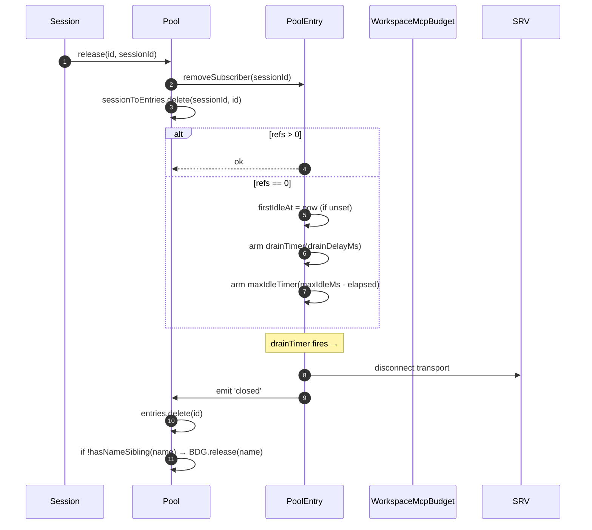
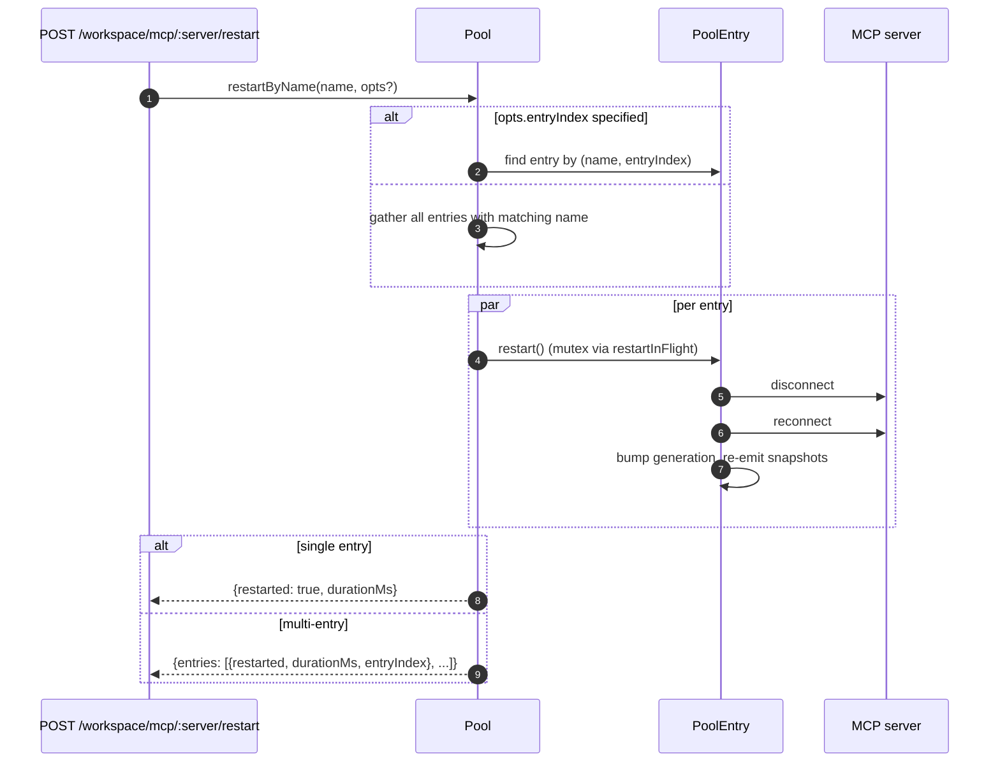
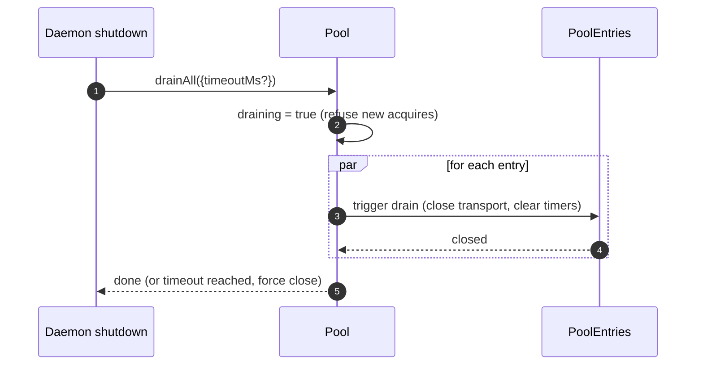

# Workspace MCP Transport Pool

## 概述

`McpTransportPool`（`packages/core/src/tools/mcp-transport-pool.ts`）是 F2（#4175 commit 5）的 workspace 级别连接池：同一 daemon 上的多个 ACP session 共享一个 transport，共享粒度为唯一的 `(serverName + configFingerprint)` 元组，而非每个 session 各自 fork 独立的 MCP 子进程。该连接池位于 **ACP 子进程内部**（`QwenAgent.mcpPool`），在 agent 启动时以 daemon 的引导 `Config` 构造一次，并在 session 生命周期之外持续存活。各条目通过引用计数追踪 session 的附加情况，当引用计数归零时，经过可配置的宽限期后关闭。

这是防止多 session daemon 为每个 session 各 fork 一份 MCP server 副本的核心机制。

## 职责

- 按 `(name + fingerprint)` 获取或 spawn 一个 MCP transport，通过 `spawnInFlight` 去重并发的 acquire 请求。
- 释放每个 session 的引用；当最后一个引用 detach 时，启动条目的 drain 计时器。
- 通过硬性 `MAX_IDLE_MS` 上限抵御引用计数抖动，防止频繁 attach/detach 的客户端将空闲 transport 永久保持存活。
- 通过反向索引（`sessionToEntries`）对 session 进行引用计数，使 `releaseSession(sessionId)` 的时间复杂度为 O(refs) 而非 O(entries)。
- 按需重启条目（`restartByName`）——单条目返回 `{restarted, durationMs}`，多条目返回 `{entries: RestartResult[]}`（F2 多条目契约）。
- 在 daemon 关闭时以可配置的超时时间 drain 整个连接池；drain 期间拒绝新的 acquire 请求。
- 在 `acquire` 时查询 `WorkspaceMcpBudget`（参见 [`06-mcp-budget-guardrails.md`](./06-mcp-budget-guardrails.md)），强制执行按名称的预留配额上限；当同名的最后一个条目关闭时释放该 slot。
- 通过 `SessionMcpView` 为每个 session 生成过滤后的 tool/prompt 快照，确保一个 session 的发现结果不会注册到其他 session 中。

## 架构

### 公共接口

```ts
class McpTransportPool {
  constructor(cliConfig: Config, options: McpTransportPoolOptions);
  acquire(
    serverName,
    cfg,
    sessionId,
    sessionToolRegistry,
    sessionPromptRegistry,
  ): Promise<PooledConnection>;
  release(id, sessionId): void;
  releaseSession(sessionId): void;
  restartByName(
    name,
    opts?,
  ): Promise<RestartResult | { entries: RestartResult[] }>;
  drainAll(opts?): Promise<void>;
  getBudget(): WorkspaceMcpBudget | undefined;
  getSnapshot(): McpPoolSnapshot;
}
```

`McpTransportPoolOptions`：

- `workspaceContext: WorkspaceContext`（必填）。
- `debugMode: boolean`。
- `sendSdkMcpMessage?` — 每个 session 的回调（连接池绕过 SDK MCP）。
- `pooledTransports?: ReadonlySet<McpTransportKind>` — 默认为 `{stdio, websocket}`。HTTP/SSE transport 默认不进入连接池，因为其 headers 可能携带 session 级别的 OAuth 状态；但运营者可以通过 `QWEN_SERVE_MCP_POOL_TRANSPORTS` 显式将其纳入连接池。
- `drainDelayMs?` — 默认 `30_000`。
- `entryOptions?: (transport) => PoolEntryOptions`。
- `budget?: WorkspaceMcpBudget`。

### 内部状态

| 状态               | 类型                                    | 用途                                                                                                 |
| ------------------ | --------------------------------------- | ---------------------------------------------------------------------------------------------------- |
| `entries`          | `Map<ConnectionId, PoolEntry>`          | 存活的连接池条目，以 `connectionIdOf(name, fingerprint)` 为 key。                                   |
| `unpooledIds`      | `Set<ConnectionId>`                     | 不在 `pooledTransports` 允许列表中的 transport 所对应的条目。                                       |
| `spawnInFlight`    | `Map<ConnectionId, Promise<PoolEntry>>` | 对同一 key 的并发冷启动 acquire 进行去重。                                                           |
| `sessionToEntries` | `Map<string, Set<ConnectionId>>`        | V21-2 反向索引，使 `releaseSession` 的时间复杂度为 O(refs)。                                        |
| `draining`         | `boolean`                               | drain 互斥锁——一旦设置，所有 `acquire` 调用均拒绝。                                                 |
| `nextIndexByName`  | `Map<string, number>`                   | V21-7 按 server 名称单调递增的 `entryIndex`（新条目出现时 dashboard 不会重新排序）。                |

### `PoolEntry`（每条目结构，`mcp-pool-entry.ts`）

状态机：`spawning → active ⇄ (active ↔ reconnect) → (active → draining on last detach, draining → active on attach OR draining → closed on timer)`。

| 字段                                                   | 用途                                                                            |
| ------------------------------------------------------ | ------------------------------------------------------------------------------- |
| `localStatus: MCPServerStatus`                         | 由 `MCPServerStatus` 生命周期驱动。                                             |
| `state: PoolEntryState`                                | `spawning`/`active`/`draining`/`closed`/`failed`。                              |
| `generation: number`                                   | 每次重启时递增；订阅者通过比较此值检测重连周期。                                |
| `refs: Set<string>`                                    | 当前已附加的 session ID 集合。                                                  |
| `subscribers: Map<string, SessionMcpView>`             | 每个 session 的过滤视图。                                                       |
| `subscriberHandles: Map<string, PooledConnectionImpl>` | `acquire` 返回的句柄。                                                          |
| `toolsSnapshot[], promptsSnapshot[]`                   | 连接池级别的权威快照；在 `toolsChanged` / `promptsChanged` 时重新下发。         |
| `drainTimer?`                                          | 当 `refs.size === 0` 时启动；默认 30s。attach 时重置。                          |
| `maxIdleTimer?`                                        | 首次空闲时启动；不因 acquire/release 抖动而重置。默认 5 分钟。                 |
| `firstIdleAt?`                                         | 最大空闲硬上限的水位线。                                                        |
| `restartInFlight?`                                     | `restart()` 的互斥锁。                                                          |

### `PoolEntryOptions`

```ts
interface PoolEntryOptions {
  drainDelayMs: number; // default 30_000
  maxIdleMs: number; // default 5 * 60_000
  maxReconnectAttempts: number; // default 3 (stdio/ws) or 5 (http/sse)
  reconnectStrategy:
    | { kind: 'fixed'; delayMs: number }
    | { kind: 'exponential'; baseMs: number; capMs: number };
}
```

`defaultPoolEntryOptions(transport)`（`mcp-pool-entry.ts`）返回 stdio/ws 默认值 `{fixed 5s, 3 attempts}` 和 http/sse 默认值 `{exponential 1s → 16s, 5 attempts}`。远程 transport 的重试预算更长，因为其故障更多属于瞬态问题。

## 工作流

### `acquire`

```mermaid
sequenceDiagram
    autonumber
    participant S as Session
    participant P as Pool
    participant SIF as spawnInFlight
    participant E as PoolEntry
    participant BDG as WorkspaceMcpBudget
    participant SRV as MCP server

    S->>P: acquire(name, cfg, sessionId, sessionToolRegistry, sessionPromptRegistry)
    P->>P: refuse if draining
    P->>P: connectionId = connectionIdOf(name, fingerprint)
    P->>P: if !isPoolable(cfg) → mark unpooled
    alt entry in entries (warm)
        E-->>P: existing PoolEntry
    else inflight cold spawn
        SIF-->>P: existing Promise<PoolEntry>
    else cold start
        P->>BDG: tryReserve(name) (if budget set + poolable)
        BDG-->>P: 'reserved' | 'already_held' | 'refused'
        alt refused
            P->>BDG: recordRefusal(name, transport)
            P-->>S: BudgetExhaustedError
        else ok
            P->>E: spawnEntry(name, cfg)
            E->>SRV: connect transport
            SRV-->>E: ready
            P->>P: entries.set(id, E); nextIndexByName++
            E-->>P: connected
        end
    end
    P->>E: addSubscriber(sessionId, sessionToolRegistry, sessionPromptRegistry)
    P->>P: sessionToEntries.add(sessionId, id)
    P->>P: cancel drain timer (refs>0)
    P-->>S: PooledConnection { id, serverName, entryIndex, client, toolsSnapshot, promptsSnapshot, on, off, release }
```

### `release` + drain



`hasNameSibling(name)`（`mcp-transport-pool.ts`）会同时遍历 `entries.values()` 和 `spawnInFlight.keys()`，并用 `parseConnectionId` 解析后者（MCP server 名称本身可以合法包含 `::`，因此用 `startsWith` 会对以 `${name}::` 开头的同名 sibling 产生误判）。

`releaseSession(sessionId)` 从 `sessionToEntries` 读取数据，以 O(refs) 时间复杂度释放所有引用的条目，然后清除该索引项。供 bridge 的 session 关闭路径使用，避免遍历完整的条目 map。

### `restartByName`



当目标的 slot 尚未预留且重启会使存活数量超过 `enforce` 预算时，daemon HTTP 层的预检预算检查会返回 `{restarted:false, skipped:true, reason:'budget_would_exceed'}`（Wave 4 变更控制）。

### `drainAll`



## 状态与生命周期

- 连接池构造是同步的；首次 `acquire` 触发 transport 的冷启动。
- `drainDelayMs`（默认 30s）在 attach 时重置为取消状态。
- `maxIdleMs`（默认 5 分钟）**永不**因 attach/detach 而重置——它从**首次**空闲时开始计时，直到条目实际关闭或在截止时间前重新 attach 时才停止。用于防御频繁抖动的客户端。
- `nextIndexByName` 单调递增。旧条目保留其分配的 index，即使新条目出现后也不变，因此 dashboard 读取 `entryIndex` 时不会重新排序。
- spawn 失败会释放已预留的 budget slot（V21-4——若不释放，冷启动过程中崩溃的 spawn 会永久泄漏该预留）。

## 依赖

- `packages/core/src/tools/mcp-client.ts` — `McpClient`、status 枚举、`SendSdkMcpMessage`。
- `packages/core/src/tools/mcp-pool-entry.ts` — `PoolEntry`、`PoolEntryOptions`、`defaultPoolEntryOptions`。
- `packages/core/src/tools/mcp-pool-key.ts` — `connectionIdOf`、`parseConnectionId`、`isPoolable`、`mcpTransportOf`、`POOLED_TRANSPORTS_DEFAULT`。
- `packages/core/src/tools/mcp-pool-events.ts` — `ConnectionId`、`PoolEntryState`、`PoolEvent`。
- `packages/core/src/tools/session-mcp-view.ts` — 对连接池快照进行过滤的每 session 视图。
- `packages/core/src/tools/mcp-workspace-budget.ts` — `WorkspaceMcpBudget`（参见 [`06-mcp-budget-guardrails.md`](./06-mcp-budget-guardrails.md)）。
- `packages/core/src/tools/mcp-discovery-timeout.ts` — `discoveryTimeoutFor`、`runWithTimeout`。

## 配置

| 来源                    | 参数                                                            | 效果                                                                                                  |
| ----------------------- | --------------------------------------------------------------- | ----------------------------------------------------------------------------------------------------- |
| 环境变量                | `QWEN_SERVE_NO_MCP_POOL=1`                                      | 终止开关——`QwenAgent.mcpPool` 保持 undefined；每个 session 的 `McpClientManager` 生效（F2 之前的路径）。|
| Flag                    | `--mcp-client-budget=N`、`--mcp-budget-mode={off,warn,enforce}` | 通过 `childEnvOverrides` 转发给 ACP 子进程；子进程构造 `WorkspaceMcpBudget` 并传给连接池。           |
| Capability tags（条件） | `mcp_workspace_pool`、`mcp_pool_restart`                        | 连接池开启时一起广播。SDK 预检两者以分支处理连接池感知的响应格式。                                   |

### 非池化条目（HTTP / SSE / SDK-MCP）

不在 `pooledTransports` 允许列表中的 transport（默认为 HTTP、SSE 和 SDK-MCP）走独立路径：`createUnpooledConnection(name, cfg, sessionId, ...)`（`mcp-transport-pool.ts`）创建一个 per-session 条目，其 id 为 `${name}::unpooled-${entryIndex}`。与池化条目的区别：

- 存储在 `entries` 中，并同时在 `unpooledIds: Set<ConnectionId>` 中追踪，以便 `release` / `releaseSession` 能快速执行 close-on-detach 行为（refs 最多为 1）。
- 直接使用 `McpClient.discover()` 而非连接池 replay；`applyTools` / `applyPrompts` 为空操作，因为 session 的 registry 中已持有已注册的内容（W77 / `attach()` 中的 `skipReplay: true`）。
- Workspace budget 仍然会对其进行限流——F2 budget 后续修复关闭了非池化连接绕过 `tryReserve` 的漏洞；同一个 `WorkspaceMcpBudget` slot 会被预留，并在条目关闭时释放（无论池化还是非池化）。

W77 竞态（`cb206da36`）：`createUnpooledConnection` 在等待 `client.connect()` / `client.discover()` **之前**就将条目存入 `this.entries`，但只有在 `attach()` 成功**之后**才将 `sessionToEntries[sessionId]` 建立索引。在 connect/discover 窗口期内并发发生的 `closeStoredSession()` / `releaseSession(sessionId)` 会看到一个空的索引，让非池化 spawn 完成，然后 `attach()` 将 tools/prompts 注册到已关闭的 session 中。修复方案：

- `mcp-pool-entry.ts`：公开 `isTerminated(): boolean` 探针（`state === 'closed' || state === 'failed'`）。
- `mcp-pool-entry.ts`：`markActive()` 在 `isTerminated()` 为 true 时短路，防止已销毁的条目被恢复到 `'active'`。
- 调用方（连接池的非池化路径）在两次 await 之间探测 `isTerminated()`，若父 session 已消失则中止 attach。

此竞态在当时是潜在的（W61/W71 每 session 的 `releaseSession` hook 在 F4 才落地），但一旦该 hook 到达就会立即显现。该修复在 F2 系列早期就已应用。

## `GET /workspace/mcp` 连接池感知的快照字段

当连接池激活时，每个 `ServeWorkspaceMcpStatus` server 单元格（`packages/acp-bridge/src/status.ts`）包含三个额外字段：

| 字段             | 类型                                        | 用途                                                                                                                                                                                                                                                                                                                                          |
| ---------------- | ------------------------------------------- | --------------------------------------------------------------------------------------------------------------------------------------------------------------------------------------------------------------------------------------------------------------------------------------------------------------------------------------------- |
| `disabledReason` | `'config' \| 'budget'`                      | 区分运营者禁用的 server（来自 `disabledMcpServers` 的 `disabled: true`）与 budget 拒绝（`status: 'error', errorKind: 'budget_exhausted'`）。Dashboard 无需交叉读取 `errors[]` 或 `budgets[]` 即可渲染一行 server 信息。                                                                                                                       |
| `entryCount`     | `number`（`>=1`）                           | 在连接池模式下，当不同 session 注入不同指纹（如 per-session OAuth headers）时，workspace 可能存在多个同名的 `PoolEntry` 实例。当 `QWEN_SERVE_NO_MCP_POOL=1` 禁用连接池时，该字段不存在。当 `entryCount > 1` 时，新客户端会渲染"N 个条目"徽章。                                                                                               |
| `entrySummary`   | `ReadonlyArray<{entryIndex, refs, status}>` | 每个条目的详情。`entryIndex` 是条目创建时分配的稳定不透明整数，不是原始指纹，因此快照差异不会泄露 OAuth 或 env 轮换时序。`refs` 是当前附加的 session 数。`status` 让 dashboard 在聚合 `mcpStatus` 已连接的情况下显示每个条目的健康状态。 |

`(entryCount, entrySummary)` 始终成对广播。`mcp_workspace_pool` capability tag 隐含这两个字段。较旧的 SDK 客户端依据累加协议契约忽略它们。

连接池快照还暴露 `subprocessCount`，仅统计 `'stdio'` 族。WebSocket、HTTP 和 SSE transport 连接到远程 server，不 spawn 本地子进程。早期版本将 WebSocket transport 计入本地子进程数量，导致资源 dashboard 数据虚高。

## Drain 的两条关闭路径

连接池 drain 不仅限于 SIGTERM handler。正常的 IDE 关闭路径（`await connection.closed`）也会通过 `packages/cli/src/acp-integration/acpAgent.ts` 的 `drainPoolBeforeExit` 调用 `drainAll`。无论 daemon 收到进程信号还是 IDE 干净地关闭连接，连接池都会进入 `draining` 状态、拒绝新的 acquire，并等待条目关闭。

## `/mcp refresh` 共享启动发现路径

`discoverAllMcpTools`（启动发现）和 `discoverAllMcpToolsIncremental`（`/mcp refresh` / 热重载）在连接池模式下都优先查询连接池（`packages/core/src/tools/mcp-client-manager.ts`）。这个共享门控防止热重载意外创建 per-session 客户端、重复计算 budget 或留下孤立 transport。

## 重连期间的进行中 tool 调用（`MCPCallInterruptedError`）

当底层 MCP transport 静默断开时（连接从 `'active'` / `'draining'` 跳转到 `localStatus === DISCONNECTED`，无显式关闭），连接池将条目标记为 `'failed'`，从 `pool.entries` 中驱逐，并在 detach 订阅者视图**之前**触发 `failed` 事件。这种"先触发后 detach"的顺序至关重要：订阅者能及时收到 `failed` 事件，将待处理的 `callTool` promise 路由到 `MCPCallInterruptedError`，从而使挂起的 `await client.callTool(...)` 干净地 reject，而不是一直挂起。`forceShutdown` 使用相同的"先 emit 后 detach"顺序。

## 指纹与 `canonicalOAuth` 规范化

连接池 key 来自 `mcp-pool-key.ts` 中的 `fingerprint(cfg)`。哈希覆盖所有定义 transport 的字段：

> `transport, command, args, cwd, env, url, httpUrl, tcp, headers, timeout, oauth`

每 session 的过滤和元数据字段（`includeTools`、`excludeTools`、`trust`、`description`、`extensionName`、`discoveryTimeoutMs`）被排除在外，因此使用不同过滤器的 session 可以共享同一个条目。

对于 OAuth 单元，`canonicalOAuth(o)` 对所有 `MCPOAuthConfig` 字段求哈希：`clientId`、`clientSecret`、排序后的 `scopes`、排序后的 `audiences`、`authorizationUrl`、`tokenUrl`、`redirectUri`、`tokenParamName` 和 `registrationUrl`。这是凭据隔离契约：两个 session 配置若仅在 `clientSecret`、`audiences` 或 `redirectUri` 上有差异，会得到不同的指纹，无法共享同一条目。保密客户端和多受众 token 部署依赖于此。

对 `scopes` 和 `audiences` 排序使调用方的顺序无关紧要。显式 `null` 被规范化处理，因此 undefined 字段与显式 null 的哈希结果相同。key 不包含 `discoveryTimeoutMs`；使用相同 key 但不同超时时间并发 acquire 时采用"先到先得"策略，与 F2 之前每 session manager 的行为一致。

`PoolEntry` 将 `cfg: MCPServerConfig` 设为私有。外部代码需要 transport 族信息时必须使用 `entry.transportKind` getter，防止 env、header auth 和 OAuth 字段意外泄露给消费者。

## Extension 卸载依赖 `MAX_IDLE_MS`

运行时卸载 MCP extension 时，有意不提供主动清理路径。指纹不再出现在合并后 workspace 设置中的孤立条目，在最后一个订阅者 detach 后，会由 `MAX_IDLE_MS` 硬上限自然回收。同步的卸载清理路径会为罕见的运营者边界情况增加复杂度；硬上限将卸载点之后的孤立进程存活时间默认限制在 5 分钟内。

需要更快清理的运营者可以重启 daemon，或对已取消配置的名称调用 `POST /workspace/mcp/:server/restart`，该请求会走已禁用 server 路径并销毁条目。

## 自愈可观测性

连接池在自愈路径上触发两个结构化诊断：

**`McpClient.lastTransportError: Error | undefined`**（`packages/core/src/tools/mcp-client.ts`）——`McpClient.onerror` 将最近一次 transport 异常存储在私有字段中，并在 `connect()` 入口处清除。`PoolEntry` 静默丢弃路径读取 `client.getLastTransportError()` 并将其包含在 `emit({kind:'failed', lastError})` 中，使订阅者和 dashboard 无需检索 stderr 即可定位根因。

**`SweepResult`**（内部接口，未导出；`packages/core/src/tools/mcp-pool-entry.ts`）——`sweepAndDisconnect(reason)` 返回 `Promise<SweepResult>`：

```ts
interface SweepResult {
  pidSweepError?: Error; // listDescendantPids 自身抛出的错误
  descendantsFound?: number; // 找到的后代 pid 数量
  descendantsSignaled?: number; // 成功发送 SIGTERM 的数量
}
```

唯一的消费方是 `statusChangeListener` 中的静默丢弃块。它使用 `descendantsFound` / `descendantsSignaled` 来检测部分信号情况（信号发送数少于找到数，通常是因为进程在 `listDescendantPids` 和 `sigtermPids` 之间已退出或发生 EPERM）和 sweep 错误，然后记录结构化警告。`forceShutdown` 和 `doRestart` 忽略此返回值，因为它们的 catch 路径已携带更丰富的失败信号。

## 子进程清理：`pid-descendants` 快照路径

`McpTransportPool` 关闭 stdio 子进程时需要枚举其后代进程；`npx` 包装器和 shell 包装器可能创建多层 fork。`packages/core/src/tools/pid-descendants.ts` 暴露 `listDescendantPids(rootPid) → Promise<number[]>` 和 `sigtermPids(pids)` 供 `sweepAndDisconnect` 使用。

### Linux / macOS 主路径

通过一次 `ps -A -o pid=,ppid=` 快照读取进程表，将其解析为 `Map<ppid, pid[]>`，然后 `walkDescendants(tree, root)` 执行 BFS 提取子树。任意深度只需一次 `ps` fork。

`walkDescendants` 维护 `visited: Set<number>` 并将 `root` 纳入该集合，以防御 PID 复用导致的环路。在进程快速变动时，快照理论上可能包含 A→B / B→A 环路。若不使用 `visited`，遍历器可能用虚假数据填满 `MAX_DESCENDANTS` 配额，将真实后代挤出。

### Windows 主路径

通过一次 `Get-CimInstance Win32_Process | ConvertTo-Csv -Delimiter ","` 快照输出所有 `(ProcessId, ParentProcessId)` 行，然后走相同的 `Map` 和 `walkDescendants` 路径。

必须显式指定 `-Delimiter ","`。随 Windows 预装的 PowerShell 5.1 默认将 `ConvertTo-Csv` 的分隔符设为系统区域设置的列表分隔符；DE、FR、NL、IT 等区域使用 `;`，导致修复前的解析器 `^"(\d+)","(\d+)"$` 永远无法匹配，每次 daemon 关闭都回退到 per-pid CIM 过滤路径，每个子进程额外增加约 0.5-1s 的 PowerShell 启动开销。

### 回退路径

BusyBox `<v1.28` 不支持 `ps -o`，distroless 容器可能不包含 `ps`，部分 Windows 环境通过 ACL 截断 CIM 输出。当主路径解析出零行或抛出异常时，代码回退到 per-pid BFS：Linux / macOS 使用 `pgrep -P <pid>`，Windows 使用 `Get-CimInstance -Filter "ParentProcessId=$p"`，其中 `$p` 是 PowerShell 变量绑定而非字符串拼接。当前的 `Number.isInteger` 守卫对入口点已足够；绑定是纵深防御。

### 共同约束

两条路径均受 `MAX_DESCENDANTS = 256` 和 `MAX_DEPTH = 8` 限制，防止恶意或退化的进程树拖慢 sweep。

快照路径使用 `maxBuffer: 8MB`，足以应对约有 25 万进程的极端主机。Node 默认的 1MB buffer 在约 3 万进程时会截断子进程输出。

性能提升有意保持适度（典型的 200-500 进程开发机解析耗时不超过 10ms，约比 per-pid `pgrep` 快 2 倍）。主要收益在于 fork 卫生性和快照一致性：BFS 一次性看到完整子树，而之前的 per-pid 查询路径可能在两次查询之间错过新 fork 的孙进程。

## 嵌入方说明：`McpClientManager` 构造函数

`McpClientManager` 的构造方式为 `(config, toolRegistry, options?: McpClientManagerOptions)`。直接导入该类的嵌入方应传入：

```ts
new McpClientManager(config, toolRegistry, {
  eventEmitter,
  sendSdkMcpMessage,
  healthConfig,
  budgetConfig,
  pool,
});
```

测试应优先使用 `mkManager(overrides?)` 工厂函数，使只关注一两个字段的测试用例保持单行。

## 实现说明

以下辅助函数为内部实现，源码阅读者可能会遇到：

- `McpTransportPool.acquire()` 使用 `attachPooledSession` 和 `rollbackReservationOnSpawnFailure` 共享快速路径 attach、spawn 后 attach 以及池化 spawn-in-flight catch 行为。运行时行为不变；竞态窗口不变式仍位于调用点。
- `SessionMcpView.applyTools` / `applyPrompts` 通过 `compileNameFilter(cfg)` 一次性编译 `includeTools` / `excludeTools`，并用 `compiledFilterAccepts(compiled, name)` 检查每个 tool。导出的 `passesSessionFilter` / `passesSessionPromptFilter` 使用相同的编译路径。`excludeTools` 为精确匹配；`includeTools` 去除第一个 `(...)` 后缀，使 `toolName(args)` 能匹配 `toolName`。

设计文档：[`../../design/f2-mcp-transport-pool.md`](../../design/f2-mcp-transport-pool.md) 第 6 节涵盖 transport pool 状态机、重连、drain 和后代进程 sweep 路径。

## 注意事项与已知限制

- **HTTP / SSE transport 默认不进入连接池** — 除非运营者显式将其加入 `QWEN_SERVE_MCP_POOL_TRANSPORTS`，否则每次 acquire 都创建一个新条目，其生命周期与 session 相同。它们的 headers 可能携带 session 级别的 OAuth 状态，因此默认池化会有跨 session 泄露凭据的风险。
- **`maxIdleMs` 是抵御 attach/detach 抖动的硬上限。** 5 分钟的空闲硬上限意味着即使是频繁 attach/detach 的客户端也无法将空闲 transport 保持超过 5 分钟。需要长期固定 transport 的运营者应增大 `maxIdleMs` 或在连接池外运行 server。
- **每 server 名称的 budget slot** 意味着共享同一名称但指纹不同的两个连接池条目共用 **一个** slot，而非两个。子进程计数通过 `pool.getSnapshot().subprocessCount` 单独暴露。
- **`startsWith` 回归** 在 `hasNameSibling` 中被规避，因为 MCP server 名称可以合法包含 `::`（`mcp-pool-key.test.ts`）。始终使用 `parseConnectionId` 的 `lastIndexOf('::')` 分割，不要用字符串前缀匹配。
- **连接池 drain 是单向的** — `drainAll` 永久将 `draining` 设为 `true`；若需继续工作则必须创建新的连接池实例。

## 参考

- `packages/core/src/tools/mcp-transport-pool.ts`（完整文件）
- `packages/core/src/tools/mcp-pool-entry.ts`（条目生命周期）
- `packages/core/src/tools/mcp-pool-key.ts`（`connectionIdOf`、`parseConnectionId`）
- `packages/core/src/tools/mcp-pool-events.ts`（事件类型）
- `packages/core/src/tools/session-mcp-view.ts`（每 session 过滤视图）
- F2 设计文档（v2.2，含 32 条评审意见合并更新日志）：[`../../design/f2-mcp-transport-pool.md`](../../design/f2-mcp-transport-pool.md)。以设计契约为准；本页为开发者深度解析。
- F2 设计说明：issue [#4175](https://github.com/QwenLM/qwen-code/issues/4175)（F2 系列第 4-6 次提交）。
