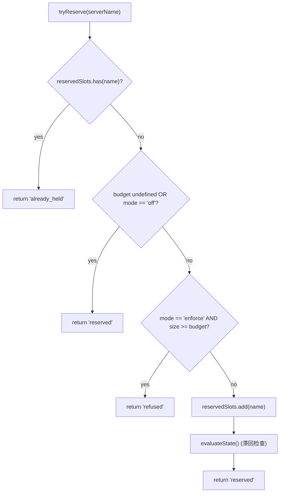
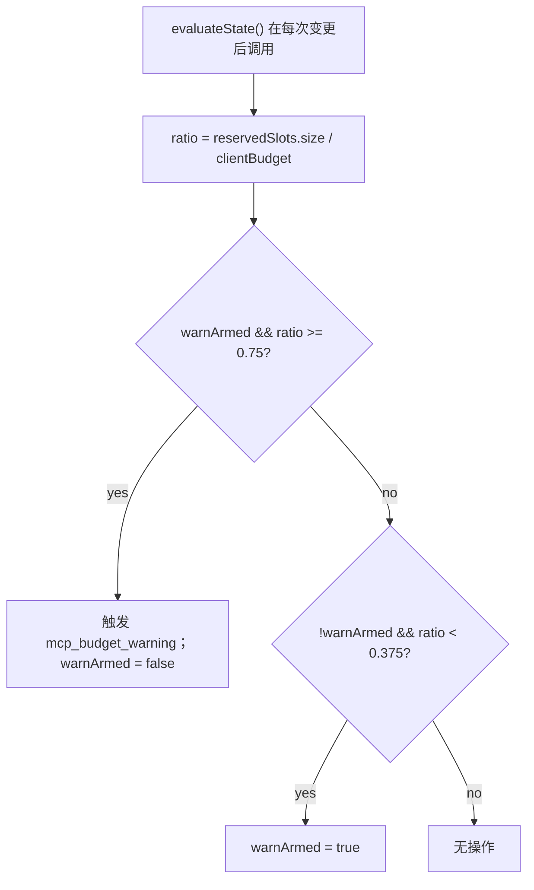
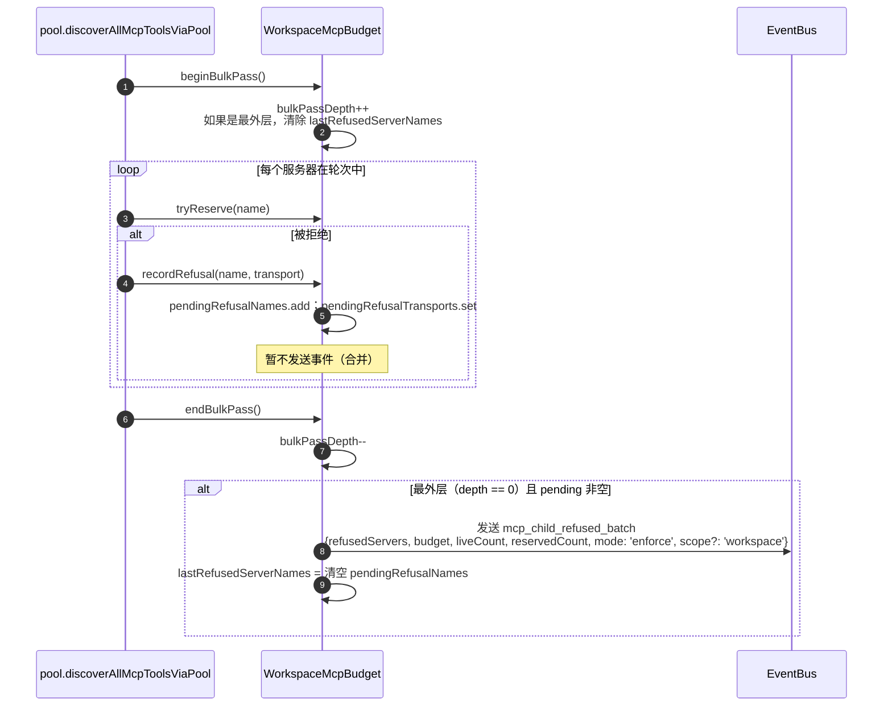

# MCP 工作空间预算保护机制

## 概述

`WorkspaceMcpBudget`（`packages/core/src/tools/mcp-workspace-budget.ts`）是从 F2（#4175 commit 6）引入的、作用于工作空间范围的 MCP 客户端预算控制器。它拥有与 `McpClientManager` 内联相同的状态机（预留插槽、75% 滞回警告、跨 `discoverAllMcpTools*` 轮次的拒绝批量合并），但它在 `McpTransportPool` 内部**每个工作空间仅有一份**，而非每个会话在 ACP 子进程的 manager 中各有一份。池将 `acquire` 和 `release` 调用委托给此处，因此限制作用于**工作空间**，而非每个会话。

旧的 `McpClientManager` 预算机制保留用于独立 qwen 和 SDK MCP 服务器（它们在 commit 4 修复后绕过池）。池模式 → `WorkspaceMcpBudget` 强制执行；独立 / SDK MCP → manager 的内联机制强制执行。不存在重复计数，因为池模式的发现过程从不调用 manager 的 `tryReserveSlot`。

## 职责

- 跟踪 `reservedSlots: Set<string>`，记录当前持有的服务器名称（插槽键基于名称，与 PR 14 v1 一致）。
- `tryReserve(name) → 'reserved' | 'already_held' | 'refused'` — 原子且同步，因此并发的 `Promise.all` 获取不会在 await 边界处超过上限。
- `release(name) → boolean` — 幂等（`Set.delete` 语义）。
- 当 `reservedSlots.size / clientBudget` 向上越过 75% 时触发一次 `mcp_budget_warning`；仅在向下越过 37.5% 后重新布防。
- 跨批量发现轮次合并每个服务器的拒绝 — `beginBulkPass()` / `endBulkPass()` 将拒绝累积打包为一个 `mcp_child_refused_batch` 事件。
- 维护 `lastRefusedServerNames` 供快照消费者（`GET /workspace/mcp`）使用 — 在下一次批量轮次**开始**时清除，而非在事件发送时清除，因此轮次之间的快照仍能看到上一次的拒绝集合。

## 架构

### 配置

```ts
new WorkspaceMcpBudget({
  clientBudget?: number,           // undefined = 无限制
  mode: 'off' | 'warn' | 'enforce',
  onEvent?: (event: McpBudgetEvent) => void,
});
```

`mode` 含义：

- `off` — 所有方法均为空操作；`tryReserve` 无条件返回 `'reserved'`；不触发任何事件。
- `warn` — 跟踪插槽，并在 75% 时触发 `mcp_budget_warning`，但 `tryReserve` **从不拒绝**。
- `enforce` — `tryReserve` 在超过 `clientBudget` 时拒绝；`recordRefusal` 排队每个服务器的拒绝；`endBulkPass` 发送 `mcp_child_refused_batch`。

### 常量（来自 `mcp-client-manager.ts`）

- `MCP_BUDGET_WARN_FRACTION = 0.75` — 向上触发阈值。
- `MCP_BUDGET_REARM_FRACTION = 0.375` — 向下滞回重新布防阈值。
- `McpBudgetMode = 'off' | 'warn' | 'enforce'`。

### 内部状态

| 状态                                             | 目的                                                                                                      |
| ------------------------------------------------ | --------------------------------------------------------------------------------------------------------- |
| `reservedSlots: Set<string>`                     | 权威预留集合；滞回评估 `size / clientBudget`。                                                             |
| `pendingRefusalNames: Set<string>`               | 在当前的 `beginBulkPass`/`endBulkPass` 窗口内累积的拒绝名称；在 `endBulkPass` 时清空。                   |
| `pendingRefusalTransports: Map<string, transport>` | 辅助映射，使发出的批量事件携带每个被拒绝服务器的传输层。                                                  |
| `lastRefusedServerNames: readonly string[]`      | 最近一次完成的轮次中可供快照查看的拒绝列表。在下一次轮次开始时清除。                                      |
| `warnArmed: boolean`                             | 滞回状态 — true = 可触发，false = 自上次 37.5% 下降后已触发过。                                           |
| `bulkPassDepth: number`                          | 嵌套批量轮次的可重入计数器（嵌套轮次不得重复发送事件）。                                                  |

## 工作流程

### `tryReserve`



`tryReserve` 是**同步**的。池的 `acquire` 是异步的，但预留发生在任何 `await` 之前，因此两个不同名称的并发 `Promise.all` 获取不会同时超过上限。

### 滞回



滞回机制可避免在工作负载在 75% 附近摆动时重复发送警告。第一次越过阈值时触发；未下降到 37.5% 之前再次越界不会触发。

### 拒绝批量合并



轮次外的拒绝（例如完全绕过批量轮次的惰性 `readResource` 生成）会以内联方式发送长度为 1 的批次，以保持形状一致。嵌套轮次（`bulkPassDepth > 0`）不会发送；仅最外层的轮次结束时才会发送合并批次。

## 状态与生命周期

- 预算控制器在池初始化时每个工作空间创建一次。
- `clientBudget` 构造后不可变；运行时更改需要重建池。
- `mode` 同样不可变（作为深度防御，当 `mode === 'off'` 时将 `onEvent` 存储为 `undefined`）。
- `warnArmed` 初始为 true；通过 37.5% 向下越界重置为 true。
- `lastRefusedServerNames` 不会在 `endBulkPass` 发送时清空 — 仅在**下一次**批量轮次开始时清空。这使得轮次之间调用的快照路由仍能报告上一次拒绝集合（否则，在拒绝批次事件送达后，仪表盘会立即显示空拒绝）。

## 依赖关系

- `packages/core/src/tools/mcp-client-manager.ts` — 复用 `McpBudgetEvent`、`McpBudgetMode`、`McpRefusedServer`、`MCP_BUDGET_WARN_FRACTION`、`MCP_BUDGET_REARM_FRACTION`、`BudgetExhaustedError`（池的 `acquire` 在拒绝时抛出）。
- `packages/core/src/tools/mcp-transport-pool.ts` — 消费预算；通过池的 `onEvent` 管道将事件传递给守护进程的 EventBus。
- 守护进程快照路由 `GET /workspace/mcp` — 读取 `getReservedSlots()`、`getRefusedServerNames()`、`getReservedCount()`、`getBudget()`、`getMode()`。

## 配置

| 来源           | 配置项                                                                                     | 效果                                                                                       |
| -------------- | ------------------------------------------------------------------------------------------ | ------------------------------------------------------------------------------------------ |
| 标志           | `--mcp-client-budget=N`                                                                    | 为工作空间控制器设置 `clientBudget`。                                                        |
| 标志           | `--mcp-budget-mode={off,warn,enforce}`                                                     | 设置 `mode`。`enforce` 需要正的 `clientBudget`；否则启动时显式失败。                         |
| 环境变量       | `QWEN_SERVE_MCP_CLIENT_BUDGET`、`QWEN_SERVE_MCP_BUDGET_MODE`                               | 通过 `childEnvOverrides` 转发给 ACP 子进程；子进程的 `readBudgetFromEnv()` 会检测到它们。      |
| 能力标签       | `mcp_guardrails`（始终；`modes: ['warn', 'enforce']`）、`mcp_guardrail_events`（始终）     | 参见 [`11-capabilities-versioning.md`](./11-capabilities-versioning.md)。                   |

## 注意事项与已知限制

- **预留键基于名称。** 两个池条目具有相同的服务器名称但不同的指纹（例如，会话注入不同的 OAuth 头）将占用同一个插槽。子进程的统计分别在池快照的 `subprocessCount` 中暴露。操作员应将预算视为“已配置的服务器插槽”而非“子进程数量”。
- **滞回基于预留计数触发，而非实时（已连接）计数。** 预留包括正在进行的连接，并在瞬时断开后仍然存在，因此滞回可在重连周期中保持稳定。实时计数在事件载荷中作为 `liveCount` 暴露，供需要该视角的 SDK 消费者使用。
- **`warn` 模式从不拒绝。** 它仍然跟踪预留并触发 `mcp_budget_warning`，但 `tryReserve` 始终返回 `'reserved'`。拒绝语义仅由 `enforce` 模式实现。
- **工作空间范围的预算事件携带 `scope: 'workspace'`**，因此它们会同时扩散到每个附属会话。同一连接上所有会话的 SDK 订约方（reducer）会同步递增 `mcpBudgetWarningCount` / `mcpChildRefusedBatchCount`。来自 `McpClientManager` 的按会话旧事件不携带 `scope`（语义上默认为 `'session'`）。
- **开关 `QWEN_SERVE_NO_MCP_POOL=1`** 会完全禁用池；工作空间预算也会被禁用，由按会话的 `McpClientManager` 预算接管。能力包会移除 `mcp_workspace_pool` 和 `mcp_pool_restart` 以准确报告这一情况。
- **`ServeMcpBudgetStatusCell.scope` 是一个向前兼容的列表形状。** 快照单元格暴露 `budgets[]`，而不是单个 `budget?` 字段。PR 14 v1 为每个 ACP 会话发送一个 `scope: 'session'` 的单元格，因为 `acpAgent.newSessionConfig()` 会构造该会话的 `Config` / `McpClientManager`。`'pool'` 作用域保留给 Wave 5 PR 23 中的池作用域单元格，该单元格将与会话作用域单元格并存。消费者必须通过丢弃未知的 `scope` 值来处理其他未知值，而不是失败。

## 参考资料

- `packages/core/src/tools/mcp-workspace-budget.ts`（完整类）
- `packages/core/src/tools/mcp-client-manager.ts`（`BudgetExhaustedError`、`McpBudgetEvent`、滞回常量）
- `packages/core/src/tools/mcp-transport-pool.ts`（池中调用 `tryReserve` 的 `acquire` 站点）
- F2 设计文档（v2.2）：[`../../design/f2-mcp-transport-pool.md`](../../design/f2-mcp-transport-pool.md) §11，关于工作空间级别的预算以及 v2.2 变更日志中关于预算和指纹后续内容的条目。
- F2 设计注释：issue [#4175](https://github.com/QwenLM/qwen-code/issues/4175) commit 6。