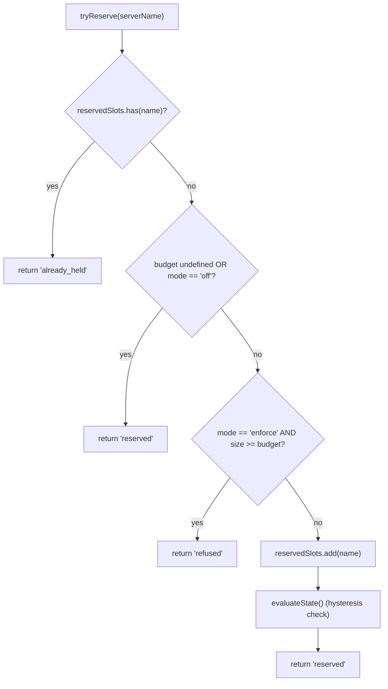
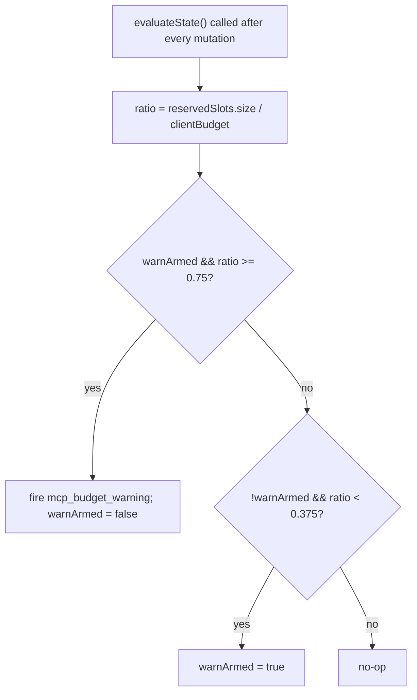

# MCP 工作区预算保护机制

## 概述

`WorkspaceMcpBudget`（`packages/core/src/tools/mcp-workspace-budget.ts`）是 F2（#4175 commit 6）引入的工作区级 MCP 客户端预算控制器。它拥有与 `McpClientManager` 内联维护的同一状态机（插槽预留、75% 迟滞警告、跨 `discoverAllMcpTools*` 遍历的拒绝批次合并），但**每个工作区只实例化一次**，存在于 `McpTransportPool` 内，而不是每个会话在各自的 ACP 子进程 manager 中各一份。Pool 将 `acquire` 和 `release` 调用委托给它，使容量上限作用于**工作区**，而非每个会话。

遗留的 `McpClientManager` 预算机制仍然保留，用于独立 qwen 和 SDK MCP 服务器（根据 commit 4 修复，它们绕过 pool）。Pool 模式 → 由 `WorkspaceMcpBudget` 执行；独立 / SDK MCP → 由 manager 的内联机制执行。不会双重计数，因为 pool 模式的发现流程不会调用 manager 的 `tryReserveSlot`。

## 职责

- 追踪 `reservedSlots: Set<string>`，记录当前持有的服务器名称（插槽键为每个 NAME，与 PR 14 v1 保持一致）。
- `tryReserve(name) → 'reserved' | 'already_held' | 'refused'` — 原子且同步，确保并发的 `Promise.all` 获取不会在 await 边界同时通过容量上限。
- `release(name) → boolean` — 幂等（`Set.delete` 语义）。
- 在 `reservedSlots.size / clientBudget` 上升到 75% 时触发一次 `mcp_budget_warning`；仅在下降到 37.5% 后才重新启用。
- 在批量发现遍历中合并每个服务器的拒绝——`beginBulkPass()` / `endBulkPass()` 将拒绝合并为单个 `mcp_child_refused_batch` 事件。
- 维护 `lastRefusedServerNames` 供快照消费者（`GET /workspace/mcp`）使用——在下一次批量遍历**开始时**清除，而非在 emit 时清除，因此遍历间的快照仍可看到上一次的拒绝集合。

## 架构

### 配置

```ts
new WorkspaceMcpBudget({
  clientBudget?: number,           // undefined = 无限制
  mode: 'off' | 'warn' | 'enforce',
  onEvent?: (event: McpBudgetEvent) => void,
});
```

`mode` 语义：

- `off` — 所有方法均为空操作；`tryReserve` 无条件返回 `'reserved'`；不触发任何事件。
- `warn` — 追踪插槽并在 75% 时触发 `mcp_budget_warning`，但 `tryReserve` **永不**拒绝。
- `enforce` — `tryReserve` 超过 `clientBudget` 后拒绝；`recordRefusal` 将每个服务器的拒绝入队；`endBulkPass` 发出 `mcp_child_refused_batch`。

### 来自 `mcp-client-manager.ts` 的常量

- `MCP_BUDGET_WARN_FRACTION = 0.75` — 上升阈值。
- `MCP_BUDGET_REARM_FRACTION = 0.375` — 下降迟滞重新启用阈值。
- `McpBudgetMode = 'off' | 'warn' | 'enforce'`。

### 内部状态

| 状态                                               | 用途                                                                                                          |
| -------------------------------------------------- | ------------------------------------------------------------------------------------------------------------- |
| `reservedSlots: Set<string>`                       | 权威预留集合；迟滞以 `size / clientBudget` 评估。                                                             |
| `pendingRefusalNames: Set<string>`                 | 当前 `beginBulkPass`/`endBulkPass` 窗口中累积的拒绝名称；在 `endBulkPass` 时清空。                           |
| `pendingRefusalTransports: Map<string, transport>` | 附带数据，使发出的批次包含每个被拒服务器的 transport。                                                        |
| `lastRefusedServerNames: readonly string[]`        | 最近一次完成的遍历的快照可见拒绝列表。在下一次遍历开始时清除。                                                |
| `warnArmed: boolean`                               | 迟滞状态——true 表示准备触发，false 表示自上次 37.5% 回落前已触发过。                                         |
| `bulkPassDepth: number`                            | 嵌套批量遍历的可重入计数器（嵌套遍历不得重复 emit）。                                                        |

## 工作流程

### `tryReserve`



`tryReserve` 是**同步**的。Pool 的 `acquire` 是异步的，但预留发生在任何 `await` 之前，因此两个并发的 `Promise.all` 获取不同名称时，不会同时通过容量上限。

### 迟滞机制



迟滞机制避免了在负载在 75% 附近波动时重复告警。第一次越过阈值时触发；在未回落到 37.5% 之前，后续越过阈值不会再次触发。

### 拒绝批次合并

```mermaid
sequenceDiagram
    autonumber
    participant POOL as pool.discoverAllMcpToolsViaPool
    participant BDG as WorkspaceMcpBudget
    participant EB as EventBus

    POOL->>BDG: beginBulkPass()
    BDG->>BDG: bulkPassDepth++<br/>clear lastRefusedServerNames if outermost
    loop per server in pass
        POOL->>BDG: tryReserve(name)
        alt refused
            POOL->>BDG: recordRefusal(name, transport)
            BDG->>BDG: pendingRefusalNames.add; pendingRefusalTransports.set
            Note over BDG: NO event yet (coalesce)
        end
    end
    POOL->>BDG: endBulkPass()
    BDG->>BDG: bulkPassDepth--
    alt outermost (depth == 0) AND pending non-empty
        BDG->>EB: emit mcp_child_refused_batch<br/>{refusedServers, budget, liveCount, reservedCount, mode: 'enforce', scope?: 'workspace'}
        BDG->>BDG: lastRefusedServerNames = drain pendingRefusalNames
    end
```

遍历外的拒绝（例如完全绕过批量遍历的懒加载 `readResource` 启动）以长度为 1 的批次内联 emit，以保持形状一致。嵌套遍历（`bulkPassDepth > 0`）不触发 emit；只有最外层的 `endBulkPass` 才发出合并后的批次。

## 状态与生命周期

- 预算控制器在 pool 初始化时每个工作区构建一次。
- `clientBudget` 构建后不可变；运行时更改需要重建 pool。
- `mode` 同样不可变（当 `mode === 'off'` 时，`onEvent` 被存储为 `undefined` 作为纵深防御）。
- `warnArmed` 初始为 true；通过 37.5% 下降越过重置为 true。
- `lastRefusedServerNames` **不在** `endBulkPass` emit 时清除——仅在下一次批量遍历**开始时**清除。这样，在遍历间调用的快照路由仍可报告上一次的拒绝集合（否则，在 refused-batch 事件发出后，仪表盘会立即看到空的拒绝列表）。

## 依赖

- `packages/core/src/tools/mcp-client-manager.ts` — 复用 `McpBudgetEvent`、`McpBudgetMode`、`McpRefusedServer`、`MCP_BUDGET_WARN_FRACTION`、`MCP_BUDGET_REARM_FRACTION`、`BudgetExhaustedError`（pool 的 `acquire` 在拒绝时抛出）。
- `packages/core/src/tools/mcp-transport-pool.ts` — 消费预算；通过 pool 的 `onEvent` 管道将事件传递到 daemon EventBus。
- Daemon 快照路由 `GET /workspace/mcp` — 读取 `getReservedSlots()`、`getRefusedServerNames()`、`getReservedCount()`、`getBudget()`、`getMode()`。

## 配置

| 来源            | 参数                                                                                       | 效果                                                                                          |
| --------------- | ----------------------------------------------------------------------------------------- | --------------------------------------------------------------------------------------------- |
| Flag            | `--mcp-client-budget=N`                                                                   | 设置工作区控制器的 `clientBudget`。                                                           |
| Flag            | `--mcp-budget-mode={off,warn,enforce}`                                                    | 设置 `mode`。`enforce` 需要正整数 `clientBudget`；否则启动时明确失败。                        |
| 环境变量        | `QWEN_SERVE_MCP_CLIENT_BUDGET`、`QWEN_SERVE_MCP_BUDGET_MODE`                              | 通过 `childEnvOverrides` 转发给 ACP 子进程；子进程的 `readBudgetFromEnv()` 读取这些值。      |
| Capability tags | `mcp_guardrails`（始终；`modes: ['warn', 'enforce']`）、`mcp_guardrail_events`（始终）    | 参见 [`11-capabilities-versioning.md`](./11-capabilities-versioning.md)。                     |

## 注意事项与已知限制

- **预留键是按 NAME 计的。** 两个具有相同服务器名称但不同 fingerprint 的 pool 条目（例如会话注入了不同 OAuth 头）共享**一个**插槽。子进程计数通过 pool 快照的 `subprocessCount` 单独暴露。运维人员应将预算理解为"已配置的服务器插槽"而非"子进程数量"。
- **迟滞触发基于预留数，而非活跃（CONNECTED）数。** 预留包括正在连接中的请求，并在瞬时断连后仍然保持，因此迟滞在重连周期中保持稳定。活跃数通过事件载荷的 `liveCount` 字段暴露，供需要该视角的 SDK 消费者使用。
- **`warn` 模式永不拒绝。** 它仍追踪预留并触发 `mcp_budget_warning`，但 `tryReserve` 始终返回 `'reserved'`。拒绝语义仅在 `enforce` 模式下生效。
- **工作区级预算事件携带 `scope: 'workspace'`**，因此会同时扇出到所有已连接的会话。SDK reducer 的 `mcpBudgetWarningCount` / `mcpChildRefusedBatchCount` 在同一连接的各会话中同步递增。来自 `McpClientManager` 的每会话遗留事件不携带 `scope`（语义上默认为 `'session'`）。
- **Kill switch `QWEN_SERVE_NO_MCP_POOL=1`** 完全禁用 pool；工作区预算也随之禁用，由每会话 `McpClientManager` 预算接管。capabilities envelope 会移除 `mcp_workspace_pool` 和 `mcp_pool_restart` 以准确反映这一状态。
- **`ServeMcpBudgetStatusCell.scope` 是向前兼容的列表结构。** 快照 cell 暴露 `budgets[]`，而非单个 `budget?` 字段。PR 14 v1 为每个 ACP 会话 emit 一个 `scope: 'session'` cell，因为 `acpAgent.newSessionConfig()` 为该会话构建 `Config` / `McpClientManager`。`'pool'` scope 保留给 Wave 5 PR 23 中将与会话级 cell 并列的 pool 级 cell。消费者遇到未知的 `scope` 值时，应直接丢弃而非报错。

## 参考

- `packages/core/src/tools/mcp-workspace-budget.ts`（完整类）
- `packages/core/src/tools/mcp-client-manager.ts`（`BudgetExhaustedError`、`McpBudgetEvent`、迟滞常量）
- `packages/core/src/tools/mcp-transport-pool.ts`（pool 中调用 `tryReserve` 的 `acquire` 处）
- F2 设计文档（v2.2）：[`../../design/f2-mcp-transport-pool.md`](../../design/f2-mcp-transport-pool.md) §11，关于工作区级预算及 v2.2 更新日志中预算与 fingerprint 后续的条目。
- F2 设计说明：issue [#4175](https://github.com/QwenLM/qwen-code/issues/4175) commit 6。
