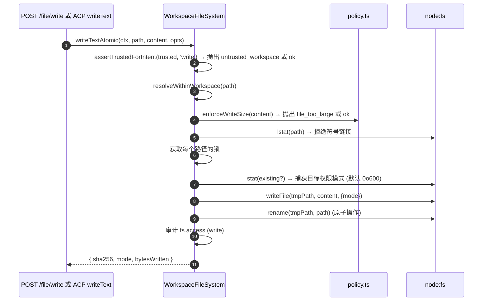
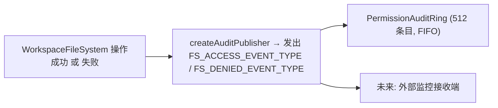

# 工作区文件系统边界

## 概述

守护进程绝不允许 HTTP 路由或 ACP 侧的 Agent 调用直接触及宿主机文件系统。每次读取、写入、列出、glob 和 stat 操作都通过 `WorkspaceFileSystem` 边界（`packages/cli/src/serve/fs/`）进行，该边界提供以下能力：

- **路径解析** — 规范化路径，拒绝任何逃逸出绑定工作区的路径（包括通过符号链接逃逸）。
- **信任门控** — 当工作区不被信任时拒绝写入（`untrusted_workspace`）。
- **大小与内容策略** — 读取上限（`MAX_READ_BYTES = 256 KiB`），写入上限（`MAX_WRITE_BYTES = 5 MiB`），二进制文件检测。
- **原子性** — 先写入再重命名，保留目标文件权限模式，新文件默认权限为 `0o600`。
- **审计** — 每次访问/拒绝都会发出结构化事件，供 `PermissionAuditRing` / 监控使用。
- **类型化错误** — 封闭的 `FsErrorKind` 联合类型，映射到 HTTP 状态码。

HTTP 文件路由（`GET /file`、`GET /file/bytes`、`POST /file/write`、`POST /file/edit`、`GET /list`、`GET /glob`、`GET /stat`）以及 ACP 侧的 `BridgeFileSystem` 适配器（使 Agent 驱动的 `readTextFile` / `writeTextFile` 调用也受到相同的门控限制）都经过此边界。

## 职责

- 将用户提供的路径解析为具有品牌标记的 `ResolvedPath` 值，边界内的其余部分可以安全地使用这些值。
- 拒绝超出绑定工作区的路径（`path_outside_workspace`），以及目标为符号链接的路径（`symlink_escape`）。
- 拒绝超过 `MAX_READ_BYTES` 的读取、超过 `MAX_WRITE_BYTES` 的写入以及二进制文件（`binary_file`）。
- 当工作区不被信任时，拒绝写入/编辑（`untrusted_workspace`）— 通过 `assertTrustedForIntent(trusted, intent)` 门控。
- 通过 `shouldIgnore` 遵循 `.gitignore` / `.qwenignore` 模式。
- 执行原子性的写入-重命名操作，并保留目标文件权限模式；新文件默认权限为 `0o600`。
- 每次操作均发出 `fs.access` / `fs.denied` 审计事件。
- 将每次失败映射为带有 kind 和 HTTP 状态码的 `FsError`；路由处理器统一序列化它们。

## 架构

### 模块布局

| 文件                       | 用途                                                                                                                                                                                                                         |
| ------------------------ | ---------------------------------------------------------------------------------------------------------------------------------------------------------------------------------------------------------------------------- |
| `paths.ts`               | `canonicalizeWorkspace`、`resolveWithinWorkspace`、`hasSuspiciousPathPattern`、品牌标记 `ResolvedPath`、`Intent` 联合类型（`read \| write \| list \| stat \| glob`）。                                                                 |
| `policy.ts`              | `MAX_READ_BYTES`、`MAX_WRITE_BYTES`、`BINARY_PROBE_BYTES`、`assertTrustedForIntent`、`detectBinary`、`enforceReadBytesSize`、`enforceReadSize`、`enforceWriteSize`、`shouldIgnore`。                                              |
| `audit.ts`               | `FS_ACCESS_EVENT_TYPE`、`FS_DENIED_EVENT_TYPE`、`createAuditPublisher`、审计载荷类型。                                                                                                                                         |
| `errors.ts`              | `FsError` 类、`isFsError`、`FsErrorKind` 联合类型（14 种）、`FsErrorStatus` 联合类型（`400 / 403 / 404 / 409 / 413 / 422 / 500 / 503`）。                                                                                          |
| `workspace-file-system.ts` | `createWorkspaceFileSystemFactory`、`WorkspaceFileSystem`（编排器，执行读/写/列出操作）、`WriteMode`、`ContentHash`、`FsEntry`、`FsStat`、`ListOptions`、`GlobOptions`、`ReadTextOptions`、`ReadBytesOptions`、`WriteTextAtomicOptions`。 |

### `FsErrorKind` 分类

| Kind                     | 默认 HTTP | 含义                                                                                                                                                                                       |
| ------------------------ | --------- | ------------------------------------------------------------------------------------------------------------------------------------------------------------------------------------------ |
| `path_outside_workspace` | 400       | 解析后的路径位于绑定工作区之外。                                                                                                                                                           |
| `symlink_escape`         | 400       | 目标是符号链接（根据保守的 PR 18 + PR 20 的立场拒绝）。                                                                                                                                 |
| `path_not_found`         | 404       | `ENOENT`。                                                                                                                                                                                |
| `binary_file`            | 422       | 在文本路径上内容被嗅探为二进制。                                                                                                                                                           |
| `file_too_large`         | 413       | 超过 `MAX_READ_BYTES` 或 `MAX_WRITE_BYTES`。                                                                                                                                              |
| `hash_mismatch`          | 409       | 乐观并发检查 `expectedSha256` 失败。                                                                                                                                                      |
| `file_already_exists`    | 409       | `mode: 'create'` 但文件已存在。                                                                                                                                                          |
| `text_not_found`         | 422       | `POST /file/edit` 的搜索字符串未在文件中找到。                                                                                                                                               |
| `ambiguous_text_match`   | 422       | 需要恰好一个匹配时找到了多个匹配。                                                                                                                                                         |
| `untrusted_workspace`    | 403       | 在不被信任的工作区中尝试写入。                                                                                                                                                           |
| `permission_denied`      | 403       | 操作系统级别的 `EACCES` / `EPERM`。                                                                                                                                                        |
| `io_error`               | 503       | `ENOSPC` / `EIO` / `EBUSY` / `ETXTBSY` / `ENAMETOOLONG` / `EMFILE` / `ENFILE`。**与 `permission_denied` 区分开**，这样监控流水线不会因为“磁盘已满”而去通知安全响应人员。                          |
| `internal_error`         | 500       | 到达边界的非 errno 错误（`TypeError`、编程错误）。                                                                                                                                          |
| `parse_error`            | 400 / 422 | 请求体解析错误（400）或服务级不变量违反（422）。                                                                                                                                           |

### `BridgeFileSystem`（ACP 侧适配器）

`packages/acp-bridge/src/bridgeFileSystem.ts` 定义了：

```ts
interface BridgeFileSystem {
  readText(params: ReadTextFileRequest): Promise<ReadTextFileResponse>;
  writeText(params: WriteTextFileRequest): Promise<WriteTextFileResponse>;
}
```

这是 ACP `readTextFile` / `writeTextFile` 的注入点。Bridge 测试和 Mode A 嵌入式调用者可以在 `BridgeOptions` 上省略它；`BridgeClient` 会回退到其内联的 `fs.readFile` / `fs.writeFile` 代理（保留 F1 之前的行为）。生产环境的 `qwen serve` 通过 `createBridgeFileSystemAdapter(fsFactory)`（`packages/cli/src/serve/bridge-file-system-adapter.ts`）将 `BridgeFileSystem` 连接起来，以便 Agent 侧的 ACP 写入能够应用与 HTTP 路由相同的 TOCTOU、符号链接、信任门控和审计门控。

适配器必须复制以下两个防御门控（因为当适配器被注入时，内联代理会完全绕过）：

1. **拒绝非普通文件** — 套接字/管道/字符设备/procfs/sysfs 条目尽管 `stats.size === 0` 也能流式传输无界数据。内联路径会抛出异常，消息中包含 `describeStatKind(stats)`。
2. **限制缓冲大小** 为 `READ_FILE_SIZE_CAP = 100 MiB`。对一个 500 MB 的日志文件发起 `{ line: 1, limit: 10 }` 的小请求，如果仅为了返回 10 行，代价可能是 500 MB 的 RSS 内存。

适配器更进一步：它使用 `WorkspaceFileSystem.writeTextOverwrite`（PR 18 原语）执行原子性的临时文件与重命名写入，保留权限模式，默认 `0o600`，并在每个路径的锁内拒绝符号链接。这与 **F1 之前的内联代理有所不同**，后者会解析符号链接并写入其目标——依赖通过符号链接点文件写入的 Agent 现在必须直接处理已解析的路径。

### 通过 ACP 线缆保留 `FsError`

当 `BridgeFileSystem` 适配器抛出 `FsError`（`kind: 'untrusted_workspace'` / `'symlink_escape'` / `'file_too_large'` 等）时，ACP SDK 的默认 RPC 错误路径仅将 `error.message` 序列化为通用的 `-32603 "Internal error"` — `kind` / `status` / `hint` 被剥离。下游 Agent RPC 客户端因此不得不通过正则匹配人类可读的消息来分派类型化 UI（鉴权重试 vs 文件选择器 vs 代理提示）。

`BridgeClient.writeTextFile` 和 `BridgeClient.readTextFile` 安装了一个薄防护层（`packages/acp-bridge/src/bridgeClient.ts`），捕获具有 FsError 形状的抛出并将其重新抛出为 ACP `RequestError`：

```ts
function isFsErrorShape(err: unknown): err is FsErrorShape {
  return (
    err instanceof Error &&
    err.name === 'FsError' &&
    typeof (err as { kind?: unknown }).kind === 'string'
  );
}

function preserveFsErrorOverAcp(err: unknown): never {
  if (isFsErrorShape(err)) {
    throw new RequestError(-32603, err.message, {
      errorKind: err.kind,
      ...(err.hint !== undefined ? { hint: err.hint } : {}),
      ...(err.status !== undefined ? { status: err.status } : {}),
    });
  }
  throw err;
}
```

Agent 的 RPC 客户端现在会收到 `data.errorKind`（封闭的 `FsErrorKind` 值）以及可选的 `data.hint` 和 `data.status`，因此 SDK 使用者可以基于类型化的枚举进行分支，而不是通过正则匹配消息。

两个设计要点：

- **鸭子类型而非导入** — `FsError` 位于 `packages/cli/src/serve/fs/errors.ts`，而 `BridgeClient` 位于 `packages/acp-bridge`。直接 `import { FsError }` 会反转依赖关系。鸭子检查（`name === 'FsError'` + `kind: string`）与 `mapDomainErrorToErrorKind`（`status.ts`）对 `TrustGateError` / `SkillError` 的处理方式相同，出于同样的跨包打包原因。
- **JSON-RPC 代码保持为 -32603** — Bridge 无法可靠地将 `FsError.kind` 映射为 JSON-RPC 错误代码形状，因此结构化的 `data` 字段携带语义信息供 SDK 使用者使用。线缆上的状态码（`-32603` "internal error"）不变；客户端根据 `data.errorKind` 进行路由。

### 信任门控

`assertTrustedForIntent(trusted, intent)` 消费由调用者注入的信任布尔值；策略层不直接读取 `Config.isTrustedFolder()`。读取/列出/stat/glob 始终被允许（信任仅针对写入）。在不被信任的工作区中进行写入意图会抛出 `FsError('untrusted_workspace', ..., status: 403)`。信任信号通过 `WorkspaceFileSystemFactoryDeps.trusted: boolean` 传入 — `runQwenServe` 传递 `true` 因为操作者启动守护进程时针对的工作区是隐式信任的；`createServeApp`（直接嵌入而不使用 `runQwenServe`）默认值为 `false` 并且每个进程警告一次（参见 [`02-serve-runtime.md`](./02-serve-runtime.md)）。

## 工作流

### 读取

```mermaid
sequenceDiagram
    autonumber
    participant R as HTTP 路由 或 BridgeFileSystem.readText
    participant FS as WorkspaceFileSystem
    participant POL as policy.ts
    participant FSP as node:fs

    R->>FS: readText(ctx, path, opts)
    FS->>FS: resolveWithinWorkspace(path) → ResolvedPath 或抛出异常
    FS->>FSP: stat(path)
    FSP-->>FS: stats
    FS->>FS: 如果不是普通文件则拒绝 (describeStatKind)
    FS->>POL: enforceReadSize(stats.size, opts.maxBytes?)<br/>→ 抛出 file_too_large 或切片计划
    FS->>FSP: readFile(path)
    FSP-->>FS: buffer
    FS->>POL: detectBinary(buffer)
    POL-->>FS: isBinary?
    FS->>FS: 如果是二进制则拒绝; 计算 sha256 哈希; 截断到行窗口
    FS->>FS: shouldIgnore? → 注释 meta.matchedIgnore
    FS->>FS: 审计 fs.access
    FS-->>R: { content, sha256, truncated?, meta }
```

`readText` 不会因为忽略规则而跳过或拒绝读取。它会正常读取文件，并在 `meta.matchedIgnore` 中记录匹配的忽略分类。`list` 和 `glob` 只有在未启用 `includeIgnored` 时才会过滤被忽略的结果。

### 写入



先写入再重命名的原子操作保证了中途发生 SIGKILL / OOM 时**不会**导致目标文件被截断。`mode: 'create'` 在 lstat 时如果文件已存在则中止并抛出 `file_already_exists`；`mode: 'overwrite'` 继续执行；`expectedSha256` 启用了乐观并发检查（不匹配则抛出 `hash_mismatch`）。

### `POST /file/edit`（单一文本替换）

在写入的基础上增加了两个失败模式：

- `text_not_found` (422) — 搜索字符串不在文件中。
- `ambiguous_text_match` (422) — 需要恰好一个匹配时找到了多个匹配（路由的约定）。

### 审计扇出



`FS_ACCESS_EVENT_TYPE` / `FS_DENIED_EVENT_TYPE` 携带上下文（`ctx`）、路径、意图、结果、errorKind?、读取/写入的字节数、sha256?。

## 状态与生命周期

- 工厂在守护进程启动时构建一次（`runQwenServe` → `resolveBridgeFsFactory` → 适配器）。
- 每个请求构造一个 `RequestContext` 并仅为该次调用调用工厂的编排器 — 没有长期存在的每个文件状态。
- 每个路径的锁仅持续写入操作期间（没有跨调用的锁定；对同一路径的并发写入会在锁上竞争并顺序执行）。
- 审计环由 `runQwenServe` 拥有，并与权限审计发布者共享。

## 依赖项

- `@qwen-code/qwen-code-core` — `Ignore`、`isBinaryFile`、`Config.isTrustedFolder()`。
- `node:fs`、`node:path`、`node:crypto`。
- `@qwen-code/acp-bridge` — ACP 侧的 `BridgeFileSystem` 合同。
- HTTP 路由：`packages/cli/src/serve/routes/workspace-file-read.ts`、`workspace-file-write.ts`。

## 配置

| 来源                                              | 旋钮                                                                  | 效果                                                                                                            |
| ------------------------------------------------- | --------------------------------------------------------------------- | --------------------------------------------------------------------------------------------------------------- |
| `WorkspaceFileSystemFactoryDeps.trusted: boolean` | 构造函数输入                                                          | 是否允许写入；`runQwenServe` 下默认为 `true`，`createServeApp` 下默认为 `false`（带警告）。                     |
| 常量                                              | `MAX_READ_BYTES = 256 KiB`                                            | 读取上限；超过则抛出 `file_too_large`。                                                                         |
| 常量                                              | `MAX_WRITE_BYTES = 5 MiB`                                             | 写入上限；大小低于 `express.json({ limit: '10mb' })`。                                                           |
| 常量                                              | `BINARY_PROBE_BYTES = 4096`                                           | 基于内容的二进制检测采样大小。                                                                                 |
| 能力标签                                          | `workspace_file_read`、`workspace_file_bytes`、`workspace_file_write` | 参见 [`11-capabilities-versioning.md`](./11-capabilities-versioning.md)。                                       |
| 工作区文件                                        | `.gitignore`、`.qwenignore`                                           | 被忽略的路径从 `shouldIgnore` 中返回 `ignored: true`。                                                          |

## 注意事项与已知限制

- **符号链接被拒绝，而非跟随。** 这与 F1 之前的内联 `BridgeClient.writeTextFile` 代理有所不同，后者会解析符号链接。通过符号链接点文件写入的 Agent 需要直接处理已解析的路径。
- **`io_error` 与 `permission_denied` 是分开的。** 不要混为一谈。监控流水线依靠 `errorKind` 进行告警 — 将 ENOSPC 归入 permission_denied 会因 `df -h` 问题而通知安全响应人员。
- **新文件权限默认为 `0o600`，而非 umask 默认值。** 写入系统调用的 `mode` 参数会绕过 umask。写入公开文件的 Agent 应显式传递权限覆盖。
- **`createServeApp` 默认 `trusted: false`** 对于没有注入自定义 `fsFactory` 或 `bridge` 的嵌入器，会静默拒绝 ACP 写入并返回 `untrusted_workspace`。第一次使用时会在 stderr 发出一次性警告；后续调用者看不到提醒。参见 [`02-serve-runtime.md`](./02-serve-runtime.md)。
- **读取上限在解码前执行。** 即使请求只需 10 行，如果文件大小为 `MAX_READ_BYTES + 1` 也会被拒绝 — 因为底层 `readFileWithLineAndLimit` 在切片前会将整个文件读入内存。
- **`BridgeFileSystem` 适配器必须同时复制两个内联代理门控**（拒绝非普通文件 + 缓冲大小上限）。当适配器被注入时，内联路径会被完全绕过。

## 参考

- `packages/cli/src/serve/fs/index.ts` (桶文件)
- `packages/cli/src/serve/fs/paths.ts`
- `packages/cli/src/serve/fs/policy.ts`
- `packages/cli/src/serve/fs/errors.ts`
- `packages/cli/src/serve/fs/audit.ts`
- `packages/cli/src/serve/fs/workspace-file-system.ts`
- `packages/cli/src/serve/bridge-file-system-adapter.ts`
- `packages/acp-bridge/src/bridgeFileSystem.ts`
- HTTP 路由参考: [`../qwen-serve-protocol.md`](../qwen-serve-protocol.md).