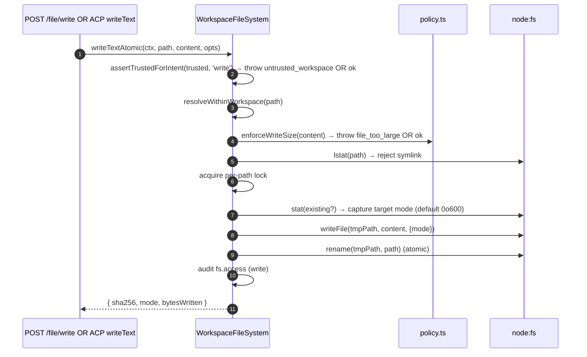
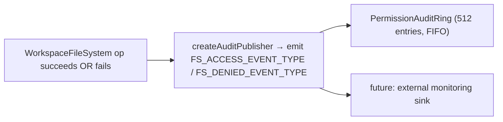

# 工作区文件系统边界

## 概述

daemon 不允许 HTTP 路由或 ACP 侧的 agent 调用直接访问宿主文件系统。所有读取、写入、列举、glob 和 stat 操作都经过 `WorkspaceFileSystem` 边界（`packages/cli/src/serve/fs/`），该边界提供：

- **路径解析** — 规范化路径，拒绝任何试图逃逸绑定工作区的路径（包括通过符号链接）。
- **信任门控** — 当工作区不受信任时（`untrusted_workspace`），拒绝写入操作。
- **大小与内容策略** — 读取上限（`MAX_READ_BYTES = 256 KiB`）、写入上限（`MAX_WRITE_BYTES = 5 MiB`）、二进制文件检测。
- **原子性** — 先写入临时文件再重命名，保留目标文件权限模式，新文件默认使用 `0o600`。
- **审计** — 每次访问或拒绝操作都会向 `PermissionAuditRing` / 监控系统发出结构化事件。
- **类型化错误** — 封闭的 `FsErrorKind` 联合类型，映射到 HTTP 状态码。

HTTP 文件路由（`GET /file`、`GET /file/bytes`、`POST /file/write`、`POST /file/edit`、`GET /list`、`GET /glob`、`GET /stat`）以及 ACP 侧的 `BridgeFileSystem` 适配器（使 agent 驱动的 `readTextFile` / `writeTextFile` 调用经过相同的门控）均通过此边界。

## 职责

- 将用户提供的路径解析为带品牌标记的 `ResolvedPath` 值，供边界其余部分安全使用。
- 拒绝绑定工作区之外的路径（`path_outside_workspace`）以及目标为符号链接的路径（`symlink_escape`）。
- 拒绝超过 `MAX_READ_BYTES` 的读取、超过 `MAX_WRITE_BYTES` 的写入，以及二进制文件（`binary_file`）。
- 当工作区不受信任时拒绝写入/编辑（`untrusted_workspace`）— 通过 `assertTrustedForIntent(trusted, intent)` 进行门控。
- 通过 `shouldIgnore` 遵守 `.gitignore` / `.qwenignore` 规则。
- 执行原子写入后重命名，保留目标文件权限模式；新文件默认权限为 `0o600`。
- 在每次操作时发出 `fs.access` / `fs.denied` 审计事件。
- 将所有失败映射为带 kind 和 HTTP 状态的 `FsError`；路由处理程序统一序列化。

## 架构

### 模块布局

| 文件                     | 用途                                                                                                                                                                                                                                               |
| ------------------------ | -------------------------------------------------------------------------------------------------------------------------------------------------------------------------------------------------------------------------------------------------- |
| `paths.ts`               | `canonicalizeWorkspace`、`resolveWithinWorkspace`、`hasSuspiciousPathPattern`、带标记的 `ResolvedPath`、`Intent` 联合类型（`read \| write \| list \| stat \| glob`）。                                                                              |
| `policy.ts`              | `MAX_READ_BYTES`、`MAX_WRITE_BYTES`、`BINARY_PROBE_BYTES`、`assertTrustedForIntent`、`detectBinary`、`enforceReadBytesSize`、`enforceReadSize`、`enforceWriteSize`、`shouldIgnore`。                                                                |
| `audit.ts`               | `FS_ACCESS_EVENT_TYPE`、`FS_DENIED_EVENT_TYPE`、`createAuditPublisher`、审计载荷类型。                                                                                                                                                             |
| `errors.ts`              | `FsError` 类、`isFsError`、`FsErrorKind` 联合类型（14 种）、`FsErrorStatus` 联合类型（`400 / 403 / 404 / 409 / 413 / 422 / 500 / 503`）。                                                                                                         |
| `workspace-file-system.ts` | `createWorkspaceFileSystemFactory`、`WorkspaceFileSystem`（执行读/写/列举的编排器）、`WriteMode`、`ContentHash`、`FsEntry`、`FsStat`、`ListOptions`、`GlobOptions`、`ReadTextOptions`、`ReadBytesOptions`、`WriteTextAtomicOptions`。 |

### `FsErrorKind` 分类

| Kind                     | 默认 HTTP 状态 | 含义                                                                                                                                                                                       |
| ------------------------ | -------------- | ------------------------------------------------------------------------------------------------------------------------------------------------------------------------------------------ |
| `path_outside_workspace` | 400            | 解析后的路径在绑定工作区之外。                                                                                                                                                              |
| `symlink_escape`         | 400            | 目标是符号链接（按照 PR 18 + PR 20 的保守策略拒绝）。                                                                                                                                       |
| `path_not_found`         | 404            | `ENOENT`。                                                                                                                                                                                 |
| `binary_file`            | 422            | 在文本路由中检测到二进制内容。                                                                                                                                                              |
| `file_too_large`         | 413            | 超过 `MAX_READ_BYTES` 或 `MAX_WRITE_BYTES`。                                                                                                                                               |
| `hash_mismatch`          | 409            | 乐观并发的 `expectedSha256` 校验失败。                                                                                                                                                      |
| `file_already_exists`    | 409            | `mode: 'create'` 时目标文件已存在。                                                                                                                                                        |
| `text_not_found`         | 422            | `POST /file/edit` 的搜索字符串在文件中不存在。                                                                                                                                              |
| `ambiguous_text_match`   | 422            | 要求精确匹配一处时发现多处匹配。                                                                                                                                                            |
| `untrusted_workspace`    | 403            | 在不受信任的工作区中尝试写入。                                                                                                                                                              |
| `permission_denied`      | 403            | OS 级别的 `EACCES` / `EPERM`。                                                                                                                                                             |
| `io_error`               | 503            | `ENOSPC` / `EIO` / `EBUSY` / `ETXTBSY` / `ENAMETOOLONG` / `EMFILE` / `ENFILE`。**与 `permission_denied` 不同**，避免监控管道因"磁盘满"误报安全告警。 |
| `internal_error`         | 500            | 到达边界的非 errno 错误（`TypeError`、程序 bug）。                                                                                                                                          |
| `parse_error`            | 400 / 422      | 请求体解析错误（400）或服务层不变量违反（422）。                                                                                                                                            |

### `BridgeFileSystem`（ACP 侧适配器）

`packages/acp-bridge/src/bridgeFileSystem.ts` 定义：

```ts
interface BridgeFileSystem {
  readText(params: ReadTextFileRequest): Promise<ReadTextFileResponse>;
  writeText(params: WriteTextFileRequest): Promise<WriteTextFileResponse>;
}
```

这是 ACP `readTextFile` / `writeTextFile` 的注入点。Bridge 测试和 Mode A 内嵌调用方可在 `BridgeOptions` 中省略此项；`BridgeClient` 会回退到其内联的 `fs.readFile` / `fs.writeFile` 代理（保留 F1 之前的行为）。生产环境的 `qwen serve` 通过 `createBridgeFileSystemAdapter(fsFactory)`（`packages/cli/src/serve/bridge-file-system-adapter.ts`）将 `BridgeFileSystem` 接入，使 agent 侧的 ACP 写入能经过与 HTTP 路由相同的 TOCTOU、符号链接、信任门控和审计机制。

适配器注入时完全绕过内联代理，因此适配器**必须**复制内联代理的两个防护逻辑：

1. **拒绝非常规文件** — socket、管道、字符设备、procfs/sysfs 条目尽管 `stats.size === 0`，仍可能流式传输无界数据。内联路径会以包含 `describeStatKind(stats)` 的消息抛出异常。
2. **限制缓冲区大小**，上限为 `READ_FILE_SIZE_CAP = 100 MiB`。若对 500 MB 日志发出 `{ line: 1, limit: 10 }` 请求，否则会消耗 500 MB RSS 仅返回 10 行。

适配器更进一步：使用 `WorkspaceFileSystem.writeTextOverwrite`（PR 18 原语）执行原子临时文件后重命名写入，保留文件权限模式，默认 `0o600`，并在每路径锁内拒绝符号链接。这是**与 F1 之前内联代理的行为差异** — 之前的代理会解析符号链接并直接写入目标；依赖通过符号链接 dotfile 写入的 agent 现在需要直接使用解析后的路径。

### FsError 在 ACP 传输中的保留

当 `BridgeFileSystem` 适配器抛出 `FsError`（`kind: 'untrusted_workspace'` / `'symlink_escape'` / `'file_too_large'` 等）时，ACP SDK 默认的 RPC 错误路径仅将 `error.message` 序列化为通用的 `-32603 "Internal error"` — `kind` / `status` / `hint` 均被丢弃。下游 agent 的 RPC 客户端只能通过正则匹配人类可读的消息来分派类型化 UI（认证重试 vs 文件选择器 vs 代理提示）。

`BridgeClient.writeTextFile` 和 `BridgeClient.readTextFile` 在 `packages/acp-bridge/src/bridgeClient.ts` 中安装了一个薄层守卫，捕获 FsError 形状的异常并将其重新抛出为 ACP `RequestError`：

```ts
function isFsErrorShape(err: unknown): err is FsErrorShape {
  return (
    err instanceof Error &&
    err.name === 'FsError' &&
    typeof (err as { kind?: unknown }).kind === 'string'
  );
}

function preserveFsErrorOverAcp(err: unknown): never {
  if (isFsErrorShape(err)) {
    throw new RequestError(-32603, err.message, {
      errorKind: err.kind,
      ...(err.hint !== undefined ? { hint: err.hint } : {}),
      ...(err.status !== undefined ? { status: err.status } : {}),
    });
  }
  throw err;
}
```

agent 的 RPC 客户端现在可收到 `data.errorKind`（封闭的 `FsErrorKind` 值）以及可选的 `data.hint` 和 `data.status`，SDK 消费方可基于类型化枚举分支，而非正则匹配消息。

两点设计说明：

- **鸭子类型而非导入** — `FsError` 位于 `packages/cli/src/serve/fs/errors.ts`，而 `BridgeClient` 位于 `packages/acp-bridge`。直接 `import { FsError }` 会反转依赖关系。鸭子检查（`name === 'FsError'` + `kind: string`）与 `mapDomainErrorToErrorKind`（`status.ts`）对 `TrustGateError` / `SkillError` 的处理方式一致，原因相同（跨包打包）。
- **JSON-RPC 错误码保持 -32603** — bridge 无法可靠地将 `FsError.kind` 映射为 JSON-RPC 错误码，因此结构化的 `data` 字段承载语义信息供 SDK 消费方使用。线路状态码（`-32603` "internal error"）不变；客户端基于 `data.errorKind` 进行路由。

### 信任门控

`assertTrustedForIntent(trusted, intent)` 消费调用方注入的 trust 布尔值；策略层不直接读取 `Config.isTrustedFolder()`。读取 / 列举 / stat / glob 始终允许（信任仅针对写入）。在不受信任的工作区中执行写入意图会抛出 `FsError('untrusted_workspace', ..., status: 403)`。trust 信号通过 `WorkspaceFileSystemFactoryDeps.trusted: boolean` 传入 — `runQwenServe` 传入 `true`，因为操作员启动 daemon 时已隐式信任该工作区；`createServeApp`（不通过 `runQwenServe` 直接内嵌）默认为 `false` 并在进程内警告一次（参见 [`02-serve-runtime.md`](./02-serve-runtime.md)）。

## 工作流

### 读取

```mermaid
sequenceDiagram
    autonumber
    participant R as HTTP route OR BridgeFileSystem.readText
    participant FS as WorkspaceFileSystem
    participant POL as policy.ts
    participant FSP as node:fs

    R->>FS: readText(ctx, path, opts)
    FS->>FS: resolveWithinWorkspace(path) → ResolvedPath OR throw
    FS->>FSP: stat(path)
    FSP-->>FS: stats
    FS->>FS: reject if not regular file (describeStatKind)
    FS->>POL: enforceReadSize(stats.size, opts.maxBytes?)<br/>→ throw file_too_large OR slice plan
    FS->>FSP: readFile(path)
    FSP-->>FS: buffer
    FS->>POL: detectBinary(buffer)
    POL-->>FS: isBinary?
    FS->>FS: reject if binary; sha256 hash; truncate to line window
    FS->>FS: shouldIgnore? → annotate meta.matchedIgnore
    FS->>FS: audit fs.access
    FS-->>R: { content, sha256, truncated?, meta }
```

`readText` 不会因 ignore 规则而跳过或拒绝读取。它正常读取文件，并将匹配的 ignore 分类记录在 `meta.matchedIgnore` 中。`list` 和 `glob` 仅在未启用 `includeIgnored` 时过滤被忽略的结果。

### 写入



原子写入后重命名确保 SIGKILL / OOM 在写入过程中不会导致目标文件被截断。`mode: 'create'` 在 lstat 时若文件已存在则以 `file_already_exists` 中止；`mode: 'overwrite'` 继续执行；`expectedSha256` 启用乐观并发（不匹配时返回 `hash_mismatch`）。

### `POST /file/edit`（单次文本替换）

在写入基础上新增两种失败模式：

- `text_not_found`（422）— 搜索字符串在文件中不存在。
- `ambiguous_text_match`（422）— 要求精确匹配一处时发现多处匹配（路由的约定）。

### 审计扇出



`FS_ACCESS_EVENT_TYPE` / `FS_DENIED_EVENT_TYPE` 携带上下文（`ctx`）、路径、intent、结果、errorKind?、bytesRead/written、sha256?。

## 状态与生命周期

- factory 在 daemon 启动时构建一次（`runQwenServe` → `resolveBridgeFsFactory` → 适配器）。
- 每个请求构造一个 `RequestContext` 并仅为该次调用调用 factory 的编排器 — 无长期存活的每文件状态。
- 每路径锁仅在写入操作期间存在（无跨调用锁定；对同一路径的并发写入在锁上竞争并串行化）。
- 审计环由 `runQwenServe` 持有，与权限审计发布者共享。

## 依赖

- `@qwen-code/qwen-code-core` — `Ignore`、`isBinaryFile`、`Config.isTrustedFolder()`。
- `node:fs`、`node:path`、`node:crypto`。
- `@qwen-code/acp-bridge` — ACP 侧的 `BridgeFileSystem` 合约。
- HTTP 路由：`packages/cli/src/serve/routes/workspace-file-read.ts`、`workspace-file-write.ts`。

## 配置

| 来源                                              | 配置项                                                                | 效果                                                                                                              |
| ------------------------------------------------- | --------------------------------------------------------------------- | ----------------------------------------------------------------------------------------------------------------- |
| `WorkspaceFileSystemFactoryDeps.trusted: boolean` | 构造器输入                                                            | 是否允许写入；`runQwenServe` 默认为 `true`，`createServeApp` 默认为 `false`（并发出警告）。                        |
| 常量                                              | `MAX_READ_BYTES = 256 KiB`                                            | 读取上限；超过则返回 `file_too_large`。                                                                            |
| 常量                                              | `MAX_WRITE_BYTES = 5 MiB`                                             | 写入上限；小于 `express.json({ limit: '10mb' })`。                                                                 |
| 常量                                              | `BINARY_PROBE_BYTES = 4096`                                           | 基于内容的二进制检测采样大小。                                                                                      |
| Capability tags                                   | `workspace_file_read`、`workspace_file_bytes`、`workspace_file_write` | 参见 [`11-capabilities-versioning.md`](./11-capabilities-versioning.md)。                                          |
| 工作区文件                                        | `.gitignore`、`.qwenignore`                                           | 被忽略的路径通过 `shouldIgnore` 返回 `ignored: true`。                                                             |

## 注意事项与已知限制

- **符号链接被拒绝，不被跟随。** 这是与 F1 之前内联 `BridgeClient.writeTextFile` 代理的行为差异，之前的代理会解析符号链接。通过符号链接 dotfile 写入的 agent 需要直接使用解析后的路径。
- **`io_error` 与 `permission_denied` 是不同的。** 不要混淆。监控管道基于 `errorKind` 进行告警 — 将 ENOSPC 归入 permission_denied 会导致安全响应者因 `df -h` 问题收到告警。
- **新文件权限默认为 `0o600`，而非 umask 默认值。** 写入系统调用的 `mode` 参数绕过 umask。需要写入公开文件的 agent 应显式传入 mode 覆盖值。
- **`createServeApp` 默认 `trusted: false`** 会静默地以 `untrusted_workspace` 拒绝未注入自定义 `fsFactory` 或 `bridge` 的内嵌方的 ACP 写入。第一次触发时会向 stderr 发出一次性警告；后续调用方不会再收到提醒。参见 [`02-serve-runtime.md`](./02-serve-runtime.md)。
- **读取上限在解码前执行。** 大小为 `MAX_READ_BYTES + 1` 的文件会被拒绝，即使请求只需要 10 行 — 因为底层 `readFileWithLineAndLimit` 在切片前会将整个文件读入内存。
- **`BridgeFileSystem` 适配器必须复制内联代理的两个防护逻辑**（拒绝非常规文件 + 缓冲区大小上限）。注入适配器时内联路径被完全绕过。

## 参考

- `packages/cli/src/serve/fs/index.ts`（barrel）
- `packages/cli/src/serve/fs/paths.ts`
- `packages/cli/src/serve/fs/policy.ts`
- `packages/cli/src/serve/fs/errors.ts`
- `packages/cli/src/serve/fs/audit.ts`
- `packages/cli/src/serve/fs/workspace-file-system.ts`
- `packages/cli/src/serve/bridge-file-system-adapter.ts`
- `packages/acp-bridge/src/bridgeFileSystem.ts`
- HTTP 路由参考：[`../qwen-serve-protocol.md`](../qwen-serve-protocol.md)。
