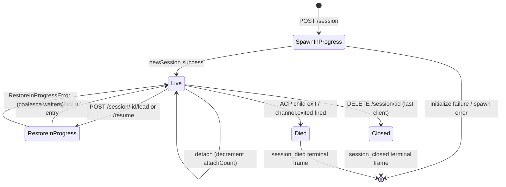

# Session 生命周期与身份标识

## 概述

daemon **session** 是绑定到单个 ACP `sessionId` 的逻辑会话。bridge 为每个 session 维护一个 `SessionEntry`（参见 [`03-acp-bridge.md`](./03-acp-bridge.md)），将 ACP 子连接与 HTTP 侧的记录耦合在一起：prompt FIFO、model-change FIFO、事件总线、待处理权限、已连接客户端、心跳、恢复状态、终端帧墓碑。

daemon **client** 由 `X-Qwen-Client-Id` 标识——这是一个不透明的、由 daemon 验证的字符串，HTTP 调用方会将其附加在请求上。bridge 追踪哪些客户端连接到哪些 session，并使用发起者客户端 id 驱动 `designated` 权限策略、审计追踪以及事件归因。

本文档说明每种 session 生命周期转换（create / attach / load / resume / close / die / evict），以及 daemon 暴露的每个身份标识面。

## 职责

- 创建、连接、恢复和回收 session。
- 验证 `X-Qwen-Client-Id`，拒绝格式错误的 id。
- 追踪每个 session 的多个已连接客户端（`clientIds: Map<string, count>`、`attachCount`）。
- 在出站事件上标记 `originatorClientId`。
- 运行心跳，让 dashboard 知道哪些客户端仍在连接。
- 暴露 session 元数据（`displayName`），由操作者通过 `PATCH /session/:id/metadata` 设置。
- 驱动终端帧发送（`session_died`、`session_closed`、`client_evicted`、`stream_error`）。

## 架构

| 关注点                    | 来源                                                         | 备注                                                                                      |
| ------------------------- | ------------------------------------------------------------ | ----------------------------------------------------------------------------------------- |
| `SessionEntry`            | `packages/acp-bridge/src/bridge.ts`                          | 每个 session 的结构体；完整字段列表参见 [`03-acp-bridge.md`](./03-acp-bridge.md)。        |
| `BridgeSession`（公共）   | `packages/acp-bridge/src/bridgeTypes.ts`                     | `{ sessionId, workspaceCwd, attached, clientId?, createdAt? }` 返回给 HTTP 处理器。        |
| `BridgeSessionState`      | `packages/acp-bridge/src/bridgeTypes.ts`                     | `LoadSessionResponse \| ResumeSessionResponse`，作为 `restoreState` 缓存在条目上。         |
| `DaemonSession`（SDK）    | `packages/sdk-typescript/src/daemon/types.ts`                | `{ sessionId, workspaceCwd, attached, clientId?, createdAt? }`。                          |
| 客户端 id 验证            | `packages/acp-bridge/src/bridge.ts`（`spawnOrAttach` 附近）  | 模式 `[A-Za-z0-9._:-]{1,128}`；格式错误时抛出 `InvalidClientIdError`。                    |
| Session 断连回收器        | `packages/cli/src/serve/server.ts`                           | 通过 `attachCount` + `spawnOwnerWantedKill` 追踪 spawn 所有者的断连。                      |

### 状态机



### Attach 与 spawn

在 `sessionScope: 'single'`（默认）下，bridge 的 `defaultEntry` 由每个连接的客户端共享。当 `defaultEntry` 已存在时收到的 `POST /session` 请求会返回 `attached: true`，而不会 spawn 新的 ACP 子进程。bridge 同步增加 `attachCount` 并将调用方的 `X-Qwen-Client-Id` 注册到 `clientIds`。

在 `sessionScope: 'thread'` 下，每个线程可以创建独立的 session。调用方仍须遵守 `maxSessions`。

### 身份标识

`X-Qwen-Client-Id` 是**可选的**，但**强烈推荐**使用。daemon 不会代替调用方生成——客户端自行选择并在请求间复用，以便 daemon 归因投票、审计事件并检测重连。

验证规则：

- 字符集：`[A-Za-z0-9._:-]`。
- 长度：1–128。
- 超出此范围：`InvalidClientIdError`（`400`）。

当满足以下条件时，daemon 会在出站 SSE 事件上标记 `originatorClientId`：

1. 触发该事件的请求携带了 `X-Qwen-Client-Id`，且
2. 该 id 当前已注册在 session 的 `clientIds` 集合中，且
3. session 设置了 `activePromptOriginatorClientId`（内联 `sessionUpdate` 和 `permission_request` 继承活跃 prompt 的发起者）。

匿名调用方（无 `X-Qwen-Client-Id`）在 `first-responder` 策略下可正常工作；`designated` 会以 `permission_forbidden{ reason: 'designated_mismatch' }` 拒绝其投票；`consensus` 以相同的 `forbidden` 原因拒绝，因为该投票者不在发起时的 `votersAtIssue` 快照中；`local-only` 是唯一接受匿名 loopback 投票者的策略。

## 工作流

### 创建或连接

```mermaid
sequenceDiagram
    autonumber
    participant C as Client
    participant R as POST /session
    participant B as Bridge.spawnOrAttach
    participant CH as ACP child

    C->>R: POST /session<br/>X-Qwen-Client-Id: alice<br/>{cwd, sessionScope?}
    R->>R: validate clientId pattern
    R->>B: spawnOrAttach({cwd, sessionScope, clientId})
    alt single scope + defaultEntry exists
        B->>B: bump attachCount; register clientId
        B-->>R: {sessionId, attached: true, restoreState?}
    else cold
        B->>CH: spawn + ACP initialize + newSession
        CH-->>B: sessionId
        B->>B: build SessionEntry; register in byId
        B-->>R: {sessionId, attached: false}
    end
    R-->>C: 200 { sessionId, attached, ... }
```

### Load / resume

`POST /session/:id/load` — 重放完整的 ACP 历史（`session/load` 通知在响应返回前触发）。
`POST /session/:id/resume` — 不重放地恢复（`connection.unstable_resumeSession`，通过稳定的 `session_resume` daemon 能力暴露；`unstable_session_resume` 保留为已弃用的别名）。

两者均：

1. 在 channel 上使用每个 session 的 `pendingRestoreIds` 集合，使并发恢复调用合并（`RestoreInProgressError`）。
2. 将 `restoreState` 缓存在条目上，以便晚连接的客户端获得与原始恢复者相同的载荷。

### 心跳

`POST /session/:id/heartbeat` 无论 `clientId` 如何都会更新 `sessionLastSeenAt`。如果请求携带了已注册的 `X-Qwen-Client-Id`，也会更新 `clientLastSeenAt.set(clientId, Date.now())`。v1 **未实现**按客户端驱逐；撤销功能计划在 F-series Wave 5 中推出。目前，心跳为 dashboard 以及 PR 24 中即将推出的撤销策略提供可观测性。

### 元数据

`PATCH /session/:id/metadata` 接受 `{displayName?}`。验证规则：

- 最大长度：`MAX_DISPLAY_NAME_LENGTH = 256`。
- 不得包含控制字符（`hasControlCharacter` 拒绝码位 ≤ 0x1f 或 == 0x7f 的字符）。
- 违规时返回 `InvalidSessionMetadataError`（`400`）。

成功更新后，会向所有订阅者广播 `session_metadata_updated`。

### 终止

| 终端帧           | 触发条件                                                                                                                                                       |
| ---------------- | -------------------------------------------------------------------------------------------------------------------------------------------------------------- |
| `session_closed` | `DELETE /session/:id`（client_close）或程序化关闭。                                                                                                             |
| `session_died`   | `channel.exited` 因任何原因触发（崩溃、子进程被杀）。使用 OS 退出路径时携带 `exitCode?` + `signalCode?`。                                                        |
| `client_evicted` | EventBus 上的每订阅者队列溢出（参见 [`10-event-bus.md`](./10-event-bus.md)）。这**不是** session 级别的终止——只有该订阅者被关闭。                               |
| `stream_error`   | `SubscriberLimitExceededError` 或其他路由级流失败。                                                                                                             |

待处理权限通过每条终止路径上的 `mediator.forgetSession(sessionId)` 解析为 `{kind:'cancelled', reason:'session_closed'}`。

### 断连回收器守卫

当 spawn 所有者的 HTTP 响应无法写入时（握手中途 TCP 重置），路由调用 `killSession({ requireZeroAttaches: true })`。如果另一个客户端已连接（`attachCount > 0`），守卫会短路，session 继续存活。将 `spawnOwnerWantedKill = true` 记录意图，以便后续使 `attachCount` 归零的 `detachClient()` 完成延迟回收。否则，快速断连的 spawn 所有者会在每次其他客户端重连时拆除一个健康的 session。

## 状态与生命周期

`SessionEntry` 中对生命周期至关重要的字段：

| 字段                             | 类型                  | 含义                                                                             |
| -------------------------------- | --------------------- | -------------------------------------------------------------------------------- |
| `clientIds`                      | `Map<string, number>` | 已注册的客户端 id → 注册引用计数。                                                |
| `attachCount`                    | `number`              | `spawnOrAttach` 对该条目返回 `attached: true` 的次数。                            |
| `activePromptOriginatorClientId` | `string?`             | 当前运行的 prompt 的发起者。                                                      |
| `restoreState`                   | `BridgeSessionState?` | 缓存的 load/resume 响应，供晚连接的客户端获得一致的载荷。                         |
| `spawnOwnerWantedKill`           | `boolean`             | 延迟回收墓碑（参见上方的断连回收器）。                                            |
| `sessionLastSeenAt`              | `number?`             | 所有客户端中最近的心跳时间（epoch 毫秒）。                                        |
| `clientLastSeenAt`               | `Map<string, number>` | 每个客户端的心跳时间。                                                            |
| `pendingPermissionIds`           | `Set<string>`         | 当前待处理的 ACP requestId——在取消/关闭时用于解析为已取消状态。                   |

## 依赖

- ACP 层：`connection.newSession`、`connection.unstable_resumeSession`、`connection.loadSession`。
- [`03-acp-bridge.md`](./03-acp-bridge.md) 了解周边 bridge 架构。
- [`04-permission-mediation.md`](./04-permission-mediation.md) 了解发起者与身份如何驱动策略决策。
- [`10-event-bus.md`](./10-event-bus.md) 了解终端帧投递。

## 附加 session 端点

以下端点扩展了基础生命周期接口：

### 非阻塞 Prompt（`non_blocking_prompt` 能力标签）

`POST /session/:id/prompt` 现在返回 HTTP **202** 和
`{ promptId, lastEventId }`，而不是阻塞直到 prompt 完成。
实际结果通过 SSE 以 `turn_complete` / `turn_error` 到达，
`promptId` 字段将这些事件与 202 响应关联。
`DaemonSessionClient.prompt()` 在有活跃事件订阅时会自动使用非阻塞路径，
并透明地从 SSE 流中匹配结果。

### Session 回顾（`session_recap` 能力标签）

`POST /session/:id/recap` 向快速模型请求一行"我上次做到哪里"的摘要。
返回 `{ sessionId, recap: string | null }`；`null` 表示历史太短或模型暂时失败。
该端点为尽力而为。

### Session BTW / 旁侧提问（`session_btw` 能力标签）

`POST /session/:id/btw` 在不打断主对话流程的情况下，针对 session 上下文提一个一次性问题。
它在缓存路径上使用 `runForkedAgent` 进行单轮、无工具的 LLM 调用，
返回 `{ sessionId, answer: string | null }`。
实现上强制执行 `BTW_MAX_INPUT_LENGTH`、跨 session 泄漏守卫和超时处理。

### Shell 命令执行

`POST /session/:id/shell` 直接在 daemon 主机上执行 shell 命令，
不经过 LLM 路由。它通过 `user_shell_command` / `user_shell_result` 事件在 session SSE 总线上流式输出，
并将命令及结果注入到 LLM 对话历史中。响应为
`{ exitCode, output, aborted }`。

### Session Detach

`POST /session/:id/detach` 通过递减 `attachCount` 显式将客户端从 session 断开；
它本身不会关闭 session。如果没有其他连接或订阅者剩余，session 会被回收。端点返回 204。

### 批量 Session 删除

`POST /sessions/delete` 接受 `{ sessionIds: string[] }`（最多 100 个 id），
关闭 bridge session 并删除 transcript 文件。使用
`Promise.allSettled` 保证弹性，返回 `{ removed, notFound, errors }`。

### 上下文使用情况（`session_context_usage` 能力标签）

`GET /session/:id/context-usage` 返回结构化的上下文窗口使用情况。
`?detail=true` 包含按工具、内存和 skill 分组的更细粒度使用情况。

### Session 统计（`session_stats` 能力标签）

`GET /session/:id/stats` 返回使用统计：模型指标
（输入/输出 token、缓存读写、总费用）、每个工具的调用次数和延迟、
文件编辑次数以及当前 session 中每个 skill 的调用次数。
`skills` 块仅反映本 session 内的 skill 体加载和 skill slash 命令；
不是跨 session 的活动聚合。

### Session 任务（`session_tasks` 能力标签）

`GET /session/:id/tasks` 返回 agent 任务、shell 任务、monitor 任务及其生命周期状态的后台任务快照。

### Session LSP 状态（`session_lsp` 能力标签）

`GET /session/:id/lsp` 为 daemon 客户端返回经过脱敏的每个 session 的 LSP 状态：
启用情况、汇总服务器计数、不可用/初始化状态，
以及每个服务器的 `name`、`status`、`languages`、`transport`、`command` 和
`error`。禁用或不可用的 LSP 以 HTTP 200 状态数据表示，
而非传输错误。

### 压缩重放

`POST /session/:id/load` 现在返回的 `BridgeRestoredSession` 可以包含
`compactedReplay?: BridgeEvent[]`、`liveJournal?: BridgeEvent[]` 和
`lastEventId?: number`。`compactedReplay` 由
`TurnBoundaryCompactionEngine` 生成：在 turn 边界折叠连续的文本/思考块，
将工具调用序列压缩为最终状态，丢弃瞬态信号，
从而生成 O(turns) 的重放日志，而不是 O(tokens) 日志
（通常压缩 25-30 倍）。

### ACP 子进程预热

`bridge.preheat()` 在第一个 session 之前预热 ACP 子进程，
以避免第一个真实 session 的冷启动延迟。它与
`channelIdleTimeoutMs` 配合使用，在最后一个 session 关闭后保持 ACP 子进程存活，
以及跳过重启行为，在新 session 到达时复用已空闲的子进程。

## 配置

- `BridgeOptions.maxSessions`（默认 20）——上限。
- `BridgeOptions.sessionScope`（默认 `'single'`；可选 `'thread'`）。
- `BridgeOptions.initializeTimeoutMs`（默认 10s）——ACP `initialize` 握手。
- `BridgeOptions.channelIdleTimeoutMs`（默认 0；立即回收 ACP 子进程）。
- 能力标签：`session_create`、`session_scope_override`、`session_load`、`session_resume`、`unstable_session_resume`（已弃用别名）、`session_list`、`session_close`、`session_metadata`、`session_set_model`、`client_identity`、`client_heartbeat`、`session_recap`、`session_btw`、`session_context_usage`、`session_tasks`、`session_stats`、`session_lsp`、`non_blocking_prompt`。

## 注意事项与已知限制

- `connection.unstable_resumeSession` 在 ACP 层可能仍不稳定，但 daemon 通过 `session_resume` 公开了已提交的 v1 路由契约。`unstable_session_resume` 仅作为已弃用的兼容性别名保留。
- v1 **没有按客户端驱逐**；只有按 session 和按订阅者的终止。撤销策略在 F-series Wave 5 / PR 24 中推出。
- `client_evicted` 是按订阅者的，不是按 session 的。SSE 订阅者被驱逐的客户端可以重新连接。
- 匿名客户端（无 `X-Qwen-Client-Id`）在 `designated` 或 `consensus` 策略下无法投票。

## 参考资料

- `packages/acp-bridge/src/bridge.ts`（SessionEntry 定义）
- `packages/acp-bridge/src/bridgeTypes.ts`（`HttpAcpBridge`、`BridgeSession`、`BridgeSessionState`）
- `packages/sdk-typescript/src/daemon/types.ts`（`DaemonSession`）
- `packages/sdk-typescript/src/daemon/DaemonSessionClient.ts`
- Wire 参考：[`../qwen-serve-protocol.md`](../qwen-serve-protocol.md)（路由目录）。
