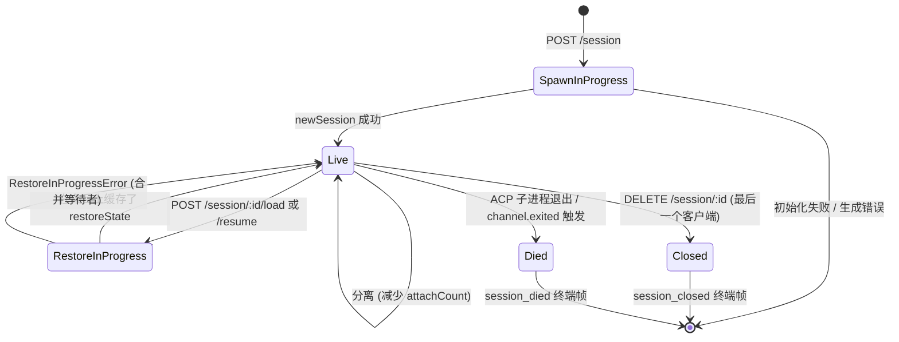
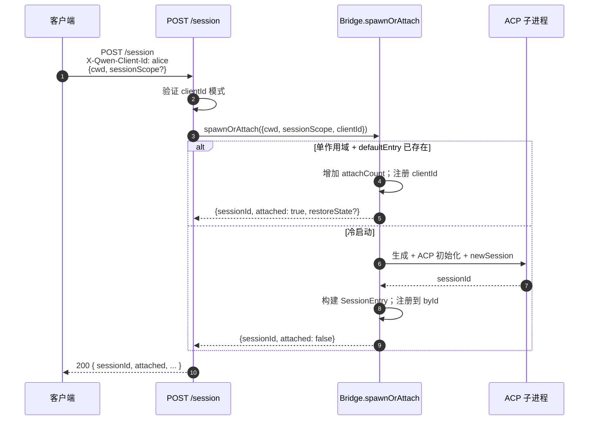

# 会话生命周期与身份标识

## 概述

守护进程的一个**会话**是指绑定到一个 ACP `sessionId` 的一次逻辑对话。桥接器为每个会话维护一个 `SessionEntry`（参见 [`03-acp-bridge.md`](./03-acp-bridge.md)），它将 ACP 子连接与 HTTP 端的簿记信息耦合在一起：提示 FIFO、模型更改 FIFO、事件总线、待处理权限、附加客户端、心跳、恢复状态、终端帧墓碑。

守护进程的一个**客户端**由 `X-Qwen-Client-Id` 标识——这是一个不透明的、由守护进程验证的字符串，HTTP 调用方将其印在请求上。桥接器跟踪哪些客户端附加到哪些会话，并使用发起者客户端 ID 来驱动 `designated` 权限策略、审计跟踪和事件归属。

本文档解释每个会话生命周期转换（创建/附加/加载/恢复/关闭/死亡/驱逐）以及守护进程暴露的每个身份表面。

## 职责

- 生成、附加、恢复和回收会话。
- 验证 `X-Qwen-Client-Id` 并拒绝格式错误的 ID。
- 跟踪每个会话的多个附加客户端（`clientIds: Map<string, count>`，`attachCount`）。
- 将 `originatorClientId` 印在出站事件上。
- 运行心跳，以便仪表板知道哪些客户端仍然连接。
- 公开会话元数据（`displayName`），操作员可通过 `PATCH /session/:id/metadata` 设置。
- 驱动终端帧发射（`session_died`、`session_closed`、`client_evicted`、`stream_error`）。

## 架构

| 关注点                     | 来源                                                         | 备注                                                                                   |
| -------------------------- | ------------------------------------------------------------ | -------------------------------------------------------------------------------------- |
| `SessionEntry`             | `packages/acp-bridge/src/bridge.ts`                          | 每个会话的结构体；完整字段列表参见 [`03-acp-bridge.md`](./03-acp-bridge.md)。            |
| `BridgeSession` (公开)     | `packages/acp-bridge/src/bridgeTypes.ts`                     | `{ sessionId, workspaceCwd, attached, clientId?, createdAt? }` 返回给 HTTP 处理程序。   |
| `BridgeSessionState`       | `packages/acp-bridge/src/bridgeTypes.ts`                     | 缓存在条目上的 `LoadSessionResponse \| ResumeSessionResponse`，作为 `restoreState`。    |
| `DaemonSession` (SDK)      | `packages/sdk-typescript/src/daemon/types.ts`                | `{ sessionId, workspaceCwd, attached, clientId?, createdAt? }`。                        |
| 客户端 ID 验证             | `packages/acp-bridge/src/bridge.ts` (在 `spawnOrAttach` 附近) | 模式 `[A-Za-z0-9._:-]{1,128}`；格式错误时返回 `InvalidClientIdError`。                  |
| 会话断开回收器             | `packages/cli/src/serve/server.ts`                           | 使用 `attachCount` + `spawnOwnerWantedKill` 跟踪生成所有者的断开连接。                  |

### 状态机

### 附加 vs 生成

在 `sessionScope: 'single'`（默认）下，桥接器的 `defaultEntry` 由所有连接的客户端共享。当 `defaultEntry` 已经存在时，`POST /session` 返回 `attached: true`，而不会生成新的 ACP 子进程。桥接器同步地增加 `attachCount` 并将调用方的 `X-Qwen-Client-Id` 注册到 `clientIds` 中。

在 `sessionScope: 'thread'` 下，每个线程可以生成一个不同的会话。调用方仍然遵守 `maxSessions`。

### 身份标识

`X-Qwen-Client-Id` 是**可选的**，但**强烈建议使用**。守护进程不会替调用方生成一个——客户端自己选择并跨请求重用，以便守护进程可以归因投票、审计事件和检测重新连接。

验证规则：

- 字符集：`[A-Za-z0-9._:-]`。
- 长度：1–128。
- 超出此范围：`InvalidClientIdError` (`400`)。

守护进程在出站 SSE 事件上印上 `originatorClientId`，当：

1. 触发事件的请求携带了 `X-Qwen-Client-Id`，且
2. 该 ID 当前已注册到会话的 `clientIds` 集合中，且
3. 会话设置了 `activePromptOriginatorClientId`（内联的 `sessionUpdate` 和 `permission_request` 继承自活动提示的发起者）。

匿名调用者（无 `X-Qwen-Client-Id`）在 `first-responder` 策略下正常工作；`designated` 策略会以 `permission_forbidden{ reason: 'designated_mismatch' }` 拒绝其投票；`consensus` 策略以相同的 `forbidden` 原因拒绝，因为投票者不在问题时的 `votersAtIssue` 快照中；`local-only` 是唯一接受匿名回环投票者的策略。

## 工作流程

### 创建或附加

### 加载 / 恢复

`POST /session/:id/load` — 重放完整的 ACP 历史（`session/load` 通知在响应返回之前触发）。
`POST /session/:id/resume` — 不重放直接恢复（`connection.unstable_resumeSession`，通过稳定的守护进程能力 `session_resume` 暴露；`unstable_session_resume` 保留为已弃用的别名）。

两者都：

1. 使用通道上的每个会话 `pendingRestoreIds` 集合，以便并发恢复调用合并（`RestoreInProgressError`）。
2. 在条目上缓存 `restoreState`，以便后来的附加者获得与原始恢复者相同的负载。

### 心跳

`POST /session/:id/heartbeat` 更新 `sessionLastSeenAt`，无论 `clientId` 如何。如果请求携带了一个已注册的 `X-Qwen-Client-Id`，则 `clientLastSeenAt.set(clientId, Date.now())` 也会更新。v1 中**未实现**按客户端驱逐；计划在 F 系列 Wave 5 中实现撤销。当前，心跳为仪表板和即将在 PR 24 中实现的撤销策略提供可观测性。

### 元数据

`PATCH /session/:id/metadata` 接受 `{displayName?}`。验证：

- 最大长度：`MAX_DISPLAY_NAME_LENGTH = 256`。
- 不得包含控制字符（`hasControlCharacter` 拒绝码点 ≤ 0x1f 或 == 0x7f）。
- 违规时返回 `InvalidSessionMetadataError` (`400`)。

成功更新会将 `session_metadata_updated` 发送给每个订阅者。

### 终止

| 终端帧           | 触发条件                                                                                                                     |
| ---------------- | ---------------------------------------------------------------------------------------------------------------------------- |
| `session_closed` | `DELETE /session/:id`（客户端关闭）或程序性关闭。                                                                             |
| `session_died`   | `channel.exited` 因任何原因触发（崩溃、子进程终止）。当使用了操作系统退出路径时，携带 `exitCode?` + `signalCode?`。           |
| `client_evicted` | EventBus 上每个订阅者队列溢出（参见 [`10-event-bus.md`](./10-event-bus.md)）。不是会话级别的终止——仅关闭此订阅者。           |
| `stream_error`   | SubscriberLimitExceededError 或其他路由级别的流失败。                                                                         |

在每个终止路径上，通过 `mediator.forgetSession(sessionId)` 将待处理的权限解析为 `{kind:'cancelled', reason:'session_closed'}`。

### 断开连接回收器防护

当生成所有者的 HTTP 响应无法写入时（TCP 复位发生在握手中间），路由调用 `killSession({ requireZeroAttaches: true })`。如果另一个客户端已经附加（`attachCount > 0`），防护短路，会话继续存在。将 `spawnOwnerWantedKill = true` 记住意图，以便稍后的 `detachClient()` 将 `attachCount` 降回 0 时完成延迟回收。没有这个机制，快速断开的生成所有者会在每次重新连接时拆掉一个健康的会话。

## 状态与生命周期

对生命周期关键的 `SessionEntry` 字段：

| 字段                              | 类型                  | 含义                                                                                |
| --------------------------------- | --------------------- | ----------------------------------------------------------------------------------- |
| `clientIds`                       | `Map<string, number>` | 已注册的客户端 ID → 注册引用计数。                                                  |
| `attachCount`                     | `number`              | 此条目上 `spawnOrAttach` 返回 `attached: true` 的次数。                              |
| `activePromptOriginatorClientId`  | `string?`             | 当前正在运行的提示的发起者。                                                        |
| `restoreState`                    | `BridgeSessionState?` | 缓存的加载/恢复响应，以便后来的附加者看到一致的负载。                              |
| `spawnOwnerWantedKill`            | `boolean`             | 延迟回收墓碑（参见上面的断开连接回收器）。                                          |
| `sessionLastSeenAt`               | `number?`             | 任何客户端最近的心跳时间（纪元毫秒）。                                              |
| `clientLastSeenAt`                | `Map<string, number>` | 每个客户端的心跳时间。                                                              |
| `pendingPermissionIds`            | `Set<string>`         | 当前待处理的 ACP requestId——在取消/关闭时用于解析为已取消。                         |

## 依赖

- ACP 层：`connection.newSession`、`connection.unstable_resumeSession`、`connection.loadSession`。
- [`03-acp-bridge.md`](./03-acp-bridge.md) 了解周围的桥接器架构。
- [`04-permission-mediation.md`](./04-permission-mediation.md) 了解发起者 + 身份如何驱动策略决策。
- [`10-event-bus.md`](./10-event-bus.md) 了解终端帧交付。

## 其他会话端点

这些端点扩展了基本的生命周期表面：

### 非阻塞提示（`non_blocking_prompt` 能力标签）

`POST /session/:id/prompt` 现在返回 HTTP **202**，带有
`{ promptId, lastEventId }`，而不是阻塞直到提示完成。实际
结果作为 `turn_complete` / `turn_error` 到达 SSE，并且
`promptId` 字段将这些事件与 202 响应关联起来。
当 `DaemonSessionClient.prompt()` 拥有有效的
事件订阅时，会自动使用非阻塞路径，并透明地将结果与
SSE 流匹配。

### 会话回顾（`session_recap` 能力标签）

`POST /session/:id/recap` 要求快速模型提供一个一行的“我上次在哪里
离开”摘要。它返回 `{ sessionId, recap: string | null }`；`null` 表示
历史太短或模型暂时失败。此端点是
尽力而为的。

### 会话顺便问 / 侧问题（`session_btw` 能力标签）

`POST /session/:id/btw` 针对会话上下文问一个一次性问题
而不中断主对话流。它在缓存路径上使用 `runForkedAgent`
进行单轮、无工具的 LLM 调用，并返回
`{ sessionId, answer: string | null }`。实现强制
`BTW_MAX_INPUT_LENGTH`、跨会话泄露防护和超时处理。

### Shell 命令执行

`POST /session/:id/shell` 直接在守护进程主机上执行 shell 命令，
而不通过 LLM 路由。它通过 `user_shell_command` / `user_shell_result` 事件在会话 SSE 总线上流式输出，并将命令和结果注入 LLM 对话历史。响应是
`{ exitCode, output, aborted }`。

### 会话分离

`POST /session/:id/detach` 通过减少 `attachCount` 来显式地将客户端与会话分离；它本身不会关闭会话。如果没有其他附加者或订阅者保留，则会话被回收。端点返回 204。

### 批量会话删除

`POST /sessions/delete` 接受 `{ sessionIds: string[] }`（最多 100 个 id），
关闭桥接器会话，并删除转录文件。它使用
`Promise.allSettled` 以保证韧性，并返回 `{ removed, notFound, errors }`。

### 上下文使用情况（`session_context_usage` 能力标签）

`GET /session/:id/context-usage` 返回结构化的上下文窗口使用情况。
`?detail=true` 包括按工具、内存和技能分组的更细粒度使用情况。

### 会话统计（`session_stats` 能力标签）

`GET /session/:id/stats` 返回使用统计信息：模型指标
（输入/输出 token、缓存读/写、总成本）、每个工具调用次数和
延迟、文件编辑次数以及活动会话中每个技能的调用次数。`skills` 块反映仅此会话中的技能主体加载和技能斜杠命令；它不是跨会话活动汇总。

### 会话任务（`session_tasks` 能力标签）

`GET /session/:id/tasks` 返回代理任务、shell 任务、
监控任务及其生命周期状态的背景任务快照。

### 会话 LSP 状态（`session_lsp` 能力标签）

`GET /session/:id/lsp` 返回守护进程客户端每个会话的清理后 LSP
状态：启用、聚合服务器计数、不可用/初始化状态，
以及每个服务器的 `name`、`status`、`languages`、`transport`、`command` 和
`error`。禁用或不可用的 LSP 表示为 HTTP 200 状态数据，
而不是传输错误。

### 压缩重放

`POST /session/:id/load` 现在返回一个 `BridgeRestoredSession`，它可以包括
`compactedReplay?: BridgeEvent[]`、`liveJournal?: BridgeEvent[]` 和
`lastEventId?: number`。`compactedReplay` 由
`TurnBoundaryCompactionEngine` 生成：在回合边界处，它折叠连续的文本/思考
块，将工具调用序列压缩到最终状态，丢弃
瞬态信号，并生成 O(回合) 的重放日志而不是 O(token) 的日志
（通常减少 25-30 倍）。

### ACP 子进程预热

`bridge.preheat()` 在第一个会话之前预热 ACP 子进程，以便
第一个真实会话避免冷启动延迟。它与
`channelIdleTimeoutMs` 配对，后者在最后一个会话关闭后保持 ACP 子进程存活，以及跳过重新启动行为，后者在新区到达时重用已经空闲的子进程。

## 配置

- `BridgeOptions.maxSessions`（默认 20）— 上限。
- `BridgeOptions.sessionScope`（默认 `'single'`；可选 `'thread'`）。
- `BridgeOptions.initializeTimeoutMs`（默认 10 秒）— ACP `initialize` 握手。
- `BridgeOptions.channelIdleTimeoutMs`（默认 0；立即回收 ACP 子进程）。
- 能力标签：`session_create`、`session_scope_override`、`session_load`、`session_resume`、`unstable_session_resume`（已弃用别名）、`session_list`、`session_close`、`session_metadata`、`session_set_model`、`client_identity`、`client_heartbeat`、`session_recap`、`session_btw`、`session_context_usage`、`session_tasks`、`session_stats`、`session_lsp`、`session_status`、`non_blocking_prompt`。

## 注意事项与已知限制

- `connection.unstable_resumeSession` 在 ACP 层可能仍然不稳定，但守护进程使用 `session_resume` 发布已承诺的 v1 路由契约。`unstable_session_resume` 仅作为已弃用的兼容别名保留。
- v1 **没有**每个客户端的驱逐；只有每个会话和每个订阅者的终止。撤销策略是 F 系列 Wave 5 / PR 24。
- `client_evicted` 是针对每个订阅者的，不是每个会话的。SSE 订阅者被驱逐的客户端可以重新连接。
- 匿名客户端（无 `X-Qwen-Client-Id`）不能在 `designated` 或 `consensus` 策略下投票。

## 参考

- `packages/acp-bridge/src/bridge.ts`（SessionEntry 定义）
- `packages/acp-bridge/src/bridgeTypes.ts`（`HttpAcpBridge`、`BridgeSession`、`BridgeSessionState`）
- `packages/sdk-typescript/src/daemon/types.ts`（`DaemonSession`）
- `packages/sdk-typescript/src/daemon/DaemonSessionClient.ts`
- 线路参考：[`../qwen-serve-protocol.md`](../qwen-serve-protocol.md)（路由目录）