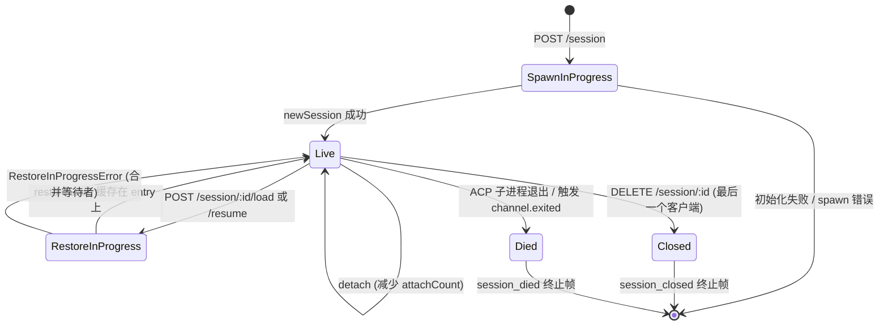
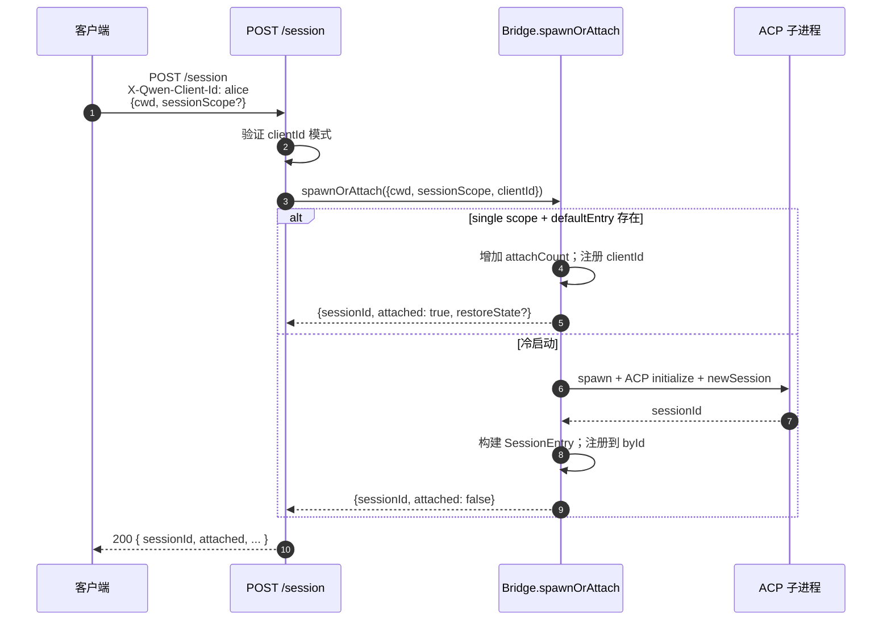

# 会话生命周期与身份

## 概述

守护进程 **会话 (session)** 是绑定到单个 ACP `sessionId` 的一次逻辑对话。Bridge 为每个会话维护一个 `SessionEntry`（参见 [`03-acp-bridge.md`](./03-acp-bridge.md)），它将 ACP 子进程连接与 HTTP 侧的状态管理逻辑耦合在一起：包括 prompt FIFO、model-change FIFO、事件总线、待处理权限、已附加的客户端、心跳、恢复状态以及终止帧墓碑（tombstones）。

守护进程 **客户端 (client)** 由 `X-Qwen-Client-Id` 标识——这是一个不透明的、由守护进程验证的字符串，HTTP 调用方会将其印在请求中。Bridge 跟踪哪些客户端附加到了哪些会话，并使用发起方客户端 ID（originator client id）来驱动 `designated` 权限策略、审计跟踪和事件归因。

本文档解释了每个会话生命周期转换（create / attach / load / resume / close / die / evict）以及守护进程暴露的每个身份接口（identity surface）。

## 职责

- 创建、附加、恢复和回收会话。
- 验证 `X-Qwen-Client-Id` 并拒绝格式错误的 ID。
- 跟踪每个会话的多个已附加客户端（`clientIds: Map<string, count>`、`attachCount`）。
- 在出站事件上印上 `originatorClientId`。
- 运行心跳机制，以便仪表盘知道哪些客户端仍处于连接状态。
- 暴露操作员通过 `PATCH /session/:id/metadata` 设置的会话元数据（`displayName`）。
- 驱动终止帧的发送（`session_died`、`session_closed`、`client_evicted`、`stream_error`）。

## 架构

| 关注点 | 来源 | 说明 |
| --- | --- | --- |
| `SessionEntry` | `packages/acp-bridge/src/bridge.ts` | 每个会话的结构体；完整字段列表请参见 [`03-acp-bridge.md`](./03-acp-bridge.md)。 |
| `BridgeSession`（公开） | `packages/acp-bridge/src/bridgeTypes.ts` | 返回给 HTTP 处理程序的 `{ sessionId, workspaceCwd, attached, clientId?, createdAt? }`。 |
| `BridgeSessionState` | `packages/acp-bridge/src/bridgeTypes.ts` | 作为 `restoreState` 缓存在 entry 上的 `LoadSessionResponse \| ResumeSessionResponse`。 |
| `DaemonSession`（SDK） | `packages/sdk-typescript/src/daemon/types.ts` | `{ sessionId, workspaceCwd, attached, clientId?, createdAt? }`。 |
| Client-id 验证 | `packages/acp-bridge/src/bridge.ts`（`spawnOrAttach` 附近） | 正则模式 `[A-Za-z0-9._:-]{1,128}`；格式错误时抛出 `InvalidClientIdError`。 |
| 会话断开回收器 | `packages/cli/src/serve/server.ts` | 使用 `attachCount` + `spawnOwnerWantedKill` 跟踪 spawn 所有者的断开连接。 |

### 状态机

### Attach vs spawn

在 `sessionScope: 'single'`（默认）下，bridge 的 `defaultEntry` 由每个连接的客户端共享。当 `defaultEntry` 已存在时到达的 `POST /session` 请求会返回 `attached: true`，而不会 spawn 新的 ACP 子进程。Bridge 同步增加 `attachCount` 并将调用方的 `X-Qwen-Client-Id` 注册到 `clientIds` 中。

在 `sessionScope: 'thread'` 下，每个线程可以创建一个独立的会话。调用方仍需遵守 `maxSessions` 限制。

### 身份

`X-Qwen-Client-Id` 是 **可选的**，但 **强烈建议使用**。守护进程不会代表调用方生成它——客户端自己选择并在请求中复用，以便守护进程能够归因投票、审计事件并检测重连。

验证规则：

- 字符集：`[A-Za-z0-9._:-]`。
- 长度：1–128。
- 超出此字符集：抛出 `InvalidClientIdError` (`400`)。

守护进程在以下情况下会在出站 SSE 事件上印上 `originatorClientId`：

1. 触发该事件的请求携带了 `X-Qwen-Client-Id`，并且
2. 该 ID 当前已注册在会话的 `clientIds` 集合中，并且
3. 会话设置了 `activePromptOriginatorClientId`（内联的 `sessionUpdate` 和 `permission_request` 会继承活动 prompt 的发起方）。

匿名调用方（无 `X-Qwen-Client-Id`）在 `first-responder` 策略下可以正常工作；`designated` 会以 `permission_forbidden{ reason: 'designated_mismatch' }` 拒绝他们的投票；`consensus` 也会以相同的 `forbidden` 原因拒绝，因为投票者不在发布时的 `votersAtIssue` 快照中；`local-only` 是唯一接受匿名环回投票者的策略。

## 工作流

### 创建或附加

### Load / resume

`POST /session/:id/load` —— 重放完整的 ACP 历史（`session/load` 通知会在响应返回前触发）。
`POST /session/:id/resume` —— 恢复但不重放（`connection.unstable_resumeSession`，在稳定的 `session_resume` 守护进程能力下暴露；`unstable_session_resume` 仍作为已弃用的别名保留）。

两者均：

1. 在 channel 上使用每个会话的 `pendingRestoreIds` 集合，以便并发恢复调用能够合并（`RestoreInProgressError`）。
2. 在 entry 上缓存 `restoreState`，以便后附加的客户端获取与原始恢复者相同的有效载荷。

### 心跳

`POST /session/:id/heartbeat` 无论 `clientId` 是什么，都会更新 `sessionLastSeenAt`。如果请求携带了已注册的 `X-Qwen-Client-Id`，则也会更新 `clientLastSeenAt.set(clientId, Date.now())`。v1 中 **未** 实现按客户端驱逐；撤销策略计划在 F-series Wave 5 中推出。目前，心跳为仪表盘和 PR 24 中即将推出的撤销策略提供可观测性。

### 元数据

`PATCH /session/:id/metadata` 接受 `{displayName?}`。验证规则：

- 最大长度：`MAX_DISPLAY_NAME_LENGTH = 256`。
- 不得包含控制字符（`hasControlCharacter` 会拒绝码位 ≤ 0x1f 或 == 0x7f 的字符）。
- 违规时抛出 `InvalidSessionMetadataError` (`400`)。

成功更新后，会将 `session_metadata_updated` 扇出（fan out）给每个订阅者。

### 终止

| 终止帧 | 触发条件 |
| --- | --- |
| `session_closed` | `DELETE /session/:id` (client_close) 或编程式关闭。 |
| `session_died` | `channel.exited` 因任何原因触发（崩溃、子进程被 kill）。当使用 OS 退出路径时，携带 `exitCode?` + `signalCode?`。 |
| `client_evicted` | EventBus 上的按订阅者队列溢出（参见 [`10-event-bus.md`](./10-event-bus.md)）。这不是会话级别的终止——仅关闭此订阅者。 |
| `stream_error` | `SubscriberLimitExceededError` 或其他路由级别的流失败。 |

在每个终止路径中，通过 `mediator.forgetSession(sessionId)` 将待处理权限解析为 `{kind:'cancelled', reason:'session_closed'}`。

### 断开回收保护

当 spawn 所有者的客户端的 HTTP 响应无法写入时（TCP 在握手期间重置），路由会调用 `killSession({ requireZeroAttaches: true })`。如果另一个客户端已经附加（`attachCount > 0`），则保护机制会短路，会话继续存活。设置 `spawnOwnerWantedKill = true` 会记住该意图，以便后续将 `attachCount` 降回 0 的 `detachClient()` 完成延迟回收。如果没有这个机制，快速断开连接的 spawn 所有者会在每次重连时摧毁一个健康的会话。

## 状态与生命周期

对生命周期至关重要的 `SessionEntry` 字段：

| 字段 | 类型 | 含义 |
| --- | --- | --- |
| `clientIds` | `Map<string, number>` | 已注册的客户端 ID → 注册引用计数。 |
| `attachCount` | `number` | `spawnOrAttach` 为此 entry 返回 `attached: true` 的次数。 |
| `activePromptOriginatorClientId` | `string?` | 当前正在运行的 prompt 的发起方。 |
| `restoreState` | `BridgeSessionState?` | 缓存的 load/resume 响应，以便后附加的客户端看到一致的有效载荷。 |
| `spawnOwnerWantedKill` | `boolean` | 延迟回收墓碑（参见上方的 disconnect-reaper）。 |
| `sessionLastSeenAt` | `number?` | 任何客户端的最近一次心跳（epoch 毫秒）。 |
| `clientLastSeenAt` | `Map<string, number>` | 按客户端的心跳。 |
| `pendingPermissionIds` | `Set<string>` | 当前待处理的 ACP requestIds —— 在 cancel/close 时用于解析为 cancelled。 |

## 依赖

- ACP 层：`connection.newSession`、`connection.unstable_resumeSession`、`connection.loadSession`。
- [`03-acp-bridge.md`](./03-acp-bridge.md) 了解周围的 bridge 架构。
- [`04-permission-mediation.md`](./04-permission-mediation.md) 了解发起方 + 身份如何驱动策略决策。
- [`10-event-bus.md`](./10-event-bus.md) 了解终止帧的传递。

## 额外的会话端点

这些端点扩展了基础生命周期接口：

### 非阻塞 Prompt（`non_blocking_prompt` 能力标签）

`POST /session/:id/prompt` 现在返回 HTTP **202** 及 `{ promptId, lastEventId }`，而不是阻塞直到 prompt 完成。实际结果通过 SSE 作为 `turn_complete` / `turn_error` 到达，并且 `promptId` 字段将这些事件与 202 响应关联起来。当 `DaemonSessionClient.prompt()` 具有活动的事件订阅时，会自动使用非阻塞路径，并透明地匹配来自 SSE 流的结果。

### 会话回顾（`session_recap` 能力标签）

`POST /session/:id/recap` 向快速模型请求一行“我上次进行到哪里了”的摘要。它返回 `{ sessionId, recap: string | null }`；`null` 表示历史太短或模型暂时失败。此端点是尽力而为（best-effort）的。

### 会话 BTW / 旁路提问（`session_btw` 能力标签）

`POST /session/:id/btw` 针对会话上下文提出一次性问题，而不会中断主对话流。它在缓存路径上使用 `runForkedAgent` 进行单轮、无工具的 LLM 调用，并返回 `{ sessionId, answer: string | null }`。实现中强制执行了 `BTW_MAX_INPUT_LENGTH`、跨会话泄漏防护和超时处理。

### Shell 命令执行

`POST /session/:id/shell` 直接在守护进程主机上执行 shell 命令，而不通过 LLM 路由。它通过 `user_shell_command` / `user_shell_result` 事件在会话 SSE 总线上流式输出，并将命令及结果注入到 LLM 对话历史中。响应为 `{ exitCode, output, aborted }`。

### 会话分离

`POST /session/:id/detach` 通过减少 `attachCount` 显式地将客户端从会话中分离；它本身不会关闭会话。如果没有其他附加或订阅者，会话将被回收。该端点返回 204。

### 批量会话删除

`POST /sessions/delete` 接受 `{ sessionIds: string[] }`（最多 100 个 ID），关闭 bridge 会话，并删除活动或归档的转录文件。如果同一个 ID 同时存在活动和归档的 JSONL 文件，硬删除会移除两者，以便操作员清除冲突。它会清理活动和归档的 worktree sidecars，但保留文件历史快照、子代理转录和运行时 sidecars 不变。它使用 `Promise.allSettled` 来保证弹性，并返回 `{ removed, notFound, errors }`。

### 会话归档

`POST /sessions/archive` 将非活动会话的 JSONL 文件从 `chats/` 移动到 `chats/archive/`。如果目标会话处于活动状态，守护进程会首先进入每个会话的归档门控（archive gate），并执行严格关闭，要求 ACP 子进程刷新 `ChatRecordingService`；如果关闭或刷新失败，归档会将 JSONL 保留在原位。

`POST /sessions/unarchive` 将归档的 JSONL 文件移回 `chats/`。这仅仅是存储状态的转换；客户端之后必须调用 `session/load` 或 `session/resume`。归档的会话在 load/resume 时返回 `409 session_archived`，与归档转换竞争的变更操作会返回 `409 session_archiving`。

### 上下文使用情况（`session_context_usage` 能力标签）

`GET /session/:id/context-usage` 返回结构化的上下文窗口使用情况。`?detail=true` 包含按 tool、memory 和 skill 分组的更细粒度的使用情况。

### 会话统计（`session_stats` 能力标签）

`GET /session/:id/stats` 返回使用统计信息：活动会话的模型指标（输入/输出 tokens、缓存读/写、总成本）、按 tool 的调用次数和延迟、文件编辑次数以及按 skill 的调用次数。`skills` 块仅反映此会话内的 skill body 加载和 skill 斜杠命令；它不是跨会话的活动聚合。

### 会话任务（`session_tasks` 能力标签）

`GET /session/:id/tasks` 返回 agent 任务、shell 任务、monitor 任务及其生命周期状态的后台任务快照。

### 会话 LSP 状态（`session_lsp` 能力标签）

`GET /session/:id/lsp` 为守护进程客户端返回清理后的每个会话的 LSP 状态：启用状态、聚合服务器计数、不可用/初始化状态，以及每个服务器的 `name`、`status`、`languages`、`transport`、`command` 和 `error`。禁用或不可用的 LSP 表示为 HTTP 200 状态数据，而不是传输错误。

### 压缩重放

`POST /session/:id/load` 现在返回一个 `BridgeRestoredSession`，它可以包含 `compactedReplay?: BridgeEvent[]`、`liveJournal?: BridgeEvent[]` 和 `lastEventId?: number`。`compactedReplay` 由 `TurnBoundaryCompactionEngine` 生成：在 turn 边界处，它折叠连续的 text / thought 块，将 tool-call 序列折叠到其最终状态，丢弃瞬态信号，并生成 O(turns) 的重放日志，而不是 O(tokens) 的日志（通常减少 25-30 倍）。

### ACP 子进程预热

`bridge.preheat()` 在第一个会话之前预热 ACP 子进程，以便第一个真实会话避免冷启动延迟。它与 `channelIdleTimeoutMs` 配合使用，后者在最后一个会话关闭后保持 ACP 子进程存活，以及 skip-relaunch 行为，后者在新会话到达时重用已经空闲的子进程。

## 配置

- `BridgeOptions.maxSessions`（默认 20）—— 上限。
- `BridgeOptions.sessionScope`（默认 `'single'`；可选 `'thread'`）。
- `BridgeOptions.initializeTimeoutMs`（默认 10s）—— ACP `initialize` 握手。
- `BridgeOptions.channelIdleTimeoutMs`（默认 0；立即回收 ACP 子进程）。
- 能力标签：`session_create`、`session_scope_override`、`session_load`、`session_resume`、`unstable_session_resume`（已弃用的别名）、`session_list`、`session_close`、`session_metadata`、`session_set_model`、`client_identity`、`client_heartbeat`、`session_recap`、`session_btw`、`session_context_usage`、`session_tasks`、`session_stats`、`session_lsp`、`session_status`、`non_blocking_prompt`。

## 注意事项与已知限制

- `connection.unstable_resumeSession` 在 ACP 层可能仍然不稳定，但守护进程通过 `session_resume` 宣传已提交的 v1 路由契约。`unstable_session_resume` 仅作为已弃用的兼容性别名保留。
- v1 **没有按客户端驱逐**；只有按会话和按订阅者终止。撤销策略在 F-series Wave 5 / PR 24 中。
- `client_evicted` 是按订阅者的，而不是按会话的。SSE 订阅者被驱逐的客户端可以重新连接。
- 匿名客户端（无 `X-Qwen-Client-Id`）无法在 `designated` 或 `consensus` 策略下投票。

## 参考资料

- `packages/acp-bridge/src/bridge.ts`（SessionEntry 定义）
- `packages/acp-bridge/src/bridgeTypes.ts`（`HttpAcpBridge`、`BridgeSession`、`BridgeSessionState`）
- `packages/sdk-typescript/src/daemon/types.ts`（`DaemonSession`）
- `packages/sdk-typescript/src/daemon/DaemonSessionClient.ts`
- 线路参考：[`../qwen-serve-protocol.md`](../qwen-serve-protocol.md)（路由目录）。