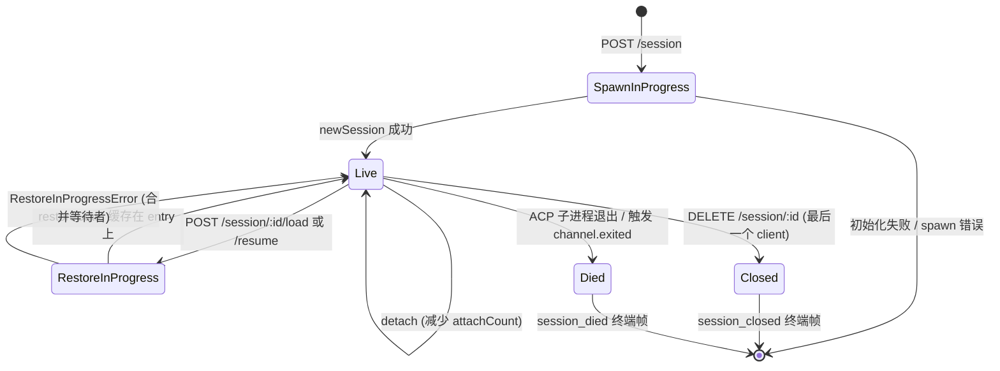
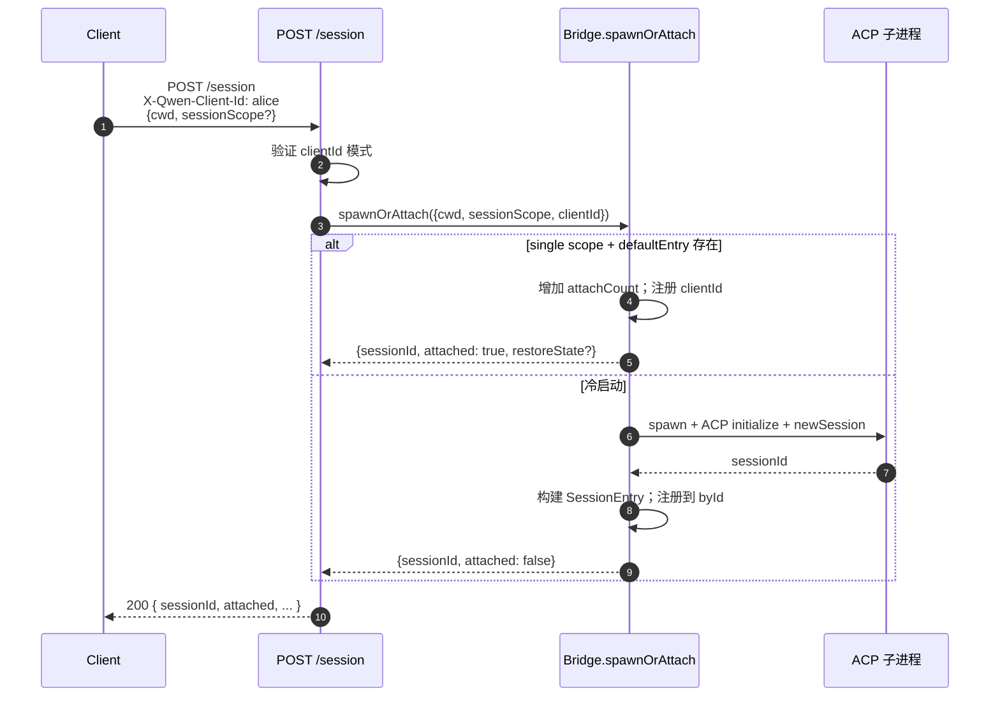

# Session 生命周期与身份标识

## 概述

守护进程 **session** 是绑定到单个 ACP `sessionId` 的一次逻辑对话。bridge 为每个 session 维护一个 `SessionEntry`（参见 [`03-acp-bridge.md`](./03-acp-bridge.md)），它将 ACP 子连接与 HTTP 端的记录逻辑耦合在一起：包括 prompt FIFO、model-change FIFO、事件总线、待处理权限、已附加客户端、心跳、恢复状态以及终端帧墓碑。

守护进程 **client** 通过 `X-Qwen-Client-Id` 进行标识——这是一个不透明的、由守护进程验证的字符串，HTTP 调用方会将其标记在请求中。bridge 跟踪哪些 client 附加到了哪些 session，并使用 originator client id 来驱动 `designated` 权限策略、审计跟踪和事件归因。

本文档解释了每个 session 生命周期转换（create / attach / load / resume / close / die / evict）以及守护进程暴露的每个身份接口。

## 职责

- 创建、附加、恢复和回收 session。
- 验证 `X-Qwen-Client-Id` 并拒绝格式错误的 id。
- 跟踪每个 session 附加的多个 client（`clientIds: Map<string, count>`、`attachCount`）。
- 在出站事件上标记 `originatorClientId`。
- 运行心跳机制，以便仪表盘了解哪些 client 仍处于连接状态。
- 暴露操作员通过 `PATCH /session/:id/metadata` 设置的 session 元数据（`displayName`）。
- 驱动终端帧的发送（`session_died`、`session_closed`、`client_evicted`、`stream_error`）。

## 架构

| 关注点 | 源码位置 | 说明 |
| --- | --- | --- |
| `SessionEntry` | `packages/acp-bridge/src/bridge.ts` | 每个 session 的结构体；完整字段列表请参见 [`03-acp-bridge.md`](./03-acp-bridge.md)。 |
| `BridgeSession` (public) | `packages/acp-bridge/src/bridgeTypes.ts` | 返回给 HTTP handler 的 `{ sessionId, workspaceCwd, attached, clientId?, createdAt? }`。 |
| `BridgeSessionState` | `packages/acp-bridge/src/bridgeTypes.ts` | 作为 `restoreState` 缓存在 entry 上的 `LoadSessionResponse \| ResumeSessionResponse`。 |
| `DaemonSession` (SDK) | `packages/sdk-typescript/src/daemon/types.ts` | `{ sessionId, workspaceCwd, attached, clientId?, createdAt? }`。 |
| Client-id 验证 | `packages/acp-bridge/src/bridge.ts`（`spawnOrAttach` 附近） | 正则模式 `[A-Za-z0-9._:-]{1,128}`；格式错误时抛出 `InvalidClientIdError`。 |
| Session 断连回收器 | `packages/cli/src/serve/server.ts` | 使用 `attachCount` + `spawnOwnerWantedKill` 跟踪 spawn-owner 的断连。 |

### 状态机

```mermaid
stateDiagram-v2
    [*] --> SpawnInProgress: POST /session
    SpawnInProgress --> Live: newSession 成功
    SpawnInProgress --> [*]: 初始化失败 / spawn 错误
    Live --> Live: attach (sessionScope=single, 增加 attachCount)
    Live --> Live: detach (减少 attachCount)
    Live --> RestoreInProgress: POST /session/:id/load 或 /resume
    RestoreInProgress --> Live: restoreState 缓存在 entry 上
    RestoreInProgress --> Live: RestoreInProgressError (合并等待者)
    Live --> Closed: DELETE /session/:id (最后一个 client)
    Live --> Died: ACP 子进程退出 / 触发 channel.exited
    Closed --> [*]: session_closed 终端帧
    Died --> [*]: session_died 终端帧
```

### Attach vs spawn

在 `sessionScope: 'single'`（默认）下，bridge 的 `defaultEntry` 由每个连接的 client 共享。当 `defaultEntry` 已存在时，到达的 `POST /session` 请求会返回 `attached: true`，而不会 spawn 新的 ACP 子进程。bridge 会同步增加 `attachCount`，并将调用方的 `X-Qwen-Client-Id` 注册到 `clientIds` 中。

在 `sessionScope: 'thread'` 下，每个 thread 可以创建一个独立的 session。调用方仍需遵守 `maxSessions` 限制。

### 身份标识

`X-Qwen-Client-Id` 是**可选的**，但**强烈建议使用**。守护进程不会代为生成——client 需要自己选择并在请求中复用，以便守护进程进行投票归因、事件审计和重连检测。

验证规则：

- 字符集：`[A-Za-z0-9._:-]`。
- 长度：1–128。
- 超出此字符集：抛出 `InvalidClientIdError` (`400`)。

守护进程会在出站 SSE 事件上标记 `originatorClientId`，条件如下：

1. 触发该事件的请求携带了 `X-Qwen-Client-Id`，并且
2. 该 id 当前已注册在 session 的 `clientIds` 集合中，并且
3. session 设置了 `activePromptOriginatorClientId`（内联的 `sessionUpdate` 和 `permission_request` 会继承活跃 prompt 的 originator）。

匿名调用方（无 `X-Qwen-Client-Id`）在 `first-responder` 策略下可以正常工作；`designated` 会以 `permission_forbidden{ reason: 'designated_mismatch' }` 拒绝其投票；`consensus` 也会以相同的 `forbidden` 原因拒绝，因为投票者不在 issue-time 的 `votersAtIssue` 快照中；`local-only` 是唯一接受匿名 loopback 投票者的策略。

## 工作流

### 创建或附加

```mermaid
sequenceDiagram
    autonumber
    participant C as Client
    participant R as POST /session
    participant B as Bridge.spawnOrAttach
    participant CH as ACP 子进程

    C->>R: POST /session<br/>X-Qwen-Client-Id: alice<br/>{cwd, sessionScope?}
    R->>R: 验证 clientId 模式
    R->>B: spawnOrAttach({cwd, sessionScope, clientId})
    alt single scope + defaultEntry 存在
        B->>B: 增加 attachCount；注册 clientId
        B-->>R: {sessionId, attached: true, restoreState?}
    else 冷启动
        B->>CH: spawn + ACP initialize + newSession
        CH-->>B: sessionId
        B->>B: 构建 SessionEntry；注册到 byId
        B-->>R: {sessionId, attached: false}
    end
    R-->>C: 200 { sessionId, attached, ... }
```

### Load / resume

`POST /session/:id/load` — 重放完整的 ACP 历史（`session/load` 通知会在响应返回前触发）。
`POST /session/:id/resume` — 恢复但不重放（`connection.unstable_resumeSession`，在稳定的 `session_resume` 守护进程能力下暴露；`unstable_session_resume` 仍作为已弃用的别名保留）。

两者均：

1. 在 channel 上使用每个 session 的 `pendingRestoreIds` 集合，以便合并并发的 restore 调用（`RestoreInProgressError`）。
2. 在 entry 上缓存 `restoreState`，以便后附加的 client 获取与原始恢复者相同的有效载荷。

### 心跳

`POST /session/:id/heartbeat` 会更新 `sessionLastSeenAt`，无论是否携带 `clientId`。如果请求携带了已注册的 `X-Qwen-Client-Id`，还会执行 `clientLastSeenAt.set(clientId, Date.now())` 进行更新。v1 中**未**实现按 client 驱逐；撤销功能计划在 F-series Wave 5 中推出。目前，心跳机制为仪表盘以及 PR 24 中即将推出的撤销策略提供可观测性。

### 元数据

`PATCH /session/:id/metadata` 接受 `{displayName?}`。验证规则：

- 最大长度：`MAX_DISPLAY_NAME_LENGTH = 256`。
- 不得包含控制字符（`hasControlCharacter` 会拒绝码点 ≤ 0x1f 或 == 0x7f 的字符）。
- 违反时抛出 `InvalidSessionMetadataError` (`400`)。

成功更新后，会向每个订阅者广播 `session_metadata_updated` 事件。

### 终止

| 终端帧 | 触发条件 |
| --- | --- |
| `session_closed` | `DELETE /session/:id` (client_close) 或编程式关闭。 |
| `session_died` | `channel.exited` 因任何原因触发（崩溃、子进程被 kill）。当使用 OS 退出路径时，会携带 `exitCode?` + `signalCode?`。 |
| `client_evicted` | EventBus 上的单订阅者队列溢出（参见 [`10-event-bus.md`](./10-event-bus.md)）。这不是 session 级别的终止——仅关闭该订阅者。 |
| `stream_error` | `SubscriberLimitExceededError` 或其他路由级别的 stream 失败。 |

在每个终止路径中，通过 `mediator.forgetSession(sessionId)` 将 pending permissions 解析为 `{kind:'cancelled', reason:'session_closed'}`。

### 断连回收器守卫

当 spawn-owning client 的 HTTP 响应无法写入（握手期间 TCP 重置）时，路由会调用 `killSession({ requireZeroAttaches: true })`。如果已有其他 client 附加（`attachCount > 0`），该守卫会短路，session 继续存活。设置 `spawnOwnerWantedKill = true` 会记住该意图，以便后续将 `attachCount` 降回 0 的 `detachClient()` 完成延迟回收。如果没有此机制，频繁快速断连的 spawn owner 会在每次重连时摧毁一个健康的 session。

## 状态与生命周期

对生命周期至关重要的 `SessionEntry` 字段：

| 字段 | 类型 | 含义 |
| --- | --- | --- |
| `clientIds` | `Map<string, number>` | 已注册的 client id → 注册引用计数。 |
| `attachCount` | `number` | `spawnOrAttach` 为该 entry 返回 `attached: true` 的次数。 |
| `activePromptOriginatorClientId` | `string?` | 当前正在运行的 prompt 的 originator。 |
| `restoreState` | `BridgeSessionState?` | 缓存的 load/resume 响应，确保后附加的 client 看到一致的有效载荷。 |
| `spawnOwnerWantedKill` | `boolean` | 延迟回收墓碑（参见上文的断连回收器）。 |
| `sessionLastSeenAt` | `number?` | 所有 client 中最近的心跳时间（epoch 毫秒）。 |
| `clientLastSeenAt` | `Map<string, number>` | 每个 client 的心跳时间。 |
| `pendingPermissionIds` | `Set<string>` | 当前 pending 的 ACP requestIds —— 在 cancel/close 时用于将其解析为 cancelled。 |

## 依赖

- ACP 层：`connection.newSession`、`connection.unstable_resumeSession`、`connection.loadSession`。
- [`03-acp-bridge.md`](./03-acp-bridge.md) 了解周围的 bridge 架构。
- [`04-permission-mediation.md`](./04-permission-mediation.md) 了解 originator + identity 如何驱动策略决策。
- [`10-event-bus.md`](./10-event-bus.md) 了解终端帧的传递。

## 额外的 session 端点

这些端点扩展了基础生命周期接口：

### 非阻塞 Prompt（`non_blocking_prompt` 能力标签）

`POST /session/:id/prompt` 现在返回 HTTP **202** 及 `{ promptId, lastEventId }`，而不是阻塞直到 prompt 完成。实际结果会通过 SSE 以 `turn_complete` / `turn_error` 的形式到达，并且 `promptId` 字段将这些事件与 202 响应关联起来。当 `DaemonSessionClient.prompt()` 拥有活跃的事件订阅时，会自动使用非阻塞路径，并透明地匹配来自 SSE 流的结果。

### Session 总结（`session_recap` 能力标签）

`POST /session/:id/recap` 向快速模型请求一行“我上次进行到哪里了”的总结。它返回 `{ sessionId, recap: string | null }`；`null` 表示历史记录太短或模型暂时失败。此端点是尽力而为（best-effort）的。
### Session BTW / 顺带提问（`session_btw` capability tag）

`POST /session/:id/btw` 针对会话上下文提出一次性问题，且不会中断主对话流。它在缓存路径上使用 `runForkedAgent` 进行单轮、无工具的 LLM 调用，并返回 `{ sessionId, answer: string | null }`。该实现强制执行 `BTW_MAX_INPUT_LENGTH` 限制、跨会话泄漏防护以及超时处理。

### Shell 命令执行

`POST /session/:id/shell` 直接在 daemon host 上执行 shell 命令，不经过 LLM 路由。它通过 `user_shell_command` / `user_shell_result` 事件在会话 SSE 总线上流式输出结果，并将命令及其结果注入 LLM 对话历史。响应格式为 `{ exitCode, output, aborted }`。

### 会话分离

`POST /session/:id/detach` 通过递减 `attachCount` 显式将客户端从会话中分离；它本身不会关闭会话。如果没有其他附加（attach）或订阅者存在，该会话将被回收。该端点返回 204。

### 批量删除会话

`POST /sessions/delete` 接受 `{ sessionIds: string[] }`（最多 100 个 id），关闭 bridge 会话，并删除活跃或已归档的 transcript 文件。如果同一个 id 同时存在活跃和已归档的 JSONL 文件，硬删除会移除两者，以便运维人员清除冲突。它会清理活跃和已归档的 worktree sidecars，但保留 file-history 快照、子代理 transcript 和运行时 sidecars。它使用 `Promise.allSettled` 来保证弹性，并返回 `{ removed, notFound, errors }`。

### 会话归档

`POST /sessions/archive` 将非活跃会话的 JSONL 文件从 `chats/` 移动到 `chats/archive/`。如果目标会话处于活跃状态，daemon 会先进入每个会话的归档门控（archive gate），并执行严格关闭，要求 ACP 子进程 flush `ChatRecordingService`；如果关闭或 flush 失败，归档操作会将 JSONL 保留在原位。

`POST /sessions/unarchive` 将已归档的 JSONL 文件移回 `chats/`。这仅仅是存储状态的转换；客户端之后必须调用 `session/load` 或 `session/resume`。对于已归档的会话，load/resume 会返回 `409 session_archived`，而在归档转换期间发生竞争的变更操作会返回 `409 session_archiving`。

### 上下文使用情况（`session_context_usage` capability tag）

`GET /session/:id/context-usage` 返回结构化的上下文窗口使用情况。`?detail=true` 包含按 tool、memory 和 skill 分组的更细粒度的使用情况。

### 会话统计（`session_stats` capability tag）

`GET /session/:id/stats` 返回使用统计信息：模型指标（输入/输出 tokens、缓存读/写、总成本）、每个 tool 的调用次数和延迟、文件编辑次数，以及当前活跃会话中每个 skill 的调用次数。`skills` 块仅反映该会话内的 skill body 加载和 skill 斜杠命令；它不是跨会话的活动聚合。

### 会话任务（`session_tasks` capability tag）

`GET /session/:id/tasks` 返回 agent 任务、shell 任务、monitor 任务及其生命周期状态的后台任务快照。由另一个子代理生成的 agent 条目包含可选的 lineage 字段（`parentAgentId`、`parentName`、`depth`），以便客户端将嵌套的子代理渲染为树状结构；请参阅 `qwen-serve-protocol.md` 中的 payload 示例。

### 会话 LSP 状态（`session_lsp` capability tag）

`GET /session/:id/lsp` 为 daemon 客户端返回经过清理的每个会话的 LSP 状态：启用状态、聚合服务器数量、不可用/初始化状态，以及每个服务器的 `name`、`status`、`languages`、`transport`、`command` 和 `error`。禁用或不可用的 LSP 会表示为 HTTP 200 状态数据，而不是传输错误。

### 压缩重放

`POST /session/:id/load` 现在返回一个 `BridgeRestoredSession`，其中可以包含 `compactedReplay?: BridgeEvent[]`、`liveJournal?: BridgeEvent[]` 和 `lastEventId?: number`。`compactedReplay` 由 `TurnBoundaryCompactionEngine` 生成：在 turn 边界处，它会折叠连续的 text / thought 块，将 tool-call 序列折叠为其最终状态，丢弃瞬态信号，并生成 O(turns) 级别的重放日志，而不是 O(tokens) 级别的日志（通常可减少 25-30 倍）。

### ACP 子进程预热

`bridge.preheat()` 在第一个会话之前预热 ACP 子进程，从而使第一个真实会话避免冷启动延迟。它与 `channelIdleTimeoutMs` 配合使用，后者在最后一个会话关闭后保持 ACP 子进程存活；同时配合 skip-relaunch 行为，在新会话到达时复用已经空闲的子进程。

## 配置

- `BridgeOptions.maxSessions`（默认 20）— 上限。
- `BridgeOptions.sessionScope`（默认 `'single'`；可选 `'thread'`）。
- `BridgeOptions.initializeTimeoutMs`（默认 10s）— ACP `initialize` 握手。
- `BridgeOptions.channelIdleTimeoutMs`（默认 0；立即回收 ACP 子进程）。
- Capability tags：`session_create`、`session_scope_override`、`session_load`、`session_resume`、`unstable_session_resume`（已弃用的别名）、`session_list`、`session_close`、`session_metadata`、`session_set_model`、`client_identity`、`client_heartbeat`、`session_recap`、`session_btw`、`session_context_usage`、`session_tasks`、`session_stats`、`session_lsp`、`session_status`、`non_blocking_prompt`。

## 注意事项与已知限制

- `connection.unstable_resumeSession` 在 ACP 层可能仍然不稳定，但 daemon 通过 `session_resume` 宣传已提交的 v1 路由契约。`unstable_session_resume` 仅作为已弃用的兼容性别名保留。
- v1 **没有 per-client 驱逐**；只有 per-session 和 per-subscriber 终止。撤销策略为 F-series Wave 5 / PR 24。
- `client_evicted` 是 per-subscriber 的，而不是 per-session 的。SSE 订阅者被驱逐的客户端可以重新连接。
- 匿名客户端（没有 `X-Qwen-Client-Id`）无法在 `designated` 或 `consensus` 策略下进行投票。

## 参考资料

- `packages/acp-bridge/src/bridge.ts`（SessionEntry 定义）
- `packages/acp-bridge/src/bridgeTypes.ts`（`HttpAcpBridge`、`BridgeSession`、`BridgeSessionState`）
- `packages/sdk-typescript/src/daemon/types.ts`（`DaemonSession`）
- `packages/sdk-typescript/src/daemon/DaemonSessionClient.ts`
- 协议参考：[`../qwen-serve-protocol.md`](../qwen-serve-protocol.md)（路由目录）。