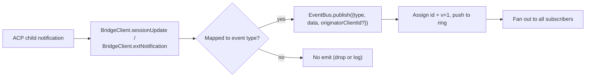

# 类型化 Daemon 事件 Schema v1

## 概述

Daemon 在 `GET /session/:id/events` 上发出的每个 SSE 帧格式为 `{ id, v, type, data, originatorClientId?, _meta? }`。`v: 1` 是当前的 `EVENT_SCHEMA_VERSION`。`type` 来自 `packages/sdk-typescript/src/daemon/events.ts` 中封闭的、版本固定的 `DAEMON_KNOWN_EVENT_TYPE_VALUES` 集合，当前集合包含 43 种已知事件类型。信封 `_meta` 字段由 `server.ts` 中的 `formatSseFrame()` 在 SSE 写入边界处标记；参见[信封级别元数据](#envelope-level-metadata)。

SDK 暴露了 `asKnownDaemonEvent(evt)`。对于已知事件类型，它返回一个可判别的 `KnownDaemonEvent`；对于其他类型，返回 `undefined`。因此，SDK 消费者可以在不要求同步升级 SDK 的情况下处理向前兼容性——当较新的 daemon 新增事件类型时，session reducer 会将这些事件记录为 `unrecognizedKnownEventCount`。

Wire 格式位于 [`../qwen-serve-protocol.md`](../qwen-serve-protocol.md)。本页是每个事件的 payload 契约。

## 职责

- 提供事件词汇表（`DAEMON_KNOWN_EVENT_TYPE_VALUES`）的唯一可信来源。
- 为每种事件类型提供类型化信封（`DaemonEventEnvelope<TType, TData>`）。
- 提供纯 reducer（`reduceDaemonSessionEvent`、`reduceDaemonAuthEvent`），将事件流投影为 SDK 视图状态。
- 广播 `typed_event_schema` 能力标签作为信息性信号。若该标签缺失，`asKnownDaemonEvent` 仍会回退到 `unknown`。

## 事件词汇表（43 种已知类型）

按领域分组。

### 核心 session

| 类型                       | 方向           | 触发条件                                                                      | 关键 payload 字段                                                                |
| -------------------------- | -------------- | ----------------------------------------------------------------------------- | -------------------------------------------------------------------------------- |
| `session_update`           | S->C           | 任何 ACP `sessionUpdate` 通知：agent 文本、思考、工具调用或计划               | `sessionUpdate: string, content?: ...`（不透明的 ACP 结构）                      |
| `session_metadata_updated` | S->C           | `PATCH /session/:id/metadata`                                                 | `sessionId, displayName?`                                                        |
| `session_died`             | S->C 终止      | `channel.exited`                                                              | `sessionId, reason, exitCode? \| null, signalCode? \| null`                      |
| `session_closed`           | S->C 终止      | `DELETE /session/:id` 或程序化关闭                                            | `sessionId, reason: 'client_close' \| string, closedBy?`                         |
| `session_snapshot`         | S->C 合成      | SSE 附加/重放后的快照帧                                                       | `sessionId, currentModelId: string \| null, currentApprovalMode: string \| null` |

### 订阅者级别合成帧

| 类型                    | 触发条件                                                                                                                                                                                                                             | 备注                                                                                                                                                                                                                                                                                                                           |
| ----------------------- | ------------------------------------------------------------------------------------------------------------------------------------------------------------------------------------------------------------------------------------ | ------------------------------------------------------------------------------------------------------------------------------------------------------------------------------------------------------------------------------------------------------------------------------------------------------------------------------ |
| `client_evicted`        | 每个订阅者 EventBus 队列溢出。**无 `id`**                                                                                                                                                                                           | `reason: string, droppedAfter?: number`；仅对当前订阅者终止，session 本身仍保持存活。                                                                                                                                                                                                                                          |
| `slow_client_warning`   | 队列 >= 75%；强制推送且**无 `id`**                                                                                                                                                                                                   | `queueSize, maxQueued, lastEventId`；队列降至 37.5% 以下后重新触发。                                                                                                                                                                                                                                                           |
| `stream_error`          | `SubscriberLimitExceededError` 或其他路由流错误                                                                                                                                                                                      | `error: string`；对该订阅终止。                                                                                                                                                                                                                                                                                                |
| `state_resync_required` | `subscribe({lastEventId})` 检测到 daemon 环中不再持有 `[lastEventId+1, earliestInRing-1]`，或客户端游标来自上一个 bus epoch。在剩余重放帧**之前**强制推送，且**无 `id`**。 | `reason: 'ring_evicted' \| 'epoch_reset' \| string`，`lastDeliveredId: number`，`earliestAvailableId: number`。这是恢复信号，非终止信号：SSE 流保持开放，重放 + 实时帧继续。SDK reducer 设置 `awaitingResync = true` 并跳过 delta 应用，直到调用者通过 `loadSession` 重置。 |
| `replay_complete`       | 无 id 的哨兵，在 `Last-Event-ID` 重放循环结束后发出，适用于正常重放和 ring-evicted 两种路径，即使 `data.replayedCount === 0` 也会发出。**无 `id`**                                                                                    | `replayedCount: number`；让消费者无需超时即可确定性地移除追赶 UI。                                                                                                                                                                                                                                                             |

### 权限（F3 + base）

| 类型                          | 方向  | 触发条件                               | 关键 payload 字段                                                                                                                                |
| ----------------------------- | ----- | -------------------------------------- | ------------------------------------------------------------------------------------------------------------------------------------------------ |
| `permission_request`          | S->C  | Agent 调用 `requestPermission`         | `requestId, sessionId, toolCall, options[]`；信封从提示发起者标记 `originatorClientId`。                                                         |
| `permission_resolved`         | S->C  | 调解方已做出决定                       | `requestId, outcome`（ACP `PermissionOutcome`）                                                                                                  |
| `permission_already_resolved` | S->C  | 投票在请求已决定后到达                 | `requestId, sessionId, outcome`                                                                                                                  |
| `permission_partial_vote`     | S->C  | `consensus` 策略记录了非最终投票       | `requestId, sessionId, votesReceived, votesNeeded (>= 1), quorum, optionTallies: Record<string, number>, originatorClientId?`                    |
| `permission_forbidden`        | S->C  | 策略拒绝了一次投票                     | `requestId, sessionId, clientId?, reason: 'designated_mismatch' \| 'remote_not_allowed', originatorClientId?`；匿名投票者省略 `clientId`。 |

### 模型

| 类型                  | 方向  | Payload                                      |
| --------------------- | ----- | -------------------------------------------- |
| `model_switched`      | S->C  | `sessionId, modelId`                         |
| `model_switch_failed` | S->C  | `sessionId, requestedModelId, error: string` |

### MCP 安全护栏（PR 14b + F2）

| 类型                         | 方向  | Payload                                                                                                                                                                                                                                                                                                                                                                                                                                           |
| ---------------------------- | ----- | ------------------------------------------------------------------------------------------------------------------------------------------------------------------------------------------------------------------------------------------------------------------------------------------------------------------------------------------------------------------------------------------------------------------------------------------------- |
| `mcp_budget_warning`         | S->C  | `liveCount, reservedCount, budget, thresholdRatio: 0.75, mode: 'warn' \| 'enforce', scope?: 'workspace' \| 'session'`                                                                                                                                                                                                                                                                                                                             |
| `mcp_child_refused_batch`    | S->C  | `refusedServers: [{ name, transport, reason: 'budget_exhausted' }], budget, liveCount, reservedCount, mode: 'enforce', scope?: 'workspace' \| 'session'`                                                                                                                                                                                                                                                                                          |
| `mcp_server_restarted`       | S->C  | `serverName, durationMs, entryIndex?`，用于 F2 多入口池重启                                                                                                                                                                                                                                                                                                                                                                                       |
| `mcp_server_restart_refused` | S->C  | `serverName, reason: 'budget_would_exceed' \| 'in_flight' \| 'disabled' \| 'restart_failed', entryIndex?, details?`。第四个值 `restart_failed` 携带池模式多入口重启的底层硬故障信息。`MCP_RESTART_REFUSED_REASONS` 会拒绝未知原因；较旧的 SDK reducer 会静默丢弃新增的 reason 值，因为 `parseDaemonEvent` 返回 `undefined`。新增 reason 时应同步发布能识别它的 SDK。 |

### 变更控制（Wave 4 PR 16+17）

| 类型                    | 方向  | Payload                                                                                              |
| ----------------------- | ----- | ---------------------------------------------------------------------------------------------------- |
| `memory_changed`        | S->C  | `scope: 'workspace' \| 'global', filePath, mode: 'append' \| 'replace', bytesWritten`                |
| `agent_changed`         | S->C  | `change: 'created' \| 'updated' \| 'deleted', name, level: 'project' \| 'user'`                      |
| `approval_mode_changed` | S->C  | `sessionId, previous, next, persisted: boolean`                                                      |
| `tool_toggled`          | S->C  | `toolName, enabled`；影响下一次 ACP 子进程启动，不会改变已运行的 session。                          |
| `settings_changed`      | S->C  | 工作区设置写入完成。Payload 开放；消费者应使用写后读刷新。                                           |
| `settings_reloaded`     | S->C  | Daemon 工作区服务重读了设置。Payload 开放。                                                          |
| `workspace_initialized` | S->C  | `path, action: 'created' \| 'overwrote' \| 'noop', originatorClientId?`                              |

### Auth 设备流（PR 21）

这些事件以工作区为键，而非以 session 为键。session reducer 将其视为无操作；`reduceDaemonAuthEvent` 将其投影为工作区级别状态。

| 类型                          | 方向  | Payload                                               |
| ----------------------------- | ----- | ----------------------------------------------------- |
| `auth_device_flow_started`    | S->C  | `deviceFlowId, providerId, expiresAt`                 |
| `auth_device_flow_throttled`  | S->C  | `deviceFlowId, intervalMs`                            |
| `auth_device_flow_authorized` | S->C  | `deviceFlowId, providerId, expiresAt?, accountAlias?` |
| `auth_device_flow_failed`     | S->C  | `deviceFlowId, errorKind, hint?`                      |
| `auth_device_flow_cancelled`  | S->C  | `deviceFlowId`                                        |

### MCP 运行时变更

| 类型                 | 方向  | 触发条件                                                      | 关键 payload 字段                                                            |
| -------------------- | ----- | ------------------------------------------------------------- | ---------------------------------------------------------------------------- |
| `mcp_server_added`   | S->C  | 通过 `POST /workspace/mcp/servers` 在运行时添加了服务器       | `name, transport, replaced, shadowedSettings, toolCount, originatorClientId` |
| `mcp_server_removed` | S->C  | 在运行时移除了服务器                                          | `name, wasShadowingSettings, originatorClientId`                             |

### 轮次生命周期 / 助手推送

| 类型                  | 方向  | 触发条件                                                                                                            | 关键 payload 字段                                                                                                                                                                                |
| --------------------- | ----- | ------------------------------------------------------------------------------------------------------------------- | ------------------------------------------------------------------------------------------------------------------------------------------------------------------------------------------------ |
| `prompt_cancelled`    | S->C  | 通过显式 `cancelSession` 路由**或**发起者 SSE 断开连接取消了提示                                                   | 信封为取消方标记 `originatorClientId`。这表示"已请求取消"，而非"已确认取消"。对等订阅者得知提示已结束。                                                                                         |
| `turn_complete`       | S->C  | 一个轮次成功完成                                                                                                    | `sessionId, stopReason, promptId?`。`promptId` 链接到非阻塞提示响应（`202`）。SDK 通过它将 SSE 事件与发起提示匹配。                                                                              |
| `turn_error`          | S->C  | 一个轮次失败                                                                                                        | `sessionId, message, code?, promptId?`；相同的 `promptId` 关联机制。                                                                                                                            |
| `session_rewound`     | S->C  | `POST /session/:id/rewind` 成功                                                                                     | `sessionId, promptId, targetTurnIndex, filesChanged[], filesFailed[], originatorClientId?`                                                                                                       |
| `session_branched`    | S->C  | `POST /session/:id/branch` 从现有 session 创建了分支                                                               | `sourceSessionId, newSessionId, displayName, originatorClientId?`                                                                                                                                |
| `followup_suggestion` | S->C  | ACP 子进程在 `end_turn` 后生成了幽灵文本后续建议，通过每个 session 的 SSE 转发                                     | `sessionId, suggestion, promptId`；wire 层仅携带 `getFilterReason()===null` 的建议。客户端将其渲染为输入占位符幽灵文本，并在下一次 `sendPrompt` 时使其失效。 |
| `user_shell_command`  | S->C  | 用户通过 `POST /session/:id/shell` 启动了 shell 命令；广播给同一 session 的其他订阅者                              | `sessionId, command, shellId, originatorClientId?`。目前尚无类型化的 `DaemonXxxData` 接口；`asKnownDaemonEvent` 返回 `undefined`，UI 规范化器以 ad hoc 方式解析。                                |
| `user_shell_result`   | S->C  | 上述 shell 命令的结果                                                                                               | `sessionId, shellId, exitCode, output, aborted`。与 `user_shell_command` 相同的 ad hoc 解析说明。                                                                                               |

## 架构

| 关注点                                 | 来源                                           | 备注                                                                                                               |
| -------------------------------------- | ---------------------------------------------- | ------------------------------------------------------------------------------------------------------------------ |
| `EVENT_SCHEMA_VERSION = 1`             | `packages/acp-bridge/src/eventBus.ts`          | 每帧都会发送。                                                                                                     |
| `DAEMON_KNOWN_EVENT_TYPE_VALUES`       | `packages/sdk-typescript/src/daemon/events.ts` | 包含 43 种类型的封闭列表。                                                                                         |
| `DaemonEventEnvelope<TType, TData>`    | `events.ts`                                    | 泛型信封。                                                                                                         |
| `DaemonKnownEventType`                 | `events.ts`                                    | `typeof DAEMON_KNOWN_EVENT_TYPE_VALUES[number]`。                                                                  |
| 每个事件的 payload 类型                | `events.ts`                                    | 大多数事件类型有 `DaemonXxxData` 接口；`user_shell_*` 目前由 UI 规范化器以 ad hoc 方式解析。                       |
| `asKnownDaemonEvent(evt)`              | `events.ts`                                    | 返回 `KnownDaemonEvent \| undefined`。                                                                             |
| `reduceDaemonSessionEvent(state, evt)` | `events.ts`                                    | 投影为 `DaemonSessionViewState`。                                                                                  |
| `reduceDaemonAuthEvent(state, evt)`    | `events.ts`                                    | 投影为 `DaemonAuthState`。                                                                                         |
| `isWorkspaceScopedBudgetEvent(evt)`    | `events.ts`                                    | 检测 F2 的 `scope: 'workspace'`。                                                                                  |

### `DaemonSessionViewState`

`reduceDaemonSessionEvent` 填充此视图状态。CLI TUI 适配器、`DaemonChannelBridge` 和 VS Code IDE 均消费它。关键字段：

- `alive: boolean` - 在终止帧（`session_died`、`session_closed`、`client_evicted`、`stream_error`）后变为 `false`。
- `currentModelId?: string` - 来自 `model_switched`。
- `displayName?: string` - 来自 `session_metadata_updated`。
- `pendingPermissions: Record<string, DaemonPermissionRequestData>` - 以 `requestId` 为键的待处理请求；由 `permission_resolved` / `permission_already_resolved` 清除。
- `lastSessionUpdate?: DaemonSessionUpdateData` - 最新的 `session_update`。
- `lastModelSwitchFailure?: DaemonModelSwitchFailedData` - 来自 `model_switch_failed`。
- `terminalEvent?` - 原始终止事件。
- `streamError?: DaemonStreamErrorData` - 最新的 `stream_error` payload。
- `unrecognizedKnownEventCount`、`lastUnrecognizedKnownEvent?` - 事件被 `asKnownDaemonEvent` 识别但 reducer 尚无专用状态。
- `droppedPermissionRequestCount`、`lastDroppedPermissionRequestId?` - 格式错误的权限请求无法进入待处理映射。
- `unmatchedPermissionResolutionCount`、`lastUnmatchedPermissionResolutionId?` - 权限解析没有匹配的待处理请求。
- `slowClientWarningCount`、`lastSlowClientWarning?` - 来自 `slow_client_warning`。
- `mcpBudgetWarningCount`、`lastMcpBudgetWarning?` - 来自 `mcp_budget_warning`。
- `mcpChildRefusedBatchCount`、`lastMcpChildRefusedBatch?` - 来自 `mcp_child_refused_batch`。
- `lastWorkspaceMutation?`、`lastWorkspaceMutationType?` - 来自 `memory_changed` / `agent_changed`。
- `approvalMode?`、`approvalModeChangedCount`、`lastApprovalModeChange?` - 来自 `approval_mode_changed`。
- `toolToggleCount`、`lastToolToggle?` - 来自 `tool_toggled`。
- `workspaceInitCount`、`lastWorkspaceInit?` - 来自 `workspace_initialized`。
- `mcpRestartCount`、`lastMcpRestart?` - 来自 `mcp_server_restarted`。
- `mcpRestartRefusedCount`、`lastMcpRestartRefused?` - 来自 `mcp_server_restart_refused`。
- `settings_changed` / `settings_reloaded` - 被 `asKnownDaemonEvent` 识别；session reducer 不维护专用视图状态字段，UI 通常将其视为刷新信号。
- `permissionVoteProgress: Record<string, DaemonPermissionPartialVoteData>` - 共识投票进度。
- `forbiddenVotes: DaemonPermissionForbiddenData[]`、`forbiddenVoteCount` - 策略拒绝的投票记录，上限 32 条。
- `awaitingResync: boolean` - 由 `state_resync_required` 设置；消费者重置视图状态时清除。
- `resyncRequiredCount`、`lastResyncRequired?` - resync 可观测性。
- `lastFollowupSuggestion?: DaemonFollowupSuggestionData` - daemon 推送的最新后续建议。
- `lastTurnComplete?: DaemonTurnCompleteData` - 最新成功的轮次完成。
- `lastTurnError?: DaemonTurnErrorData` - 最新的轮次错误。
- `rewindCount`、`lastRewind?`、`lastBranch?` - 最新的回退/分支事件。

### `DaemonAuthState`

每个 `providerId` 对应一个条目，由 `auth_device_flow_*` 驱动。每个流暴露 `{ deviceFlowId, status, providerId, expiresAt?, lastThrottleIntervalMs?, lastError? }`。

## 流程

### 生产者侧



### 消费者侧（SDK）


## 信封级别元数据

除每个事件的 `data` payload 外，daemon 还会标记两个信封级别字段。

### `_meta.serverTimestamp` - daemon 时钟

`packages/cli/src/serve/server.ts` 中的 `formatSseFrame()` 在 SSE 写入边界处标记此字段，**不是**在 `EventBus.publish` 内部。内存中的 `BridgeEvent` 类型保持不变；daemon 内部消费者不会看到 `_meta`，而 wire SSE 帧会包含它。

```jsonc
{
  "id": 47,
  "v": 1,
  "type": "session_update",
  "data": { ... },
  "_meta": { "serverTimestamp": 1716287345123 }
}
```

合并会保留所有现有的 `_meta` 键
（`{...existingMeta, serverTimestamp: Date.now()}`）。**当前没有任何 daemon 生产者
写入信封级别的 `_meta`**。顶层合并是一个向前兼容的
逃生舱口。

为何重要：渲染相对时间或对对话块排序的多客户端 UI 应使用服务器时间，而不是各个浏览器/标签页/手机的本地时钟。服务器端标记使跨客户端的排序保持一致。

SDK 访问方式：优先使用 `event._meta?.serverTimestamp`。兼容路径也可以探测 `event.serverTimestamp` 或 `event.data._meta.serverTimestamp`。不要混淆 ACP payload 的 `data._meta` 与 daemon 信封的 `_meta`。

### `originatorClientId`

由携带已注册 `X-Qwen-Client-Id` 的请求触发的事件可能会标记此字段。参见 [`08-session-lifecycle.md`](./08-session-lifecycle.md)。

## 工具调用 `_meta`（来源 / serverId）

这与信封 `_meta` 是独立的：ACP `session/update` payload 可以在 `event.data._meta` 中携带自己的 `_meta`。`ToolCallEmitter`（`packages/cli/src/acp-integration/session/emitters/ToolCallEmitter.ts`）在 `emitStart`、`emitResult` 和 `emitError` 时标记两个字段：

| 字段         | 类型                                      | 解析规则                                                                                                                                                                   |
| ------------ | ----------------------------------------- | -------------------------------------------------------------------------------------------------------------------------------------------------------------------------- |
| `provenance` | `'builtin' \| 'mcp' \| 'subagent'`        | `ToolCallEmitter.resolveToolProvenance`：`subagentMeta` 存在时优先使用 `subagent`；工具名称匹配 `mcp__<server>__<tool>` 时映射为 `mcp`；其余均映射为 `builtin`。 |
| `serverId`   | 仅当 `provenance === 'mcp'` 时为 `string` | 从 `mcp__<serverId>__<tool>` 中启发式提取。                                                                                                                                |

现有的 `_meta.toolName` 显示名称得以保留。UI 使用这些字段来渲染 builtin / MCP 服务器 / subagent 徽章，无需重新解析工具名称。

## SDK reducer 行为

`packages/sdk-typescript/src/daemon/events.ts` 中的 `reduceDaemonSessionEvent(state, evt)` 将事件流投影为 `DaemonSessionViewState`。与 resync 相关的字段：

- **`awaitingResync: boolean`** - 由 `state_resync_required` 设置；调用者清除，通常在 `POST /session/:id/load` 重置视图状态后。
- **`resyncRequiredCount: number`** - 可观测性计数器。
- **`lastResyncRequired?: DaemonStateResyncRequiredData`** - 最新 payload。

当 `awaitingResync = true` 时，reducer **跳过 delta 应用**，只允许封闭的 `RESYNC_PASSTHROUGH_TYPES` 集合：

| 直通类型                | 为何在 resync 期间仍然应用                                                   |
| ----------------------- | ---------------------------------------------------------------------------- |
| `state_resync_required` | 罕见的第二次 resync 应更新 `lastResyncRequired` / `resyncRequiredCount`。    |
| `session_died`          | 终止流信号在 resync 期间必须保持可见。                                       |
| `session_closed`        | 同上。                                                                       |
| `client_evicted`        | 同上。                                                                       |
| `stream_error`          | 同上。                                                                       |
| `session_snapshot`      | 全状态权威帧；在 resync 期间可安全应用。                                     |

`lastEventId` 在 resync 期间仍通过 `advanceLastEventId(base)` 单调递增。调用者重置并清除 `awaitingResync` 后，后续 delta 将与正确的游标对齐。

`reduceDaemonAuthEvent` 将设备流事件投影为工作区级别的 auth
状态条目，概念上形如
`{deviceFlowId, status, providerId, expiresAt?, lastThrottleIntervalMs?, lastError?}`。在代码中，reducer 将 `status`、`errorKind`、`hint`、
`intervalMs`、`lastSeenEventId`、`authorizedExpiresAt` 和 `accountAlias` 存储在
`DaemonDeviceFlowReducerState` 上；daemon 事件 payload 本身保持上述每个事件的形状。

## 状态与向前兼容性

- 通过向 `DAEMON_KNOWN_EVENT_TYPE_VALUES` 末尾追加来新增已知事件类型。旧 SDK 通过回退路径对未识别的事件类型返回 `undefined` 并递增 `unrecognizedKnownEventCount`；新 SDK 依赖可判别联合。
- 向现有 payload 添加可选字段是安全的，因为 payload 是开放的（`{ [key: string]: unknown }`）。
- 更改现有 payload **结构**是破坏性变更，必须升级 `EVENT_SCHEMA_VERSION` 并广播兼容的能力标签，如 `caps.features.typed_event_schema_v2`。
- `id` 在每个 session 内单调递增。订阅者级别的合成帧（`client_evicted`、`slow_client_warning`、`stream_error`、`state_resync_required`、`replay_complete`、`session_snapshot`）有意不带 id，这样其他订阅者就不会看到间隔。
- `originatorClientId` 位于信封而非 `data` 上。F3 的 partial-vote / forbidden payload 也通过 `mergeOriginator` 将其合并到 `data` 中，这样视图状态消费者就不需要保留信封。

## 依赖

- [`10-event-bus.md`](./10-event-bus.md) - 投递通道。
- [`11-capabilities-versioning.md`](./11-capabilities-versioning.md) - SDK 如何预检 `typed_event_schema`、`mcp_guardrail_events` 和 `permission_mediation`。
- [`04-permission-mediation.md`](./04-permission-mediation.md) - 权限事件如何产生。
- [`13-sdk-daemon-client.md`](./13-sdk-daemon-client.md) - `asKnownDaemonEvent`、reducer 和视图状态结构。

## 配置

- 始终广播：`typed_event_schema`、`mcp_guardrail_events` 和 `permission_mediation`（含支持的策略模式）。
- 没有环境变量或标志直接控制 schema 本身。`QWEN_SERVE_NO_MCP_POOL=1` 会将 MCP 事件的 `scope` 从 `'workspace'` 更改为缺失或 `'session'`。

## 注意事项与已知限制

- 六种合成帧类型有意不带 `id`；SDK 代码不能假设每个事件都有 id。
- `permission_partial_vote` 仅出现在 `consensus` 策略下。`permission_forbidden` 出现在 `designated`、`consensus` 和 `local-only` 下，但不出现在 `first-responder` 下。
- `mcp_child_refused_batch` 仅出现在 `mode: 'enforce'` 时；`warn` 模式从不拒绝。
- `auth_device_flow_*` 事件不以 session 为键。通过 `DaemonSessionClient` 消费时，应使用 `reduceDaemonAuthEvent` 处理这些事件，而非 session reducer。

## 参考

- `packages/sdk-typescript/src/daemon/events.ts`
- `packages/acp-bridge/src/eventBus.ts`（`EVENT_SCHEMA_VERSION`）
- `packages/cli/src/serve/capabilities.ts`（`typed_event_schema`、`mcp_guardrail_events`、`permission_mediation`）
- Wire 参考：[`../qwen-serve-protocol.md`](../qwen-serve-protocol.md)
