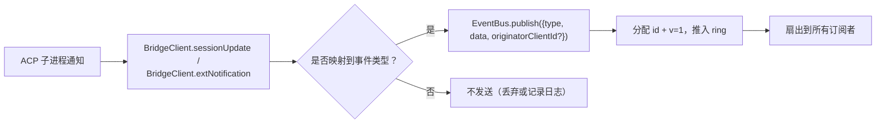
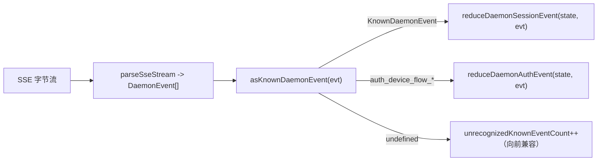

# 类型化 Daemon 事件 Schema v1

## 概述

Daemon 在 `GET /session/:id/events` 上发出的每个 SSE 帧都具有 `{ id, v, type, data, originatorClientId?, _meta? }` 的结构。`v: 1` 是当前的 `EVENT_SCHEMA_VERSION`。`type` 来自 `packages/sdk-typescript/src/daemon/events.ts` 中封闭且版本固定的 `DAEMON_KNOWN_EVENT_TYPE_VALUES` 集合；当前集合包含 47 种已知事件类型。信封的 `_meta` 字段由 `packages/cli/src/serve/routes/sse-events.ts` 中的 `formatSseFrame()` 在 SSE 写入边界处注入；请参阅[信封级元数据](#envelope-level-metadata)。

SDK 暴露了 `asKnownDaemonEvent(evt)`。它为已知事件类型返回一个可区分的 `KnownDaemonEvent`，为其他类型返回 `undefined`。因此，当较新的 Daemon 添加新事件类型时，SDK 使用者可以处理向前兼容性，而无需同步升级 SDK；session reducer 会将这些事件记录为 `unrecognizedKnownEventCount`。

传输格式位于 [`../qwen-serve-protocol.md`](../qwen-serve-protocol.md)。本页是每个事件的 payload 契约。

## 职责

- 提供事件词汇表（`DAEMON_KNOWN_EVENT_TYPE_VALUES`）的唯一事实来源。
- 为每种事件类型提供类型化的信封（`DaemonEventEnvelope<TType, TData>`）。
- 提供纯 reducer（`reduceDaemonSessionEvent`、`reduceDaemonAuthEvent`），将事件流投影到 SDK 视图状态中。
- 广播 `typed_event_schema` 能力标签作为信息信号。如果缺少该标签，`asKnownDaemonEvent` 仍会回退到 `unknown`。

## 事件词汇表（47 种已知类型）

按领域分组。

### 核心 session

| 类型                       | 方向      | 触发条件                                                                       | 关键 payload 字段                                                               |
| -------------------------- | -------------- | ----------------------------------------------------------------------------- | -------------------------------------------------------------------------------- |
| `session_update`           | S->C           | 任何 ACP `sessionUpdate` 通知：agent 文本、思考、工具调用或计划 | `sessionUpdate: string, content?: ...`（不透明的 ACP 结构）                        |
| `session_metadata_updated` | S->C           | `PATCH /session/:id/metadata`                                                 | `sessionId, displayName?`                                                        |
| `session_died`             | S->C 终止  | `channel.exited`                                                              | `sessionId, reason, exitCode? \| null, signalCode? \| null`                      |
| `session_closed`           | S->C 终止  | `DELETE /session/:id` 或编程式关闭                                   | `sessionId, reason: 'client_close' \| string, closedBy?`                         |
| `session_snapshot`         | S->C 合成 | SSE 附加/重放后的快照帧                                      | `sessionId, currentModelId: string \| null, currentApprovalMode: string \| null` |

### 订阅者级合成帧

| 类型                    | 触发条件                                                                                                                                                                                                                              | 备注                                                                                                                                                                                                                                                                                                                          |
| ----------------------- | ------------------------------------------------------------------------------------------------------------------------------------------------------------------------------------------------------------------------------------ | ------------------------------------------------------------------------------------------------------------------------------------------------------------------------------------------------------------------------------------------------------------------------------------------------------------------------------ |
| `client_evicted`        | 每个订阅者的 EventBus 队列溢出。**无 `id`**                                                                                                                                                                                  | `reason: string, droppedAfter?: number`；仅对当前订阅者终止，而 session 保持存活。                                                                                                                                                                                                            |
| `slow_client_warning`   | 队列 >= 75%；强制推送且**无 `id`**                                                                                                                                                                                       | `queueSize, maxQueued, lastEventId`；队列降至 37.5% 以下后重新触发。                                                                                                                                                                                                                                               |
| `stream_error`          | `SubscriberLimitExceededError` 或其他路由流错误                                                                                                                                                                         | `error: string`；对订阅终止。                                                                                                                                                                                                                                                                                |
| `state_resync_required` | `subscribe({lastEventId})` 检测到 daemon ring 不再包含 `[lastEventId+1, earliestInRing-1]`，或者客户端游标来自上一个 bus epoch。在剩余的重放帧**之前**强制推送且**无 `id`**。 | `reason: 'ring_evicted' \| 'epoch_reset' \| string`，`lastDeliveredId: number`，`earliestAvailableId: number`。这是一个恢复信号，而非终止信号：SSE 流保持打开，重放和实时帧继续。SDK reducer 设置 `awaitingResync = true` 并跳过增量，直到调用者使用 `loadSession` 重置。 |
| `replay_complete`       | 在 `Last-Event-ID` 重放循环完成后发出的无 ID 哨兵，适用于干净重放和 ring 驱逐路径，即使 `data.replayedCount === 0`。**无 `id`**                                                             | `replayedCount: number`；允许使用者确定性地移除同步 UI，而无需依赖超时。                                                                                                                                                                                                                                |

### 权限（F3 + base）

| 类型                          | 方向 | 触发条件                                            | 关键 payload 字段                                                                                                                               |
| ----------------------------- | --------- | -------------------------------------------------- | ------------------------------------------------------------------------------------------------------------------------------------------------ |
| `permission_request`          | S->C      | Agent 调用 `requestPermission`                    | `requestId, sessionId, toolCall, options[]`；信封从 prompt 发起者处标记 `originatorClientId`。                                |
| `permission_resolved`         | S->C      | Mediator 已做出决定                               | `requestId, outcome`（ACP `PermissionOutcome`）                                                                                                   |
| `permission_already_resolved` | S->C      | 在请求已被决定后收到投票 | `requestId, sessionId, outcome`                                                                                                                  |
| `permission_partial_vote`     | S->C      | `consensus` 策略记录非最终投票        | `requestId, sessionId, votesReceived, votesNeeded (>= 1), quorum, optionTallies: Record<string, number>, originatorClientId?`                    |
| `permission_forbidden`        | S->C      | 策略拒绝投票                              | `requestId, sessionId, clientId?, reason: 'designated_mismatch' \| 'remote_not_allowed', originatorClientId?`；匿名投票者省略 `clientId`。 |

### 模型

| 类型                  | 方向 | Payload                                      |
| --------------------- | --------- | -------------------------------------------- |
| `model_switched`      | S->C      | `sessionId, modelId`                         |
| `model_switch_failed` | S->C      | `sessionId, requestedModelId, error: string` |

### MCP 护栏（PR 14b + F2）

| 类型                         | 方向 | Payload                                                                                                                                                                                                                                                                                                                                                                                                                                           |
| ---------------------------- | --------- | ------------------------------------------------------------------------------------------------------------------------------------------------------------------------------------------------------------------------------------------------------------------------------------------------------------------------------------------------------------------------------------------------------------------------------------------------- |
| `mcp_budget_warning`         | S->C      | `liveCount, reservedCount, budget, thresholdRatio: 0.75, mode: 'warn' \| 'enforce', scope?: 'workspace' \| 'session'`                                                                                                                                                                                                                                                                                                                             |
| `mcp_child_refused_batch`    | S->C      | `refusedServers: [{ name, transport, reason: 'budget_exhausted' }], budget, liveCount, reservedCount, mode: 'enforce', scope?: 'workspace' \| 'session'`                                                                                                                                                                                                                                                                                          |
| `mcp_server_restarted`       | S->C      | F2 多条目池重启的 `serverName, durationMs, entryIndex?`                                                                                                                                                                                                                                                                                                                                                                            |
| `mcp_server_restart_refused` | S->C      | `serverName, reason: 'budget_would_exceed' \| 'in_flight' \| 'disabled' \| 'restart_failed', entryIndex?, details?`。第四个值 `restart_failed` 携带池模式多条目重启的底层硬故障。`MCP_RESTART_REFUSED_REASONS` 拒绝未知原因；较旧的 SDK reducer 会静默丢弃新增的原因值，因为 `parseDaemonEvent` 会返回 `undefined`。请随支持该新原因的 SDK 一起发布。 |

### 变更控制（Wave 4 PR 16+17）

| 类型                     | 方向 | Payload                                                                                                                          |
| ------------------------ | --------- | -------------------------------------------------------------------------------------------------------------------------------- |
| `memory_changed`         | S->C      | `scope: 'workspace' \| 'global', filePath, mode: 'append' \| 'replace', bytesWritten`                                            |
| `agent_changed`          | S->C      | `change: 'created' \| 'updated' \| 'deleted', name, level: 'project' \| 'user'`                                                  |
| `approval_mode_changed`  | S->C      | `sessionId, previous, next, persisted: boolean`                                                                                  |
| `tool_toggled`           | S->C      | `toolName, enabled`；影响下一次 ACP 子进程生成，不会变更已运行的 session。                              |
| `settings_changed`       | S->C      | Workspace 设置写入完成。Payload 是开放的；使用者应通过写后读（read-after-write）进行刷新。                             |
| `settings_reloaded`      | S->C      | Daemon workspace 服务重新读取设置。Payload 是开放的。                                                                       |
| `trust_change_requested` | S->C      | `workspaceCwd, desiredState: 'trusted' \| 'untrusted', reason?`                                                                  |
| `workspace_initialized`  | S->C      | `path, action: 'created' \| 'overwrote' \| 'noop', originatorClientId?`                                                          |
| `github_setup_completed` | S->C      | `releaseTag, readmeUrl, secretsUrl?, workflows: [{path, status, sizeBytes?, error?}], gitignore: {path, status, added?, error?}` |

### Auth 设备流（PR 21）

这些事件以 workspace 为键，而非 session。session reducer 将它们视为无操作（no-ops）；`reduceDaemonAuthEvent` 将它们投影到 workspace 级状态中。

| 类型                          | 方向 | Payload                                               |
| ----------------------------- | --------- | ----------------------------------------------------- |
| `auth_device_flow_started`    | S->C      | `deviceFlowId, providerId, expiresAt`                 |
| `auth_device_flow_throttled`  | S->C      | `deviceFlowId, intervalMs`                            |
| `auth_device_flow_authorized` | S->C      | `deviceFlowId, providerId, expiresAt?, accountAlias?` |
| `auth_device_flow_failed`     | S->C      | `deviceFlowId, errorKind, hint?`                      |
| `auth_device_flow_cancelled`  | S->C      | `deviceFlowId`                                        |

### MCP 运行时变更

| 类型                 | 方向 | 触发条件                                                       | 关键 payload 字段                                                           |
| -------------------- | --------- | ------------------------------------------------------------- | ---------------------------------------------------------------------------- |
| `mcp_server_added`   | S->C      | 在运行时通过 `POST /workspace/mcp/servers` 添加 Server | `name, transport, replaced, shadowedSettings, toolCount, originatorClientId` |
| `mcp_server_removed` | S->C      | 在运行时移除 Server                                     | `name, wasShadowingSettings, originatorClientId`                             |

### 扩展生命周期

| 类型                 | 方向 | 触发条件                                                              | 关键 payload 字段                                                                                                                               |
| -------------------- | --------- | -------------------------------------------------------------------- | ------------------------------------------------------------------------------------------------------------------------------------------------ |
| `extensions_changed` | S->C      | 后台扩展安装/刷新工作完成或状态变更 | `refreshed, failed, status?: 'installed' \| 'enabled' \| 'disabled' \| 'updated' \| 'uninstalled' \| 'failed', source?, name?, version?, error?` |

### 轮次中消息注入

| 类型                        | 方向 | 触发条件                                                                                         | 关键 payload 字段                                                                                                                 |
| --------------------------- | --------- | ----------------------------------------------------------------------------------------------- | ---------------------------------------------------------------------------------------------------------------------------------- |
| `mid_turn_message_injected` | S->C      | Web-shell 或远程客户端通过 `POST /session/:id/inject` 将消息注入到正在运行的轮次中 | `sessionId, messages: string[], originatorClientId?`；使用者在去重前**必须**将 `originatorClientId` 与自己的 id 进行比较。 |

### 轮次生命周期 / 助手推送

| 类型                  | 方向 | 触发条件                                                                                                             | 关键 payload 字段                                                                                                                                                                               |
| --------------------- | --------- | ------------------------------------------------------------------------------------------------------------------- | ------------------------------------------------------------------------------------------------------------------------------------------------------------------------------------------------ |
| `prompt_cancelled`    | S->C      | 通过显式的 `cancelSession` 路由**或**发起者 SSE 断开连接取消了 Prompt | 信封为取消客户端标记 `originatorClientId`。这意味着“已请求取消”，而非“已确认取消”。对等订阅者会得知 prompt 已结束。              |
| `turn_complete`       | S->C      | 轮次成功完成                                                                                       | `sessionId, stopReason, promptId?`。`promptId` 链接到非阻塞 prompt 响应（`202`）。SDK 通过它将 SSE 事件与发起的 prompt 进行匹配。                                  |
| `turn_error`          | S->C      | 轮次失败                                                                                                       | `sessionId, message, code?, promptId?`；相同的 `promptId` 关联机制。                                                                                                                   |
| `session_rewound`     | S->C      | `POST /session/:id/rewind` 成功                                                                                | `sessionId, promptId, targetTurnIndex, filesChanged[], filesFailed[], originatorClientId?`                                                                                                       |
| `session_branched`    | S->C      | `POST /session/:id/branch` 从现有 session 创建了一个分支                                                | `sourceSessionId, newSessionId, displayName, originatorClientId?`                                                                                                                                |
| `followup_suggestion` | S->C      | ACP 子进程在 `end_turn` 后生成了 ghost-text 后续建议，并通过每个 session 的 SSE 转发               | `sessionId, suggestion, promptId`；传输层仅携带 `getFilterReason()===null` 的建议。客户端将它们渲染为输入占位符 ghost-text，并在下一次 `sendPrompt` 时使其失效。 |
| `user_shell_command`  | S->C      | 用户通过 `POST /session/:id/shell` 启动了 shell 命令；扇出到同一 session 中的其他订阅者 | `sessionId, command, shellId, originatorClientId?`。目前还没有类型化的 `DaemonXxxData` 接口；`asKnownDaemonEvent` 返回 `undefined`，UI 规范化器会临时解析它。            |
| `user_shell_result`   | S->C      | 上述 shell 命令的结果                                                                                   | `sessionId, shellId, exitCode, output, aborted`。与 `user_shell_command` 相同的临时解析说明。                                                                                               |
## 架构

| 关注点                                 | 来源                                           | 说明                                                                                                               |
| -------------------------------------- | ---------------------------------------------- | ------------------------------------------------------------------------------------------------------------------ |
| `EVENT_SCHEMA_VERSION = 1`             | `packages/acp-bridge/src/eventBus.ts`          | 每帧都会发送。                                                                                                     |
| `DAEMON_KNOWN_EVENT_TYPE_VALUES`       | `packages/sdk-typescript/src/daemon/events.ts` | 包含 47 种类型的封闭列表。                                                                                         |
| `DaemonEventEnvelope<TType, TData>`    | `events.ts`                                    | 泛型信封。                                                                                                         |
| `DaemonKnownEventType`                 | `events.ts`                                    | `typeof DAEMON_KNOWN_EVENT_TYPE_VALUES[number]`。                                                                  |
| 每种事件的 payload 类型                | `events.ts`                                    | 大多数事件类型都有一个 `DaemonXxxData` 接口；`user_shell_*` 目前由 UI 规范化器临时解析。                           |
| `asKnownDaemonEvent(evt)`              | `events.ts`                                    | 返回 `KnownDaemonEvent \| undefined`。                                                                             |
| `reduceDaemonSessionEvent(state, evt)` | `events.ts`                                    | 映射到 `DaemonSessionViewState`。                                                                                  |
| `reduceDaemonAuthEvent(state, evt)`    | `events.ts`                                    | 映射到 `DaemonAuthState`。                                                                                         |
| `isWorkspaceScopedBudgetEvent(evt)`    | `events.ts`                                    | 检测 F2 `scope: 'workspace'`。                                                                                     |

### `DaemonSessionViewState`

`reduceDaemonSessionEvent` 负责填充此视图状态。CLI TUI 适配器、`DaemonChannelBridge` 和 VS Code IDE 会消费它。关键字段：

- `alive: boolean` - 在收到终止帧（`session_died`、`session_closed`、`client_evicted`、`stream_error`）后变为 `false`。
- `currentModelId?: string` - 来自 `model_switched`。
- `displayName?: string` - 来自 `session_metadata_updated`。
- `pendingPermissions: Record<string, DaemonPermissionRequestData>` - 以 `requestId` 为键的未决请求；通过 `permission_resolved` / `permission_already_resolved` 清除。
- `lastSessionUpdate?: DaemonSessionUpdateData` - 最新的 `session_update`。
- `lastModelSwitchFailure?: DaemonModelSwitchFailedData` - 来自 `model_switch_failed`。
- `terminalEvent?` - 原始终端事件。
- `streamError?: DaemonStreamErrorData` - 最新的 `stream_error` payload。
- `unrecognizedKnownEventCount`, `lastUnrecognizedKnownEvent?` - 事件已被 `asKnownDaemonEvent` 识别，但 reducer 尚未为其提供专用状态。
- `droppedPermissionRequestCount`, `lastDroppedPermissionRequestId?` - 格式错误的权限请求无法进入 pending map。
- `unmatchedPermissionResolutionCount`, `lastUnmatchedPermissionResolutionId?` - 权限解析没有匹配的 pending 请求。
- `slowClientWarningCount`, `lastSlowClientWarning?` - 来自 `slow_client_warning`。
- `mcpBudgetWarningCount`, `lastMcpBudgetWarning?` - 来自 `mcp_budget_warning`。
- `mcpChildRefusedBatchCount`, `lastMcpChildRefusedBatch?` - 来自 `mcp_child_refused_batch`。
- `lastWorkspaceMutation?`, `lastWorkspaceMutationType?` - 来自 `memory_changed` / `agent_changed`。
- `approvalMode?`, `approvalModeChangedCount`, `lastApprovalModeChange?` - 来自 `approval_mode_changed`。
- `toolToggleCount`, `lastToolToggle?` - 来自 `tool_toggled`。
- `workspaceInitCount`, `lastWorkspaceInit?` - 来自 `workspace_initialized`。
- `mcpRestartCount`, `lastMcpRestart?` - 来自 `mcp_server_restarted`。
- `mcpRestartRefusedCount`, `lastMcpRestartRefused?` - 来自 `mcp_server_restart_refused`。
- `settings_changed` / `settings_reloaded` - 由 `asKnownDaemonEvent` 识别；session reducer 不维护专用的视图状态字段，UI 通常将其视为刷新信号。
- `permissionVoteProgress: Record<string, DaemonPermissionPartialVoteData>` - 共识投票进度。
- `forbiddenVotes: DaemonPermissionForbiddenData[]`, `forbiddenVoteCount` - 被策略拒绝的投票记录，上限为 32 条。
- `awaitingResync: boolean` - 由 `state_resync_required` 设置；当 consumer 重置视图状态时清除。
- `resyncRequiredCount`, `lastResyncRequired?` - resync 可观测性。
- `lastFollowupSuggestion?: DaemonFollowupSuggestionData` - daemon 推送的最新后续建议。
- `lastTurnComplete?: DaemonTurnCompleteData` - 最新一次成功的 turn 完成。
- `lastTurnError?: DaemonTurnErrorData` - 最新的 turn 错误。
- `rewindCount`, `lastRewind?`, `lastBranch?` - 最新的 rewind / branch 事件。

### `DaemonAuthState`

每个 `providerId` 对应一个条目，由 `auth_device_flow_*` 驱动。每个 flow 暴露 `{ deviceFlowId, status, providerId, expiresAt?, lastThrottleIntervalMs?, lastError? }`。

## 流程

### 生产端



### 消费端 (SDK)



## 信封级元数据

除了每个事件的 `data` payload 之外，daemon 还会打上两个信封级字段的戳。

### `_meta.serverTimestamp` - daemon 时钟

`packages/acp-bridge/src/eventBus.ts` 中的 `EventBus.publish()` 会在事件进入 bus 时打上 `_meta.serverTimestamp` 戳。`BridgeEvent` 类型包含 `_meta?: Record<string, unknown>`，因此内部 daemon 消费端**确实**能在每个 bus 发布的事件上看到 `_meta`。`packages/cli/src/serve/routes/sse-events.ts` 中的 `formatSseFrame()` 仅为绕过 `EventBus.publish` 的合成帧（如 `stream_error`）提供回退时间戳。

```jsonc
{
  "id": 47,
  "v": 1,
  "type": "session_update",
  "data": { ... },
  "_meta": { "serverTimestamp": 1716287345123 }
}
```

合并操作会保留输入事件中任何现有的 `_meta` 键（`{...input._meta, serverTimestamp: Date.now()}`）。生产者可以附加额外的信封级 `_meta` 键；`EventBus.publish` 会将它们与时间戳合并，而不是覆盖。

为什么这很重要：渲染相对时间或对 transcript 块进行排序的多客户端 UI 应使用服务器时间，而不是每个浏览器/标签页/手机的本地时钟。服务器打戳可确保跨客户端的排序一致性。

SDK 访问：优先使用 `event._meta?.serverTimestamp`。兼容路径也可能探测 `event.serverTimestamp` 或 `event.data._meta.serverTimestamp`。请勿将 ACP payload 的 `data._meta` 与 daemon 信封的 `_meta` 混淆。

### `originatorClientId`

由携带已注册 `X-Qwen-Client-Id` 的请求触发的事件可能会打上此字段的戳。请参阅 [`08-session-lifecycle.md`](./08-session-lifecycle.md)。

## Tool-call _meta（来源 / serverId）

这与信封 `_meta` 是分开的：ACP `session/update` payload 可以在 `event.data._meta` 中携带自己的 `_meta`。`ToolCallEmitter`（`packages/cli/src/acp-integration/session/emitters/ToolCallEmitter.ts`）在 `emitStart`、`emitResult` 和 `emitError` 上打上两个字段的戳：

| 字段         | 类型                                        | 解析规则                                                                                                                                                           |
| ------------ | ------------------------------------------- | ------------------------------------------------------------------------------------------------------------------------------------------------------------------ |
| `provenance` | `'builtin' \| 'mcp' \| 'subagent'`          | `ToolCallEmitter.resolveToolProvenance`：`subagentMeta` 优先匹配为 `subagent`；工具名匹配 `mcp__<server>__<tool>` 的映射为 `mcp`；其他所有情况映射为 `builtin`。 |
| `serverId`   | 仅当 `provenance === 'mcp'` 时为 `string`   | 从 `mcp__<serverId>__<tool>` 中启发式提取。                                                                                                                        |

现有的 `_meta.toolName` 显示名称会被保留。UI 使用这些字段来渲染 builtin / MCP server / subagent 徽章，而无需重新解析工具名称。

## SDK reducer 行为

`packages/sdk-typescript/src/daemon/events.ts` 中的 `reduceDaemonSessionEvent(state, evt)` 将流映射到 `DaemonSessionViewState`。与 resync 相关的字段包括：

- **`awaitingResync: boolean`** - 由 `state_resync_required` 设置；调用方负责清除它，通常在 `POST /session/:id/load` 重置视图状态之后。
- **`resyncRequiredCount: number`** - 可观测性计数器。
- **`lastResyncRequired?: DaemonStateResyncRequiredData`** - 最新的 payload。

当 `awaitingResync = true` 时，reducer **会跳过 delta 应用**，并且仅允许封闭的 `RESYNC_PASSTHROUGH_TYPES` 集合：

| 透传类型                | 为什么在 resync 期间仍然应用                                         |
| ----------------------- | -------------------------------------------------------------------- |
| `state_resync_required` | 罕见的第二次 resync 应该更新 `lastResyncRequired` / `resyncRequiredCount`。 |
| `session_died`          | 终止流信号在 resync 期间必须保持可见。                               |
| `session_closed`        | 同上。                                                               |
| `client_evicted`        | 同上。                                                               |
| `stream_error`          | 同上。                                                               |
| `session_snapshot`      | 全状态权威帧；在 resync 期间应用是安全的。                           |

在 resync 期间，`lastEventId` 仍然通过 `advanceLastEventId(base)` 单调递增。在调用方重置并清除 `awaitingResync` 后，后续的 delta 将对齐到正确的游标。

`reduceDaemonAuthEvent` 在概念上将 device-flow 事件映射到工作区级别的 auth 状态条目，其形状类似于 `{deviceFlowId, status, providerId, expiresAt?, lastThrottleIntervalMs?, lastError?}`。在代码中，reducer 将 `status`、`errorKind`、`hint`、`intervalMs`、`lastSeenEventId`、`authorizedExpiresAt` 和 `accountAlias` 存储在 `DaemonDeviceFlowReducerState` 上；daemon 事件 payload 本身保持为上面列出的每种事件的形状。

## 状态与向前兼容性

- 通过追加到 `DAEMON_KNOWN_EVENT_TYPE_VALUES` 来添加已知事件类型。旧版 SDK 通过回退路径对无法识别的事件类型返回 `undefined` 并递增 `unrecognizedKnownEventCount`；新版 SDK 则依赖可辨识联合类型（discriminated union）。
- 向现有 payload 添加可选字段是安全的，因为 payload 是开放的（`{ [key: string]: unknown }`）。
- 更改现有 payload 的**形状**属于破坏性变更，必须提升 `EVENT_SCHEMA_VERSION` 并广播兼容的 capability 标签，例如 `caps.features.typed_event_schema_v2`。
- `id` 在每个 session 内是单调递增的。订阅者级别的合成帧（`client_evicted`、`slow_client_warning`、`stream_error`、`state_resync_required`、`replay_complete`、`session_snapshot`）故意没有 id，这样其他订阅者就不会看到间隙。
- `originatorClientId` 存在于信封上而不是 `data` 中。F3 partial-vote / forbidden payload 也会通过 `mergeOriginator` 将其合并到 `data` 中，因此视图状态消费端无需保留信封。

## 依赖项

- [`10-event-bus.md`](./10-event-bus.md) - 传输通道。
- [`11-capabilities-versioning.md`](./11-capabilities-versioning.md) - SDK 如何预检 `typed_event_schema`、`mcp_guardrail_events` 和 `permission_mediation`。
- [`04-permission-mediation.md`](./04-permission-mediation.md) - 权限事件是如何产生的。
- [`13-sdk-daemon-client.md`](./13-sdk-daemon-client.md) - `asKnownDaemonEvent`、reducer 和视图状态形状。

## 配置

- 始终广播：`typed_event_schema`、`mcp_guardrail_events` 和 `permission_mediation`（包含支持的策略模式）。
- 没有环境变量或标志直接控制 schema 本身。`QWEN_SERVE_NO_MCP_POOL=1` 会将 MCP 事件的 `scope` 从 `'workspace'` 更改为缺失或 `'session'`。

## 注意事项与已知限制

- 六种合成帧类型故意没有 `id`；SDK 代码不得假设每个事件都有 id。
- `permission_partial_vote` 仅出现在 `consensus` 下。`permission_forbidden` 出现在 `designated`、`consensus` 和 `local-only` 下，但不出现在 `first-responder` 下。
- `mcp_child_refused_batch` 仅出现在 `mode: 'enforce'` 中；`warn` 模式永远不会拒绝。
- `auth_device_flow_*` 事件不是 session 键控的。通过 `DaemonSessionClient` 消费时，请使用 `reduceDaemonAuthEvent` 处理它们，而不是使用 session reducer。

## 参考资料

- `packages/sdk-typescript/src/daemon/events.ts`
- `packages/acp-bridge/src/eventBus.ts` (`EVENT_SCHEMA_VERSION`)
- `packages/cli/src/serve/capabilities.ts` (`typed_event_schema`, `mcp_guardrail_events`, `permission_mediation`)
- 协议参考：[`../qwen-serve-protocol.md`](../qwen-serve-protocol.md)