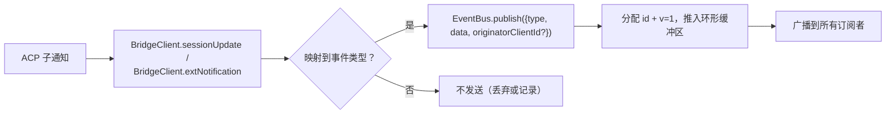
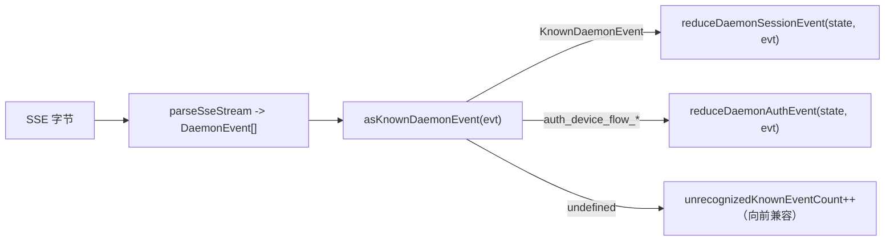

# 类型化守护进程事件模式 v1

## 概述

守护进程在 `GET /session/:id/events` 上发送的每个 SSE 帧都具有 `{ id, v, type, data, originatorClientId?, _meta? }` 的形状。`v: 1` 是当前的 `EVENT_SCHEMA_VERSION`。`type` 来自封闭的、版本固定的 `DAEMON_KNOWN_EVENT_TYPE_VALUES` 集合，定义在 `packages/sdk-typescript/src/daemon/events.ts` 中；当前集合包含 43 种已知事件类型。信封的 `_meta` 字段由 `server.ts` 中的 `formatSseFrame()` 在 SSE 写入边界处盖章；参见 [信封级元数据](#envelope-level-metadata)。

SDK 暴露了 `asKnownDaemonEvent(evt)`。对于已知事件类型，它返回一个有判别联合的 `KnownDaemonEvent`，对于其他类型返回 `undefined`。因此，SDK 消费者可以在不要求锁步 SDK 升级的情况下处理前向兼容性（当新守护进程添加事件类型时）；会话归约器将这些事件记录为 `unrecognizedKnownEventCount`。

线路格式定义在 [`../qwen-serve-protocol.md`](../qwen-serve-protocol.md)。此页面是每个事件的负载契约。

## 职责

- 提供事件词汇表 (`DAEMON_KNOWN_EVENT_TYPE_VALUES`) 的唯一真实来源。
- 为每个事件类型提供类型化信封 (`DaemonEventEnvelope<TType, TData>`)。
- 提供纯归约器 (`reduceDaemonSessionEvent`, `reduceDaemonAuthEvent`)，将事件流投影到 SDK 视图状态中。
- 作为信息信号广播 `typed_event_schema` 能力标签。如果该标签缺失，`asKnownDaemonEvent` 仍会回退到 `unknown`。

## 事件词汇表（43 种已知类型）

按领域分组。

### 核心会话

| 类型                       | 方向     | 触发                                                                       | 关键负载字段                                                               |
| -------------------------- | -------- | -------------------------------------------------------------------------- | -------------------------------------------------------------------------- |
| `session_update`           | S->C     | 任何 ACP `sessionUpdate` 通知：代理文本、思考、工具调用或计划                | `sessionUpdate: string, content?: ...` (不透明的 ACP 形状)                |
| `session_metadata_updated` | S->C     | `PATCH /session/:id/metadata`                                              | `sessionId, displayName?`                                                  |
| `session_died`             | S->C 终端 | `channel.exited`                                                           | `sessionId, reason, exitCode? \| null, signalCode? \| null`                |
| `session_closed`           | S->C 终端 | `DELETE /session/:id` 或程序化关闭                                           | `sessionId, reason: 'client_close' \| string, closedBy?`                  |
| `session_snapshot`         | S->C 合成 | SSE 附加/重放后的快照帧                                                     | `sessionId, currentModelId: string \| null, currentApprovalMode: string \| null` |

### 订阅者级合成帧

| 类型                    | 触发                                                                                                                                                                                                                              | 备注                                                                                                                                                                                                                                                                                                                          |
| ----------------------- | --------------------------------------------------------------------------------------------------------------------------------------------------------------------------------------------------------------------------------- | ----------------------------------------------------------------------------------------------------------------------------------------------------------------------------------------------------------------------------------------------------------------------------------------------------------------------------- |
| `client_evicted`        | 每个订阅者的 EventBus 队列溢出。**无 `id`**                                                                                                                                                                                   | `reason: string, droppedAfter?: number`；仅对当前订阅者来说为终端，而会话保持活跃。                                                                                                                                                                                                                                            |
| `slow_client_warning`   | 队列 >= 75%；强制推送且**无 `id`**                                                                                                                                                                                       | `queueSize, maxQueued, lastEventId`；当队列下降到 37.5% 以下后重新启用。                                                                                                                                                                                                                                               |
| `stream_error`          | `SubscriberLimitExceededError` 或其他路由流错误                                                                                                                                                                         | `error: string`；对订阅为终端。                                                                                                                                                                                                                                                                                                |
| `state_resync_required` | `subscribe({lastEventId})` 检测到守护进程环不再持有 `[lastEventId+1, earliestInRing-1]`，或客户端游标来自之前的总线纪元。在剩余重放帧**之前**强制推送，且**无 `id`**。 | `reason: 'ring_evicted' \| 'epoch_reset' \| string`, `lastDeliveredId: number`, `earliestAvailableId: number`。这是一个恢复信号，非终端：SSE 流保持打开，重放和实时帧继续。SDK 归约器设置 `awaitingResync = true` 并跳过增量，直到调用者使用 `loadSession` 重置。                                                         |
| `replay_complete`       | 无 ID 的哨兵，在 `Last-Event-ID` 重放循环完成后发出，适用于干净重放和环驱逐路径，即使 `data.replayedCount === 0` 也会发出。**无 `id`**                                                                                         | `replayedCount: number`；允许消费者无需超时即可确定性地移除追赶 UI。                                                                                                                                                                                                                                |

### 权限 (F3 + base)

| 类型                          | 方向     | 触发                                            | 关键负载字段                                                                                                                               |
| ----------------------------- | -------- | ----------------------------------------------- | ------------------------------------------------------------------------------------------------------------------------------------------ |
| `permission_request`          | S->C     | 代理调用 `requestPermission`                    | `requestId, sessionId, toolCall, options[]`；信封从提示发起者盖章 `originatorClientId`。                                                  |
| `permission_resolved`         | S->C     | Mediator 已决定                                  | `requestId, outcome` (ACP `PermissionOutcome`)                                                                                             |
| `permission_already_resolved` | S->C     | 投票到达时请求已经被决定                        | `requestId, sessionId, outcome`                                                                                                            |
| `permission_partial_vote`     | S->C     | `consensus` 策略记录了一个非最终投票            | `requestId, sessionId, votesReceived, votesNeeded (>= 1), quorum, optionTallies: Record<string, number>, originatorClientId?`              |
| `permission_forbidden`        | S->C     | 策略拒绝了一个投票                              | `requestId, sessionId, clientId?, reason: 'designated_mismatch' \| 'remote_not_allowed', originatorClientId?`；匿名投票者省略 `clientId`。 |

### 模型

| 类型                  | 方向     | 负载                                      |
| --------------------- | -------- | ----------------------------------------- |
| `model_switched`      | S->C     | `sessionId, modelId`                      |
| `model_switch_failed` | S->C     | `sessionId, requestedModelId, error: string` |

### MCP 护栏 (PR 14b + F2)

| 类型                         | 方向     | 负载                                                                                                                                                                                                                                                                                                                                                                                                                                           |
| ---------------------------- | -------- | ----------------------------------------------------------------------------------------------------------------------------------------------------------------------------------------------------------------------------------------------------------------------------------------------------------------------------------------------------------------------------------------------------------------------------------------------- |
| `mcp_budget_warning`         | S->C     | `liveCount, reservedCount, budget, thresholdRatio: 0.75, mode: 'warn' \| 'enforce', scope?: 'workspace' \| 'session'`                                                                                                                                                                                                                                                                                                                           |
| `mcp_child_refused_batch`    | S->C     | `refusedServers: [{ name, transport, reason: 'budget_exhausted' }], budget, liveCount, reservedCount, mode: 'enforce', scope?: 'workspace' \| 'session'`                                                                                                                                                                                                                                                                                        |
| `mcp_server_restarted`       | S->C     | `serverName, durationMs, entryIndex?` 用于 F2 多条目池重启                                                                                                                                                                                                                                                                                                                                                                          |
| `mcp_server_restart_refused` | S->C     | `serverName, reason: 'budget_would_exceed' \| 'in_flight' \| 'disabled' \| 'restart_failed', entryIndex?, details?`。第四个值 `restart_failed` 携带了池模式多条目重启的底层硬故障。`MCP_RESTART_REFUSED_REASONS` 拒绝未知原因；旧 SDK 归约器由于 `parseDaemonEvent` 返回 `undefined`，静默地丢弃增量添加的新原因值。在知道该新原因的 SDK 中才发布新原因。 |

### 变更控制 (Wave 4 PR 16+17)

| 类型                    | 方向     | 负载                                                                                              |
| ----------------------- | -------- | ------------------------------------------------------------------------------------------------- |
| `memory_changed`        | S->C     | `scope: 'workspace' \| 'global', filePath, mode: 'append' \| 'replace', bytesWritten`              |
| `agent_changed`         | S->C     | `change: 'created' \| 'updated' \| 'deleted', name, level: 'project' \| 'user'`                    |
| `approval_mode_changed` | S->C     | `sessionId, previous, next, persisted: boolean`                                                    |
| `tool_toggled`          | S->C     | `toolName, enabled`；影响下一个 ACP 子进程生成，不会改变已在运行的会话。                            |
| `settings_changed`      | S->C     | 工作区设置写入完成。负载是开放的；消费者应使用写后读取刷新。                                         |
| `settings_reloaded`     | S->C     | 守护进程工作区服务重新读取设置。负载是开放的。                                                     |
| `workspace_initialized` | S->C     | `path, action: 'created' \| 'overwrote' \| 'noop', originatorClientId?`                            |

### 认证设备流程 (PR 21)

这些事件是基于工作区键的，而非会话键。会话归约器将其视为空操作；`reduceDaemonAuthEvent` 将其投影到工作区级状态。

| 类型                          | 方向     | 负载                                               |
| ----------------------------- | -------- | -------------------------------------------------- |
| `auth_device_flow_started`    | S->C     | `deviceFlowId, providerId, expiresAt`              |
| `auth_device_flow_throttled`  | S->C     | `deviceFlowId, intervalMs`                         |
| `auth_device_flow_authorized` | S->C     | `deviceFlowId, providerId, expiresAt?, accountAlias?` |
| `auth_device_flow_failed`     | S->C     | `deviceFlowId, errorKind, hint?`                   |
| `auth_device_flow_cancelled`  | S->C     | `deviceFlowId`                                     |

### MCP 运行时变更

| 类型                 | 方向     | 触发                                                       | 关键负载字段                                                           |
| -------------------- | -------- | ---------------------------------------------------------- | ---------------------------------------------------------------------- |
| `mcp_server_added`   | S->C     | 通过 `POST /workspace/mcp/servers` 在运行时添加的服务端    | `name, transport, replaced, shadowedSettings, toolCount, originatorClientId` |
| `mcp_server_removed` | S->C     | 在运行时移除的服务端                                       | `name, wasShadowingSettings, originatorClientId`                       |

### 轮次生命周期 / 助手推送

| 类型                  | 方向     | 触发                                                                                                             | 关键负载字段                                                                                                                                                                               |
| --------------------- | -------- | ---------------------------------------------------------------------------------------------------------------- | ------------------------------------------------------------------------------------------------------------------------------------------------------------------------------------------ |
| `prompt_cancelled`    | S->C     | 提示通过显式 `cancelSession` 路由**或**发起者 SSE 断开连接被取消                                                  | 信封为取消客户端盖章 `originatorClientId`。这意味着“请求取消”，而非“确认取消”。对等订阅者得知提示已结束。                    |
| `turn_complete`       | S->C     | 轮次成功完成                                                                                                     | `sessionId, stopReason, promptId?`。`promptId` 链接到非阻塞提示响应 (`202`)。SDK 通过它将 SSE 事件与发起提示匹配。          |
| `turn_error`          | S->C     | 轮次失败                                                                                                         | `sessionId, message, code?, promptId?`；相同的 `promptId` 关联机制。                                                                                                                         |
| `session_rewound`     | S->C     | `POST /session/:id/rewind` 成功                                                                                  | `sessionId, promptId, targetTurnIndex, filesChanged[], filesFailed[], originatorClientId?`                                                                                               |
| `session_branched`    | S->C     | `POST /session/:id/branch` 从现有会话创建了一个分支                                                              | `sourceSessionId, newSessionId, displayName, originatorClientId?`                                                                                                                        |
| `followup_suggestion` | S->C     | ACP 子进程在 `end_turn` 后生成幻影文本跟进建议，通过每个会话的 SSE 转发                                            | `sessionId, suggestion, promptId`；线路只携带 `getFilterReason()===null` 的建议。客户端将其渲染为输入占位符幻影文本，并在下一次 `sendPrompt` 时使其失效。                               |
| `user_shell_command`  | S->C     | 用户通过 `POST /session/:id/shell` 启动了一个 shell 命令；扇出到同一会话的其他订阅者                              | `sessionId, command, shellId, originatorClientId?`。目前还没有类型化的 `DaemonXxxData` 接口；`asKnownDaemonEvent` 返回 `undefined`，UI 标准化器临时解析它。                            |
| `user_shell_result`   | S->C     | 上述 shell 命令的结果                                                                                            | `sessionId, shellId, exitCode, output, aborted`。与 `user_shell_command` 相同的临时解析注释。                                                                                               |

## 架构

| 关注点                                | 源文件                                         | 备注                                                                                                              |
| -------------------------------------- | ---------------------------------------------- | ----------------------------------------------------------------------------------------------------------------- |
| `EVENT_SCHEMA_VERSION = 1`             | `packages/acp-bridge/src/eventBus.ts`          | 在每帧上发送。                                                                                               |
| `DAEMON_KNOWN_EVENT_TYPE_VALUES`       | `packages/sdk-typescript/src/daemon/events.ts` | 包含 43 种类型的封闭列表。                                                                                         |
| `DaemonEventEnvelope<TType, TData>`    | `events.ts`                                    | 泛型信封。                                                                                                  |
| `DaemonKnownEventType`                 | `events.ts`                                    | `typeof DAEMON_KNOWN_EVENT_TYPE_VALUES[number]`.                                                                   |
| 每种事件的负载类型                | `events.ts`                                    | 大多数事件类型都有 `DaemonXxxData` 接口；`user_shell_*` 目前由 UI 标准化器临时解析。 |
| `asKnownDaemonEvent(evt)`              | `events.ts`                                    | 返回 `KnownDaemonEvent \| undefined`。                                                                           |
| `reduceDaemonSessionEvent(state, evt)` | `events.ts`                                    | 投影到 `DaemonSessionViewState`。                                                                            |
| `reduceDaemonAuthEvent(state, evt)`    | `events.ts`                                    | 投影到 `DaemonAuthState`。                                                                                   |
| `isWorkspaceScopedBudgetEvent(evt)`    | `events.ts`                                    | 检测 F2 `scope: 'workspace'`。                                                                                   |
### `DaemonSessionViewState`

`reduceDaemonSessionEvent` 填充此视图状态。CLI TUI 适配器、`DaemonChannelBridge` 和 VS Code IDE 消费它。关键字段：

- `alive: boolean` - 在终端帧（`session_died`、`session_closed`、`client_evicted`、`stream_error`）之后变为 `false`。
- `currentModelId?: string` - 来自 `model_switched`。
- `displayName?: string` - 来自 `session_metadata_updated`。
- `pendingPermissions: Record<string, DaemonPermissionRequestData>` - 按 `requestId` 键控的未决请求；由 `permission_resolved` / `permission_already_resolved` 清除。
- `lastSessionUpdate?: DaemonSessionUpdateData` - 最新的 `session_update`。
- `lastModelSwitchFailure?: DaemonModelSwitchFailedData` - 来自 `model_switch_failed`。
- `terminalEvent?` - 原始终端事件。
- `streamError?: DaemonStreamErrorData` - 最新的 `stream_error` 载荷。
- `unrecognizedKnownEventCount`、`lastUnrecognizedKnownEvent?` - 被 `asKnownDaemonEvent` 识别但 reducer 尚未为其分配专用状态的事件。
- `droppedPermissionRequestCount`、`lastDroppedPermissionRequestId?` - 格式错误的权限请求无法进入待处理映射。
- `unmatchedPermissionResolutionCount`、`lastUnmatchedPermissionResolutionId?` - 权限处理结果没有匹配的未决请求。
- `slowClientWarningCount`、`lastSlowClientWarning?` - 来自 `slow_client_warning`。
- `mcpBudgetWarningCount`、`lastMcpBudgetWarning?` - 来自 `mcp_budget_warning`。
- `mcpChildRefusedBatchCount`、`lastMcpChildRefusedBatch?` - 来自 `mcp_child_refused_batch`。
- `lastWorkspaceMutation?`、`lastWorkspaceMutationType?` - 来自 `memory_changed` / `agent_changed`。
- `approvalMode?`、`approvalModeChangedCount`、`lastApprovalModeChange?` - 来自 `approval_mode_changed`。
- `toolToggleCount`、`lastToolToggle?` - 来自 `tool_toggled`。
- `workspaceInitCount`、`lastWorkspaceInit?` - 来自 `workspace_initialized`。
- `mcpRestartCount`、`lastMcpRestart?` - 来自 `mcp_server_restarted`。
- `mcpRestartRefusedCount`、`lastMcpRestartRefused?` - 来自 `mcp_server_restart_refused`。
- `settings_changed` / `settings_reloaded` - 被 `asKnownDaemonEvent` 识别；会话 reducer 不维护专用的视图状态字段，UI 通常将它们视为刷新信号。
- `permissionVoteProgress: Record<string, DaemonPermissionPartialVoteData>` - 共识投票进度。
- `forbiddenVotes: DaemonPermissionForbiddenData[]`、`forbiddenVoteCount` - 策略拒绝的投票记录，最多 32 条。
- `awaitingResync: boolean` - 由 `state_resync_required` 设置；当消费者重置视图状态时清除。
- `resyncRequiredCount`、`lastResyncRequired?` - 重新同步的可观测性。
- `lastFollowupSuggestion?: DaemonFollowupSuggestionData` - 守护进程推送的最新后续建议。
- `lastTurnComplete?: DaemonTurnCompleteData` - 最新成功的轮次完成。
- `lastTurnError?: DaemonTurnErrorData` - 最新的轮次错误。
- `rewindCount`、`lastRewind?`、`lastBranch?` - 最新的回退/分支事件。

### `DaemonAuthState`

每个 `providerId` 一个条目，由 `auth_device_flow_*` 驱动。每个流暴露 `{ deviceFlowId, status, providerId, expiresAt?, lastThrottleIntervalMs?, lastError? }`。

## 流程

### 生产者端



### 消费者端（SDK）



## 信封级元数据

除了每个事件的 `data` 载荷外，守护进程还打上两个信封级字段。

### `_meta.serverTimestamp` - 守护进程时钟

`packages/cli/src/serve/server.ts` 中的 `formatSseFrame()` 在 SSE 写入边界上打上此时间戳，**而不是**在 `EventBus.publish` 内部。内存中的 `BridgeEvent` 类型保持不变；守护进程内部消费者看不到 `_meta`，而线上的 SSE 帧可以看到。

```jsonc
{
  "id": 47,
  "v": 1,
  "type": "session_update",
  "data": { ... },
  "_meta": { "serverTimestamp": 1716287345123 }
}
```

合并操作会保留任何现有的 `_meta` 键
（`{...existingMeta, serverTimestamp: Date.now()}`）。**当前没有守护进程生产者写入信封级 `_meta`**。顶层合并是一个向前兼容的逃生出口。

为什么重要：多客户端 UI 若需渲染相对时间或排序记录块，应使用服务器时间而非每个浏览器/标签/手机本地时钟。服务器时间戳确保客户端间的顺序一致。

SDK 访问：优先使用 `event._meta?.serverTimestamp`。兼容性路径也可以探测 `event.serverTimestamp` 或 `event.data._meta.serverTimestamp`。不要混淆 ACP 载荷 `data._meta` 与守护进程信封 `_meta`。

### `originatorClientId`

由携带已注册 `X-Qwen-Client-Id` 的请求触发的事件可能会打上此字段。参见 [`08-session-lifecycle.md`](./08-session-lifecycle.md)。

## 工具调用 `_meta`（来源 / serverId）

这与信封 `_meta` 是分开的：ACP `session/update` 载荷可以在 `event.data._meta` 中携带自己的 `_meta`。`ToolCallEmitter`（`packages/cli/src/acp-integration/session/emitters/ToolCallEmitter.ts`）在 `emitStart`、`emitResult` 和 `emitError` 上打上两个字段：

| 字段        | 类型                                      | 解析规则                                                                                                                                                                    |
| ------------ | ----------------------------------------- | -------------------------------------------------------------------------------------------------------------------------------------------------------------------------- |
| `provenance` | `'builtin' \| 'mcp' \| 'subagent'`        | `ToolCallEmitter.resolveToolProvenance`：`subagentMeta` 存在则取 `subagent`；工具名称匹配 `mcp__<server>__<tool>` 映射为 `mcp`；其余映射为 `builtin`。 |
| `serverId`   | 仅当 `provenance === 'mcp'` 时为 `string` | 从 `mcp__<serverId>__<tool>` 启发式提取。                                                                                                                    |

原有的 `_meta.toolName` 显示名称保持不变。UI 使用这些字段来渲染内置/MCP 服务器/子代理徽章，而无需重新解析工具名称。

## SDK reducer 行为

`reduceDaemonSessionEvent(state, evt)` 在 `packages/sdk-typescript/src/daemon/events.ts` 中将流投影为 `DaemonSessionViewState`。与重新同步相关的字段包括：

- **`awaitingResync: boolean`** - 由 `state_resync_required` 设置；调用方清除它，通常在 `POST /session/:id/load` 重置视图状态后。
- **`resyncRequiredCount: number`** - 可观测性计数器。
- **`lastResyncRequired?: DaemonStateResyncRequiredData`** - 最新的载荷。

当 `awaitingResync = true` 时，reducer **跳过增量应用**，仅允许闭合的 `RESYNC_PASSTHROUGH_TYPES` 集合：

| 透传类型                  | 为何在重新同步期间仍应用                                                          |
| ----------------------- | ------------------------------------------------------------------------------ |
| `state_resync_required` | 罕见的第二次重新同步应更新 `lastResyncRequired` / `resyncRequiredCount`。 |
| `session_died`          | 终端的流信号在重新同步期间必须保持可见。                      |
| `session_closed`        | 同上。                                                                 |
| `client_evicted`        | 同上。                                                                 |
| `stream_error`          | 同上。                                                                 |
| `session_snapshot`      | 全状态的权威帧；在重新同步期间安全应用。                   |

在重新同步期间，`lastEventId` 仍通过 `advanceLastEventId(base)` 单调递增。在调用方重置并清除 `awaitingResync` 后，后续的增量将对齐到正确的游标。

`reduceDaemonAuthEvent` 将设备流事件投影到工作区级认证状态条目中，其概念形态为 `{deviceFlowId, status, providerId, expiresAt?, lastThrottleIntervalMs?, lastError?}`。在代码中，reducer 将 `status`、`errorKind`、`hint`、`intervalMs`、`lastSeenEventId`、`authorizedExpiresAt` 和 `accountAlias` 存储在 `DaemonDeviceFlowReducerState` 上；守护进程事件载荷本身仍然保持上述的每个事件形状。

## 状态与向前兼容

- 通过在 `DAEMON_KNOWN_EVENT_TYPE_VALUES` 末尾追加来添加已知事件类型。旧的 SDK 通过回退路径为无法识别的事件类型返回 `undefined` 并递增 `unrecognizedKnownEventCount`；新的 SDK 依赖判别联合。
- 向现有载荷添加可选字段是安全的，因为载荷是开放的（`{ [key: string]: unknown }`）。
- 更改现有载荷的**形状**是破坏性变更，必须提升 `EVENT_SCHEMA_VERSION` 并通告兼容的能力标签，例如 `caps.features.typed_event_schema_v2`。
- `id` 是按会话单调递增的。订阅者级别的合成帧（`client_evicted`、`slow_client_warning`、`stream_error`、`state_resync_required`、`replay_complete`、`session_snapshot`）有意不携带 id，其他订阅者因此不会看到缺口。
- `originatorClientId` 位于信封上而非 `data` 中。F3 部分投票/禁止载荷也通过 `mergeOriginator` 将其合并到 `data` 中，以便视图状态消费者无需保留信封。

## 依赖关系

- [`10-event-bus.md`](./10-event-bus.md) - 交付通道。
- [`11-capabilities-versioning.md`](./11-capabilities-versioning.md) - SDK 如何预检 `typed_event_schema`、`mcp_guardrail_events` 和 `permission_mediation`。
- [`04-permission-mediation.md`](./04-permission-mediation.md) - 权限事件如何产生。
- [`13-sdk-daemon-client.md`](./13-sdk-daemon-client.md) - `asKnownDaemonEvent`、reducer 和视图状态形状。

## 配置

- 始终通告：`typed_event_schema`、`mcp_guardrail_events` 和 `permission_mediation`（支持策略模式）。
- 没有环境变量或标志直接控制模式本身。`QWEN_SERVE_NO_MCP_POOL=1` 将 MCP 事件的 `scope` 从 `'workspace'` 改为不存在或 `'session'`。

## 注意事项与已知限制

- 六种合成帧类型有意没有 `id`；SDK 代码不得假设每个事件都有 id。
- `permission_partial_vote` 仅在 `consensus` 下出现。`permission_forbidden` 在 `designated`、`consensus` 和 `local-only` 下出现，但不在 `first-responder` 下。
- `mcp_child_refused_batch` 仅在 `mode: 'enforce'` 下出现；`warn` 模式从不拒绝。
- `auth_device_flow_*` 事件不是按会话键控的。通过 `DaemonSessionClient` 消费时，应对它们使用 `reduceDaemonAuthEvent` 而非会话 reducer。

## 参考

- `packages/sdk-typescript/src/daemon/events.ts`
- `packages/acp-bridge/src/eventBus.ts` (`EVENT_SCHEMA_VERSION`)
- `packages/cli/src/serve/capabilities.ts` (`typed_event_schema`、`mcp_guardrail_events`、`permission_mediation`)
- 协议参考：[`../qwen-serve-protocol.md`](../qwen-serve-protocol.md)