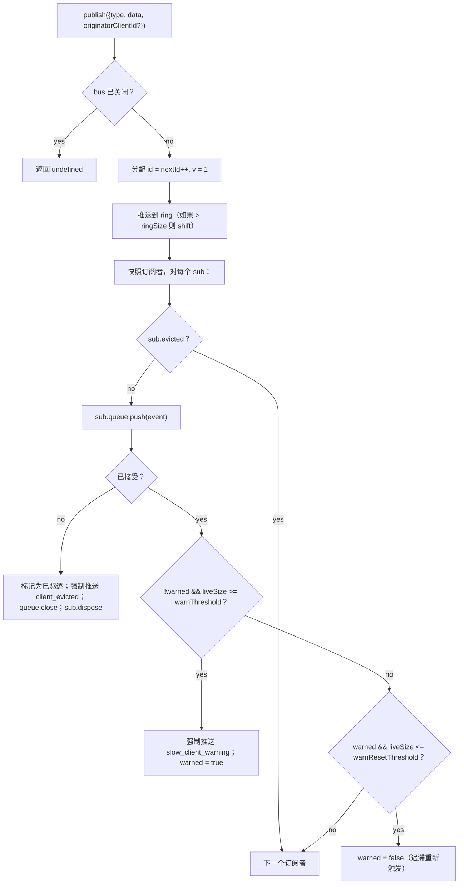

# SSE Event Bus 与背压

## 概述

`EventBus` (`packages/acp-bridge/src/eventBus.ts`) 是每个会话的内存发布/订阅系统，为 daemon 的 `GET /session/:id/events` SSE 路由提供数据。它为每个事件分配一个单调递增的 id，在有界环形缓冲区中缓冲最近的事件以支持 `Last-Event-ID` 重放，将发布的事件扇出给所有订阅者，应用每个订阅者的背压（队列填充达到 75% 时发出警告，达到上限时进行驱逐），并发出两个合成的终止帧（`client_evicted`、`slow_client_warning`），SDK 将它们视为一等事件，但 bus 标记它们**不带 `id`**，因此它们不会消耗每个会话序列中的槽位。

`EventBus` 目前是 `acp-bridge` 的包私有模块，由 bridge 工厂通过每个会话的一个闭包实例消费。未来的重构（在 `eventBus.ts` 的第 150-159 行有提及）将把它提升为顶级构建块，以便 channels、双输出和未来的 WebSocket 传输可以通过同一个 bus 订阅，而不是运行并行的流。

## 职责

- 分配从 1 开始的每个会话单调递增的事件 id。
- 缓冲最后 `ringSize` 个事件，用于带 `lastEventId` 的订阅重放。
- 将发布的事件扇出给最多 `maxSubscribers` 个并发订阅者。
- 应用每个订阅者的有界队列；使用合成的 `client_evicted` 终止帧丢弃溢出的订阅者。
- 在每次溢出事件中，当队列填充达到 75% 时发出一次 `slow_client_warning`，并具有 37.5% 的迟滞以防止重复警告。
- 在 `AbortSignal.abort()` 时迅速拆除订阅。
- 在 bus 关闭时（例如会话拆除）干净地关闭每个订阅者。
- `publish` 永远不会抛出异常（契约是“调用 publish 总是安全的”）。

## 架构

| 常量                                   | 值          | 用途                                                                                               |
| -------------------------------------- | ----------- | -------------------------------------------------------------------------------------------------- |
| `EVENT_SCHEMA_VERSION`                 | `1`         | 标记在每个 `BridgeEvent.v` 上；在发生破坏性帧更改时递增。                                          |
| `DEFAULT_RING_SIZE`                    | `8000`      | 每个会话的重放环。操作员可通过 `--event-ring-size` 覆盖。                                          |
| `DEFAULT_MAX_QUEUED`                   | `256`       | 每个订阅者的积压上限。                                                                             |
| `DEFAULT_MAX_SUBSCRIBERS`              | `64`        | 每个会话的订阅者上限。                                                                             |
| `WARN_THRESHOLD_RATIO`                 | `0.75`      | `slow_client_warning` 触发阈值，占 `maxQueued` 的比例。                                            |
| `WARN_RESET_RATIO`                     | `0.375`     | 迟滞重新触发比例。                                                                                 |
| `MAX_EVENT_RING_SIZE` (in `bridge.ts`) | `1_000_000` | `BridgeOptions.eventRingSize` 的软上限，用于捕获因拼写错误导致的内存溢出故障。                     |

### `BridgeEvent`

```ts
interface BridgeEvent {
  id?: number; // 每个会话单调递增；合成终止帧上不存在
  v: 1; // EVENT_SCHEMA_VERSION
  type: string; // 47 种已知类型之一或未来可扩展
  data: unknown; // 负载（由 SDK 按类型定义；参见 09-event-schema.md）
  _meta?: { serverTimestamp?: number; [key: string]: unknown }; // 由 EventBus.publish 标记
  originatorClientId?: string; // 当事件派生自带有 clientId 标记的请求时设置
}
```

### `SubscribeOptions`

```ts
interface SubscribeOptions {
  lastEventId?: number; // 从此 id 之后重放（Last-Event-ID 恢复）
  signal?: AbortSignal; // 迅速中止订阅
  maxQueued?: number; // 每个订阅者的积压上限；默认 256
}
```

`subscribe()` 返回一个 `AsyncIterable<BridgeEvent>`。SSE 路由使用 `for await` 消费它。注册是**同步的**——在 `subscribe()` 返回时，订阅者已经附加，因此与消费者的第一个 `next()` 竞争的 `publish()` 仍然会被传递。

### `BoundedAsyncQueue`

每个订阅者的队列。两个关键行为：

- **实时上限仅针对实时项。** 通过 `forcePush()` 插入的项在每个条目上带有 `forced: true` 标记，且永远不计入 `maxSize`。这使得 `Last-Event-ID` 重放路径可以将数百个历史帧强制推送到新订阅者中，而不会立即触发实时上限并驱逐刚刚恢复的订阅者。
- **`liveCount` 作为字段维护**，而不是从 `forcedInBuf` 位置派生。当 `slow_client_warning` 开始在流中间强制推送时（警告进入队列的**末尾**，而不是像重放那样进入开头），早期基于位置的启发式方法失效了。每个条目的 `forced` 标记与位置无关。

当实时积压达到上限时，`push(value)` 返回 `false`（而不是阻塞或抛出异常）——bus 使用该信号驱逐订阅者。`forcePush(value)` 绕过上限。`close({drain?: boolean})` 默认排空待处理项；中止路径传递 `drain: false` 以立即丢弃它们。

## 工作流

### 发布



`publish` 永远不会抛出异常。在 publish 期间关闭 bus（关闭路径在等待 `channel.kill()` 之前关闭每个会话的 bus）会返回 `undefined` 而不是抛出异常，因为 agent 可能在 bus 关闭和 channel kill 之间的小窗口内继续发出 `sessionUpdate` 通知。

### 订阅 + 重放（带 ring 驱逐检测）

```mermaid
sequenceDiagram
    autonumber
    participant SR as SSE 路由
    participant EB as EventBus
    participant Q as BoundedAsyncQueue

    SR->>EB: subscribe({lastEventId: 42, maxQueued: 256, signal})
    EB->>EB: 如果 subs.size >= maxSubscribers 则拒绝<br/>（抛出 SubscriberLimitExceededError）
    EB->>Q: new BoundedAsyncQueue(256)
    EB->>EB: subs.add(sub)
    EB->>EB: epochReset = lastEventId >= nextId
    alt epochReset（旧 bus 纪元）
        EB->>Q: forcePush state_resync_required<br/>{ reason: 'epoch_reset', lastDeliveredId: 42, earliestAvailableId: ring[0]?.id ?? nextId }
        Note over EB,Q: 无 id 的合成帧，帧在重放之前。<br/>重放扫描整个当前 ring。
    else 相同 bus 纪元
        EB->>EB: earliestInRing = ring[0]?.id
        opt earliestInRing > lastEventId + 1（间隙被驱逐）
            EB->>Q: forcePush state_resync_required<br/>{ reason: 'ring_evicted', lastDeliveredId: 42, earliestAvailableId: earliestInRing }
            Note over EB,Q: 无 id 的合成帧，帧在重放之前。<br/>流保持打开；SDK reducer 翻转 awaitingResync。
        end
    end
    loop ring 扫描
        EB->>EB: for e in ring where e.id > (epochReset ? 0 : 42)
        EB->>Q: forcePush(e)
    end
    EB->>EB: 附加 AbortSignal 监听器<br/>（onAbort → queue.close({drain:false}); dispose）
    EB-->>SR: AsyncIterable
    SR->>Q: 在 for-await 循环中 next()
```

如果在订阅时 `subs.size >= maxSubscribers`，则抛出 `SubscriberLimitExceededError`——SSE 路由捕获它并将 `stream_error` 合成帧序列化到被拒绝的客户端，这样他们就不会看到静默的空流。返回空可迭代对象会让操作员在负载下无法了解“某些客户端收到事件，某些没有”的情况。

### Ring 驱逐 → `state_resync_required`（恢复流程）

当消费者使用 `Last-Event-ID: N` 重新连接，且 ring 中最早幸存的事件 `id > N + 1` 时，`[N+1, earliestInRing-1]` 中的事件在消费者重新连接之前被驱逐了。天真的重放会静默地以非连续的后缀成功，SDK reducer 会像流是连续的一样继续应用增量，其状态将与 daemon 的真实状态分歧——且没有终止信号。

在 `EventBus.subscribe()` 中实现：

1. 首先检查 `opts.lastEventId >= this.nextId`。如果为 true，则客户端游标来自旧的 bus 纪元（daemon 重启 / EventBus 重建），因此 bus 发出 `reason: 'epoch_reset'` 并重放整个当前 ring。
2. 否则计算 `earliestInRing = this.ring[0]?.id`。
3. 如果 `earliestInRing > opts.lastEventId + 1`，在重放帧**之前**强制推送一个合成帧：
   ```jsonc
   {
     "v": 1,
     "type": "state_resync_required",
     "data": {
       "reason": "ring_evicted",
       "lastDeliveredId": <opts.lastEventId>,
       "earliestAvailableId": <earliestInRing>
     }
   }
   ```
4. 之后继续正常的重放循环。

关键契约（以及 #4360 review 修正的内容）：

- **无 `id`**——与 `client_evicted` 相同的无槽位模式，因此它不会占用其他订阅者观察到的每个会话单调序列中的槽位。
- **流保持打开**——与 `client_evicted`（真正的终止）不同，`state_resync_required` 是面向恢复的。重放 + 实时帧在之后继续流动。
- **Reducer 自动跳过增量**——SDK 端翻转 `awaitingResync = true` 并仅应用 `state_resync_required`、终止帧和全状态快照，直到消费者代码调用 `loadSession` 并清除该标志。参见 [`09-event-schema.md`](./09-event-schema.md) 了解 `RESYNC_PASSTHROUGH_TYPES`。
- **对网络友好**——帧保留在线上，以便 SDK 稍后可以在需要时计算“你错过了什么”的差异。不需要额外的重新连接周期。

### 驱逐终止流程

当订阅者的实时积压达到 `maxQueued` 且下一次 `push()` 返回 `false` 时：

1. 标记 `sub.evicted = true`。
2. 构造**不带 `id`** 的 `client_evicted` 帧——`{ v: 1, type: 'client_evicted', data: { reason: 'queue_overflow', droppedAfter: <last delivered id> } }`。
3. `queue.forcePush(evictionFrame)` 以便消费者迭代器看到一个终止帧。
4. `queue.close()` 以便迭代在终止帧后展开。
5. 调用 `sub.dispose()`——从 `subs` 中移除并分离 `AbortSignal` 监听器；如果没有此清理，停滞的消费者的闭包将保持活动状态，直到 `AbortSignal` 被垃圾回收。

### 中止流程

`AbortSignal.abort()` → `onAbort()`：

1. `queue.close({drain: false})`——丢弃缓冲项，以便 SSE 路由不会继续将事件序列化到无人监听的 socket。
2. `dispose()`——通过 `disposed` 标志实现幂等。

在订阅时已经中止的信号会在返回迭代器之前同步调用 `onAbort()`。

## 状态与生命周期

- `nextId` 从 1 开始且仅递增。`lastEventId` getter 返回 `nextId - 1`。
- `ring` 是有界的；一旦满了，通过 shift 驱逐的时间复杂度为 O(n)。在 `ringSize=8000` 时，在高容量会话中测量为几毫秒——远低于每帧延迟预算。循环缓冲区重构被推迟，直到性能分析标记它或操作员将 `--event-ring-size` 增加一个数量级。
- `close()` 翻转 `closed`，关闭每个订阅者的队列，并清空 `subs`。后续的 `publish()` / `subscribe()` 是空操作（`publish` 返回 undefined；`subscribe` 返回 `emptyAsyncIterable`）。
- 每个会话拥有一个 `EventBus`。Bus 关闭发生在 `channel.kill()` 之前，因此在关闭期间进行中的 publish 会返回 undefined 而不是抛出异常。

## 依赖

- 由 `packages/acp-bridge/src/bridge.ts` 消费（`BridgeClient.sessionUpdate` / `BridgeClient.extNotification` → `events.publish(...)`）。
- 由 `packages/cli/src/serve/routes/sse-events.ts` 消费（SSE 路由处理器 → `events.subscribe(...)` 然后将 `BridgeEvent` 格式化为 SSE 线上帧）。
- CLI 消费者直接从 `@qwen-code/acp-bridge/eventBus` 导入 event bus。
- SDK 消费者：`packages/sdk-typescript/src/daemon/sse.ts`（`parseSseStream`），然后是 `asKnownDaemonEvent`（参见 [`09-event-schema.md`](./09-event-schema.md)、[`13-sdk-daemon-client.md`](./13-sdk-daemon-client.md)）。

## 配置

- `--event-ring-size <n>`——每个会话的 ring 深度；软上限为 `MAX_EVENT_RING_SIZE = 1_000_000`。
- 订阅者 `GET /session/:id/events` 上的 `?maxQueued=N` 查询参数，范围 `[16, 2048]`。SDK 客户端在启用前会预检 `caps.features.slow_client_warning`。
- `BridgeOptions.eventRingSize`（覆盖嵌入式使用的 daemon 默认值）。
- 能力标签：`session_events`、`slow_client_warning`、`typed_event_schema`。

## 客户端集成：`Last-Event-ID` 重新连接

### 线上格式

`GET /session/:id/events` 发出的每个带有 id 的 SSE 帧都包含一个 `id:` 行：

```
id: 42
event: session_update
data: {"id":42,"v":1,"type":"session_update","data":{...},"_meta":{"serverTimestamp":1719000000000}}

```

合成/终止帧（`state_resync_required`、`replay_complete`、`client_evicted`、`slow_client_warning`、`stream_error`）发出时**不带** `id:` 行——它们不会推进每个会话的单调序列。

### 重新连接协议

当客户端在断开连接后重新连接时，它将最后成功接收的事件 id 作为 `Last-Event-ID` HTTP 头发送：

```
GET /session/:id/events HTTP/1.1
Last-Event-ID: 42
Accept: text/event-stream
```

daemon 的 `EventBus` 重放 ring 缓冲区中所有 `id > Last-Event-ID` 的事件，然后过渡到实时传递。`replay_complete` 合成帧标记重放和实时之间的边界：

```jsonc
// 无 id: 行——合成帧
{
  "v": 1,
  "type": "replay_complete",
  "data": { "replayedCount": 7, "lastReplayedEventId": 49 },
}
```

### 重放行为

| 场景                                       | 行为                                                                                                                                                          |
| ------------------------------------------ | ------------------------------------------------------------------------------------------------------------------------------------------------------------- |
| `Last-Event-ID` 缺失                       | 仅实时流；无重放。与恢复前的客户端向后兼容。                                                                                                                  |
| `Last-Event-ID: 0`                         | 从头开始重放整个 ring 缓冲区（受 `--event-ring-size` 限制，默认 8000）。                                                                                      |
| `Last-Event-ID: N` 且 `ring[0].id <= N+1`  | 连续重放 `id > N` 的事件，然后实时传递。                                                                                                                      |
| `Last-Event-ID: N` 且 `ring[0].id > N+1`   | 检测到间隙——在重放幸存后缀之前发出 `state_resync_required`（`reason: 'ring_evicted'`）。SDK 必须调用 `loadSession` 以恢复完整状态。                           |
| `Last-Event-ID: N` 且 `N >= nextId`        | 纪元重置（daemon 重启）——发出 `state_resync_required`（`reason: 'epoch_reset'`），然后完整 ring 重放。                                                        |

### 验证规则

daemon 严格解析 `Last-Event-ID`：

- 仅接受纯十进制数字字符串（例如 `"42"`）。
- 非数字、负数、小数或溢出值（超过 `Number.MAX_SAFE_INTEGER`）会被静默拒绝——流以仅实时模式启动，daemon 会记录一条 breadcrumb。
- `retry: 3000` 指令告诉符合规范的 `EventSource` 实现在重新连接前等待 3 秒。

### 向后兼容性

`Last-Event-ID` 机制是完全可选的：

- 从不发送该头的客户端会收到与恢复前行为相同的仅实时流。
- 不跟踪事件 id 的旧版 SDK 继续工作。
- `replay_complete` 帧是合成的（无 `id:`），因此不会混淆不感知 id 的消费者。

### 浏览器 `EventSource` 限制

原生浏览器 `EventSource` API 自动跟踪最后一个 `id:` 字段并在重新连接时发送它。但是，它**不能**设置自定义头（例如 `Authorization: Bearer`）。需要身份验证的客户端必须使用原始 `fetch()` + 手动 SSE 解析（如 TypeScript SDK 通过 `parseSseStream` 所做的那样），而不是 `EventSource`。SDK 的 `RestSseTransport` 演示了这种模式——它在 `fetch()` 调用中将 `Last-Event-ID` 设置为显式 HTTP 头。

## 注意事项与已知限制

- **合成帧没有 `id`。** 使用 `Last-Event-ID` 恢复的 SDK 消费者仅记录带有 id 的帧；`slow_client_warning`、`client_evicted`、`state_resync_required` 和 `replay_complete` 不会推进游标，也不会消耗每个会话的序列号。如果两个带有 id 的实时帧之间存在真实间隙，请通过 ring 驱逐 / 纪元重置重同步路径处理它，而不是将其视为私有合成帧。
- `client_evicted` 是**每个订阅者**的，而不是每个会话的。同一个客户端可以重新连接。
- `BoundedAsyncQueue` 迭代器**对并发驱动不安全**——两个同时的 `.next()` 调用会竞争同一个事件。Daemon 的使用是顺序的（SSE 路由处理器中的 `for await ... of`），因此在生产中是安全的。
- bus 目前是包私有的；channels 和 web UI 必须通过 daemon 的 HTTP SSE 路由订阅，而不是直接访问 bus。阶段 1.5 将解除此限制。

## 参考

- `packages/acp-bridge/src/eventBus.ts`（整个文件）
- `packages/acp-bridge/src/bridge.ts`（发布站点，特别是 `BridgeClient.sessionUpdate` 和 F3 权限事件）
- `packages/cli/src/serve/routes/sse-events.ts`（SSE 路由处理器——将 `BridgeEvent` 格式化为线上 SSE）
- `packages/sdk-typescript/src/daemon/sse.ts`（客户端的 SSE 线上解析器）
- 线上参考：[`../qwen-serve-protocol.md`](../qwen-serve-protocol.md)（`Last-Event-ID` 重新连接契约）。