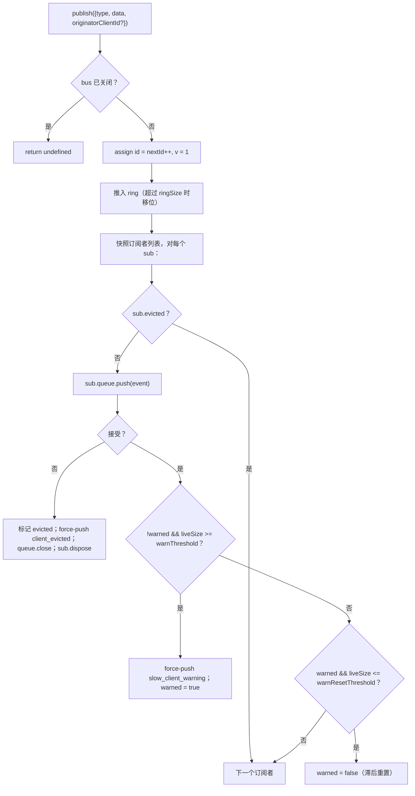
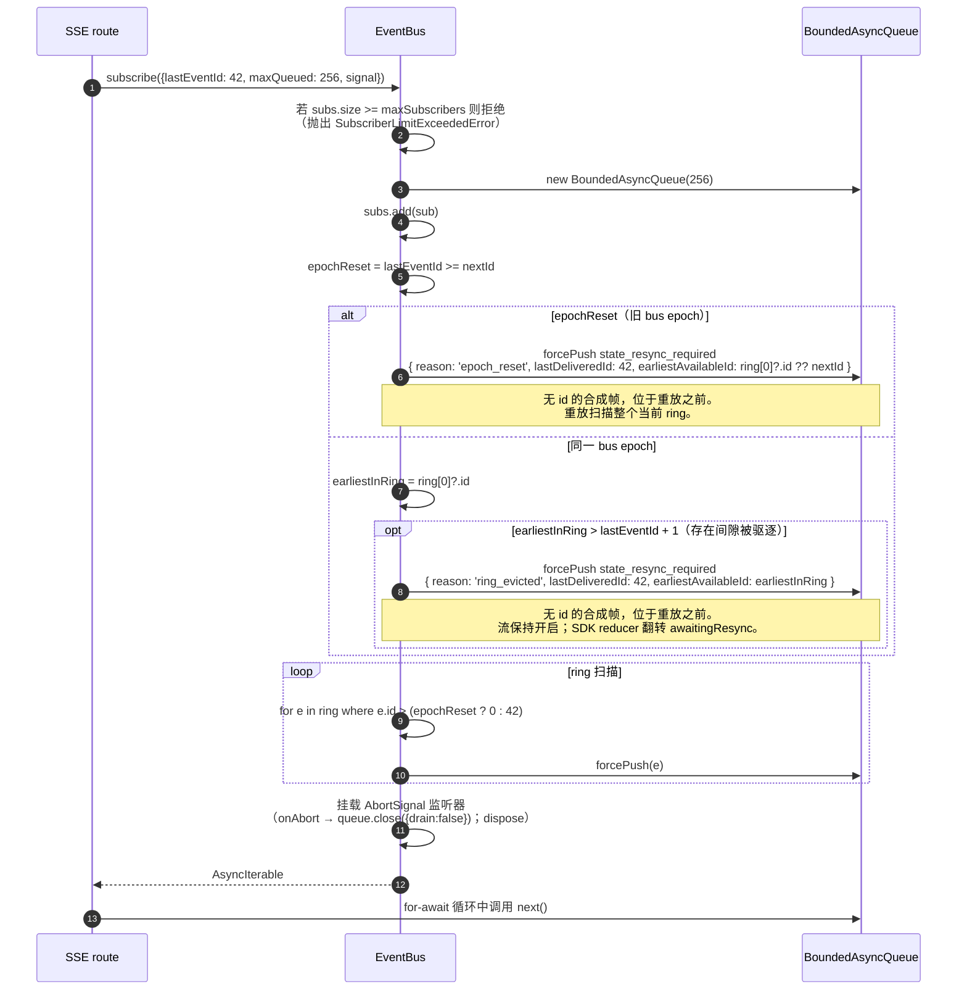

# SSE Event Bus 与背压机制

## 概述

`EventBus`（`packages/acp-bridge/src/eventBus.ts`）是每个会话的内存 pub/sub，为 daemon 的 `GET /session/:id/events` SSE 路由提供数据。它为每个事件分配单调递增的 id，在有界环形缓冲区中缓存最近的事件以支持 `Last-Event-ID` 重放，将发布的事件扇出到所有订阅者，对每个订阅者应用背压（队列填充至 75% 时警告，达到上限时驱逐），并发出两个合成终止帧（`client_evicted`、`slow_client_warning`）——SDK 将其视为一类事件，但 bus 会将其标记为**不带 `id`**，因此不占用每会话序列中的槽位。

`EventBus` 目前对 `acp-bridge` 包私有，由 bridge factory 通过每个会话一个闭包实例来使用。未来的重构（在 `eventBus.ts` 第 150–159 行有说明）将把它提升为顶层构建块，使 channel、双输出及未来的 WebSocket 传输都能通过同一个 bus 订阅，而不是运行并行流。

## 职责

- 从 1 开始为每个会话分配单调递增的事件 id。
- 缓存最近 `ringSize` 个事件，供带 `lastEventId` 的订阅时重放。
- 将发布的事件扇出到最多 `maxSubscribers` 个并发订阅者。
- 对每个订阅者应用有界队列；用合成的 `client_evicted` 终止帧驱逐溢出的订阅者。
- 在队列填充至 75% 时每次溢出触发一次 `slow_client_warning`，并以 37.5% 的滞后防止重复警告。
- 在 `AbortSignal.abort()` 时及时拆除订阅。
- bus 关闭时（如会话销毁）干净地关闭所有订阅者。
- `publish` 中从不抛出异常（契约是"publish 调用始终安全"）。

## 架构

| 常量                                   | 值          | 用途                                                                                               |
| -------------------------------------- | ----------- | -------------------------------------------------------------------------------------------------- |
| `EVENT_SCHEMA_VERSION`                 | `1`         | 打在每个 `BridgeEvent.v` 上；帧格式出现破坏性变更时递增。                                         |
| `DEFAULT_RING_SIZE`                    | `8000`      | 每会话重放环。可通过 `--event-ring-size` 由运维人员覆盖。                                          |
| `DEFAULT_MAX_QUEUED`                   | `256`       | 每个订阅者的积压上限。                                                                             |
| `DEFAULT_MAX_SUBSCRIBERS`              | `64`        | 每个会话的订阅者上限。                                                                             |
| `WARN_THRESHOLD_RATIO`                 | `0.75`      | `slow_client_warning` 触发的 `maxQueued` 比例。                                                    |
| `WARN_RESET_RATIO`                     | `0.375`     | 滞后重置比例。                                                                                     |
| `MAX_EVENT_RING_SIZE`（在 `bridge.ts`）| `1_000_000` | `BridgeOptions.eventRingSize` 的软上限，用于捕获由于拼写错误导致的内存耗尽问题。                   |

### `BridgeEvent`

```ts
interface BridgeEvent {
  id?: number; // 每会话单调递增；合成终止帧上不存在
  v: 1; // EVENT_SCHEMA_VERSION
  type: string; // 43 种已知类型之一，或未来可扩展类型
  data: unknown; // payload（SDK 按类型进行类型化；参见 09-event-schema.md）
  originatorClientId?: string; // 当事件来源于带 clientId 的请求时设置
}
```

### `SubscribeOptions`

```ts
interface SubscribeOptions {
  lastEventId?: number; // 从此 id 之后重放（Last-Event-ID 恢复）
  signal?: AbortSignal; // 及时中止订阅
  maxQueued?: number; // 每个订阅者的积压上限；默认 256
}
```

`subscribe()` 返回 `AsyncIterable<BridgeEvent>`。SSE 路由通过 `for await` 消费它。注册是**同步的**——`subscribe()` 返回时，订阅者已经挂载，因此与消费者首次 `next()` 竞争的 `publish()` 仍会被传递。

### `BoundedAsyncQueue`

每个订阅者的队列。两个关键行为：

- **活跃上限仅针对活跃项。** 通过 `forcePush()` 插入的项每条带有 `forced: true` 标记，不计入 `maxSize`。这使得 `Last-Event-ID` 重放路径可以向新订阅者强制推入数百个历史帧，而不会立即触发活跃上限并驱逐刚恢复的订阅者。
- **`liveCount` 作为字段维护**，而非从 `forcedInBuf` 位置推导。早期基于位置的启发法在 `slow_client_warning` 开始在流中途强制推入时出现问题（警告推到队列末尾，而非像重放那样推到队列前端）。逐条 `forced` 标记与位置无关。

`push(value)` 在活跃积压达到上限时返回 `false`（而非阻塞或抛出）——bus 利用此信号驱逐订阅者。`forcePush(value)` 绕过上限。`close({drain?: boolean})` 默认排空待处理项；abort 路径传入 `drain: false` 立即丢弃。

## 工作流程

### Publish



`publish` 从不抛出异常。在 publish 过程中关闭 bus（shutdown 路径在 await `channel.kill()` 之前关闭每个会话的 bus）会返回 `undefined` 而非抛出，因为 agent 在 bus 关闭和 channel kill 之间的短暂窗口内可能仍会发出 `sessionUpdate` 通知。

### Subscribe + 重放（含环驱逐检测）



若订阅时 `subs.size >= maxSubscribers`，则抛出 `SubscriberLimitExceededError`——SSE 路由捕获后向被拒绝的客户端序列化一个 `stream_error` 合成帧，使其不会看到静默的空流。若改为返回空的 iterable，在高负载下运维人员将无法发现"部分客户端收到事件，部分客户端收不到"的问题。

### 环驱逐 → `state_resync_required`（恢复流程）

当消费者以 `Last-Event-ID: N` 重连，而 ring 中最早存活的事件 `id > N + 1` 时，`[N+1, earliestInRing-1]` 区间的事件在消费者重连前已被驱逐。朴素的重放会静默成功但返回不连续的后缀，SDK reducer 会把 delta 当作连续流应用，导致其状态偏离 daemon 的实际状态——且没有任何终止信号。

在 `EventBus.subscribe()` 中的实现：

1. 首先检查 `opts.lastEventId >= this.nextId`。若为真，则客户端游标来自旧的 bus epoch（daemon 重启 / EventBus 重建），bus 发出 `reason: 'epoch_reset'` 并重放整个当前 ring。
2. 否则计算 `earliestInRing = this.ring[0]?.id`。
3. 若 `earliestInRing > opts.lastEventId + 1`，在重放帧**之前**强制推入一个合成帧：
   ```jsonc
   {
     "v": 1,
     "type": "state_resync_required",
     "data": {
       "reason": "ring_evicted",
       "lastDeliveredId": <opts.lastEventId>,
       "earliestAvailableId": <earliestInRing>
     }
   }
   ```
4. 之后继续正常的重放循环。

关键契约（以及 #4360 review 修正的内容）：

- **无 `id`**——与 `client_evicted` 相同的无槽模式，不占用其他订阅者观察到的每会话单调序列中的槽位。
- **流保持开启**——与 `client_evicted`（真正的终止帧）不同，`state_resync_required` 面向恢复。重放与活跃帧在之后继续流动。
- **Reducer 自动跳过 delta**——SDK 侧翻转 `awaitingResync = true`，仅应用 `state_resync_required`、终止帧和全量快照，直到消费者代码调用 `loadSession` 清除该标志。参见 [`09-event-schema.md`](./09-event-schema.md) 中的 `RESYNC_PASSTHROUGH_TYPES`。
- **网络友好**——帧保留在传输线上，SDK 可在需要时计算"你错过了什么"的差异。不需要额外的重连周期。

### 驱逐终止流程

当订阅者的活跃积压已达到 `maxQueued` 且下一次 `push()` 返回 `false` 时：

1. 标记 `sub.evicted = true`。
2. 构造**不带 `id`** 的 `client_evicted` 帧——`{ v: 1, type: 'client_evicted', data: { reason: 'queue_overflow', droppedAfter: <last delivered id> } }`。
3. `queue.forcePush(evictionFrame)`，使消费者迭代器看到一个终止帧。
4. `queue.close()`，使迭代在终止帧后展开。
5. 调用 `sub.dispose()`——从 `subs` 中移除并解绑 `AbortSignal` 监听器；若不清理，停滞消费者的闭包将一直存活到 `AbortSignal` 垃圾回收为止。

### Abort 流程

`AbortSignal.abort()` → `onAbort()`：

1. `queue.close({drain: false})`——丢弃缓冲项，避免 SSE 路由继续向无人监听的 socket 序列化事件。
2. `dispose()`——通过 `disposed` 标志实现幂等。

订阅时已处于 abort 状态的 signal 在返回迭代器前会同步调用 `onAbort()`。

## 状态与生命周期

- `nextId` 从 1 开始，只会递增。`lastEventId` getter 返回 `nextId - 1`。
- `ring` 有界；满后的移位驱逐为 O(n)。在 `ringSize=8000` 时，高流量会话的耗时为几毫秒——远低于每帧延迟预算。循环缓冲区重构推迟到性能分析标记或运维人员将 `--event-ring-size` 提高一个数量级时再进行。
- `close()` 翻转 `closed`，关闭每个订阅者的队列，并清空 `subs`。后续的 `publish()` / `subscribe()` 为空操作（`publish` 返回 undefined；`subscribe` 返回 `emptyAsyncIterable`）。
- 每个会话拥有一个 `EventBus`。bus 关闭发生在 `channel.kill()` 之前，因此 shutdown 期间的飞行中 publish 返回 undefined 而非抛出。

## 依赖关系

- 被 `packages/acp-bridge/src/bridge.ts` 使用（`BridgeClient.sessionUpdate` / `BridgeClient.extNotification` → `events.publish(...)`）。
- 被 `packages/cli/src/serve/server.ts` 使用（SSE 路由处理程序 → `events.subscribe(...)` 后将 `BridgeEvent` 格式化为 SSE 线上帧）。
- 重导出 shim：`packages/cli/src/serve/event-bus.ts` → `@qwen-code/acp-bridge/eventBus`。
- SDK 消费者：`packages/sdk-typescript/src/daemon/sse.ts`（`parseSseStream`），然后是 `asKnownDaemonEvent`（参见 [`09-event-schema.md`](./09-event-schema.md)、[`13-sdk-daemon-client.md`](./13-sdk-daemon-client.md)）。

## 配置

- `--event-ring-size <n>`——每会话 ring 深度；软上限为 `MAX_EVENT_RING_SIZE = 1_000_000`。
- `GET /session/:id/events` 上的订阅者 `?maxQueued=N` 查询参数，范围 `[16, 2048]`。SDK 客户端在选用前会预检 `caps.features.slow_client_warning`。
- `BridgeOptions.eventRingSize`（覆盖嵌入式用法的 daemon 默认值）。
- 能力标签：`session_events`、`slow_client_warning`、`typed_event_schema`。

## 注意事项与已知限制

- **合成帧无 `id`。** 使用 `Last-Event-ID` 恢复的 SDK 消费者只记录带 id 的帧；`slow_client_warning`、`client_evicted`、`state_resync_required` 和 `replay_complete` 不推进游标，也不占用每会话序列号。如果两个带 id 的活跃帧之间存在真实间隙，应通过环驱逐 / epoch 重置的 resync 路径处理，而不是将其视为私有合成帧。
- `client_evicted` 是**针对每个订阅者**的，而非针对每个会话。同一客户端可以重连。
- `BoundedAsyncQueue` 迭代器**对并发驱动不安全**——两个同时的 `.next()` 调用会竞争同一事件。daemon 的使用是顺序的（SSE 路由处理程序中的 `for await ... of`），因此在生产环境中是安全的。
- bus 目前是包私有的；channel 和 web UI 必须通过 daemon 的 HTTP SSE 路由订阅，而不是直接访问 bus。Stage 1.5 将解除此限制。

## 参考资料

- `packages/acp-bridge/src/eventBus.ts`（完整文件）
- `packages/acp-bridge/src/bridge.ts`（publish 调用点，尤其是 `BridgeClient.sessionUpdate` 和 F3 权限事件）
- `packages/cli/src/serve/server.ts`（SSE 路由处理程序——将 `BridgeEvent` 格式化为线上 SSE）
- `packages/sdk-typescript/src/daemon/sse.ts`（客户端侧的 SSE 线上解析器）
- 协议参考：[`../qwen-serve-protocol.md`](../qwen-serve-protocol.md)（`Last-Event-ID` 重连契约）。
