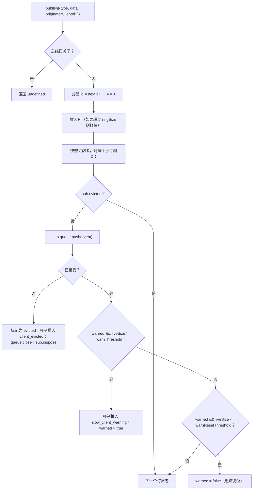

# SSE 事件总线与背压

## 概述

`EventBus` (`packages/acp-bridge/src/eventBus.ts`) 是每个会话的内存中发布/订阅机制，为守护进程的 `GET /session/:id/events` SSE 路由提供数据。它为每个事件分配一个单调递增的 ID，将近期事件缓冲在有限环中用于 `Last-Event-ID` 重放，将发布的事件广播给所有订阅者，对每个订阅者施加背压（队列填充率达到 75% 时发出警告，达到上限时驱逐），并发出两个合成终止帧（`client_evicted`、`slow_client_warning`），SDK 将其视为一等事件，但总线标记它们**不带 `id`**，因此不会消耗每个会话序列中的槽位。

`EventBus` 当前对 `acp-bridge` 是包私有的，由桥接工厂通过每个会话的一个闭包实例使用。未来的重构（在 `eventBus.ts` 的第 150-159 行指出）将把它提升为顶级构建块，这样通道、双输出和未来的 WebSocket 传输可以通过同一个总线订阅，而不是运行并行流。

## 职责

- 为每个会话分配从 1 开始的单调递增事件 ID。
- 缓冲最近的 `ringSize` 个事件，用于在带 `lastEventId` 订阅时重放。
- 将发布的事件扇出到最多 `maxSubscribers` 个并发订阅者。
- 对每个订阅者应用有界队列；丢弃溢出的订阅者，并附带一个合成的 `client_evicted` 终止帧。
- 在队列填充率达到 75% 时发出 `slow_client_warning`，每次溢出事件只发一次，并带有 37.5% 的迟滞以避免重复警告。
- 在 `AbortSignal.abort()` 时立即拆除订阅。
- 在总线关闭时（如会话拆除）干净地关闭每个订阅者。
- `publish` 永远不会抛出异常（契约是“publish 总是可以安全调用”）。

## 架构

| 常量                               | 值         | 用途                                                                                            |
| ---------------------------------- | ---------- | ----------------------------------------------------------------------------------------------- |
| `EVENT_SCHEMA_VERSION`             | `1`        | 标记在每个 `BridgeEvent.v` 上；在破坏性帧变化时增加。                                            |
| `DEFAULT_RING_SIZE`                | `8000`     | 每会话重放环。操作员可以通过 `--event-ring-size` 覆盖。                                          |
| `DEFAULT_MAX_QUEUED`               | `256`      | 每订阅者积压上限。                                                                              |
| `DEFAULT_MAX_SUBSCRIBERS`          | `64`       | 每会话订阅者上限。                                                                              |
| `WARN_THRESHOLD_RATIO`             | `0.75`     | `slow_client_warning` 触发的 `maxQueued` 比例。                                                  |
| `WARN_RESET_RATIO`                 | `0.375`    | 迟滞复位比例。                                                                                  |
| `MAX_EVENT_RING_SIZE`（在 `bridge.ts` 中） | `1_000_000` | `BridgeOptions.eventRingSize` 的软上限，用于捕获因拼写错误导致的内存不足故障。                      |

### `BridgeEvent`

```ts
interface BridgeEvent {
  id?: number; // 每会话单调递增；合成终止帧中不存在
  v: 1; // EVENT_SCHEMA_VERSION
  type: string; // 43 种已知类型之一或未来可扩展类型
  data: unknown; // 载荷（SDK 按类型定义类型；参见 09-event-schema.md）
  originatorClientId?: string; // 当事件源自带有 clientId 标记的请求时设置
}
```

### `SubscribeOptions`

```ts
interface SubscribeOptions {
  lastEventId?: number; // 从此 ID 之后重放（Last-Event-ID 恢复）
  signal?: AbortSignal; // 立即中止订阅
  maxQueued?: number; // 每订阅者积压上限；默认 256
}
```

`subscribe()` 返回一个 `AsyncIterable<BridgeEvent>`。SSE 路由使用 `for await` 消费它。注册是**同步的**——到 `subscribe()` 返回时，订阅者已经附加，因此与消费者第一个 `next()` 并发的 `publish()` 仍然会送达。

### `BoundedAsyncQueue`

每个订阅者的队列。两个关键行为：

- **活跃上限仅适用于活跃项。** 通过 `forcePush()` 插入的项携带 `forced: true` 标签，且不计入 `maxSize`。这使得 `Last-Event-ID` 重放路径可以将数百个历史帧强制推入新订阅者，而不会立即触发活跃上限并驱逐刚刚恢复的订阅者。
- **`liveCount` 作为字段维护**，而不是从 `forcedInBuf` 位置派生。早期的基于位置的启发式逻辑在 `slow_client_warning` 开始强制推入中间位置（警告进入队列的尾部，而不是像重放那样进入头部）时失效。基于条目的 `forced` 标签与位置无关。

`push(value)` 在活跃积压达到上限时返回 `false`（而不是阻塞或抛出）——总线使用该信号来驱逐订阅者。`forcePush(value)` 绕过上限。`close({drain?: boolean})` 默认排空待处理项；中止路径传递 `drain: false` 以立即丢弃。

## 工作流程

### 发布



`publish` 绝不抛出。在发布过程中关闭总线（关闭路径会在等待 `channel.kill()` 之前关闭每个会话的总线）返回 `undefined` 而不是抛出，因为代理可能在总线关闭和通道终止之间的短暂窗口内仍然发出 `sessionUpdate` 通知。

### 订阅 + 重放（带环驱逐检测）

```mermaid
sequenceDiagram
    autonumber
    participant SR as SSE 路由
    participant EB as EventBus
    participant Q as BoundedAsyncQueue

    SR->>EB: subscribe({lastEventId: 42, maxQueued: 256, signal})
    EB->>EB: 如果 subs.size >= maxSubscribers 则拒绝<br/>(抛出 SubscriberLimitExceededError)
    EB->>Q: new BoundedAsyncQueue(256)
    EB->>EB: subs.add(sub)
    EB->>EB: epochReset = lastEventId >= nextId
    alt epochReset（旧总线时期）
        EB->>Q: forcePush state_resync_required<br/>{ reason: 'epoch_reset', lastDeliveredId: 42, earliestAvailableId: ring[0]?.id ?? nextId }
        Note over EB,Q: 无 ID 的合成帧，放在重放之前。<br/>重放扫描整个当前环。
    else 同一总线时期
        EB->>EB: earliestInRing = ring[0]?.id
        opt earliestInRing > lastEventId + 1（间隙已驱逐）
            EB->>Q: forcePush state_resync_required<br/>{ reason: 'ring_evicted', lastDeliveredId: 42, earliestAvailableId: earliestInRing }
            Note over EB,Q: 无 ID 的合成帧，放在重放之前。<br/>流保持打开；SDK reducer 翻转 awaitingResync。
        end
    end
    loop 环扫描
        EB->>EB: 对于 ring 中的 e，其中 e.id > (epochReset ? 0 : 42)
        EB->>Q: forcePush(e)
    end
    EB->>EB: 附加 AbortSignal 监听器<br/>(onAbort → queue.close({drain:false}); dispose)
    EB-->>SR: AsyncIterable
    SR->>Q: 在 for-await 循环中 next()
```

如果在订阅时 `subs.size >= maxSubscribers`，则抛出 `SubscriberLimitExceededError`——SSE 路由会捕获它并向被拒绝的客户端序列化一个 `stream_error` 合成帧，这样他们就不会看到静默的空流。如果返回一个空的可迭代对象，操作员将无法发现“某些客户端收到事件，某些没有”的问题。

### 环驱逐 → `state_resync_required`（恢复流程）

当消费者使用 `Last-Event-ID: N` 重新连接，且环中最早幸存事件具有 `id > N + 1` 时，`[N+1, earliestInRing-1]` 中的事件在消费者重新连接之前已被驱逐。朴素的重放会静默成功并提供一个不连续的尾部，SDK reducer 会继续应用增量，仿佛流是连续的，其状态将与守护进程的真实状态产生分歧——且没有终止信号。

实现在 `EventBus.subscribe()` 中：

1. 首先检查 `opts.lastEventId >= this.nextId`。如果为真，则客户端游标来自更早的总线时期（守护进程重启 / EventBus 重建），因此总线发出 `reason: 'epoch_reset'` 并重放整个当前环。
2. 否则计算 `earliestInRing = this.ring[0]?.id`。
3. 如果 `earliestInRing > opts.lastEventId + 1`，则在重放帧**之前**强制推入一个合成帧：
   ```jsonc
   {
     "v": 1,
     "type": "state_resync_required",
     "data": {
       "reason": "ring_evicted",
       "lastDeliveredId": <opts.lastEventId>,
       "earliestAvailableId": <earliestInRing>
     }
   }
   ```
4. 之后继续正常的重放循环。

关键契约（以及 #4360 审查修正的内容）：

- **无 `id`**——与 `client_evicted` 相同的无槽位模式，因此不占用其他订阅者观察到的会话单调序列中的槽位。
- **流保持打开**——与 `client_evicted`（真正终止）不同，`state_resync_required` 是面向恢复的。重放和实时帧随后继续流动。
- **Reducer 自动跳过增量**——SDK 侧将 `awaitingResync` 翻转为 `true`，并且仅应用 `state_resync_required`、终止帧和完整状态快照，直到消费者代码调用 `loadSession` 并清除该标志。参见 [`09-event-schema.md`](./09-event-schema.md) 中的 `RESYNC_PASSTHROUGH_TYPES`。
- **网络友好**——帧保持在线上，因此 SDK 稍后可以计算“你错过了什么”的差异（如果需要）。不需要额外的重新连接循环。

### 驱逐终止流程

当订阅者的活跃积压已达到 `maxQueued` 且下一次 `push()` 返回 `false` 时：

1. 标记 `sub.evicted = true`。
2. 构造 `client_evicted` 帧，**不带 `id`**——`{ v: 1, type: 'client_evicted', data: { reason: 'queue_overflow', droppedAfter: <last delivered id> } }`。
3. `queue.forcePush(evictionFrame)`，以便消费者迭代器看到一个终止帧。
4. `queue.close()`，以便迭代在终止帧后结束。
5. 调用 `sub.dispose()`——从 `subs` 中移除并分离 `AbortSignal` 监听器；没有此清理，停滞的消费者的闭包将一直存活到 `AbortSignal` 被垃圾回收。

### 中止流程

`AbortSignal.abort()` → `onAbort()`：

1. `queue.close({drain: false})`——丢弃缓冲项，这样 SSE 路由就不会继续向无人监听的套接字序列化事件。
2. `dispose()`——通过 `disposed` 标志实现幂等。

在订阅时为已中止的信号会在返回迭代器之前同步调用 `onAbort()`。

## 状态与生命周期

- `nextId` 从 1 开始，只会递增。`lastEventId` getter 返回 `nextId - 1`。
- `ring` 是有界的；因移位导致的驱逐是 O(n) 的。在 `ringSize=8000` 时，在高容量会话上测量为几毫秒——远低于每帧延迟预算。环形缓冲区的重构已推迟，直到性能分析标记它或操作员将 `--event-ring-size` 增加一个数量级。
- `close()` 翻转 `closed`，关闭每个订阅者的队列，并清除 `subs`。后续的 `publish()` / `subscribe()` 都是空操作（`publish` 返回 undefined；`subscribe` 返回 `emptyAsyncIterable`）。
- 每个会话拥有一个 `EventBus`。总线关闭发生在 `channel.kill()` 之前，因此关闭期间正在进行的发布返回 undefined 而不是抛出异常。

## 依赖关系

- 由 `packages/acp-bridge/src/bridge.ts` 使用（`BridgeClient.sessionUpdate` / `BridgeClient.extNotification` → `events.publish(...)`）。
- 由 `packages/cli/src/serve/server.ts` 使用（SSE 路由处理器 → `events.subscribe(...)` 然后将 `BridgeEvent` 格式化为 SSE 线缆帧）。
- 重新导出垫片：`packages/cli/src/serve/event-bus.ts` → `@qwen-code/acp-bridge/eventBus`。
- SDK 消费者：`packages/sdk-typescript/src/daemon/sse.ts`（`parseSseStream`），然后是 `asKnownDaemonEvent`（参见 [`09-event-schema.md`](./09-event-schema.md)，[`13-sdk-daemon-client.md`](./13-sdk-daemon-client.md)）。

## 配置

- `--event-ring-size <n>`——每会话环深度；软上限为 `MAX_EVENT_RING_SIZE = 1_000_000`。
- 订阅者 `?maxQueued=N` 查询参数在 `GET /session/:id/events` 上，范围 `[16, 2048]`。SDK 客户端在选择加入之前会预检 `caps.features.slow_client_warning`。
- `BridgeOptions.eventRingSize`（覆盖内嵌使用的守护进程默认值）。
- 能力标签：`session_events`、`slow_client_warning`、`typed_event_schema`。

## 注意事项与已知限制

- **合成帧没有 `id`。** 使用 `Last-Event-ID` 恢复的 SDK 消费者仅记录带有 id 的帧；`slow_client_warning`、`client_evicted`、`state_resync_required` 和 `replay_complete` 不会推进游标，也不会消耗每个会话的序列号。如果两个带 id 的实时帧之间存在真实间隙，请通过环驱逐/时期重置重新同步路径处理，而不是将其视为私有合成帧。
- `client_evicted` 是**每个订阅者**的，而不是每个会话的。同一客户端可以重新连接。
- `BoundedAsyncQueue` 迭代器**不适合并发驱动**——两个同时的 `.next()` 调用会竞争同一个事件。守护进程使用是顺序的（SSE 路由处理器中的 `for await ... of`），因此生产环境是安全的。
- 总线当前是包私有的；通道和 Web UI 必须通过守护进程的 HTTP SSE 路由订阅，而不是直接进入总线。阶段 1.5 将提升这一点。

## 参考

- `packages/acp-bridge/src/eventBus.ts`（整个文件）
- `packages/acp-bridge/src/bridge.ts`（发布位置，特别是 `BridgeClient.sessionUpdate` 和 F3 权限事件）
- `packages/cli/src/serve/server.ts`（SSE 路由处理器——将 `BridgeEvent` 格式化为线缆 SSE）
- `packages/sdk-typescript/src/daemon/sse.ts`（客户端侧的 SSE 线缆解析器）
- 线缆参考：[`../qwen-serve-protocol.md`](../qwen-serve-protocol.md)（`Last-Event-ID` 重新连接契约）。