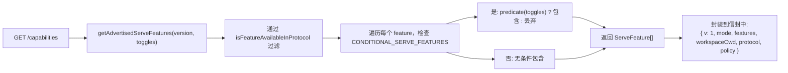
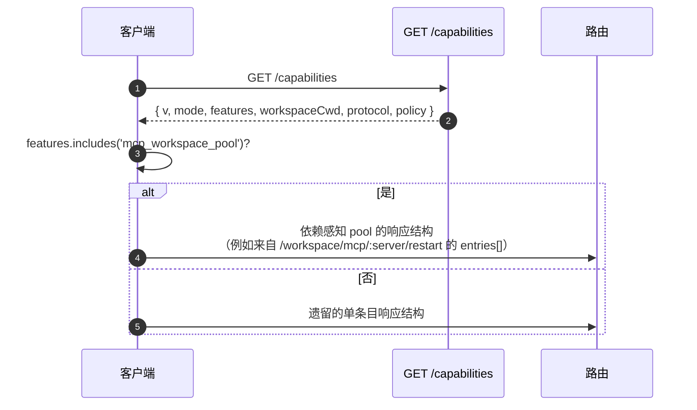

# 能力与协议版本控制

## 概述

`GET /capabilities` 是 daemon 的预检端点。每个 SDK 客户端在调用任何其他路由之前都应读取此端点，以便了解 daemon 使用的协议版本、启用了哪些功能标签，以及 daemon 绑定到了哪个 workspace。契约如下：

- **目前只有一个协议版本：`v1`。** `SERVE_PROTOCOL_VERSION = 'v1'` 且 `SUPPORTED_SERVE_PROTOCOL_VERSIONS = ['v1']`。v1 内部采用增量更新；破坏性的 frame 结构变更保留给 v2。
- **每个标签都有一个 `since` 版本。** 未来的 v2 daemon 可以同时广播 v1 和 v2 标签。
- **部分标签是有条件的。** 十三个标签（`require_auth`, `mcp_workspace_pool`, `mcp_pool_restart`, `allow_origin`, `prompt_absolute_deadline`, `writer_idle_timeout`, `workspace_settings`, `workspace_voice`, `workspace_voice_transcription`, `session_shell_command`, `rate_limit`, `workspace_reload`, `voice_transcribe`）仅在启用相应的部署开关时才会被广播。标签的存在意味着对应行为的存在。
- **能力标签 = 行为契约。** 在现有标签下添加新行为可能会悄无声息地破坏那些预检了旧标签的客户端。新行为需要新标签。

完整的注册表位于 `packages/cli/src/serve/capabilities.ts`。

## 职责

- 声明 daemon 可能广播的每个功能。
- 根据协议版本和部署开关过滤广播的功能。
- 暴露 `getRegisteredServeFeatures()`（所有键，未过滤）、`getAdvertisedServeFeatures(version, toggles)`（已过滤）和 `getServeProtocolVersions()`（信封 `{ current, supported }`）。
- 保持“标签存在即行为存在”的不变量。`server.test.ts` 包含一个测试，确保每个条件标签在其开关打开时都会被广播；添加没有谓词（predicate）的条件标签会导致该测试失败。

## 架构

### 能力信封

`/capabilities` 返回：

```ts
{
  v: 1,                    // CAPABILITIES_SCHEMA_VERSION
  mode: 'http-bridge',
  features: ServeFeature[],
  workspaceCwd: string,
  protocol?: { current: 'v1', supported: ['v1'] },
  policy?: { permission: PermissionPolicy },
}
```

`workspaceCwd` 是 daemon 启动时绑定的标准 workspace（参见 [`02-serve-runtime.md`](./02-serve-runtime.md)）。`policy.permission` 是当前生效的中介策略。

### `ServeCapabilityDescriptor`

```ts
interface ServeCapabilityDescriptor {
  since: ServeProtocolVersion; // current = 'v1'
  modes?: readonly string[]; // lists operation modes when a feature has modes
}
```

四个 v1 标签使用了 `modes`：

- `mcp_guardrails: { since: 'v1', modes: ['warn', 'enforce'] }` - 客户端在依赖拒绝行为之前应预检 `'enforce'`。
- `permission_mediation: { since: 'v1', modes: ['first-responder', 'designated', 'consensus', 'local-only'] }` - 这是构建时支持的集合；当前生效的策略位于 `policy.permission` 中。
- `workspace_voice_transcription: { since: 'v1', modes: ['batch'] }` - daemon 提供的转录路径。
- `voice_transcribe: { since: 'v1', modes: ['streaming', 'batch'] }` - `/voice/stream` WebSocket 上可用的两种转录路径。

### 条件标签

```ts
export const CONDITIONAL_SERVE_FEATURES: ReadonlyMap<
  ServeFeature,
  (toggles: AdvertiseFeatureToggles) => boolean
> = new Map([
  ['require_auth', (t) => t.requireAuth === true],
  ['mcp_workspace_pool', (t) => t.mcpPoolActive === true],
  ['mcp_pool_restart', (t) => t.mcpPoolActive === true],
  ['allow_origin', (t) => t.allowOriginActive === true],
  [
    'prompt_absolute_deadline',
    (t) => typeof t.promptDeadlineMs === 'number' && t.promptDeadlineMs > 0,
  ],
  [
    'writer_idle_timeout',
    (t) =>
      typeof t.writerIdleTimeoutMs === 'number' && t.writerIdleTimeoutMs > 0,
  ],
  ['workspace_settings', (t) => t.persistSettingAvailable === true],
  ['workspace_voice', (t) => t.persistSettingAvailable === true],
  [
    'workspace_voice_transcription',
    (t) => t.voiceTranscriptionAvailable === true,
  ],
  ['session_shell_command', (t) => t.sessionShellCommandEnabled === true],
  ['rate_limit', (t) => t.rateLimit === true],
  ['workspace_reload', (t) => t.reloadAvailable === true],
  ['voice_transcribe', (t) => t.voiceWsAvailable !== false],
]);
```

该 `Map` 将成员资格和谓词存储在一起。添加新的条件标签需要协调进行两项更改：

1. 在 `SERVE_CAPABILITY_REGISTRY` 中注册该标签及其 `since` 版本。
2. 将其谓词添加到 `CONDITIONAL_SERVE_FEATURES`。

基线标签不在 `Map` 中，并且会被无条件广播。这是有意通过“缺失”来表示的，而不是使用单独的 Set。

### 75 个标签（v1，按领域分组）

基础：`health`, `daemon_status`, `capabilities`。

会话：`session_create`, `session_scope_override`, `session_load`, `session_resume`, `unstable_session_resume`, `session_list`, `session_prompt`, `session_cancel`, `session_events`, `session_set_model`, `session_close`, `session_metadata`, `session_context`, `session_context_usage`, `session_supported_commands`, `session_tasks`, `session_stats`, `session_lsp`, `session_status`, `session_approval_mode_control`, `session_recap`, `session_btw`, **`session_shell_command`** (conditional), `session_language`, `session_rewind`, `session_hooks`, `session_branch`。

流式传输：`slow_client_warning`, `typed_event_schema`。

身份与心跳：`client_identity`, `client_heartbeat`。

权限：`session_permission_vote`, `permission_vote`, **`permission_mediation`** (`modes: ['first-responder', 'designated', 'consensus', 'local-only']`)。

Workspace 只读快照：`workspace_mcp`, `workspace_skills`, `workspace_providers`, `workspace_env`, `workspace_preflight`, `workspace_hooks`, `workspace_extensions`。

Workspace 变更（Wave 4+）：`workspace_memory`, `workspace_agents`, `workspace_agent_generate`, `workspace_tool_toggle`, **`workspace_settings`** (conditional), `workspace_permissions`, `workspace_init`, `workspace_github_setup`, `workspace_trust`, `workspace_mcp_restart`, `workspace_mcp_manage`, `workspace_file_read`, `workspace_file_bytes`, `workspace_file_write`, **`workspace_reload`** (conditional)。

MCP 防护栏：**`mcp_guardrails`** (`modes: ['warn', 'enforce']`), `mcp_guardrail_events`, `mcp_server_runtime_mutation`, **`mcp_workspace_pool`** (conditional), **`mcp_pool_restart`** (conditional)。

Prompt 控制：**`prompt_absolute_deadline`** (conditional), **`writer_idle_timeout`** (conditional), `non_blocking_prompt`。

认证：`auth_provider_install`, `auth_device_flow`, **`require_auth`** (conditional), **`allow_origin`** (conditional)。

语音：**`workspace_voice`** (conditional), **`workspace_voice_transcription`** (conditional, `modes: ['batch']`), **`voice_transcribe`** (conditional, `modes: ['streaming', 'batch']`)。

速率限制：**`rate_limit`** (conditional)。

加粗的标签具有 `modes` 或为条件标签。

## 流程

### Daemon 端：组装信封



### 客户端：功能预检



## 状态与生命周期

- `CAPABILITIES_SCHEMA_VERSION` 是网络信封结构版本，当前为 `1`。仅在信封结构发生破坏性变更时才升级。
- `SERVE_PROTOCOL_VERSION = 'v1'` 是协议-功能版本。在 v1 内部添加功能是增量的；旧客户端不会看到新行为，除非它们预检了新标签。移除功能属于 v2 的破坏性变更。
- `EVENT_SCHEMA_VERSION = 1` 是 SSE frame 的 `v` 字段（参见 [`09-event-schema.md`](./09-event-schema.md)）。它是一个独立的版本轴；升级 event schema 并不意味着升级协议版本，反之亦然。
- `session_resume` 是 `POST /session/:id/resume` 的稳定 daemon 能力。`unstable_session_resume` 仍作为已弃用的别名被广播，因为底层的 ACP 方法仍命名为 `connection.unstable_resumeSession`；新客户端应通过功能检测来使用 `session_resume`。

## 依赖

- 在构建 `/capabilities` 响应时由 `packages/cli/src/serve/server.ts` 读取。
- 开关输入来自 `runQwenServe` / `createServeApp`：`{ requireAuth, mcpPoolActive, allowOriginActive, promptDeadlineMs, writerIdleTimeoutMs, persistSettingAvailable, sessionShellCommandEnabled, rateLimit, reloadAvailable }`。
- 信封中生效的 `permission` 策略来自 `BridgeOptions.permissionPolicy`，而后者读取 `settings.json` 中的 `policy.permissionStrategy`。

## 配置

| 来源                     | 配置项                                                            | 对能力的影响                                                                                                        |
| -------------------------- | --------------------------------------------------------------- | ----------------------------------------------------------------------------------------------------------------------------- |
| CLI 参数                   | `--require-auth`                                                | 广播 `require_auth`。                                                                                                    |
| 环境变量                        | `QWEN_SERVE_NO_MCP_POOL=1`                                      | 停止广播 `mcp_workspace_pool` 和 `mcp_pool_restart`；MCP 事件不再标记 `scope: 'workspace'`。               |
| CLI 参数                   | `--mcp-client-budget=N`, `--mcp-budget-mode={off,warn,enforce}` | 不改变标签集（`mcp_guardrails` 始终被广播），但会改变每个 server 的预留和拒绝行为。 |
| CLI 参数 / 环境变量             | `--rate-limit` / `QWEN_SERVE_RATE_LIMIT=1`                      | 广播 `rate_limit`。                                                                                                      |
| 嵌入式选项            | `persistSettingAvailable`                                       | 广播 `workspace_settings` 和 `workspace_voice`。                                                                        |
| 嵌入式选项            | `voiceTranscriptionAvailable`                                   | 广播 `workspace_voice_transcription`。                                                                                   |
| CLI 参数 / 嵌入式选项 | `--enable-session-shell` / `sessionShellCommandEnabled`         | 广播 `session_shell_command`。                                                                                           |
| 嵌入式选项            | `reloadAvailable`                                               | 广播 `workspace_reload`。                                                                                                |
| 嵌入式选项            | `voiceWsAvailable`                                              | 广播 `voice_transcribe`。                                                                                                |
| `settings.json`            | `policy.permissionStrategy`                                     | 设置信封中的 `policy.permission`。                                                                                            |

## 注意事项与已知限制

- **`--require-auth` 会隐藏预检。** 启用 `--require-auth` 后，所有路由（包括 `/capabilities`）都需要 bearer 认证。未经认证的客户端无法预检 `caps.features.require_auth`；401 响应体就是发现该信息的途径。`require_auth` 标签是为加固部署的审计 UI 提供的认证确认。
- **标签存在即代表行为存在。** 如果未来的贡献者在现有标签下添加新行为而不升级 `since`，预检了旧标签的客户端可能会悄无声息地接收到新行为。约定是：新行为必须使用新标签。
- **`unstable_*` 标签的结构可能会在版本间发生变化**，而无需升级协议版本。依赖它们时请锁定 SDK 版本。
- 路由目录位于 [`../qwen-serve-protocol.md`](../qwen-serve-protocol.md)；本页面有意不重复该内容。

## 参考

- `packages/cli/src/serve/capabilities.ts`
- `packages/cli/src/serve/types.ts` (`ServeOptions`, `CapabilitiesEnvelope`)
- `packages/cli/src/serve/server.ts` (envelope assembly)
- `packages/acp-bridge/src/eventBus.ts` (`EVENT_SCHEMA_VERSION`)
- Wire reference: [`../qwen-serve-protocol.md`](../qwen-serve-protocol.md)
- Auth and deployment guardrails: [`12-auth-security.md`](./12-auth-security.md)