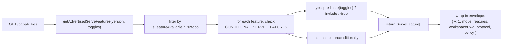
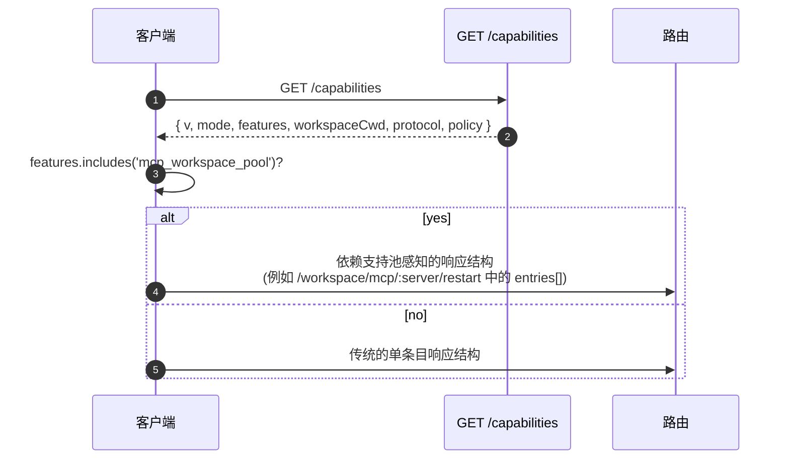

# 能力与协议版本控制

## 概述

`GET /capabilities` 是守护进程的预检端点。每个 SDK 客户端在调用任何其他路由之前都应读取此端点，以便了解守护进程使用的协议版本、启用了哪些功能标签以及守护进程绑定到哪个工作空间。约定如下：

- **只有一个协议版本：`v1`。** `SERVE_PROTOCOL_VERSION = 'v1'` 且 `SUPPORTED_SERVE_PROTOCOL_VERSIONS = ['v1']`。v1 内部是增量的；破坏性帧结构变更保留给 v2。
- **每个标签都有一个 `since` 版本。** 未来的 v2 守护进程可以同时公布 v1 和 v2 标签。
- **某些标签是有条件的。** 十个标签（`require_auth`、`mcp_workspace_pool`、`mcp_pool_restart`、`allow_origin`、`prompt_absolute_deadline`、`writer_idle_timeout`、`workspace_settings`、`session_shell_command`、`rate_limit`、`workspace_reload`）仅在相应部署开关启用时才会公布。标签存在表示该行为存在。
- **能力标签 = 行为契约。** 在现有标签下添加新行为可能会静默破坏已预检旧标签的客户端。新行为需要新标签。

完整注册表位于 `packages/cli/src/serve/capabilities.ts`。

## 职责

- 声明守护进程可能公布的所有功能。
- 根据协议版本和部署开关过滤公布的功能。
- 暴露 `getRegisteredServeFeatures()`（所有键，未过滤）、`getAdvertisedServeFeatures(version, toggles)`（已过滤）和 `getServeProtocolVersions()`（信封 `{ current, supported }`）。
- 维持“标签存在即行为存在”的不变性。`server.test.ts` 包含一个测试，验证每个条件标签在其开关开启时都会公布；添加没有谓词的条件标签会导致该测试失败。

## 架构

### 能力信封

`/capabilities` 返回：

```ts
{
  v: 1,                    // CAPABILITIES_SCHEMA_VERSION
  mode: 'http-bridge',
  features: ServeFeature[],
  workspaceCwd: string,
  protocol?: { current: 'v1', supported: ['v1'] },
  policy?: { permission: PermissionPolicy },
}
```

`workspaceCwd` 是守护进程启动时绑定的规范工作空间（参见 [`02-serve-runtime.md`](./02-serve-runtime.md)）。`policy.permission` 是当前的调解器策略。

### `ServeCapabilityDescriptor`

```ts
interface ServeCapabilityDescriptor {
  since: ServeProtocolVersion; // current = 'v1'
  modes?: readonly string[]; // 列出功能所具有的操作模式
}
```

两个 v1 标签使用 `modes`：

- `mcp_guardrails: { since: 'v1', modes: ['warn', 'enforce'] }` - 客户端在依赖拒绝行为前应预检 `'enforce'`。
- `permission_mediation: { since: 'v1', modes: ['first-responder', 'designated', 'consensus', 'local-only'] }` - 这是构建时支持的集合；活动策略在 `policy.permission` 中。

### 条件标签

```ts
export const CONDITIONAL_SERVE_FEATURES: ReadonlyMap<
  ServeFeature,
  (toggles: AdvertiseFeatureToggles) => boolean
> = new Map([
  ['require_auth', (t) => t.requireAuth === true],
  ['mcp_workspace_pool', (t) => t.mcpPoolActive === true],
  ['mcp_pool_restart', (t) => t.mcpPoolActive === true],
  ['allow_origin', (t) => t.allowOriginActive === true],
  [
    'prompt_absolute_deadline',
    (t) => typeof t.promptDeadlineMs === 'number' && t.promptDeadlineMs > 0,
  ],
  [
    'writer_idle_timeout',
    (t) =>
      typeof t.writerIdleTimeoutMs === 'number' && t.writerIdleTimeoutMs > 0,
  ],
  ['workspace_settings', (t) => t.persistSettingAvailable === true],
  ['session_shell_command', (t) => t.sessionShellCommandEnabled === true],
  ['rate_limit', (t) => t.rateLimit === true],
  ['workspace_reload', (t) => t.reloadAvailable === true],
]);
```

`Map` 同时存储成员关系和谓词。添加新的条件标签需要两个协调的更改：

1. 在 `SERVE_CAPABILITY_REGISTRY` 中注册该标签及其 `since` 版本。
2. 将其谓词添加到 `CONDITIONAL_SERVE_FEATURES`。

基线标签不存在于 `Map` 中，且无条件公布。这有意通过缺失而不是单独的 Set 来表示。

### 67 个标签（v1，按领域分组）

基础：`health`、`capabilities`。

会话：`session_create`、`session_scope_override`、`session_load`、`session_resume`、`unstable_session_resume`、`session_list`、`session_prompt`、`session_cancel`、`session_events`、`session_set_model`、`session_close`、`session_metadata`、`session_context`、`session_context_usage`、`session_supported_commands`、`session_tasks`、`session_stats`、`session_lsp`、`session_status`、`session_approval_mode_control`、`session_recap`、`session_btw`、**`session_shell_command`**（条件）、`session_language`、`session_rewind`、`session_hooks`、`session_branch`。

流式传输：`slow_client_warning`、`typed_event_schema`。

身份与心跳：`client_identity`、`client_heartbeat`。

权限：`session_permission_vote`、`permission_vote`、**`permission_mediation`**（`modes: ['first-responder', 'designated', 'consensus', 'local-only']`）。

工作空间只读快照：`workspace_mcp`、`workspace_skills`、`workspace_providers`、`workspace_env`、`workspace_preflight`、`workspace_hooks`、`workspace_extensions`。

工作空间变更（Wave 4+）：`workspace_memory`、`workspace_agents`、`workspace_agent_generate`、`workspace_tool_toggle`、**`workspace_settings`**（条件）、`workspace_init`、`workspace_mcp_restart`、`workspace_mcp_manage`、`workspace_file_read`、`workspace_file_bytes`、`workspace_file_write`、**`workspace_reload`**（条件）。

MCP 护栏：**`mcp_guardrails`**（`modes: ['warn', 'enforce']`）、`mcp_guardrail_events`、`mcp_server_runtime_mutation`、**`mcp_workspace_pool`**（条件）、**`mcp_pool_restart`**（条件）。

提示控制：**`prompt_absolute_deadline`**（条件）、**`writer_idle_timeout`**（条件）、`non_blocking_prompt`。

认证：`auth_provider_install`、`auth_device_flow`、**`require_auth`**（条件）、**`allow_origin`**（条件）。

速率限制：**`rate_limit`**（条件）。

粗体标签具有 `modes` 或是条件标签。

## 流程

### 守护进程端：组装信封



### 客户端端：功能预检



## 状态与生命周期

- `CAPABILITIES_SCHEMA_VERSION` 是线缆信封形状的版本，当前为 `1`。仅在信封发生破坏性变更时增加。
- `SERVE_PROTOCOL_VERSION = 'v1'` 是协议功能版本。在 v1 内部添加功能是增量的；旧客户端除非预检新标签，否则不会看到新行为。移除功能属于 v2 的破坏性变更。
- `EVENT_SCHEMA_VERSION = 1` 是 SSE 帧的 `v` 字段（参见 [`09-event-schema.md`](./09-event-schema.md)）。它是一个独立的版本轴；事件模式的变更不意味着协议版本变更，反之亦然。
- `session_resume` 用于 `POST /session/:id/resume` 的稳定守护进程能力。`unstable_session_resume` 仍作为已弃用的别名公布，因为底层的 ACP 方法仍命名为 `connection.unstable_resumeSession`；新客户端应通过功能检测 `session_resume`。

## 依赖关系

- 由 `packages/cli/src/serve/server.ts` 在构建 `/capabilities` 响应时读取。
- 开关输入来自 `runQwenServe` / `createServeApp`：`{ requireAuth, mcpPoolActive, allowOriginActive, promptDeadlineMs, writerIdleTimeoutMs, persistSettingAvailable, sessionShellCommandEnabled, rateLimit, reloadAvailable }`。
- 信封中的活动 `permission` 策略来自 `BridgeOptions.permissionPolicy`，它本身读取 `settings.json` 的 `policy.permissionStrategy`。

## 配置

| 来源                          | 控制旋钮                                                         | 对能力的影响                                                                                                                                                     |
| ----------------------------- | ---------------------------------------------------------------- | ---------------------------------------------------------------------------------------------------------------------------------------------------------------- |
| CLI 标志                      | `--require-auth`                                                 | 公布 `require_auth`。                                                                                                                                            |
| 环境变量                      | `QWEN_SERVE_NO_MCP_POOL=1`                                       | 停止公布 `mcp_workspace_pool` 和 `mcp_pool_restart`；MCP 事件不再标记 `scope: 'workspace'`。                                                                        |
| CLI 标志                      | `--mcp-client-budget=N`、`--mcp-budget-mode={off,warn,enforce}`  | 不改变标签集（`mcp_guardrails` 始终公布），但会更改每服务器预留和拒绝行为。                                                                                        |
| CLI 标志 / 环境变量           | `--rate-limit` / `QWEN_SERVE_RATE_LIMIT=1`                      | 公布 `rate_limit`。                                                                                                                                               |
| 内嵌选项                      | `persistSettingAvailable`                                        | 公布 `workspace_settings`。                                                                                                                                       |
| CLI 标志 / 内嵌选项            | `--enable-session-shell` / `sessionShellCommandEnabled`          | 公布 `session_shell_command`。                                                                                                                                    |
| 内嵌选项                      | `reloadAvailable`                                                | 公布 `workspace_reload`。                                                                                                                                         |
| `settings.json`               | `policy.permissionStrategy`                                      | 设置信封的 `policy.permission`。                                                                                                                                  |

## 注意事项与已知限制

- **`--require-auth` 隐藏预检。** 启用 `--require-auth` 后，包括 `/capabilities` 在内的所有路由都需要 bearer 认证。未经认证的客户端无法预检 `caps.features.require_auth`；401 响应体是发现接口。`require_auth` 标签是用于强化部署审计 UI 的已认证确认。
- **标签存在即行为存在。** 如果未来的贡献者在现有标签下添加行为而未增加 `since`，则已预检旧标签的客户端可能会静默接收新行为。约定是：新行为应有新标签。
- **`unstable_*` 标签可以在不进行协议版本升级的情况下在版本之间更改形状。** 依赖它们时请固定 SDK 版本。
- 路由目录位于 [`../qwen-serve-protocol.md`](../qwen-serve-protocol.md)；本页面有意不重复它。

## 参考

- `packages/cli/src/serve/capabilities.ts`
- `packages/cli/src/serve/types.ts`（`ServeOptions`、`CapabilitiesEnvelope`）
- `packages/cli/src/serve/server.ts`（信封组装）
- `packages/acp-bridge/src/eventBus.ts`（`EVENT_SCHEMA_VERSION`）
- 线缆参考：[`../qwen-serve-protocol.md`](../qwen-serve-protocol.md)
- 认证与部署护栏：[`12-auth-security.md`](./12-auth-security.md)